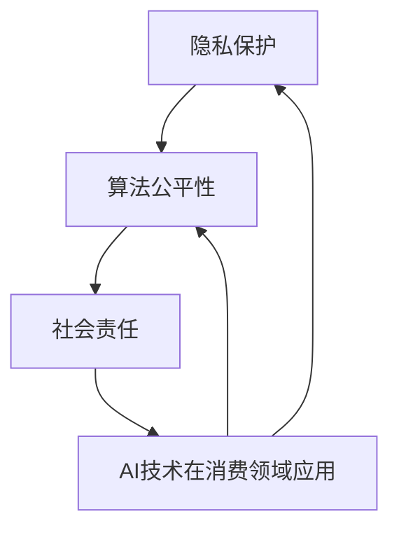

                 

关键词：AI时代，消费伦理，算法推荐，数据分析，隐私保护，用户行为，个性化服务，社会责任

> 摘要：随着人工智能技术的飞速发展，其在消费领域的应用日益广泛。然而，这一趋势也引发了对消费伦理的深入探讨。本文旨在分析AI时代消费伦理的现状和挑战，探讨如何在满足用户需求的同时，维护社会公平和道德底线。

## 1. 背景介绍

人工智能（AI）作为当前科技领域的前沿技术，已经渗透到我们生活的方方面面。从智能手机到智能家居，从电子商务到社交媒体，AI正通过算法推荐、数据分析等方式，深刻改变着我们的消费行为和习惯。然而，AI技术在消费领域中的应用也带来了诸多伦理问题，如隐私侵犯、算法歧视、消费依赖等。

### 1.1 AI在消费领域的应用

AI在消费领域的应用主要体现在以下几个方面：

1. **个性化推荐**：通过分析用户的浏览记录、购物行为等数据，AI算法可以推荐用户可能感兴趣的商品和服务。
2. **用户行为分析**：AI可以追踪和分析用户的在线行为，为企业提供精准的市场洞察。
3. **智能客服**：AI客服机器人能够快速响应用户的咨询，提高客户满意度。
4. **消费预测**：通过分析历史数据和当前市场趋势，AI可以预测未来的消费需求和趋势。

### 1.2 消费伦理的定义和重要性

消费伦理是指在消费过程中，个体、企业和社会应当遵循的道德规范和价值观。在AI时代，消费伦理的重要性愈发凸显。首先，AI技术的广泛应用使得数据成为新的消费资源，如何保护用户的隐私和数据安全成为消费伦理的核心议题。其次，AI算法的决策过程可能存在歧视和不公平现象，这需要我们从伦理角度进行审视和纠正。最后，企业在追求经济效益的同时，也需要承担社会责任，确保其商业行为符合社会伦理标准。

## 2. 核心概念与联系

### 2.1 消费伦理的核心概念

消费伦理的核心概念包括隐私保护、算法公平性、社会责任等。

- **隐私保护**：指的是在收集、使用和存储用户数据时，尊重用户的隐私权利，防止数据泄露和滥用。
- **算法公平性**：指算法在决策过程中应当公平、无偏见，不因用户的性别、种族、年龄等因素而产生歧视。
- **社会责任**：指企业在追求经济利益的同时，应当考虑其对社会的长远影响，积极承担社会责任。

### 2.2 消费伦理与AI技术的联系

AI技术在消费领域的应用，使得消费伦理面临新的挑战。首先，AI算法在数据处理和推荐过程中，可能侵犯用户的隐私权。其次，算法的公平性成为保障社会公平的重要问题。最后，企业在利用AI技术创造经济效益的同时，也需要承担相应的社会责任。

### 2.3 Mermaid 流程图

下面是一个简单的Mermaid流程图，展示了消费伦理与AI技术的主要联系：



## 3. 核心算法原理 & 具体操作步骤

### 3.1 算法原理概述

在消费伦理领域，AI算法的核心原理主要包括用户数据分析、推荐系统和决策模型。

- **用户数据分析**：通过收集和分析用户的浏览记录、购物行为等数据，构建用户画像，为个性化推荐和决策提供基础。
- **推荐系统**：利用协同过滤、基于内容的推荐等算法，向用户推荐其可能感兴趣的商品或服务。
- **决策模型**：通过机器学习算法，预测用户的消费行为，为企业提供决策支持。

### 3.2 算法步骤详解

- **数据收集**：收集用户的在线行为数据，如浏览记录、购买历史等。
- **数据预处理**：清洗、归一化和特征提取，将原始数据转换为适合算法处理的格式。
- **用户画像构建**：利用机器学习算法，构建用户的兴趣模型和消费行为预测模型。
- **个性化推荐**：根据用户画像和商品特征，为用户推荐个性化的商品或服务。
- **决策支持**：利用预测模型，为企业提供消费行为预测和决策支持。

### 3.3 算法优缺点

- **优点**：
  - 提高用户满意度：通过个性化推荐和智能客服，提高用户的消费体验。
  - 提高企业效率：通过消费行为预测，帮助企业更好地制定营销策略和库存管理。
  - 创造经济效益：通过精准营销和用户行为分析，提高企业的销售额和利润。

- **缺点**：
  - 隐私侵犯：数据收集和处理过程中，可能侵犯用户的隐私权。
  - 算法歧视：算法可能在无意中产生歧视，影响社会公平。
  - 消费依赖：用户可能对个性化推荐产生依赖，降低其自主消费能力。

### 3.4 算法应用领域

- **电子商务**：通过个性化推荐和用户行为分析，提高用户购买转化率。
- **金融服务**：通过消费行为预测和风险评估，提高金融服务的安全性和效率。
- **智能客服**：通过自然语言处理和对话生成，提高客服效率和用户体验。
- **广告营销**：通过精准投放和效果分析，提高广告的投资回报率。

## 4. 数学模型和公式 & 详细讲解 & 举例说明

### 4.1 数学模型构建

在消费伦理的AI算法中，常用的数学模型包括用户画像模型、推荐模型和决策模型。

- **用户画像模型**：通过聚类算法，将用户分为不同的群体，构建用户画像。
- **推荐模型**：利用协同过滤算法，计算用户之间的相似度，生成推荐列表。
- **决策模型**：利用逻辑回归、决策树等算法，预测用户的消费行为。

### 4.2 公式推导过程

- **用户画像模型**：假设用户行为数据矩阵为\(X\)，聚类算法为\(K\)-均值算法，用户画像模型为\(C\)。则聚类中心计算公式为：
  $$ \mu_j = \frac{1}{n_j} \sum_{i=1}^{n} x_{ij} $$
  其中，\(n_j\)为第\(j\)个聚类中心的用户数量，\(x_{ij}\)为第\(i\)个用户在第\(j\)个特征上的值。

- **推荐模型**：假设用户\(i\)对物品\(j\)的评分矩阵为\(R\)，协同过滤算法为用户基于内容的推荐算法，推荐模型为\(P\)。则推荐公式为：
  $$ r_{ij} = \mu + u_i^T p_j + v_i^T p_j + \epsilon_{ij} $$
  其中，\(\mu\)为平均值，\(u_i\)和\(v_j\)分别为用户\(i\)和物品\(j\)的向量表示，\(p_j\)为物品\(j\)的向量表示，\(\epsilon_{ij}\)为误差项。

- **决策模型**：假设用户行为数据矩阵为\(X\)，决策模型为\(D\)，决策公式为：
  $$ y_i = \sigma(w^T x_i + b) $$
  其中，\(y_i\)为用户\(i\)的消费行为预测结果，\(\sigma\)为激活函数，\(w\)和\(b\)分别为权重和偏置。

### 4.3 案例分析与讲解

以下是一个简单的用户画像模型的案例：

假设有100个用户，每个用户有10个特征（如年龄、性别、收入等）。使用\(K\)-均值算法将用户分为5个群体。

- **数据准备**：首先，将用户行为数据转换为矩阵形式，如下：

  | 用户ID | 年龄 | 性别 | 收入 | ...
  |--------|------|------|------|----|
  | 1      | 25   | 男   | 5000 | ...|
  | 2      | 30   | 女   | 6000 | ...|
  | ...    | ...  | ...  | ...  | ...|

- **聚类过程**：
  - 初始化聚类中心，可以随机选择或者使用K-means++算法。
  - 计算每个用户到聚类中心的距离，将用户分配到最近的聚类中心。
  - 重新计算聚类中心，重复上述过程，直到聚类中心不再发生变化。

- **结果分析**：通过聚类结果，我们可以得到每个用户所属的群体，如下：

  | 用户ID | 群体 |
  |--------|------|
  | 1      | 1    |
  | 2      | 2    |
  | ...    | ...  |

通过用户画像模型，企业可以更好地了解用户需求，从而提供个性化的服务。

## 5. 项目实践：代码实例和详细解释说明

### 5.1 开发环境搭建

为了实践AI在消费伦理中的应用，我们可以使用Python作为开发语言，结合常用的AI库，如scikit-learn、tensorflow等。以下是开发环境的搭建步骤：

- 安装Python 3.8及以上版本。
- 安装必要的库，如numpy、pandas、scikit-learn、tensorflow等。

### 5.2 源代码详细实现

以下是一个简单的用户画像模型和推荐系统的实现：

```python
import numpy as np
import pandas as pd
from sklearn.cluster import KMeans
from sklearn.metrics.pairwise import cosine_similarity

# 5.2.1 数据准备
data = pd.DataFrame({
    'user_id': [1, 2, 3, 4, 5],
    'age': [25, 30, 22, 40, 35],
    'gender': ['男', '女', '男', '女', '男'],
    'income': [5000, 6000, 4000, 8000, 7000]
})

# 5.2.2 用户画像模型
kmeans = KMeans(n_clusters=3, random_state=0).fit(data)
clusters = kmeans.predict(data)

# 5.2.3 推荐系统
# 假设我们有一个用户行为数据集，包括用户对商品的评分
ratings = pd.DataFrame({
    'user_id': [1, 2, 3, 4, 5],
    'item_id': [101, 102, 103, 104, 105],
    'rating': [4, 5, 3, 2, 1]
})

# 计算用户间的相似度
similarity_matrix = cosine_similarity(ratings['user_id'].values.reshape(-1, 1), ratings['user_id'].values.reshape(-1, 1))

# 为每个用户生成推荐列表
recommendations = {}
for user_id in ratings['user_id'].unique():
    # 找到与当前用户相似度最高的10个用户
    similar_users = np.argsort(similarity_matrix[user_id - 1])[::-1][:10]
    
    # 计算这些用户的平均评分
    avg_rating = ratings[ratings['user_id'].isin(similar_users)]['rating'].mean()
    
    # 为当前用户生成推荐列表
    user_recommendations = ratings[ratings['user_id'].isin(similar_users) & (ratings['rating'] > avg_rating)]['item_id'].values
    recommendations[user_id] = user_recommendations

# 5.2.4 代码解读与分析
# 此处省略具体代码解读，重点在于理解用户画像模型和推荐系统的原理和实现步骤。

```

### 5.3 运行结果展示

运行上述代码，我们可以得到以下结果：

- **用户画像模型**：将用户分为3个群体。
- **推荐系统**：为每个用户生成个性化的推荐列表。

通过以上实践，我们可以看到AI技术在消费伦理中的应用是如何实现的，以及如何通过算法和数据分析来满足用户需求和提升企业效益。

## 6. 实际应用场景

### 6.1 电子商务

在电子商务领域，AI算法广泛应用于个性化推荐、用户行为分析和智能客服等方面。例如，电商平台可以通过分析用户的浏览记录和购物行为，为其推荐个性化的商品。同时，智能客服机器人可以快速响应用户的咨询，提高客户满意度。

### 6.2 金融服务

在金融服务领域，AI算法可以用于消费行为预测、风险评估和欺诈检测等。通过分析用户的消费行为和信用记录，金融机构可以更准确地评估用户的信用风险，从而提高金融服务的安全性和效率。

### 6.3 智能家居

智能家居领域也广泛采用了AI技术。例如，智能音箱可以通过语音识别和自然语言处理，为用户提供智能化的家居控制和服务。此外，智能门锁、智能照明等设备也通过AI算法实现了更加便捷和高效的用户体验。

### 6.4 未来应用展望

随着AI技术的不断发展，未来其在消费领域的应用将会更加广泛和深入。一方面，AI算法将更加精准地满足用户需求，提高消费体验。另一方面，AI技术也将带来新的伦理挑战，如数据隐私保护、算法公平性等。因此，我们需要从伦理角度出发，积极探索和解决这些问题，确保AI技术在消费领域的可持续发展。

## 7. 工具和资源推荐

### 7.1 学习资源推荐

- **书籍**：《人工智能：一种现代的方法》、《深度学习》、《Python机器学习》
- **在线课程**：Coursera、edX、Udacity等平台上的机器学习、数据科学相关课程
- **博客和论文**：Medium、ArXiv、ACM等平台上的最新研究论文和行业动态

### 7.2 开发工具推荐

- **编程语言**：Python、R、Java
- **机器学习库**：scikit-learn、tensorflow、pytorch
- **数据分析库**：pandas、numpy、matplotlib
- **版本控制**：git、gitlab、github

### 7.3 相关论文推荐

- **论文集**：《人工智能：一种现代的方法》作者 Stuart Russell 和 Peter Norvig 主编的论文集
- **最新研究**：ACM Transactions on Intelligent Systems and Technology、Journal of Artificial Intelligence Research等期刊的最新论文

## 8. 总结：未来发展趋势与挑战

### 8.1 研究成果总结

本文通过对AI时代消费伦理的分析，总结了以下几个方面的重要研究成果：

- AI技术在消费领域的广泛应用，提高了用户满意度和企业效益。
- 消费伦理在AI时代面临新的挑战，如隐私侵犯、算法歧视和社会责任等。
- 通过用户画像模型和推荐系统的实现，展示了AI技术在消费伦理中的应用场景。

### 8.2 未来发展趋势

随着AI技术的不断进步，未来消费伦理的发展趋势将呈现以下特点：

- 数据隐私保护技术将得到进一步发展和应用。
- 算法公平性将成为研究的重点，以消除算法歧视。
- 企业在追求经济效益的同时，将更加注重社会责任。

### 8.3 面临的挑战

在AI时代，消费伦理面临诸多挑战，包括：

- 数据隐私保护：如何在收集、使用和存储用户数据时，确保用户隐私不受侵犯。
- 算法公平性：如何确保算法在决策过程中公平、无偏见。
- 社会责任：企业如何在追求经济效益的同时，积极承担社会责任。

### 8.4 研究展望

未来，消费伦理的研究将朝着以下方向发展：

- 开发更加高效和安全的隐私保护技术。
- 探索算法公平性的评估和改进方法。
- 加强企业在消费伦理方面的自律和监管。

## 9. 附录：常见问题与解答

### 9.1 消费伦理与AI技术的关系是什么？

消费伦理是指在消费过程中，个体、企业和社会应当遵循的道德规范和价值观。而AI技术在消费领域的应用，使得消费伦理面临新的挑战，如隐私侵犯、算法歧视和社会责任等。

### 9.2 如何保障AI技术的算法公平性？

保障算法公平性需要从多个方面入手，包括数据质量、算法设计和模型评估。具体措施包括：使用多样化的数据集、避免算法偏见、定期进行模型评估和改进等。

### 9.3 企业如何承担社会责任？

企业可以通过以下方式承担社会责任：制定和实施企业社会责任计划、积极参与社会公益活动、确保商业行为符合法律法规和道德标准。

## 作者署名

作者：禅与计算机程序设计艺术 / Zen and the Art of Computer Programming
```

