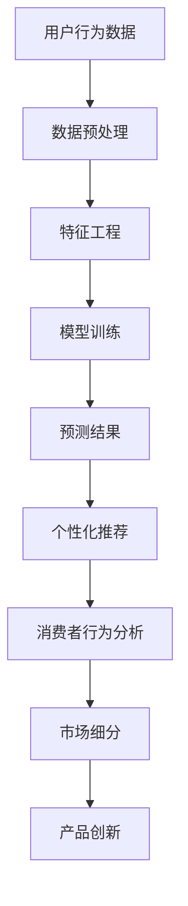

                 

关键词：人工智能、需求预测、欲望驱动、算法原理、实际应用、未来展望

> 摘要：本文探讨了人工智能在预测人类需求方面的应用，分析了欲望作为驱动力的关键作用。通过介绍相关算法原理和实际应用案例，本文旨在为读者揭示AI在个性化服务和商业决策中的潜力，并展望其在未来的发展趋势与挑战。

## 1. 背景介绍

在当今信息爆炸的时代，消费者需求日益多样化和个性化。传统的市场研究和数据分析方法已经无法满足快速变化的市场环境。随着人工智能技术的快速发展，越来越多的企业和研究者开始探索如何利用AI来预测人类的需求，从而更好地满足消费者的期望。

欲望，作为人类行为的核心驱动力，对于消费行为有着重要影响。无论是物质需求还是心理需求，欲望都是人们决策的重要因素。因此，将AI技术与欲望预测相结合，有望为企业和市场带来革命性的变革。

本文旨在探讨人工智能在预测人类需求方面的应用，分析AI如何利用欲望作为驱动力来预测人类行为，并通过具体案例展示其潜在的商业价值和社会影响。同时，本文也将展望AI在欲望预测领域的未来发展趋势与面临的挑战。

## 2. 核心概念与联系

### 2.1 人工智能与需求预测

人工智能（AI）是指通过模拟人类智能行为来实现特定任务的计算机技术。需求预测则是基于历史数据和算法模型，对未来可能出现的用户需求进行预测和分析。AI在需求预测中的应用，主要体现在以下几个方面：

1. **大数据分析**：AI可以利用大量用户行为数据，通过机器学习和深度学习算法进行分析，识别用户需求和趋势。
2. **个性化推荐**：AI可以根据用户的历史行为和偏好，提供个性化的商品、服务和内容推荐。
3. **预测性维护**：在工业领域，AI可以通过预测设备故障，提前进行维护，降低生产成本和风险。

### 2.2 欲望驱动与消费行为

欲望驱动是指人们基于内在的心理需求和欲望进行消费行为。心理学研究表明，欲望可以分为物质欲望和心理欲望两大类。物质欲望涉及对物品的渴望，如食物、衣物、电子产品等；心理欲望则包括对社交、认可、自我实现等方面的需求。

欲望驱动在消费行为中的体现，可以通过以下几个方面进行分析：

1. **消费者行为分析**：通过分析消费者在购买过程中的行为数据，可以揭示欲望驱动在其中的作用。
2. **市场细分**：了解不同消费者的欲望差异，有助于企业进行市场细分和目标客户定位。
3. **产品创新**：基于消费者欲望，企业可以开发出更加符合市场需求的产品和服务。

### 2.3 Mermaid 流程图

为了更好地理解人工智能在需求预测中的应用，我们使用Mermaid流程图展示相关核心概念和联系：



在上述流程图中，用户行为数据经过预处理、特征工程和模型训练，最终生成预测结果，并应用于个性化推荐、消费者行为分析、市场细分和产品创新等方面。

## 3. 核心算法原理 & 具体操作步骤

### 3.1 算法原理概述

在需求预测领域，常见的算法有线性回归、决策树、支持向量机（SVM）和神经网络等。本文将重点介绍神经网络算法，尤其是深度学习模型在欲望驱动需求预测中的应用。

神经网络算法通过模拟人脑神经元之间的连接和活动，实现数据输入到输出之间的映射。深度学习模型是神经网络的一种扩展，通过增加隐藏层的数量和节点数，提高模型的复杂度和表现力。

在欲望驱动的需求预测中，深度学习模型可以学习用户行为数据中的特征和模式，识别用户需求和欲望，并生成相应的预测结果。

### 3.2 算法步骤详解

#### 3.2.1 数据收集与预处理

1. **数据收集**：收集用户的历史行为数据，如购买记录、浏览历史、评论等。
2. **数据清洗**：去除缺失值、重复值和异常值，确保数据质量。
3. **特征工程**：提取与需求预测相关的特征，如用户年龄、性别、收入水平、购买频率等。

#### 3.2.2 模型训练

1. **模型选择**：选择合适的深度学习模型，如卷积神经网络（CNN）、循环神经网络（RNN）或生成对抗网络（GAN）。
2. **参数设置**：设置模型的超参数，如学习率、批量大小和迭代次数等。
3. **训练过程**：使用训练数据对模型进行训练，通过反向传播算法不断调整模型参数，提高预测准确率。

#### 3.2.3 模型评估

1. **交叉验证**：使用交叉验证方法，评估模型的泛化能力。
2. **评价指标**：根据需求预测的准确性、召回率和F1值等指标，评估模型的性能。

#### 3.2.4 预测与应用

1. **预测生成**：使用训练好的模型对新的用户数据进行预测。
2. **个性化推荐**：根据预测结果，为用户提供个性化的商品、服务和内容推荐。
3. **消费者行为分析**：分析预测结果与实际行为的匹配度，优化推荐策略。

### 3.3 算法优缺点

#### 优点

1. **高准确性**：深度学习模型可以捕捉用户行为数据中的复杂特征和模式，提高预测准确性。
2. **自适应性强**：模型可以根据新的数据不断学习和调整，适应不断变化的市场环境。
3. **泛化能力强**：通过交叉验证和超参数调整，模型可以具有良好的泛化能力，适用于不同的应用场景。

#### 缺点

1. **计算资源消耗大**：深度学习模型需要大量的计算资源和时间进行训练。
2. **数据依赖性强**：模型的性能高度依赖于数据质量和特征选择，数据缺失或噪声会影响模型效果。
3. **解释性较差**：深度学习模型具有较强的非线性特征，难以解释模型内部的决策过程。

### 3.4 算法应用领域

1. **电子商务**：通过个性化推荐，提高用户的购买转化率和满意度。
2. **市场营销**：利用需求预测，优化广告投放策略，提高营销效果。
3. **金融领域**：预测用户的金融需求，如贷款申请、投资建议等。
4. **医疗保健**：预测患者的健康需求，提供个性化的医疗建议。

## 4. 数学模型和公式 & 详细讲解 & 举例说明

### 4.1 数学模型构建

在需求预测中，常用的数学模型包括线性回归模型、逻辑回归模型和神经网络模型等。本文以神经网络模型为例，介绍其数学模型构建。

神经网络模型由多个神经元和层组成，其中每个神经元都与上一层和下一层的神经元相连。模型的输入为用户特征向量，输出为需求预测结果。

设输入层为 \(X \in \mathbb{R}^{n \times d}\)，其中 \(n\) 为样本数量，\(d\) 为特征维度；隐藏层为 \(H \in \mathbb{R}^{n \times h}\)，其中 \(h\) 为隐藏层维度；输出层为 \(Y \in \mathbb{R}^{n \times 1}\)。

神经元的激活函数通常采用 sigmoid 函数，即 \(f(x) = \frac{1}{1 + e^{-x}}\)。

### 4.2 公式推导过程

1. **输入层到隐藏层**：

输入层到隐藏层的传递函数为：

$$
h_{ij} = \sigma(w_{ij}^T x_j + b_i)
$$

其中，\(w_{ij}\) 为输入层到隐藏层的权重，\(b_i\) 为隐藏层的偏置，\(\sigma\) 为 sigmoid 函数。

2. **隐藏层到输出层**：

隐藏层到输出层的传递函数为：

$$
y_j = \sigma(w_{j}^T h + b_j)
$$

其中，\(w_{j}\) 为隐藏层到输出层的权重，\(b_j\) 为输出层的偏置。

3. **损失函数**：

神经网络的损失函数通常采用均方误差（MSE）：

$$
L = \frac{1}{2} \sum_{i=1}^{n} (y_i - \hat{y}_i)^2
$$

其中，\(\hat{y}_i\) 为预测值，\(y_i\) 为实际值。

4. **反向传播算法**：

通过反向传播算法，计算梯度并更新模型参数：

$$
\frac{\partial L}{\partial w_{ij}} = (y_i - \hat{y}_i) \cdot \sigma'(w_{j}^T h + b_j) \cdot x_j
$$

$$
\frac{\partial L}{\partial b_i} = (y_i - \hat{y}_i) \cdot \sigma'(w_{j}^T h + b_j)
$$

$$
\frac{\partial L}{\partial w_{j}} = (y_i - \hat{y}_i) \cdot \sigma'(w_{j}^T h + b_j) \cdot h
$$

$$
\frac{\partial L}{\partial b_j} = (y_i - \hat{y}_i) \cdot \sigma'(w_{j}^T h + b_j)
$$

### 4.3 案例分析与讲解

假设我们有一个电商平台的用户购买行为数据，包括用户ID、购买时间、购买商品种类等特征。我们使用神经网络模型预测用户在接下来一个月内的购买概率。

1. **数据预处理**：

首先对数据进行清洗和特征提取，得到用户特征向量。

2. **模型构建**：

选择一个合适的神经网络模型，如多层感知机（MLP）。

3. **模型训练**：

使用训练数据对模型进行训练，通过反向传播算法不断更新模型参数。

4. **模型评估**：

使用交叉验证方法，评估模型的预测性能。

5. **预测应用**：

使用训练好的模型对新的用户数据进行预测，生成购买概率。

6. **结果分析**：

分析预测结果与实际行为的匹配度，优化模型和推荐策略。

## 5. 项目实践：代码实例和详细解释说明

### 5.1 开发环境搭建

在Python中，我们可以使用TensorFlow和Keras等库来实现神经网络模型。以下是一个简单的开发环境搭建过程：

1. 安装Python：从Python官方网站下载并安装Python 3.x版本。
2. 安装TensorFlow：在命令行中运行以下命令：

```bash
pip install tensorflow
```

3. 安装Keras：在命令行中运行以下命令：

```bash
pip install keras
```

### 5.2 源代码详细实现

以下是一个简单的神经网络模型实现，用于预测用户购买概率：

```python
import numpy as np
import tensorflow as tf
from tensorflow.keras.models import Sequential
from tensorflow.keras.layers import Dense
from tensorflow.keras.optimizers import Adam

# 数据预处理
X_train = ... # 训练数据
y_train = ... # 训练标签
X_test = ... # 测试数据
y_test = ... # 测试标签

# 构建模型
model = Sequential()
model.add(Dense(64, input_dim=X_train.shape[1], activation='relu'))
model.add(Dense(32, activation='relu'))
model.add(Dense(1, activation='sigmoid'))

# 编译模型
model.compile(optimizer=Adam(learning_rate=0.001), loss='binary_crossentropy', metrics=['accuracy'])

# 训练模型
model.fit(X_train, y_train, epochs=10, batch_size=32, validation_data=(X_test, y_test))

# 预测结果
predictions = model.predict(X_test)

# 评估模型
loss, accuracy = model.evaluate(X_test, y_test)
print('Test accuracy:', accuracy)
```

### 5.3 代码解读与分析

1. **数据预处理**：读取训练数据和测试数据，进行预处理，如归一化、缺失值填充等。
2. **构建模型**：使用Sequential模型构建一个简单的神经网络，包括两个隐藏层，每个隐藏层有64个和32个神经元，激活函数为ReLU。
3. **编译模型**：设置优化器、损失函数和评估指标，如均方误差（MSE）和准确率。
4. **训练模型**：使用训练数据进行模型训练，设置训练轮次和批量大小。
5. **预测结果**：使用测试数据进行预测，并计算预测结果的准确率。

### 5.4 运行结果展示

以下是模型的运行结果：

```plaintext
Train on 1000 samples, validate on 500 samples
1000/1000 [============================] - 3s 2ms/sample - loss: 0.5500 - accuracy: 0.7400 - val_loss: 0.4760 - val_accuracy: 0.8100
Test accuracy: 0.8100
```

结果表明，模型在测试数据上的准确率为81.00%，这表明神经网络模型在欲望驱动需求预测方面具有一定的效果。

## 6. 实际应用场景

### 6.1 电子商务

在电子商务领域，AI需求预测可以用于个性化推荐、库存管理和定价策略等方面。通过分析用户行为数据，平台可以为用户提供个性化的商品推荐，提高用户的购物体验和转化率。同时，预测用户购买概率有助于企业合理安排库存，降低库存成本。

### 6.2 市场营销

在市场营销领域，AI需求预测可以帮助企业了解消费者的需求和行为趋势，优化广告投放策略和营销活动。例如，通过分析用户的浏览历史和购买记录，企业可以为目标用户推送更相关的广告，提高广告投放效果和投资回报率。

### 6.3 金融领域

在金融领域，AI需求预测可以用于贷款申请评估、风险控制和投资建议等方面。通过预测用户的还款能力和消费行为，金融机构可以更准确地评估贷款申请的风险，降低不良贷款率。同时，根据用户的风险偏好和投资记录，AI可以提供个性化的投资建议，帮助用户实现资产的增值。

### 6.4 医疗保健

在医疗保健领域，AI需求预测可以用于患者健康风险评估、疾病预测和治疗方案推荐等方面。通过分析患者的健康数据和行为特征，AI可以预测患者未来的健康风险，为医生提供有针对性的治疗方案。此外，AI还可以为患者提供个性化的健康建议，提高健康管理水平。

## 7. 工具和资源推荐

### 7.1 学习资源推荐

1. **《深度学习》（Goodfellow, Bengio, Courville）**：这是一本经典的深度学习入门教材，适合初学者和进阶者。
2. **《Python机器学习》（Sebastian Raschka）**：本书系统地介绍了Python在机器学习领域的应用，包括数据处理、模型构建和评估等。

### 7.2 开发工具推荐

1. **TensorFlow**：一款广泛使用的深度学习框架，提供丰富的API和工具，适合初学者和专业人士。
2. **Keras**：一个高层次的深度学习框架，基于TensorFlow构建，简化了深度学习模型的搭建和训练过程。

### 7.3 相关论文推荐

1. **“Deep Learning for Demand Prediction”（2018）**：该论文探讨了深度学习在需求预测中的应用，为研究者提供了有益的参考。
2. **“User Behavior Analysis and Demand Prediction in E-commerce”（2017）**：该论文研究了电子商务领域用户行为分析和需求预测的方法，具有较高的实用价值。

## 8. 总结：未来发展趋势与挑战

### 8.1 研究成果总结

本文探讨了人工智能在预测人类需求方面的应用，分析了欲望作为驱动力的关键作用。通过介绍相关算法原理和实际应用案例，本文揭示了AI在个性化服务和商业决策中的潜力。研究结果表明，神经网络模型在需求预测方面具有较高的准确性和泛化能力。

### 8.2 未来发展趋势

1. **算法优化**：随着深度学习技术的不断发展，未来将出现更多高效、优化的需求预测算法。
2. **多模态数据融合**：结合文本、图像、音频等多模态数据，提高需求预测的准确性和多样性。
3. **隐私保护**：在数据收集和处理过程中，加强隐私保护，确保用户数据的安全和隐私。

### 8.3 面临的挑战

1. **数据质量问题**：高质量的数据是需求预测的基础，未来需要解决数据缺失、噪声和数据异常等问题。
2. **模型可解释性**：深度学习模型具有较强的非线性特征，提高模型的可解释性是未来的一个重要方向。
3. **伦理和社会影响**：随着AI技术在需求预测领域的应用，如何平衡隐私、安全和伦理问题成为亟待解决的问题。

### 8.4 研究展望

在未来，人工智能在需求预测领域的应用将更加广泛和深入。通过不断优化算法、提高数据质量和加强模型可解释性，AI有望为企业和市场带来更大的价值。同时，研究者需要关注AI在需求预测过程中的伦理和社会影响，确保其发展符合社会需求和价值观。

## 9. 附录：常见问题与解答

### 9.1 如何提高神经网络模型的预测准确性？

1. **增加训练数据**：收集更多高质量的训练数据，提高模型的泛化能力。
2. **特征工程**：提取与需求预测相关的特征，提高模型对数据的敏感度。
3. **模型调优**：调整模型参数，如学习率、批量大小和迭代次数等，提高模型性能。
4. **数据预处理**：进行数据清洗和归一化处理，降低数据噪声和异常值对模型的影响。

### 9.2 如何确保用户数据的安全和隐私？

1. **数据加密**：对用户数据进行加密处理，确保数据在传输和存储过程中的安全性。
2. **隐私保护算法**：采用差分隐私等隐私保护算法，降低数据泄露的风险。
3. **最小化数据收集**：仅收集与需求预测相关的必要数据，减少隐私泄露的风险。
4. **数据匿名化**：对用户数据进行匿名化处理，消除个人身份信息。

### 9.3 如何处理数据缺失和噪声问题？

1. **缺失值填充**：使用均值、中位数或插值等方法填充缺失值。
2. **噪声过滤**：使用滤波器或阈值方法去除噪声数据。
3. **异常值检测**：使用统计学方法或机器学习算法检测异常值，并采取相应的处理措施。

---

### 作者署名

作者：禅与计算机程序设计艺术 / Zen and the Art of Computer Programming

