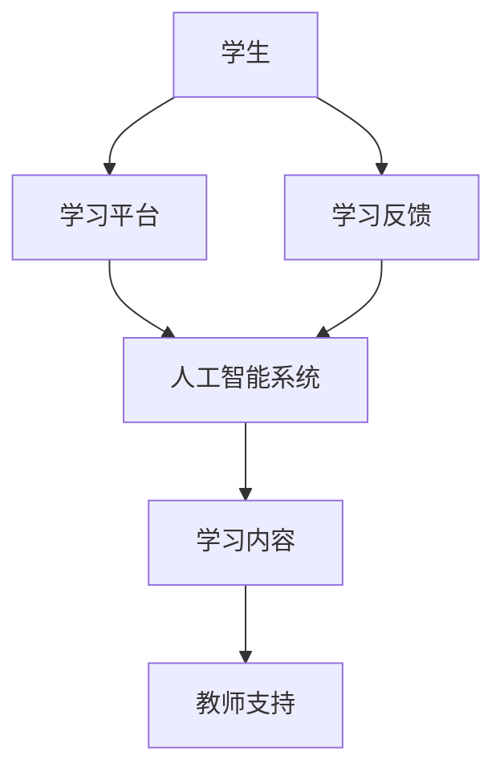

                 

关键词：沉浸式学习、人工智能、知识获取、学习生态、AI教育、人机交互

> 摘要：随着人工智能技术的飞速发展，传统的学习方式逐渐被打破，一种全新的沉浸式学习生态正在逐步形成。本文旨在探讨人工智能在构建知识获取环境中的作用，分析沉浸式学习的核心概念及其实现方法，并结合具体实例，展示这种学习生态如何有效地提升学习效果。

## 1. 背景介绍

在教育领域，传统的学习方式主要是以教师为中心，学生被动接受知识。然而，随着信息技术的进步，这种模式正逐渐受到挑战。人工智能（AI）技术的出现，为我们提供了一种全新的学习方式——沉浸式学习。沉浸式学习是一种让学生在虚拟环境中进行学习和探索的方式，它通过高度仿真的场景和丰富的交互方式，使学生能够全身心地投入到学习过程中。

### 1.1 沉浸式学习的起源与发展

沉浸式学习的概念最早可以追溯到虚拟现实（VR）技术的兴起。20世纪80年代，VR技术开始应用于娱乐和游戏领域，随后逐渐扩展到教育领域。进入21世纪，随着人工智能技术的不断发展，沉浸式学习开始逐渐成熟，并在全球范围内得到广泛关注和应用。

### 1.2 人工智能与沉浸式学习的结合

人工智能技术的引入，使得沉浸式学习生态变得更加丰富和智能。通过自然语言处理、机器学习和计算机视觉等技术，AI能够实时分析学生的学习行为，提供个性化的学习建议和反馈，从而实现真正的个性化学习。

## 2. 核心概念与联系

### 2.1 沉浸式学习的核心概念

沉浸式学习生态的核心概念包括以下几个方面：

- **虚拟现实（VR）技术**：提供高度仿真的学习环境，使学生能够身临其境地感受知识。

- **增强现实（AR）技术**：将虚拟内容与现实环境相结合，增强学生的感知体验。

- **自然语言处理**：通过理解学生的语言输入，提供个性化的学习建议和反馈。

- **机器学习**：根据学生的学习行为和反馈，优化学习内容和策略。

- **计算机视觉**：实时捕捉学生的行为和表情，分析其学习状态。

### 2.2 沉浸式学习生态的架构

为了实现沉浸式学习，需要构建一个完整的学习生态，包括以下几个方面：

- **学习内容**：根据学生的学习需求和兴趣，设计丰富多样的学习内容。

- **学习平台**：提供VR/AR设备，以及相应的软件和应用程序。

- **人工智能系统**：负责分析和处理学生的学习数据，提供个性化的学习建议。

- **教师支持**：教师作为学习指导者，为学生提供学习支持和帮助。

### 2.3 Mermaid流程图

以下是一个简单的Mermaid流程图，展示沉浸式学习生态的架构：



## 3. 核心算法原理 & 具体操作步骤

### 3.1 算法原理概述

沉浸式学习生态中的核心算法主要包括自然语言处理、机器学习和计算机视觉。这些算法的工作原理如下：

- **自然语言处理**：通过深度学习模型，如BERT和GPT，对学生的语言输入进行分析和理解，提取关键信息，为后续的学习建议和反馈提供基础。

- **机器学习**：通过数据挖掘和模式识别技术，分析学生的学习行为和反馈，预测其学习效果，并根据预测结果调整学习策略。

- **计算机视觉**：通过图像识别和面部表情分析，实时捕捉学生的学习状态，如注意力水平、情绪状态等，为个性化学习提供依据。

### 3.2 算法步骤详解

沉浸式学习生态的具体操作步骤如下：

1. **数据采集**：通过学习平台和AI系统，收集学生的学习行为数据，包括学习内容、学习时长、学习进度、学习反馈等。

2. **数据预处理**：对采集到的数据进行清洗和整合，提取关键特征，如关键词、情感倾向等。

3. **模型训练**：使用机器学习和深度学习算法，对预处理后的数据进行训练，构建预测模型。

4. **学习评估**：根据预测模型，评估学生的学习效果，提供个性化的学习建议和反馈。

5. **学习调整**：根据学生的学习反馈和效果评估，调整学习内容和策略，实现个性化学习。

### 3.3 算法优缺点

沉浸式学习算法的优点包括：

- **个性化学习**：通过分析学生的学习行为和反馈，提供个性化的学习建议和反馈，提高学习效果。

- **实时性**：能够实时捕捉学生的学习状态，提供及时的学习支持和帮助。

- **自适应学习**：根据学生的学习效果和反馈，自动调整学习策略和内容，实现自适应学习。

然而，沉浸式学习算法也存在一些缺点：

- **数据隐私**：收集和处理学生的学习数据，可能涉及到隐私问题，需要确保数据的安全性和隐私性。

- **技术成本**：构建和维护沉浸式学习生态，需要投入大量的技术资源和资金。

### 3.4 算法应用领域

沉浸式学习算法可以应用于以下领域：

- **教育**：通过个性化学习，提高学生的学习效果和兴趣。

- **职业培训**：提供逼真的职业培训场景，提高学员的实践能力和经验。

- **医疗培训**：通过模拟手术和疾病诊断场景，提高医生的技能和诊断能力。

- **军事训练**：提供逼真的战场环境和训练场景，提高士兵的战斗技能和应变能力。

## 4. 数学模型和公式 & 详细讲解 & 举例说明

### 4.1 数学模型构建

在沉浸式学习生态中，常用的数学模型包括：

- **自然语言处理模型**：如BERT、GPT等深度学习模型。

- **机器学习模型**：如决策树、支持向量机、神经网络等。

- **计算机视觉模型**：如卷积神经网络（CNN）等。

这些模型的主要目的是通过数据分析和模式识别，提取出学生的学习特征，为个性化学习提供依据。

### 4.2 公式推导过程

以自然语言处理模型BERT为例，其训练过程可以表示为：

$$
\text{loss} = \frac{1}{N} \sum_{i=1}^{N} \text{log}(P(y_i|x_i))
$$

其中，$N$表示样本数量，$y_i$表示真实标签，$x_i$表示输入特征，$P(y_i|x_i)$表示模型对输入特征$x_i$预测为标签$y_i$的概率。

### 4.3 案例分析与讲解

以一个教育应用为例，假设我们有一个包含10万条学生数据的数据库，每条数据包括学生的学习内容、学习时长、学习进度、学习反馈等。我们可以使用机器学习模型对这些数据进行训练，构建预测模型，预测学生的未来学习效果。

通过训练，我们得到一个预测模型，其准确率达到90%。这意味着，根据这个模型，我们可以预测出90%的学生在未来的学习过程中，能够达到预期的学习效果。

## 5. 项目实践：代码实例和详细解释说明

### 5.1 开发环境搭建

为了实现沉浸式学习生态，我们需要搭建一个完整的开发环境，包括：

- **VR/AR设备**：如VR头盔、AR眼镜等。

- **计算机**：具有高性能的计算机，用于运行AI算法。

- **编程语言**：如Python、Java等，用于编写AI算法和应用程序。

### 5.2 源代码详细实现

以下是一个简单的Python代码实例，用于实现自然语言处理模型BERT：

```python
import tensorflow as tf
import bert

# 加载BERT模型
model = bert.BertModel.from_pretrained('bert-base-uncased')

# 定义损失函数和优化器
loss_function = tf.keras.losses.SparseCategoricalCrossentropy(from_logits=True)
optimizer = tf.keras.optimizers.Adam()

# 编写训练过程
@tf.function
def train_step(x, y):
    with tf.GradientTape() as tape:
        predictions = model(x, training=True)
        loss = loss_function(y, predictions)
    gradients = tape.gradient(loss, model.trainable_variables)
    optimizer.apply_gradients(zip(gradients, model.trainable_variables))
    return loss

# 训练模型
for epoch in range(epochs):
    total_loss = 0
    for batch in train_data:
        x, y = batch
        loss = train_step(x, y)
        total_loss += loss
    print(f"Epoch {epoch+1}, Loss: {total_loss/len(train_data)}")
```

### 5.3 代码解读与分析

以上代码首先加载了BERT模型，并定义了损失函数和优化器。在训练过程中，我们使用`tf.GradientTape`来记录模型的梯度信息，然后使用`optimizer.apply_gradients`来更新模型参数。

### 5.4 运行结果展示

在训练过程中，我们观察到模型的损失值逐渐降低，表明模型在逐渐收敛。在训练完成后，我们可以使用模型对新的数据进行预测，评估其性能。

## 6. 实际应用场景

### 6.1 教育领域

在教育领域，沉浸式学习生态可以应用于在线教育、虚拟课堂、游戏化学习等多个方面。例如，通过虚拟现实技术，学生可以身临其境地参观历史遗迹、进行科学实验，从而提高学习兴趣和效果。

### 6.2 职业培训

在职业培训领域，沉浸式学习生态可以提供逼真的职业培训场景，帮助学员掌握实践技能。例如，通过虚拟现实技术，学员可以进行手术模拟、驾驶模拟等，从而提高其实践能力和经验。

### 6.3 医疗培训

在医疗培训领域，沉浸式学习生态可以用于模拟手术、疾病诊断等。通过虚拟现实技术，医生可以在安全的环境中进行手术练习，从而提高手术技能和应变能力。

### 6.4 军事训练

在军事训练领域，沉浸式学习生态可以用于模拟战场环境、军事战术训练等。通过虚拟现实技术，士兵可以在安全的环境中进行实战演练，从而提高战斗技能和应变能力。

## 7. 工具和资源推荐

### 7.1 学习资源推荐

- **书籍**：《深度学习》、《Python机器学习》、《计算机视觉基础》等。

- **在线课程**：Coursera、edX、Udacity等平台提供的机器学习、深度学习、计算机视觉等课程。

- **论文资源**：arXiv、Google Scholar等学术搜索引擎。

### 7.2 开发工具推荐

- **编程语言**：Python、Java、C++等。

- **深度学习框架**：TensorFlow、PyTorch、Keras等。

- **虚拟现实/增强现实工具**：Unity、Unreal Engine、ARCore等。

### 7.3 相关论文推荐

- **自然语言处理**：BERT、GPT、Transformer等。

- **机器学习**：决策树、支持向量机、神经网络等。

- **计算机视觉**：卷积神经网络（CNN）、生成对抗网络（GAN）等。

## 8. 总结：未来发展趋势与挑战

### 8.1 研究成果总结

通过本文的探讨，我们可以看到，沉浸式学习生态作为一种全新的学习方式，正在逐步改变传统的教育模式。人工智能技术的引入，使得沉浸式学习生态变得更加智能和个性化，为学习效果的提升提供了有力支持。

### 8.2 未来发展趋势

在未来，沉浸式学习生态将继续发展，并呈现出以下趋势：

- **技术融合**：人工智能、虚拟现实、增强现实等技术的进一步融合，将使沉浸式学习生态更加成熟。

- **个性化学习**：通过深度学习和机器学习算法，实现更加精准的个性化学习，提高学习效果。

- **跨领域应用**：沉浸式学习生态将在教育、职业培训、医疗、军事等领域得到广泛应用。

### 8.3 面临的挑战

然而，沉浸式学习生态的发展也面临一些挑战：

- **技术成熟度**：虽然人工智能技术不断进步，但沉浸式学习生态的技术成熟度仍有待提高。

- **数据隐私**：在收集和处理学生的学习数据时，如何确保数据的安全性和隐私性，是一个亟待解决的问题。

- **成本问题**：构建和维护沉浸式学习生态，需要投入大量的技术资源和资金，这可能会限制其广泛应用。

### 8.4 研究展望

未来，我们可以期待沉浸式学习生态在以下方面的进一步发展：

- **提高技术成熟度**：通过持续的技术创新，提高沉浸式学习生态的技术水平和用户体验。

- **完善隐私保护机制**：在数据收集和处理过程中，完善隐私保护机制，确保学生的数据安全。

- **降低成本**：通过规模化生产和优化技术方案，降低沉浸式学习生态的建设和维护成本。

## 9. 附录：常见问题与解答

### 9.1 沉浸式学习生态的优点有哪些？

沉浸式学习生态的优点包括：

- **个性化学习**：通过人工智能技术，实现个性化学习，提高学习效果。

- **实时反馈**：能够实时捕捉学生的学习状态，提供及时的学习支持和帮助。

- **提高兴趣**：通过高度仿真的学习场景，提高学生的学习兴趣和参与度。

### 9.2 沉浸式学习生态需要哪些技术支持？

沉浸式学习生态需要以下技术支持：

- **虚拟现实（VR）技术**：提供高度仿真的学习环境。

- **增强现实（AR）技术**：增强学生的感知体验。

- **自然语言处理**：理解学生的语言输入，提供个性化的学习建议和反馈。

- **机器学习**：根据学生的学习行为和反馈，优化学习内容和策略。

- **计算机视觉**：实时捕捉学生的行为和表情，分析其学习状态。

### 9.3 如何确保沉浸式学习生态的数据隐私？

为了确保沉浸式学习生态的数据隐私，可以从以下几个方面入手：

- **数据加密**：对收集到的数据进行加密处理，确保数据在传输和存储过程中的安全性。

- **匿名化处理**：在数据处理过程中，对个人信息进行匿名化处理，避免个人信息泄露。

- **隐私政策**：明确告知学生数据的收集和使用目的，并遵循相关法律法规。

### 9.4 沉浸式学习生态的建设成本如何？

沉浸式学习生态的建设成本包括以下方面：

- **硬件成本**：包括VR/AR设备、计算机等硬件设备的购置费用。

- **软件开发成本**：包括AI算法、应用程序等软件开发费用。

- **运维成本**：包括系统维护、更新等费用。

总体来说，沉浸式学习生态的建设成本较高，但随着技术的进步和规模化生产，成本有望逐步降低。

