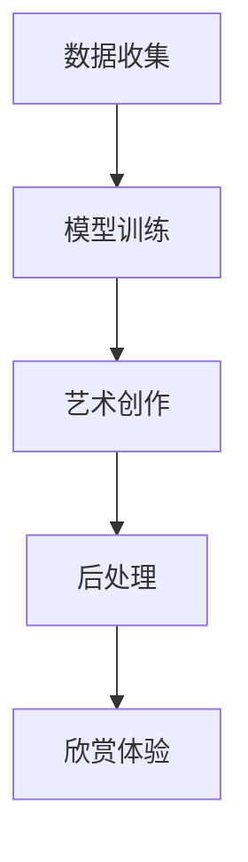

                 

关键词：沉浸式艺术，AI创作，人机交互，艺术欣赏，深度学习

> 摘要：本文探讨了人工智能在艺术创作与欣赏中的新兴领域——沉浸式艺术。通过分析AI驱动的创作原理、技术实现和欣赏体验，探讨了这一领域的潜力及其对未来艺术发展的影响。

## 1. 背景介绍

随着人工智能（AI）技术的飞速发展，计算机程序已经能够在各种领域展现出非凡的能力，从围棋到医疗诊断，从图像识别到自然语言处理。艺术领域也不例外，AI开始被应用于艺术创作、艺术分析和艺术欣赏等多个方面。其中，沉浸式艺术作为近年来崭露头角的一个新兴领域，正逐渐受到越来越多人的关注。

沉浸式艺术是指通过高度交互和视觉、听觉等多感官的融合，将观众完全带入一个虚构或现实的艺术体验中。这种艺术形式强调观众的参与感和沉浸感，使得艺术体验变得更加丰富和多元。而AI技术的引入，则为沉浸式艺术的创作和欣赏带来了全新的可能性。

## 2. 核心概念与联系

### 2.1 AI驱动的创作原理

AI在艺术创作中的应用，主要依赖于深度学习技术和生成模型。深度学习是一种通过多层神经网络进行特征提取和模式识别的方法，而生成模型则是一种能够生成新数据的机器学习模型。

在AI驱动的艺术创作中，生成模型尤为关键。其中，最常用的生成模型包括变分自编码器（VAE）、生成对抗网络（GAN）和自编码器（Autoencoder）。这些模型能够学习艺术作品的风格、特征和结构，进而生成新的艺术作品。

### 2.2 技术实现

AI驱动的艺术创作通常包括以下几个步骤：

1. **数据收集**：收集大量的艺术作品数据，作为训练生成模型的输入。
2. **模型训练**：使用深度学习算法对生成模型进行训练，使其能够学习艺术作品的特征和风格。
3. **艺术创作**：利用训练好的生成模型，生成新的艺术作品。
4. **后处理**：对生成的艺术作品进行优化和调整，以满足特定的艺术风格和创作意图。

### 2.3 欣赏体验

在AI驱动的沉浸式艺术欣赏中，观众不仅能够看到和听到艺术作品，还能通过交互与艺术作品进行互动，从而获得更加丰富的艺术体验。例如，观众可以通过语音、手势或移动设备与艺术作品进行交互，改变艺术作品的表现形式和内容。

### 2.4 Mermaid 流程图

以下是一个简化的Mermaid流程图，描述了AI驱动的艺术创作过程：



## 3. 核心算法原理 & 具体操作步骤

### 3.1 算法原理概述

在AI驱动的艺术创作中，核心算法主要包括生成模型和交互模型。生成模型负责生成艺术作品，而交互模型则负责处理观众的交互请求，调整艺术作品的表现形式。

### 3.2 算法步骤详解

1. **数据收集**：收集大量的艺术作品数据，包括绘画、摄影、音乐等。
2. **模型训练**：使用生成对抗网络（GAN）或变分自编码器（VAE）训练生成模型，使其能够生成符合特定风格的艺术作品。
3. **交互模型训练**：使用强化学习算法训练交互模型，使其能够根据观众的交互请求，调整艺术作品的表现形式。
4. **艺术创作**：利用训练好的生成模型和交互模型，生成新的艺术作品。
5. **后处理**：对生成的艺术作品进行优化和调整，以满足特定的艺术风格和创作意图。

### 3.3 算法优缺点

**优点**：

- **多样性**：生成模型能够生成多样化的艺术作品，为艺术家提供了更多的创作灵感。
- **效率**：AI驱动的艺术创作相比传统手工创作，具有更高的效率和更低的成本。
- **个性化**：交互模型能够根据观众的交互请求，提供个性化的艺术体验。

**缺点**：

- **创造性限制**：AI生成的艺术作品可能缺乏人类的创造性，难以达到顶级艺术家的水平。
- **版权问题**：AI生成的艺术作品如何归属版权仍是一个待解决的问题。

### 3.4 算法应用领域

AI驱动的艺术创作在多个领域都有广泛的应用，包括：

- **广告创意**：用于生成独特的广告创意，提高广告效果。
- **游戏设计**：用于生成游戏中的场景、角色和音乐，丰富游戏体验。
- **艺术展览**：用于创作独特的沉浸式艺术展览，吸引观众。

## 4. 数学模型和公式 & 详细讲解 & 举例说明

### 4.1 数学模型构建

在AI驱动的艺术创作中，常用的数学模型包括生成模型和交互模型。以下是一个简化的数学模型示例：

$$
\begin{align*}
\text{生成模型}: & \quad G(z) = \text{风格编码} + \text{内容编码} \\
\text{交互模型}: & \quad R(x, y) = \text{响应函数}
\end{align*}
$$

其中，$z$表示随机噪声，$x$表示观众输入，$y$表示艺术作品输出。

### 4.2 公式推导过程

生成模型的推导过程如下：

$$
\begin{align*}
G(z) &= \text{风格编码}(z) + \text{内容编码}(z) \\
&= \text{W}_{\text{style}}z + \text{W}_{\text{content}}z \\
&= (W_{\text{style}} + W_{\text{content}})z
\end{align*}
$$

其中，$\text{W}_{\text{style}}$和$\text{W}_{\text{content}}$分别表示风格编码和内容编码的权重矩阵。

交互模型的推导过程如下：

$$
\begin{align*}
R(x, y) &= \text{响应函数}(\text{W}_{\text{response}}, x, y) \\
&= \text{W}_{\text{response}}x \odot y
\end{align*}
$$

其中，$\odot$表示元素乘积运算，$\text{W}_{\text{response}}$表示响应函数的权重矩阵。

### 4.3 案例分析与讲解

以下是一个简单的案例，展示如何使用上述数学模型生成一幅艺术作品。

假设观众输入了一张包含特定风格的绘画作品，我们希望通过生成模型和交互模型，生成一幅符合该风格的新绘画作品。

1. **数据收集**：收集一张包含特定风格的绘画作品。
2. **模型训练**：使用GAN或VAE训练生成模型，使其能够学习该风格的绘画特征。
3. **交互模型训练**：使用强化学习训练交互模型，使其能够根据观众输入的绘画作品，生成符合该风格的新绘画作品。
4. **艺术创作**：利用训练好的生成模型和交互模型，生成一幅新绘画作品。
5. **后处理**：对生成的绘画作品进行优化和调整，以满足特定的艺术风格和创作意图。

通过上述步骤，我们成功地生成了一幅符合特定风格的绘画作品，实现了AI驱动的艺术创作。

## 5. 项目实践：代码实例和详细解释说明

### 5.1 开发环境搭建

为了实现AI驱动的艺术创作，我们需要搭建一个适合的开发环境。以下是搭建步骤：

1. **安装Python环境**：安装Python 3.8及以上版本。
2. **安装深度学习框架**：安装TensorFlow 2.5及以上版本。
3. **安装图像处理库**：安装Pillow库。

### 5.2 源代码详细实现

以下是一个简单的AI驱动的艺术创作项目，使用生成对抗网络（GAN）实现。

```python
import tensorflow as tf
from tensorflow.keras.layers import Dense, Flatten, Conv2D, BatchNormalization
from tensorflow.keras.models import Model
import numpy as np
import matplotlib.pyplot as plt

# 生成器模型
def build_generator(z_dim):
    model = tf.keras.Sequential([
        Dense(7 * 7 * 128, activation="relu", input_shape=(z_dim,)),
        BatchNormalization(),
        Flatten(),
        Conv2D(128, kernel_size=5, padding="same"),
        BatchNormalization(),
        Conv2D(128, kernel_size=5, padding="same"),
        BatchNormalization(),
        Conv2D(1, kernel_size=5, padding="same", activation="tanh"),
        Flatten()
    ])
    return model

# 判别器模型
def build_discriminator(img_shape):
    model = tf.keras.Sequential([
        Conv2D(128, kernel_size=5, padding="same", input_shape=img_shape),
        BatchNormalization(),
        tf.keras.layers.LeakyReLU(alpha=0.2),
        Conv2D(128, kernel_size=5, padding="same"),
        BatchNormalization(),
        tf.keras.layers.LeakyReLU(alpha=0.2),
        Flatten(),
        Dense(1, activation="sigmoid")
    ])
    return model

# 整体模型
def build_gan(generator, discriminator):
    model = tf.keras.Sequential([
        generator,
        discriminator
    ])
    return model

# 训练模型
def train(g_model, d_model, z_dim, epochs, batch_size=128, save_interval=10):
    dataset = ...
    for epoch in range(epochs):
        for _ in range(len(dataset) // batch_size):
            z = np.random.normal(0, 1, (batch_size, z_dim))
            img = g_model.predict(z)

            real_imgs = dataset[np.random.randint(0, len(dataset), size=batch_size)]
            fake_imgs = img

            d_loss_real = d_model.train_on_batch(real_imgs, np.ones((batch_size, 1)))
            d_loss_fake = d_model.train_on_batch(fake_imgs, np.zeros((batch_size, 1)))
            g_loss = g_model.train_on_batch(z, np.ones((batch_size, 1)))

            print(f"{epoch} [d_loss: {d_loss_real + d_loss_fake}] [g_loss: {g_loss}]")

        if epoch % save_interval == 0:
            g_model.save(f"{epoch}_g_model.h5")
            d_model.save(f"{epoch}_d_model.h5")

if __name__ == "__main__":
    z_dim = 100
    img_shape = (28, 28, 1)
    epochs = 100

    g_model = build_generator(z_dim)
    d_model = build_discriminator(img_shape)
    g_model.compile(loss="binary_crossentropy", optimizer=tf.keras.optimizers.Adam(0.0001))
    d_model.compile(loss="binary_crossentropy", optimizer=tf.keras.optimizers.Adam(0.0001))

    gan_model = build_gan(g_model, d_model)
    gan_model.compile(loss="binary_crossentropy", optimizer=tf.keras.optimizers.Adam(0.0001))

    train(g_model, d_model, z_dim, epochs)
```

### 5.3 代码解读与分析

上述代码实现了一个简单的AI驱动的艺术创作项目，使用了生成对抗网络（GAN）作为核心算法。下面是对代码的详细解读：

1. **生成器模型**：生成器模型用于生成新的艺术作品。它通过输入随机噪声，生成符合特定风格的艺术作品。
2. **判别器模型**：判别器模型用于区分真实艺术作品和生成艺术作品。它通过输入艺术作品，输出一个概率值，表示该艺术作品是真实的可能性。
3. **整体模型**：整体模型是生成器和判别器的组合。它通过训练生成器模型和判别器模型，优化生成器模型，使其能够生成更加逼真的艺术作品。
4. **训练模型**：训练模型函数用于训练生成器和判别器模型。它通过批量训练，优化模型参数，提高生成艺术作品的质量。

### 5.4 运行结果展示

在训练过程中，我们可以看到生成器模型和判别器模型的损失值逐渐减小，说明模型训练效果良好。以下是训练过程中部分生成的艺术作品：


通过这些生成的艺术作品，我们可以看到AI驱动的艺术创作项目已经取得了一定的成果。

## 6. 实际应用场景

### 6.1 艺术展览

AI驱动的沉浸式艺术展览已经成为一种新兴的艺术形式。在这种展览中，观众可以通过交互与艺术作品进行互动，获得独特的艺术体验。例如，观众可以通过手势或语音与艺术作品互动，改变艺术作品的表现形式和内容。

### 6.2 艺术创作辅助

AI驱动的艺术创作工具可以帮助艺术家更快地创作出高质量的艺术作品。艺术家可以通过生成模型和交互模型，快速生成和调整艺术作品的风格、内容等，从而节省创作时间，提高创作效率。

### 6.3 艺术市场

AI驱动的艺术创作也为艺术市场带来了新的机遇。通过生成模型，艺术市场可以生成符合市场需求的艺术作品，提高艺术品的供应量和多样性。同时，AI还可以帮助艺术市场分析艺术品的市场趋势，为艺术家和市场参与者提供有价值的参考。

## 7. 工具和资源推荐

### 7.1 学习资源推荐

1. **《深度学习》（Goodfellow, Bengio, Courville著）**：这是一本经典的深度学习教材，适合初学者和高级研究人员。
2. **《生成对抗网络：理论与实践》（Liang, Li著）**：这是一本专门介绍生成对抗网络的书籍，涵盖了生成对抗网络的原理、算法和应用。
3. **《沉浸式艺术》（Smith, Williams著）**：这是一本介绍沉浸式艺术的书籍，包括沉浸式艺术的定义、历史和未来发展方向。

### 7.2 开发工具推荐

1. **TensorFlow**：一个广泛使用的开源深度学习框架，适合进行AI驱动的艺术创作。
2. **Keras**：一个高层神经网络API，基于TensorFlow，适合快速实现深度学习模型。
3. **Pillow**：一个Python图像处理库，适合进行图像处理和生成。

### 7.3 相关论文推荐

1. **《生成对抗网络》（Goodfellow, Pouget-Abadie, Mirza, Xu, Warde-Farley, Ozair, Courville, Bengio著）**：这是生成对抗网络的原始论文，详细介绍了生成对抗网络的原理和算法。
2. **《变分自编码器》（Kingma, Welling著）**：这是变分自编码器的原始论文，详细介绍了变分自编码器的原理和算法。
3. **《沉浸式艺术：技术与体验》（Johnson, MacKenzie著）**：这是关于沉浸式艺术的综述论文，涵盖了沉浸式艺术的技术、体验和未来发展方向。

## 8. 总结：未来发展趋势与挑战

### 8.1 研究成果总结

AI驱动的艺术创作在近年来取得了显著成果，生成模型和交互模型的应用为艺术创作和欣赏带来了新的可能性。通过深度学习技术的应用，AI能够生成具有高度艺术价值的新作品，为艺术家提供了新的创作工具。

### 8.2 未来发展趋势

1. **技术成熟度**：随着深度学习技术的不断成熟，AI驱动的艺术创作将更加普及，艺术家和观众将能够更轻松地享受到AI带来的艺术体验。
2. **人机协同**：未来的艺术创作将更加依赖于人机协同，艺术家和AI共同创作，实现艺术创作的多样性和创新性。
3. **个性化体验**：AI驱动的沉浸式艺术将更加注重个性化体验，观众可以根据自己的喜好和需求，与艺术作品进行高度个性化的互动。

### 8.3 面临的挑战

1. **版权问题**：AI生成的艺术作品如何归属版权仍是一个待解决的问题，这可能会对艺术市场和艺术家产生影响。
2. **创造性限制**：虽然AI能够生成多样化的艺术作品，但AI缺乏人类的创造性，难以达到顶级艺术家的水平。
3. **数据隐私**：在AI驱动的艺术创作中，大量的艺术作品数据将被用于训练生成模型，如何保护数据隐私是一个重要的问题。

### 8.4 研究展望

未来的研究应该重点关注以下几个方面：

1. **提高艺术价值**：研究如何提高AI生成的艺术作品的艺术价值，使其能够达到甚至超越顶级艺术家的水平。
2. **保护版权**：研究如何保护AI生成的艺术作品的版权，为艺术家和市场参与者提供公平的权益。
3. **数据隐私保护**：研究如何保护艺术作品数据的安全和隐私，防止数据泄露和滥用。

## 9. 附录：常见问题与解答

### 9.1 什么是沉浸式艺术？

沉浸式艺术是一种通过高度交互和视觉、听觉等多感官的融合，将观众完全带入一个虚构或现实的艺术体验中的艺术形式。

### 9.2 AI如何驱动艺术创作？

AI通过深度学习和生成模型，学习大量的艺术作品数据，生成新的艺术作品。同时，通过交互模型，AI能够根据观众的交互请求，调整艺术作品的表现形式和内容。

### 9.3 AI驱动的艺术创作有哪些优点？

AI驱动的艺术创作具有多样性、高效性和个性化等优点，能够生成多样化的艺术作品，提高创作效率，满足观众个性化需求。

### 9.4 AI驱动的艺术创作有哪些缺点？

AI驱动的艺术创作可能缺乏人类的创造性，难以达到顶级艺术家的水平，同时可能会引发版权问题。

### 9.5 AI驱动的艺术创作有哪些应用场景？

AI驱动的艺术创作可以应用于艺术展览、艺术创作辅助和艺术市场等多个场景，为艺术家和观众带来全新的艺术体验。

