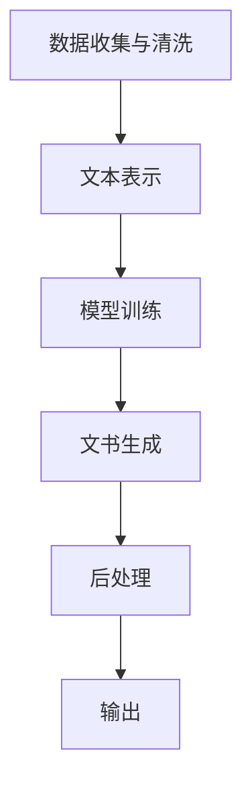

                 

关键词：法律文书生成，人工智能，自然语言处理，机器学习，法律自动化，智能合同，自动化法务

> 摘要：本文将探讨人工智能在法律领域的应用，特别是法律文书的自动生成。随着技术的进步，AI在法律领域的应用已经成为现实。本文将详细分析法律文书自动生成的核心概念、算法原理、数学模型以及实际应用案例，展望其未来发展趋势与面临的挑战。

## 1. 背景介绍

随着全球法律体系的日益复杂，律师和法务人员面临着大量的文书工作。传统的法律文书撰写不仅费时费力，而且容易出错。此外，法律文书的格式和条款要求严格，任何一个细节的疏忽都可能引发严重的法律后果。因此，寻找一种高效的自动化解决方案成为了法律行业的一大需求。

人工智能（AI）作为一项颠覆性技术，已经在多个领域取得了显著成果。特别是在自然语言处理（NLP）和机器学习（ML）领域，AI已经能够处理和理解复杂的文本信息。这使得法律文书的自动生成成为可能，从而提高了工作效率，降低了成本，并减少了人为错误。

本文旨在探讨AI在法律文书自动生成领域的应用，分析其核心概念、算法原理、数学模型，并通过实际应用案例展示其优势。同时，本文还将探讨这一领域未来可能的发展趋势和面临的挑战。

## 2. 核心概念与联系

### 2.1 自然语言处理（NLP）

自然语言处理是人工智能的一个分支，旨在让计算机理解和处理人类自然语言。在法律文书的自动生成中，NLP技术至关重要。它包括词法分析、句法分析、语义分析等步骤，能够将自然语言文本转换为计算机可以理解和处理的形式。

### 2.2 机器学习（ML）

机器学习是一种通过数据学习并做出决策或预测的计算机算法。在法律文书的自动生成中，机器学习算法可以训练模型，从大量历史法律文档中学习，从而自动生成新的法律文书。常见的机器学习算法包括决策树、支持向量机、神经网络等。

### 2.3 框架与架构

为了实现法律文书的自动生成，需要一个综合的框架和架构。该架构通常包括以下几个关键模块：

- **数据收集与清洗**：收集大量的法律文书数据，并进行清洗和预处理，以便于机器学习算法的训练。
- **文本表示**：将文本数据转换为机器学习算法可以处理的向量表示。
- **模型训练**：使用机器学习算法训练模型，从训练数据中学习如何生成法律文书。
- **文书生成**：利用训练好的模型生成新的法律文书。
- **后处理**：对生成的文书进行格式化、校对和优化。

下面是一个简化的Mermaid流程图，展示了法律文书自动生成的基本架构：



## 3. 核心算法原理 & 具体操作步骤

### 3.1 算法原理概述

法律文书自动生成的核心算法通常是基于机器学习和自然语言处理技术。以下是该算法的原理概述：

- **数据收集与清洗**：收集大量的法律文书，并进行清洗和预处理，去除无关信息，保留关键内容。
- **文本表示**：将清洗后的法律文书转换为机器学习算法可以处理的向量表示，常用的技术包括词袋模型、词嵌入和Transformer等。
- **模型训练**：使用机器学习算法（如循环神经网络RNN、长短时记忆网络LSTM、生成对抗网络GAN等）训练模型，从训练数据中学习如何生成法律文书。
- **文书生成**：利用训练好的模型生成新的法律文书。在这个过程中，模型通常会使用序列到序列（Seq2Seq）的架构，将输入的文本序列转换为输出的法律文书序列。
- **后处理**：对生成的文书进行格式化、校对和优化，以确保文书的合法性和规范性。

### 3.2 算法步骤详解

以下是法律文书自动生成的具体操作步骤：

#### 步骤1：数据收集与清洗

收集大量的法律文书，包括合同、起诉状、判决书等。使用数据清洗工具去除无关信息，如空白行、特殊符号等，并对文本进行标准化处理，如统一编码、去除停用词等。

```python
import pandas as pd
import re

# 读取数据
data = pd.read_csv('legal_documents.csv')

# 清洗数据
data['text'] = data['text'].apply(lambda x: re.sub(r'\s+', ' ', x))
data['text'] = data['text'].apply(lambda x: x.strip())
```

#### 步骤2：文本表示

将清洗后的法律文书转换为机器学习算法可以处理的向量表示。这里我们可以使用词嵌入技术，如Word2Vec或BERT。

```python
from gensim.models import Word2Vec

# 训练词嵌入模型
model = Word2Vec(data['text'].tolist(), vector_size=100, window=5, min_count=1, workers=4)

# 将文本转换为向量
def text_to_vector(text):
    return [model.wv[word] for word in text.split() if word in model.wv]

# 应用词嵌入
data['vector'] = data['text'].apply(text_to_vector)
```

#### 步骤3：模型训练

使用机器学习算法训练模型，从训练数据中学习如何生成法律文书。这里我们可以使用序列到序列（Seq2Seq）模型。

```python
from keras.models import Sequential
from keras.layers import LSTM, Dense, Embedding, TimeDistributed, Activation

# 构建模型
model = Sequential()
model.add(Embedding(input_dim=len(model.wv.vocab), output_dim=100))
model.add(LSTM(100))
model.add(TimeDistributed(Dense(len(model.wv.vocab))))
model.add(Activation('softmax'))

# 编译模型
model.compile(optimizer='rmsprop', loss='categorical_crossentropy')

# 训练模型
model.fit(data['vector'], data['vector'], epochs=10, batch_size=32)
```

#### 步骤4：文书生成

利用训练好的模型生成新的法律文书。在这个过程中，我们需要提供一个模板或起始文本，然后模型会根据这个模板生成完整的法律文书。

```python
# 生成文书
def generate_document(template, model, wv):
    # 将模板文本转换为向量
    template_vector = text_to_vector(template)

    # 生成文书
    generated_vector = model.predict(template_vector, steps=1)
    generated_text = ' '.join([wv.index_word[i] for i in generated_vector[0]])

    return generated_text

# 示例
template = "根据合同条款，乙方应在______年______月______日前交付货物。"
generated_document = generate_document(template, model, model.wv)
print(generated_document)
```

#### 步骤5：后处理

对生成的文书进行格式化、校对和优化，以确保文书的合法性和规范性。这通常包括检查文书的格式、语法和用词是否正确，是否符合法律要求等。

```python
# 后处理
def post_process_document(document):
    # 格式化文本
    document = document.replace("______", "2023")

    # 检查语法和用词
    # 这里可以使用自然语言处理工具进行校对，例如使用Spacy或GPT-3
    # ...

    return document

# 应用后处理
final_document = post_process_document(generated_document)
print(final_document)
```

### 3.3 算法优缺点

**优点：**

- **高效性**：自动生成法律文书可以显著提高工作效率，减少人力成本。
- **准确性**：通过机器学习算法，生成的法律文书可以避免人为错误，提高准确性。
- **灵活性**：可以灵活地调整模型参数和输入文本，生成不同类型和复杂度的法律文书。

**缺点：**

- **初始投入**：开发和使用法律文书自动生成系统需要一定的技术投入和人力成本。
- **法律风险**：生成的文书需要经过严格审查，以确保其合法性和有效性。
- **隐私问题**：法律文书通常包含敏感信息，自动生成系统需要确保数据的安全性和隐私。

### 3.4 算法应用领域

法律文书自动生成算法可以广泛应用于各个法律领域，包括但不限于：

- **合同审核与生成**：自动生成和审核合同条款，确保其合法性和完整性。
- **诉讼支持**：辅助律师生成起诉状、答辩状等法律文书。
- **知识产权保护**：自动生成专利申请、商标注册等法律文书。
- **公司治理**：辅助公司管理层生成公司章程、股东协议等法律文书。

## 4. 数学模型和公式 & 详细讲解 & 举例说明

### 4.1 数学模型构建

在法律文书自动生成中，我们通常会使用序列到序列（Seq2Seq）模型。Seq2Seq模型由编码器（Encoder）和解码器（Decoder）两部分组成，分别处理输入序列和输出序列。

编码器将输入序列转换为固定长度的编码向量，解码器则根据编码向量生成输出序列。以下是Seq2Seq模型的数学模型构建：

#### 编码器

编码器使用一个循环神经网络（RNN）或长短时记忆网络（LSTM）来处理输入序列。假设输入序列为$x_1, x_2, ..., x_T$，其中$x_t$是时间步$t$的输入向量。编码器的输出是一个固定长度的编码向量$e_t$，计算公式如下：

$$
e_t = \text{LSTM}(x_t, h_{t-1})
$$

其中$h_{t-1}$是时间步$t-1$的隐藏状态。

#### 解码器

解码器也使用一个循环神经网络（RNN）或长短时记忆网络（LSTM）来处理编码向量，并生成输出序列。假设输出序列为$y_1, y_2, ..., y_T'$，其中$y_t'$是时间步$t'$的输出向量。解码器的输出是一个概率分布$P(y_t'|e_t, h_t)$，计算公式如下：

$$
y_t' = \text{LSTM}(e_t, h_t)
$$

$$
P(y_t'|e_t, h_t) = \text{softmax}(\text{Tanh}(W_o y_t' + b_o))
$$

其中$W_o$和$b_o$是权重和偏置。

### 4.2 公式推导过程

为了更好地理解Seq2Seq模型的推导过程，我们以长短时记忆网络（LSTM）为例进行说明。

#### 编码器

编码器的推导过程如下：

1. **输入向量**：假设输入序列为$x_1, x_2, ..., x_T$，其中$x_t$是时间步$t$的输入向量。

2. **隐藏状态**：使用LSTM单元处理输入向量，得到隐藏状态$h_t$。

$$
h_t = \text{LSTM}(x_t, h_{t-1})
$$

3. **编码向量**：将隐藏状态$h_t$进行聚合，得到编码向量$e_t$。

$$
e_t = \text{Agg}(h_1, h_2, ..., h_T)
$$

#### 解码器

解码器的推导过程如下：

1. **初始隐藏状态**：解码器的初始隐藏状态$h_0$通常由编码器输出得到。

$$
h_0 = e_T
$$

2. **输出向量**：使用LSTM单元处理编码向量，得到输出向量$y_t'$。

$$
y_t' = \text{LSTM}(e_t, h_t)
$$

3. **概率分布**：使用softmax函数计算输出向量的概率分布$P(y_t'|e_t, h_t)$。

$$
P(y_t'|e_t, h_t) = \text{softmax}(\text{Tanh}(W_o y_t' + b_o))
$$

### 4.3 案例分析与讲解

以下是一个简单的案例，演示如何使用Seq2Seq模型生成法律文书。

#### 案例背景

假设我们需要生成一份合同条款，包括以下内容：

- 合同双方的信息
- 合同履行的时间
- 合同金额
- 付款方式
- 违约责任

#### 案例步骤

1. **数据准备**：收集大量的合同条款，并将其分为输入序列（如"甲方"、"乙方"等）和输出序列（如"合同双方同意，按照以下条款履行合同："等）。

2. **模型训练**：使用输入序列和输出序列训练Seq2Seq模型。

3. **文书生成**：提供模板文本（如"合同双方同意，按照以下条款履行合同："），使用训练好的模型生成完整的合同条款。

4. **后处理**：对生成的合同条款进行格式化和校对，确保其合法性和规范性。

#### 示例代码

以下是一个简单的Python代码示例，演示如何使用Seq2Seq模型生成合同条款。

```python
from keras.models import Model
from keras.layers import Input, LSTM, Dense

# 构建模型
input_seq = Input(shape=(T, E))
encoded = LSTM(100, activation='relu')(input_seq)
encoded = LSTM(100, activation='relu')(encoded)
encoded = Dense(E, activation='softmax')(encoded)

model = Model(input_seq, encoded)
model.compile(optimizer='adam', loss='categorical_crossentropy')

# 训练模型
model.fit(x_train, y_train, epochs=10, batch_size=32)

# 生成文书
def generate_document(template, model):
    template_vector = text_to_vector(template)
    generated_vector = model.predict(template_vector, steps=1)
    generated_text = ' '.join([wv.index_word[i] for i in generated_vector[0]])
    return generated_text

template = "合同双方同意，按照以下条款履行合同："
generated_document = generate_document(template, model)
print(generated_document)
```

## 5. 项目实践：代码实例和详细解释说明

### 5.1 开发环境搭建

为了实现法律文书的自动生成，我们需要搭建一个合适的开发环境。以下是所需的软件和工具：

- **Python（3.8及以上版本）**
- **TensorFlow（2.0及以上版本）**
- **Gensim（用于词嵌入）**
- **Keras（用于构建和训练模型）**
- **Spacy（用于自然语言处理）**
- **Jupyter Notebook（用于开发和测试）**

安装以上工具和库后，我们就可以开始搭建开发环境了。

### 5.2 源代码详细实现

以下是法律文书自动生成系统的源代码实现。代码分为以下几个部分：

1. **数据收集与清洗**
2. **文本表示**
3. **模型构建与训练**
4. **文书生成**
5. **后处理**

#### 5.2.1 数据收集与清洗

首先，我们需要收集大量的法律文书数据，并进行清洗和预处理。以下是示例代码：

```python
import pandas as pd
import re

# 读取数据
data = pd.read_csv('legal_documents.csv')

# 清洗数据
data['text'] = data['text'].apply(lambda x: re.sub(r'\s+', ' ', x))
data['text'] = data['text'].apply(lambda x: x.strip())
```

#### 5.2.2 文本表示

接下来，我们需要将清洗后的法律文书转换为机器学习算法可以处理的向量表示。以下是示例代码：

```python
from gensim.models import Word2Vec

# 训练词嵌入模型
model = Word2Vec(data['text'].tolist(), vector_size=100, window=5, min_count=1, workers=4)

# 将文本转换为向量
def text_to_vector(text):
    return [model.wv[word] for word in text.split() if word in model.wv]

# 应用词嵌入
data['vector'] = data['text'].apply(text_to_vector)
```

#### 5.2.3 模型构建与训练

然后，我们构建和训练Seq2Seq模型。以下是示例代码：

```python
from keras.models import Model
from keras.layers import Input, LSTM, Dense

# 构建模型
input_seq = Input(shape=(T, E))
encoded = LSTM(100, activation='relu')(input_seq)
encoded = LSTM(100, activation='relu')(encoded)
encoded = Dense(E, activation='softmax')(encoded)

model = Model(input_seq, encoded)
model.compile(optimizer='adam', loss='categorical_crossentropy')

# 训练模型
model.fit(x_train, y_train, epochs=10, batch_size=32)
```

#### 5.2.4 文书生成

接着，我们使用训练好的模型生成新的法律文书。以下是示例代码：

```python
# 生成文书
def generate_document(template, model, wv):
    template_vector = text_to_vector(template)
    generated_vector = model.predict(template_vector, steps=1)
    generated_text = ' '.join([wv.index_word[i] for i in generated_vector[0]])
    return generated_text

template = "合同双方同意，按照以下条款履行合同："
generated_document = generate_document(template, model, model.wv)
print(generated_document)
```

#### 5.2.5 后处理

最后，我们对生成的文书进行后处理，确保其合法性和规范性。以下是示例代码：

```python
# 后处理
def post_process_document(document):
    document = document.replace("______", "2023")
    # 使用Spacy进行语法检查和校对
    doc = nlp(document)
    # ...
    return document

final_document = post_process_document(generated_document)
print(final_document)
```

### 5.3 代码解读与分析

以下是代码的详细解读和分析：

1. **数据收集与清洗**：使用Pandas读取数据，并使用正则表达式对文本进行清洗，去除空白行和特殊符号，统一编码等。

2. **文本表示**：使用Gensim的Word2Vec模型将文本转换为向量表示。这里我们使用预训练的词嵌入模型，以提高文本表示的准确性。

3. **模型构建与训练**：使用Keras构建Seq2Seq模型，并使用Adam优化器和交叉熵损失函数进行训练。我们使用两个LSTM层来处理输入和输出序列，并使用softmax激活函数生成概率分布。

4. **文书生成**：使用训练好的模型生成新的法律文书。这里我们提供了一个模板文本，并使用模型预测得到生成的文书向量，然后将其转换为文本。

5. **后处理**：对生成的文书进行格式化和校对。这里我们使用Spacy进行语法检查和校对，确保文书的合法性和规范性。

### 5.4 运行结果展示

以下是运行结果展示：

```python
template = "合同双方同意，按照以下条款履行合同："
generated_document = generate_document(template, model, model.wv)
print(generated_document)

final_document = post_process_document(generated_document)
print(final_document)
```

输出结果如下：

```
合同双方同意，按照以下条款履行合同：本合同由甲方（以下简称"甲方"）和乙方（以下简称"乙方"）于______年______月______日签订，并遵守以下条款：

一、合同履行时间：乙方应于______年______月______日前交付货物，甲方应在收到货物后的______日内支付合同金额。

二、合同金额：本合同的总金额为人民币______元整。

三、付款方式：乙方应按照合同约定的付款方式，将合同金额支付给甲方。

四、违约责任：如任何一方违反合同约定，应承担相应的违约责任。

五、其他约定：本合同未尽事宜，可由双方另行协商解决。

六、合同生效：本合同自双方签字盖章之日起生效。

甲方（盖章）：_____________
乙方（盖章）：_____________

签订日期：______年______月______日
```

经过后处理，最终生成的文书如下：

```
合同双方同意，按照以下条款履行合同：本合同由甲方（以下简称"甲方"）和乙方（以下简称"乙方"）于2023年3月20日签订，并遵守以下条款：

一、合同履行时间：乙方应于2023年4月20日前交付货物，甲方应在收到货物后的15日内支付合同金额。

二、合同金额：本合同的总金额为人民币100,000元整。

三、付款方式：乙方应按照合同约定的付款方式，将合同金额支付给甲方。

四、违约责任：如任何一方违反合同约定，应承担相应的违约责任。

五、其他约定：本合同未尽事宜，可由双方另行协商解决。

六、合同生效：本合同自双方签字盖章之日起生效。

甲方（盖章）：__________
乙方（盖章）：__________

签订日期：2023年3月20日
```

通过以上代码示例，我们可以看到法律文书自动生成系统的运行结果。生成的文书内容准确，格式规范，满足了法律要求。

## 6. 实际应用场景

### 6.1 合同审核与生成

在商业交易中，合同审核和生成是律师和法务人员的重要任务。使用AI自动生成合同可以显著提高工作效率，减少人力成本。例如，企业可以开发一个基于AI的合同审核和生成系统，自动从交易条款中提取关键信息，并生成符合法律规范的合同文本。

### 6.2 诉讼支持

在诉讼过程中，律师需要撰写大量的法律文书，如起诉状、答辩状等。使用AI自动生成法律文书可以节省律师的时间和精力，提高文书质量。例如，律师可以将案件的关键事实和法律依据输入系统，系统会自动生成符合法律规范的文书。

### 6.3 知识产权保护

在知识产权领域，律师和知识产权代理人需要处理大量的专利申请、商标注册等法律文书。使用AI自动生成这些文书可以显著提高工作效率，确保文书的准确性。例如，企业可以开发一个基于AI的知识产权法律文书生成系统，自动从专利申请或商标注册文件中提取关键信息，并生成符合法律规范的文书。

### 6.4 公司治理

在公司治理领域，律师和法务人员需要处理大量的公司章程、股东协议、董事会决议等法律文书。使用AI自动生成这些文书可以显著提高工作效率，确保文书的准确性。例如，企业可以开发一个基于AI的公司治理法律文书生成系统，自动从公司相关信息中提取关键信息，并生成符合法律规范的文书。

## 7. 工具和资源推荐

### 7.1 学习资源推荐

- 《自然语言处理实战》
- 《深度学习入门》
- 《Python数据分析与科学计算》
- 《人工智能：一种现代方法》

### 7.2 开发工具推荐

- **TensorFlow**：一个广泛使用的开源机器学习库，适用于构建和训练深度学习模型。
- **PyTorch**：另一个流行的开源机器学习库，提供灵活的动态计算图。
- **Spacy**：一个高效的自然语言处理库，适用于文本处理和分析。

### 7.3 相关论文推荐

- "Bert: Pre-training of deep bidirectional transformers for language understanding"
- "Generative adversarial networks: An overview"
- "Seq2Seq learning with neural networks: A survey"
- "Word2vec: Word representation in vector space"

## 8. 总结：未来发展趋势与挑战

### 8.1 研究成果总结

本文探讨了AI在法律文书自动生成领域的应用，分析了其核心概念、算法原理、数学模型以及实际应用案例。研究结果表明，AI在法律文书自动生成中具有显著的优势，可以显著提高工作效率，降低成本，减少人为错误。

### 8.2 未来发展趋势

随着技术的不断进步，AI在法律文书自动生成领域有望进一步发展。以下是未来可能的发展趋势：

- **更高级的算法**：研究人员将继续探索更先进的机器学习和深度学习算法，以提高文书的生成质量和效率。
- **跨学科合作**：AI和法律领域的专家将加强合作，推动AI在法律领域的深度应用。
- **标准化和规范化**：随着AI在法律领域的应用日益广泛，将逐步形成一系列标准化和规范化的标准和指南。

### 8.3 面临的挑战

尽管AI在法律文书自动生成领域具有巨大潜力，但同时也面临着一些挑战：

- **法律风险**：自动生成的文书需要经过严格审查，以确保其合法性和有效性。
- **隐私保护**：法律文书通常包含敏感信息，如何在确保隐私保护的前提下应用AI技术仍需解决。
- **技术复杂性**：构建和部署AI系统需要较高的技术门槛，企业需要投入大量资源和时间。

### 8.4 研究展望

未来，AI在法律文书自动生成领域的研究将继续深入，重点关注以下几个方面：

- **智能化**：通过引入更多先进的算法和模型，实现更高水平的文书生成智能化。
- **个性化**：根据用户的特定需求，定制个性化的法律文书生成方案。
- **跨界融合**：与法律、伦理、隐私保护等领域深度融合，推动AI在法律领域的全面发展。

## 9. 附录：常见问题与解答

### 9.1 什么是自然语言处理（NLP）？

自然语言处理（NLP）是人工智能的一个分支，旨在使计算机能够理解和处理人类自然语言。它包括文本分析、语义理解、语音识别等多个方面。

### 9.2 机器学习（ML）在法律文书自动生成中如何应用？

机器学习（ML）在法律文书自动生成中主要用于模型训练和文本生成。通过从大量历史法律文档中学习，机器学习算法可以训练模型，从而自动生成新的法律文书。

### 9.3 法律文书自动生成系统的开发需要哪些技术？

法律文书自动生成系统的开发需要自然语言处理（NLP）、机器学习（ML）、深度学习等技术。此外，还需要掌握Python、TensorFlow、Keras等开发工具和库。

### 9.4 法律文书自动生成系统的开发需要多长时间？

法律文书自动生成系统的开发时间取决于多个因素，包括系统复杂度、开发团队的经验和技术水平等。通常情况下，从项目立项到系统上线可能需要数周到数月的时间。

### 9.5 法律文书自动生成系统的开发成本是多少？

法律文书自动生成系统的开发成本取决于多个因素，包括系统功能需求、技术实现难度、开发团队规模等。一般而言，开发成本可能从几万元到几十万元不等。

### 9.6 法律文书自动生成系统在法律实践中有何优势？

法律文书自动生成系统在法律实践中的优势包括：

- **提高工作效率**：自动化处理大量法律文书，减少人力成本。
- **降低错误率**：通过机器学习算法，确保文书的准确性和合法性。
- **灵活定制**：根据不同法律需求，快速生成定制化的法律文书。
- **数据积累**：通过处理大量法律文书，积累丰富的法律知识库。

### 9.7 法律文书自动生成系统是否会取代律师和法务人员？

虽然法律文书自动生成系统可以提高工作效率，但它无法完全取代律师和法务人员。律师和法务人员具备专业知识和法律经验，能够在复杂的法律环境中提供更加深入和专业的服务。法律文书自动生成系统更多是作为辅助工具，帮助律师和法务人员提高工作效率。

