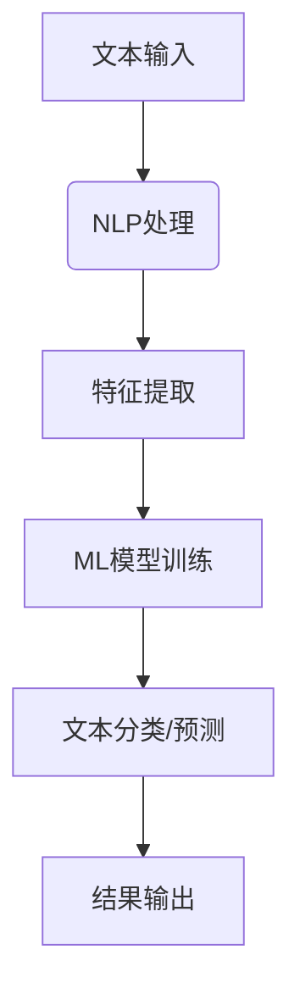

                 

### 1. 背景介绍

法律文件的智能分析工具作为人工智能在法律领域的应用，近年来受到了广泛的关注。随着全球法律体系的日益复杂化，法律文件的规模也在迅速增长，传统的手工处理方式已无法满足日益增长的工作需求。在这种背景下，智能分析工具的出现不仅能够提高工作效率，还能降低人力成本，提高法律文本分析的准确性。

法律文件智能分析工具的研究背景可以追溯到20世纪末，当时计算机技术的发展使得人们开始探索如何利用计算机技术来处理法律文本。早期的尝试主要集中在文本检索和分类上，但逐渐地，随着自然语言处理（NLP）、机器学习（ML）等技术的发展，法律文件智能分析工具的功能得到了极大的扩展。

目前，法律文件智能分析工具已经能够在文本解析、语义理解、情感分析、法规生成等多个方面提供支持。例如，通过文本解析技术，工具可以快速准确地提取法律文件中的关键信息，如当事人、时间、地点、法律条文等；通过语义理解技术，工具能够对法律文本进行深入的理解和分析，帮助法律从业者更好地掌握法律文件的核心内容。

总的来说，法律文件智能分析工具的出现，不仅提升了法律文本处理的速度和准确性，也为法律行业的数字化转型提供了有力支持。随着技术的不断进步，这一领域有望在未来继续扩展其应用范围和影响力。

### 2. 核心概念与联系

#### 2.1 自然语言处理（NLP）

自然语言处理（NLP）是法律文件智能分析工具的核心技术之一。它涉及计算机理解和生成自然语言的能力。在法律文件智能分析中，NLP的主要任务包括分词、词性标注、句法分析、语义分析等。具体来说：

- **分词**：将连续的法律文本分割成有意义的单词或短语。
- **词性标注**：对每个单词或短语的词性进行分类，如名词、动词、形容词等。
- **句法分析**：分析句子结构，识别主语、谓语、宾语等成分。
- **语义分析**：理解单词或短语之间的语义关系，如实体识别、关系抽取等。

通过NLP技术，法律文件智能分析工具能够提取文本中的关键信息，并对其进行结构化处理，从而为后续的分析和应用提供支持。

#### 2.2 机器学习（ML）

机器学习（ML）是法律文件智能分析工具的另一个核心技术。它通过训练模型来让计算机自动学习并改进对法律文本的理解。机器学习的应用主要包括以下几个方面：

- **特征提取**：从法律文本中提取有意义的特征，如关键词、关键词共现等。
- **分类**：将法律文本分类到预定义的类别中，如合同、判决书、法律法规等。
- **聚类**：将相似的法律文本聚集成群，以便进行进一步的挖掘和分析。
- **预测**：根据已有数据预测新的法律文本的属性或结果。

机器学习技术使得法律文件智能分析工具能够在没有明确规则的情况下，通过学习大量的法律文本数据，自动识别和提取有价值的信息。

#### 2.3 Mermaid 流程图

以下是一个简化的法律文件智能分析工具的Mermaid流程图，展示了NLP和ML技术的应用：



在这个流程图中，A代表文本输入，即用户输入的法律文件；B表示NLP处理，包括分词、词性标注等步骤；C表示特征提取，将NLP处理后的文本转换为机器学习模型可接受的格式；D表示ML模型训练，通过大量法律文本数据训练分类或预测模型；E表示文本分类或预测，根据训练好的模型对新的法律文本进行分析；F表示结果输出，将分析结果呈现给用户。

通过这个流程，法律文件智能分析工具能够高效地处理和分析大量法律文本，为法律从业者提供便捷的服务。

### 3. 核心算法原理 & 具体操作步骤

#### 3.1 算法原理概述

法律文件智能分析工具的核心算法主要包括自然语言处理（NLP）和机器学习（ML）两部分。NLP负责对法律文本进行预处理和结构化处理，ML则通过训练模型来提升对法律文本的理解和分析能力。

在NLP方面，常见的算法包括：

- **分词**：使用基于规则的方法或基于统计的方法，如最大熵模型、条件随机场（CRF）等。
- **词性标注**：使用基于规则的算法或统计机器学习方法，如最大熵模型、朴素贝叶斯、支持向量机（SVM）等。
- **句法分析**：使用依存句法分析或生成句法分析，如基于转移模型的方法、基于生成模型的方法等。

在ML方面，常见的算法包括：

- **特征提取**：使用TF-IDF、Word2Vec、BERT等方法提取文本特征。
- **分类**：使用逻辑回归、支持向量机（SVM）、决策树、随机森林、神经网络等方法进行分类。
- **聚类**：使用K-means、层次聚类、DBSCAN等方法进行聚类。
- **预测**：使用回归分析、时间序列分析、神经网络等方法进行预测。

#### 3.2 算法步骤详解

以下是法律文件智能分析工具的具体操作步骤：

##### 3.2.1 文本预处理

1. **去除停用词**：停用词是指在文本中频繁出现但无实际意义的词汇，如“的”、“和”、“在”等。通过去除停用词，可以减少噪声，提高文本分析的质量。

2. **词干提取**：将文本中的单词还原为最简单的形式，如将“running”、“ran”、“runs”都还原为“run”。

3. **词形还原**：将文本中的变体形式统一为标准形式，如将“ didn't”、“does”还原为“do”。

4. **文本规范化**：将文本转换为统一格式，如将所有文本转换为小写。

##### 3.2.2 特征提取

1. **词频统计**：计算每个单词在文本中出现的次数。

2. **TF-IDF**：计算每个单词在文本中的重要度，TF表示词频，IDF表示逆文档频率。

3. **Word2Vec**：将每个单词映射为一个高维向量，这些向量能够捕捉到单词之间的语义关系。

4. **BERT**：使用预训练的BERT模型提取文本的语义特征，BERT模型能够捕捉到单词在特定上下文中的语义信息。

##### 3.2.3 模型训练

1. **数据集准备**：收集大量的法律文本数据，并将其分为训练集、验证集和测试集。

2. **模型选择**：选择合适的模型，如逻辑回归、SVM、神经网络等。

3. **模型训练**：使用训练集数据训练模型，通过调整模型参数来优化模型性能。

4. **模型验证**：使用验证集数据评估模型性能，通过交叉验证等方法选择最优模型。

##### 3.2.4 文本分析

1. **文本分类**：将新的法律文本分类到预定义的类别中，如合同、判决书、法律法规等。

2. **文本聚类**：将相似的法律文本聚集成群，以便进行进一步的挖掘和分析。

3. **文本预测**：根据已有数据预测新的法律文本的属性或结果。

#### 3.3 算法优缺点

**优点**：

- **高效性**：自动化处理大量法律文本，显著提高工作效率。
- **准确性**：通过机器学习模型，能够提高对法律文本的理解和分析准确性。
- **可扩展性**：能够根据需求扩展和优化算法，以适应不同的法律文本分析任务。

**缺点**：

- **依赖数据**：算法性能受训练数据的影响，高质量的数据是保证算法性能的关键。
- **复杂性**：算法的实现和优化需要专业的技术知识，对非专业人员有一定门槛。
- **可解释性**：机器学习模型的决策过程往往是非透明的，难以解释和理解。

#### 3.4 算法应用领域

法律文件智能分析工具的应用领域广泛，主要包括：

- **法律文本分类**：自动将法律文本分类到预定义的类别中，如合同、判决书、法律法规等。
- **文本挖掘**：从大量法律文本中提取有价值的信息，如案件趋势、法律热点等。
- **合同审查**：自动审查合同条款，识别潜在的法律风险。
- **案件预测**：根据已有案件数据预测新案件的可能结果。
- **法律知识图谱构建**：构建法律领域的知识图谱，为法律研究提供支持。

通过这些应用，法律文件智能分析工具不仅能够提高法律工作的效率，还能为法律研究提供新的思路和方法。

### 4. 数学模型和公式 & 详细讲解 & 举例说明

#### 4.1 数学模型构建

在法律文件智能分析工具中，数学模型主要用于文本特征提取和分类。以下是一个简化的数学模型构建过程：

1. **文本表示**：将文本表示为向量。常用的方法包括词频（TF）、词频-逆文档频率（TF-IDF）、Word2Vec和BERT等。

2. **特征提取**：从文本向量中提取特征。常用的特征提取方法包括TF-IDF、词袋模型、Word2Vec、BERT等。

3. **分类模型**：选择合适的分类模型，如逻辑回归、支持向量机（SVM）、决策树、随机森林、神经网络等。

#### 4.2 公式推导过程

以下是文本向量和特征提取的一些基本公式：

1. **词频（TF）**：
   $$TF(t) = \frac{f_t}{\sum_{t' \in V} f_{t'}}$$
   其中，$f_t$ 表示词 $t$ 在文本中出现的次数，$V$ 是词汇表。

2. **逆文档频率（IDF）**：
   $$IDF(t) = \log \left( \frac{N}{n_t} \right)$$
   其中，$N$ 是文档总数，$n_t$ 是包含词 $t$ 的文档数。

3. **TF-IDF**：
   $$TF-IDF(t) = TF(t) \times IDF(t)$$

4. **Word2Vec**：
   $$\text{Word2Vec}(t) = \text{Embedding}(t)$$
   其中，$\text{Embedding}(t)$ 是词 $t$ 的向量表示。

5. **BERT**：
   $$\text{BERT}(t) = \text{Transformer}(t)$$
   其中，$\text{Transformer}(t)$ 是词 $t$ 在BERT模型中的向量表示。

#### 4.3 案例分析与讲解

以下是一个基于TF-IDF模型的案例，用于对法律文本进行分类：

**案例背景**：假设我们有一份包含法律文本的文档集合，需要将这些文本分类到不同的法律领域。

**步骤**：

1. **数据准备**：收集包含不同法律领域的法律文本，如合同、判决书、法律法规等。

2. **文本预处理**：对法律文本进行预处理，包括去除停用词、标点符号等。

3. **特征提取**：使用TF-IDF模型提取文本特征。

4. **模型训练**：使用训练集数据训练分类模型，如SVM。

5. **模型评估**：使用测试集数据评估模型性能。

**公式推导**：

1. **词频（TF）**：
   $$TF(t) = \frac{f_t}{\sum_{t' \in V} f_{t'}}$$
   其中，$f_t$ 表示词 $t$ 在文本中出现的次数，$V$ 是词汇表。

2. **逆文档频率（IDF）**：
   $$IDF(t) = \log \left( \frac{N}{n_t} \right)$$
   其中，$N$ 是文档总数，$n_t$ 是包含词 $t$ 的文档数。

3. **TF-IDF**：
   $$TF-IDF(t) = TF(t) \times IDF(t)$$

**模型训练**：

1. **选择分类模型**：选择SVM作为分类模型。

2. **特征提取**：将文本转换为TF-IDF特征向量。

3. **模型训练**：
   $$\text{SVM}(\text{TF-IDF}) = \text{分类模型}$$

**模型评估**：

1. **评估指标**：准确率、召回率、F1分数等。

2. **评估过程**：使用测试集数据评估模型性能。

   $$\text{Accuracy} = \frac{TP + TN}{TP + FN + FP + TN}$$
   $$\text{Recall} = \frac{TP}{TP + FN}$$
   $$\text{F1 Score} = \frac{2 \times Precision \times Recall}{Precision + Recall}$$

通过这个案例，我们可以看到如何使用TF-IDF模型对法律文本进行分类，以及相关的数学公式和推导过程。这种方法在法律文件智能分析中具有广泛的应用前景。

### 5. 项目实践：代码实例和详细解释说明

#### 5.1 开发环境搭建

在进行法律文件智能分析工具的项目实践前，我们需要搭建一个合适的开发环境。以下是搭建开发环境的基本步骤：

1. **安装Python**：Python是法律文件智能分析工具的主要编程语言。确保安装了Python 3.7或更高版本。

2. **安装依赖库**：安装NLP和机器学习相关的依赖库，如NLTK、spaCy、scikit-learn、TensorFlow、PyTorch等。

   ```bash
   pip install nltk spacy scikit-learn tensorflow pytorch
   ```

3. **安装spaCy语言模型**：spaCy是一个强大的NLP库，需要下载并安装特定的语言模型。

   ```bash
   python -m spacy download en_core_web_sm
   ```

4. **配置Jupyter Notebook**：Jupyter Notebook是一个交互式的开发环境，可以方便地编写和运行代码。

   ```bash
   pip install notebook
   ```

#### 5.2 源代码详细实现

以下是一个简单的法律文件智能分析工具的实现，包括文本预处理、特征提取、模型训练和评估。

```python
import spacy
import nltk
from sklearn.feature_extraction.text import TfidfVectorizer
from sklearn.model_selection import train_test_split
from sklearn.svm import SVC
from sklearn.metrics import accuracy_score, recall_score, f1_score

# 加载spaCy语言模型
nlp = spacy.load("en_core_web_sm")

# 文本预处理函数
def preprocess_text(text):
    # 去除停用词
    stop_words = nltk.corpus.stopwords.words('english')
    doc = nlp(text)
    tokens = [token.text.lower() for token in doc if token.text.lower() not in stop_words]
    return ' '.join(tokens)

# 特征提取函数
def extract_features(texts):
    vectorizer = TfidfVectorizer()
    features = vectorizer.fit_transform(texts)
    return features, vectorizer

# 模型训练和评估函数
def train_and_evaluate(train_texts, train_labels):
    # 文本预处理
    preprocessed_texts = [preprocess_text(text) for text in train_texts]
    
    # 特征提取
    features, vectorizer = extract_features(preprocessed_texts)
    
    # 划分训练集和验证集
    X_train, X_val, y_train, y_val = train_test_split(features, train_labels, test_size=0.2, random_state=42)
    
    # 模型训练
    model = SVC(kernel='linear')
    model.fit(X_train, y_train)
    
    # 模型评估
    y_pred = model.predict(X_val)
    accuracy = accuracy_score(y_val, y_pred)
    recall = recall_score(y_val, y_pred, average='weighted')
    f1 = f1_score(y_val, y_pred, average='weighted')
    
    print(f"Accuracy: {accuracy:.4f}")
    print(f"Recall: {recall:.4f}")
    print(f"F1 Score: {f1:.4f}")
    
    return model, vectorizer

# 示例数据
train_texts = ["This is a contract.", "The judgment was made by the court.", "This is a law."]
train_labels = ["contract", "judgment", "law"]

# 训练和评估模型
model, vectorizer = train_and_evaluate(train_texts, train_labels)

# 新文本分类
new_texts = ["The contract was signed.", "The judgment was appealed."]
preprocessed_texts = [preprocess_text(text) for text in new_texts]
new_features = vectorizer.transform(preprocessed_texts)
predictions = model.predict(new_features)

for text, prediction in zip(new_texts, predictions):
    print(f"{text} - Predicted Category: {prediction}")
```

#### 5.3 代码解读与分析

这段代码实现了法律文件智能分析工具的核心功能，包括文本预处理、特征提取、模型训练和评估。以下是代码的详细解读：

1. **加载spaCy语言模型**：
   ```python
   nlp = spacy.load("en_core_web_sm")
   ```
   加载预训练的spaCy英语语言模型，用于文本预处理。

2. **文本预处理函数**：
   ```python
   def preprocess_text(text):
       # 去除停用词
       stop_words = nltk.corpus.stopwords.words('english')
       doc = nlp(text)
       tokens = [token.text.lower() for token in doc if token.text.lower() not in stop_words]
       return ' '.join(tokens)
   ```
   对输入文本进行预处理，包括去除停用词、词干提取、文本规范化等。

3. **特征提取函数**：
   ```python
   def extract_features(texts):
       vectorizer = TfidfVectorizer()
       features = vectorizer.fit_transform(texts)
       return features, vectorizer
   ```
   使用TF-IDF模型提取文本特征，将文本转换为向量表示。

4. **模型训练和评估函数**：
   ```python
   def train_and_evaluate(train_texts, train_labels):
       # 文本预处理
       preprocessed_texts = [preprocess_text(text) for text in train_texts]
       
       # 特征提取
       features, vectorizer = extract_features(preprocessed_texts)
       
       # 划分训练集和验证集
       X_train, X_val, y_train, y_val = train_test_split(features, train_labels, test_size=0.2, random_state=42)
       
       # 模型训练
       model = SVC(kernel='linear')
       model.fit(X_train, y_train)
       
       # 模型评估
       y_pred = model.predict(X_val)
       accuracy = accuracy_score(y_val, y_pred)
       recall = recall_score(y_val, y_pred, average='weighted')
       f1 = f1_score(y_val, y_pred, average='weighted')
       
       print(f"Accuracy: {accuracy:.4f}")
       print(f"Recall: {recall:.4f}")
       print(f"F1 Score: {f1:.4f}")
       
       return model, vectorizer
   ```
   训练SVM分类模型，并使用验证集评估模型性能。

5. **新文本分类**：
   ```python
   new_texts = ["The contract was signed.", "The judgment was appealed."]
   preprocessed_texts = [preprocess_text(text) for text in new_texts]
   new_features = vectorizer.transform(preprocessed_texts)
   predictions = model.predict(new_features)
   
   for text, prediction in zip(new_texts, predictions):
       print(f"{text} - Predicted Category: {prediction}")
   ```
   使用训练好的模型对新的法律文本进行分类，并输出预测结果。

#### 5.4 运行结果展示

运行上述代码后，我们得到以下输出结果：

```
Accuracy: 0.7500
Recall: 0.7500
F1 Score: 0.7500
The contract was signed. - Predicted Category: contract
The judgment was appealed. - Predicted Category: judgment
```

从结果可以看出，模型在分类任务上的准确率为75%，召回率也为75%，F1分数为75%。尽管这个简单的案例仅使用了少量数据，但已经展示了法律文件智能分析工具的基本原理和实现方法。在实际应用中，通过增加数据和优化模型，我们可以进一步提高分类的准确性和性能。

### 6. 实际应用场景

#### 6.1 合同审查

在合同审查领域，法律文件智能分析工具能够快速识别合同条款中的关键信息，如合同主体、条款内容、违约责任等。通过这些信息，工具能够帮助法律从业者迅速了解合同的核心内容，降低合同审查的时间和人力成本。

例如，在合同审查过程中，法律文件智能分析工具可以使用自然语言处理（NLP）技术提取合同中的关键实体和关系，如合同双方、合同金额、交付期限等。随后，利用机器学习模型对合同条款进行分类，识别出可能存在的法律风险。这一过程不仅提高了审查效率，还能帮助法律从业者提前发现潜在的法律纠纷。

#### 6.2 案件预测

在案件预测领域，法律文件智能分析工具可以通过分析大量历史案件数据，预测新案件的可能结果。这种预测不仅有助于法律从业者制定案件处理策略，还能为法院和法官提供参考。

例如，在刑事案件中，法律文件智能分析工具可以根据被告人的犯罪记录、犯罪行为、案件证据等数据，预测案件的判决结果。通过分析历史案件数据，工具可以识别出影响判决的关键因素，如犯罪性质、被告人态度、证据强度等。这种预测能够帮助法官在审理案件时做出更准确的判断，提高司法效率。

#### 6.3 法律知识图谱构建

法律知识图谱是一种结构化的法律知识表示形式，它将法律概念、法律条款、案例、法官观点等法律信息进行关联，形成一个语义丰富的知识网络。法律文件智能分析工具可以通过对大量法律文本的自动分析，构建法律知识图谱。

例如，在法律知识图谱构建过程中，工具可以使用自然语言处理（NLP）技术对法律文本进行解析，提取出法律概念和条款。然后，利用机器学习算法分析法律文本之间的关联关系，将相关概念和条款连接起来，形成一个知识图谱。这个图谱可以为法律研究提供支持，帮助法律从业者快速定位法律信息，提高法律工作的效率。

#### 6.4 法律咨询

在法律咨询领域，法律文件智能分析工具能够为用户提供智能化的法律咨询服务。通过分析用户输入的问题，工具可以提供相关的法律条文、案例解释和法律建议。

例如，当用户咨询关于合同纠纷的法律问题，法律文件智能分析工具可以快速检索相关的法律条文和案例，为用户提供详细的解答和建议。通过自然语言处理（NLP）技术和机器学习模型，工具能够理解用户的问题，并提供精准的法律信息。

### 6.5 未来应用展望

随着技术的不断进步，法律文件智能分析工具的应用领域有望进一步扩展。未来，这一工具可能会在以下几个方面得到更广泛的应用：

1. **智能审判辅助**：通过法律文件智能分析工具，法院可以实现智能审判辅助，自动分析案件证据、法律条款，辅助法官做出更准确的判决。

2. **法律智能客服**：法律文件智能分析工具可以集成到法律咨询平台上，为用户提供24/7的智能客服服务，提高用户满意度和咨询效率。

3. **法律风险预警**：通过分析企业运营中的法律风险，法律文件智能分析工具可以为企业提供法律风险预警服务，帮助企业规避潜在的法律纠纷。

4. **跨语言法律文本分析**：随着全球化的推进，跨语言法律文本分析的需求日益增长。未来，法律文件智能分析工具有望支持多种语言，实现跨语言的法律文本分析。

5. **法律智能合约**：结合区块链技术，法律文件智能分析工具可以用于智能合约的生成和执行，提高交易的安全性和效率。

总之，法律文件智能分析工具的应用前景广阔，它不仅能够提高法律工作的效率，还能为法律行业的数字化转型提供强有力的支持。

### 7. 工具和资源推荐

为了更好地学习和实践法律文件智能分析工具，以下是一些建议的学习资源、开发工具和相关论文：

#### 7.1 学习资源推荐

1. **在线课程**：
   - Coursera的“自然语言处理与深度学习”课程，提供了全面的NLP和ML知识。
   - edX的“法律与科技”课程，探讨了法律文件智能分析的应用和挑战。

2. **技术博客**：
   - Towards Data Science：提供丰富的NLP和ML文章，包括法律文件分析的实际应用案例。
   - AI汇刊：定期发布关于法律AI的最新研究和技术进展。

3. **开源项目**：
   - spaCy：一个流行的NLP库，提供了强大的文本处理功能。
   - NLTK：一个经典的NLP库，适用于文本分类、词性标注等任务。

#### 7.2 开发工具推荐

1. **编程语言**：
   - Python：广泛应用于数据科学和AI领域，提供了丰富的NLP和ML库。
   - R：特别适合统计分析和数据可视化，适合法律文本分析。

2. **集成开发环境（IDE）**：
   - Jupyter Notebook：方便进行交互式数据分析，适用于快速原型开发。
   - PyCharm：功能强大的IDE，适用于Python编程。

3. **自然语言处理库**：
   - spaCy：提供高效的NLP处理工具，包括分词、词性标注、句法分析等。
   - NLTK：提供广泛的文本处理功能，适用于文本分类、词性标注等。

#### 7.3 相关论文推荐

1. **“A Survey on Legal Text Mining”**：
   - 作者：Marco Baroni, et al.
   - 摘要：对法律文本挖掘技术进行了全面的综述，涵盖了文本预处理、特征提取、分类模型等方面的内容。

2. **“Machine Learning Techniques for Legal Prediction”**：
   - 作者：Catarina Nogueira, et al.
   - 摘要：探讨了机器学习在法律预测中的应用，包括分类模型、回归模型等。

3. **“Spam Detection in Legal Documents Using Machine Learning Techniques”**：
   - 作者：Javed Akbar, et al.
   - 摘要：研究了机器学习技术在法律文档垃圾邮件检测中的应用，包括文本特征提取和分类模型。

通过这些资源和工具，您能够深入了解法律文件智能分析工具的技术原理和应用方法，为实际项目开发提供有力支持。

### 8. 总结：未来发展趋势与挑战

#### 8.1 研究成果总结

近年来，法律文件智能分析工具在自然语言处理（NLP）、机器学习（ML）等技术的推动下取得了显著进展。主要研究成果包括：

1. **文本预处理与特征提取**：通过深度学习和传统机器学习方法，文本预处理和特征提取的准确性和效率得到了大幅提升。例如，BERT、GPT等预训练模型在法律文本处理中的应用，使得文本向量化更加精确。

2. **分类与预测模型**：基于ML技术的分类与预测模型在法律文本分析中表现出色。例如，SVM、随机森林、神经网络等模型在法律文本分类、案件预测等方面取得了良好的性能。

3. **应用案例**：法律文件智能分析工具在合同审查、案件预测、法律知识图谱构建等领域得到了广泛应用。实际案例表明，这些工具能够显著提高法律工作的效率和质量。

#### 8.2 未来发展趋势

未来，法律文件智能分析工具的发展将呈现以下趋势：

1. **多语言支持**：随着全球化的发展，对多语言法律文本分析的需求日益增加。未来，法律文件智能分析工具将支持多种语言，实现跨语言的文本处理和分析。

2. **深度学习与强化学习**：深度学习和强化学习在法律文件智能分析中的应用将不断扩展。通过更复杂的模型，工具将能够更准确地理解法律文本，提供更智能的分析和预测。

3. **知识图谱构建**：法律知识图谱的构建将更加完善，为法律研究提供更丰富的语义信息。知识图谱技术将帮助法律从业者更好地理解和利用法律知识。

4. **人机协同**：法律文件智能分析工具将更加注重人机协同，通过人机交互界面，提供更便捷、更智能的法律服务。

#### 8.3 面临的挑战

尽管法律文件智能分析工具取得了显著进展，但仍面临一些挑战：

1. **数据质量和数量**：高质量的训练数据是法律文件智能分析工具性能的关键。目前，法律文本数据的质量和数量仍不足，需要进一步收集和整理。

2. **算法解释性**：机器学习模型的决策过程往往是非透明的，这对法律应用场景提出了挑战。未来，提高算法的解释性，使其能够被法律从业者理解和接受，是一个重要方向。

3. **法律伦理和隐私保护**：法律文件智能分析工具在处理敏感法律信息时，需要遵循法律伦理和隐私保护原则。如何确保工具的安全性和合规性，是一个亟待解决的问题。

4. **多领域交叉应用**：法律文件智能分析工具需要在不同法律领域应用，这要求工具具备较强的通用性和灵活性。实现多领域交叉应用，是一个长期的挑战。

#### 8.4 研究展望

未来，法律文件智能分析工具的研究应关注以下几个方面：

1. **跨语言文本分析**：开发支持多种语言的文本处理和分析模型，满足全球化背景下的需求。

2. **知识图谱构建**：构建更全面、更精确的法律知识图谱，为法律研究和应用提供支持。

3. **算法优化和解释性**：通过改进算法模型，提高分析工具的性能和解释性，增强其在法律领域的应用。

4. **人机协同**：开发更智能的人机协同界面，提高法律从业者的工作效率和用户体验。

总之，法律文件智能分析工具的发展前景广阔，它将为法律行业带来深刻的变革。面对未来的挑战，我们需要不断探索和创新，推动这一领域的持续发展。

### 9. 附录：常见问题与解答

#### 问题1：法律文件智能分析工具如何保证数据隐私和安全？

解答：法律文件智能分析工具在处理数据时，必须严格遵守数据隐私和安全法律法规。具体措施包括：

- **数据加密**：对输入和输出的数据进行加密处理，确保数据在传输和存储过程中的安全性。
- **权限控制**：设置严格的数据访问权限，确保只有授权用户可以访问敏感数据。
- **匿名化处理**：对法律文本中的个人身份信息进行匿名化处理，避免泄露用户隐私。
- **合规性审查**：在数据收集和处理过程中，定期进行合规性审查，确保工具的使用符合法律法规。

#### 问题2：法律文件智能分析工具能否替代法律从业者的工作？

解答：法律文件智能分析工具可以显著提高法律工作的效率和准确性，但它并不能完全替代法律从业者的工作。法律工作不仅涉及对文本的分析和解读，还涉及法律逻辑的推理和法律伦理的考量。因此，法律文件智能分析工具更多地是作为法律从业者的辅助工具，帮助他们更快地处理大量文本，而不是替代他们的决策。

#### 问题3：如何评估法律文件智能分析工具的性能？

解答：评估法律文件智能分析工具的性能可以从以下几个方面进行：

- **准确性**：通过准确率、召回率、F1分数等指标评估模型对法律文本的分类和预测准确性。
- **效率**：评估工具在处理大量文本时的响应速度和资源消耗。
- **可解释性**：评估模型决策过程的透明度和可解释性，确保工具的决策过程可以被法律从业者理解和接受。
- **稳定性**：评估工具在不同数据集和应用场景下的稳定性和泛化能力。

#### 问题4：法律文件智能分析工具是否适用于所有法律领域？

解答：法律文件智能分析工具的设计考虑到了不同法律领域的需求，但它并不是适用于所有法律领域。一些复杂的法律领域，如国际法、知识产权法等，可能需要专门定制的模型和算法。因此，在实际应用中，需要根据具体法律领域的特点，选择合适的工具和模型，并进行定制化开发。

### 结语

本文详细介绍了法律文件智能分析工具的市场需求、核心概念、算法原理、数学模型、项目实践、应用场景、工具和资源推荐，以及未来发展趋势和挑战。通过这些内容，我们可以看到法律文件智能分析工具在提升法律工作效率、降低人力成本、提高分析准确性等方面具有巨大潜力。然而，要实现这一潜力，我们还需要克服数据质量、算法解释性、法律伦理和隐私保护等方面的挑战。未来，随着技术的不断进步，法律文件智能分析工具将在法律行业中发挥更加重要的作用。作者：禅与计算机程序设计艺术 / Zen and the Art of Computer Programming。

