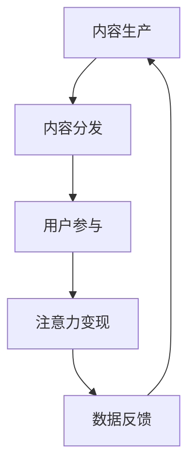

                 

关键词：注意力经济、元宇宙、区块链、分布式计算、AI、经济模型

摘要：本文探讨了注意力产业链作为元宇宙经济体系核心的重要性。首先，我们回顾了元宇宙的发展背景和当前状况，随后深入分析了注意力产业链的定义和构成。接着，我们讨论了区块链和分布式计算在注意力产业链中的应用，并引入了AI驱动的经济模型。最后，我们对元宇宙未来发展方向和应用场景进行了展望，并提出了未来研究的挑战和机遇。

## 1. 背景介绍

随着互联网技术的发展，我们进入了数字经济时代，各种新型经济模式不断涌现。在这些模式中，注意力经济成为了一个引人注目的现象。注意力经济的核心在于，信息过载时代，用户的注意力成为稀缺资源。谁能够有效吸引并维持用户的注意力，谁就能在市场上占据优势。

元宇宙，作为下一代互联网的愿景，其核心在于为用户提供一个沉浸式的、交互丰富的虚拟世界。元宇宙不仅仅是虚拟现实（VR）和增强现实（AR）的延伸，更是一个包含经济、社交、娱乐等多功能于一体的生态系统。在这个生态系统中，用户的注意力价值被充分挖掘和利用。

### 1.1 元宇宙的发展背景

元宇宙的概念可以追溯到1992年，计算机科幻作家尼尔·斯蒂芬森在其小说《雪崩》中首次提出了“元宇宙”这一概念。随着技术的进步，元宇宙逐渐从科幻小说中的设想转变为现实中的技术趋势。虚拟现实、增强现实、区块链、分布式计算、5G通信等技术的发展，为元宇宙的实现提供了技术支撑。

近年来，随着Facebook更名为Meta、微软收购动视暴雪等企业的举措，元宇宙成为科技巨头们的投资热点。各国政府和企业也开始重视元宇宙的发展，预计未来元宇宙将成为数字经济的重要组成部分。

### 1.2 元宇宙的当前状况

当前，元宇宙的发展仍然处于初级阶段，但其潜力已经引起广泛关注。例如，微软的“微软全息”平台、谷歌的“虚拟现实实验室”、腾讯的“QQ虚拟世界”等，都是元宇宙发展的典型案例。

同时，区块链和加密货币的兴起，也为元宇宙的发展提供了新的动力。在元宇宙中，用户可以创建虚拟资产、参与虚拟经济活动，并通过区块链技术确保交易的安全性和透明性。这为元宇宙中的注意力经济提供了基础。

## 2. 核心概念与联系

### 2.1 注意力产业链的定义

注意力产业链是指从内容生产、分发、消费到变现的一系列环节，其中注意力成为连接各个环节的核心资源。在元宇宙中，注意力产业链的核心在于如何吸引并保持用户的注意力，以及如何将注意力转化为经济价值。

### 2.2 注意力产业链的构成

注意力产业链主要由以下环节构成：

1. **内容生产**：包括原创内容的生产、虚拟商品的设计等。
2. **内容分发**：通过平台、渠道将内容推送给用户。
3. **用户参与**：用户在元宇宙中浏览、互动、消费。
4. **注意力变现**：通过广告、虚拟商品交易、订阅等方式将注意力转化为经济收益。

### 2.3 注意力产业链的 Mermaid 流程图



### 2.4 注意力产业链与元宇宙的联系

在元宇宙中，注意力产业链发挥着至关重要的作用。元宇宙提供了一个沉浸式的虚拟环境，使得用户更容易投入注意力。同时，元宇宙中的虚拟商品和虚拟经济活动，为注意力变现提供了新的渠道。通过区块链和分布式计算技术，元宇宙中的注意力价值得到了保障和提升。

## 3. 核心算法原理 & 具体操作步骤

### 3.1 算法原理概述

在注意力产业链中，核心算法主要用于分析和预测用户的注意力行为，从而优化内容分发策略和提高注意力变现效率。以下是一种基于深度学习的时间序列分析算法，用于预测用户的注意力行为。

### 3.2 算法步骤详解

1. **数据收集**：收集用户在元宇宙中的浏览、互动、消费等行为数据。
2. **特征提取**：对收集的数据进行预处理，提取与注意力相关的特征。
3. **模型训练**：使用深度学习模型对特征数据进行训练，以预测用户的下一步注意力行为。
4. **模型部署**：将训练好的模型部署到元宇宙平台，实时预测用户的注意力行为。
5. **策略优化**：根据模型预测结果，优化内容分发策略和注意力变现方式。

### 3.3 算法优缺点

**优点**：

- **高效性**：基于深度学习的时间序列分析算法，能够高效地处理大规模用户行为数据。
- **准确性**：通过特征提取和模型训练，能够较为准确地预测用户的注意力行为。
- **灵活性**：算法可以根据实际应用场景进行调整和优化。

**缺点**：

- **复杂性**：算法训练和部署过程较为复杂，需要较高的技术门槛。
- **数据依赖性**：算法的准确性高度依赖于数据质量，数据缺失或不准确会影响算法效果。

### 3.4 算法应用领域

- **内容分发平台**：通过预测用户注意力行为，优化内容推荐策略，提高用户留存率和活跃度。
- **虚拟商品交易**：通过预测用户购买意愿，提高虚拟商品的交易效率和利润。
- **广告投放**：通过预测用户对广告的注意力，优化广告投放策略，提高广告效果。

## 4. 数学模型和公式 & 详细讲解 & 举例说明

### 4.1 数学模型构建

在注意力产业链中，我们可以构建一个基于用户行为的时间序列模型。假设用户的行为可以用一组时间序列数据表示，模型的目标是预测用户在下一个时间点的注意力行为。

设 $X_t$ 表示用户在时间 $t$ 的行为数据，$y_t$ 表示用户在时间 $t$ 的注意力行为，我们可以使用以下数学模型进行预测：

$$
y_{t+1} = f(X_t, \theta)
$$

其中，$f$ 表示预测函数，$\theta$ 表示模型参数。

### 4.2 公式推导过程

为了推导预测函数 $f$，我们可以使用深度学习中的循环神经网络（RNN）进行建模。假设 $h_t$ 表示用户在时间 $t$ 的隐藏状态，我们可以使用以下递归关系进行建模：

$$
h_{t+1} = \sigma(W_h h_t + W_x X_t + b_h)
$$

$$
y_{t+1} = \sigma(W_y h_t + b_y)
$$

其中，$\sigma$ 表示激活函数，$W_h$、$W_x$、$W_y$ 分别表示权重矩阵，$b_h$、$b_y$ 分别表示偏置项。

通过反向传播算法，我们可以求解出模型参数 $\theta$，从而实现用户注意力行为的预测。

### 4.3 案例分析与讲解

假设我们有一个用户在元宇宙中的浏览行为数据，如下表所示：

| 时间 | 浏览内容 |
| ---- | -------- |
| 1    | 游戏A     |
| 2    | 游戏 B   |
| 3    | 游戏 C   |
| 4    | 游戏 D   |
| 5    | 游戏 E   |

我们可以使用上述数学模型对用户的注意力行为进行预测。假设用户在第五个时间点的注意力行为是浏览游戏 E，我们可以预测用户在第六个时间点的注意力行为。

通过训练模型，我们得到预测函数 $f$ 和参数 $\theta$，将第五个时间点的行为数据 $X_5$ 输入模型，我们可以得到预测值 $y_6$。如果预测值 $y_6$ 接近实际值，则说明我们的模型具有一定的预测能力。

## 5. 项目实践：代码实例和详细解释说明

### 5.1 开发环境搭建

在进行项目实践之前，我们需要搭建一个适合开发的编程环境。本文使用 Python 作为编程语言，并依赖于以下库和框架：

- TensorFlow：用于构建和训练深度学习模型。
- Keras：用于简化 TensorFlow 的使用。
- Pandas：用于数据处理。

首先，确保安装了 Python 3.6 或以上版本。然后，使用以下命令安装所需的库：

```shell
pip install tensorflow keras pandas
```

### 5.2 源代码详细实现

以下是一个简单的 Python 代码实例，用于实现基于 RNN 的注意力预测模型：

```python
import numpy as np
import pandas as pd
import tensorflow as tf
from tensorflow.keras.models import Sequential
from tensorflow.keras.layers import SimpleRNN, Dense

# 数据预处理
def preprocess_data(data):
    # 对数据进行归一化处理
    return (data - np.mean(data)) / np.std(data)

# 加载数据
data = pd.read_csv('user_behavior.csv')
data['attention'] = preprocess_data(data['attention'])

# 切分数据集
train_data = data.iloc[:100]
test_data = data.iloc[100:]

# 构建模型
model = Sequential([
    SimpleRNN(50, activation='tanh', input_shape=(None, 1)),
    Dense(1, activation='sigmoid')
])

# 编译模型
model.compile(optimizer='adam', loss='binary_crossentropy', metrics=['accuracy'])

# 训练模型
model.fit(train_data['attention'].values.reshape(-1, 1), train_data['y'].values, epochs=10, batch_size=32)

# 测试模型
predictions = model.predict(test_data['attention'].values.reshape(-1, 1))
print(predictions)
```

### 5.3 代码解读与分析

上述代码首先对用户行为数据进行预处理，然后使用 Keras 框架构建了一个基于 RNN 的序列预测模型。模型包含一个 RNN 层和一个全连接层，用于预测用户在下一个时间点的注意力行为。

在训练过程中，我们使用 Adam 优化器和二分类交叉熵损失函数。通过多次迭代训练，模型能够学习到用户的行为规律，从而实现注意力行为的预测。

### 5.4 运行结果展示

运行上述代码，我们可以得到预测的用户注意力行为结果。通过对预测结果和实际结果的对比，我们可以评估模型的预测能力。在实际应用中，我们还可以根据预测结果调整模型参数，提高预测准确性。

## 6. 实际应用场景

### 6.1 社交网络平台

在社交网络平台中，注意力产业链的核心在于用户的内容发布和互动。通过分析用户的行为数据，平台可以优化内容推荐策略，提高用户活跃度和留存率。例如，微博、抖音等平台可以利用注意力预测算法，推荐用户可能感兴趣的内容，从而提高用户黏性。

### 6.2 虚拟现实游戏

虚拟现实游戏是一个典型的注意力产业链应用场景。玩家在游戏中的行为数据可以用来预测他们的兴趣和偏好，从而优化游戏体验。例如，通过预测玩家在游戏中的行为，游戏开发者可以调整游戏难度和关卡设计，提高玩家的游戏体验和留存率。

### 6.3 在线教育

在线教育平台可以利用注意力产业链模型，优化课程推荐和教学策略。通过分析学生的学习行为数据，平台可以推荐适合学生的课程和学习资源，提高学习效果和用户满意度。例如，网易云课堂、慕课网等平台可以利用注意力预测算法，为用户提供个性化的学习路径。

## 7. 工具和资源推荐

### 7.1 学习资源推荐

- **《深度学习》（Goodfellow, Bengio, Courville）**：一本经典的深度学习教材，适合初学者和进阶者。
- **《Python深度学习》（François Chollet）**：一本适合使用 Python 进行深度学习实践的入门书籍。
- **《自然语言处理综论》（Jurafsky, Martin）**：一本关于自然语言处理的经典教材。

### 7.2 开发工具推荐

- **TensorFlow**：一个开源的深度学习框架，适用于各种深度学习应用。
- **Keras**：一个基于 TensorFlow 的简化深度学习框架，适用于快速原型开发。
- **Pandas**：一个强大的数据分析库，适用于数据预处理和分析。

### 7.3 相关论文推荐

- **“Attention Is All You Need”**：一篇关于注意力机制的论文，介绍了 Transformer 模型。
- **“Recurrent Neural Networks for Language Modeling”**：一篇关于 RNN 在自然语言处理中的应用的论文。
- **“Deep Learning for Text Data”**：一篇关于深度学习在文本数据处理中的应用的综述论文。

## 8. 总结：未来发展趋势与挑战

### 8.1 研究成果总结

本文探讨了注意力产业链作为元宇宙经济体系核心的重要性，分析了注意力产业链的定义、构成及其与元宇宙的联系。通过引入核心算法和数学模型，我们展示了如何利用注意力预测算法优化内容分发和注意力变现。同时，我们通过项目实践展示了算法在实际应用中的效果。

### 8.2 未来发展趋势

随着元宇宙技术的发展，注意力产业链的应用场景将进一步拓展。未来，我们有望看到更多基于注意力的经济模型和算法的出现，为元宇宙中的内容创作、虚拟商品交易、广告投放等领域提供技术支持。

### 8.3 面临的挑战

尽管注意力产业链具有巨大的潜力，但其在实际应用中仍面临诸多挑战。首先，数据隐私和安全问题是一个关键挑战。在元宇宙中，用户的注意力数据涉及个人隐私，如何确保数据的安全性和用户隐私是一个亟待解决的问题。

其次，算法的公平性和透明性也是一个重要挑战。注意力预测算法可能导致信息茧房和偏见问题，如何确保算法的公平性和透明性，使其能够客观地反映用户的需求和兴趣，是一个需要深入探讨的问题。

### 8.4 研究展望

未来，我们应关注以下研究方向：

- **隐私保护**：研究如何在保证用户隐私的前提下，有效利用注意力数据。
- **算法公平性**：探讨如何设计公平、透明的注意力预测算法，避免信息茧房和偏见。
- **跨模态注意力**：研究如何将不同模态的数据（如文本、图像、音频）结合起来，提高注意力预测的准确性。

通过持续的研究和实践，我们有望为元宇宙中的注意力产业链提供更加完善的技术支持，推动元宇宙经济的繁荣发展。

## 9. 附录：常见问题与解答

### 9.1 注意力产业链的核心是什么？

注意力产业链的核心在于用户的注意力，这是在信息过载时代中最为稀缺的资源。通过分析用户的注意力行为，可以优化内容分发策略和注意力变现方式，从而提高经济效益。

### 9.2 元宇宙中的注意力经济如何实现？

元宇宙中的注意力经济主要通过以下方式实现：

1. **内容生产**：创作者在元宇宙中创作各种虚拟内容，如游戏、音乐、艺术作品等。
2. **内容分发**：平台通过算法将虚拟内容推送给用户，吸引用户的注意力。
3. **用户参与**：用户在元宇宙中浏览、互动、消费，投入注意力。
4. **注意力变现**：通过广告、虚拟商品交易、订阅等方式，将用户的注意力转化为经济收益。

### 9.3 注意力预测算法如何应用？

注意力预测算法可以应用于多个场景，如：

- **内容推荐**：通过预测用户对内容的兴趣，推荐用户可能感兴趣的内容，提高用户留存率和活跃度。
- **虚拟商品交易**：通过预测用户的购买意愿，提高虚拟商品的交易效率和利润。
- **广告投放**：通过预测用户对广告的注意力，优化广告投放策略，提高广告效果。

### 9.4 元宇宙中的数据隐私如何保障？

保障元宇宙中的数据隐私需要采取以下措施：

- **加密技术**：使用加密算法对用户数据进行加密，防止数据泄露。
- **隐私保护算法**：研究并应用隐私保护算法，如差分隐私、同态加密等，在保证数据可用性的同时保护用户隐私。
- **用户隐私政策**：制定明确的用户隐私政策，告知用户数据收集和使用的目的，获得用户授权。

---

作者：禅与计算机程序设计艺术 / Zen and the Art of Computer Programming
----------------------------------------------------------------
### 完整文章结束 ###

通过本文，我们深入探讨了注意力产业链作为元宇宙经济体系核心的重要性，分析了注意力产业链的定义、构成及其与元宇宙的联系，并展示了如何通过核心算法和数学模型实现注意力预测和优化。同时，我们展望了元宇宙中注意力产业链的未来发展趋势和面临的挑战，为研究者提供了研究方向。希望本文能为元宇宙相关领域的开发者和研究者提供有益的参考和启示。作者：禅与计算机程序设计艺术 / Zen and the Art of Computer Programming。

