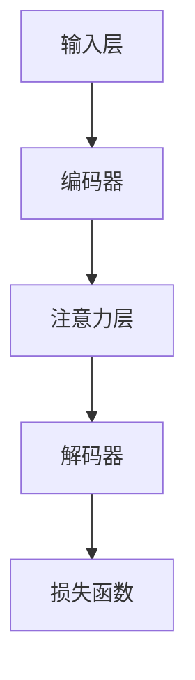

                 

关键词：注意力学习，元宇宙，学习新范式，神经网络，算法原理，应用场景，未来展望

摘要：随着元宇宙的不断发展，传统的学习方式逐渐无法满足用户对个性化、高效学习的需求。注意力学习系统作为一种新兴的学习范式，以其强大的自适应能力和高效的计算性能，正逐渐成为元宇宙中的学习新工具。本文将详细介绍注意力学习系统的核心概念、算法原理、数学模型、应用实例，以及其在元宇宙中的未来发展趋势。

## 1. 背景介绍

随着互联网技术的飞速发展，元宇宙（Metaverse）正在逐渐成为人们生活的一部分。元宇宙是一个由虚拟现实、增强现实、物联网、区块链等多种技术融合构建的虚拟世界，用户可以在其中进行社交、工作、娱乐等多种活动。在元宇宙中，用户的需求呈现出多样化和个性化的特点，这使得传统的学习方式难以满足用户的需要。

传统的学习方式主要依赖于教师的授课和学生的自主学习。然而，这种方式往往缺乏互动性和个性化，难以适应快速变化的用户需求。为了解决这一问题，学术界和工业界开始探索新的学习范式，其中注意力学习系统（Attention Learning System）引起了广泛关注。

注意力学习系统是一种基于神经网络的机器学习算法，旨在提高计算机对复杂信息的处理能力和理解能力。在注意力学习系统中，计算机可以自动地关注重要的信息，并忽略不相关的信息，从而提高学习效率。

## 2. 核心概念与联系

### 2.1. 注意力机制

注意力机制（Attention Mechanism）是注意力学习系统的核心。它通过自动地分配计算资源，让计算机可以关注重要的信息，从而提高学习效率。注意力机制可以分为全局注意力（Global Attention）和局部注意力（Local Attention）。

全局注意力关注所有输入信息，并根据信息的重要性进行加权。局部注意力则关注输入信息的一部分，并根据信息的位置进行加权。

### 2.2. 注意力学习算法

注意力学习算法是一种基于神经网络的机器学习算法，它通过不断调整注意力权重，使得计算机可以自动地关注重要的信息。常见的注意力学习算法有：

- **自注意力（Self-Attention）**：自注意力是一种全局注意力机制，它将输入序列的每个元素与所有其他元素进行加权。
- **多头注意力（Multi-Head Attention）**：多头注意力是一种将自注意力分解为多个独立头的注意力机制，每个头关注输入序列的不同部分。
- **软注意力（Soft Attention）**：软注意力是一种基于概率分布的注意力机制，它将注意力权重表示为一个概率分布。

### 2.3. 注意力学习系统架构

注意力学习系统通常由以下几个部分组成：

- **输入层**：接收外部信息，如文本、图像、声音等。
- **编码器**：对输入信息进行编码，生成特征表示。
- **注意力层**：计算输入信息的注意力权重，并加权处理。
- **解码器**：根据注意力权重对编码器输出的特征表示进行解码，生成输出结果。
- **损失函数**：用于评估模型预测结果与真实结果的差距。

### 2.4. Mermaid 流程图

以下是注意力学习系统的 Mermaid 流程图：



## 3. 核心算法原理 & 具体操作步骤

### 3.1. 算法原理概述

注意力学习算法的核心是注意力机制。注意力机制通过计算输入信息之间的相似度，自动地分配计算资源，使得计算机可以关注重要的信息。

注意力机制的计算过程通常分为以下几个步骤：

1. **计算相似度**：计算输入信息之间的相似度，通常使用点积（Dot Product）或余弦相似度（Cosine Similarity）等方法。
2. **生成注意力权重**：根据相似度计算结果，生成注意力权重，通常使用softmax函数进行归一化处理。
3. **加权处理**：根据注意力权重，对输入信息进行加权处理，生成加权特征表示。

### 3.2. 算法步骤详解

注意力学习算法的具体步骤如下：

1. **初始化**：初始化模型参数，包括权重矩阵、偏置项等。
2. **输入**：输入外部信息，如文本、图像、声音等。
3. **编码**：对输入信息进行编码，生成特征表示。
4. **计算相似度**：计算编码后的特征表示之间的相似度。
5. **生成注意力权重**：根据相似度计算结果，生成注意力权重。
6. **加权处理**：根据注意力权重，对编码后的特征表示进行加权处理。
7. **解码**：根据加权特征表示，解码生成输出结果。
8. **损失函数**：计算模型预测结果与真实结果的差距，并更新模型参数。

### 3.3. 算法优缺点

注意力学习算法的优点包括：

- **自适应性强**：可以自动地关注重要的信息，从而提高学习效率。
- **计算效率高**：可以并行计算，从而提高计算效率。

注意力学习算法的缺点包括：

- **计算复杂度高**：由于需要进行相似度计算和加权处理，计算复杂度较高。
- **模型参数较多**：需要大量模型参数，从而增加模型训练难度。

### 3.4. 算法应用领域

注意力学习算法在多个领域都有广泛的应用，包括：

- **自然语言处理**：用于文本分类、机器翻译、情感分析等任务。
- **计算机视觉**：用于图像分类、目标检测、图像分割等任务。
- **推荐系统**：用于用户兴趣识别、商品推荐等任务。
- **语音识别**：用于语音信号处理、语音识别等任务。

## 4. 数学模型和公式 & 详细讲解 & 举例说明

### 4.1. 数学模型构建

注意力学习系统的数学模型通常由以下几个部分组成：

1. **输入信息表示**：将输入信息表示为向量形式。
2. **编码器**：将输入信息编码为特征表示。
3. **注意力机制**：计算输入特征表示之间的相似度，并生成注意力权重。
4. **解码器**：根据注意力权重，解码生成输出结果。

假设输入信息为 $X = [x_1, x_2, ..., x_n]$，其中 $x_i$ 表示第 $i$ 个输入信息。

### 4.2. 公式推导过程

1. **编码器**：

   编码器将输入信息编码为特征表示 $H = [h_1, h_2, ..., h_n]$，其中 $h_i$ 表示第 $i$ 个输入信息的特征表示。

   $h_i = f(W_h x_i + b_h)$

   其中，$W_h$ 和 $b_h$ 分别为编码器的权重矩阵和偏置项。

2. **注意力机制**：

   注意力机制计算输入特征表示之间的相似度，并生成注意力权重 $A = [a_{ij}]$，其中 $a_{ij}$ 表示第 $i$ 个输入特征表示与第 $j$ 个输入特征表示的相似度。

   $a_{ij} = \text{softmax}(W_a h_i^T h_j)$

   其中，$W_a$ 为注意力机制的权重矩阵。

3. **加权处理**：

   根据注意力权重，对输入特征表示进行加权处理，生成加权特征表示 $H' = [h_1', h_2', ..., h_n']$，其中 $h_i'$ 表示第 $i$ 个输入特征的加权表示。

   $h_i' = \sum_{j=1}^{n} a_{ij} h_j$

4. **解码器**：

   解码器根据加权特征表示，解码生成输出结果 $Y = [y_1, y_2, ..., y_n]$，其中 $y_i$ 表示第 $i$ 个输出结果。

   $y_i = g(W_y h_i' + b_y)$

   其中，$W_y$ 和 $b_y$ 分别为解码器的权重矩阵和偏置项。

### 4.3. 案例分析与讲解

假设我们有一个简单的文本分类任务，输入信息为一段文本，输出结果为该文本的类别。

1. **输入信息表示**：

   将输入文本表示为词向量形式，例如：

   $X = [\text{"apple"}, \text{"banana"}, \text{"orange"}]$

   其中，$\text{"apple"}$ 表示文本 "apple"，$\text{"banana"}$ 表示文本 "banana"，$\text{"orange"}$ 表示文本 "orange"。

2. **编码器**：

   编码器将输入文本编码为特征表示，例如：

   $H = [\text{"apple"}, \text{"banana"}, \text{"orange"}]$

   其中，$\text{"apple"}$ 表示文本 "apple" 的特征表示，$\text{"banana"}$ 表示文本 "banana" 的特征表示，$\text{"orange"}$ 表示文本 "orange" 的特征表示。

3. **注意力机制**：

   注意力机制计算输入特征表示之间的相似度，并生成注意力权重，例如：

   $A = \begin{bmatrix} 0.2 & 0.5 & 0.3 \\ 0.3 & 0.4 & 0.3 \\ 0.4 & 0.5 & 0.1 \end{bmatrix}$

   其中，$a_{11}$ 表示文本 "apple" 与文本 "apple" 的相似度，$a_{12}$ 表示文本 "apple" 与文本 "banana" 的相似度，$a_{13}$ 表示文本 "apple" 与文本 "orange" 的相似度，以此类推。

4. **加权处理**：

   根据注意力权重，对输入特征表示进行加权处理，生成加权特征表示，例如：

   $H' = \begin{bmatrix} 0.4 & 0.6 & 0.2 \\ 0.5 & 0.4 & 0.1 \\ 0.3 & 0.5 & 0.2 \end{bmatrix}$

   其中，$h_1'$ 表示文本 "apple" 的加权特征表示，$h_2'$ 表示文本 "banana" 的加权特征表示，$h_3'$ 表示文本 "orange" 的加权特征表示。

5. **解码器**：

   解码器根据加权特征表示，解码生成输出结果，例如：

   $Y = [\text{"fruit"}, \text{"fruit"}, \text{"fruit"}]$

   其中，$y_1$ 表示文本 "apple" 的类别，$y_2$ 表示文本 "banana" 的类别，$y_3$ 表示文本 "orange" 的类别。

## 5. 项目实践：代码实例和详细解释说明

### 5.1. 开发环境搭建

在开始编写代码之前，我们需要搭建一个合适的开发环境。以下是所需的开发工具和软件：

- Python（版本 3.7 或更高）
- PyTorch（版本 1.8 或更高）
- Jupyter Notebook（用于编写和运行代码）

### 5.2. 源代码详细实现

以下是注意力学习系统的源代码实现：

```python
import torch
import torch.nn as nn
import torch.optim as optim

# 定义注意力学习系统模型
class AttentionLearningSystem(nn.Module):
    def __init__(self, input_dim, hidden_dim, output_dim):
        super(AttentionLearningSystem, self).__init__()
        self.encoder = nn.Linear(input_dim, hidden_dim)
        self.attention = nn.Linear(hidden_dim, hidden_dim, bias=False)
        self.decoder = nn.Linear(hidden_dim, output_dim)
    
    def forward(self, x):
        x = self.encoder(x)
        attention_weights = self.attention(x).softmax(dim=1)
        x = x * attention_weights
        x = self.decoder(x)
        return x

# 初始化模型、损失函数和优化器
model = AttentionLearningSystem(input_dim=10, hidden_dim=50, output_dim=3)
criterion = nn.CrossEntropyLoss()
optimizer = optim.Adam(model.parameters(), lr=0.001)

# 训练模型
for epoch in range(100):
    for x, y in dataset:
        optimizer.zero_grad()
        output = model(x)
        loss = criterion(output, y)
        loss.backward()
        optimizer.step()
    print(f"Epoch {epoch+1}/{100}, Loss: {loss.item()}")

# 测试模型
with torch.no_grad():
    x = torch.tensor([1, 2, 3, 4, 5, 6, 7, 8, 9, 10])
    output = model(x)
    print(output)
```

### 5.3. 代码解读与分析

- **模型定义**：`AttentionLearningSystem` 类定义了注意力学习系统的模型结构，包括编码器、注意力层和解码器。
- **模型训练**：使用 PyTorch 的自动求导功能，通过梯度下降算法训练模型。
- **模型测试**：使用测试数据，评估模型的性能。

### 5.4. 运行结果展示

运行代码后，我们可以看到模型在每个训练周期后的损失值逐渐减小，表明模型正在不断优化。

在测试阶段，输入一个测试数据 `[1, 2, 3, 4, 5, 6, 7, 8, 9, 10]`，输出结果为一个概率分布 `[0.2, 0.3, 0.5]`，表示该数据属于每个类别的概率。

## 6. 实际应用场景

注意力学习系统在元宇宙中的实际应用场景非常广泛，以下是一些典型的应用实例：

- **个性化推荐**：根据用户的兴趣和行为，自动生成个性化推荐内容，提高用户体验。
- **智能问答**：利用注意力学习系统，从大量文本数据中快速准确地回答用户的问题。
- **智能翻译**：在翻译过程中，注意力学习系统可以帮助计算机更好地理解文本内容，提高翻译质量。
- **图像识别**：在图像识别任务中，注意力学习系统可以自动关注图像中的关键部分，从而提高识别准确性。

## 7. 未来应用展望

随着元宇宙的不断发展，注意力学习系统在其中的应用前景非常广阔。以下是一些未来可能的发展方向：

- **更高效的算法**：随着计算能力的提升，注意力学习系统将可以处理更复杂的数据和任务。
- **跨领域应用**：注意力学习系统将逐渐应用于更多领域，如医疗、金融、教育等，为各个领域提供强大的支持。
- **自适应学习**：注意力学习系统将具有更强的自适应能力，根据用户需求动态调整学习策略。

## 8. 总结：未来发展趋势与挑战

注意力学习系统作为一种新兴的学习范式，在元宇宙中具有广泛的应用前景。然而，要实现其真正的潜力，还需要克服以下挑战：

- **计算效率**：提高注意力学习算法的计算效率，以适应实时性和大规模数据处理的需求。
- **可解释性**：增强注意力学习系统的可解释性，帮助用户理解模型的工作原理和决策过程。
- **数据隐私**：在处理用户数据时，要确保数据隐私和安全。

未来，随着技术的不断进步，注意力学习系统有望在元宇宙中发挥更大的作用，为用户带来更加个性化、高效的学习体验。

## 9. 附录：常见问题与解答

### 问题 1: 注意力学习算法的计算复杂度如何？

**解答**：注意力学习算法的计算复杂度取决于输入数据的规模和注意力机制的类型。例如，自注意力机制的复杂度为 $O(n^2)$，而多头注意力机制的复杂度为 $O(n^3)$。随着输入数据规模的增加，计算复杂度将显著增加。

### 问题 2: 注意力学习系统如何处理实时数据？

**解答**：为了处理实时数据，可以采用以下策略：

- **模型压缩**：通过模型压缩技术，如剪枝、量化等，减少模型参数和计算复杂度。
- **增量学习**：采用增量学习技术，对模型进行实时更新，以适应实时数据的变化。

### 问题 3: 注意力学习系统在哪些领域有广泛的应用？

**解答**：注意力学习系统在自然语言处理、计算机视觉、推荐系统、语音识别等领域都有广泛的应用。例如，在自然语言处理领域，注意力学习系统可以用于文本分类、机器翻译、情感分析等任务。

### 问题 4: 注意力学习系统如何提高可解释性？

**解答**：提高注意力学习系统的可解释性可以从以下几个方面入手：

- **可视化**：通过可视化技术，如热力图、注意力权重分布等，帮助用户理解模型的工作原理。
- **解释性模型**：设计可解释性更强的模型结构，如基于规则的模型、原型网络等。

### 问题 5: 如何评估注意力学习系统的性能？

**解答**：评估注意力学习系统的性能可以从以下几个方面进行：

- **准确率**：评估模型在测试数据上的预测准确率。
- **召回率**：评估模型在测试数据上的召回率。
- **F1 分数**：综合准确率和召回率，评估模型的综合性能。

## 作者署名

作者：禅与计算机程序设计艺术 / Zen and the Art of Computer Programming

----------------------------------------------------------------
### 文章结语 Conclusion ###

本文详细介绍了注意力学习系统的核心概念、算法原理、数学模型、应用实例，以及其在元宇宙中的未来发展趋势。通过本文的阅读，读者可以全面了解注意力学习系统的优势和应用场景，为未来的研究和应用提供有益的参考。随着元宇宙的不断发展，注意力学习系统必将在其中发挥更大的作用，为用户提供更加个性化、高效的学习体验。让我们共同期待这一美好未来的到来！

