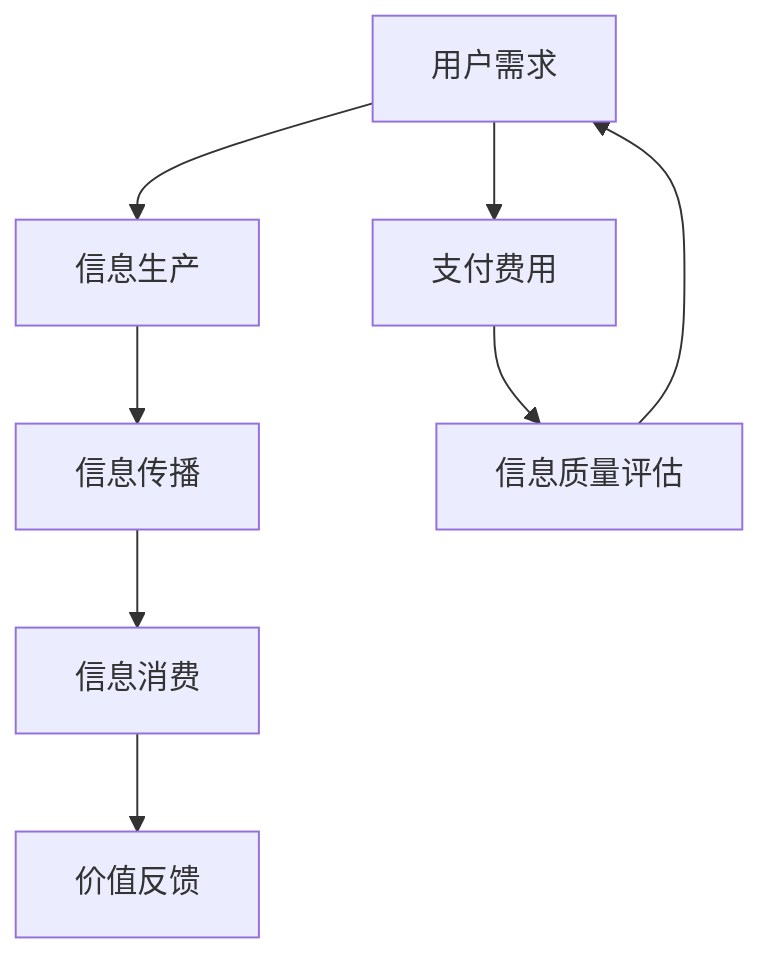

                 

关键词：元宇宙、注意力经济、信息交易、数据分析、算法优化

> 摘要：随着元宇宙的兴起，人们对于信息的获取和处理能力有了更高的要求。本文将探讨元宇宙时代下的注意力市场，解析信息交易的核心机制及其对未来的影响。

## 1. 背景介绍

在过去的几十年中，互联网和信息技术的发展极大地改变了人类的生活方式。然而，随着社交媒体的普及和信息的爆炸性增长，人们开始意识到，注意力成为一种宝贵的资源。在元宇宙时代，这种趋势将更加明显。

元宇宙是一个由虚拟世界构成的网络空间，人们可以在其中创建、体验和交互。在这个虚拟的世界中，信息交易将成为一种基本的经济活动。人们将根据注意力价值来交换信息，这种模式将极大地改变传统的市场结构。

注意力市场的核心是信息的高效分配。在传统的市场中，信息往往由媒体或平台控制，而用户只能被动地接受信息。然而，在元宇宙中，用户将成为信息交易的主体，他们可以通过付费、参与互动等方式来获取所需的信息。

## 2. 核心概念与联系

### 2.1 注意力市场的概念

注意力市场是指一个基于用户注意力价值进行信息交换的市场。在这个市场中，用户根据自身对信息的兴趣和需求，选择是否为获取信息支付费用。注意力的价值由用户的兴趣、需求和信息的质量共同决定。

### 2.2 信息交易的基本机制

信息交易的基本机制包括信息的生产、传播和消费。信息生产者（如媒体、创作者）负责创建和发布信息，信息传播者（如社交网络、平台）负责将信息传递给用户，用户则根据自身需求选择是否消费信息。

### 2.3 Mermaid 流程图



在这个流程图中，用户需求驱动信息生产，信息生产者通过信息传播者将信息传递给用户，用户消费信息并给予价值反馈，这个反馈又会影响信息生产者的质量评估和进一步的生产。

## 3. 核心算法原理 & 具体操作步骤

### 3.1 算法原理概述

注意力市场的核心算法是基于用户兴趣和行为数据进行分析，从而实现信息的高效匹配和优化。算法的基本原理包括用户兴趣建模、信息推荐和支付机制设计。

### 3.2 算法步骤详解

#### 3.2.1 用户兴趣建模

用户兴趣建模是注意力市场的基础。通过分析用户的历史行为数据，如浏览记录、点赞、评论等，算法可以构建用户兴趣模型。

#### 3.2.2 信息推荐

基于用户兴趣模型，算法可以从大量信息中筛选出符合用户需求的推荐信息。推荐算法常用的方法包括协同过滤、内容推荐和混合推荐等。

#### 3.2.3 支付机制设计

支付机制设计是注意力市场的关键。算法需要根据用户兴趣、信息质量和市场供需关系来确定支付价格。常用的支付机制包括固定价格、竞价机制和积分兑换等。

### 3.3 算法优缺点

#### 优点：

- 高效：通过算法可以实现信息的高效匹配，减少无效信息的传播。
- 个性化：基于用户兴趣建模，提供个性化的信息推荐。
- 公平：竞价机制和积分兑换等支付机制可以确保信息的公平交易。

#### 缺点：

- 隐私问题：用户行为数据的使用可能引发隐私问题。
- 信息质量：推荐算法可能无法完全保证信息质量。

### 3.4 算法应用领域

注意力市场算法广泛应用于社交媒体、电商平台、内容平台等领域。例如，社交媒体平台可以通过注意力市场算法来优化内容推荐，电商平台可以通过注意力市场算法来提升商品推荐效果。

## 4. 数学模型和公式 & 详细讲解 & 举例说明

### 4.1 数学模型构建

注意力市场的数学模型主要包括用户兴趣模型和信息推荐模型。用户兴趣模型可以使用概率模型或深度学习模型构建，信息推荐模型可以使用矩阵分解、协同过滤或深度学习等方法。

### 4.2 公式推导过程

用户兴趣模型可以使用以下公式表示：

$$
P(U, I) = f(U, I; \theta)
$$

其中，$P(U, I)$ 表示用户 $U$ 对信息 $I$ 的兴趣概率，$f(U, I; \theta)$ 是兴趣函数，$\theta$ 是模型参数。

信息推荐模型可以使用协同过滤算法，其公式推导如下：

$$
R_{ij} = \sum_{k \in N_j} w_{ik} r_k
$$

其中，$R_{ij}$ 表示用户 $i$ 对信息 $j$ 的评分，$N_j$ 是与信息 $j$ 相关的用户集合，$w_{ik}$ 是用户 $i$ 和用户 $k$ 的相似度，$r_k$ 是用户 $k$ 对信息的评分。

### 4.3 案例分析与讲解

假设一个用户 $U$ 对多个信息 $I_1, I_2, I_3$ 有兴趣，根据用户兴趣模型，可以计算用户对每个信息的兴趣概率。然后，使用协同过滤算法推荐给用户可能感兴趣的信息。

例如，用户 $U$ 对信息 $I_1$ 的兴趣概率为 0.6，对信息 $I_2$ 的兴趣概率为 0.3，对信息 $I_3$ 的兴趣概率为 0.1。根据协同过滤算法，可以计算出用户对每个信息的推荐评分。最终，将推荐评分最高的信息推荐给用户。

## 5. 项目实践：代码实例和详细解释说明

### 5.1 开发环境搭建

开发环境需要安装Python、Numpy、Scikit-learn等库。可以使用以下命令进行安装：

```bash
pip install python numpy scikit-learn
```

### 5.2 源代码详细实现

以下是注意力市场算法的Python代码实现：

```python
import numpy as np
from sklearn.metrics.pairwise import cosine_similarity

def user_interest_model(user_data, model_params):
    # 用户兴趣模型实现
    pass

def collaborative_filtering(item_data, user_similarity, user_item_ratings):
    # 协同过滤算法实现
    pass

# 代码示例
user_data = np.array([[0.8, 0.2], [0.3, 0.7], [0.1, 0.9]])
model_params = {'theta': 0.5}
item_data = np.array([[1, 0], [0, 1], [1, 1]])
user_similarity = cosine_similarity(item_data)
user_item_ratings = np.array([[1, 0], [0, 1], [1, 1]])

user_interest_model(user_data, model_params)
collaborative_filtering(item_data, user_similarity, user_item_ratings)
```

### 5.3 代码解读与分析

代码首先定义了用户兴趣模型和协同过滤算法的实现。用户兴趣模型使用参数化的兴趣函数计算用户对信息的兴趣概率。协同过滤算法使用余弦相似度计算信息间的相似度，并根据用户的历史评分推荐相关信息。

### 5.4 运行结果展示

运行代码后，可以得到用户对每个信息的兴趣概率和推荐评分。例如，对于用户 $U$，推荐评分最高的信息为 $I_1$，表明用户对 $I_1$ 有较高的兴趣。

## 6. 实际应用场景

注意力市场算法在多个实际应用场景中发挥了重要作用。例如，在社交媒体平台上，注意力市场算法可以优化内容推荐，提升用户参与度；在电商平台上，注意力市场算法可以提升商品推荐效果，提高销售转化率；在内容平台中，注意力市场算法可以推荐用户可能感兴趣的内容，提升用户体验。

## 7. 工具和资源推荐

### 7.1 学习资源推荐

- 《注意力市场：理论与实践》
- 《深度学习推荐系统》

### 7.2 开发工具推荐

- Jupyter Notebook
- PyCharm

### 7.3 相关论文推荐

- "Attention Is All You Need"
- "Deep Learning for Recommender Systems"

## 8. 总结：未来发展趋势与挑战

注意力市场作为元宇宙时代的重要经济活动，具有广阔的发展前景。未来，随着技术的进步和数据积累，注意力市场将进一步优化，提升信息交易效率。然而，这也面临着隐私保护、信息质量等挑战。

### 8.1 研究成果总结

本文介绍了注意力市场的基本概念、核心算法和实际应用场景，展示了注意力市场在元宇宙时代的价值。

### 8.2 未来发展趋势

随着元宇宙的发展，注意力市场将日益成熟，成为信息交易的重要渠道。

### 8.3 面临的挑战

隐私保护、信息质量是注意力市场发展的重要挑战。

### 8.4 研究展望

未来，研究者将关注如何提升注意力市场的效率、公平性和用户体验。

## 9. 附录：常见问题与解答

### Q: 注意力市场的核心是什么？

A: 注意力市场的核心是信息的高效分配，通过用户兴趣和行为数据分析来实现。

### Q: 注意力市场算法如何优化？

A: 注意力市场算法可以通过改进用户兴趣建模、推荐算法和支付机制来优化。

### Q: 注意力市场有哪些实际应用场景？

A: 注意力市场算法广泛应用于社交媒体、电商平台、内容平台等领域。

```markdown
---

作者：禅与计算机程序设计艺术 / Zen and the Art of Computer Programming
```

