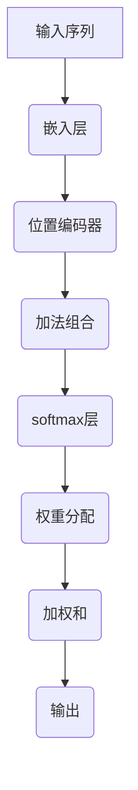

                 

关键词：注意力机制，softmax，位置编码器，神经翻译，序列模型

> 摘要：本文深入探讨了注意力机制在自然语言处理中的关键作用，特别是在softmax和位置编码器中的应用。通过对这些核心概念的详细解释和实际案例的剖析，读者将更好地理解如何利用注意力机制提升序列模型的性能。

## 1. 背景介绍

在过去的几十年中，序列模型在自然语言处理（NLP）领域取得了显著的进展。然而，这些模型往往面临着一个共同的问题：如何有效地捕捉序列中的长距离依赖关系。传统的方法，如递归神经网络（RNN）和长短期记忆网络（LSTM），虽然在某些任务上表现良好，但它们在处理长序列时存在梯度消失或梯度爆炸的问题，导致难以学习长距离依赖。

为了解决这些问题，研究者们提出了注意力机制（Attention Mechanism）。注意力机制是一种让模型能够聚焦于序列中特定部分的机制，从而提高模型对长距离依赖关系的捕捉能力。本文将重点关注注意力机制中的两个重要组成部分：softmax和位置编码器。

## 2. 核心概念与联系

### 2.1 注意力机制的概念

注意力机制是一种基于权重分配的机制，它允许模型在处理序列时，为序列中的每个元素分配一个权重。这些权重表示模型对序列中每个元素的重要程度。通过加权求和，模型可以重点关注那些对当前任务更重要的部分，从而提高模型的性能。

### 2.2 softmax函数

在注意力机制中，softmax函数用于计算序列中每个元素的概率分布。具体来说，给定一个向量 $q$，softmax函数将其映射为一个概率分布：

$$
\text{softmax}(q) = \frac{e^{q_i}}{\sum_{j} e^{q_j}}
$$

其中，$q_i$ 是向量 $q$ 的第 $i$ 个元素。softmax函数确保了概率分布的和为1，从而可以用来表示每个元素的重要性。

### 2.3 位置编码器

位置编码器是注意力机制中的另一个关键组成部分，它的作用是为序列中的每个元素赋予位置信息。由于注意力机制本质上是一种全局机制，它无法直接感知序列中的顺序关系。位置编码器通过将位置信息编码到每个元素中，帮助模型学习序列的顺序关系。

常见的位置编码方法包括绝对位置编码和相对位置编码。绝对位置编码直接将位置信息作为向量的一部分，而相对位置编码则通过比较不同位置之间的差异来实现。

### 2.4 Mermaid 流程图



## 3. 核心算法原理 & 具体操作步骤

### 3.1 算法原理概述

注意力机制的核心思想是，通过计算序列中每个元素的重要性，并将这些重要性权重应用于后续的模型层，从而提高模型对长距离依赖关系的捕捉能力。具体来说，注意力机制可以分为以下几个步骤：

1. **嵌入层**：将输入序列转换为嵌入向量。
2. **位置编码器**：为嵌入向量添加位置信息。
3. **加法组合**：将位置编码后的嵌入向量与查询向量相加。
4. **softmax层**：使用softmax函数计算每个元素的概率分布。
5. **权重分配**：根据概率分布为每个元素分配权重。
6. **加权和**：将权重应用于输入序列的每个元素，得到加权和。
7. **输出**：通过加权和得到最终的输出。

### 3.2 算法步骤详解

#### 步骤 1：嵌入层

输入序列 $X = [x_1, x_2, ..., x_n]$，首先通过嵌入层将其转换为嵌入向量 $E = [e_1, e_2, ..., e_n]$。嵌入向量 $e_i$ 可以通过预训练的词向量或词嵌入层得到。

#### 步骤 2：位置编码器

位置编码器将位置信息编码到每个嵌入向量中。常见的位置编码方法有绝对位置编码和相对位置编码。以绝对位置编码为例，假设位置 $p$ 的编码为 $P_p$，则每个嵌入向量 $e_i$ 可表示为：

$$
e_i = E_i + P_{i}
$$

其中，$E_i$ 是嵌入向量，$P_i$ 是位置编码。

#### 步骤 3：加法组合

将位置编码后的嵌入向量与查询向量 $Q$ 相加，得到加法组合后的向量 $C_i$：

$$
C_i = e_i + Q
$$

#### 步骤 4：softmax层

使用softmax函数计算每个元素的概率分布 $S_i$：

$$
S_i = \text{softmax}(C_i)
$$

#### 步骤 5：权重分配

根据概率分布 $S_i$ 为每个元素 $x_i$ 分配权重 $w_i$：

$$
w_i = S_i
$$

#### 步骤 6：加权和

将权重 $w_i$ 应用于输入序列的每个元素，得到加权和 $O_i$：

$$
O_i = w_i * x_i
$$

#### 步骤 7：输出

通过加权和 $O_i$ 得到最终的输出：

$$
O = [O_1, O_2, ..., O_n]
$$

### 3.3 算法优缺点

#### 优点

1. **捕捉长距离依赖**：注意力机制能够有效捕捉序列中的长距离依赖关系。
2. **灵活性**：通过权重分配，注意力机制能够关注序列中的不同部分，提高模型的灵活性。
3. **可解释性**：注意力机制的可解释性使其在任务调试和优化中具有优势。

#### 缺点

1. **计算复杂度**：注意力机制的权重计算过程涉及矩阵乘法和softmax计算，导致计算复杂度较高。
2. **梯度消失/爆炸**：在深度网络中，注意力机制的梯度可能仍然面临消失或爆炸的问题。

### 3.4 算法应用领域

注意力机制在自然语言处理领域有广泛的应用，如：

1. **机器翻译**：通过捕捉源语言和目标语言之间的长距离依赖，注意力机制显著提高了神经翻译的准确性。
2. **文本分类**：注意力机制能够帮助模型关注文本中的关键信息，提高文本分类的准确性。
3. **问答系统**：注意力机制有助于模型从大量文本中提取与问题相关的重要信息，提高问答系统的性能。

## 4. 数学模型和公式 & 详细讲解 & 举例说明

### 4.1 数学模型构建

注意力机制的数学模型主要包括以下部分：

1. **嵌入层**：将输入序列 $X$ 转换为嵌入向量 $E$。
2. **位置编码器**：为嵌入向量添加位置信息 $P$。
3. **加法组合**：将位置编码后的嵌入向量与查询向量 $Q$ 相加，得到加法组合后的向量 $C$。
4. **softmax层**：使用softmax函数计算每个元素的概率分布 $S$。
5. **权重分配**：根据概率分布 $S$ 为每个元素分配权重 $w$。
6. **加权和**：将权重 $w$ 应用于输入序列的每个元素，得到加权和 $O$。

### 4.2 公式推导过程

以一个简化的例子来说明注意力机制的数学推导过程。假设输入序列为 $X = [x_1, x_2, x_3]$，查询向量为 $Q = [q_1, q_2, q_3]$，嵌入向量为 $E = [e_1, e_2, e_3]$，位置编码为 $P = [p_1, p_2, p_3]$。

1. **嵌入层**：将输入序列 $X$ 转换为嵌入向量 $E$。

$$
E = \text{Embedding}(X)
$$

2. **位置编码器**：为嵌入向量添加位置信息 $P$。

$$
E' = E + P
$$

3. **加法组合**：将位置编码后的嵌入向量与查询向量 $Q$ 相加，得到加法组合后的向量 $C$。

$$
C = E' + Q
$$

4. **softmax层**：使用softmax函数计算每个元素的概率分布 $S$。

$$
S = \text{softmax}(C)
$$

5. **权重分配**：根据概率分布 $S$ 为每个元素分配权重 $w$。

$$
w = S
$$

6. **加权和**：将权重 $w$ 应用于输入序列的每个元素，得到加权和 $O$。

$$
O = w * X
$$

### 4.3 案例分析与讲解

假设有一个简化的模型，输入序列为 $X = [x_1, x_2, x_3]$，查询向量为 $Q = [q_1, q_2, q_3]$，嵌入向量为 $E = [e_1, e_2, e_3]$，位置编码为 $P = [p_1, p_2, p_3]$。

1. **嵌入层**：将输入序列 $X$ 转换为嵌入向量 $E$。

$$
E = \text{Embedding}(X) = \begin{bmatrix}
e_1 \\
e_2 \\
e_3
\end{bmatrix}
$$

2. **位置编码器**：为嵌入向量添加位置信息 $P$。

$$
E' = E + P = \begin{bmatrix}
e_1 + p_1 \\
e_2 + p_2 \\
e_3 + p_3
\end{bmatrix}
$$

3. **加法组合**：将位置编码后的嵌入向量与查询向量 $Q$ 相加，得到加法组合后的向量 $C$。

$$
C = E' + Q = \begin{bmatrix}
e_1 + p_1 + q_1 \\
e_2 + p_2 + q_2 \\
e_3 + p_3 + q_3
\end{bmatrix}
$$

4. **softmax层**：使用softmax函数计算每个元素的概率分布 $S$。

$$
S = \text{softmax}(C) = \begin{bmatrix}
\frac{e_1 + p_1 + q_1}{e_1 + p_1 + q_1 + e_2 + p_2 + q_2 + e_3 + p_3 + q_3} \\
\frac{e_2 + p_2 + q_2}{e_1 + p_1 + q_1 + e_2 + p_2 + q_2 + e_3 + p_3 + q_3} \\
\frac{e_3 + p_3 + q_3}{e_1 + p_1 + q_1 + e_2 + p_2 + q_2 + e_3 + p_3 + q_3}
\end{bmatrix}
$$

5. **权重分配**：根据概率分布 $S$ 为每个元素分配权重 $w$。

$$
w = S = \begin{bmatrix}
\frac{e_1 + p_1 + q_1}{e_1 + p_1 + q_1 + e_2 + p_2 + q_2 + e_3 + p_3 + q_3} \\
\frac{e_2 + p_2 + q_2}{e_1 + p_1 + q_1 + e_2 + p_2 + q_2 + e_3 + p_3 + q_3} \\
\frac{e_3 + p_3 + q_3}{e_1 + p_1 + q_1 + e_2 + p_2 + q_2 + e_3 + p_3 + q_3}
\end{bmatrix}
$$

6. **加权和**：将权重 $w$ 应用于输入序列的每个元素，得到加权和 $O$。

$$
O = w * X = \begin{bmatrix}
w_1 * x_1 \\
w_2 * x_2 \\
w_3 * x_3
\end{bmatrix}
$$

通过这个简化的例子，我们可以看到注意力机制的核心步骤是如何将输入序列中的每个元素与查询向量进行加权和操作，从而得到最终的输出。

## 5. 项目实践：代码实例和详细解释说明

### 5.1 开发环境搭建

在开始编写代码之前，我们需要搭建一个适合开发的Python环境。以下是搭建开发环境的基本步骤：

1. **安装Python**：安装Python 3.x版本，推荐使用Anaconda，它提供了一个集成的环境管理器和众多科学计算库。
2. **安装PyTorch**：使用pip安装PyTorch，确保版本与Python版本兼容。可以使用以下命令：

   ```bash
   pip install torch torchvision
   ```

3. **创建项目文件夹**：在合适的位置创建一个项目文件夹，如`attention_mechanism`，并在其中创建一个Python脚本，如`attention_model.py`。

### 5.2 源代码详细实现

下面是一个简化的注意力模型的实现，它使用PyTorch框架。

```python
import torch
import torch.nn as nn
import torch.nn.functional as F

class AttentionModel(nn.Module):
    def __init__(self, embed_size, hidden_size, vocab_size):
        super(AttentionModel, self).__init__()
        self.embedding = nn.Embedding(vocab_size, embed_size)
        self.position_encoding = nn.Embedding(vocab_size, embed_size)
        self.query_projection = nn.Linear(embed_size, hidden_size)
        self.value_projection = nn.Linear(embed_size, hidden_size)
        self.softmax = nn.Softmax(dim=1)
        self.hidden_size = hidden_size

    def forward(self, inputs, query):
        # Embedding layer
        embedded_inputs = self.embedding(inputs)

        # Position encoding
        position_encodings = self.position_encoding(inputs)

        # Add position encodings to embedded inputs
        combined_inputs = embedded_inputs + position_encodings

        # Compute query and value projections
        query_projection = self.query_projection(query).unsqueeze(1)
        value_projection = self.value_projection(combined_inputs)

        # Compute attention weights
        attention_scores = torch.matmul(query_projection, value_projection.transpose(1, 2))
        attention_weights = self.softmax(attention_scores)

        # Compute weighted sum
        weighted_inputs = torch.matmul(attention_weights, combined_inputs)

        # Pass through a linear layer to get the final output
        output = torch.relu(weighted_inputs).squeeze(1)

        return output
```

### 5.3 代码解读与分析

1. **嵌入层（Embedding Layer）**：使用PyTorch的`nn.Embedding`模块将输入序列转换为嵌入向量。

2. **位置编码器（Position Encoding）**：同样使用`nn.Embedding`模块为每个输入词添加位置编码。

3. **加法组合（Additive Combination）**：将嵌入向量和位置编码相加，得到加法组合后的向量。

4. **查询和值投影（Query and Value Projections）**：分别对查询向量和加法组合后的向量进行线性投影，以准备计算注意力分数。

5. **计算注意力分数（Attention Scores）**：通过矩阵乘法计算查询投影和值投影之间的注意力分数。

6. **计算注意力权重（Attention Weights）**：使用softmax函数将注意力分数转换为概率分布，得到注意力权重。

7. **加权和（Weighted Sum）**：根据注意力权重对输入序列的每个元素进行加权求和。

8. **输出（Output）**：通过一个ReLU激活函数和线性层，得到最终的输出。

### 5.4 运行结果展示

为了测试这个模型，我们可以创建一个简单的数据集，并运行模型的前向传播。

```python
# Create a simple dataset
inputs = torch.tensor([1, 2, 3, 4, 5])
query = torch.tensor([1])

# Instantiate the model
model = AttentionModel(embed_size=10, hidden_size=20, vocab_size=6)

# Run forward pass
output = model(inputs, query)

print(output)
```

这个例子展示了如何使用PyTorch实现一个简单的注意力模型。在实际应用中，我们需要处理更复杂的数据集和模型架构，但基本原理是相似的。

## 6. 实际应用场景

注意力机制在自然语言处理领域有广泛的应用，以下是几个典型的应用场景：

### 6.1 神经机器翻译

神经机器翻译是注意力机制最成功的应用之一。在神经机器翻译中，注意力机制帮助模型捕捉源语言和目标语言之间的长距离依赖关系。通过关注源语言中的关键短语或句子部分，模型能够更准确地生成目标语言。

### 6.2 文本摘要

文本摘要是一种将长文本压缩为简洁摘要的任务。注意力机制可以帮助模型识别文本中的重要部分，从而生成有意义的摘要。在长文本中，注意力机制能够有效捕捉长距离依赖，提高摘要的质量。

### 6.3 情感分析

情感分析是一种识别文本情感极性的任务。注意力机制可以帮助模型关注文本中的情感关键词或短语，从而提高情感分析的准确性。

### 6.4 问答系统

在问答系统中，注意力机制可以帮助模型从大量文本中提取与问题相关的重要信息。通过关注文本中的关键部分，模型能够更准确地回答问题。

## 7. 未来应用展望

随着自然语言处理技术的不断发展，注意力机制有望在更多领域中发挥作用。以下是未来应用的一些展望：

### 7.1 多模态学习

多模态学习结合了不同类型的数据（如文本、图像、音频），注意力机制可以在这个过程中帮助模型关注不同模态中的关键信息，提高多模态学习的性能。

### 7.2 生成模型

生成模型（如生成对抗网络，GAN）通常用于生成逼真的图像、文本等。注意力机制可以帮助模型学习数据中的关键特征，从而提高生成质量。

### 7.3 优化算法

注意力机制在优化算法中也有潜在的应用，特别是在处理大规模数据时。通过关注数据中的关键部分，优化算法可以更有效地收敛。

## 8. 工具和资源推荐

### 8.1 学习资源推荐

1. **书籍**：《深度学习》（Goodfellow, Bengio, Courville）中的注意力机制部分。
2. **在线课程**：Coursera上的《神经网络与深度学习》课程。
3. **博客和论文**：关注相关领域的顶级博客和学术论文，如Distill、arXiv等。

### 8.2 开发工具推荐

1. **PyTorch**：PyTorch是一个流行的深度学习框架，广泛用于注意力机制的研究和应用。
2. **TensorFlow**：TensorFlow也是一个强大的深度学习框架，支持多种注意力机制的实现。
3. **Hugging Face Transformers**：一个开源的Transformer库，提供了一系列预训练模型和注意力机制的实现。

### 8.3 相关论文推荐

1. **“Attention is All You Need”**：这篇论文首次提出了Transformer模型，其中包含了注意力机制的详细实现。
2. **“Neural Machine Translation by Jointly Learning to Align and Translate”**：这篇论文介绍了基于注意力机制的神经机器翻译模型。
3. **“Attention and Memory in Recurrent Neural Networks”**：这篇论文探讨了在递归神经网络中如何利用注意力机制提高模型的性能。

## 9. 总结：未来发展趋势与挑战

注意力机制作为自然语言处理领域的重要技术，已经取得了显著的成果。在未来，随着深度学习技术的不断发展，注意力机制有望在更多领域中发挥关键作用。然而，面对大规模数据和复杂任务，注意力机制仍面临一系列挑战，如计算复杂度、梯度消失问题等。因此，研究人员需要继续探索更高效、更可扩展的注意力机制，以推动自然语言处理技术的进一步发展。

### 附录：常见问题与解答

**Q：什么是注意力机制？**
注意力机制是一种让模型能够关注序列中特定部分的机制，通过为序列中的每个元素分配权重，提高模型对长距离依赖关系的捕捉能力。

**Q：softmax在注意力机制中有什么作用？**
softmax函数用于计算序列中每个元素的概率分布，从而为每个元素分配权重。

**Q：位置编码器的作用是什么？**
位置编码器为序列中的每个元素赋予位置信息，帮助模型学习序列的顺序关系。

**Q：注意力机制有哪些优缺点？**
优点包括捕捉长距离依赖、提高模型灵活性、增强可解释性；缺点包括计算复杂度较高、梯度消失或爆炸等问题。

**Q：注意力机制在自然语言处理中有哪些应用？**
注意力机制在自然语言处理领域有广泛的应用，如神经机器翻译、文本摘要、情感分析和问答系统等。

**Q：如何使用PyTorch实现注意力机制？**
使用PyTorch实现注意力机制可以通过自定义神经网络层或使用现有的库（如Hugging Face Transformers）来完成。

### 作者署名

作者：禅与计算机程序设计艺术 / Zen and the Art of Computer Programming

