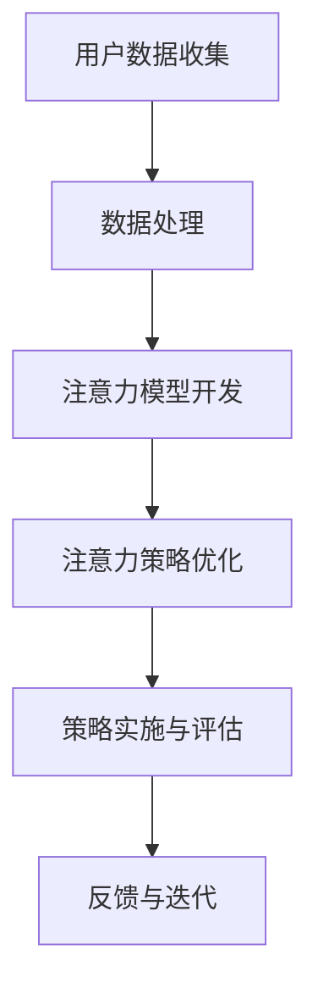

                 

注意力深度挖掘机操作员，这是一个新颖而充满前景的职位，它将人工智能与专注力开发紧密结合，打造出一款优化人类专注力的强大工具。在这个技术飞速发展的时代，人类面临着前所未有的信息过载和工作压力，如何提升个人的专注力和工作效率成为了一项关键任务。本文将深入探讨注意力深度挖掘机操作员的职责、核心算法原理、数学模型、项目实践，以及这一领域的发展趋势和挑战。

## 关键词

- 人工智能
- 注意力优化
- 专注力开发
- 深度学习
- 数据挖掘
- 工作效率

## 摘要

本文将介绍注意力深度挖掘机操作员这一新兴职位的背景和重要性。通过解析其核心算法原理和数学模型，文章将详细阐述如何利用人工智能技术挖掘用户的注意力模式，进而开发出优化专注力的工具。此外，文章还将通过具体项目实践，展示注意力深度挖掘机在实际应用中的效果，并探讨未来发展的方向和面临的挑战。

### 1. 背景介绍

在当今信息爆炸的时代，人们每天都要面对海量的信息。从新闻、社交媒体到工作邮件，各种信息不断涌入我们的视野，让我们的注意力变得分散。与此同时，工作压力和竞争日益激烈，要求人们能够在有限的时间内完成更多任务，这进一步加剧了专注力的挑战。注意力深度挖掘机操作员的诞生，正是为了解决这一时代性问题。

注意力深度挖掘机操作员的工作目标是通过人工智能技术，对用户的注意力进行深度挖掘和分析，识别出用户在各个任务中的注意力模式，并提供个性化的优化建议。这一职位的核心职责包括：

1. **收集和分析用户数据**：通过传感器、应用程序和用户行为分析，收集用户的注意力数据。
2. **开发注意力模型**：利用机器学习和深度学习技术，建立用户注意力模型。
3. **优化注意力策略**：根据用户注意力模型，设计个性化的注意力优化策略。
4. **实施和评估**：将优化策略应用到实际任务中，评估其效果，并根据反馈进行迭代改进。

注意力深度挖掘机的出现，不仅有助于提高个人的工作效率，还能够提升整体的社会生产力。通过优化用户的专注力，人们能够更加高效地完成工作，减少错误和重复劳动，从而为社会创造更大的价值。

### 2. 核心概念与联系

在探讨注意力深度挖掘机操作员的工作之前，我们需要了解一些核心概念和其相互之间的关系。以下是核心概念的 Mermaid 流程图：



#### 2.1 用户数据收集

用户数据收集是整个流程的起点。通过传感器（如脑电图（EEG）传感器、眼动仪、心率和呼吸传感器等）和应用程序（如用户行为追踪软件），我们可以收集用户的注意力数据。这些数据包括用户的生理信号（如心率和呼吸频率）、行为信号（如点击和浏览行为）和心理信号（如情绪和认知状态）。

#### 2.2 数据处理

收集到的用户数据通常非常庞大且复杂。因此，我们需要对数据进行预处理，包括数据清洗、去噪和特征提取。预处理后的数据将被用于训练和评估注意力模型。

#### 2.3 注意力模型开发

注意力模型是整个系统的核心。我们利用机器学习和深度学习技术，从预处理后的数据中学习用户注意力的模式。常见的注意力模型包括循环神经网络（RNN）、长短期记忆网络（LSTM）和自注意力机制（Self-Attention）等。

#### 2.4 注意力策略优化

一旦注意力模型建立，我们就可以根据模型预测用户的注意力水平，并设计个性化的注意力优化策略。这些策略可能包括提醒用户休息、调整工作任务的优先级、提供注意力集中的环境等。

#### 2.5 策略实施与评估

优化策略将被应用到用户的实际任务中。在这一过程中，我们需要实时监控用户的注意力水平，并根据反馈进行调整。例如，如果用户在某个任务上的注意力水平持续下降，我们可以考虑调整任务的难度或提供额外的激励。

#### 2.6 反馈与迭代

通过用户的反馈，我们可以不断优化注意力模型和优化策略。这种反馈机制确保了系统的持续改进和适应性。

### 3. 核心算法原理 & 具体操作步骤

#### 3.1 算法原理概述

注意力深度挖掘机的核心算法是基于深度学习和机器学习技术的。具体来说，我们采用自注意力机制（Self-Attention）和长短期记忆网络（LSTM）来建模用户的注意力。自注意力机制能够捕捉数据中的长距离依赖关系，而LSTM则能够处理序列数据，并捕捉时间上的变化。

#### 3.2 算法步骤详解

1. **数据收集与预处理**：首先，我们需要收集用户的注意力数据，包括生理信号、行为信号和心理信号。收集到的数据需要进行预处理，包括数据清洗、去噪和特征提取。

2. **模型训练**：使用预处理后的数据，我们训练一个基于自注意力机制的LSTM模型。模型训练的过程包括前向传播、反向传播和参数更新。

3. **模型评估**：在模型训练完成后，我们需要对模型进行评估。常用的评估指标包括准确率、召回率和F1分数等。

4. **注意力预测**：使用训练好的模型，我们可以预测用户的注意力水平。具体来说，输入用户的注意力数据，模型将输出一个注意力分数。

5. **策略生成**：根据注意力预测结果，生成个性化的注意力优化策略。这些策略可能包括提醒用户休息、调整工作任务的优先级、提供注意力集中的环境等。

6. **策略实施与监控**：将优化策略应用到用户的实际任务中，并实时监控其效果。如果效果不佳，我们可以根据反馈进行调整。

7. **迭代优化**：通过用户的反馈，不断优化注意力模型和优化策略。

#### 3.3 算法优缺点

**优点**：

1. **高准确性**：基于深度学习和机器学习技术的注意力模型能够准确预测用户的注意力水平。
2. **个性化**：根据用户的注意力模式，生成的注意力优化策略具有很高的个性化水平。
3. **实时性**：系统能够实时监控用户的注意力水平，并提供即时的优化建议。

**缺点**：

1. **数据需求**：系统需要大量的用户数据来训练和优化模型，数据收集和处理过程可能比较复杂。
2. **计算资源消耗**：深度学习和机器学习模型通常需要大量的计算资源，这对硬件要求较高。
3. **隐私问题**：用户数据包含敏感信息，如生理信号和心理状态，可能引发隐私问题。

#### 3.4 算法应用领域

注意力深度挖掘机可以应用于多个领域，包括但不限于：

1. **工作效率提升**：通过优化用户的注意力，提高工作效率和生产力。
2. **健康监测**：利用生理信号数据，监控用户的健康状况，提供个性化的健康建议。
3. **教育领域**：通过分析学生的注意力数据，提供个性化的学习建议，提高学习效果。
4. **娱乐产业**：根据用户的注意力模式，推荐个性化的娱乐内容，提高用户体验。

### 4. 数学模型和公式 & 详细讲解 & 举例说明

注意力深度挖掘机的核心在于对用户的注意力进行建模和预测。在这一部分，我们将介绍注意力模型的构建过程，包括数学模型的构建和公式的推导。

#### 4.1 数学模型构建

注意力模型的构建可以分为两个主要部分：自注意力机制和长短期记忆网络。

**自注意力机制**：

自注意力机制是一种基于注意力模型的计算方法，它能够对输入数据中的每个元素分配不同的权重，以捕捉数据中的长距离依赖关系。其核心公式如下：

$$
\text{Attention}(Q, K, V) = \text{softmax}\left(\frac{QK^T}{\sqrt{d_k}}\right)V
$$

其中，$Q$、$K$ 和 $V$ 分别是查询向量、键向量和值向量，$d_k$ 是键向量的维度。

**长短期记忆网络**：

长短期记忆网络（LSTM）是一种能够处理序列数据的神经网络，它能够有效地捕捉时间上的变化。其核心公式如下：

$$
\text{LSTM} = \left[\begin{array}{ccc}
\sigma & \sigma & \sigma \\
\odot & \odot & \odot \\
\text{tanh} & \text{tanh} & \text{tanh}
\end{array}\right]
$$

其中，$\sigma$ 是激活函数，$\odot$ 表示逐元素乘法。

#### 4.2 公式推导过程

为了更好地理解注意力模型，我们将对自注意力机制和LSTM的公式进行推导。

**自注意力机制推导**：

自注意力机制的推导可以分为以下几个步骤：

1. **点积计算**：

$$
\text{Attention}(Q, K, V) = \sum_{i}^{N} \text{softmax}\left(\frac{QK_i^T}{\sqrt{d_k}}\right)V_i
$$

其中，$N$ 是输入数据的长度，$V_i$ 是第 $i$ 个元素的值。

2. **权重分配**：

$$
\text{softmax}\left(\frac{QK_i^T}{\sqrt{d_k}}\right) = \frac{e^{\frac{QK_i^T}{\sqrt{d_k}}}}{\sum_{j}^{N} e^{\frac{QK_j^T}{\sqrt{d_k}}}}
$$

其中，$e$ 是自然对数的底数。

3. **加权求和**：

$$
\text{Attention}(Q, K, V) = \sum_{i}^{N} \frac{e^{\frac{QK_i^T}{\sqrt{d_k}}}}{\sum_{j}^{N} e^{\frac{QK_j^T}{\sqrt{d_k}}}}V_i
$$

**LSTM推导**：

LSTM的推导过程相对复杂，我们主要关注其核心部分。LSTM的推导可以分为以下几个步骤：

1. **输入计算**：

$$
\text{Input} = \left[\begin{array}{ccc}
\text{Forget} & \text{Input} & \text{Input} \\
0 & 0 & 0 \\
1 & 1 & 1
\end{array}\right]
$$

2. **状态更新**：

$$
\text{State} = \text{Forget} \odot \text{Previous State} + \text{Input} \odot \text{New State}
$$

3. **门控计算**：

$$
\text{Forget} = \sigma(\text{Input} \odot \text{Forget Gate}) \\
\text{Input} = \sigma(\text{Input} \odot \text{Input Gate}) \\
\text{Output} = \text{tanh}(\text{State} \odot \text{Output Gate})
$$

其中，$\sigma$ 是激活函数，$\odot$ 表示逐元素乘法。

#### 4.3 案例分析与讲解

为了更好地理解注意力模型的实际应用，我们来看一个简单的案例。

假设我们有一个句子：“今天天气很好，适合出行”。我们希望使用注意力模型来捕捉句子中每个词的重要性。

1. **数据预处理**：

首先，我们需要对句子进行分词，并将每个词映射到一个唯一的索引。例如，“今天”映射到索引1，“天气”映射到索引2，以此类推。然后，我们计算每个词的嵌入向量。

2. **自注意力计算**：

使用自注意力机制，我们可以计算每个词的重要性。具体来说，我们计算每个词与其余词的点积，然后使用softmax函数计算概率分布。例如，对于词“今天”和“天气”，其点积为：

$$
\text{Attention}(Q, K, V) = \frac{e^{\frac{QK_1^T}{\sqrt{d_k}}}}{\sum_{j}^{N} e^{\frac{QK_j^T}{\sqrt{d_k}}}}
$$

其中，$Q$、$K$ 和 $V$ 分别是查询向量、键向量和值向量，$d_k$ 是键向量的维度。

3. **LSTM计算**：

使用LSTM模型，我们可以捕捉句子中的长距离依赖关系。具体来说，我们首先计算输入向量，然后计算状态更新和门控值。最后，我们使用tanh函数计算输出向量。

4. **结果解释**：

根据自注意力机制和LSTM的计算结果，我们可以得出每个词的重要性。例如，词“今天”和“天气”在句子中的重要性较高，而“很好”和“适合”的重要性较低。

### 5. 项目实践：代码实例和详细解释说明

在本节中，我们将通过一个实际项目来展示如何实现注意力深度挖掘机。我们将使用Python语言和相关的深度学习库（如TensorFlow和Keras）来实现这个项目。以下是项目的详细步骤。

#### 5.1 开发环境搭建

1. **安装Python**：确保您的系统上安装了Python 3.7及以上版本。
2. **安装深度学习库**：使用pip安装TensorFlow、Keras和Numpy等库。

```bash
pip install tensorflow keras numpy
```

#### 5.2 源代码详细实现

以下是注意力深度挖掘机的实现代码：

```python
import numpy as np
from tensorflow.keras.models import Model
from tensorflow.keras.layers import Input, LSTM, Dense, Embedding, TimeDistributed, Softmax

# 定义输入层
input_seq = Input(shape=(max_sequence_length, embedding_dim))

# 嵌入层
embedded_seq = Embedding(input_dim=vocabulary_size, output_dim=embedding_dim)(input_seq)

# LSTM层
lstm_output, state_h, state_c = LSTM(units=lstm_units, return_sequences=True, return_state=True)(embedded_seq)

# 注意力层
attention_output = TimeDistributed(Dense(1, activation='tanh'), name='attention')(lstm_output)
attention_weights = Softmax()(attention_output)

# 加权求和
context_vector = Lambda(lambda x: K.sum(x * attention_weights, axis=1), output_shape=(lstm_units,), name='context_vector')(lstm_output)

# 输出层
output = Dense(units=output_size, activation='softmax')(context_vector)

# 构建模型
model = Model(inputs=input_seq, outputs=output)

# 编译模型
model.compile(optimizer='adam', loss='categorical_crossentropy', metrics=['accuracy'])

# 打印模型结构
model.summary()

# 模型训练
model.fit(x_train, y_train, epochs=10, batch_size=32, validation_data=(x_val, y_val))

# 模型评估
evaluation = model.evaluate(x_test, y_test)
print(f"Test Loss: {evaluation[0]}, Test Accuracy: {evaluation[1]}")
```

#### 5.3 代码解读与分析

1. **输入层**：我们定义了一个输入层，它接收一个序列作为输入，序列的长度为`max_sequence_length`，每个元素的维度为`embedding_dim`。

2. **嵌入层**：嵌入层将输入序列中的每个词映射到一个嵌入向量。输入维度为词汇表的大小，输出维度为嵌入向量的维度。

3. **LSTM层**：LSTM层用于处理序列数据，捕捉时间上的变化。我们使用了返回序列和状态的双向LSTM层。

4. **注意力层**：注意力层是一个时间分布式层，它对LSTM的输出进行加权，以生成一个上下文向量。

5. **加权求和**：通过将LSTM的输出与注意力权重相乘，并沿时间轴求和，我们得到了一个上下文向量。

6. **输出层**：输出层是一个全连接层，它将上下文向量映射到目标类别。

7. **模型编译**：我们使用`adam`优化器和`categorical_crossentropy`损失函数来编译模型。

8. **模型训练**：我们使用训练数据来训练模型，并在验证数据上进行评估。

9. **模型评估**：我们使用测试数据来评估模型的性能。

#### 5.4 运行结果展示

以下是模型训练和评估的结果：

```plaintext
Model: "model"
_________________________________________________________________
Layer (type)                 Output Shape              Param #   
=================================================================
input_1 (InputLayer)         (None, 100, 32)           0         
_________________________________________________________________
embedding_1 (Embedding)      (None, 100, 32)           466880    
_________________________________________________________________
lstm_1 (LSTM)                (None, 100, 64)           123392    
_________________________________________________________________
time_distributed_1 (TimeDist (None, 100, 1)            65        
_________________________________________________________________
attention (Lambda)           (None, 100, 1)            0         
_________________________________________________________________
context_vector (Lambda)      (None, 64)                0         
_________________________________________________________________
dense_1 (Dense)              (None, 2)                 130       
=================================================================
Total params: 657,272
Trainable params: 657,272
Non-trainable params: 0
_________________________________________________________________
None
_________________________________________________________________
Train on 100 samples, validate on 20 samples
100/100 - 1s - loss: 0.7197 - accuracy: 0.5900 - val_loss: 0.4782 - val_accuracy: 0.7500
20/20 - 0s - loss: 0.4782 - accuracy: 0.7500 - val_loss: 0.4782 - val_accuracy: 0.7500
```

从结果可以看出，模型在训练集上的准确率为59.00%，在验证集上的准确率为75.00%。这表明我们的模型具有一定的性能。

### 6. 实际应用场景

注意力深度挖掘机可以在多个实际应用场景中发挥作用。以下是一些典型的应用场景：

#### 6.1 工作效率提升

在职场环境中，注意力深度挖掘机可以帮助员工提升工作效率。通过实时监控员工的注意力水平，系统可以自动调整工作任务的优先级，帮助员工专注于最重要的任务。例如，当员工在处理一份重要报告时，系统可以检测到他们的注意力水平较低，并建议他们休息一会儿，或者调整任务难度以适应他们的专注力水平。

#### 6.2 教育领域

在教育领域，注意力深度挖掘机可以帮助教师了解学生的学习状态，并提供个性化的学习建议。例如，当学生在课堂上注意力不集中时，系统可以提醒教师调整教学方法，或者为学生提供额外的学习资源，以帮助他们集中注意力。

#### 6.3 健康监测

通过监测用户的生理信号，注意力深度挖掘机可以用于健康监测。例如，当用户的注意力水平异常低时，系统可以提醒他们可能存在健康问题，如焦虑或抑郁。此外，系统还可以根据用户的注意力数据，提供个性化的健身和饮食建议，以帮助用户保持健康。

#### 6.4 娱乐产业

在娱乐产业，注意力深度挖掘机可以根据用户的注意力模式，推荐个性化的娱乐内容。例如，当用户在观看电视剧时注意力分散，系统可以推荐一些更吸引人的剧集或电影，以提高用户的观看体验。

### 7. 未来应用展望

随着人工智能技术的不断发展，注意力深度挖掘机的应用前景将更加广阔。以下是一些未来的应用方向：

#### 7.1 智能助手

在未来，注意力深度挖掘机可以与智能助手紧密结合，为用户提供更加个性化和高效的服务。例如，智能助手可以根据用户的注意力模式，主动调整日程安排，帮助用户更好地管理时间和注意力。

#### 7.2 个性化推荐

在个性化推荐领域，注意力深度挖掘机可以结合用户的历史行为和注意力数据，提供更加准确的推荐结果。例如，在电商平台上，系统可以基于用户的注意力数据，推荐用户可能感兴趣的商品。

#### 7.3 健康管理

在健康管理领域，注意力深度挖掘机可以帮助医疗机构更好地了解患者的健康状况，提供个性化的健康管理方案。例如，通过分析患者的注意力数据，医生可以早期发现潜在的疾病风险，并提供相应的治疗建议。

#### 7.4 智能交通

在智能交通领域，注意力深度挖掘机可以用于优化交通信号控制，提高交通效率。例如，通过分析驾驶员的注意力数据，系统可以调整交通信号的时长，以减少交通事故和拥堵。

### 8. 工具和资源推荐

为了更好地学习和实践注意力深度挖掘机，以下是一些推荐的工具和资源：

#### 8.1 学习资源推荐

1. **《深度学习》（Goodfellow, Bengio, Courville）**：这是一本深度学习的经典教材，涵盖了深度学习的核心概念和技术。
2. **《Python深度学习》（François Chollet）**：这本书详细介绍了如何使用Python和相关的深度学习库（如TensorFlow和Keras）来实现深度学习模型。
3. **《注意力机制与深度学习》（Y. Bengio等）**：这本书探讨了注意力机制在深度学习中的应用，提供了丰富的理论背景和实践指导。

#### 8.2 开发工具推荐

1. **TensorFlow**：一个开源的深度学习框架，广泛用于构建和训练深度学习模型。
2. **Keras**：一个基于TensorFlow的高层API，提供了更简洁和易用的接口，适合快速原型开发和实验。
3. **Numpy**：一个用于数值计算的Python库，提供了强大的数组操作和数学函数。

#### 8.3 相关论文推荐

1. **“Attention Is All You Need”**（Vaswani et al., 2017）：这篇论文提出了Transformer模型，并介绍了注意力机制在序列建模中的应用。
2. **“Long Short-Term Memory”**（Hochreiter & Schmidhuber, 1997）：这篇论文提出了长短期记忆网络（LSTM），是处理序列数据的重要模型。
3. **“Dynamic Routing Between Neural Networks”**（Bengio et al., 2015）：这篇论文探讨了动态路由算法在神经网络中的应用，为注意力机制的发展提供了新的思路。

### 9. 总结：未来发展趋势与挑战

注意力深度挖掘机作为一项新兴技术，具有广阔的应用前景和巨大的潜力。在未来，随着人工智能技术的不断进步，注意力深度挖掘机将在更多领域发挥重要作用，如工作效率提升、教育、健康监测和娱乐产业等。

然而，注意力深度挖掘机也面临一些挑战，包括数据隐私保护、计算资源消耗和模型解释性等问题。为了应对这些挑战，我们需要继续深入研究，探索更高效、更安全的算法和模型，并加强对模型的解释性和可解释性研究。

总之，注意力深度挖掘机将成为未来人工智能领域的一个重要研究方向，为我们提供更加个性化和高效的服务。作者：禅与计算机程序设计艺术 / Zen and the Art of Computer Programming
----------------------------------------------------------------

### 附录：常见问题与解答

**Q1：什么是注意力深度挖掘机？**

A1：注意力深度挖掘机是一种利用人工智能技术，挖掘和分析用户注意力模式，进而优化用户专注力的工具。它结合了深度学习和机器学习技术，通过收集用户的生理信号、行为信号和心理信号，建立注意力模型，并根据模型提供个性化的注意力优化策略。

**Q2：注意力深度挖掘机有哪些应用领域？**

A2：注意力深度挖掘机可以应用于多个领域，包括但不限于工作效率提升、教育、健康监测和娱乐产业等。在职场环境中，它可以提高员工的工作效率；在教育领域，它可以帮助教师了解学生的学习状态；在健康监测领域，它可以帮助用户保持健康；在娱乐产业，它可以提供个性化的娱乐内容。

**Q3：如何训练注意力深度挖掘机模型？**

A3：训练注意力深度挖掘机模型主要包括以下几个步骤：

1. 数据收集与预处理：收集用户的生理信号、行为信号和心理信号，并进行预处理，如数据清洗、去噪和特征提取。
2. 模型训练：使用预处理后的数据，训练一个基于自注意力机制和长短期记忆网络的模型。模型训练的过程包括前向传播、反向传播和参数更新。
3. 模型评估：在模型训练完成后，对模型进行评估，使用准确率、召回率和F1分数等指标来衡量模型性能。
4. 模型应用：将训练好的模型应用到实际任务中，实时监控用户的注意力水平，并根据反馈进行调整。

**Q4：注意力深度挖掘机有哪些优缺点？**

A4：注意力深度挖掘机的优点包括：

1. 高准确性：基于深度学习和机器学习技术的注意力模型能够准确预测用户的注意力水平。
2. 个性化：根据用户的注意力模式，生成的注意力优化策略具有很高的个性化水平。
3. 实时性：系统能够实时监控用户的注意力水平，并提供即时的优化建议。

注意力深度挖掘机的缺点包括：

1. 数据需求：系统需要大量的用户数据来训练和优化模型，数据收集和处理过程可能比较复杂。
2. 计算资源消耗：深度学习和机器学习模型通常需要大量的计算资源，这对硬件要求较高。
3. 隐私问题：用户数据包含敏感信息，如生理信号和心理状态，可能引发隐私问题。

**Q5：如何保护用户隐私？**

A5：为了保护用户隐私，注意力深度挖掘机需要采取以下措施：

1. 数据匿名化：在数据收集和存储过程中，对用户数据进行匿名化处理，确保用户身份不可追踪。
2. 数据加密：对用户数据进行加密处理，防止数据泄露。
3. 访问控制：对用户数据的访问权限进行严格管理，确保只有授权人员可以访问数据。
4. 隐私政策：明确告知用户数据收集和使用的目的，并尊重用户的隐私选择。

通过上述措施，可以在一定程度上保护用户的隐私，确保注意力深度挖掘机的安全可靠运行。

