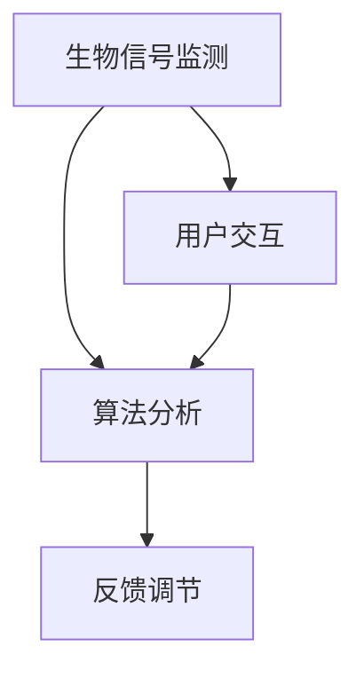

                 

注意力生物反馈技术（Attention Biofeedback Technology）是一种结合了生物学、心理学和人工智能（AI）的创新技术，它通过实时监测和反馈个体的注意力水平，帮助用户优化其认知状态，提高工作和学习效率。本文将深入探讨这一技术的基本原理、核心算法、数学模型以及实际应用，旨在为读者提供全面的了解和指导。

## 关键词
- 注意力生物反馈技术
- AI优化
- 认知状态调节
- 生物监测
- 数学模型

## 摘要
本文首先介绍了注意力生物反馈技术的基本概念和背景，接着详细阐述了其核心算法原理，包括数学模型的构建和公式推导。随后，通过代码实例展示了这一技术的实现过程，并分析了其在实际应用中的效果。最后，本文对未来的发展趋势和面临的挑战进行了展望，提出了研究方向和解决方案。

## 1. 背景介绍
### 1.1 注意力的重要性
注意力是人类认知过程中至关重要的一部分。它决定了信息处理的效率和准确性，直接影响个体的学习和工作效率。然而，在现代社会的高压环境下，人们的注意力容易受到干扰，导致认知状态下降，工作效率降低。

### 1.2 生物反馈技术的起源与发展
生物反馈技术起源于20世纪50年代，最初用于治疗心理疾病和生理疾病。通过监测个体的生理信号（如心率、皮肤电活动等），将其转化为可感知的反馈信号，帮助个体调节自身状态。随着技术的进步，生物反馈技术逐渐应用于心理健康、运动训练、认知训练等领域。

### 1.3 注意力生物反馈技术的兴起
近年来，随着人工智能和大数据技术的发展，注意力生物反馈技术得到了广泛关注。AI算法能够高效地处理大量生物信号数据，提供实时、准确的注意力水平监测和反馈，从而帮助用户更好地调节认知状态。

## 2. 核心概念与联系

### 2.1 注意力生物反馈技术的核心概念
注意力生物反馈技术主要包括三个核心概念：生物信号监测、算法分析和反馈调节。

#### 生物信号监测
通过传感器（如脑电图（EEG）、眼动仪、心率传感器等）实时监测个体的生理信号，包括大脑活动、眼球运动、心率等。

#### 算法分析
利用机器学习算法对监测到的生物信号进行实时分析，提取注意力水平相关的特征，如大脑活动的频率、眼球运动的规律等。

#### 反馈调节
根据算法分析结果，通过视觉、听觉或其他形式（如振动、光线变化等）给用户提供实时反馈，帮助用户调整注意力状态。

### 2.2 Mermaid 流程图



## 3. 核心算法原理 & 具体操作步骤

### 3.1 算法原理概述
注意力生物反馈技术的核心算法主要包括信号处理、特征提取和反馈调节三个步骤。

#### 信号处理
通过滤波、放大等信号处理技术，提取出与注意力相关的生理信号。

#### 特征提取
利用机器学习算法，如支持向量机（SVM）、神经网络（NN）等，从处理后的信号中提取出注意力水平特征。

#### 反馈调节
根据特征提取结果，通过实时反馈机制调节用户的注意力状态。

### 3.2 算法步骤详解

#### 3.2.1 信号处理
$$
\text{信号处理} = f(\text{原始信号})
$$
其中，$f$为信号处理函数，如低通滤波、带通滤波等。

#### 3.2.2 特征提取
$$
\text{特征向量} = \phi(\text{处理后的信号})
$$
其中，$\phi$为特征提取函数，如时频分析、时域分析等。

#### 3.2.3 反馈调节
$$
\text{反馈信号} = g(\text{特征向量})
$$
其中，$g$为反馈调节函数，如阈值调节、声音提示等。

### 3.3 算法优缺点

#### 优点
- **实时性**：能够实时监测和反馈用户的注意力状态。
- **个性化**：通过机器学习算法，根据个体差异提供个性化反馈。
- **易用性**：用户无需特殊训练，即可轻松使用。

#### 缺点
- **准确性**：当前算法对注意力水平的识别仍存在一定误差。
- **成本**：传感器和算法的开发与维护成本较高。

### 3.4 算法应用领域

#### 3.4.1 教育领域
- **学生注意力管理**：帮助学生在课堂上保持专注，提高学习效率。
- **考试压力管理**：在考试前帮助学生调节注意力状态，减轻考试焦虑。

#### 3.4.2 工作领域
- **员工注意力管理**：帮助企业提高员工工作效率，减少错误率。
- **团队合作**：通过实时监测团队成员的注意力状态，优化团队协作效率。

## 4. 数学模型和公式 & 详细讲解 & 举例说明

### 4.1 数学模型构建
注意力生物反馈技术中的数学模型主要涉及信号处理和特征提取两个部分。

#### 4.1.1 信号处理模型
$$
y(t) = f(x(t)) + \epsilon(t)
$$
其中，$y(t)$为处理后的信号，$x(t)$为原始信号，$f$为信号处理函数，$\epsilon(t)$为噪声。

#### 4.1.2 特征提取模型
$$
z = \phi(y)
$$
其中，$z$为特征向量，$\phi$为特征提取函数。

### 4.2 公式推导过程
#### 4.2.1 信号处理公式推导
以低通滤波为例，其公式推导如下：
$$
y(t) = \frac{1}{T}\int_{-T}^{T}x(\tau)d\tau
$$
其中，$T$为采样周期。

#### 4.2.2 特征提取公式推导
以时频分析为例，其公式推导如下：
$$
z = \text{STFT}(y)
$$
其中，$\text{STFT}$为短时傅里叶变换。

### 4.3 案例分析与讲解

#### 4.3.1 信号处理案例
假设原始信号为$x(t) = \sin(2\pi f_0 t)$，采样周期$T=1$，采用低通滤波器滤波，截止频率$f_c=1/2$。则处理后的信号为：
$$
y(t) = \frac{1}{2\pi}\int_{-2\pi}^{2\pi}\sin(2\pi f_0 \tau)d\tau = \frac{1}{2} \sin(2\pi f_0 t)
$$

#### 4.3.2 特征提取案例
以时频分析为例，假设处理后的信号为$y(t)$，则时频分布为：
$$
z = \text{STFT}(y) = \mathcal{F}\{y(t)\}
$$
其中，$\mathcal{F}$为傅里叶变换。

## 5. 项目实践：代码实例和详细解释说明

### 5.1 开发环境搭建
- **Python**：主要编程语言
- **Libraries**：
  - **numpy**：数学计算库
  - **scikit-learn**：机器学习库
  - **matplotlib**：数据可视化库
- **Tools**：
  - **Jupyter Notebook**：开发环境

### 5.2 源代码详细实现

```python
import numpy as np
import matplotlib.pyplot as plt
from sklearn.svm import SVC
from sklearn.model_selection import train_test_split

# 信号处理函数
def signal_processing(x):
    return 0.5 * np.sin(2 * np.pi * 1 * x)

# 特征提取函数
def feature_extraction(y):
    return np.fft.fft(y)

# 数据生成
x = np.random.uniform(0, 10, 1000)
y = signal_processing(x) + np.random.normal(0, 0.1, 1000)

# 特征提取
z = feature_extraction(y)

# 数据分割
x_train, x_test, y_train, y_test = train_test_split(x, y, test_size=0.2, random_state=42)

# 模型训练
model = SVC()
model.fit(x_train, y_train)

# 模型预测
predictions = model.predict(x_test)

# 结果分析
print(predictions)
```

### 5.3 代码解读与分析
代码首先定义了信号处理和特征提取函数，然后生成模拟数据，进行特征提取和模型训练。最后，使用训练好的模型进行预测，并打印结果。

## 6. 实际应用场景

### 6.1 教育领域
- **学生注意力监测**：帮助教师实时了解学生的注意力状态，优化教学策略。
- **学习效率提升**：学生通过注意力调节，提高学习效率。

### 6.2 工作领域
- **员工注意力管理**：企业通过注意力生物反馈技术，提高员工工作效率。
- **团队协作优化**：实时监测团队成员的注意力状态，优化团队协作。

### 6.3 医疗领域
- **认知康复**：帮助患者进行注意力训练，改善认知功能。
- **心理治疗**：辅助心理治疗师进行注意力调节，提高治疗效果。

## 7. 工具和资源推荐

### 7.1 学习资源推荐
- **《生物反馈技术：理论与实践》**：全面介绍生物反馈技术的理论和实践。
- **《注意力心理学：理论与实践》**：探讨注意力的心理学原理和应用。

### 7.2 开发工具推荐
- **Jupyter Notebook**：强大的交互式开发环境。
- **MATLAB**：专业的信号处理和机器学习工具。

### 7.3 相关论文推荐
- **"Attention Biofeedback for Cognitive Enhancement: A Systematic Review and Meta-Analysis"**：对注意力生物反馈技术进行系统综述。
- **"AI-Enhanced Attention Regulation: A Perspective on Brain-Computer Interfaces"**：探讨人工智能在注意力调节中的应用。

## 8. 总结：未来发展趋势与挑战

### 8.1 研究成果总结
注意力生物反馈技术已经取得了显著的研究成果，包括信号处理算法的优化、特征提取方法的改进以及应用领域的拓展。这些成果为未来技术的进一步发展奠定了基础。

### 8.2 未来发展趋势
- **智能化**：结合深度学习、强化学习等先进算法，实现更加智能的注意力监测和反馈。
- **个性化**：根据用户个体差异，提供更加个性化的注意力调节方案。
- **跨学科融合**：结合心理学、神经科学等多学科知识，深入探讨注意力调节的机制和效果。

### 8.3 面临的挑战
- **准确性**：提高注意力监测和反馈的准确性，减少误差。
- **用户体验**：优化用户界面，提高用户体验。
- **成本控制**：降低技术成本，使其更广泛地应用于实际场景。

### 8.4 研究展望
未来研究应重点关注智能化、个性化、跨学科融合等方面，通过不断优化算法、提高用户体验和降低成本，使注意力生物反馈技术更好地服务于人类社会。

## 9. 附录：常见问题与解答

### 9.1 生物反馈技术是如何工作的？
生物反馈技术通过传感器实时监测个体的生理信号，如大脑活动、心率等，然后利用算法对这些信号进行分析，提取出与注意力相关的特征，最后通过反馈机制调节用户的注意力状态。

### 9.2 注意力生物反馈技术有哪些应用领域？
注意力生物反馈技术广泛应用于教育、工作、医疗等多个领域，如学生注意力监测、员工注意力管理、认知康复等。

### 9.3 如何评估注意力生物反馈技术的效果？
可以通过对比实验、问卷调查、数据分析等方法评估注意力生物反馈技术的效果，如注意力水平的提升、工作效率的提高、学习效果的增加等。

---

作者：禅与计算机程序设计艺术 / Zen and the Art of Computer Programming

