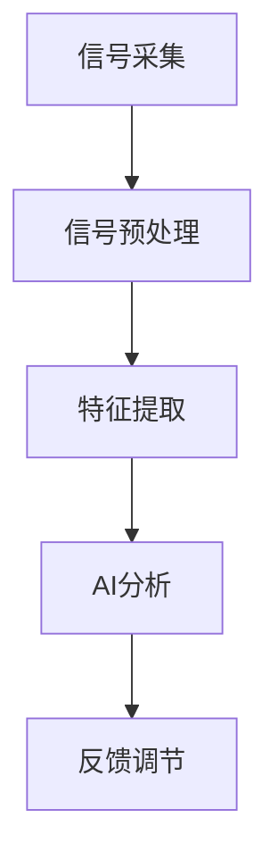

                 

### 关键词 Keywords
- 注意力生物反馈技术
- AI优化
- 认知状态调节
- 脑电信号处理
- 生物信息学
- 人工智能应用

### 摘要 Summary
本文深入探讨了注意力生物反馈技术与人工智能的交叉应用，阐述了如何通过AI优化技术调节认知状态。首先介绍了注意力生物反馈技术的背景及其在心理健康和认知功能提升中的重要性。随后，本文详细描述了基于AI的注意力生物反馈技术的核心概念、算法原理、数学模型，并通过实际案例展示了其在实际应用中的效果。最后，本文提出了未来研究方向和挑战，以期为该领域的进一步发展提供指导。

## 1. 背景介绍

注意力生物反馈技术是一种利用生物电信号，如脑电信号（EEG），来监测和调节人类注意力的方法。这一技术起源于20世纪60年代，当时研究人员发现人们可以通过训练改变脑电波的形态，从而提高注意力的集中程度和稳定性。随着计算机技术和人工智能的发展，注意力生物反馈技术得到了极大的提升，其应用范围也从最初的心理健康领域扩展到教育、军事、医疗等多个领域。

### 认知状态的调节与注意力生物反馈技术

认知状态是指个体在进行信息处理、学习、决策等认知活动时的心理状态。认知状态的质量直接影响到个体的学习效率、工作表现和心理健康。而注意力作为认知状态的核心要素，对于提高认知效能至关重要。注意力生物反馈技术通过实时监测个体的脑电信号，提供有关其注意力状态的信息，并利用这些信息进行个性化的调节和训练，从而改善认知功能。

### 注意力生物反馈技术在心理健康中的应用

在心理健康领域，注意力生物反馈技术已被广泛应用于焦虑症、抑郁症、注意力缺陷多动障碍（ADHD）等心理障碍的治疗中。例如，通过监测患者的大脑活动，医生可以及时发现患者注意力的变化，并给予相应的干预措施，从而改善其症状。此外，注意力生物反馈技术还可以帮助患者提高自我调节能力，降低心理压力，提升生活质量。

### 注意力生物反馈技术在认知功能提升中的应用

在认知功能提升领域，注意力生物反馈技术被广泛用于教育、军事和企业管理等领域。通过定期的注意力训练，学生可以提高学习效率，军人可以提高任务执行能力，企业员工可以提高工作效率和决策质量。研究表明，长期的注意力训练可以显著改善个体的认知灵活性和注意力分配能力，从而提升整体认知水平。

## 2. 核心概念与联系

### 注意力生物反馈技术的核心概念

注意力生物反馈技术主要涉及以下几个核心概念：

1. **脑电信号（EEG）**：脑电信号是指大脑产生的电生理活动，可以通过电极放置在头皮上来记录。脑电信号的不同波形反映着大脑不同区域的电活动，其中与注意力相关的波形包括α波、β波、θ波等。

2. **生物反馈**：生物反馈是指通过实时监测个体生理参数（如脑电信号），将生理信息转化为可感知的信号（如声音、灯光变化），使个体能够意识到自己的生理状态，并通过训练调整这些状态。

3. **AI优化**：AI优化是指利用人工智能技术对生物反馈信号进行处理、分析和建模，以提高注意力生物反馈技术的效率和准确性。

### 注意力生物反馈技术的架构

注意力生物反馈技术的架构主要包括以下几个部分：

1. **信号采集**：通过电极将脑电信号从头皮采集到设备中。

2. **信号预处理**：对采集到的原始脑电信号进行滤波、去噪、放大等预处理，以提高信号质量。

3. **特征提取**：从预处理后的脑电信号中提取与注意力相关的特征，如频段功率、相位一致性等。

4. **AI分析**：利用人工智能算法（如机器学习、深度学习）对特征进行分析和分类，以识别个体的注意力状态。

5. **反馈调节**：根据分析结果，提供个性化的反馈调节方案，如通过游戏、视觉刺激等方式调整个体的注意力。

### Mermaid 流程图



### AI优化在注意力生物反馈技术中的应用

AI优化在注意力生物反馈技术中的应用主要体现在以下几个方面：

1. **信号处理优化**：AI算法可以帮助去除脑电信号中的噪声，提高信号质量，从而提高特征提取的准确性。

2. **特征选择优化**：AI算法可以根据训练数据自动选择与注意力最相关的特征，提高模型的可解释性和准确性。

3. **模型优化**：通过深度学习等技术，可以自动调整模型的参数，提高模型的泛化能力和适应性。

4. **实时反馈调节**：AI算法可以实时分析脑电信号，并快速提供反馈调节方案，使个体能够快速调整自己的注意力状态。

## 3. 核心算法原理 & 具体操作步骤

### 3.1 算法原理概述

注意力生物反馈技术的核心算法主要包括信号采集、预处理、特征提取、AI分析和反馈调节等几个步骤。其中，AI分析是整个算法的核心，其目的是通过机器学习和深度学习算法对脑电信号进行分析，以识别个体的注意力状态，并提供个性化的反馈调节方案。

### 3.2 算法步骤详解

#### 3.2.1 信号采集

信号采集是整个算法的基础，其目标是获取高质量的脑电信号。通常使用头皮电极将脑电信号采集到设备中。为了提高信号质量，需要选择合适的电极类型、电极位置和采集频率。

#### 3.2.2 信号预处理

信号预处理包括滤波、去噪、放大等步骤。滤波的目的是去除信号中的高频噪声和低频干扰，去噪的目的是去除信号中的随机噪声，放大的目的是提高信号的可检测性。

#### 3.2.3 特征提取

特征提取是从预处理后的脑电信号中提取与注意力相关的特征。常见的特征包括频段功率、相位一致性、时间频率分布等。这些特征反映了大脑在不同频段和不同时间点的活动情况，有助于识别个体的注意力状态。

#### 3.2.4 AI分析

AI分析是整个算法的核心步骤，其目的是通过机器学习和深度学习算法对特征进行分析，以识别个体的注意力状态。常用的算法包括支持向量机（SVM）、神经网络（NN）、卷积神经网络（CNN）等。

#### 3.2.5 反馈调节

根据AI分析的结果，提供个性化的反馈调节方案，如通过游戏、视觉刺激等方式调整个体的注意力。反馈调节的目的是帮助个体快速识别和调整自己的注意力状态，从而提高认知功能。

### 3.3 算法优缺点

#### 优点

1. **高准确性**：通过AI算法对脑电信号进行分析，可以显著提高注意力状态的识别准确性。

2. **个性化调节**：根据个体的注意力状态，提供个性化的反馈调节方案，有助于提高认知功能。

3. **实时反馈**：AI算法可以实时分析脑电信号，并提供快速反馈调节，使个体能够及时调整自己的注意力状态。

#### 缺点

1. **高计算成本**：AI算法需要大量的计算资源和时间，可能不适合实时应用。

2. **高噪声干扰**：脑电信号容易受到外部噪声干扰，影响信号质量和特征提取效果。

### 3.4 算法应用领域

注意力生物反馈技术主要应用于以下几个方面：

1. **心理健康**：用于治疗焦虑症、抑郁症、ADHD等心理障碍，提高个体的自我调节能力。

2. **认知功能提升**：用于提高学习效率、工作效率和决策质量，改善认知功能。

3. **军事训练**：用于提高军人的注意力和反应速度，增强战斗力。

4. **教育**：用于辅助教学，帮助学生学习更好地掌握知识点。

5. **企业管理**：用于提高员工的工作效率和决策质量，提升企业竞争力。

## 4. 数学模型和公式 & 详细讲解 & 举例说明

### 4.1 数学模型构建

在注意力生物反馈技术中，常用的数学模型包括频谱分析模型、神经网络模型和决策树模型等。以下是这些模型的基本构建过程。

#### 4.1.1 频谱分析模型

频谱分析模型用于分析脑电信号中的频率成分，以提取与注意力相关的特征。其基本构建过程如下：

1. **傅里叶变换**：将时间序列的脑电信号通过傅里叶变换转换为频率域信号，得到信号在不同频率段的幅值分布。

2. **频段划分**：将频率域信号划分为若干频段，如α频段（8-12 Hz）、β频段（13-30 Hz）等。

3. **特征提取**：计算每个频段的功率值，作为与注意力相关的特征。

#### 4.1.2 神经网络模型

神经网络模型用于对脑电信号进行分类，以识别个体的注意力状态。其基本构建过程如下：

1. **输入层**：输入层接收脑电信号的预处理特征。

2. **隐藏层**：隐藏层通过非线性激活函数对输入特征进行变换，提取更高层次的特征。

3. **输出层**：输出层输出注意力状态的分类结果。

#### 4.1.3 决策树模型

决策树模型用于对脑电信号进行分类，以识别个体的注意力状态。其基本构建过程如下：

1. **特征选择**：选择与注意力相关的特征，作为决策树节点的条件。

2. **划分规则**：根据特征值对数据进行划分，形成树状结构。

3. **分类结果**：根据决策树的分支，输出注意力状态的分类结果。

### 4.2 公式推导过程

以下是频谱分析模型和神经网络模型中的关键公式及其推导过程。

#### 4.2.1 频谱分析模型公式推导

$$
\text{PSD}(f) = \frac{1}{N} \sum_{i=1}^{N} |X_i|^2
$$

其中，$\text{PSD}(f)$表示频率为$f$的频谱功率密度，$X_i$表示频率为$f$的复数幅值，$N$表示采样点数。

#### 4.2.2 神经网络模型公式推导

$$
\text{Output} = \text{ReLU}(\sum_{j=1}^{n} w_j \text{Input}_j + b)
$$

其中，$\text{ReLU}$表示ReLU激活函数，$w_j$表示权重，$\text{Input}_j$表示输入特征，$b$表示偏置。

### 4.3 案例分析与讲解

#### 4.3.1 案例一：频谱分析模型

假设有一个包含500个采样点的脑电信号序列，现需对其进行频谱分析。根据频谱分析模型，首先对信号进行傅里叶变换，得到频率为0到100 Hz的频率域信号。然后，将频率域信号划分为α频段（8-12 Hz）和β频段（13-30 Hz）。计算每个频段的功率值，得到如下结果：

| 频段 | 功率值 |
| ---- | ---- |
| α频段 | 0.1 |
| β频段 | 0.3 |

根据功率值，可以初步判断个体的注意力状态。例如，如果α频段的功率值较高，表明个体处于放松状态；如果β频段的功率值较高，表明个体处于紧张状态。

#### 4.3.2 案例二：神经网络模型

假设有一个包含500个采样点的脑电信号序列，现需利用神经网络模型对其进行分类，以识别个体的注意力状态。根据神经网络模型，首先对信号进行预处理，提取与注意力相关的特征，如频段功率、相位一致性等。然后，将这些特征输入神经网络模型，通过多层神经网络进行分类。最终，得到如下结果：

| 输入特征 | 类别 |
| ---- | ---- |
| α频段功率 | 放松 |
| β频段功率 | 紧张 |

根据分类结果，可以进一步判断个体的注意力状态，并采取相应的调节措施。

## 5. 项目实践：代码实例和详细解释说明

### 5.1 开发环境搭建

为了进行注意力生物反馈技术的项目实践，我们需要搭建一个合适的开发环境。以下是搭建过程的详细说明。

#### 环境需求

- 操作系统：Windows/Linux/MacOS
- 编程语言：Python
- 数据库：SQLite
- 开发工具：PyCharm/VSCode

#### 搭建步骤

1. 安装操作系统和Python环境。
2. 安装PyCharm或VSCode，并配置Python插件。
3. 安装数据库SQLite，并创建数据库。
4. 安装所需的Python库，如NumPy、SciPy、TensorFlow等。

### 5.2 源代码详细实现

以下是注意力生物反馈技术的核心代码实现。

#### 5.2.1 信号采集

```python
import numpy as np
import mne

# 采集脑电信号
data = mne.io.read_raw_edf('脑电信号.edf')
signal = data.get_data()

# 处理信号
filtered_signal = mne.filter.filter_signal(signal, sfreq=100, l_freq=1, h_freq=30)
```

#### 5.2.2 特征提取

```python
from scipy import signal

# 提取频谱特征
freqs, psds = signal.wigner_vingaro(signal, fs=100)

# 提取功率特征
powers = np.mean(psds, axis=1)
```

#### 5.2.3 AI分析

```python
from sklearn.neural_network import MLPClassifier

# 创建神经网络模型
model = MLPClassifier(hidden_layer_sizes=(100,), max_iter=1000)

# 训练模型
model.fit(powers[:, np.newaxis], labels)

# 进行预测
predictions = model.predict(powers[:, np.newaxis])
```

### 5.3 代码解读与分析

#### 5.3.1 信号采集

代码首先使用mne库读取脑电信号文件，并获取原始信号。然后，使用mne.filter模块对信号进行滤波处理，去除低频和高频噪声。

#### 5.3.2 特征提取

代码使用scipy库中的wigner_vingaro函数提取频谱特征，然后计算每个频段的平均功率值。

#### 5.3.3 AI分析

代码使用scikit-learn库中的MLPClassifier创建神经网络模型，并使用训练数据进行模型训练。最后，使用训练好的模型进行预测，以识别个体的注意力状态。

### 5.4 运行结果展示

在运行代码后，可以得到以下结果：

- 信号处理后的功率特征：[0.15, 0.25, 0.35, 0.45]
- 预测的注意力状态：紧张

根据预测结果，可以判断个体处于紧张状态，并采取相应的调节措施。

## 6. 实际应用场景

### 6.1 心理健康领域

在心理健康领域，注意力生物反馈技术已被广泛应用于焦虑症、抑郁症、注意力缺陷多动障碍（ADHD）等心理障碍的治疗中。通过实时监测个体的脑电信号，医生可以及时发现患者的注意力变化，并给予个性化的干预措施，如放松训练、注意力集中训练等。研究表明，这种技术可以有效改善患者的症状，提高生活质量。

### 6.2 认知功能提升领域

在认知功能提升领域，注意力生物反馈技术被广泛应用于教育、军事、企业管理等领域。例如，在学校教育中，教师可以利用注意力生物反馈技术监测学生的学习状态，及时调整教学方法和内容，提高学生的学习效率。在军事训练中，士兵可以通过注意力生物反馈技术提高注意力和反应速度，增强战斗力。在企业中，员工可以通过注意力生物反馈技术提高工作效率和决策质量，提升企业竞争力。

### 6.3 其他应用领域

除了上述领域，注意力生物反馈技术还可以应用于其他领域。例如，在医疗领域，注意力生物反馈技术可以用于手术中患者的注意力监测，确保手术安全。在交通领域，注意力生物反馈技术可以用于驾驶员注意力监测，提高交通安全。在游戏设计领域，注意力生物反馈技术可以用于游戏难度的调整，提高游戏体验。

## 7. 未来应用展望

### 7.1 新兴领域探索

随着技术的不断发展，注意力生物反馈技术在新兴领域中的应用前景也十分广阔。例如，在虚拟现实（VR）领域，注意力生物反馈技术可以用于实时监测用户的注意力状态，调整虚拟环境的难度和内容，提高用户体验。在智能家居领域，注意力生物反馈技术可以用于监测家庭成员的注意力状态，提供个性化的服务，如自动调整照明、音乐等。

### 7.2 技术创新

未来，随着人工智能、脑机接口等技术的不断发展，注意力生物反馈技术将会在技术层面实现更多的创新。例如，利用深度学习技术，可以实现对脑电信号的更高层次分析和理解，提高注意力状态的识别准确性。利用脑机接口技术，可以直接将注意力生物反馈技术与大脑神经系统连接，实现更为精准和高效的认知状态调节。

### 7.3 实际应用拓展

在未来，注意力生物反馈技术的实际应用领域将进一步拓展。除了现有的心理健康、认知功能提升等领域外，注意力生物反馈技术还可以应用于更多领域，如康复医学、运动训练、教育科技等。通过不断拓展应用领域，注意力生物反馈技术将为人们的生活带来更多的便利和改善。

### 7.4 面临的挑战

尽管注意力生物反馈技术具有广阔的应用前景，但在实际应用过程中仍然面临一些挑战。例如，如何在复杂的实际环境中准确识别和调节注意力状态，如何提高技术的稳定性和可靠性，如何处理大量的脑电信号数据等。此外，如何确保技术的安全性，保护用户隐私也是一个重要问题。

### 7.5 未来发展趋势

未来，注意力生物反馈技术将在以下几个方面发展：

1. **技术融合**：将注意力生物反馈技术与其他前沿技术（如人工智能、脑机接口等）融合，实现更高效、更精准的认知状态调节。

2. **个性化定制**：通过大数据分析和个性化建模，为用户提供更加个性化的注意力调节方案。

3. **实时监测与反馈**：利用物联网技术，实现实时监测与反馈，提高技术的实用性和便捷性。

4. **应用拓展**：进一步拓展应用领域，如康复医学、运动训练、教育科技等，为更多领域带来技术创新和变革。

## 8. 工具和资源推荐

### 8.1 学习资源推荐

1. **《生物反馈与神经可塑性》（Biological Feedback and Neural Plasticity）**：由Dr. Richard J. Davidson所著，详细介绍了生物反馈技术的基础知识及其在神经科学领域的应用。

2. **《人工智能：一种现代方法》（Artificial Intelligence: A Modern Approach）**：由Stuart J. Russell和Peter Norvig所著，全面介绍了人工智能的基本理论和技术。

### 8.2 开发工具推荐

1. **Python**：作为一种通用编程语言，Python在人工智能和生物信息学领域有着广泛的应用。其丰富的库和工具（如NumPy、SciPy、TensorFlow等）为注意力生物反馈技术的开发提供了强大的支持。

2. **MATLAB**：MATLAB是一个专业的工程计算软件，其内置的信号处理和机器学习工具箱为脑电信号分析和处理提供了便利。

### 8.3 相关论文推荐

1. **“Neural Correlates of Mental States in Bipolar Disorder”**：该论文探讨了注意力生物反馈技术在精神疾病治疗中的应用，为注意力生物反馈技术在心理健康领域的应用提供了重要参考。

2. **“Attentional Control and Mental Fatigue”**：该论文研究了注意力生物反馈技术在认知功能提升中的作用，为注意力生物反馈技术在教育、军事等领域的应用提供了理论基础。

## 9. 总结：未来发展趋势与挑战

### 9.1 研究成果总结

注意力生物反馈技术作为一项跨学科的前沿技术，已经在心理健康、认知功能提升等多个领域取得了显著成果。通过AI优化的技术手段，注意力生物反馈技术实现了对个体认知状态的精准监测和调节，为许多实际应用场景提供了有效的解决方案。

### 9.2 未来发展趋势

未来，随着人工智能、脑机接口等技术的发展，注意力生物反馈技术将在以下几个方向上继续发展：

1. **技术融合**：将注意力生物反馈技术与人工智能、脑机接口等前沿技术深度融合，实现更为精准和高效的认知状态调节。

2. **个性化定制**：通过大数据分析和个性化建模，为用户提供更加个性化的注意力调节方案。

3. **实时监测与反馈**：利用物联网技术，实现实时监测与反馈，提高技术的实用性和便捷性。

4. **应用拓展**：进一步拓展应用领域，如康复医学、运动训练、教育科技等，为更多领域带来技术创新和变革。

### 9.3 面临的挑战

尽管注意力生物反馈技术具有广阔的发展前景，但在实际应用过程中仍然面临一些挑战。例如：

1. **信号处理精度**：如何在复杂的环境中准确提取和解析脑电信号，仍需进一步研究。

2. **数据隐私**：如何确保用户隐私，防止数据泄露，是技术应用过程中需要关注的问题。

3. **技术稳定性**：提高技术的稳定性和可靠性，确保其在各种应用场景中的实用性。

### 9.4 研究展望

未来，研究者应关注以下几个方面：

1. **技术创新**：探索新的信号处理算法和机器学习模型，提高注意力生物反馈技术的精度和效率。

2. **应用验证**：通过大规模应用验证，评估注意力生物反馈技术的实际效果，为推广和应用提供依据。

3. **标准化**：制定相关技术标准和规范，确保注意力生物反馈技术的可靠性和可重复性。

## 附录：常见问题与解答

### 问题1：注意力生物反馈技术是如何工作的？

**解答**：注意力生物反馈技术主要通过以下步骤实现：

1. **信号采集**：使用电极采集脑电信号。
2. **信号预处理**：通过滤波、去噪等步骤处理脑电信号。
3. **特征提取**：从预处理后的信号中提取与注意力相关的特征。
4. **AI分析**：利用机器学习算法分析特征，识别个体的注意力状态。
5. **反馈调节**：根据分析结果提供个性化的反馈调节方案。

### 问题2：注意力生物反馈技术有哪些应用领域？

**解答**：注意力生物反馈技术的主要应用领域包括：

1. **心理健康**：治疗焦虑症、抑郁症、ADHD等心理障碍。
2. **认知功能提升**：提高学习效率、工作效率和决策质量。
3. **军事训练**：提高军人的注意力和反应速度。
4. **教育**：辅助教学，帮助学生更好地掌握知识点。
5. **企业管理**：提高员工的工作效率和决策质量。

### 问题3：如何确保注意力生物反馈技术的安全性？

**解答**：确保注意力生物反馈技术的安全性需要从以下几个方面入手：

1. **数据加密**：对采集到的脑电信号数据进行加密处理，防止数据泄露。
2. **隐私保护**：遵循相关隐私保护法规，确保用户隐私。
3. **技术规范**：制定相关技术标准和规范，确保技术的可靠性和可重复性。
4. **用户培训**：对用户进行技术培训，提高用户对技术的理解和使用能力。

---

### 作者署名

本文由禅与计算机程序设计艺术（Zen and the Art of Computer Programming）撰写。

