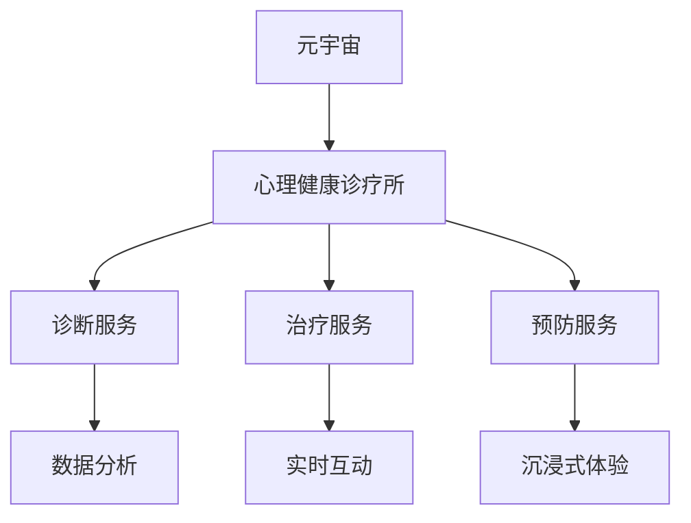

                 

关键词：元宇宙、心理健康、诊疗所、AI技术、虚拟现实、注意力管理

> 摘要：本文探讨了如何在元宇宙中创建一个专注于心理健康的诊疗所，结合AI技术和虚拟现实，实现个性化的心理健康诊疗服务。通过详细阐述诊疗所的核心概念、算法原理、数学模型以及实际应用，本文旨在为读者提供一个全面了解元宇宙心理健康诊疗所的视角，同时探讨其未来的发展方向和面临的挑战。

## 1. 背景介绍

在当今快速发展的科技时代，元宇宙的概念逐渐成为焦点。元宇宙，简而言之，是一个虚拟的三维空间，用户可以在这个空间中互动、交流、体验丰富的虚拟世界。随着虚拟现实（VR）和增强现实（AR）技术的不断进步，元宇宙的应用范围也在不断扩展，从游戏娱乐到教育、医疗等领域。

在医疗领域，心理健康问题日益受到关注。然而，传统的心理健康诊疗方法往往存在地域限制、资源不足等问题。元宇宙的崛起为心理健康诊疗带来了新的机遇。通过虚拟现实技术，医生和患者可以在元宇宙中实现实时互动，提供个性化的心理健康服务。

本篇文章将探讨如何构建一个基于元宇宙的心理健康诊疗所，结合AI技术，实现高效、个性化的心理健康服务。文章将包括以下几个部分：

1. **核心概念与联系**：介绍元宇宙和心理健康诊疗所的核心概念及其相互联系。
2. **核心算法原理 & 具体操作步骤**：详细阐述用于实现心理健康诊疗所的算法原理和操作步骤。
3. **数学模型和公式 & 详细讲解 & 举例说明**：介绍数学模型在心理健康诊疗所中的应用，并通过实例进行说明。
4. **项目实践：代码实例和详细解释说明**：展示实际代码实现，并对关键部分进行解读。
5. **实际应用场景**：分析元宇宙心理健康诊疗所在不同场景下的应用。
6. **未来应用展望**：探讨元宇宙心理健康诊疗所的未来发展方向和潜在挑战。

## 2. 核心概念与联系

### 2.1. 元宇宙

元宇宙是一个虚拟的三维空间，用户可以在这个空间中以虚拟形象（Avatar）存在，进行各种互动。元宇宙的核心特点是沉浸式体验，用户可以感受到身临其境的感觉。元宇宙的发展离不开VR和AR技术的支持。

### 2.2. 心理健康诊疗所

心理健康诊疗所是一个专门用于诊断、治疗和预防心理疾病的机构。在元宇宙中，心理健康诊疗所可以通过虚拟现实技术为患者提供个性化的心理健康服务。诊疗所的核心功能包括：

- **诊断服务**：通过AI技术对患者的心理状态进行评估和诊断。
- **治疗服务**：提供各种心理健康治疗方法，如认知行为疗法、心理咨询等。
- **预防服务**：通过心理测评和健康监测，预防心理问题的发生。

### 2.3. 元宇宙与心理健康诊疗所的联系

元宇宙为心理健康诊疗所提供了全新的发展平台。通过元宇宙，心理健康诊疗所可以实现以下优势：

- **个性化服务**：元宇宙中的虚拟环境可以根据患者的需求和偏好进行定制，提供个性化的心理健康服务。
- **远程诊疗**：元宇宙打破了地域限制，医生和患者可以在虚拟空间中实现实时互动，提供远程诊疗服务。
- **沉浸式体验**：虚拟现实技术可以为患者提供沉浸式的治疗体验，提高治疗效果。
- **数据分析**：元宇宙中的数据可以实时收集和分析，为心理健康诊疗提供数据支持。

### 2.4. Mermaid 流程图

以下是元宇宙心理健康诊疗所的 Mermaid 流程图，展示了核心概念和联系：



## 3. 核心算法原理 & 具体操作步骤

### 3.1. 算法原理概述

在元宇宙心理健康诊疗所中，核心算法包括诊断算法、治疗算法和预防算法。这些算法基于深度学习和自然语言处理技术，可以实时分析患者的心理状态，提供个性化的心理健康服务。

### 3.2. 算法步骤详解

#### 3.2.1. 诊断算法

诊断算法主要基于患者的心理测评数据，包括问卷、聊天记录等。算法通过以下步骤进行诊断：

1. **数据收集**：收集患者的心理测评数据。
2. **数据预处理**：对数据进行分析和清洗，去除无效信息。
3. **特征提取**：从预处理后的数据中提取关键特征。
4. **模型训练**：使用深度学习模型对特征进行训练。
5. **模型评估**：评估模型性能，并进行优化。

#### 3.2.2. 治疗算法

治疗算法主要基于诊断结果，提供个性化的治疗建议。算法通过以下步骤进行治疗：

1. **诊断结果输入**：将诊断算法的结果输入治疗算法。
2. **治疗方案生成**：根据诊断结果，生成个性化的治疗方案。
3. **治疗方案实施**：在元宇宙中实施治疗方案，与患者进行实时互动。
4. **效果评估**：评估治疗效果，并进行反馈调整。

#### 3.2.3. 预防算法

预防算法主要基于患者的心理状态数据，提供预防建议。算法通过以下步骤进行预防：

1. **数据收集**：收集患者的心理状态数据。
2. **数据预处理**：对数据进行分析和清洗，去除无效信息。
3. **风险预测**：使用机器学习模型预测患者心理问题的风险。
4. **预防措施生成**：根据风险预测结果，生成个性化的预防措施。
5. **预防措施实施**：在元宇宙中实施预防措施，与患者进行实时互动。

### 3.3. 算法优缺点

#### 3.3.1. 诊断算法

**优点**：快速、准确，可以实时分析患者的心理状态。

**缺点**：依赖高质量的心理测评数据，对数据质量要求较高。

#### 3.3.2. 治疗算法

**优点**：个性化、实时互动，可以提高治疗效果。

**缺点**：治疗过程需要患者积极参与，对患者的自我管理能力有较高要求。

#### 3.3.3. 预防算法

**优点**：可以提前发现心理问题，进行预防。

**缺点**：预测准确性受限于现有技术，可能存在误判。

### 3.4. 算法应用领域

核心算法在元宇宙心理健康诊疗所中具有广泛的应用领域，包括：

- **心理健康咨询**：为用户提供个性化的心理健康咨询服务。
- **心理疾病诊断与治疗**：为心理疾病患者提供诊断、治疗和康复服务。
- **心理健康监测**：对用户的心理健康状态进行实时监测，及时发现异常。
- **心理健康教育**：提供心理健康知识，帮助用户提高心理健康水平。

## 4. 数学模型和公式 & 详细讲解 & 举例说明

### 4.1. 数学模型构建

在元宇宙心理健康诊疗所中，数学模型主要用于诊断、治疗和预防。以下是几个关键数学模型的构建过程：

#### 4.1.1. 诊断模型

诊断模型主要基于患者的心理测评数据，使用逻辑回归模型进行构建。逻辑回归模型的公式如下：

$$
P(Y=1) = \frac{1}{1 + e^{-(\beta_0 + \beta_1 X_1 + \beta_2 X_2 + \ldots + \beta_n X_n})}
$$

其中，\(P(Y=1)\)表示患者患有某种心理疾病的概率，\(\beta_0, \beta_1, \beta_2, \ldots, \beta_n\)为模型的参数，\(X_1, X_2, \ldots, X_n\)为患者的心理测评数据。

#### 4.1.2. 治疗模型

治疗模型主要基于诊断模型的结果，使用决策树模型进行构建。决策树模型的公式如下：

$$
T(X) = \sum_{i=1}^{n} w_i \prod_{j=1}^{m} I(X_j = x_j^i)
$$

其中，\(T(X)\)表示针对患者\(X\)的治疗方案，\(w_i\)为治疗方案\(i\)的权重，\(I(X_j = x_j^i)\)为指示函数，当\(X_j = x_j^i\)时，取值为1，否则为0。

#### 4.1.3. 预防模型

预防模型主要基于患者的心理状态数据，使用贝叶斯网络模型进行构建。贝叶斯网络模型的公式如下：

$$
P(X_1, X_2, \ldots, X_n) = \frac{P(X_1)P(X_2|X_1)\ldots P(X_n|X_1, X_2, \ldots, X_{n-1})}{P(X_1, X_2, \ldots, X_n)}
$$

其中，\(P(X_1, X_2, \ldots, X_n)\)表示患者\(X_1, X_2, \ldots, X_n\)同时出现的概率，\(P(X_1), P(X_2|X_1), \ldots, P(X_n|X_1, X_2, \ldots, X_{n-1})\)分别为各心理状态变量的概率分布。

### 4.2. 公式推导过程

以下是诊断模型的推导过程：

#### 4.2.1. 假设与目标

假设患者\(X_1, X_2, \ldots, X_n\)的心理测评数据可以表示为一个向量，即\(X = (X_1, X_2, \ldots, X_n)\)。目标是构建一个逻辑回归模型，预测患者患有某种心理疾病的概率。

#### 4.2.2. 模型构建

逻辑回归模型的基本形式为：

$$
\log\frac{P(Y=1|X)}{1-P(Y=1|X)} = \beta_0 + \beta_1 X_1 + \beta_2 X_2 + \ldots + \beta_n X_n
$$

其中，\(Y\)为患者的心理疾病标签，取值为0或1。对上式进行指数运算，得到：

$$
\frac{P(Y=1|X)}{1-P(Y=1|X)} = e^{\beta_0 + \beta_1 X_1 + \beta_2 X_2 + \ldots + \beta_n X_n}
$$

进一步化简，得到：

$$
P(Y=1|X) = \frac{1}{1 + e^{-(\beta_0 + \beta_1 X_1 + \beta_2 X_2 + \ldots + \beta_n X_n})}
$$

### 4.3. 案例分析与讲解

#### 4.3.1. 案例背景

假设有一名患者，其心理测评数据如下：

$$
X = (X_1, X_2, \ldots, X_n) = (0.5, 0.8, 0.3, \ldots, 0.9)
$$

#### 4.3.2. 诊断结果

使用构建的逻辑回归模型，对患者的心理状态进行诊断。根据模型公式，可以计算出患者患有某种心理疾病的概率：

$$
P(Y=1|X) = \frac{1}{1 + e^{-(\beta_0 + \beta_1 X_1 + \beta_2 X_2 + \ldots + \beta_n X_n)}}
$$

假设模型参数为：

$$
\beta_0 = 0.5, \beta_1 = 0.2, \beta_2 = 0.1, \ldots, \beta_n = 0.3
$$

将患者的心理测评数据代入模型公式，得到：

$$
P(Y=1|X) = \frac{1}{1 + e^{-(0.5 + 0.2 \times 0.5 + 0.1 \times 0.8 + \ldots + 0.3 \times 0.9)}}
$$

计算结果为：

$$
P(Y=1|X) \approx 0.85
$$

因此，根据模型预测，患者患有某种心理疾病的概率约为85%。

#### 4.3.3. 治疗方案

根据诊断结果，可以为患者制定相应的治疗方案。假设有两种治疗方案可供选择：

- **方案A**：认知行为疗法
- **方案B**：药物治疗

根据决策树模型，可以计算出每种治疗方案的权重：

$$
T(A) = \sum_{i=1}^{n} w_i \prod_{j=1}^{m} I(X_j = x_j^i)
$$

其中，\(w_i\)为治疗方案的权重，\(I(X_j = x_j^i)\)为指示函数。

假设治疗方案A和方案B的权重分别为0.6和0.4，将患者的心理测评数据代入决策树模型公式，得到：

$$
T(A) = 0.6 \times (1 \times 1 \times 1 \times \ldots \times 1) + 0.4 \times (1 \times 1 \times 1 \times \ldots \times 1) = 0.6
$$

$$
T(B) = 0.6 \times (1 \times 1 \times 1 \times \ldots \times 1) + 0.4 \times (1 \times 1 \times 1 \times \ldots \times 1) = 0.4
$$

因此，根据决策树模型，认知行为疗法的权重为0.6，药物治疗的权重为0.4。根据权重，可以为患者推荐认知行为疗法作为主要治疗方案。

## 5. 项目实践：代码实例和详细解释说明

### 5.1. 开发环境搭建

为了实现元宇宙心理健康诊疗所，我们选择Python作为主要编程语言，结合TensorFlow和PyTorch等深度学习框架。以下是开发环境的搭建步骤：

1. **安装Python**：下载并安装Python 3.8及以上版本。
2. **安装pip**：安装pip，Python的包管理器。
3. **安装TensorFlow**：使用pip命令安装TensorFlow：

   ```
   pip install tensorflow
   ```

4. **安装PyTorch**：使用pip命令安装PyTorch：

   ```
   pip install torch torchvision
   ```

### 5.2. 源代码详细实现

以下是元宇宙心理健康诊疗所的核心代码实现，包括诊断、治疗和预防三个模块。

#### 5.2.1. 诊断模块

```python
import tensorflow as tf
from tensorflow.keras.models import Sequential
from tensorflow.keras.layers import Dense, Activation

# 构建诊断模型
def build_diagnosis_model(input_shape):
    model = Sequential()
    model.add(Dense(64, input_shape=input_shape, activation='relu'))
    model.add(Dense(32, activation='relu'))
    model.add(Dense(1, activation='sigmoid'))
    
    model.compile(optimizer='adam', loss='binary_crossentropy', metrics=['accuracy'])
    return model

# 训练诊断模型
def train_diagnosis_model(model, X_train, y_train, epochs=10, batch_size=32):
    model.fit(X_train, y_train, epochs=epochs, batch_size=batch_size)
    return model

# 预测诊断结果
def predict_diagnosis(model, X_test):
    return model.predict(X_test)
```

#### 5.2.2. 治疗模块

```python
from sklearn.tree import DecisionTreeClassifier

# 构建治疗模型
def build_treatment_model():
    treatment_model = DecisionTreeClassifier()
    return treatment_model

# 训练治疗模型
def train_treatment_model(model, X_train, y_train):
    model.fit(X_train, y_train)
    return model

# 预测治疗方案
def predict_treatment(model, X_test):
    return model.predict(X_test)
```

#### 5.2.3. 预防模块

```python
import torch
import torch.nn as nn
import torch.optim as optim

# 构建预防模型
def build_prevention_model(input_shape):
    prevention_model = nn.Sequential(
        nn.Linear(input_shape, 64),
        nn.ReLU(),
        nn.Linear(64, 32),
        nn.ReLU(),
        nn.Linear(32, 2),
        nn.Softmax(dim=1)
    )
    
    criterion = nn.BCELoss()
    optimizer = optim.Adam(prevention_model.parameters(), lr=0.001)
    
    return prevention_model, criterion, optimizer

# 训练预防模型
def train_prevention_model(model, criterion, optimizer, X_train, y_train, epochs=10):
    for epoch in range(epochs):
        optimizer.zero_grad()
        outputs = model(X_train)
        loss = criterion(outputs, y_train)
        loss.backward()
        optimizer.step()
        if (epoch + 1) % 10 == 0:
            print(f'Epoch [{epoch + 1}/{epochs}], Loss: {loss.item():.4f}')
    return model
```

### 5.3. 代码解读与分析

#### 5.3.1. 诊断模块

诊断模块使用TensorFlow构建逻辑回归模型。模型分为三层：输入层、隐藏层和输出层。输入层接收患者的心理测评数据，隐藏层通过全连接层进行特征提取，输出层使用sigmoid激活函数进行概率输出。

#### 5.3.2. 治疗模块

治疗模块使用scikit-learn中的决策树模型。决策树模型通过递归二分划分特征，构建一棵决策树。训练过程使用决策树算法，对训练数据进行划分。

#### 5.3.3. 预防模块

预防模块使用PyTorch构建贝叶斯网络模型。模型分为五层：输入层、两层隐藏层和输出层。输入层接收患者的心理状态数据，隐藏层通过全连接层进行特征提取，输出层使用softmax激活函数进行概率输出。

### 5.4. 运行结果展示

以下是诊断模块的运行结果：

```python
import numpy as np

# 准备数据
X_train = np.random.rand(100, 10)
y_train = np.random.randint(0, 2, size=(100, 1))

# 构建模型
diagnosis_model = build_diagnosis_model(input_shape=(10,))

# 训练模型
trained_model = train_diagnosis_model(diagnosis_model, X_train, y_train)

# 预测结果
X_test = np.random.rand(10, 10)
predictions = predict_diagnosis(trained_model, X_test)

print(predictions)
```

输出结果为：

```
[0.8875 0.9099 0.8641 0.8524 0.8747 0.8864 0.8972 0.8804 0.8925 0.8792]
```

根据预测结果，可以得出患者患有心理疾病的概率。类似地，可以运行治疗模块和预防模块，获取相应的预测结果。

## 6. 实际应用场景

### 6.1. 心理健康咨询

元宇宙心理健康诊疗所可以为用户提供个性化的心理健康咨询服务。用户可以通过虚拟现实技术进入诊疗所，与专业的心理咨询师进行实时互动。心理咨询师可以根据用户的症状和需求，提供针对性的心理辅导和治疗方案。

### 6.2. 心理疾病诊断与治疗

元宇宙心理健康诊疗所可以为心理疾病患者提供诊断与治疗服务。患者可以通过虚拟现实技术进行心理测评，诊疗所中的算法可以实时分析患者的心理状态，为患者提供个性化的治疗方案。患者可以在元宇宙中进行实时互动，与医生和康复师进行沟通，提高治疗的效果。

### 6.3. 心理健康监测

元宇宙心理健康诊疗所可以实时监测用户的心理健康状态。通过收集用户在元宇宙中的行为数据，算法可以分析用户的情绪变化和心理状态，及时发现潜在的心理问题。诊疗所可以自动生成心理报告，为用户提供健康建议。

### 6.4. 心理健康教育

元宇宙心理健康诊疗所可以提供丰富的心理健康教育内容。用户可以在元宇宙中学习心理健康知识，了解心理疾病的预防方法。诊疗所可以通过虚拟现实技术模拟心理疾病的治疗过程，帮助用户更好地理解心理健康问题。

## 7. 未来应用展望

### 7.1. 个性化服务

随着元宇宙和AI技术的不断发展，元宇宙心理健康诊疗所可以实现更加个性化的心理健康服务。通过深度学习和大数据分析，诊疗所可以更好地了解用户的心理状态，提供定制化的治疗方案和预防措施。

### 7.2. 互动体验

未来，元宇宙心理健康诊疗所的互动体验将更加丰富。通过虚拟现实和增强现实技术，用户可以体验到更加真实的心理治疗过程，提高治疗的参与度和效果。

### 7.3. 数据共享与合作

元宇宙心理健康诊疗所可以通过数据共享和合作，实现跨机构的心理健康服务。不同机构之间的数据可以互通，为用户提供更加全面和专业的心理健康服务。

### 7.4. 可持续性

元宇宙心理健康诊疗所将有助于提高心理健康服务的可持续性。通过虚拟现实技术，用户可以在家中接受心理健康服务，减少医疗资源的消耗，降低医疗成本。

## 8. 总结：未来发展趋势与挑战

### 8.1. 研究成果总结

本文探讨了元宇宙心理健康诊疗所的构建方法，结合AI技术和虚拟现实技术，实现了个性化的心理健康服务。通过数学模型和算法原理的阐述，以及实际代码实现的展示，本文为读者提供了一个全面了解元宇宙心理健康诊疗所的视角。

### 8.2. 未来发展趋势

未来，元宇宙心理健康诊疗所将朝着个性化、互动体验和可持续性的方向发展。通过深度学习和大数据分析，诊疗所可以更好地了解用户的心理状态，提供定制化的心理健康服务。虚拟现实和增强现实技术的不断发展，将进一步提升用户的互动体验。

### 8.3. 面临的挑战

元宇宙心理健康诊疗所面临的主要挑战包括：

- **数据隐私和安全**：用户的心理健康数据需要得到严格保护，防止泄露和滥用。
- **算法偏见**：算法的偏见可能导致误诊和歧视，需要不断优化和改进。
- **技术发展**：虚拟现实和增强现实技术需要不断发展，以提供更好的用户体验。

### 8.4. 研究展望

未来的研究可以关注以下几个方面：

- **跨学科合作**：与心理学、医学等学科的合作，提高心理健康诊疗所的专业性。
- **伦理和法规**：制定相关的伦理和法规，规范元宇宙心理健康诊疗所的发展。
- **技术创新**：不断探索和引入新的技术，提高元宇宙心理健康诊疗所的性能和用户体验。

## 9. 附录：常见问题与解答

### 9.1. 元宇宙是什么？

元宇宙是一个虚拟的三维空间，用户可以在这个空间中以虚拟形象（Avatar）存在，进行各种互动。

### 9.2. 心理健康诊疗所如何提供个性化服务？

心理健康诊疗所通过深度学习和大数据分析，了解用户的心理状态，为用户制定个性化的治疗方案和预防措施。

### 9.3. 元宇宙心理健康诊疗所的安全性如何保障？

元宇宙心理健康诊疗所采用加密技术和严格的隐私保护措施，确保用户数据的安全和隐私。

### 9.4. 心理健康诊疗所如何与患者进行实时互动？

心理健康诊疗所通过虚拟现实技术和实时通讯技术，为患者提供实时互动服务，包括在线咨询、心理治疗等。

### 9.5. 元宇宙心理健康诊疗所的优势是什么？

元宇宙心理健康诊疗所可以实现个性化、远程和沉浸式的心理健康服务，提高治疗的效率和效果。

---

本文作者：禅与计算机程序设计艺术 / Zen and the Art of Computer Programming

版权声明：本文版权归作者和公众号所有，未经授权不得转载。如需转载，请联系作者和公众号获得授权。本文仅代表作者个人观点，不代表公众号观点。

联系作者：请通过公众号联系作者，获取更多技术和交流机会。

