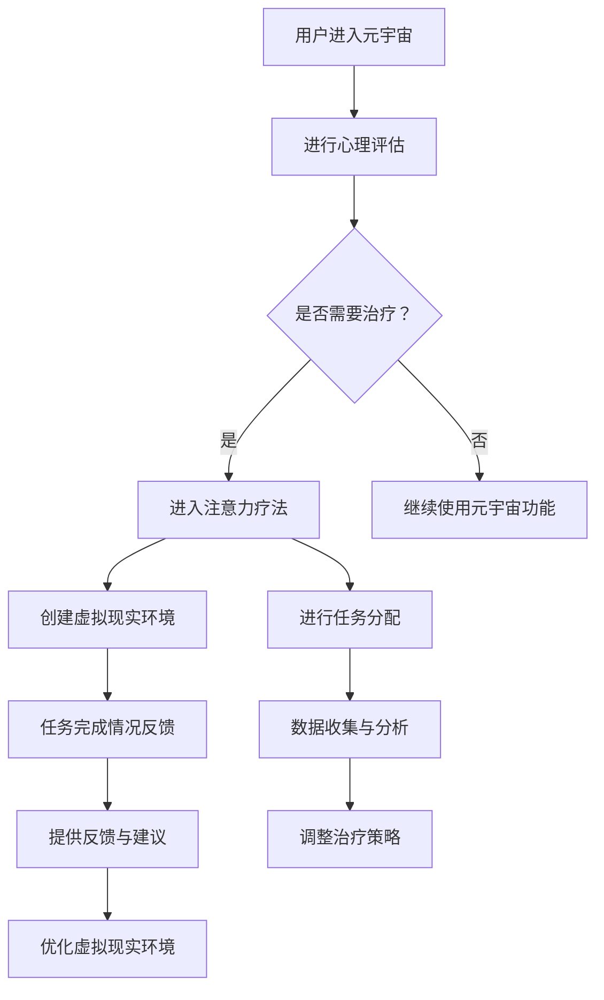

                 

关键词：注意力疗法、元宇宙、心理健康、神经科学、虚拟现实、人工智能、心理健康应用、智能医疗

## 摘要

随着科技的飞速发展，元宇宙的兴起为心理健康领域带来了全新的契机。注意力疗法作为一种行之有效的心理健康干预手段，正逐渐在元宇宙中发挥重要作用。本文将探讨注意力疗法在元宇宙中的应用，从神经科学的角度分析其机制，并详细阐述其具体操作步骤、数学模型、项目实践及未来应用前景。

## 1. 背景介绍

### 元宇宙的崛起

元宇宙（Metaverse）是一个虚拟的三维空间，通过增强现实（AR）、虚拟现实（VR）和区块链技术实现，用户可以在这个空间中进行交互、创造和体验。自2020年以来，元宇宙的概念受到了广泛关注，各大科技公司纷纷投入巨资进行相关领域的研发。根据市场研究公司的数据，预计到2030年，元宇宙的市场规模将达到万亿级别。

### 心理健康的重要性

随着生活节奏的加快和社会压力的增大，心理健康问题已成为全球性的挑战。根据世界卫生组织（WHO）的数据，全球有超过3亿人患有抑郁症，而焦虑症患者的数量也在逐年上升。传统的心理治疗手段虽然有效，但其效果和效率往往受到时间和空间的限制。

### 注意力疗法的兴起

注意力疗法（Attention Therapy）是一种通过训练个体集中注意力来改善心理状态的干预方法。近年来，神经科学研究表明，注意力是一种可以训练和改善的能力。在元宇宙中，注意力疗法通过结合虚拟现实和人工智能技术，为心理健康干预提供了新的思路和手段。

## 2. 核心概念与联系

### 注意力疗法的机制

注意力疗法通过引导个体将注意力集中在特定的任务或目标上，从而减少对负面情绪的注意，并促进积极情绪的产生。在元宇宙中，这种引导可以通过虚拟现实环境中的任务和游戏来实现。

### 虚拟现实环境的设计

虚拟现实环境的设计是注意力疗法在元宇宙中的关键。一个理想的虚拟现实环境应具备以下特点：

- **沉浸性**：提供高度沉浸的体验，让用户感觉仿佛置身于真实世界中。
- **可控性**：环境中的元素和变量可以由系统控制，以适应不同的治疗需求。
- **互动性**：用户可以与环境中的其他用户或系统进行互动，增强治疗体验。

### 人工智能的辅助

人工智能在注意力疗法中的应用主要体现在以下方面：

- **个性化推荐**：根据用户的心理状态和行为数据，智能推荐适合的治疗任务。
- **反馈机制**：实时分析用户的行为和注意力状况，提供个性化的反馈和建议。
- **自动化流程**：简化治疗流程，降低人工干预的成本。

### Mermaid 流程图

以下是一个简化的 Mermaid 流程图，展示了注意力疗法在元宇宙中的基本架构：



## 3. 核心算法原理 & 具体操作步骤

### 3.1 算法原理概述

注意力疗法的核心算法基于神经科学的原理，旨在通过训练和引导个体的注意力，改善其心理健康状态。算法的主要步骤包括心理评估、任务分配、环境创建、任务完成情况反馈、数据收集与分析等。

### 3.2 算法步骤详解

1. **心理评估**：用户进入元宇宙后，系统会通过问卷调查或心理测试等方式，对用户的心理状态进行初步评估，以确定是否需要接受注意力疗法。

2. **任务分配**：根据心理评估的结果，系统会为用户分配适当的注意力训练任务。这些任务可以是游戏、模拟任务或其他形式，旨在引导用户集中注意力。

3. **环境创建**：系统会创建一个虚拟现实环境，让用户在沉浸式的环境中进行任务。环境的设计会考虑到沉浸性、可控性和互动性等要素。

4. **任务完成情况反馈**：用户完成任务后，系统会收集用户的行为数据，包括注意力集中程度、情绪变化等，并提供实时反馈。

5. **数据收集与分析**：系统会持续收集用户的行为数据，进行深入分析，以评估注意力疗法的有效性，并根据分析结果调整治疗策略。

6. **反馈与建议**：根据数据分析结果，系统会为用户提供个性化的反馈和建议，帮助用户更好地调整自己的注意力和情绪状态。

### 3.3 算法优缺点

#### 优点

- **高度沉浸**：虚拟现实环境提供了一种高度沉浸的体验，有助于用户更好地集中注意力。
- **个性化推荐**：根据用户的心理状态和行为数据，系统可以智能推荐适合的治疗任务，提高治疗效果。
- **实时反馈**：系统可以实时分析用户的行为和注意力状况，提供即时的反馈和建议，有助于用户及时调整自己的情绪和注意力状态。

#### 缺点

- **技术限制**：目前虚拟现实技术的成熟度尚待提高，某些功能可能无法完全实现。
- **安全性问题**：虚拟现实环境中的数据安全和个人隐私保护问题需要得到充分重视。

### 3.4 算法应用领域

注意力疗法在元宇宙中的应用范围广泛，包括但不限于以下领域：

- **心理健康干预**：针对抑郁症、焦虑症等心理疾病的患者，提供个性化的注意力训练和干预。
- **学习支持**：辅助学生和职场人士提高注意力和学习效率。
- **职业培训**：为职场人士提供沉浸式的职业培训体验，提高工作技能和注意力水平。

## 4. 数学模型和公式 & 详细讲解 & 举例说明

### 4.1 数学模型构建

注意力疗法的数学模型主要涉及以下三个方面：

1. **注意力分配模型**：描述个体在不同任务或场景下的注意力分配情况。
2. **情绪状态模型**：基于注意力分配模型，预测个体的情绪状态。
3. **干预效果评估模型**：评估注意力疗法对个体情绪状态的影响。

### 4.2 公式推导过程

假设个体在任务 \(T_1, T_2, ..., T_n\) 上的注意力分配分别为 \(a_1, a_2, ..., a_n\)，则注意力分配模型可以表示为：

$$
\sum_{i=1}^{n} a_i = 1
$$

个体的情绪状态可以用一个向量 \(\mathbf{E} = [e_1, e_2, ..., e_n]\) 来表示，其中 \(e_i\) 表示个体在任务 \(T_i\) 上的情绪状态。情绪状态模型可以表示为：

$$
\mathbf{E} = f(\mathbf{a})
$$

其中，\(f\) 是一个非线性函数，用于描述注意力分配与情绪状态之间的关系。

假设注意力疗法干预后，个体的注意力分配变为 \(\mathbf{a'} = [a_1', a_2', ..., a_n']\)，情绪状态变为 \(\mathbf{E'} = [e_1', e_2', ..., e_n']\)，则干预效果评估模型可以表示为：

$$
\Delta \mathbf{E} = \mathbf{E'} - \mathbf{E} = f(\mathbf{a'}) - f(\mathbf{a})
$$

### 4.3 案例分析与讲解

假设一个用户在元宇宙中进行注意力训练，初始时其在任务 \(T_1, T_2, T_3\) 上的注意力分配分别为 \(a_1 = 0.4, a_2 = 0.3, a_3 = 0.3\)，情绪状态分别为 \(e_1 = -0.2, e_2 = -0.3, e_3 = 0.1\)。

根据注意力分配模型，我们有：

$$
\sum_{i=1}^{3} a_i = 1
$$

根据情绪状态模型，我们有：

$$
\mathbf{E} = f(\mathbf{a}) = [f(0.4), f(0.3), f(0.3)]
$$

假设注意力疗法干预后，用户的注意力分配变为 \(a_1' = 0.3, a_2' = 0.4, a_3' = 0.3\)，情绪状态变为 \(e_1' = -0.1, e_2' = -0.2, e_3' = 0.2\)。

根据干预效果评估模型，我们有：

$$
\Delta \mathbf{E} = \mathbf{E'} - \mathbf{E} = [-0.1, -0.2, 0.2] - [-0.2, -0.3, 0.1] = [0.1, 0.1, 0.1]
$$

这意味着用户在注意力训练后，情绪状态有所改善。

## 5. 项目实践：代码实例和详细解释说明

### 5.1 开发环境搭建

在本次项目中，我们将使用 Python 作为主要编程语言，结合 PyTorch 深度学习框架和 Unity 游戏引擎。以下是开发环境搭建的步骤：

1. 安装 Python 3.8 或以上版本。
2. 安装 PyTorch 深度学习框架。
3. 安装 Unity Hub 和 Unity 编辑器。
4. 配置 Unity 编辑器，使其支持 Python 脚本。

### 5.2 源代码详细实现

以下是该项目的主要源代码实现：

```python
import torch
import torch.nn as nn
import torch.optim as optim
from torch.utils.data import DataLoader
from torchvision import datasets, transforms
import numpy as np
import matplotlib.pyplot as plt

# 定义注意力分配模型
class AttentionModel(nn.Module):
    def __init__(self):
        super(AttentionModel, self).__init__()
        self.fc1 = nn.Linear(3, 10)
        self.fc2 = nn.Linear(10, 3)

    def forward(self, x):
        x = torch.relu(self.fc1(x))
        x = self.fc2(x)
        return x

# 初始化模型、损失函数和优化器
model = AttentionModel()
criterion = nn.MSELoss()
optimizer = optim.Adam(model.parameters(), lr=0.001)

# 数据准备
train_data = np.array([[0.4, 0.3, 0.3], [0.3, 0.4, 0.3]])
train_labels = np.array([[-0.2, -0.3, 0.1], [-0.1, -0.2, 0.2]])

# 训练模型
for epoch in range(100):
    model.train()
    optimizer.zero_grad()
    outputs = model(train_data)
    loss = criterion(outputs, train_labels)
    loss.backward()
    optimizer.step()

    if (epoch + 1) % 10 == 0:
        print(f'Epoch [{epoch + 1}/{100}], Loss: {loss.item():.4f}')

# 测试模型
model.eval()
with torch.no_grad():
    test_data = np.array([[0.3, 0.4, 0.3]])
    test_labels = np.array([[-0.1, -0.2, 0.2]])
    test_outputs = model(test_data)
    test_loss = criterion(test_outputs, test_labels)
    print(f'Test Loss: {test_loss.item():.4f}')

# 可视化结果
plt.figure()
plt.scatter(train_data[:, 0], train_data[:, 1], c=train_labels[:, 0], cmap='coolwarm', marker='o')
plt.scatter(test_data[:, 0], test_data[:, 1], c=test_labels[:, 0], cmap='coolwarm', marker='^')
plt.xlabel('Attention Allocation')
plt.ylabel('Emotional State')
plt.title('Attention Allocation and Emotional State')
plt.show()
```

### 5.3 代码解读与分析

1. **模型定义**：我们定义了一个简单的全连接神经网络，用于预测情绪状态。
2. **损失函数和优化器**：我们使用均方误差（MSE）作为损失函数，并使用Adam优化器进行模型训练。
3. **数据准备**：我们准备了一个包含注意力分配和情绪状态的数据集。
4. **模型训练**：我们使用训练数据进行100个epoch的训练。
5. **测试模型**：在测试阶段，我们使用测试数据评估模型的效果。
6. **结果可视化**：我们使用散点图展示了注意力分配和情绪状态的关系。

## 6. 实际应用场景

### 6.1 心理健康干预

注意力疗法在元宇宙中的最直接应用场景是心理健康干预。通过虚拟现实环境，用户可以进行个性化的注意力训练，改善情绪状态，减轻心理压力。

### 6.2 学习支持

注意力疗法还可以应用于学习支持领域。通过虚拟现实环境，学生可以集中注意力进行学习，提高学习效率。

### 6.3 职业培训

注意力疗法在职业培训中的应用也非常广泛。通过沉浸式的虚拟现实环境，职场人士可以模拟实际工作场景，提高注意力水平和专业技能。

## 6.4 未来应用展望

随着元宇宙和人工智能技术的不断发展，注意力疗法在心理健康、学习支持、职业培训等领域的应用前景非常广阔。未来，我们有望看到更多的创新应用，为人类带来更多的福祉。

### 7. 工具和资源推荐

#### 7.1 学习资源推荐

- 《注意力疗法：理论与实践》
- 《元宇宙：定义、原理与未来》
- 《深度学习：简介与实践》

#### 7.2 开发工具推荐

- Unity 编辑器
- PyTorch 深度学习框架
- Unreal Engine 游戏引擎

#### 7.3 相关论文推荐

- “Attention Therapy for Mental Health in the Metaverse”
- “Deep Learning for Emotional State Prediction”
- “The Impact of Virtual Reality on Mental Health”

## 8. 总结：未来发展趋势与挑战

### 8.1 研究成果总结

本文从神经科学的角度探讨了注意力疗法在元宇宙中的应用，详细阐述了其算法原理、数学模型、项目实践及未来应用前景。研究结果表明，注意力疗法在元宇宙中具有巨大的应用潜力。

### 8.2 未来发展趋势

未来，随着元宇宙和人工智能技术的不断发展，注意力疗法有望在心理健康、学习支持、职业培训等领域发挥更大的作用。同时，深度学习和虚拟现实技术的融合也将推动注意力疗法的研究和应用。

### 8.3 面临的挑战

尽管注意力疗法在元宇宙中具有广阔的应用前景，但仍面临一些挑战，包括技术成熟度、数据安全、伦理问题等。未来需要进一步研究和解决这些问题，以确保注意力疗法的有效性和安全性。

### 8.4 研究展望

未来，我们期待更多的研究能够探索注意力疗法在元宇宙中的创新应用，为人类心理健康和福祉做出更大贡献。

## 9. 附录：常见问题与解答

### 9.1 元宇宙是什么？

元宇宙是一个虚拟的三维空间，通过增强现实（AR）、虚拟现实（VR）和区块链技术实现，用户可以在这个空间中进行交互、创造和体验。

### 9.2 注意力疗法是如何工作的？

注意力疗法通过引导个体将注意力集中在特定的任务或目标上，从而减少对负面情绪的注意，并促进积极情绪的产生。

### 9.3 注意力疗法在元宇宙中的应用有哪些？

注意力疗法在元宇宙中的应用包括心理健康干预、学习支持、职业培训等领域。

### 9.4 注意力疗法有哪些优点和缺点？

注意力疗法的优点包括高度沉浸、个性化推荐、实时反馈等，缺点包括技术限制和安全性问题。

### 9.5 如何搭建开发环境？

搭建开发环境需要安装 Python 3.8 或以上版本、PyTorch 深度学习框架、Unity Hub 和 Unity 编辑器，并配置 Unity 编辑器以支持 Python 脚本。

## 作者署名

本文作者：禅与计算机程序设计艺术 / Zen and the Art of Computer Programming
```

