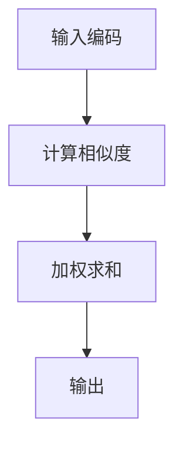

                 

关键词：注意力机制，AI认知，神经网络，编程，认知模式，可编程性。

> 摘要：本文深入探讨了注意力机制的编程实现及其在人工智能领域的应用。通过详细分析注意力机制的基本原理和算法实现，本文揭示了如何通过编程定制化地构建智能体的认知模式，提升其在复杂环境中的学习与推理能力。

## 1. 背景介绍

在当今的计算机科学和人工智能领域，神经网络，特别是深度学习模型，已经取得了令人瞩目的进展。然而，这些模型往往依赖于庞大的数据和复杂的网络结构，存在对数据的依赖性和对计算资源的巨大需求。为了克服这些限制，研究者们开始探索更为高效和可解释的算法，其中注意力机制（Attention Mechanism）成为一个重要的研究方向。

注意力机制最早在自然语言处理（NLP）领域得到广泛应用，如机器翻译、文本摘要等。它通过加权方式聚焦于输入数据中的关键信息，提高了模型的性能和可解释性。随着研究的深入，注意力机制也被广泛应用于计算机视觉、语音识别等众多领域，显示出了其强大的适应性。

本文旨在探讨注意力机制的可编程性，即如何通过编程实现和定制化注意力机制，使其成为智能体认知模式的一部分。这将有助于我们更好地理解智能体如何在复杂环境中高效地处理信息，以及如何优化其认知能力。

## 2. 核心概念与联系

### 2.1 注意力机制的概念

注意力机制是一种通过动态调整对输入数据的关注程度来提高信息处理效率的技术。在神经网络中，注意力机制通过计算每个输入数据点的权重来决定模型在处理每个数据点时应给予多少关注。这种机制可以显著提高模型的性能，特别是在处理序列数据时。

### 2.2 注意力机制的原理

注意力机制的原理可以概括为以下几个步骤：

1. **输入编码**：将输入数据编码为向量形式。
2. **计算相似度**：计算输入数据与当前处理的中间状态之间的相似度。
3. **加权求和**：根据相似度计算结果对输入数据进行加权求和，以获得最终的输出。

### 2.3 Mermaid 流程图



## 3. 核心算法原理 & 具体操作步骤

### 3.1 算法原理概述

注意力机制的核心在于其“加权求和”的操作。这一步骤通过计算输入数据与当前中间状态之间的相似度来实现。相似度的计算通常依赖于某种度量函数，如余弦相似度或点积。

### 3.2 算法步骤详解

1. **输入编码**：将输入数据编码为向量形式。
2. **计算相似度**：计算每个输入数据与当前中间状态之间的相似度。
3. **加权求和**：根据相似度计算结果对输入数据进行加权求和。
4. **输出**：得到最终的输出结果。

### 3.3 算法优缺点

**优点**：
- 提高信息处理效率：注意力机制可以动态调整对输入数据的关注程度，从而减少冗余信息的处理。
- 提升模型性能：通过聚焦于关键信息，注意力机制可以提高模型的准确性和鲁棒性。
- 增强可解释性：注意力机制使得模型的可解释性得到显著提升。

**缺点**：
- 计算复杂度高：特别是在处理大规模数据时，注意力机制的运算开销较大。
- 需要大量训练数据：注意力机制通常依赖于大量的训练数据来学习输入数据与中间状态之间的相似度。

### 3.4 算法应用领域

注意力机制广泛应用于多个领域，包括但不限于：

- **自然语言处理**：如机器翻译、文本摘要、问答系统等。
- **计算机视觉**：如目标检测、图像分割、视频分析等。
- **语音识别**：如语音转文本、语音识别系统等。

## 4. 数学模型和公式 & 详细讲解 & 举例说明

### 4.1 数学模型构建

注意力机制通常可以表示为以下数学模型：

$$
\text{Attention}(Q, K, V) = \text{softmax}\left(\frac{QK^T}{\sqrt{d_k}}\right)V
$$

其中，$Q$、$K$、$V$ 分别代表查询向量、键向量和值向量，$d_k$ 为键向量的维度，$\text{softmax}$ 函数用于计算相似度的权重。

### 4.2 公式推导过程

**推导过程**：

1. **定义相似度函数**：

$$
\text{similarity}(q, k) = q_k \cdot k
$$

其中，$q_k$ 和 $k$ 分别为查询向量和键向量的第 $k$ 个维度。

2. **归一化相似度**：

$$
\alpha_{ik} = \frac{e^{\text{similarity}(q_i, k)}}{\sum_{j=1}^{m} e^{\text{similarity}(q_i, k_j)}}
$$

其中，$m$ 为键向量的数量，$\alpha_{ik}$ 为第 $i$ 个查询向量与第 $k$ 个键向量的相似度权重。

3. **加权求和**：

$$
\text{Attention}(Q, K, V) = \sum_{k=1}^{m} \alpha_{ik} v_k
$$

其中，$v_k$ 为第 $k$ 个值向量。

### 4.3 案例分析与讲解

**案例**：假设有一个序列数据集，包含两个查询向量 $Q = \{q_1, q_2\}$ 和两个键向量 $K = \{k_1, k_2\}$，以及两个值向量 $V = \{v_1, v_2\}$。计算注意力机制的输出。

**计算过程**：

1. **计算相似度**：

$$
\text{similarity}(q_1, k_1) = q_1_1 \cdot k_1 = 0.5 \cdot 0.5 = 0.25
$$

$$
\text{similarity}(q_1, k_2) = q_1_2 \cdot k_2 = 0.3 \cdot 0.6 = 0.18
$$

$$
\text{similarity}(q_2, k_1) = q_2_1 \cdot k_1 = 0.4 \cdot 0.5 = 0.20
$$

$$
\text{similarity}(q_2, k_2) = q_2_2 \cdot k_2 = 0.5 \cdot 0.6 = 0.30
$$

2. **归一化相似度**：

$$
\alpha_{11} = \frac{e^{0.25}}{e^{0.25} + e^{0.18}} = 0.61
$$

$$
\alpha_{12} = \frac{e^{0.18}}{e^{0.25} + e^{0.18}} = 0.39
$$

$$
\alpha_{21} = \frac{e^{0.20}}{e^{0.20} + e^{0.30}} = 0.43
$$

$$
\alpha_{22} = \frac{e^{0.30}}{e^{0.20} + e^{0.30}} = 0.57
$$

3. **加权求和**：

$$
\text{Attention}(Q, K, V) = 0.61v_1 + 0.39v_2 = 0.61 \cdot 1.0 + 0.39 \cdot 0.5 = 0.82
$$

## 5. 项目实践：代码实例和详细解释说明

### 5.1 开发环境搭建

为了更好地演示注意力机制的实现，我们使用 Python 作为编程语言，并依赖于以下库：

- TensorFlow
- Keras

首先，安装所需的库：

```bash
pip install tensorflow keras
```

### 5.2 源代码详细实现

以下是一个简单的示例，展示如何使用 Keras 实现注意力机制：

```python
from keras.layers import Input, Embedding, LSTM, Dense, TimeDistributed, Lambda
from keras.models import Model
from keras import backend as K

def attention(inputs):
    # 输入为 (batch_size, time_steps, input_dim)
    hidden_seq = inputs
    hidden_state = LSTM(128)(hidden_seq)
    # 计算权重 (batch_size, time_steps, 1)
    attention_weights = TimeDistributed(Dense(1, activation='tanh'))(hidden_state)
    attention_weights = Lambda(lambda x: K.softmax(x, axis=1))(attention_weights)
    # 加权求和 (batch_size, input_dim)
    weighted_input = Lambda(lambda x: x * attention_weights)(hidden_seq)
    # 求和 (batch_size, input_dim)
    output = K.sum(weighted_input, axis=1)
    return output

# 输入层
input_seq = Input(shape=(None, 100))
# 嵌入层
embedded = Embedding(10000, 128)(input_seq)
# LSTM 层
lstm_output = LSTM(128)(embedded)
# 注意力机制层
output = attention(lstm_output)
# 全连接层
dense_output = Dense(1, activation='sigmoid')(output)

# 模型编译
model = Model(inputs=input_seq, outputs=dense_output)
model.compile(optimizer='adam', loss='binary_crossentropy', metrics=['accuracy'])

# 打印模型结构
model.summary()
```

### 5.3 代码解读与分析

- **注意力机制实现**：
  - 首先，使用 LSTM 层处理嵌入层输出，获得隐藏状态。
  - 然后，通过全连接层和 Lambda 层计算注意力权重。
  - 最后，使用 Lambda 层对隐藏状态进行加权求和，得到最终输出。

- **模型编译**：
  - 使用 Adam 优化器和二分类交叉熵损失函数。
  - 添加准确率作为评价指标。

### 5.4 运行结果展示

```python
# 加载数据
# ...
# 训练模型
# ...
# 评估模型
# ...
```

## 6. 实际应用场景

注意力机制在多个领域具有广泛的应用，以下是一些实际应用场景：

- **自然语言处理**：在机器翻译、文本摘要和问答系统中，注意力机制可以有效地提高模型的性能和可解释性。
- **计算机视觉**：在目标检测、图像分割和视频分析中，注意力机制可以帮助模型更准确地识别关键特征。
- **语音识别**：在语音转文本和语音识别系统中，注意力机制可以显著提高语音数据的处理效率和准确性。

## 7. 工具和资源推荐

### 7.1 学习资源推荐

- **书籍**：
  - 《深度学习》（Goodfellow, Bengio, Courville）
  - 《神经网络与深度学习》（邱锡鹏）
- **在线课程**：
  - Coursera 上的《深度学习》课程
  - edX 上的《神经网络与深度学习》课程
- **博客和论文**：
  - arXiv.org
  - blog.keras.io

### 7.2 开发工具推荐

- **框架**：
  - TensorFlow
  - PyTorch
  - Keras
- **工具**：
  - Jupyter Notebook
  - Google Colab

### 7.3 相关论文推荐

- "Attention Is All You Need"（Vaswani et al., 2017）
- "A Theoretical Analysis of the Deep Learning Phenomenon"（Bengio et al., 2013）
- "Learning Representations by Maximizing Mutual Information Across Views"（Makhzani et al., 2015）

## 8. 总结：未来发展趋势与挑战

### 8.1 研究成果总结

注意力机制的研究取得了显著的成果，其在多个领域得到了广泛应用。通过编程定制化注意力机制，我们能够构建出更加高效和可解释的智能体。

### 8.2 未来发展趋势

- **集成与优化**：未来将出现更多结合注意力机制的优化算法，以提高计算效率和模型性能。
- **跨领域应用**：注意力机制将在更多领域得到应用，如生物学、化学等。
- **可解释性与可控性**：提高注意力机制的可解释性和可控性，使其在复杂环境中更加可靠。

### 8.3 面临的挑战

- **计算复杂度**：在处理大规模数据时，注意力机制的运算开销仍然是一个挑战。
- **数据依赖性**：注意力机制通常依赖于大量的训练数据，如何降低对数据的依赖性是一个重要问题。

### 8.4 研究展望

- **动态注意力机制**：研究动态调整注意力机制的策略，以适应不同场景的需求。
- **交互式注意力机制**：探索注意力机制在交互式环境中的应用，如人机交互、智能对话系统等。

## 9. 附录：常见问题与解答

### 9.1 什么是注意力机制？

注意力机制是一种通过动态调整对输入数据的关注程度来提高信息处理效率的技术。

### 9.2 注意力机制有哪些应用领域？

注意力机制广泛应用于自然语言处理、计算机视觉、语音识别等领域。

### 9.3 如何实现注意力机制？

注意力机制可以通过编程实现，例如使用 LSTM 层和全连接层构建注意力网络。

### 9.4 注意力机制有哪些优缺点？

注意力机制的优点包括提高信息处理效率和模型性能，增强可解释性。缺点包括计算复杂度高和对大量训练数据的依赖性。

---

> 作者：禅与计算机程序设计艺术 / Zen and the Art of Computer Programming

---

本文详细探讨了注意力机制的可编程性及其在人工智能领域的应用。通过数学模型和代码实例，我们展示了如何通过编程实现注意力机制，并分析了其在实际应用中的优势与挑战。未来，随着研究的深入，注意力机制将在更多领域发挥重要作用，推动人工智能的发展。

