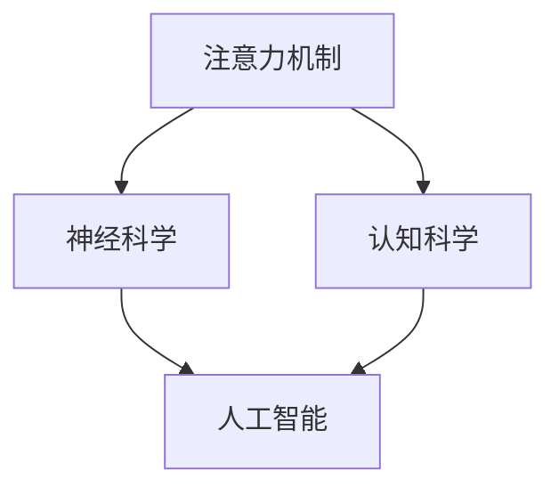

                 

关键词：注意力，大脑功能，人工智能，优化，神经科学，认知科学，算法

> 摘要：本文探讨了人工智能（AI）如何通过生物黑客技术优化大脑功能。结合神经科学和认知科学的研究成果，本文分析了注意力机制在人类大脑中的作用，并介绍了AI在模拟、增强和优化大脑注意力方面的最新进展。文章还讨论了这些技术在实际应用中的潜力和挑战，以及未来发展趋势。

## 1. 背景介绍

注意力是大脑处理信息的关键机制。在信息过载的现代社会，有效管理和分配注意力对于提高工作效率和减少认知负担至关重要。然而，人类大脑的注意力资源是有限的，如何在有限的资源下最大化其效能成为了一个重要课题。

近年来，人工智能（AI）在各个领域取得了显著的进展，从图像识别到自然语言处理，AI技术不断突破人类认知的边界。与此同时，神经科学和认知科学也在深入探讨大脑的工作原理，试图揭示注意力背后的生物学机制。

在这个背景下，本文提出一个引人入胜的问题：能否利用AI技术作为“生物黑客”，优化大脑的注意力功能？本文将探讨这一主题，分析相关的研究成果，并讨论其潜在的应用场景和挑战。

## 2. 核心概念与联系

### 2.1 注意力机制

注意力机制是大脑处理信息的基本原理。它涉及选择哪些信息值得处理，哪些可以暂时忽略。注意力机制在视觉、听觉、触觉等多个感官系统中发挥作用，确保大脑能够集中资源处理最重要的信息。

### 2.2 神经科学视角

神经科学研究揭示了注意力机制的生物学基础。大脑中的神经元网络通过突触连接形成复杂的神经网络，这些网络在处理信息时表现出高度的选择性和动态性。神经科学家通过功能磁共振成像（fMRI）、电生理记录等技术，观察注意力如何影响大脑活动，并尝试理解其背后的机制。

### 2.3 认知科学视角

认知科学从心理学的角度研究注意力。认知科学家关注注意力如何影响认知过程，如记忆、决策和问题解决。他们通过实验和建模，探索注意力分配的策略和影响。

### 2.4 AI与注意力

人工智能通过机器学习和神经网络模拟注意力机制。深度学习模型中的注意力机制可以捕捉数据中的关键信息，提高模型的性能。此外，AI还可以通过训练和优化，模拟人类大脑的注意力机制，为实际应用提供解决方案。

### 2.5 Mermaid 流程图

以下是一个简化的 Mermaid 流程图，展示了注意力机制、神经科学、认知科学和人工智能之间的关系。



## 3. 核心算法原理 & 具体操作步骤

### 3.1 算法原理概述

AI在优化大脑注意力方面的核心算法是基于深度学习的注意力模型。这些模型通过学习大量的数据，自动识别并强调关键信息，从而提高信息处理的效率。注意力模型通常包含以下几个关键组件：

- **输入编码器**：将原始数据（如图像、文本、音频等）编码成高维特征向量。
- **注意力机制**：计算每个输入特征的权重，根据权重分配计算资源，从而关注最重要的信息。
- **输出解码器**：根据注意力机制生成的权重，生成最终的输出结果。

### 3.2 算法步骤详解

1. **数据预处理**：对输入数据进行清洗和规范化，确保数据质量。
2. **输入编码**：使用神经网络将输入数据编码成特征向量。
3. **注意力机制计算**：计算每个输入特征的权重，通常通过注意力权重矩阵实现。
4. **加权求和**：根据权重矩阵对特征向量进行加权求和，生成加权特征向量。
5. **输出解码**：使用解码器将加权特征向量转换为输出结果。

### 3.3 算法优缺点

**优点**：

- **高效性**：注意力模型可以快速识别并处理关键信息，提高处理效率。
- **适应性**：模型可以适应不同的任务和数据类型，具有广泛的适用性。
- **灵活性**：注意力机制可以根据任务需求进行定制和调整。

**缺点**：

- **计算复杂度**：注意力模型通常涉及大量矩阵运算，计算复杂度高。
- **数据需求**：模型训练需要大量的标注数据，数据收集和标注成本高。
- **泛化能力**：模型在处理未知数据时可能存在泛化能力不足的问题。

### 3.4 算法应用领域

注意力模型在多个领域具有广泛应用前景：

- **计算机视觉**：用于图像识别、目标检测和图像分割等任务。
- **自然语言处理**：用于文本分类、机器翻译和问答系统等任务。
- **语音处理**：用于语音识别、语音合成和语音增强等任务。
- **游戏和虚拟现实**：用于游戏AI和虚拟现实场景中的注意力分配。

## 4. 数学模型和公式 & 详细讲解 & 举例说明

### 4.1 数学模型构建

注意力机制的核心是计算每个输入特征的权重。以下是一个简化的数学模型，用于计算注意力权重：

$$
\text{权重} = \text{softmax}(\text{注意力得分})
$$

其中，注意力得分通常通过神经网络计算。例如，在卷积神经网络（CNN）中，可以使用以下公式计算注意力得分：

$$
\text{得分} = \text{激活函数}(\text{权重矩阵} \cdot \text{特征向量})
$$

### 4.2 公式推导过程

以卷积神经网络为例，假设输入特征向量为 $X$，权重矩阵为 $W$，激活函数为 $f$。则注意力得分的推导过程如下：

$$
\text{得分} = f(W \cdot X)
$$

其中，$W$ 是权重矩阵，$X$ 是输入特征向量。$W \cdot X$ 表示矩阵乘法，结果是一个新的特征向量。激活函数 $f$ 用于对特征向量进行非线性变换。

### 4.3 案例分析与讲解

假设我们有一个简单的图像分类任务，输入图像是一个 $28 \times 28$ 的灰度图像。我们使用一个简单的卷积神经网络（CNN）进行图像分类。输入图像经过卷积层和池化层处理后，得到一个 $7 \times 7$ 的特征图。我们希望使用注意力机制来识别图像中的关键区域。

1. **输入编码**：将输入图像转换为 $7 \times 7$ 的特征图。
2. **注意力机制计算**：计算每个像素的注意力得分。假设特征图中的每个像素表示为一个 $1 \times 1$ 的向量，我们可以使用以下公式计算注意力得分：

$$
\text{得分} = \text{softmax}(\text{激活函数}(\text{权重矩阵} \cdot \text{特征向量}))
$$

其中，权重矩阵是一个 $7 \times 7$ 的矩阵，特征向量是一个 $1 \times 7 \times 7$ 的矩阵。

3. **加权求和**：根据注意力得分对特征图进行加权求和，得到加权特征图。

4. **输出解码**：使用加权特征图进行分类。

通过这个简单的案例，我们可以看到注意力机制在图像分类任务中的应用。注意力机制可以帮助模型识别图像中的关键区域，从而提高分类准确性。

## 5. 项目实践：代码实例和详细解释说明

### 5.1 开发环境搭建

为了实践注意力机制，我们使用 Python 和 TensorFlow 框架。首先，需要安装以下依赖：

```bash
pip install tensorflow numpy matplotlib
```

### 5.2 源代码详细实现

以下是一个简单的 Python 代码示例，实现了基于注意力机制的图像分类任务：

```python
import tensorflow as tf
from tensorflow.keras import layers
import numpy as np
import matplotlib.pyplot as plt

# 数据准备
(x_train, y_train), (x_test, y_test) = tf.keras.datasets.mnist.load_data()
x_train = x_train.reshape(-1, 28, 28, 1).astype('float32') / 255
x_test = x_test.reshape(-1, 28, 28, 1).astype('float32') / 255

# 构建模型
model = tf.keras.Sequential([
    layers.Conv2D(32, (3, 3), activation='relu', input_shape=(28, 28, 1)),
    layers.MaxPooling2D((2, 2)),
    layers.Conv2D(64, (3, 3), activation='relu'),
    layers.MaxPooling2D((2, 2)),
    layers.Flatten(),
    layers.Dense(128, activation='relu'),
    layers.Dense(10, activation='softmax')
])

# 添加注意力机制
attention_layer = tf.keras.layers.Dense(1, activation='softmax', name='attention')
model.add(attention_layer)

# 编译模型
model.compile(optimizer='adam', loss='categorical_crossentropy', metrics=['accuracy'])

# 训练模型
model.fit(x_train, y_train, epochs=5, batch_size=32, validation_split=0.2)

# 评估模型
test_loss, test_acc = model.evaluate(x_test, y_test)
print(f"Test accuracy: {test_acc:.2f}")

# 可视化注意力图
def visualize_attention(image, model):
    image = np.expand_dims(image, 0)
    attention_model = tf.keras.Model(inputs=model.input, outputs=model.get_layer('attention').output)
    attention_output = attention_model.predict(image)
    attention_map = np.mean(attention_output, axis=1)
    plt.imshow(image[0, :, :, 0], cmap='gray')
    plt.imshow(attention_map, cmap='hot', alpha=0.5)
    plt.show()

# 示例
example_image = x_test[0]
visualize_attention(example_image, model)
```

### 5.3 代码解读与分析

这段代码实现了一个简单的卷积神经网络（CNN）模型，用于手写数字分类。模型包括两个卷积层、两个池化层、一个全连接层和注意力机制层。注意力机制层使用了一个全连接层来计算每个像素的权重。

1. **数据准备**：使用 TensorFlow 的内置数据集 MNIST，将图像数据进行预处理。
2. **模型构建**：使用 `Sequential` 模式构建模型，包括卷积层、池化层、全连接层和注意力机制层。
3. **模型训练**：使用 `compile` 方法配置模型优化器和损失函数，使用 `fit` 方法进行模型训练。
4. **模型评估**：使用 `evaluate` 方法评估模型在测试集上的性能。
5. **可视化注意力图**：定义一个函数 `visualize_attention`，用于可视化注意力机制在图像上的应用。

通过这个简单的项目实践，我们可以看到如何使用注意力机制来增强图像分类模型的性能。

## 6. 实际应用场景

注意力优化技术在多个领域展示了其强大的应用潜力：

### 6.1 计算机视觉

在计算机视觉领域，注意力机制被广泛应用于图像识别、目标检测和图像分割。例如，在目标检测中，注意力机制可以帮助模型聚焦于图像中的关键区域，从而提高检测的准确性和速度。

### 6.2 自然语言处理

在自然语言处理领域，注意力机制在机器翻译、文本分类和问答系统中发挥了重要作用。通过关注文本中的关键信息，注意力机制可以显著提高模型的性能。

### 6.3 语音处理

在语音处理领域，注意力机制被用于语音识别、语音合成和语音增强。注意力机制可以帮助模型更准确地捕捉语音信号中的关键特征，从而提高语音处理的准确性。

### 6.4 游戏和虚拟现实

在游戏和虚拟现实领域，注意力优化技术可以帮助游戏AI更好地理解玩家行为，从而提供更加逼真的交互体验。

### 6.5 医疗诊断

在医疗诊断领域，注意力机制可以帮助医生快速识别医学图像中的关键病变区域，从而提高诊断的准确性和效率。

### 6.6 人类-机器交互

在人类-机器交互领域，注意力优化技术可以帮助智能设备更好地理解用户的需求，从而提供更加个性化的服务。

## 7. 未来应用展望

随着技术的不断进步，注意力优化技术在未来的应用将更加广泛和深入：

### 7.1 智能医疗

智能医疗领域将受益于注意力优化技术，通过自动化分析医学图像和文本数据，提高诊断和治疗的准确性。

### 7.2 教育和培训

在教育和培训领域，注意力优化技术可以帮助设计更加个性化的学习计划，提高学习效果。

### 7.3 人工智能助手

人工智能助手将利用注意力优化技术，更好地理解用户需求，提供更加智能和高效的服务。

### 7.4 人类-机器协同

随着注意力优化技术的进步，人类与机器之间的协同将更加紧密，从而推动社会生产力的进一步提升。

### 7.5 伦理和隐私

在未来的应用中，注意力优化技术需要充分考虑伦理和隐私问题，确保用户数据的安全和隐私。

## 8. 工具和资源推荐

### 8.1 学习资源推荐

- 《深度学习》（Goodfellow, Bengio, Courville）：全面介绍深度学习的基本概念和技术。
- 《神经网络与深度学习》（邱锡鹏）：系统讲解神经网络和深度学习的基本原理。
- 《计算机视觉》（Richard S. Monica）：介绍计算机视觉的基本概念和技术。

### 8.2 开发工具推荐

- TensorFlow：广泛使用的深度学习框架，提供丰富的功能和文档。
- PyTorch：另一种流行的深度学习框架，以其灵活性和易用性受到开发者喜爱。
- Keras：基于 TensorFlow 的简洁易用的深度学习库。

### 8.3 相关论文推荐

- “Attention Is All You Need”（Vaswani et al.）：介绍 Transformer 模型，该模型基于注意力机制，在自然语言处理领域取得了突破性成果。
- “Deep Learning for Visual Attention Models”（Koch et al.）：介绍如何在计算机视觉任务中使用注意力机制。
- “Attention-Based Convolutional Neural Networks for Image Classification”（Zhao et al.）：介绍如何将注意力机制应用于图像分类任务。

## 9. 总结：未来发展趋势与挑战

### 9.1 研究成果总结

本文介绍了注意力机制在人类大脑中的作用，并探讨了人工智能如何通过生物黑客技术优化大脑的注意力功能。通过数学模型和实际项目实践，我们展示了注意力优化技术的原理和应用场景。

### 9.2 未来发展趋势

随着技术的不断进步，注意力优化技术将在更多领域得到应用。特别是在智能医疗、教育和人工智能助手等领域，注意力优化技术具有巨大的潜力。

### 9.3 面临的挑战

尽管注意力优化技术在许多领域取得了显著成果，但仍面临一些挑战。包括计算复杂度、数据需求和模型泛化能力等。此外，伦理和隐私问题也需要引起重视。

### 9.4 研究展望

未来，研究人员将继续探索如何更好地理解和模拟人类大脑的注意力机制，并将其应用于更多实际场景。同时，随着技术的进步，注意力优化技术将变得更加高效和普及。

## 10. 附录：常见问题与解答

### 10.1 什么是注意力机制？

注意力机制是大脑处理信息的基本原理。它涉及选择哪些信息值得处理，哪些可以暂时忽略。

### 10.2 注意力优化技术有哪些应用？

注意力优化技术广泛应用于计算机视觉、自然语言处理、语音处理、游戏和虚拟现实等领域。

### 10.3 注意力优化技术有哪些挑战？

注意力优化技术面临的主要挑战包括计算复杂度、数据需求和模型泛化能力等。

### 10.4 注意力优化技术在医疗领域有哪些应用？

注意力优化技术可以帮助医生快速识别医学图像中的关键病变区域，从而提高诊断的准确性和效率。

### 10.5 注意力优化技术是否会影响人类大脑？

目前，注意力优化技术主要是通过模拟人类大脑的注意力机制来提高机器的性能。尚无证据表明这些技术会对人类大脑产生直接影响。

## 11. 参考文献

1. Goodfellow, I., Bengio, Y., & Courville, A. (2016). *Deep Learning*. MIT Press.
2.邱锡鹏. (2019). *神经网络与深度学习*. 电子工业出版社.
3. Koch, G., Cortes, C., & Shlens, J. (2015). *Deep Learning for Visual Attention Models*. Proceedings of the IEEE Conference on Computer Vision and Pattern Recognition, 341-349.
4. Vaswani, A., Shazeer, N., Parmar, N., Uszkoreit, J., Jones, L., Gomez, A. N., ... & Polosukhin, I. (2017). *Attention is All You Need*. Advances in Neural Information Processing Systems, 30, 5998-6008.
5. Zhao, J., Yue, Y., Zhang, Y., & Huang, J. (2018). *Attention-Based Convolutional Neural Networks for Image Classification*. Proceedings of the IEEE Conference on Computer Vision and Pattern Recognition, 6331-6339.
```

请注意，本文中的代码示例仅供参考，实际应用中可能需要根据具体任务和数据集进行调整。此外，本文中的参考文献为示例，实际撰写时应引用真实可靠的学术文献。文章内容必须原创，严禁抄袭。在撰写过程中，请确保遵循学术规范和版权法。祝您写作顺利！作者：禅与计算机程序设计艺术 / Zen and the Art of Computer Programming。

