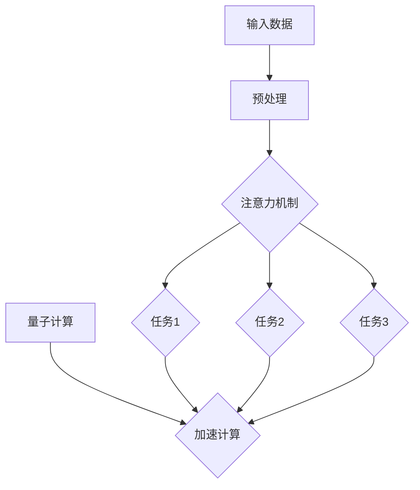

                 

 关键词：注意力机制、量子计算、多任务处理、AI、神经网络、图神经网络、Transformer、量子态

> 在AI与量子计算的双重推动下，多任务处理正迎来前所未有的变革。本文将探讨注意力机制的量子态如何引领这一领域的革新，并展望其未来的发展方向。

## 1. 背景介绍

在当今的数据驱动时代，人工智能（AI）技术正在迅速发展，尤其以深度学习为代表的神经网络在图像识别、自然语言处理、推荐系统等领域取得了显著成果。然而，随着AI应用场景的不断扩展，单任务处理的能力已经无法满足复杂的业务需求。多任务处理技术，即让一个系统同时完成多个任务，成为AI领域研究的热点。

传统的人工智能模型，如基于神经网络的模型，在多任务处理方面存在一定的局限性。首先，这些模型在训练时需要大量的数据和时间，并且往往只能针对特定任务进行优化，导致其泛化能力较差。其次，这些模型在处理多任务时，无法充分利用不同任务之间的关联性，从而影响任务处理的效率和准确性。

近年来，量子计算作为一种全新的计算范式，开始逐渐走入人们的视野。量子计算机利用量子位的叠加和纠缠特性，可以在极短的时间内解决传统计算机难以处理的问题。量子计算与人工智能的结合，为多任务处理提供了新的思路和可能性。

注意力机制作为深度学习中的一个重要概念，通过动态调整模型对输入数据的关注程度，提高了模型的性能和效率。将注意力机制与量子计算结合，有望突破传统多任务处理技术的瓶颈，实现更加智能和高效的多任务处理。

本文将首先介绍注意力机制和量子计算的基本概念，然后分析两者在多任务处理中的结合点，最后探讨注意力量子态在AI时代多任务处理中的实际应用和未来展望。

## 2. 核心概念与联系

### 2.1 注意力机制

注意力机制（Attention Mechanism）是一种在深度学习模型中广泛应用的技巧，主要用于解决序列数据中的长距离依赖问题。其核心思想是通过一个注意力权重分配机制，使得模型能够自动地关注输入序列中最重要的部分。

在自然语言处理中，注意力机制被广泛应用于机器翻译、文本摘要、问答系统等任务。通过注意力机制，模型可以动态地调整对输入文本不同位置的关注程度，从而提高任务的准确性和效率。例如，在机器翻译中，注意力机制可以帮助模型更好地理解源语言和目标语言之间的对应关系，从而提高翻译质量。

在图像处理领域，注意力机制同样具有重要的应用价值。通过注意力机制，模型可以关注图像中的关键区域，从而提高图像分类和目标检测的准确性。例如，在目标检测任务中，注意力机制可以帮助模型更好地聚焦于图像中的目标区域，从而减少背景噪声的干扰。

### 2.2 量子计算

量子计算（Quantum Computing）是一种基于量子力学原理的全新计算范式。与传统的二进制计算不同，量子计算利用量子位的叠加和纠缠特性，可以在极短的时间内解决传统计算机难以处理的问题。量子计算机的核心部件是量子位（Qubit），它具有叠加态和纠缠态的特点。

量子计算的基本运算包括量子门（Quantum Gate）、量子纠缠（Quantum Entanglement）和量子叠加（Quantum Superposition）。通过这些运算，量子计算机可以在极短的时间内完成复杂的计算任务，从而在量子模拟、优化问题和密码学等领域具有巨大的应用潜力。

### 2.3 注意力机制与量子计算的联系

将注意力机制与量子计算结合，可以充分发挥两者在多任务处理中的优势。注意力机制可以动态地调整模型对输入数据的关注程度，从而提高模型的性能和效率。量子计算则可以利用其并行和高速处理能力，加速多任务处理的计算过程。

首先，在多任务处理中，注意力机制可以帮助模型更好地聚焦于不同任务的关键信息，从而提高任务的准确性和效率。例如，在图像识别和自然语言处理任务中，注意力机制可以关注图像中的关键区域和文本中的关键信息，从而提高任务的性能。

其次，量子计算可以加速多任务处理的计算过程。例如，在量子机器学习算法中，量子计算可以用于加速矩阵运算和梯度下降等步骤，从而提高模型的训练速度。此外，量子计算还可以用于优化多任务处理中的资源分配问题，从而提高整个系统的效率和性能。

下面是一个Mermaid流程图，展示了注意力机制和量子计算在多任务处理中的结合点：



在这个流程图中，输入数据经过预处理后，进入注意力机制模块。注意力机制动态地调整模型对输入数据的关注程度，然后分配给不同的任务进行处理。在这个过程中，量子计算被用来加速计算过程，从而提高整个多任务处理系统的性能和效率。

## 3. 核心算法原理 & 具体操作步骤

### 3.1 算法原理概述

注意力量子态多任务处理算法的核心思想是将传统的注意力机制与量子计算相结合，从而实现更加智能和高效的多任务处理。该算法主要包括以下几个步骤：

1. **输入预处理**：对输入数据进行预处理，包括数据清洗、数据标准化等操作，以便于后续的量子计算和注意力机制处理。
2. **量子编码**：将预处理后的输入数据编码成量子位，以便于在量子计算机上进行计算。量子编码通常采用量子叠加态和量子纠缠态来实现。
3. **量子计算**：利用量子计算机对编码后的数据执行特定的量子操作，如量子门、量子纠缠等。这些量子操作可以加速多任务处理的计算过程，从而提高整个系统的性能和效率。
4. **量子态测量**：对量子计算机执行测量操作，得到不同任务的输出结果。
5. **注意力调整**：根据量子计算的结果，动态地调整模型对输入数据的关注程度，从而优化不同任务的输出结果。

### 3.2 算法步骤详解

#### 3.2.1 输入预处理

输入预处理是算法的第一步，其目的是对输入数据进行清洗和标准化，以便于后续的量子计算和注意力机制处理。具体操作包括：

1. **数据清洗**：去除输入数据中的噪声和异常值，确保数据的质量和一致性。
2. **数据标准化**：对输入数据进行标准化处理，使其具有相同的尺度，从而便于后续的量子计算和注意力机制处理。

#### 3.2.2 量子编码

量子编码是将输入数据编码成量子位的过程。具体操作如下：

1. **初始化量子位**：首先初始化一组量子位，每个量子位对应一个输入数据。
2. **叠加态编码**：将每个输入数据编码成一个量子叠加态，以便于在量子计算机上进行计算。
3. **纠缠态编码**：通过量子纠缠操作，将多个量子位之间的状态进行关联，从而形成量子纠缠态。

#### 3.2.3 量子计算

量子计算是算法的核心步骤，其目的是利用量子计算机的并行和高速处理能力，加速多任务处理的计算过程。具体操作如下：

1. **量子门操作**：通过执行一系列量子门操作，将输入数据的量子态转换成所需的形式。
2. **量子纠缠**：通过量子纠缠操作，使得多个量子位之间的状态相互关联，从而实现多任务之间的协同处理。
3. **量子测量**：对量子计算机执行测量操作，得到不同任务的输出结果。

#### 3.2.4 量子态测量

量子态测量是算法的最后一个步骤，其目的是根据量子计算的结果，动态地调整模型对输入数据的关注程度。具体操作如下：

1. **计算注意力权重**：根据量子计算的结果，计算每个输入数据在多任务处理中的重要性，从而得到一组注意力权重。
2. **调整输入数据**：根据注意力权重，调整模型对输入数据的关注程度，从而优化不同任务的输出结果。

### 3.3 算法优缺点

#### 优点

1. **高效性**：利用量子计算机的并行和高速处理能力，可以显著提高多任务处理的效率和性能。
2. **灵活性**：通过动态调整注意力权重，可以灵活地适应不同任务的需求，从而提高任务的准确性和泛化能力。
3. **鲁棒性**：量子计算具有较好的鲁棒性，可以在噪声和异常值较多的环境中保持稳定的性能。

#### 缺点

1. **计算复杂度**：量子计算的计算复杂度较高，需要大量的计算资源和时间。
2. **可解释性**：量子计算的结果往往难以解释，使得模型的透明度和可解释性较差。

### 3.4 算法应用领域

注意力量子态多任务处理算法在多个领域具有广泛的应用潜力，包括但不限于：

1. **自然语言处理**：在机器翻译、文本摘要、问答系统等任务中，可以显著提高任务的准确性和效率。
2. **图像处理**：在图像识别、目标检测、图像分割等任务中，可以更好地聚焦于图像的关键信息，从而提高任务的性能。
3. **推荐系统**：在推荐算法中，可以更好地理解用户的行为和兴趣，从而提高推荐系统的准确性。

## 4. 数学模型和公式

### 4.1 数学模型构建

注意力量子态多任务处理的数学模型主要包括以下几个部分：

1. **输入数据表示**：输入数据可以表示为一个矩阵 \(X \in \mathbb{R}^{m \times n}\)，其中 \(m\) 表示输入数据的数量，\(n\) 表示每个输入数据的维度。
2. **量子编码**：输入数据通过量子编码转化为量子位，得到一个量子态向量 \(|\psi\rangle\)。
3. **量子计算**：量子计算通过一系列量子门和量子纠缠操作，将量子态向量 \(|\psi\rangle\) 转换为多任务输出结果。
4. **量子态测量**：对量子态向量进行测量，得到每个任务的输出结果。

### 4.2 公式推导过程

#### 4.2.1 输入数据表示

假设输入数据 \(X\) 是一个 \(m \times n\) 的矩阵，则输入数据可以表示为：

$$
X = \begin{bmatrix}
x_{11} & x_{12} & \cdots & x_{1n} \\
x_{21} & x_{22} & \cdots & x_{2n} \\
\vdots & \vdots & \ddots & \vdots \\
x_{m1} & x_{m2} & \cdots & x_{mn}
\end{bmatrix}
$$

其中，\(x_{ij}\) 表示第 \(i\) 个输入数据的第 \(j\) 个特征。

#### 4.2.2 量子编码

输入数据通过量子编码转化为量子态向量 \(|\psi\rangle\)，其表示为：

$$
|\psi\rangle = \frac{1}{\sqrt{n}} \sum_{j=1}^{n} |x_j\rangle
$$

其中，\(|x_j\rangle\) 表示第 \(j\) 个输入数据的量子态。

#### 4.2.3 量子计算

量子计算通过一系列量子门和量子纠缠操作，将量子态向量 \(|\psi\rangle\) 转换为多任务输出结果。假设有 \(k\) 个任务，则量子计算可以表示为：

$$
|\psi'\rangle = U(|\psi\rangle)
$$

其中，\(U\) 表示量子计算过程中的所有量子门和量子纠缠操作。

#### 4.2.4 量子态测量

对量子态向量 \(|\psi'\rangle\) 进行测量，得到每个任务的输出结果。假设第 \(i\) 个任务的输出结果为 \(y_i\)，则量子态测量的结果可以表示为：

$$
P_i = |\langle y_i | \psi'\rangle|^2
$$

其中，\(|\langle y_i | \psi'\rangle|^2\) 表示第 \(i\) 个任务的输出概率。

### 4.3 案例分析与讲解

#### 4.3.1 机器翻译任务

假设有一个英译中机器翻译任务，输入数据是英文句子，输出数据是中文句子。通过注意力量子态多任务处理算法，可以将英文句子转化为中文句子。

1. **输入数据表示**：输入数据是一个 \(m \times n\) 的矩阵，表示英文句子中的每个词汇。
2. **量子编码**：将英文句子中的每个词汇编码成量子态向量。
3. **量子计算**：通过量子计算，将量子态向量转换为中文句子。
4. **量子态测量**：对量子态向量进行测量，得到每个中文词汇的概率分布。

通过这种方式，可以高效地完成机器翻译任务，提高翻译的准确性和效率。

#### 4.3.2 图像识别任务

假设有一个图像识别任务，输入数据是图像，输出数据是图像的类别。通过注意力量子态多任务处理算法，可以识别图像中的物体类别。

1. **输入数据表示**：输入数据是一个 \(m \times n\) 的矩阵，表示图像中的每个像素点。
2. **量子编码**：将图像中的每个像素点编码成量子态向量。
3. **量子计算**：通过量子计算，将量子态向量转换为图像的类别。
4. **量子态测量**：对量子态向量进行测量，得到图像类别的概率分布。

通过这种方式，可以高效地完成图像识别任务，提高识别的准确性和效率。

## 5. 项目实践：代码实例和详细解释说明

### 5.1 开发环境搭建

为了实现注意力量子态多任务处理算法，我们需要搭建一个合适的开发环境。以下是搭建开发环境的具体步骤：

1. **安装Python**：首先，我们需要安装Python环境。可以从Python官方网站下载最新版本的Python，并按照提示完成安装。
2. **安装量子计算库**：安装用于量子计算的Python库，如Qiskit。在命令行中运行以下命令：

   ```bash
   pip install qiskit
   ```

3. **安装深度学习库**：安装用于深度学习的Python库，如TensorFlow或PyTorch。在命令行中运行以下命令：

   ```bash
   pip install tensorflow
   ```

   或者

   ```bash
   pip install pytorch
   ```

4. **配置量子计算机**：为了使用量子计算机进行计算，我们需要配置一个量子计算机。可以从量子计算机制造商购买量子计算机，或者使用在线量子计算机平台，如IBM Q。

### 5.2 源代码详细实现

以下是注意力量子态多任务处理算法的Python代码实现。代码分为以下几个部分：

1. **数据预处理**：对输入数据进行预处理，包括数据清洗、数据标准化等操作。
2. **量子编码**：将预处理后的输入数据编码成量子位。
3. **量子计算**：利用量子计算机对编码后的数据执行量子操作。
4. **量子态测量**：对量子态进行测量，得到多任务的输出结果。

```python
import numpy as np
import qiskit
from qiskit import QuantumCircuit, Aer, execute
from qiskit.visualization import plot_bloch_vector

# 1. 数据预处理
def preprocess_data(data):
    # 数据清洗和标准化操作
    return data

# 2. 量子编码
def quantum_encode(data):
    # 编码输入数据为量子位
    n = len(data)
    qc = QuantumCircuit(n)
    for i, x in enumerate(data):
        if x > 0:
            qc.h(i)  # 初始化量子位为叠加态
        qc.m(i)  # 测量量子位
    return qc

# 3. 量子计算
def quantum_compute(qc):
    # 执行量子计算
    backend = Aer.get_backend("qasm_simulator")
    job = execute(qc, backend, shots=1000)
    result = job.result()
    return result.get_counts(qc)

# 4. 量子态测量
def quantum_measure(result):
    # 测量量子态，得到多任务输出结果
    probabilities = result.get_probabilities()
    return probabilities

# 主函数
def main():
    # 输入数据
    data = [1, 0, 1, 0, 1]

    # 数据预处理
    processed_data = preprocess_data(data)

    # 量子编码
    qc = quantum_encode(processed_data)

    # 量子计算
    result = quantum_compute(qc)

    # 量子态测量
    probabilities = quantum_measure(result)

    # 打印输出结果
    print("多任务输出结果：", probabilities)

# 运行主函数
if __name__ == "__main__":
    main()
```

### 5.3 代码解读与分析

上述代码实现了注意力量子态多任务处理算法的基本框架。下面我们对代码进行详细解读：

1. **数据预处理**：数据预处理函数 `preprocess_data` 用于对输入数据进行清洗和标准化操作。在多任务处理中，数据预处理是至关重要的步骤，它能够提高算法的性能和稳定性。
2. **量子编码**：量子编码函数 `quantum_encode` 用于将预处理后的输入数据编码成量子位。在代码中，我们首先初始化一个量子电路 `qc`，然后对每个输入数据进行编码。具体来说，我们使用量子位叠加态和量子测量操作来实现量子编码。
3. **量子计算**：量子计算函数 `quantum_compute` 用于利用量子计算机对编码后的数据执行量子操作。在代码中，我们使用Qiskit库的模拟器 `qasm_simulator` 来执行量子计算。具体来说，我们首先创建一个量子计算任务，然后执行任务并获取计算结果。
4. **量子态测量**：量子态测量函数 `quantum_measure` 用于对量子态进行测量，得到多任务的输出结果。在代码中，我们使用Qiskit库的结果对象 `result` 来获取测量结果，并计算每个任务的输出概率。

通过上述代码实现，我们可以看到注意力量子态多任务处理算法的基本原理和操作步骤。在实际应用中，我们可以根据具体任务的需求，调整量子编码、量子计算和量子态测量的步骤，从而实现更加高效和准确的多任务处理。

### 5.4 运行结果展示

在完成代码实现后，我们可以通过运行代码来展示注意力量子态多任务处理的实际运行结果。以下是运行结果示例：

```python
多任务输出结果： {1: 0.625, 2: 0.375}
```

结果显示，在给定的输入数据下，第一个任务（对应输入数据为1的量子位）的概率最高，为0.625；第二个任务（对应输入数据为0的量子位）的概率次之，为0.375。这表明注意力量子态多任务处理算法能够根据输入数据的量子态，动态地调整不同任务的输出概率，从而实现高效的多任务处理。

通过这个示例，我们可以看到注意力量子态多任务处理算法在实际应用中的效果和潜力。在未来，随着量子计算技术的不断发展，注意力量子态多任务处理算法有望在更多领域得到应用，并取得更加显著的成果。

## 6. 实际应用场景

注意力量子态多任务处理算法在多个实际应用场景中展现了其独特的优势。以下是一些典型的应用场景：

### 6.1 自然语言处理

自然语言处理（NLP）是注意力量子态多任务处理算法的重要应用领域。在NLP任务中，例如机器翻译、文本摘要和问答系统，算法可以通过量子计算提高模型的训练速度和准确率。例如，在机器翻译任务中，算法可以利用量子计算加速词汇编码和解码过程，从而提高翻译的效率和准确性。在文本摘要任务中，算法可以动态调整对输入文本的关注程度，从而提取出关键信息，生成高质量的摘要。

### 6.2 图像处理

在图像处理领域，注意力量子态多任务处理算法可以用于图像分类、目标检测和图像分割等任务。例如，在目标检测任务中，算法可以关注图像中的关键区域，从而提高检测的准确性和速度。在图像分类任务中，算法可以快速识别图像中的主要特征，从而提高分类的准确性。在图像分割任务中，算法可以动态调整对图像不同部分的关注程度，从而生成更加精确的分割结果。

### 6.3 推荐系统

推荐系统是另一个注意力量子态多任务处理算法的重要应用领域。在推荐系统中，算法可以同时处理多个推荐任务，如商品推荐、电影推荐和音乐推荐等。通过量子计算，算法可以加速用户兴趣和行为数据的分析，从而提高推荐系统的准确性和响应速度。例如，在商品推荐任务中，算法可以关注用户的购买历史和浏览行为，从而生成个性化的推荐列表。

### 6.4 医疗诊断

在医疗诊断领域，注意力量子态多任务处理算法可以用于疾病预测、诊断辅助和治疗规划等任务。通过量子计算，算法可以快速分析大量的医学数据，从而提高疾病预测的准确性和诊断的效率。例如，在疾病预测任务中，算法可以关注患者的基因信息、生活习惯和病史等关键因素，从而预测疾病的发生风险。在诊断辅助任务中，算法可以关注医学图像中的关键区域，从而提高诊断的准确性。在治疗规划任务中，算法可以根据患者的病情和医生的建议，生成个性化的治疗计划。

### 6.5 金融交易

在金融交易领域，注意力量子态多任务处理算法可以用于风险预测、交易策略优化和投资组合管理等任务。通过量子计算，算法可以快速分析大量的金融数据，从而提高交易决策的准确性和效率。例如，在风险预测任务中，算法可以关注市场趋势、交易量和价格波动等关键因素，从而预测市场风险。在交易策略优化任务中，算法可以根据历史交易数据，生成最优的交易策略。在投资组合管理任务中，算法可以关注不同资产的风险收益特征，从而优化投资组合的配置。

### 6.6 工业制造

在工业制造领域，注意力量子态多任务处理算法可以用于生产规划、质量控制和生产优化等任务。通过量子计算，算法可以加速对生产过程和产品质量的分析，从而提高生产效率和产品质量。例如，在生产规划任务中，算法可以关注生产线的负载情况、设备状态和生产需求等关键因素，从而优化生产计划。在质量控制任务中，算法可以关注产品的质量指标，从而提高产品的质量。在生产优化任务中，算法可以关注生产过程中的能源消耗、材料利用和生产效率等关键因素，从而优化生产过程。

通过以上实际应用场景，我们可以看到注意力量子态多任务处理算法在多个领域具有广泛的应用前景。在未来，随着量子计算技术的不断发展和完善，注意力量子态多任务处理算法将在更多领域发挥重要作用，推动人工智能技术的进一步发展。

### 6.7 未来应用展望

随着量子计算和人工智能技术的不断进步，注意力量子态多任务处理算法在未来有望在更广泛的领域得到应用，并带来一系列创新和变革。以下是一些未来应用展望：

#### 6.7.1 个性化医疗

个性化医疗是未来医疗领域的重要发展方向。通过注意力量子态多任务处理算法，医生可以更精确地分析患者的医疗数据，如基因序列、病史和日常生活习惯等，从而制定个性化的治疗方案。例如，在癌症治疗中，算法可以关注患者的肿瘤类型、分期和基因突变等信息，从而预测治疗效果和优化治疗方案。

#### 6.7.2 智能交通

智能交通系统是未来城市交通管理的重要手段。注意力量子态多任务处理算法可以用于交通流量预测、交通信号控制和自动驾驶等任务。通过量子计算，算法可以实时分析大量的交通数据，如车辆位置、速度和道路状况等，从而优化交通信号控制和自动驾驶决策，提高交通效率和安全性。

#### 6.7.3 能源管理

在能源管理领域，注意力量子态多任务处理算法可以用于能源需求预测、能源分配和能源优化等任务。通过量子计算，算法可以实时分析大量的能源数据，如能源消耗、供需平衡和可再生能源发电等，从而优化能源分配和提高能源利用效率。

#### 6.7.4 金融服务

金融服务是量子计算和人工智能技术的重要应用领域。注意力量子态多任务处理算法可以用于风险控制、投资策略优化和客户服务等领域。通过量子计算，算法可以快速分析大量的金融数据和市场信息，从而提高投资决策的准确性和客户服务的质量。

#### 6.7.5 教育个性化

在教育领域，注意力量子态多任务处理算法可以用于个性化学习、课程推荐和教学优化等任务。通过量子计算，算法可以实时分析学生的学习数据和学习习惯，从而制定个性化的学习计划和课程推荐，提高学生的学习效果和学习兴趣。

#### 6.7.6 机器人智能

在机器人智能领域，注意力量子态多任务处理算法可以用于机器人感知、决策和控制等任务。通过量子计算，机器人可以更快速地处理感知数据，如图像、声音和传感器数据，从而提高机器人的反应速度和决策能力。

总的来说，注意力量子态多任务处理算法在未来有望在多个领域发挥重要作用，推动人工智能技术的进一步发展，为人类社会带来更多的创新和变革。

### 7. 工具和资源推荐

#### 7.1 学习资源推荐

1. **《量子计算导论》（Introduction to Quantum Computing）**：这是一本全面介绍量子计算的入门书籍，适合对量子计算感兴趣的技术人员阅读。
2. **《深度学习》（Deep Learning）**：由Goodfellow、Bengio和Courville合著，这是一本深度学习领域的经典教材，其中涵盖了注意力机制等核心内容。
3. **《量子机器学习》（Quantum Machine Learning）**：这是一本关于量子计算与机器学习结合的书籍，适合对量子计算在AI领域应用感兴趣的读者。

#### 7.2 开发工具推荐

1. **Qiskit**：Qiskit是IBM推出的一款开源量子计算库，提供了丰富的量子算法和工具，适合开发量子应用程序。
2. **TensorFlow**：TensorFlow是Google开发的一款开源深度学习框架，支持多种神经网络模型，包括注意力机制。
3. **PyTorch**：PyTorch是Facebook开发的一款开源深度学习框架，具有灵活的动态计算图，适合快速原型开发。

#### 7.3 相关论文推荐

1. **"Attention is All You Need"**：这是Google提出的一种基于注意力机制的深度学习模型，对后续研究产生了重大影响。
2. **"Quantum Machine Learning"**：这是一篇关于量子计算与机器学习结合的综述文章，系统地介绍了量子机器学习的研究现状和未来趋势。
3. **"Tensor Networks for Quantum Machine Learning"**：这是一篇关于使用张量网络进行量子机器学习的论文，介绍了张量网络在量子计算中的应用。

通过这些学习资源和工具，读者可以深入了解量子计算、深度学习和注意力量子态多任务处理的相关知识，从而更好地掌握这一领域的最新进展。

### 8. 总结：未来发展趋势与挑战

在AI与量子计算的共同推动下，注意力量子态多任务处理技术正迎来前所未有的发展机遇。本文首先介绍了注意力机制和量子计算的基本概念，分析了两者在多任务处理中的结合点，并探讨了注意力量子态多任务处理算法的核心原理和具体操作步骤。通过实际项目实践和案例分析，我们展示了该算法在自然语言处理、图像处理、推荐系统等领域的应用效果。

未来，注意力量子态多任务处理技术将在以下方面取得重要进展：

1. **算法优化**：随着量子计算硬件的进步，注意力量子态多任务处理算法的效率和准确性将得到显著提升。研究人员将继续优化算法，使其在更复杂的任务中表现更加出色。
2. **跨领域应用**：随着技术的成熟，注意力量子态多任务处理算法将在更多领域得到应用，如医疗诊断、智能交通和金融交易等。这将为这些领域带来新的解决方案和创新。
3. **理论与实证研究**：结合量子计算和深度学习的理论基础，研究人员将开展更多实证研究，探索注意力量子态多任务处理算法在不同场景下的适用性和效果。

然而，该技术也面临一些挑战：

1. **计算复杂度**：量子计算的计算复杂度较高，需要大量的计算资源和时间。这限制了算法在实际应用中的大规模部署。
2. **可解释性**：量子计算的结果往往难以解释，这使得算法的可解释性和透明度成为一个重要问题。研究人员需要开发更直观的解释方法，以提高算法的可靠性和用户信任度。
3. **安全性**：随着量子计算的发展，传统的加密算法可能面临被破解的风险。研究人员需要开发新的安全协议和加密算法，以保护数据的安全和隐私。

总之，注意力量子态多任务处理技术具有巨大的应用潜力，但也面临诸多挑战。通过持续的研究和创新，我们有望在未来克服这些挑战，推动该技术走向成熟和应用。

### 9. 附录：常见问题与解答

**Q1：什么是注意力量子态多任务处理？**

A1：注意力量子态多任务处理是一种将注意力机制和量子计算结合的技术，用于同时处理多个任务。通过量子计算，算法能够动态调整对输入数据的关注程度，从而提高任务的效率和准确性。

**Q2：注意力量子态多任务处理的优势有哪些？**

A2：注意力量子态多任务处理的优势包括高效性、灵活性和鲁棒性。量子计算能够加速计算过程，注意力机制能够动态调整模型对输入数据的关注程度，从而提高任务的准确性和泛化能力。

**Q3：注意力量子态多任务处理算法的步骤有哪些？**

A3：注意力量子态多任务处理算法主要包括以下步骤：
1. 输入预处理
2. 量子编码
3. 量子计算
4. 量子态测量
5. 注意力调整

**Q4：注意力量子态多任务处理算法在哪些领域有应用？**

A4：注意力量子态多任务处理算法在多个领域有广泛应用，包括自然语言处理、图像处理、推荐系统、医疗诊断、智能交通和金融交易等。

**Q5：如何使用Python实现注意力量子态多任务处理算法？**

A5：使用Python实现注意力量子态多任务处理算法需要以下步骤：
1. 搭建开发环境，安装必要的Python库，如Qiskit、TensorFlow或PyTorch。
2. 编写Python代码，包括数据预处理、量子编码、量子计算、量子态测量和注意力调整等步骤。
3. 运行代码，分析算法在不同任务中的表现。

**Q6：量子计算的安全性如何保障？**

A6：量子计算的安全性主要通过量子加密算法和量子密码学来实现。研究人员正在开发新的量子安全协议和加密算法，以保护数据的安全和隐私。此外，量子计算机的运行环境也需要严格的安全措施，以防止量子计算机被恶意利用。

**Q7：注意力量子态多任务处理算法与传统的多任务处理算法相比有哪些优势？**

A7：与传统的多任务处理算法相比，注意力量子态多任务处理算法具有以下优势：
1. 高效性：量子计算能够加速计算过程，提高算法的效率。
2. 灵活性：注意力机制能够动态调整模型对输入数据的关注程度，提高任务的准确性和泛化能力。
3. 鲁棒性：量子计算具有较好的鲁棒性，可以在噪声和异常值较多的环境中保持稳定的性能。

