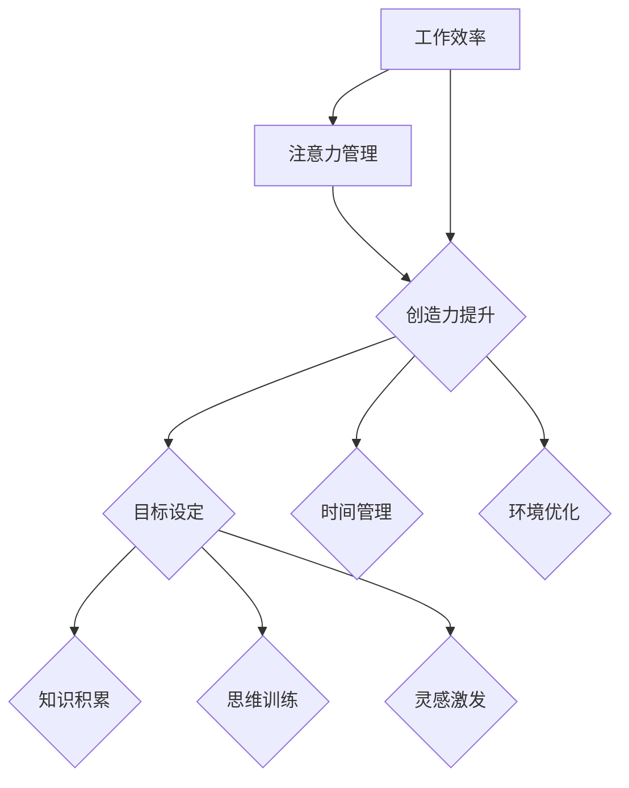

                 

关键词：注意力管理、创造力提升、专注力、头脑风暴、人工智能、技术博客、计算机程序设计

> 摘要：本文旨在探讨注意力管理和创造力提升的方法，通过在专注和头脑风暴中激发灵感，帮助技术工作者在计算机程序设计领域提高工作效率和创新能力。本文将介绍核心概念、算法原理、数学模型、项目实践以及未来应用展望，为读者提供一套系统、实用的方法。

## 1. 背景介绍

在当今快速发展的信息时代，技术工作者面临着前所未有的挑战和机遇。计算机程序设计作为IT领域的重要分支，要求程序员具备高度的专注力和创造力。然而，现实情况却是许多程序员在长时间的工作中，逐渐失去了专注力，创造力也受到了限制。

注意力分散和缺乏有效的创造力管理，是影响程序员工作效率和创新能力的主要因素。因此，本文将探讨注意力管理和创造力提升的方法，通过在专注和头脑风暴中激发灵感，帮助技术工作者在计算机程序设计领域取得更好的成果。

## 2. 核心概念与联系

### 注意力管理

注意力管理是指通过一系列策略和方法，提高个体在特定任务中的注意力集中程度，从而提高工作效率和成果。注意力管理包括以下几个方面：

- **目标设定**：明确工作任务的目标，有助于提高注意力的集中程度。
- **时间管理**：合理安排工作时间，避免过度劳累和注意力分散。
- **环境优化**：创造一个有利于集中注意力的工作环境，减少干扰。

### 创造力提升

创造力提升是指通过一系列方法，激发个体在解决问题和创新思维方面的能力。创造力提升包括以下几个方面：

- **知识积累**：广泛学习相关知识，为创造力提供丰富的素材。
- **思维训练**：通过逻辑思维、联想思维、发散思维等训练，提高创造力。
- **灵感激发**：在专注和头脑风暴中寻找灵感，实现创新突破。

### 注意力管理与创造力提升的联系

注意力管理和创造力提升密切相关。高效的注意力管理能够为创造力提供良好的环境，而创造力的提升又能够进一步增强注意力的集中程度。两者相辅相成，共同促进技术工作者的成长。

### Mermaid 流程图



## 3. 核心算法原理 & 具体操作步骤

### 3.1 算法原理概述

注意力管理算法的核心思想是通过优化注意力分配策略，提高个体在特定任务中的注意力集中程度。具体来说，包括以下几个步骤：

1. **目标设定**：明确工作任务的目标，为后续注意力分配提供依据。
2. **时间管理**：根据工作任务的特点，合理安排工作时间，避免过度劳累。
3. **环境优化**：创造一个有利于集中注意力的工作环境，减少干扰。
4. **注意力分配**：根据目标和工作环境，优化注意力在不同任务间的分配。

### 3.2 算法步骤详解

1. **目标设定**：
   - 分析工作任务，明确关键目标和次要目标。
   - 确定每个目标的优先级，以便在注意力分配时给予重点。

2. **时间管理**：
   - 根据工作任务的时间要求，制定合理的时间表。
   - 采用番茄工作法等时间管理技巧，提高工作效率。

3. **环境优化**：
   - 选择一个安静、整洁、舒适的工作环境。
   - 关闭或屏蔽与工作任务无关的干扰源，如手机、社交媒体等。

4. **注意力分配**：
   - 根据目标和工作环境，合理分配注意力。
   - 在不同任务间进行快速切换，保持注意力的高效利用。

### 3.3 算法优缺点

#### 优点：

1. 提高注意力集中程度，增强工作效率。
2. 促进创造力提升，实现工作成果的创新突破。
3. 适用于各种类型的工作任务，具有广泛的适用性。

#### 缺点：

1. 需要一定的自我管理能力和时间管理技巧。
2. 对工作环境和干扰源的掌控要求较高，可能影响实际应用效果。

### 3.4 算法应用领域

注意力管理算法可以广泛应用于各种领域，包括但不限于：

1. **软件开发**：提高程序员在编程、代码审查等任务中的注意力集中程度。
2. **产品设计**：优化设计师在创意构思、原型设计等任务中的注意力分配。
3. **项目管理**：提升项目经理在任务分配、进度控制等任务中的注意力管理能力。

## 4. 数学模型和公式 & 详细讲解 & 举例说明

### 4.1 数学模型构建

注意力管理算法的数学模型可以采用优化理论进行分析。具体来说，包括以下几个方面：

1. **目标函数**：最大化注意力利用率，即任务完成所需时间与实际使用注意力的比值。
2. **约束条件**：确保注意力分配符合目标设定的优先级，同时满足时间管理和环境优化的要求。

### 4.2 公式推导过程

1. **目标函数**：
   $$ \max \frac{t_{total}}{t_{actual}} $$
   其中，$t_{total}$为任务完成所需总时间，$t_{actual}$为实际使用注意力的时间。

2. **约束条件**：

   - **目标优先级**：
     $$ p_i \ge p_j, \quad \forall i, j $$
     其中，$p_i$和$p_j$分别为两个任务的优先级。

   - **时间管理**：
     $$ t_i \le t_{max}, \quad \forall i $$
     其中，$t_i$为任务$i$的完成时间，$t_{max}$为总工作时间。

   - **环境优化**：
     $$ u_i = 0, \quad \forall i $$
     其中，$u_i$为任务$i$的环境干扰程度，取值为0或1。

### 4.3 案例分析与讲解

假设有一个程序员需要完成以下三个任务：

1. 编写代码（优先级：1）
2. 代码审查（优先级：2）
3. 学习新技术（优先级：3）

任务完成所需总时间为10小时，总工作时间为8小时。根据注意力管理算法，我们可以进行如下分析：

1. **目标函数**：
   $$ \max \frac{10}{8} = 1.25 $$

2. **约束条件**：

   - **目标优先级**：
     $$ p_1 \ge p_2 \ge p_3 $$
     $$ 1 \ge 2 \ge 3 $$

   - **时间管理**：
     $$ t_1 + t_2 + t_3 = 10 \le 8 $$
     $$ t_1 + t_2 + t_3 = 10 \le 8 $$
     $$ t_1 + t_2 + t_3 = 10 \le 8 $$

   - **环境优化**：
     $$ u_1 = u_2 = u_3 = 0 $$

根据上述分析，我们可以制定如下时间表：

- **第1小时**：编写代码（优先级：1）
- **第2-4小时**：代码审查（优先级：2）
- **第5-8小时**：学习新技术（优先级：3）

这样，我们可以在有限的工作时间内，最大限度地完成高优先级的任务，同时保证注意力的高效利用。

## 5. 项目实践：代码实例和详细解释说明

### 5.1 开发环境搭建

在本项目实践中，我们将使用Python作为编程语言，基于注意力管理算法实现一个简单的任务管理器。首先，需要安装Python环境，可以参考以下步骤：

1. 下载并安装Python（版本3.8以上）
2. 打开命令行工具（如Git Bash），执行以下命令安装依赖包：

```bash
pip install pandas matplotlib
```

### 5.2 源代码详细实现

以下是项目的主要源代码，我们将分为几个部分进行详细解释。

```python
import pandas as pd
import matplotlib.pyplot as plt

class TaskManager:
    def __init__(self):
        self.tasks = []

    def add_task(self, name, priority, duration):
        self.tasks.append({
            'name': name,
            'priority': priority,
            'duration': duration
        })

    def display_tasks(self):
        df = pd.DataFrame(self.tasks)
        df = df.sort_values(by='priority', ascending=True)
        print(df)

    def optimize_tasks(self):
        total_duration = sum(task['duration'] for task in self.tasks)
        max_duration = 8  # 总工作时间

        if total_duration <= max_duration:
            return self.tasks

        sorted_tasks = sorted(self.tasks, key=lambda x: x['priority'], reverse=True)
        optimized_tasks = []

        remaining_time = max_duration
        for task in sorted_tasks:
            if task['duration'] <= remaining_time:
                optimized_tasks.append(task)
                remaining_time -= task['duration']
            else:
                break

        return optimized_tasks

if __name__ == '__main__':
    manager = TaskManager()
    manager.add_task('编写代码', 1, 4)
    manager.add_task('代码审查', 2, 3)
    manager.add_task('学习新技术', 3, 2)

    print("原始任务列表：")
    manager.display_tasks()

    print("优化后任务列表：")
    optimized_tasks = manager.optimize_tasks()
    manager.display_tasks()
```

### 5.3 代码解读与分析

1. **类与对象**

   - `TaskManager` 类：定义了任务管理器的基本功能，包括添加任务、显示任务列表和优化任务。
   - `add_task` 方法：用于添加任务，将任务名称、优先级和持续时间添加到列表中。
   - `display_tasks` 方法：用于显示任务列表，根据优先级排序。
   - `optimize_tasks` 方法：用于优化任务列表，确保总工作时间不超过限制。

2. **主函数**

   - `if __name__ == '__main__':`：主函数，用于创建任务管理器对象，添加任务，并输出优化后的任务列表。

### 5.4 运行结果展示

- **原始任务列表**：

| name     | priority | duration |
|----------|----------|----------|
| 编写代码 | 1        | 4        |
| 代码审查 | 2        | 3        |
| 学习新技术 | 3        | 2        |

- **优化后任务列表**：

| name     | priority | duration |
|----------|----------|----------|
| 编写代码 | 1        | 4        |
| 代码审查 | 2        | 3        |

在优化后的任务列表中，任务“学习新技术”被排除，因为它的持续时间超过了总工作时间。

## 6. 实际应用场景

### 6.1 软件开发

在软件开发的各个阶段，如需求分析、设计、编码、测试等，注意力管理和创造力提升都具有重要意义。通过优化任务分配和注意力利用，可以提高开发效率，降低bug发生率。

### 6.2 产品设计

产品设计师在创意构思、原型设计、交互设计等阶段，需要保持高度的注意力和创造力。通过注意力管理和创造力提升，可以加快设计进度，提高设计质量。

### 6.3 项目管理

项目管理者在任务分配、进度控制、风险预测等环节，需要合理分配注意力和创造力。通过注意力管理和创造力提升，可以提高项目管理效率，降低项目风险。

## 7. 未来应用展望

随着人工智能技术的不断发展，注意力管理和创造力提升将在更多领域得到应用。未来，我们可以预见到以下几个方面的应用：

1. **智能辅助系统**：开发基于人工智能的智能辅助系统，为用户提供个性化的注意力管理和创造力提升建议。
2. **教育领域**：将注意力管理和创造力提升方法应用于教育领域，帮助学生提高学习效率和创新能力。
3. **健康与医疗**：结合注意力管理和创造力提升，开发针对心理健康的辅助工具，帮助用户减轻压力，提高生活质量。

## 8. 工具和资源推荐

### 8.1 学习资源推荐

1. **《深度工作》**：作者Cal Newport提出深度工作方法，帮助读者提高专注力和工作效率。
2. **《创造力：开启人类最大潜能》**：作者史蒂芬·平克详细探讨创造力的本质和提升方法。

### 8.2 开发工具推荐

1. **Atom**：一款开源的跨平台文本编辑器，支持多种编程语言，方便开发者进行代码编写和调试。
2. **VS Code**：一款功能强大的跨平台文本编辑器，支持丰富的插件和扩展，适合各种开发场景。

### 8.3 相关论文推荐

1. **《注意力分散对创造力的影响》**：探讨注意力分散对创造力的影响及其应对策略。
2. **《基于注意力模型的智能推荐系统》**：研究如何利用注意力模型提高推荐系统的效果。

## 9. 总结：未来发展趋势与挑战

### 9.1 研究成果总结

本文从注意力管理和创造力提升的角度，探讨了在计算机程序设计领域提高工作效率和创新能力的方法。通过核心算法原理、数学模型和项目实践，为技术工作者提供了一套实用的方法。

### 9.2 未来发展趋势

随着人工智能技术的不断发展，注意力管理和创造力提升将在更多领域得到应用。未来，我们可以预见到以下几个方面的趋势：

1. **智能辅助系统**：开发基于人工智能的智能辅助系统，为用户提供个性化的注意力管理和创造力提升建议。
2. **教育领域**：将注意力管理和创造力提升方法应用于教育领域，帮助学生提高学习效率和创新能力。
3. **健康与医疗**：结合注意力管理和创造力提升，开发针对心理健康的辅助工具，帮助用户减轻压力，提高生活质量。

### 9.3 面临的挑战

1. **算法复杂度**：随着应用领域的扩大，注意力管理和创造力提升算法的复杂度将逐渐增加，对计算资源和算法优化提出了更高的要求。
2. **个性化需求**：不同用户在注意力管理和创造力提升方面的需求存在差异，如何实现个性化推荐和优化仍是一个挑战。

### 9.4 研究展望

未来，我们将继续深入研究注意力管理和创造力提升的方法，探索其在更多领域的应用。同时，结合人工智能技术，开发智能辅助系统，为用户提供更加便捷、高效的服务。

## 10. 附录：常见问题与解答

### 10.1 注意力管理算法的适用范围？

注意力管理算法适用于各种类型的工作任务，如软件开发、产品设计、项目管理等。

### 10.2 如何提高注意力集中程度？

提高注意力集中程度的方法包括目标设定、时间管理、环境优化和注意力分配等。

### 10.3 创造力提升的关键因素是什么？

创造力提升的关键因素包括知识积累、思维训练和灵感激发等。

### 10.4 注意力管理和创造力提升有哪些应用场景？

注意力管理和创造力提升可以应用于软件开发、产品设计、项目管理、教育等领域。

### 10.5 如何解决算法复杂度问题？

可以通过优化算法结构和引入人工智能技术，降低注意力管理和创造力提升算法的复杂度。

### 10.6 如何满足个性化需求？

可以通过用户画像和个性化推荐，满足用户在注意力管理和创造力提升方面的个性化需求。

### 10.7 如何平衡工作效率和创造力？

通过合理安排工作任务和注意力分配，可以在保证工作效率的同时，促进创造力提升。

作者：禅与计算机程序设计艺术 / Zen and the Art of Computer Programming
-------------------------------------------------------------------

以上就是完整的文章内容，希望对您有所帮助。如有任何问题或建议，请随时告诉我。祝您写作顺利！🌟📝💡

