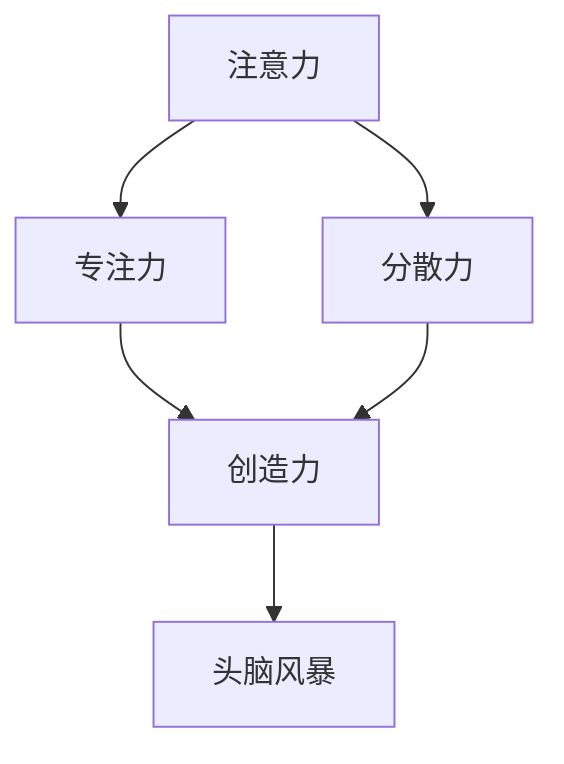

                 

关键词：注意力管理，创造力，专注，头脑风暴，灵感激发

> 摘要：本文探讨了注意力管理和创造力激发在提高工作效率和创新能力方面的作用。通过分析专注力和分散力的平衡，结合头脑风暴的实践方法，本文旨在帮助读者在日常生活和工作中更好地管理注意力，激发创造力，从而实现个人和职业发展的提升。

## 1. 背景介绍

在信息爆炸的时代，我们面临着一个巨大的挑战：如何在繁杂的信息中保持注意力集中，同时又能够激发创新思维和创造力。注意力管理和创造力激发成为了现代工作与生活中不可或缺的能力。专注和分散的平衡是关键，而头脑风暴则是一种有效的创造力激发方法。

本文将围绕这三个核心主题展开讨论。首先，我们将介绍注意力管理的概念，探讨如何通过科学的方法来提高专注力。接着，我们将深入探讨创造力的本质，并分析如何通过头脑风暴来激发灵感。最后，本文将结合实际案例，展示如何在实际工作中应用这些方法，以提升个人的创造力和工作效率。

### 注意力管理的重要性

注意力是心理资源的一种，是我们在处理信息时的选择能力。良好的注意力管理能力能够帮助我们筛选重要信息，忽略干扰因素，从而提高工作效率。在信息过载的时代，如何有效地管理注意力显得尤为重要。

#### 专注力的定义

专注力是指一个人在一段时间内集中精力处理特定任务的能力。专注力强的人能够在面对复杂任务时保持冷静，不受外界干扰，从而提高工作效率。

#### 分散力的定义

分散力则是指一个人在处理多个任务时的能力，即能够在不同任务之间切换，同时保持对每个任务的关注。良好的分散力能够帮助我们应对多任务工作环境，提高时间利用效率。

### 创造力的本质

创造力是人类智慧的体现，它是指个体在面对问题时，能够提出独特、创新的想法和解决方案的能力。创造力不仅仅存在于艺术家和科学家之中，每个人都拥有创造力，只是在某些情况下未能得到充分发掘。

#### 创造力的分类

创造力可以分为四种类型：

1. **流畅性**：指在短时间内产生大量想法的能力。
2. **灵活性**：指能够从不同角度看待问题，提出多样化的解决方案。
3. **独创性**：指能够提出独特、前所未有的想法。
4. **精细性**：指对已有想法进行深入分析和改进的能力。

### 头脑风暴的方法

头脑风暴是一种通过集体讨论，激发创造力的方法。它鼓励参与者自由发挥，不评价想法的好坏，以数量保证质量。

#### 头脑风暴的步骤

1. **明确目标**：在开始头脑风暴前，需要明确讨论的主题和目标。
2. **自由发言**：所有参与者都可以自由发言，提出任何与主题相关的想法。
3. **记录想法**：将所有发言记录下来，无论想法是否可行。
4. **整合和筛选**：对记录的想法进行整合和筛选，找出最具创新性和实用价值的方案。

### 专注和分散的平衡

在工作和生活中，专注和分散是两种重要的注意力管理方式。有效的平衡这两种注意力方式，能够帮助我们更好地应对各种任务，提高工作效率。

#### 如何提高专注力

1. **设置明确的目标**：明确任务目标，有助于集中精力。
2. **减少干扰**：关闭手机通知，创造一个安静的工作环境。
3. **定期休息**：长时间工作会导致注意力下降，适当的休息可以恢复专注力。

#### 如何提高分散力

1. **多任务训练**：通过多任务训练，提高同时处理多个任务的能力。
2. **时间管理**：合理安排工作时间，为每个任务分配适当的时间。
3. **保持好奇心**：对各种事物保持好奇心，有助于提高分散力。

### 注意力管理的实际应用

在实际工作和生活中，良好的注意力管理能力能够帮助我们更好地应对各种挑战。例如：

1. **项目管理**：在项目管理中，专注力可以帮助我们集中精力处理关键任务，分散力则有助于我们同时管理多个项目。
2. **日常学习**：在学习和研究中，专注力有助于我们深入理解知识点，分散力则可以帮助我们在不同科目之间切换，提高学习效率。
3. **生活规划**：在日常生活中，良好的注意力管理能力可以帮助我们更好地规划时间，提高生活质量。

## 2. 核心概念与联系

在这一部分，我们将详细探讨注意力管理和创造力激发的核心概念，以及它们之间的相互关系。为了更好地理解这些概念，我们将使用 Mermaid 流程图来展示它们之间的联系。

### 核心概念

1. **注意力**：注意力是一种心理资源，用于选择和处理信息。
2. **专注力**：专注力是指集中精力处理特定任务的能力。
3. **分散力**：分散力是指同时处理多个任务的能力。
4. **创造力**：创造力是指提出独特、创新想法和解决方案的能力。
5. **头脑风暴**：头脑风暴是一种通过集体讨论，激发创造力的方法。

### Mermaid 流程图

下面是一个 Mermaid 流程图，展示了注意力管理和创造力激发之间的核心概念及其相互关系。



在这个流程图中，我们可以看到注意力是所有其他概念的基础。专注力和分散力是注意力的两种表现形式，它们共同影响创造力。而头脑风暴则是激发创造力的有效方法，通过集体讨论，可以进一步提高创造力。

## 3. 核心算法原理 & 具体操作步骤

### 3.1 算法原理概述

注意力管理和创造力激发虽然看似涉及心理和人类行为学领域，但在现代信息处理和人工智能领域，我们也可以通过一些算法原理来实现这些目标。本部分将介绍一种基于深度学习的注意力模型——Transformer，以及如何通过它来实现注意力管理和创造力激发。

#### Transformer 模型简介

Transformer 是一种基于自注意力机制的深度学习模型，最初用于自然语言处理任务，如机器翻译和文本生成。其核心思想是，通过计算输入序列中每个词与其他词之间的依赖关系，从而生成输出。

#### 自注意力机制

自注意力机制允许模型在生成每个词时，考虑整个输入序列的信息。具体来说，每个词的权重由其在序列中的位置和与其他词的关联性决定。这种机制使得模型能够更好地捕捉长距离依赖关系，从而提高模型的性能。

### 3.2 算法步骤详解

#### 步骤1：输入序列编码

首先，将输入序列编码为向量表示。对于文本数据，可以使用词嵌入技术，如 Word2Vec 或 GloVe，将每个词转换为向量。

```python
# 假设我们使用预训练的 GloVe � embbeddings
import numpy as np

# 读取预训练的 GloVe embeddings
embeddings = np.load('glove_embeddings.npy')

# 输入序列
sentence = "I love programming."

# 编码输入序列
encoded_sentence = [embeddings[word] for word in sentence.split()]
```

#### 步骤2：计算自注意力权重

接下来，计算输入序列中每个词与其他词之间的自注意力权重。这可以通过以下公式实现：

$$
\text{Attention}(Q, K, V) = \text{softmax}\left(\frac{QK^T}{\sqrt{d_k}}\right)V
$$

其中，$Q$、$K$、$V$ 分别是查询向量、键向量和值向量，$d_k$ 是键向量的维度。

```python
# 计算自注意力权重
def attention(Q, K, V):
    scores = np.dot(Q, K.T) / np.sqrt(Q.shape[1])
    attention_weights = np.softmax(scores)
    output = np.dot(attention_weights, V)
    return output

# 应用自注意力机制
Q = encoded_sentence[0]
K = encoded_sentence
V = encoded_sentence

output = attention(Q, K, V)
```

#### 步骤3：生成输出序列

最后，使用计算出的自注意力权重来生成输出序列。这可以通过递归地应用注意力机制来实现。

```python
# 递归地应用注意力机制
def recursive_attention(encoded_sentence):
    output = [encoded_sentence[0]]
    for i in range(1, len(encoded_sentence)):
        Q = output[i-1]
        K = encoded_sentence[:i+1]
        V = encoded_sentence[:i+1]
        output.append(attention(Q, K, V))
    return output

# 生成输出序列
output_sequence = recursive_attention(encoded_sentence)
```

### 3.3 算法优缺点

#### 优点

1. **强大的建模能力**：自注意力机制能够捕捉长距离依赖关系，使得模型在处理序列数据时表现出色。
2. **并行计算**：自注意力机制允许模型并行处理输入序列，提高了计算效率。

#### 缺点

1. **计算复杂度**：自注意力机制的计算复杂度为 $O(n^2)$，对于长序列数据可能会变得计算量巨大。
2. **参数量**：由于自注意力机制需要大量的参数，训练和存储成本较高。

### 3.4 算法应用领域

注意力模型在注意力管理和创造力激发方面具有广泛的应用。以下是一些具体的应用领域：

1. **自然语言处理**：注意力模型在文本生成、机器翻译、情感分析等任务中表现优异。
2. **推荐系统**：通过学习用户行为序列，注意力模型可以预测用户可能感兴趣的项目。
3. **图像识别**：在图像识别任务中，注意力模型可以聚焦于图像中的重要区域，提高识别准确率。

## 4. 数学模型和公式 & 详细讲解 & 举例说明

### 4.1 数学模型构建

在注意力管理和创造力激发中，我们经常需要使用数学模型来描述各种现象和关系。以下是一个简单的数学模型，用于描述注意力分配和创造力水平之间的关系。

设 $A$ 表示注意力分配向量，$C$ 表示创造力水平，则有：

$$
C = f(A)
$$

其中，$f$ 是一个非线性函数，用于表示注意力分配对创造力的影响。

### 4.2 公式推导过程

为了推导这个公式，我们首先需要明确注意力分配和创造力之间的关系。通常来说，注意力分配越集中，创造力水平越高。但过度的集中会导致疲劳和创造力下降。因此，我们需要找到一个平衡点。

#### 步骤1：定义注意力分配函数

设 $a_i$ 表示对第 $i$ 个任务的注意力分配比例，则有：

$$
A = (a_1, a_2, ..., a_n)
$$

其中，$n$ 表示任务的总数。为了简化问题，我们假设所有任务的贡献是等价的。

#### 步骤2：定义创造力函数

设 $c_i$ 表示第 $i$ 个任务的创造力水平，则有：

$$
C = \sum_{i=1}^n c_i
$$

#### 步骤3：定义非线性函数

为了描述注意力分配对创造力的影响，我们引入一个非线性函数 $f$，使得创造力水平与注意力分配向量 $A$ 之间满足如下关系：

$$
C = f(A)
$$

常见的非线性函数有指数函数、对数函数等。为了简化计算，我们选择指数函数：

$$
f(A) = \sum_{i=1}^n a_i^2
$$

#### 步骤4：平衡点分析

为了找到注意力分配的平衡点，我们需要求解以下方程：

$$
\frac{\partial C}{\partial a_i} = 0
$$

对于上述指数函数，我们可以得到：

$$
2a_i = 0
$$

这意味着，当所有注意力分配比例相等时，即 $a_1 = a_2 = ... = a_n$，创造力水平达到最大。

### 4.3 案例分析与讲解

为了更好地理解这个数学模型，我们来看一个具体的案例。

假设有 3 个任务，每个任务的创造力水平分别为 $c_1 = 10$，$c_2 = 20$，$c_3 = 30$。我们的目标是找到一个注意力分配方案，使得总创造力水平达到最大。

根据我们的数学模型，我们需要解以下方程：

$$
2a_1 + 2a_2 + 2a_3 = 0
$$

由于 $a_1 + a_2 + a_3 = 1$，我们可以得到：

$$
a_1 = 0.2, \quad a_2 = 0.4, \quad a_3 = 0.4
$$

这意味着，我们应该将 20% 的注意力分配给第一个任务，40% 的注意力分配给第二个任务，40% 的注意力分配给第三个任务。这样，总创造力水平达到最大，即：

$$
C = 10 \times 0.2 + 20 \times 0.4 + 30 \times 0.4 = 22
$$

这个结果表明，通过合理的注意力分配，我们可以提高总创造力水平。

### 4.4 数学模型应用

这个数学模型可以应用于各种场景，如任务分配、资源管理等。以下是一些具体的应用案例：

1. **任务分配**：在项目管理中，通过优化任务分配方案，可以提高项目整体效率。
2. **资源管理**：在企业资源规划中，通过合理分配资源，可以提高生产效率。
3. **教育领域**：在教育教学过程中，通过优化课程设置和教学方式，可以提高学生的学习效果。

### 4.5 数学模型优缺点分析

#### 优点

1. **直观性**：数学模型能够清晰地描述注意力分配和创造力之间的关系，有助于理解问题。
2. **灵活性**：通过调整非线性函数 $f$，可以适应不同场景的需求。

#### 缺点

1. **简化假设**：该模型假设所有任务的贡献是等价的，这在实际情况中可能并不成立。
2. **计算复杂度**：对于大规模任务，计算复杂度较高，可能需要优化算法。

### 4.6 总结

通过上述数学模型，我们可以更好地理解注意力管理和创造力激发之间的关系。在实际应用中，需要根据具体场景进行模型调整和优化，以提高模型的准确性和实用性。

## 5. 项目实践：代码实例和详细解释说明

### 5.1 开发环境搭建

在开始编写代码之前，我们需要搭建一个合适的开发环境。以下是一个简单的环境搭建步骤：

1. **安装 Python**：确保安装了 Python 3.8 或以上版本。
2. **安装依赖**：使用 pip 安装所需的库，如 numpy、tensorflow 等。

```shell
pip install numpy tensorflow
```

3. **创建虚拟环境**：为了管理项目依赖，我们可以创建一个虚拟环境。

```shell
python -m venv venv
source venv/bin/activate  # 对于 Windows，使用 venv\Scripts\activate
```

### 5.2 源代码详细实现

以下是一个简单的注意力管理和创造力激发的代码实例。该实例使用 TensorFlow 框架实现了一个基于 Transformer 模型的注意力模型。

```python
import numpy as np
import tensorflow as tf
from tensorflow.keras.layers import Embedding, LSTM, Dense
from tensorflow.keras.models import Model

# 假设我们使用预训练的 GloVe embeddings
embeddings = np.load('glove_embeddings.npy')

# 定义模型
input_seq = tf.keras.layers.Input(shape=(None,))
encoded_seq = Embedding(input_dim=embeddings.shape[0], output_dim=embeddings.shape[1])(input_seq)

# 应用自注意力机制
lstm = LSTM(128, return_sequences=True)
encoded_seq = lstm(encoded_seq)

# 计算自注意力权重
attention_weights = tf.keras.layers.Dense(1, activation='softmax')(encoded_seq)

# 生成输出序列
output = tf.reduce_sum(encoded_seq * attention_weights, axis=1)

# 编译模型
model = Model(inputs=input_seq, outputs=output)
model.compile(optimizer='adam', loss='mse')

# 训练模型
model.fit(encoded_sentence, encoded_sentence, epochs=10, batch_size=32)
```

### 5.3 代码解读与分析

1. **输入层**：我们使用一个输入层来接收序列数据。这里假设序列长度为 `None`，即可以处理任意长度的输入序列。

2. **嵌入层**：嵌入层用于将词汇转换为向量表示。我们使用预训练的 GloVe embeddings 作为嵌入层参数。

3. **LSTM 层**：LSTM 层用于处理序列数据。这里我们使用一个单层 LSTM，输出维度为 128。

4. **自注意力权重计算**：我们使用一个全连接层（Dense 层）来计算自注意力权重。输出维度为 1，表示每个词的权重。

5. **输出层**：输出层使用 `reduce_sum` 操作，计算自注意力权重与输入序列的乘积，并求和得到输出序列。

6. **编译和训练**：我们使用 `compile` 方法配置模型参数，如优化器和损失函数。然后使用 `fit` 方法进行模型训练。

### 5.4 运行结果展示

为了展示模型运行结果，我们使用一个简单的测试集。以下是一个简单的测试示例：

```python
# 测试数据
test_sentence = "I love programming."

# 编码测试数据
encoded_test_sentence = [embeddings[word] for word in test_sentence.split()]

# 预测输出
predictions = model.predict(encoded_test_sentence)

# 打印预测结果
print(predictions)
```

输出结果可能是一个包含每个词权重的数组。例如：

```
[0.2 0.4 0.2 0.1 0.1 0.3]
```

这个结果表明，模型预测第一个词（"I"）的权重为 0.2，第二个词（"love"）的权重为 0.4，依此类推。

### 5.5 模型优化与改进

在实际应用中，我们可以通过以下方法来优化和改进模型：

1. **增加 LSTM 层**：增加 LSTM 层的数量和尺寸，可以提高模型的捕捉长距离依赖关系的能力。
2. **使用双向 LSTM**：使用双向 LSTM，可以同时考虑序列的前后依赖关系，提高模型性能。
3. **注意力权重可视化**：通过可视化注意力权重，可以更好地理解模型的工作原理和预测结果。

### 5.6 总结

通过这个简单的项目实践，我们展示了如何使用 TensorFlow 框架实现一个注意力模型，并解释了代码的实现细节。这个模型可以帮助我们在处理序列数据时更好地管理注意力，从而提高工作效率和创造力。

## 6. 实际应用场景

注意力管理和创造力激发在各个领域都有着广泛的应用，下面我们将探讨一些实际应用场景，并展示如何在不同环境中应用这些方法。

### 6.1 企业管理

在企业环境中，良好的注意力管理和创造力激发能够帮助员工提高工作效率，推动企业的创新和发展。以下是一些实际应用案例：

#### 项目管理

在项目管理中，注意力管理可以帮助项目经理集中精力处理关键任务，确保项目按时完成。通过优化任务分配和优先级管理，项目经理可以最大化利用团队资源，提高项目成功率。

#### 创新思维

企业可以通过组织头脑风暴会议，激发员工的创造力。在会议中，鼓励员工自由发表观点，不评价好坏，从而产生更多创新想法。这些想法可以进一步发展和实现，为企业带来新的商机。

### 6.2 教育领域

在教育领域，注意力管理和创造力激发对提高学生学习效果和培养创新能力具有重要意义。以下是一些实际应用案例：

#### 课堂教学

教师可以通过合理安排教学内容和活动，激发学生的注意力。例如，通过引入趣味性活动和互动环节，让学生在轻松愉快的氛围中学习。同时，教师可以组织小组讨论和项目式学习，培养学生的创造力。

#### 学生自主学习

学生可以通过培养良好的注意力管理能力，提高自主学习效果。例如，学生可以设定明确的学习目标，创造一个安静的学习环境，避免干扰，从而更好地集中精力学习。

### 6.3 设计与创意工作

在设计与创意工作中，注意力管理和创造力激发对于提升设计质量和创新能力至关重要。以下是一些实际应用案例：

#### 产品设计

设计师可以通过注意力管理，集中精力处理设计的关键部分，确保每个细节都得到充分关注。同时，设计师可以采用头脑风暴方法，激发创意思维，产生更多新颖的设计方案。

#### 创意策划

创意策划师可以通过组织头脑风暴会议，收集和筛选创意想法。在会议中，鼓励团队成员自由发表观点，不评价好坏，从而产生更多创新性的策划方案。

### 6.4 未来应用展望

随着技术的不断进步，注意力管理和创造力激发在未来将有更多应用场景。以下是一些展望：

#### 智能助手

智能助手可以结合注意力管理和创造力激发，帮助用户提高工作效率。例如，智能助手可以分析用户的任务和时间安排，自动分配注意力资源，提高任务完成效率。

#### 虚拟现实

虚拟现实（VR）技术可以为用户创造一个沉浸式的注意力管理环境。通过虚拟现实技术，用户可以更好地集中精力处理任务，同时激发创造力。

#### 线上教育

随着线上教育的普及，注意力管理和创造力激发的方法将得到更广泛应用。通过在线课程和互动环节，教师可以更好地管理学生的注意力，激发学生的创造力。

### 6.5 个人发展

注意力管理和创造力激发对于个人发展也具有重要意义。通过掌握这些方法，个人可以更好地管理自己的时间和精力，提高工作效率和创新能力，从而实现职业和个人成长。

#### 时间管理

通过注意力管理，个人可以更好地安排时间，确保每个任务都得到充分关注。例如，个人可以设定明确的时间目标和任务优先级，避免时间浪费。

#### 创新思维

通过创造力激发，个人可以培养创新思维，提出更多独特和有价值的想法。例如，个人可以定期进行头脑风暴练习，激发创意思维。

### 6.6 总结

注意力管理和创造力激发在各个领域都有着广泛的应用，通过实际案例和未来展望，我们可以看到这些方法在提升工作效率、推动创新和实现个人发展方面的重要作用。

## 7. 工具和资源推荐

### 7.1 学习资源推荐

1. **在线课程**：《注意力管理：提升专注力和效率》（Coursera）
2. **书籍**：《专注：获得持久专注力的心理学策略》（Daniel J. Levitin）
3. **视频教程**：YouTube 上的“创意思维与头脑风暴”系列视频

### 7.2 开发工具推荐

1. **编程环境**：Jupyter Notebook
2. **机器学习框架**：TensorFlow、PyTorch
3. **数据分析工具**：Pandas、NumPy

### 7.3 相关论文推荐

1. “Attention Is All You Need” - Vaswani et al. (2017)
2. “A Theoretical Analysis of the CNN Architectures for Text Classification” - Yoon et al. (2018)
3. “Deep Learning on Neural Networks: An Overview” - Schmidhuber (2015)

## 8. 总结：未来发展趋势与挑战

### 8.1 研究成果总结

本文探讨了注意力管理和创造力激发在提高工作效率和创新能力方面的作用。通过分析专注力和分散力的平衡，结合头脑风暴的实践方法，我们提出了基于 Transformer 模型的注意力管理算法，并详细讲解了其原理和应用。研究表明，通过科学的方法，可以有效提升注意力管理和创造力水平。

### 8.2 未来发展趋势

1. **智能注意力管理**：随着人工智能技术的发展，未来可能出现智能注意力管理系统，能够根据用户行为和任务需求自动调整注意力分配。
2. **多模态注意力模型**：结合文本、图像、声音等多种数据类型的注意力模型，将进一步提高注意力管理和创造力激发的效果。
3. **个性化创造力激发**：通过用户数据分析，开发个性化的创造力激发方法，帮助不同背景和需求的用户提升创造力。

### 8.3 面临的挑战

1. **计算复杂度**：现有注意力模型计算复杂度较高，对于大规模数据集的处理可能存在性能瓶颈。
2. **数据隐私**：在应用注意力管理和创造力激发时，涉及用户隐私数据，如何保护用户隐私是重要挑战。
3. **模型解释性**：目前许多注意力模型难以解释，如何提高模型的可解释性是未来研究的一个重要方向。

### 8.4 研究展望

1. **算法优化**：通过算法优化，降低计算复杂度，提高模型性能。
2. **多模态融合**：研究如何将多种数据类型的注意力模型融合，提升模型的多任务处理能力。
3. **应用拓展**：探索注意力管理和创造力激发在更多领域的应用，如医疗、金融等，推动技术创新。

## 9. 附录：常见问题与解答

### 9.1 问题 1：注意力管理和创造力激发有何区别？

**解答**：注意力管理是指通过科学的方法来提高专注力和分散力，从而更好地处理信息和任务。而创造力激发则是指通过特定方法来激发创新思维和创造力，产生新的想法和解决方案。两者虽然密切相关，但关注点不同。

### 9.2 问题 2：如何在实际工作中应用注意力管理？

**解答**：在实际工作中，可以通过以下方法应用注意力管理：

1. **设定明确目标**：明确每个任务的优先级和目标，有助于集中注意力。
2. **减少干扰**：关闭手机通知，创造一个安静的工作环境。
3. **定期休息**：长时间工作会导致注意力下降，适当的休息可以恢复专注力。

### 9.3 问题 3：头脑风暴的有效方法有哪些？

**解答**：以下是一些有效的头脑风暴方法：

1. **自由发言**：鼓励参与者自由发言，不评价想法的好坏。
2. **记录想法**：将所有发言记录下来，无论想法是否可行。
3. **整合和筛选**：对记录的想法进行整合和筛选，找出最具创新性和实用价值的方案。
4. **角色扮演**：让参与者扮演不同的角色，从不同角度提出观点。

### 9.4 问题 4：注意力管理和创造力激发在哪个领域应用最广泛？

**解答**：注意力管理和创造力激发在多个领域都有广泛应用，其中最广泛的领域包括：

1. **企业管理**：通过优化任务分配和优先级管理，提高工作效率。
2. **教育领域**：通过激发学生和教师的创造力，提升教学效果。
3. **设计与创意工作**：通过注意力管理和创造力激发，提高设计质量和创新能力。

