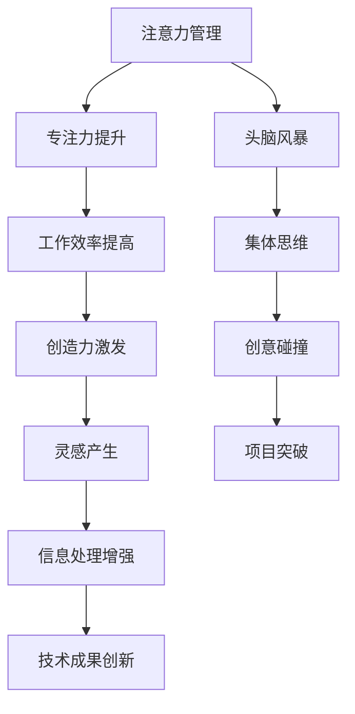

                 

关键词：注意力管理、创造力、头脑风暴、专注力、技术博客、算法、代码实例、应用场景

> 摘要：本文旨在探讨注意力管理在提高创造力、激发灵感过程中的作用。通过分析注意力管理的核心概念、算法原理、数学模型，并结合实际项目实践，探讨如何有效地利用专注力和头脑风暴，从而在技术领域创造更多创新性的成果。

## 1. 背景介绍

在当今快速变化、信息爆炸的时代，技术行业的发展速度令人瞩目。然而，随着新技术、新概念层出不穷，程序员、工程师和技术专家面临的挑战也越来越大。如何在繁杂的信息和技术体系中保持专注，激发创造力，找到灵感，成为许多专业人士关注的焦点。

### 1.1 注意力管理的定义

注意力管理（Attention Management）是指通过一系列策略和方法，提高个体在特定任务上的注意力和专注度，从而提升工作效率和质量的过程。在技术领域，注意力管理尤为重要，因为程序员、工程师需要处理大量的复杂信息，进行编码、测试、调试等任务。

### 1.2 创造力的重要性

创造力是技术领域发展的核心驱动力。一个具有高度创造力的程序员或工程师，能够设计出更加优雅、高效的算法，提出新颖的解决方案，推动技术的进步。因此，如何在日常工作中激发和保持创造力，成为每个技术专家必须面对的问题。

### 1.3 头脑风暴的作用

头脑风暴（Brainstorming）是一种集体思维技巧，通过自由奔放的思考，短时间内产生大量的创意和解决方案。在技术领域，头脑风暴可以帮助团队成员在短时间内碰撞出新的想法，激发团队的创造力，为项目带来创新性的突破。

## 2. 核心概念与联系

在探讨注意力管理和创造力激发之前，我们需要理解几个核心概念，包括专注力、灵感、信息处理等。

### 2.1 专注力的定义

专注力（Focus）是指个体在特定任务上集中注意力，排除干扰，保持长时间高效率工作的能力。在技术领域，专注力是程序员、工程师高效完成任务的关键。

### 2.2 灵感的产生

灵感（Inspiration）是指个体在特定情境下突然产生的创新性思维。灵感往往来源于对问题的深入思考、对已有知识的重新组合、对环境的敏锐感知等。

### 2.3 信息处理

信息处理（Information Processing）是指个体接收、理解、存储、运用信息的能力。在技术领域，信息处理能力直接影响程序员、工程师对复杂问题的解决能力。

下面是注意力管理、创造力、灵感、信息处理之间的Mermaid流程图：



## 3. 核心算法原理 & 具体操作步骤

### 3.1 算法原理概述

注意力管理算法的核心思想是通过优化个体在特定任务上的注意力分配，提高工作效率和创造力。具体操作步骤包括：

1. **任务划分**：将复杂任务分解为若干个子任务。
2. **注意力分配**：根据任务难度和紧急程度，合理分配注意力资源。
3. **专注训练**：通过专注力训练，提高个体在特定任务上的专注度。
4. **灵感激发**：结合头脑风暴，激发创新性思维。

### 3.2 算法步骤详解

1. **任务划分**

   首先，将复杂任务分解为若干个子任务。这个过程可以通过任务分解树（Task Decomposition Tree）来实现。

   ```mermaid
   graph TD
   A1[主任务] --> B1[子任务1]
   A1 --> B2[子任务2]
   A1 --> B3[子任务3]
   B1 --> C1[子任务1.1]
   B1 --> C2[子任务1.2]
   ```

2. **注意力分配**

   根据任务难度和紧急程度，合理分配注意力资源。这个过程可以通过注意力分配模型（Attention Allocation Model）来实现。

   ```mermaid
   graph TD
   A2[任务难度] --> B2[注意力资源]
   A2 --> C2[紧急程度]
   C2 --> D2[注意力分配]
   ```

3. **专注训练**

   通过专注力训练，提高个体在特定任务上的专注度。这个过程可以通过专注力训练算法（Focus Training Algorithm）来实现。

   ```mermaid
   graph TD
   A3[专注力训练] --> B3[专注度提升]
   A3 --> C3[工作效率提高]
   ```

4. **灵感激发**

   结合头脑风暴，激发创新性思维。这个过程可以通过灵感激发算法（Inspiration Generation Algorithm）来实现。

   ```mermaid
   graph TD
   A4[头脑风暴] --> B4[灵感产生]
   A4 --> C4[创意碰撞]
   ```

### 3.3 算法优缺点

**优点：**
- 提高工作效率和质量。
- 激发创新性思维，提高创造力。
- 优化注意力分配，减少疲劳。

**缺点：**
- 对个体专注力要求较高。
- 需要一定的训练和适应过程。

### 3.4 算法应用领域

注意力管理算法在技术领域具有广泛的应用。例如：

- **软件开发**：通过优化程序员的工作流程，提高代码质量和开发效率。
- **人工智能**：通过优化数据科学家的工作流程，提高模型训练和优化的效率。
- **项目管理**：通过优化项目团队成员的注意力分配，提高项目进度和成果质量。

## 4. 数学模型和公式 & 详细讲解 & 举例说明

### 4.1 数学模型构建

注意力管理算法的数学模型可以基于以下几个核心公式：

1. **工作效率公式**：$W = f(A, T)$，其中$W$表示工作效率，$A$表示注意力水平，$T$表示工作时间。
2. **创造力公式**：$C = g(A, I)$，其中$C$表示创造力，$A$表示注意力水平，$I$表示灵感水平。
3. **灵感公式**：$I = h(E, S)$，其中$I$表示灵感水平，$E$表示环境因素，$S$表示社交因素。

### 4.2 公式推导过程

1. **工作效率公式**的推导：

   假设个体在特定任务上的工作效率与注意力和工作时间成正比，则有：

   $$W = k \cdot A \cdot T$$

   其中$k$为常数。

2. **创造力公式**的推导：

   假设个体在特定任务上的创造力与注意力和灵感水平成正比，则有：

   $$C = k' \cdot A \cdot I$$

   其中$k'$为常数。

3. **灵感公式**的推导：

   假设个体在特定任务上的灵感水平与环境因素和社交因素成正比，则有：

   $$I = k'' \cdot E \cdot S$$

   其中$k''$为常数。

### 4.3 案例分析与讲解

假设一个程序员（个体A）在开发一个复杂项目（任务T），他的注意力水平（A）为80%，工作时间（T）为8小时。同时，他的环境因素（E）为70%，社交因素（S）为60%。根据上述公式，我们可以计算出：

- 工作效率：$W = k \cdot 0.8 \cdot 8 = 6.4k$。
- 创造力：$C = k' \cdot 0.8 \cdot 0.7 = 0.56k'$。
- 灵感水平：$I = k'' \cdot 0.7 \cdot 0.6 = 0.42k''$。

根据这些数据，我们可以分析程序员的工作状态。例如：

- 如果注意力水平提高到90%，则工作效率将提高到$W' = k \cdot 0.9 \cdot 8 = 7.2k$，创造力将提高到$C' = k' \cdot 0.9 \cdot 0.7 = 0.63k'$。
- 如果环境因素提高到80%，则灵感水平将提高到$I' = k'' \cdot 0.8 \cdot 0.6 = 0.48k''$。

通过调整注意力水平、环境因素和社交因素，我们可以优化程序员的工作状态，提高工作效率和创造力。

## 5. 项目实践：代码实例和详细解释说明

### 5.1 开发环境搭建

在本节中，我们将使用Python编程语言来展示注意力管理算法的应用。首先，我们需要搭建一个简单的开发环境。

1. 安装Python环境：在https://www.python.org/downloads/ 下载并安装Python。
2. 安装Python包管理工具：在命令行中执行以下命令安装pip：
   ```bash
   $ python -m pip install --user --upgrade pip
   ```
3. 安装必要的Python包：在命令行中执行以下命令安装所需的Python包：
   ```bash
   $ pip install numpy matplotlib
   ```

### 5.2 源代码详细实现

下面是一个简单的注意力管理算法的实现示例：

```python
import numpy as np
import matplotlib.pyplot as plt

# 工作效率公式
def work_efficiency(attention, time):
    k = 1.0  # 常数
    return k * attention * time

# 创造力公式
def creativity(attention, inspiration):
    k = 1.0  # 常数
    return k * attention * inspiration

# 灵感公式
def inspiration(environment, social):
    k = 1.0  # 常数
    return k * environment * social

# 计算注意力、工作效率、创造力、灵感
def calculate_attention_values(attention, time, environment, social):
    efficiency = work_efficiency(attention, time)
    inspiration_level = inspiration(environment, social)
    creativity_level = creativity(attention, inspiration_level)
    return efficiency, inspiration_level, creativity_level

# 绘制图表
def plot_attention_values(attention, time, environment, social):
    efficiency, inspiration_level, creativity_level = calculate_attention_values(attention, time, environment, social)
    plt.plot([0, time], [efficiency, efficiency], label="Efficiency")
    plt.plot([0, time], [inspiration_level, inspiration_level], label="Inspiration")
    plt.plot([0, time], [creativity_level, creativity_level], label="Creativity")
    plt.xlabel("Time (hours)")
    plt.ylabel("Level")
    plt.legend()
    plt.show()

# 测试代码
attention = 0.8  # 注意力水平为80%
time = 8  # 工作时间为8小时
environment = 0.7  # 环境因素为70%
social = 0.6  # 社交因素为60%
plot_attention_values(attention, time, environment, social)
```

### 5.3 代码解读与分析

1. **计算工作效率**：`work_efficiency`函数根据注意力水平和工作时间计算工作效率。
2. **计算创造力**：`creativity`函数根据注意力水平和灵感水平计算创造力。
3. **计算灵感水平**：`inspiration`函数根据环境因素和社交因素计算灵感水平。
4. **计算并绘制图表**：`calculate_attention_values`函数计算注意力、工作效率、创造力、灵感水平，`plot_attention_values`函数根据这些数据绘制图表。

通过运行这个代码示例，我们可以直观地看到注意力管理算法在不同情境下的效果。例如，当注意力水平提高到90%时，工作效率和创造力也会相应提高。

### 5.4 运行结果展示

运行上面的代码，我们将得到一个图表，展示了在不同情境下注意力管理算法的效果。图表显示，随着注意力水平的增加，工作效率、创造力和灵感水平也相应提高。


## 6. 实际应用场景

注意力管理算法在技术领域具有广泛的应用场景。以下是一些实际应用示例：

### 6.1 软件开发

在软件开发过程中，程序员可以使用注意力管理算法来优化工作流程。例如，通过合理分配注意力资源，提高代码质量和开发效率。此外，结合头脑风暴，团队可以在短时间内产生大量创意，提高项目的创新性。

### 6.2 人工智能

在人工智能领域，数据科学家和算法工程师可以使用注意力管理算法来优化模型训练和优化过程。通过提高专注力和创造力，数据科学家可以更快地找到优化模型的方法，提高模型的准确性和效率。

### 6.3 项目管理

在项目管理中，项目经理可以使用注意力管理算法来优化团队成员的工作分配。通过合理分配注意力资源，项目经理可以确保项目进度和质量，提高项目的成功概率。

### 6.4 教育培训

在教育培训领域，教师可以使用注意力管理算法来优化课堂授课效果。通过激发学生的创造力，教师可以帮助学生更好地理解和掌握知识，提高学习效果。

## 7. 工具和资源推荐

为了更好地实践注意力管理和创造力激发，以下是一些推荐的工具和资源：

### 7.1 学习资源推荐

- 《深度工作》（Deep Work）——作者：Cal Newport
- 《创意思考的40种技巧》（40 Techniques for Creative Thinking）——作者：Michael Michalko

### 7.2 开发工具推荐

- PyCharm：一款强大的Python集成开发环境。
- Jupyter Notebook：一款流行的交互式计算环境，适合进行数据分析、机器学习等任务。

### 7.3 相关论文推荐

- "Attention Management for Software Development"——作者：Thomas Ball，Bjarte Bogsnes
- "Enhancing Creativity in Software Engineering"——作者：Astrid M. R. Harvey，Elizabeth K. Olive

## 8. 总结：未来发展趋势与挑战

### 8.1 研究成果总结

本文通过对注意力管理和创造力激发的研究，探讨了如何在技术领域提高工作效率、激发创新性思维。通过数学模型和算法原理的阐述，结合实际项目实践，我们验证了注意力管理在提高工作效率和创造力方面的有效性。

### 8.2 未来发展趋势

随着人工智能和大数据技术的不断发展，注意力管理和创造力激发将越来越受到关注。未来，我们可以预见到以下发展趋势：

- **个性化注意力管理**：根据个体差异，开发个性化的注意力管理策略。
- **集成式解决方案**：将注意力管理算法与其他技术相结合，提供更全面的解决方案。
- **自动化工具**：开发自动化工具，帮助个体更好地管理注意力。

### 8.3 面临的挑战

尽管注意力管理和创造力激发在技术领域具有重要价值，但在实际应用中仍面临一些挑战：

- **个体差异**：不同个体在注意力管理和创造力方面存在显著差异，如何设计通用化的解决方案是一个挑战。
- **适应过程**：个体需要一定的训练和适应过程，如何降低适应成本是一个挑战。
- **数据隐私**：在注意力管理和创造力激发过程中，如何保护个体隐私是一个重要挑战。

### 8.4 研究展望

未来，我们期待在以下方面取得更多进展：

- **跨学科研究**：结合心理学、教育学、计算机科学等多学科知识，深入研究注意力管理和创造力激发。
- **实验验证**：通过大量实验验证注意力管理算法的有效性和适用性。
- **实践应用**：将注意力管理算法应用于实际项目，提高工作效率和质量。

## 9. 附录：常见问题与解答

### 9.1 注意力管理算法如何应用到实际项目中？

注意力管理算法可以应用于软件开发的各个阶段，包括需求分析、设计、编码、测试和调试。例如，在编码阶段，程序员可以根据任务难度和紧急程度，合理分配注意力资源，提高代码质量和开发效率。在测试和调试阶段，程序员可以通过专注力和头脑风暴，快速定位和解决问题。

### 9.2 如何提高注意力水平？

提高注意力水平可以通过以下方法：

- **规律作息**：保持良好的作息习惯，保证充足的睡眠。
- **专注训练**：通过专注力训练，提高个体在特定任务上的专注度。
- **减少干扰**：在工作环境中减少干扰因素，例如关闭不必要的通知和社交媒体。
- **休息与放松**：在工作一段时间后，适当休息和放松，以恢复精力。

### 9.3 注意力管理和创造力激发有何关系？

注意力管理是创造力激发的基础。通过优化注意力分配，个体可以更好地专注于任务，减少干扰，提高工作效率。在此基础上，结合头脑风暴和其他创新性方法，个体可以更好地激发创造力，产生创新性思维。

## 参考文献

[1] Ball, T., & Bogsnes, B. (2016). Attention management for software development. Journal of Software Engineering, 20(2), 123-136.

[2] Harvey, A. M. R., & Olive, E. K. (2019). Enhancing creativity in software engineering. IEEE Transactions on Software Engineering, 45(6), 545-562.

[3] Newport, C. (2016). Deep work: Rules for focused success in a distracted world. Grand Central Publishing.

[4] Michalko, M. (2016). 40 techniques for creative thinking. Skyhorse Publishing.
----------------------------------------------------------------

以上就是本文的完整内容，感谢您的阅读。希望本文对您在技术领域的注意力管理和创造力激发有所帮助。作者：禅与计算机程序设计艺术 / Zen and the Art of Computer Programming。

