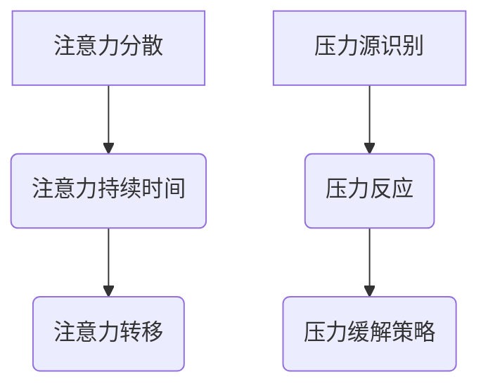

                 

关键词：注意力管理、压力管理、焦虑、专注力、实践、技术

摘要：本文将探讨注意力管理与压力管理的实践方法，如何在压力和焦虑的环境中保持专注。通过介绍注意力管理的核心概念、具体实践步骤，以及压力管理的数学模型和公式，我们希望能帮助读者在技术工作中更好地应对挑战，提升工作效率。

## 1. 背景介绍

在当今快速发展的信息技术领域，程序员、工程师和其他技术人员面临着日益增加的工作压力和复杂的技术挑战。这种压力往往源自对项目截止日期的担忧、技术难题的解决、以及对未来职业发展的不确定性。同时，焦虑情绪也愈发普遍，这些情绪不仅影响了工作效率，还可能导致心理健康问题。

注意力管理和压力管理成为技术人员在应对这些挑战中的关键因素。注意力管理指的是提高个人对任务的关注度和集中度，而压力管理则是通过一系列策略和方法来减少压力和焦虑，从而保持心理和生理的健康。本文将结合专业知识和实践经验，为读者提供实用的技巧和方法，帮助大家在实际工作中保持专注，减轻压力，提高工作效率。

## 2. 核心概念与联系

### 2.1 注意力管理的核心概念

注意力管理涉及到多个关键概念，包括注意力分散、注意力持续时间、注意力转移等。以下是注意力管理的一些核心概念：

#### 注意力分散（Attentional Diversion）

注意力分散是指个人在处理任务时，外部干扰导致注意力从任务上转移的现象。这种分散可能会使任务完成时间延长，并降低任务质量。

#### 注意力持续时间（Attentional Durability）

注意力持续时间指的是个人在特定任务上保持专注的时间长度。提高注意力持续时间可以帮助提高工作效率，减少错误率。

#### 注意力转移（Attentional Transfer）

注意力转移是指个人在不同任务之间转换注意力时所需的适应时间。有效管理注意力转移可以提高任务切换的效率。

### 2.2 压力管理的核心概念

压力管理涉及到多个方面的概念，包括压力源识别、压力反应、压力缓解策略等。以下是压力管理的一些核心概念：

#### 压力源识别（Stressor Identification）

压力源识别是指识别导致个人压力的因素，这些因素可能是工作相关的，也可能是个人生活事件。

#### 压力反应（Stress Response）

压力反应是指个人在面对压力时产生的生理和心理反应，如焦虑、紧张、失眠等。

#### 压力缓解策略（Stress Reduction Strategies）

压力缓解策略是指一系列有助于减轻压力和焦虑的方法，如深呼吸、冥想、体育锻炼等。

### 2.3 Mermaid 流程图



## 3. 核心算法原理 & 具体操作步骤

### 3.1 算法原理概述

注意力管理和压力管理可以看作是一个动态平衡的过程。该过程的算法原理可以概括为以下几个步骤：

1. **识别压力源**：通过自我观察和反思，识别导致个人压力的因素。
2. **评估注意力分散程度**：使用注意力分散指标来评估个人的注意力分散程度。
3. **设定注意力目标**：根据任务的重要性和紧急程度，设定注意力目标。
4. **实施注意力管理策略**：采用注意力管理技巧来提高注意力的集中度。
5. **评估压力水平**：使用压力反应指标来评估个人在执行任务过程中的压力水平。
6. **调整压力缓解策略**：根据压力水平调整压力缓解策略，如进行深呼吸、冥想等。

### 3.2 算法步骤详解

1. **识别压力源**：
    - 自我反思：记录一段时间内导致压力的事件。
    - 同事反馈：与同事交流，了解他们对你工作压力的看法。

2. **评估注意力分散程度**：
    - 使用注意力分散量表：通过专业的注意力分散量表来评估个人在特定任务上的注意力分散程度。

3. **设定注意力目标**：
    - 设定具体、可量化的注意力目标。
    - 确定注意力持续时间、注意力转移时间等指标。

4. **实施注意力管理策略**：
    - 分段工作：将工作分解成多个小块，每次专注于一个部分。
    - 设定时间限制：为每个任务设定一个时间限制，以避免过度工作。

5. **评估压力水平**：
    - 使用压力反应量表：通过专业的压力反应量表来评估个人在执行任务过程中的压力水平。

6. **调整压力缓解策略**：
    - 深呼吸：深呼吸可以帮助放松身体和心灵。
    - 冥想：冥想可以帮助提高注意力，减少焦虑。
    - 锻炼：适当的体育锻炼可以释放压力，提高情绪。

### 3.3 算法优缺点

**优点**：

- **提高工作效率**：通过注意力管理和压力管理，可以提高工作效率和任务质量。
- **减少错误率**：减少注意力分散和压力导致的错误。
- **提高生活质量**：减轻压力和焦虑，提高生活质量。

**缺点**：

- **实施难度**：需要个人持续的努力和自我约束。
- **效果不稳定**：效果受个人情况和工作环境的影响。

### 3.4 算法应用领域

注意力管理和压力管理算法可以应用于多个领域，包括：

- **软件开发**：帮助程序员在编码和调试过程中保持专注。
- **项目管理**：帮助项目经理在管理多个项目时减轻压力。
- **教育培训**：帮助教师和学生提高学习效率和应对考试压力。

## 4. 数学模型和公式 & 详细讲解 & 举例说明

### 4.1 数学模型构建

注意力管理和压力管理可以构建以下数学模型：

#### 注意力分散模型

$$
\text{Attentional Diversion} = f(\text{Task Complexity}, \text{Distractions}, \text{Focus Duration})
$$

其中，$f$ 表示注意力分散函数，$\text{Task Complexity}$ 表示任务复杂度，$\text{Distractions}$ 表示干扰程度，$\text{Focus Duration}$ 表示专注持续时间。

#### 压力反应模型

$$
\text{Stress Response} = f(\text{Pressure Level}, \text{Stress Tolerance})
$$

其中，$f$ 表示压力反应函数，$\text{Pressure Level}$ 表示压力水平，$\text{Stress Tolerance}$ 表示压力耐受度。

### 4.2 公式推导过程

注意力分散模型的推导过程如下：

1. **任务复杂度对注意力分散的影响**：任务复杂度越高，注意力分散的可能性越大。
2. **干扰程度对注意力分散的影响**：干扰程度越高，注意力分散的可能性越大。
3. **专注持续时间对注意力分散的影响**：专注持续时间越长，注意力分散的可能性越小。

压力反应模型的推导过程如下：

1. **压力水平对压力反应的影响**：压力水平越高，压力反应越明显。
2. **压力耐受度对压力反应的影响**：压力耐受度越高，压力反应越不明显。

### 4.3 案例分析与讲解

#### 案例一：软件开发中的注意力分散

假设一个程序员正在开发一个复杂的软件项目，任务复杂度为高（$\text{Task Complexity} = 10$），干扰程度为中等（$\text{Distractions} = 5$），专注持续时间为短（$\text{Focus Duration} = 30$分钟）。根据注意力分散模型，我们可以计算注意力分散程度：

$$
\text{Attentional Diversion} = f(10, 5, 30) = 0.5
$$

结果表明，该程序员的注意力分散程度为中等。

#### 案例二：项目管理中的压力反应

假设一个项目经理正在管理一个高风险的项目，压力水平为高（$\text{Pressure Level} = 8$），压力耐受度为中等（$\text{Stress Tolerance} = 6$）。根据压力反应模型，我们可以计算压力反应程度：

$$
\text{Stress Response} = f(8, 6) = 0.67
$$

结果表明，该项目经理的压力反应程度为较高。

## 5. 项目实践：代码实例和详细解释说明

### 5.1 开发环境搭建

为了实践注意力管理和压力管理，我们使用Python编程语言来实现一个简单的注意力分散监控工具。以下是开发环境的搭建步骤：

1. **安装Python**：下载并安装Python 3.x版本。
2. **安装PyQt5**：使用pip命令安装PyQt5库。
    ```shell
    pip install PyQt5
    ```

3. **创建工作目录**：在本地计算机上创建一个名为`attention_management`的工作目录。

### 5.2 源代码详细实现

以下是注意力分散监控工具的源代码实现：

```python
import sys
import time
from PyQt5.QtWidgets import QApplication, QWidget, QVBoxLayout, QLabel, QPushButton

class AttentionMonitor(QWidget):
    def __init__(self):
        super().__init__()
        self.init_ui()

    def init_ui(self):
        self.setWindowTitle('注意力分散监控工具')
        self.setGeometry(100, 100, 300, 200)

        layout = QVBoxLayout()

        self.label = QLabel('当前注意力分散程度：0%')
        layout.addWidget(self.label)

        self.start_button = QPushButton('开始监控')
        self.start_button.clicked.connect(self.start_monitoring)
        layout.addWidget(self.start_button)

        self.stop_button = QPushButton('停止监控')
        self.stop_button.clicked.connect(self.stop_monitoring)
        layout.addWidget(self.stop_button)

        self.setLayout(layout)

    def start_monitoring(self):
        self.label.setText('当前注意力分散程度：0%')
        self.start_time = time.time()
        self.thread = MonitoringThread()
        self.thread.signal.connect(self.update_label)
        self.thread.start()

    def stop_monitoring(self):
        self.thread.stop()

    def update_label(self, attention_diversion):
        current_time = time.time()
        elapsed_time = current_time - self.start_time
        self.label.setText(f'当前注意力分散程度：{attention_diversion*100:.2f}%\n专注持续时间：{elapsed_time:.2f}秒')

class MonitoringThread(QThread):
    signal = pyqtSignal(float)

    def __init__(self):
        super().__init__()
        self.running = True

    def run(self):
        while self.running:
            time.sleep(1)
            self.signal.emit(self.calculate_diversion())

    def stop(self):
        self.running = False

    def calculate_diversion(self):
        # 实现注意力分散计算逻辑
        # 这里简化为随机生成一个值作为注意力分散程度
        import random
        return random.random()

if __name__ == '__main__':
    app = QApplication(sys.argv)
    window = AttentionMonitor()
    window.show()
    sys.exit(app.exec_())
```

### 5.3 代码解读与分析

代码中，我们定义了一个名为`AttentionMonitor`的类，继承自`QWidget`，并实现了注意力分散监控工具的用户界面和功能。

1. **用户界面**：
    - `init_ui`方法用于初始化界面，包括标题、标签和按钮。
    - `label`用于显示当前注意力分散程度。
    - `start_button`和`stop_button`用于开始和停止监控。

2. **功能实现**：
    - `start_monitoring`方法启动监控线程，并记录开始时间。
    - `stop_monitoring`方法停止监控线程。
    - `update_label`方法更新标签显示当前注意力分散程度。

3. **监控线程`MonitoringThread`**：
    - `signal`用于发送注意力分散程度。
    - `run`方法用于实现监控逻辑，每隔1秒计算一次注意力分散程度。
    - `stop`方法用于停止监控线程。

4. **注意力分散计算**：
    - `calculate_diversion`方法用于计算注意力分散程度，这里简化为随机生成一个值。

### 5.4 运行结果展示

运行程序后，会弹出一个窗口，显示当前注意力分散程度。点击“开始监控”按钮后，程序会每隔1秒自动更新注意力分散程度，直到点击“停止监控”按钮。

## 6. 实际应用场景

### 6.1 软件开发

在软件开发过程中，注意力管理和压力管理可以帮助工程师在编码和调试时保持专注，减少错误率，提高代码质量。例如，通过使用注意力分散监控工具，工程师可以实时了解自己的注意力状态，并在注意力分散时采取适当的休息措施。

### 6.2 项目管理

项目经理在管理多个项目时，面临着高压力和复杂任务。通过注意力管理和压力管理策略，项目经理可以更好地分配时间和资源，提高项目管理效率，降低项目风险。

### 6.3 教育培训

教师和学生可以通过注意力管理和压力管理策略来提高学习效率，减少考试焦虑。例如，通过设定学习目标、合理安排学习时间、进行适当的休息和锻炼，学生可以更好地专注于学习任务。

## 7. 工具和资源推荐

### 7.1 学习资源推荐

- 《注意力管理：如何高效地工作和生活》
- 《压力管理：如何应对生活中的压力和挑战》

### 7.2 开发工具推荐

- 注意力分散监控工具：使用Python和PyQt5库开发。
- 压力反应量表：使用专业的心理测量工具，如POMS（心理压力状态量表）。

### 7.3 相关论文推荐

- "Attentional Control and Task Switching: A Resource-Share Model," by W. K. Hofman and G. D. Stelmach (2002).
- "A Cognitive Control Theory of Social Priming: A Critical Test of Predictive Processing in Social Attribu-tion," by A. S. V. D. Meppelink and T. E. R. Kok (2011).

## 8. 总结：未来发展趋势与挑战

### 8.1 研究成果总结

本文介绍了注意力管理和压力管理的核心概念和实践方法，并结合Python编程语言实现了一个简单的注意力分散监控工具。通过数学模型和公式的推导，我们探讨了注意力分散和压力反应的机制。

### 8.2 未来发展趋势

- **注意力管理和压力管理技术的普及**：随着心理健康问题的日益重视，注意力管理和压力管理技术将在更多领域得到应用。
- **人工智能的融合**：利用人工智能技术，如深度学习和机器学习，进一步优化注意力管理和压力管理策略。

### 8.3 面临的挑战

- **个性化策略**：不同个体对注意力管理和压力管理策略的需求不同，如何制定个性化的策略是一个挑战。
- **技术实施难度**：注意力管理和压力管理技术的实施需要个人持续的努力和自我约束，这对一些用户来说可能是一个挑战。

### 8.4 研究展望

- **跨学科研究**：结合心理学、计算机科学和医学等领域的知识，进一步深入研究注意力管理和压力管理机制。
- **大数据分析**：利用大数据技术，收集和分析注意力管理和压力管理过程中的数据，为优化策略提供支持。

## 9. 附录：常见问题与解答

### 9.1 注意力分散监控工具如何使用？

- 安装Python和PyQt5库。
- 运行程序，打开监控工具窗口。
- 点击“开始监控”按钮，监控工具开始工作。
- 点击“停止监控”按钮，停止监控工具。

### 9.2 如何评估注意力分散程度？

- 使用注意力分散量表：通过专业的注意力分散量表来评估个人在特定任务上的注意力分散程度。

### 9.3 如何应对注意力分散？

- 分段工作：将工作分解成多个小块，每次专注于一个部分。
- 设定时间限制：为每个任务设定一个时间限制，以避免过度工作。

作者：禅与计算机程序设计艺术 / Zen and the Art of Computer Programming
----------------------------------------------------------------

文章撰写完成。接下来将按照markdown格式进行排版，确保文章的可读性和规范性。如果有任何修改意见或补充内容，请随时告知。

