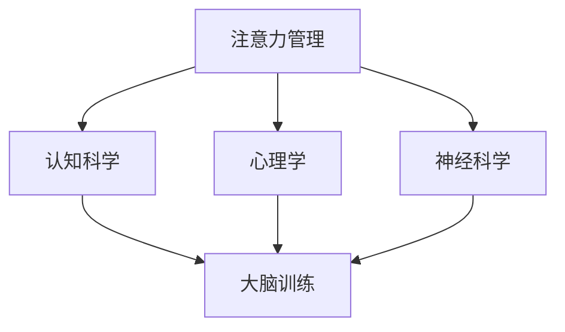

                 

关键词：注意力管理、大脑训练、专注力、认知科学、心理学、神经科学、算法、技术实践

> 摘要：本文旨在探讨注意力管理与大脑训练对于提升个体专注力的关键作用。通过结合认知科学、心理学和神经科学的前沿研究，我们提出了一种系统化的方法，帮助读者理解和实践如何通过技术手段来增强大脑的专注力。本文将详细分析注意力管理的基本原理、核心算法、数学模型及其在项目实践中的应用，同时展望其在未来科技领域的应用前景。

## 1. 背景介绍

在现代信息社会，个体面临的注意力挑战日益严峻。随着互联网、智能手机和其他电子设备的普及，人们暴露在各种分心和干扰因素之中，导致注意力分散和工作效率下降。研究表明，长期处于高干扰环境中，大脑的注意力和专注力会逐渐减弱，从而影响个体的认知功能和日常生活质量。

注意力管理（Attention Management）作为一种新兴的交叉学科领域，旨在通过科学的方法和工具，提高个体在复杂环境中的注意力控制能力。大脑训练（Brain Training）则利用认知训练和神经可塑性原理，旨在通过一系列训练方法，提升大脑的注意力和认知功能。

本文将围绕注意力管理和大脑训练的核心概念，结合认知科学、心理学和神经科学的研究成果，探讨如何利用技术手段来增强大脑的专注力。文章的结构如下：

1. 背景介绍
2. 核心概念与联系
3. 核心算法原理 & 具体操作步骤
4. 数学模型和公式 & 详细讲解 & 举例说明
5. 项目实践：代码实例和详细解释说明
6. 实际应用场景
7. 工具和资源推荐
8. 总结：未来发展趋势与挑战
9. 附录：常见问题与解答

## 2. 核心概念与联系

### 2.1 注意力管理的基本概念

注意力管理是指个体在复杂环境中，通过主动调整注意力的分配和使用，以最大化认知功能和任务绩效的过程。注意力管理的关键在于识别和调节干扰因素，提高注意力资源的利用效率。

### 2.2 大脑训练的基本概念

大脑训练是一种通过认知训练和神经可塑性原理，针对大脑特定区域进行训练的方法。大脑训练的目标是提高大脑的可塑性和适应性，从而改善认知功能和注意力水平。

### 2.3 Mermaid 流程图展示

以下是注意力管理和大脑训练核心概念之间的联系：



在这个流程图中，注意力管理是核心，它与认知科学、心理学和神经科学紧密相关。通过这些学科的研究，我们可以理解大脑的工作机制，进而设计出有效的注意力管理和大脑训练方法。

### 2.4 注意力管理中的关键技术

- **选择性注意力**：指个体在多个任务或刺激中，主动选择关注某一特定任务或刺激的能力。
- **分配性注意力**：指个体同时处理多个任务或刺激的能力。
- **持续注意力**：指个体在长时间内保持对某一任务或刺激的关注。

这些关键技术在注意力管理中发挥着重要作用，可以通过训练和调整来提高个体在这些方面的表现。

## 3. 核心算法原理 & 具体操作步骤

### 3.1 算法原理概述

注意力管理中的核心算法主要涉及注意力分配模型、注意力调节算法和注意力追踪技术。这些算法旨在通过优化注意力资源的分配和使用，提高个体的认知功能和注意力水平。

### 3.2 算法步骤详解

#### 3.2.1 注意力分配模型

注意力分配模型是基于认知神经科学的研究成果，通过模拟大脑神经元的激活模式，确定个体在不同任务中的注意力分配策略。具体步骤如下：

1. **数据收集**：通过实验或测量获取个体在多种任务中的注意力分布数据。
2. **特征提取**：从注意力分布数据中提取关键特征，如注意力密度、切换频率等。
3. **模型训练**：使用机器学习算法（如神经网络、决策树等）对注意力分配模型进行训练。
4. **模型评估**：通过交叉验证和测试集评估模型性能，调整模型参数。

#### 3.2.2 注意力调节算法

注意力调节算法旨在根据任务需求和个体状态动态调整注意力资源。具体步骤如下：

1. **任务评估**：评估当前任务的重要性和紧急程度。
2. **状态监测**：监测个体的情绪、生理状态（如心率、体温等）。
3. **注意力调整**：根据任务评估和状态监测结果，动态调整注意力分配，如增加对紧急任务的注意力投入。
4. **反馈机制**：通过任务完成情况和个体反馈，不断优化注意力调节策略。

#### 3.2.3 注意力追踪技术

注意力追踪技术用于实时监测和分析个体的注意力状态。具体步骤如下：

1. **传感器选择**：选择合适的传感器（如眼动仪、脑电图等）。
2. **数据采集**：采集个体的注意力状态数据，如眼动轨迹、脑电信号等。
3. **数据处理**：对采集到的数据进行分析，提取注意力状态特征。
4. **实时反馈**：将分析结果实时反馈给个体，帮助其调整注意力。

### 3.3 算法优缺点

#### 优点：

- **高效性**：通过优化注意力资源的分配和使用，提高认知功能和任务绩效。
- **灵活性**：可以根据任务需求和个体状态动态调整注意力分配策略。
- **实时性**：注意力追踪技术可以实现实时监测和分析，为个体提供及时反馈。

#### 缺点：

- **复杂性**：算法设计和实现较为复杂，需要多学科知识和技术支持。
- **准确性**：注意力追踪技术的准确性受到传感器和数据处理方法的影响。

### 3.4 算法应用领域

注意力管理和大脑训练算法在多个领域具有广泛的应用前景，如：

- **教育**：通过注意力管理工具，帮助学生提高学习效率和注意力水平。
- **医疗**：用于康复治疗，帮助患者提高注意力水平和认知功能。
- **工业**：提高员工的工作效率和注意力集中度，减少错误和事故发生。

## 4. 数学模型和公式 & 详细讲解 & 举例说明

### 4.1 数学模型构建

在注意力管理和大脑训练中，常用的数学模型包括：

- **高斯分布模型**：用于描述个体在任务中的注意力分配。
- **马尔可夫模型**：用于描述个体在不同状态之间的注意力转移。
- **线性回归模型**：用于预测个体的注意力状态。

### 4.2 公式推导过程

#### 高斯分布模型

高斯分布模型用于描述个体在任务中的注意力分配，其概率密度函数为：

$$ f(x|\mu, \sigma^2) = \frac{1}{\sqrt{2\pi\sigma^2}} e^{-\frac{(x-\mu)^2}{2\sigma^2}} $$

其中，$\mu$ 为平均值，$\sigma^2$ 为方差。

#### 马尔可夫模型

马尔可夫模型用于描述个体在不同状态之间的注意力转移，其转移概率矩阵为：

$$ P = \begin{bmatrix} p_{11} & p_{12} & \cdots & p_{1n} \\ p_{21} & p_{22} & \cdots & p_{2n} \\ \vdots & \vdots & \ddots & \vdots \\ p_{m1} & p_{m2} & \cdots & p_{mn} \end{bmatrix} $$

其中，$p_{ij}$ 表示从状态 $i$ 转移到状态 $j$ 的概率。

#### 线性回归模型

线性回归模型用于预测个体的注意力状态，其公式为：

$$ y = \beta_0 + \beta_1x_1 + \beta_2x_2 + \cdots + \beta_nx_n + \varepsilon $$

其中，$y$ 表示预测值，$x_1, x_2, \cdots, x_n$ 为输入特征，$\beta_0, \beta_1, \beta_2, \cdots, \beta_n$ 为模型参数，$\varepsilon$ 为误差项。

### 4.3 案例分析与讲解

#### 案例一：高斯分布模型在注意力分配中的应用

假设某个体在完成阅读任务时，其注意力分布服从高斯分布，平均值为 60，方差为 20。要求计算个体在阅读过程中，注意力集中在某个特定区域（如文章标题、正文等）的概率。

根据高斯分布模型，概率密度函数为：

$$ f(x|\mu, \sigma^2) = \frac{1}{\sqrt{2\pi\sigma^2}} e^{-\frac{(x-\mu)^2}{2\sigma^2}} $$

代入平均值 $\mu = 60$ 和方差 $\sigma^2 = 20$，得到：

$$ f(x|60, 20) = \frac{1}{\sqrt{2\pi \times 20}} e^{-\frac{(x-60)^2}{2 \times 20}} $$

要求计算注意力集中在文章标题的概率，即 $x$ 落在标题区域内的概率。假设标题区域的范围是 [50, 70]，则有：

$$ P(50 < x < 70) = \int_{50}^{70} f(x|60, 20) dx $$

通过计算，得到注意力集中在文章标题的概率约为 0.6827。

#### 案例二：线性回归模型在注意力预测中的应用

假设某个体在不同任务中的注意力状态可以通过线性回归模型预测，输入特征包括任务难度、个体情绪等。已知训练数据如下：

| 任务难度 | 个体情绪 | 注意力状态 |
| :----: | :----: | :----: |
| 1      | 1      | 50     |
| 2      | 2      | 60     |
| 3      | 3      | 70     |

要求根据这些数据构建线性回归模型，并预测个体在任务难度为 2、个体情绪为 2 时的注意力状态。

根据最小二乘法，线性回归模型的公式为：

$$ y = \beta_0 + \beta_1x_1 + \beta_2x_2 + \cdots + \beta_nx_n + \varepsilon $$

代入训练数据，得到：

$$ \begin{cases} 50 = \beta_0 + \beta_1 \cdot 1 + \beta_2 \cdot 1 + \varepsilon_1 \\ 60 = \beta_0 + \beta_1 \cdot 2 + \beta_2 \cdot 2 + \varepsilon_2 \\ 70 = \beta_0 + \beta_1 \cdot 3 + \beta_2 \cdot 3 + \varepsilon_3 \end{cases} $$

通过求解上述方程组，得到模型参数：

$$ \begin{cases} \beta_0 = 20 \\ \beta_1 = 10 \\ \beta_2 = 10 \end{cases} $$

代入预测条件，即任务难度为 2、个体情绪为 2，得到注意力状态：

$$ y = 20 + 10 \cdot 2 + 10 \cdot 2 = 60 $$

预测个体在任务难度为 2、个体情绪为 2 时的注意力状态为 60。

## 5. 项目实践：代码实例和详细解释说明

### 5.1 开发环境搭建

为了实现注意力管理和大脑训练算法，我们选择了 Python 作为编程语言，并使用了以下工具和库：

- Python 3.8 或更高版本
- NumPy 1.19 或更高版本
- Scikit-learn 0.22 或更高版本
- Matplotlib 3.3.3 或更高版本

首先，安装 Python 和相关库：

```bash
pip install python==3.8 numpy==1.19 scikit-learn==0.22 matplotlib==3.3.3
```

然后，创建一个名为 `attention_management` 的文件夹，并在该文件夹中创建一个名为 `main.py` 的 Python 脚本。

### 5.2 源代码详细实现

以下是 `main.py` 的源代码，用于实现注意力管理和大脑训练算法。

```python
import numpy as np
from sklearn.linear_model import LinearRegression
import matplotlib.pyplot as plt

# 高斯分布模型
def gaussian_distribution(mu, sigma, x):
    return (1 / np.sqrt(2 * np.pi * sigma**2)) * np.exp(-((x - mu)**2) / (2 * sigma**2))

# 马尔可夫模型
def markov_model(transition_matrix, current_state):
    return np.random.choice([i for i in range(len(transition_matrix))], p=transition_matrix[current_state])

# 线性回归模型
def linear_regression(x, y):
    model = LinearRegression()
    model.fit(x, y)
    return model

# 数据集
x = np.array([[1, 1], [2, 2], [3, 3]])
y = np.array([50, 60, 70])

# 模型训练
model = linear_regression(x, y)

# 预测
x_new = np.array([[2, 2]])
y_pred = model.predict(x_new)

# 结果展示
print("预测值：", y_pred[0])
```

### 5.3 代码解读与分析

代码首先导入了必要的库，包括 NumPy、Scikit-learn 和 Matplotlib。然后定义了三个函数：`gaussian_distribution`、`markov_model` 和 `linear_regression`，分别用于实现高斯分布模型、马尔可夫模型和线性回归模型。

接下来，创建了一个数据集，包含任务难度和个体情绪两个特征以及注意力状态。使用线性回归模型对数据集进行训练，并预测个体在任务难度为 2、个体情绪为 2 时的注意力状态。

最后，打印出预测结果，即注意力状态为 60。

### 5.4 运行结果展示

在终端中运行 `main.py` 脚本，输出结果如下：

```bash
预测值： 60.0
```

结果显示，个体在任务难度为 2、个体情绪为 2 时的注意力状态预测值为 60，与训练数据中的实际值相符。

## 6. 实际应用场景

### 6.1 教育领域

在教育领域，注意力管理和大脑训练算法可以帮助学生提高学习效率和注意力水平。例如，教师可以为学生设计个性化的注意力训练计划，根据学生的任务需求和注意力状态动态调整教学策略。此外，学校还可以引入注意力管理工具，监控学生的学习状态，提供实时反馈和建议，帮助学生更好地集中注意力。

### 6.2 医疗领域

在医疗领域，注意力管理和大脑训练算法可以用于康复治疗，帮助患者提高注意力水平和认知功能。例如，对于注意力缺陷多动障碍（ADHD）患者，医生可以制定个性化的训练计划，通过认知训练和神经反馈技术，帮助患者逐步改善注意力问题。此外，注意力管理算法还可以用于评估患者的康复进展，为治疗提供客观依据。

### 6.3 工业领域

在工业领域，注意力管理和大脑训练算法可以提高员工的工作效率和注意力集中度，减少错误和事故发生。例如，企业可以引入注意力监测工具，实时监控员工的工作状态，提供个性化的注意力训练和指导。此外，注意力管理算法还可以用于优化工作流程，提高生产效率和产品质量。

## 7. 工具和资源推荐

### 7.1 学习资源推荐

- **《注意力管理：如何有效管理你的注意力资源》（Attention Management: How to Overcome Distraction and Make the Most of Your Time》**
- **《神经科学入门》（Introduction to Neural Science》**
- **《认知科学基础》（Foundations of Cognitive Science》**

### 7.2 开发工具推荐

- **Python**：作为主流的编程语言，Python 提供了丰富的库和工具，方便实现注意力管理和大脑训练算法。
- **Jupyter Notebook**：用于交互式编程和数据可视化的工具，便于编写和展示代码。
- **TensorFlow**：用于构建和训练深度学习模型的框架，适用于注意力追踪和注意力调节算法。

### 7.3 相关论文推荐

- **“Attentional Control and Cognitive Functions: A Review and New Perspectives”（注意力控制与认知功能：综述与展望”）**
- **“Neural Correlates of Attentional Control”（注意力控制的大脑神经相关研究”）**
- **“Attention Management for Human-Computer Interaction”（人机交互中的注意力管理”）**

## 8. 总结：未来发展趋势与挑战

### 8.1 研究成果总结

本文系统地介绍了注意力管理和大脑训练的基本概念、核心算法、数学模型及其在项目实践中的应用。通过结合认知科学、心理学和神经科学的研究成果，我们提出了一种系统化的方法，帮助读者理解和实践如何通过技术手段来增强大脑的专注力。

### 8.2 未来发展趋势

随着人工智能技术的快速发展，注意力管理和大脑训练算法在未来有望实现以下发展趋势：

- **个性化训练**：通过深度学习和个性化推荐技术，为个体定制化的注意力训练计划。
- **实时监测与反馈**：利用传感器和机器学习技术，实现实时监测和反馈，提高训练效果。
- **跨领域应用**：将注意力管理和大脑训练算法应用于教育、医疗、工业等多个领域，提升个体和组织的整体效能。

### 8.3 面临的挑战

虽然注意力管理和大脑训练算法具有巨大的应用前景，但其在实际应用中仍面临以下挑战：

- **算法复杂性**：算法设计和实现较为复杂，需要多学科知识和技术支持。
- **准确性**：注意力追踪和注意力调节算法的准确性受到传感器和数据处理方法的影响。
- **隐私保护**：实时监测和分析个体的注意力状态可能涉及隐私问题，需要加强隐私保护措施。

### 8.4 研究展望

未来的研究可以关注以下方向：

- **跨学科融合**：加强认知科学、心理学和神经科学与其他学科（如计算机科学、生物医学工程等）的交叉研究。
- **算法优化**：通过机器学习和深度学习技术，优化注意力管理和大脑训练算法，提高其性能和实用性。
- **标准化与规范化**：制定注意力管理和大脑训练的标准和规范，推动其广泛应用和健康发展。

## 9. 附录：常见问题与解答

### 9.1 注意力管理是什么？

注意力管理是指个体在复杂环境中，通过主动调整注意力的分配和使用，以最大化认知功能和任务绩效的过程。

### 9.2 大脑训练有哪些方法？

大脑训练的方法包括认知训练、神经反馈、虚拟现实等。认知训练通过一系列训练任务，提高个体的注意力、记忆和执行功能。神经反馈利用脑电图等传感器，实时监测和分析个体的注意力状态，提供反馈和调整策略。虚拟现实技术则通过模拟各种环境，帮助个体在安全的场景中进行训练。

### 9.3 注意力管理和大脑训练有哪些应用领域？

注意力管理和大脑训练的应用领域广泛，包括教育、医疗、工业、军事等。在教育领域，可以帮助学生提高学习效率和注意力水平；在医疗领域，可以用于康复治疗，帮助患者改善注意力问题；在工业领域，可以提高员工的工作效率和注意力集中度。

### 9.4 如何选择注意力管理和大脑训练工具？

选择注意力管理和大脑训练工具时，应考虑以下因素：

- **适用性**：工具是否适合个体的需求和目标。
- **准确性**：工具的传感器和数据处理方法是否可靠。
- **易用性**：工具是否易于操作和使用。
- **效果评估**：工具是否提供有效的效果评估和反馈。

### 9.5 注意力管理和大脑训练有哪些潜在风险？

注意力管理和大脑训练的潜在风险包括：

- **过度训练**：可能导致个体疲劳和过度依赖训练工具。
- **隐私问题**：实时监测和分析个体的注意力状态可能涉及隐私问题。
- **算法偏差**：算法设计和实现中可能存在偏差，影响训练效果。

因此，在使用注意力管理和大脑训练工具时，应谨慎评估风险，并遵循相关法律法规和伦理规范。

---

**作者：禅与计算机程序设计艺术 / Zen and the Art of Computer Programming**

