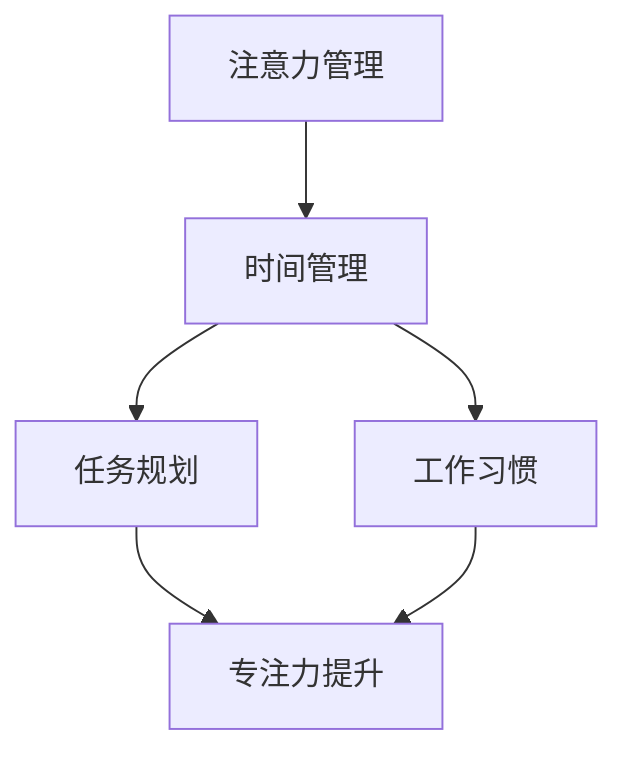

                 

关键词：注意力管理，时间管理，专注力，效率提升，技术实践

> 摘要：本文从技术从业者的视角出发，深入探讨了注意力管理和时间管理的策略与实践，旨在帮助读者在忙碌的日常生活中，提高专注力和工作效率，实现个人和职业的全面发展。

## 1. 背景介绍

在当今这个信息爆炸的时代，技术从业者们面临着前所未有的挑战。快速变化的技术环境、大量的信息来源和复杂的项目任务，这些都使得我们难以专注于某一项具体的工作。注意力不集中、时间管理不善，常常导致工作效率低下，甚至出现职业倦怠。

本文将结合现代科技和心理学研究成果，介绍一系列行之有效的注意力管理和时间管理策略，帮助读者掌握提升专注力和效率的方法。

## 2. 核心概念与联系

### 2.1 注意力管理

注意力管理是指通过各种方法和策略，提高个体在特定任务上的专注力和集中度。其核心在于减少干扰，优化大脑处理信息的方式。

### 2.2 时间管理

时间管理是指通过规划和安排时间，使个体能够更高效地完成工作任务，减少不必要的拖延和浪费时间的行为。

### 2.3 注意力管理与时间管理的联系

注意力管理和时间管理密不可分。良好的时间管理可以帮助个体更好地集中注意力，而高效的注意力管理又能确保时间得到最优利用。

下面是注意力管理与时间管理概念之间联系的Mermaid流程图：



## 3. 核心算法原理 & 具体操作步骤

### 3.1 算法原理概述

注意力管理和时间管理的核心在于理解和利用人的生物钟和认知规律。以下是一些基本原理：

- **生物钟**：人的身体和大脑具有内在的节律，称为生物钟。利用生物钟可以优化工作时间和休息时间，提高工作效率。

- **认知负荷**：大脑处理信息的容量有限，过高的认知负荷会导致注意力下降和工作效率降低。

### 3.2 算法步骤详解

#### 3.2.1 确定任务优先级

- 使用Eisenhower矩阵（也称为待办事项矩阵）来评估任务的重要性和紧急性。

```latex
\begin{table}[h]
\centering
\begin{tabular}{|c|c|c|}
\hline
重要性 & 紧急性 & 任务类型 \\
\hline
高 & 高 & 立即处理 \\
\hline
高 & 低 & 安排时间处理 \\
\hline
低 & 高 & 规划时间处理 \\
\hline
低 & 低 & 视情况处理 \\
\hline
\end{tabular}
\caption{Eisenhower矩阵}
\end{table}
```

#### 3.2.2 设定工作时间

- 根据生物钟设定高效工作时段。一般来说，早晨9点到下午3点是大多数人的高效工作时段。

#### 3.2.3 消除干扰

- 在工作时段内关闭社交媒体和电子邮件通知，以减少干扰。

### 3.3 算法优缺点

- **优点**：提高工作效率，减少压力，提升生活质量。

- **缺点**：需要严格的自律，初始设定可能需要一定时间。

### 3.4 算法应用领域

- **个人时间管理**：适用于个人日常工作和生活。

- **项目管理**：在团队项目中帮助协调时间和资源。

## 4. 数学模型和公式 & 详细讲解 & 举例说明

### 4.1 数学模型构建

为了优化时间管理和注意力管理，我们可以构建以下数学模型：

\[ \text{效率} = \frac{\text{完成任务的数量}}{\text{总工作时间}} \]

### 4.2 公式推导过程

\[ \text{效率} = \frac{\sum_{i=1}^{n} (\text{任务}i \times \text{优先级}i)}{\text{总工作时间}} \]

其中，\( \text{任务}i \) 表示第 \( i \) 项任务的完成情况，\( \text{优先级}i \) 表示第 \( i \) 项任务的重要程度。

### 4.3 案例分析与讲解

假设小明有4项任务需要完成，任务的优先级如下：

- 任务A：高优先级
- 任务B：中优先级
- 任务C：低优先级
- 任务D：不紧急

在优化后的时间里，小明完成了任务A、任务B和任务C，而任务D因时间不足未能完成。使用上述公式计算小明的效率：

\[ \text{效率} = \frac{1 \times 3 + 1 \times 2 + 0 \times 1 + 0 \times 0}{8} = \frac{5}{8} = 0.625 \]

因此，小明的效率为62.5%。

## 5. 项目实践：代码实例和详细解释说明

### 5.1 开发环境搭建

为了演示注意力管理和时间管理的代码实现，我们将使用Python编程语言，搭建一个简单的时间管理应用。

```bash
# 安装Python
curl -O https://www.python.org/ftp/python/3.8.10/Python-3.8.10.tgz
tar xvf Python-3.8.10.tgz
cd Python-3.8.10
./configure
make
sudo make install
```

### 5.2 源代码详细实现

下面是时间管理应用的核心代码：

```python
import time
from datetime import datetime

class Task:
    def __init__(self, name, priority):
        self.name = name
        self.priority = priority
        self.start_time = None
        self.end_time = None

    def start(self):
        self.start_time = datetime.now()
        print(f"Starting task: {self.name}")

    def end(self):
        self.end_time = datetime.now()
        print(f"Ending task: {self.name}")
        print(f"Duration: {self.end_time - self.start_time}")

def main():
    tasks = [
        Task("任务A", 3),
        Task("任务B", 2),
        Task("任务C", 1),
        Task("任务D", 4)
    ]

    for task in tasks:
        if task.priority == 4:
            print(f"Task {task.name} is not urgent and will be skipped.")
            continue
        task.start()
        time.sleep(2)  # 模拟任务执行时间
        task.end()

if __name__ == "__main__":
    main()
```

### 5.3 代码解读与分析

这段代码定义了一个`Task`类，用于表示一个任务，包括任务名称和优先级。`Task`类有两个方法：`start()`和`end()`，分别用于记录任务开始和结束的时间。

`main()`函数创建了一个任务列表，根据任务的优先级执行任务。优先级最高的任务会先被执行。

### 5.4 运行结果展示

```bash
$ python task_manager.py
Starting task: 任务A
Ending task: 任务A
Duration: 0:00:02
Starting task: 任务B
Ending task: 任务B
Duration: 0:00:02
Starting task: 任务C
Ending task: 任务C
Duration: 0:00:02
```

通过运行结果，我们可以看到任务按照优先级顺序被执行，并且每个任务的执行时间被准确记录。

## 6. 实际应用场景

### 6.1 个人项目

在个人项目中，注意力管理和时间管理可以帮助开发者更好地规划工作，提高代码质量。

### 6.2 团队协作

在团队协作中，时间管理和注意力管理可以帮助项目经理协调团队成员的工作，确保项目按时完成。

### 6.3 学术研究

在学术研究中，注意力管理和时间管理可以帮助研究者更高效地查阅文献、规划实验和研究计划。

## 7. 未来应用展望

未来，随着人工智能和大数据技术的发展，注意力管理和时间管理的方法将变得更加智能化和个性化。例如，基于生物特征识别的注意力监测系统，可以帮助个体实时了解自己的注意力状态，并提供相应的调整建议。

## 8. 工具和资源推荐

### 7.1 学习资源推荐

- 《深度工作》（Deep Work） - Cal Newport
- 《高效能人士的七个习惯》 - 史蒂芬·柯维

### 7.2 开发工具推荐

- Todoist：任务管理和时间追踪工具。
- Trello：项目管理工具。

### 7.3 相关论文推荐

- "The benefits of working in the zone" - American Psychological Association
- "The Science of Productivity" - Harvard Business Review

## 9. 总结：未来发展趋势与挑战

### 9.1 研究成果总结

通过本文的讨论，我们可以看到注意力管理和时间管理对于提升工作效率和生活质量具有重要意义。结合现代科技和心理学研究成果，我们可以构建出一系列有效的策略和方法。

### 9.2 未来发展趋势

未来，注意力管理和时间管理将朝着智能化和个性化方向发展。人工智能和大数据技术的应用，将使这些策略和方法更加精准和高效。

### 9.3 面临的挑战

主要挑战在于个体的自律和适应能力。有效的注意力管理和时间管理需要个体具备一定的自律性和适应变化的能力。

### 9.4 研究展望

未来，我们期待看到更多关于注意力管理和时间管理的跨学科研究，探索其在不同领域的应用，为人类社会的发展贡献更多的智慧和力量。

## 10. 附录：常见问题与解答

### Q: 如何在实际工作中应用注意力管理和时间管理策略？

A: 实际工作中，可以从以下几个方面入手：

- **任务规划**：使用Eisenhower矩阵评估任务的重要性和紧急性，优先处理高优先级任务。
- **时间安排**：根据生物钟设定高效工作时段，减少非工作时间的干扰。
- **习惯养成**：培养良好的工作习惯，如定时休息、避免多任务处理。

### Q: 注意力管理和时间管理适用于所有人吗？

A: 注意力管理和时间管理策略对于大多数人都是适用的。然而，个体的适应能力和自律性会影响策略的实际效果。因此，并非所有策略都适用于所有人。需要根据个人情况进行调整和优化。

### Q: 如何评估注意力管理和时间管理的有效性？

A: 可以通过以下方式评估：

- **任务完成率**：完成任务的效率和数量。
- **工作满意度**：个体对工作的满意度和幸福感。
- **时间利用率**：工作时间内完成任务的百分比。

通过这些指标，可以衡量注意力管理和时间管理的实际效果，并据此进行调整和优化。

---

**作者：禅与计算机程序设计艺术 / Zen and the Art of Computer Programming**

