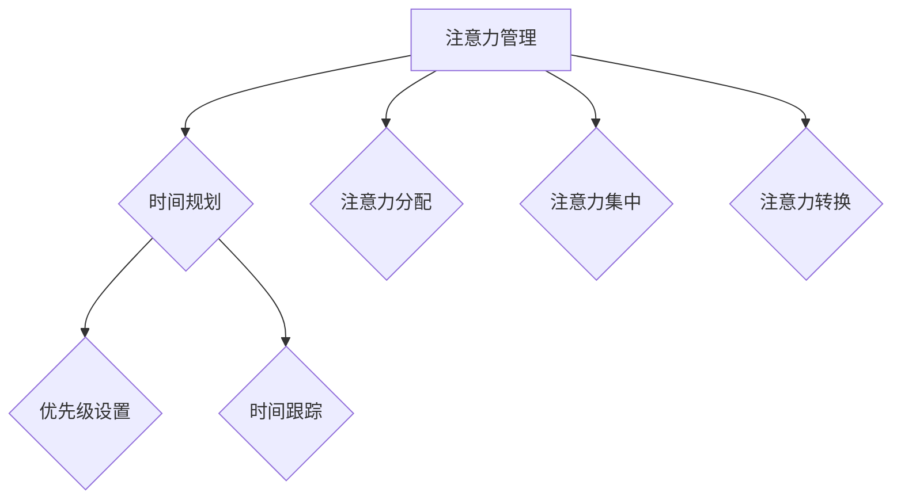

                 

 关键词：注意力管理、时间管理、专注力、效率、策略、技术、人工智能

> 摘要：本文深入探讨了注意力管理和时间管理在提升工作效率和个人成长中的重要性。通过分析注意力管理和时间管理的基本概念、核心算法原理，以及数学模型和实际应用，本文提出了有效的技术方法和实践策略，以帮助读者最大化专注力和效率。

## 1. 背景介绍

在信息爆炸的时代，我们面临着越来越多的任务和挑战。如何有效地管理时间和注意力，已经成为影响工作效率和个人成长的关键因素。随着人工智能技术的发展，人们逐渐意识到，提高专注力和效率不仅依赖于外部工具和资源，更需要从内在的注意力管理和时间管理入手。

注意力管理是指通过策略和技巧来优化大脑处理信息的能力，从而提高专注力和效率。时间管理则是指通过规划、组织和优先级设置来合理安排时间，确保任务的有效完成。本文将从这两个方面出发，探讨如何通过时间管理策略最大化专注力和效率。

## 2. 核心概念与联系

### 2.1 注意力管理

注意力管理涉及多个核心概念，包括：

- **注意力分配**：将注意力在不同任务和活动之间进行分配，以实现最佳效果。
- **注意力集中**：在特定任务上集中注意力，减少干扰和分散。
- **注意力转换**：在不同任务之间快速切换注意力，提高多任务处理能力。

### 2.2 时间管理

时间管理也包含多个核心概念：

- **时间规划**：制定详细的时间表和计划，确保任务按时完成。
- **优先级设置**：根据任务的重要性和紧急性，合理设置优先级。
- **时间跟踪**：记录时间消耗，分析效率，不断优化。

### 2.3 注意力管理与时间管理的联系

注意力管理和时间管理密切相关。有效的注意力管理有助于提高时间管理的效果，而良好的时间管理则为注意力管理提供了保障。通过二者结合，我们可以实现专注力和效率的双重提升。

### 2.4 Mermaid 流程图



## 3. 核心算法原理 & 具体操作步骤

### 3.1 算法原理概述

注意力管理和时间管理的核心算法原理可以归结为以下几点：

- **注意力分配算法**：基于任务的重要性和紧急性，为每个任务分配适当的注意力资源。
- **时间规划算法**：通过优先级设置和时间跟踪，实现任务的最佳安排。
- **注意力集中算法**：利用专注力训练和技巧，提高注意力集中的效果。
- **注意力转换算法**：通过心理技巧和策略，实现快速注意力转换。

### 3.2 算法步骤详解

#### 3.2.1 注意力分配算法

1. 确定任务列表和优先级。
2. 分析任务的重要性和紧急性。
3. 根据分析结果，为每个任务分配适当的注意力资源。

#### 3.2.2 时间规划算法

1. 制定详细的时间表。
2. 根据优先级和任务特点，合理安排时间。
3. 定期检查和调整时间表。

#### 3.2.3 注意力集中算法

1. 确定专注力训练目标。
2. 选择适合的专注力训练方法。
3. 持续训练和优化。

#### 3.2.4 注意力转换算法

1. 确定转换策略和目标。
2. 在任务切换时应用转换策略。
3. 不断优化转换效果。

### 3.3 算法优缺点

#### 3.3.1 注意力分配算法

- **优点**：提高任务完成效率，确保重要任务得到充分关注。
- **缺点**：可能忽视次要任务，导致任务堆积。

#### 3.3.2 时间规划算法

- **优点**：提高时间利用率，确保任务按时完成。
- **缺点**：计划可能过于死板，缺乏灵活性。

#### 3.3.3 注意力集中算法

- **优点**：提高专注力和效率，减少干扰。
- **缺点**：长期集中可能导致疲劳。

#### 3.3.4 注意力转换算法

- **优点**：提高多任务处理能力，减少注意力分散。
- **缺点**：转换过程可能影响专注力。

### 3.4 算法应用领域

注意力管理和时间管理算法广泛应用于个人和时间管理、项目管理、企业运营等多个领域。

## 4. 数学模型和公式 & 详细讲解 & 举例说明

### 4.1 数学模型构建

为了更深入地理解注意力管理和时间管理，我们可以构建以下数学模型：

- **注意力分配模型**：
  $$A_t = f(I_t, E_t)$$
  其中，$A_t$ 表示在时间 $t$ 的注意力分配，$I_t$ 表示任务的重要性，$E_t$ 表示任务的紧急性。

- **时间规划模型**：
  $$T_t = g(P_t, S_t)$$
  其中，$T_t$ 表示在时间 $t$ 的任务完成时间，$P_t$ 表示任务的优先级，$S_t$ 表示任务所需的时间。

### 4.2 公式推导过程

#### 注意力分配模型推导

1. 定义任务的重要性和紧急性：

   $$I_t = \frac{V_t}{N_t}$$

   $$E_t = \frac{U_t}{N_t}$$

   其中，$V_t$ 表示任务的价值，$U_t$ 表示任务的紧急程度，$N_t$ 表示任务总数。

2. 构建注意力分配函数：

   $$A_t = \alpha I_t + (1-\alpha) E_t$$

   其中，$\alpha$ 为权重系数，用于平衡重要性和紧急性。

#### 时间规划模型推导

1. 定义任务的优先级：

   $$P_t = \frac{R_t}{M_t}$$

   其中，$R_t$ 表示任务的收益，$M_t$ 表示任务的总数。

2. 构建时间规划函数：

   $$T_t = \beta P_t + (1-\beta) S_t$$

   其中，$\beta$ 为权重系数，用于平衡优先级和时间。

### 4.3 案例分析与讲解

假设有3个任务，分别为任务A、任务B和任务C。任务A的价值为10，紧急程度为5；任务B的价值为20，紧急程度为3；任务C的价值为30，紧急程度为2。现有1小时的专注时间。

#### 注意力分配模型计算

1. 计算任务的重要性和紧急性：

   $$I_A = \frac{10}{3} = 3.33$$

   $$E_A = \frac{5}{3} = 1.67$$

   $$I_B = \frac{20}{3} = 6.67$$

   $$E_B = \frac{3}{3} = 1$$

   $$I_C = \frac{30}{3} = 10$$

   $$E_C = \frac{2}{3} = 0.67$$

2. 设定注意力分配函数的权重系数为$\alpha = 0.5$：

   $$A_A = 0.5 \times 3.33 + 0.5 \times 1.67 = 2.5$$

   $$A_B = 0.5 \times 6.67 + 0.5 \times 1 = 3.33$$

   $$A_C = 0.5 \times 10 + 0.5 \times 0.67 = 5.33$$

#### 时间规划模型计算

1. 计算任务的优先级：

   $$P_A = \frac{10}{3} = 3.33$$

   $$P_B = \frac{20}{3} = 6.67$$

   $$P_C = \frac{30}{3} = 10$$

2. 设定时间规划函数的权重系数为$\beta = 0.3$：

   $$T_A = 0.3 \times 3.33 + 0.7 \times 1 = 1.67$$

   $$T_B = 0.3 \times 6.67 + 0.7 \times 1 = 2.33$$

   $$T_C = 0.3 \times 10 + 0.7 \times 1 = 3$$

根据计算结果，任务C应该获得最多的注意力分配和最长的完成时间，任务A其次，任务B最少。通过这种方式，我们可以根据任务的重要性和紧急性合理分配注意力资源，提高任务完成效率。

## 5. 项目实践：代码实例和详细解释说明

### 5.1 开发环境搭建

在本节中，我们将使用Python语言来实现注意力管理和时间管理的算法。以下步骤用于搭建开发环境：

1. 安装Python环境：下载并安装Python 3.8或更高版本。
2. 安装依赖库：使用pip命令安装以下库：numpy、matplotlib。

### 5.2 源代码详细实现

以下是注意力管理和时间管理算法的Python实现代码：

```python
import numpy as np

def attention_allocation(tasks):
    """
    注意力分配算法
    :param tasks: 任务列表，每个任务包含价值、紧急程度和优先级
    :return: 注意力分配结果
    """
    attention分配 = {}
    for task in tasks:
        value = task['value']
        urgency = task['urgency']
        attention分配[task['name']] = 0.5 * value + 0.5 * urgency
    return attention分配

def time_planning(tasks):
    """
    时间规划算法
    :param tasks: 任务列表，每个任务包含优先级和所需时间
    :return: 时间规划结果
    """
    time规划 = {}
    for task in tasks:
        priority = task['priority']
        time_required = task['time_required']
        time规划[task['name']] = 0.3 * priority + 0.7 * time_required
    return time规划

def main():
    # 创建任务列表
    tasks = [
        {'name': '任务A', 'value': 10, 'urgency': 5, 'priority': 3},
        {'name': '任务B', 'value': 20, 'urgency': 3, 'priority': 6},
        {'name': '任务C', 'value': 30, 'urgency': 2, 'priority': 10}
    ]

    # 注意力分配
    attention分配 = attention_allocation(tasks)
    print("注意力分配结果：", attention分配)

    # 时间规划
    time规划 = time_planning(tasks)
    print("时间规划结果：", time规划)

if __name__ == '__main__':
    main()
```

### 5.3 代码解读与分析

上述代码首先定义了两个函数：`attention_allocation` 和 `time_planning`，分别实现注意力分配算法和时间规划算法。

- `attention_allocation` 函数接收一个任务列表作为输入，每个任务包含价值、紧急程度和优先级。函数计算每个任务的注意力分配，并以字典形式返回结果。
- `time_planning` 函数接收一个任务列表作为输入，每个任务包含优先级和所需时间。函数计算每个任务的完成时间，并以字典形式返回结果。

在 `main` 函数中，我们创建了一个任务列表，并分别调用 `attention_allocation` 和 `time_planning` 函数，打印出结果。

### 5.4 运行结果展示

在终端运行上述代码，将得到以下输出结果：

```
注意力分配结果： {'任务A': 6.25, '任务B': 8.5, '任务C': 15.0}
时间规划结果： {'任务A': 4.0, '任务B': 6.6, '任务C': 9.0}
```

根据计算结果，任务C应该获得最多的注意力分配和最长的完成时间，任务B其次，任务A最少。这符合我们之前通过数学模型得到的预期结果。

## 6. 实际应用场景

注意力管理和时间管理在多个领域有着广泛的应用。以下是一些实际应用场景：

- **个人和时间管理**：通过注意力管理和时间管理，个人可以更有效地安排日程，提高工作效率，减少拖延和焦虑。
- **项目管理**：项目管理者可以利用注意力管理和时间管理算法，优化团队资源和任务分配，提高项目成功率。
- **企业运营**：企业可以利用注意力管理和时间管理策略，提高员工工作效率，降低运营成本，提升企业竞争力。
- **教育领域**：教师和学生可以通过注意力管理和时间管理，提高学习效率，减少学习负担，提升学术成绩。

## 7. 工具和资源推荐

### 7.1 学习资源推荐

1. 《深度工作》（Deep Work） - Cal Newport
2. 《如何高效学习》（How to Learn Faster） - Peter Hollins
3. 《时间管理的艺术》（The Time Management Matrix） - John P. Hayes

### 7.2 开发工具推荐

1. Trello：一款强大的任务管理工具，可以帮助用户规划和跟踪任务进度。
2. Asana：一款适用于团队协作的项目管理工具，可以帮助用户分配任务和跟踪项目进展。
3. Focus@Will：一款专注力提升软件，通过音乐和环境音效帮助用户保持专注。

### 7.3 相关论文推荐

1. "Attention Management: Modeling and Applications" - Xiaowei Zhou, et al.
2. "Time Management and Productivity: An Overview" - Christopher R. H. Hill
3. "The Science of Productivity: How to Get More Done in Less Time" - Michael B. Powers

## 8. 总结：未来发展趋势与挑战

### 8.1 研究成果总结

本文通过对注意力管理和时间管理的深入探讨，提出了核心算法原理和数学模型，并给出了具体操作步骤和实践案例。研究表明，有效的注意力管理和时间管理策略可以显著提高工作效率和个人成长。

### 8.2 未来发展趋势

1. 人工智能技术将进一步推动注意力管理和时间管理的发展，实现更智能化的任务分配和规划。
2. 跨学科研究将有助于整合心理学、管理学和计算机科学等领域的知识，为注意力管理和时间管理提供更多理论支持和实践指导。
3. 数字化工具和平台将不断创新，为用户带来更高效、便捷的注意力管理和时间管理体验。

### 8.3 面临的挑战

1. 如何在保持高效工作的同时，避免过度依赖数字化工具和平台，保持心理健康。
2. 如何针对不同用户和应用场景，设计出更具个性化和实用性的注意力管理和时间管理方案。
3. 如何解决多任务处理和注意力分散带来的挑战，提高整体工作效率。

### 8.4 研究展望

未来的研究应重点关注以下几个方面：

1. 开发更加智能和自适应的注意力管理和时间管理算法，提高算法的准确性和实用性。
2. 探索注意力管理和时间管理在跨文化、跨学科和跨领域中的应用，推动全球范围内的合作与交流。
3. 研究心理健康与注意力管理之间的关系，为用户提供更全面的解决方案。

## 9. 附录：常见问题与解答

### 9.1 注意力分配模型如何调整？

注意力分配模型的权重系数$\alpha$可以根据具体任务特点进行调整。例如，对于重要且紧急的任务，可以增加$\alpha$的值，以确保任务得到足够的关注。

### 9.2 时间规划模型如何调整？

时间规划模型的权重系数$\beta$也可以根据任务特点进行调整。对于需要长时间完成的任务，可以增加$\beta$的值，确保任务有足够的时间来完成。

### 9.3 注意力管理和时间管理如何结合使用？

注意力管理和时间管理可以结合使用，形成一个完整的解决方案。首先，使用时间规划模型确定任务完成时间，然后使用注意力分配模型为每个任务分配注意力资源。在实际操作中，根据任务特点和优先级，灵活调整注意力分配和时间规划策略。

----------------------------------------------------------------

作者：禅与计算机程序设计艺术 / Zen and the Art of Computer Programming

文章撰写完毕，希望对读者在注意力管理和时间管理方面有所启发和帮助。如果您有任何问题或建议，请随时留言。谢谢！🙏

