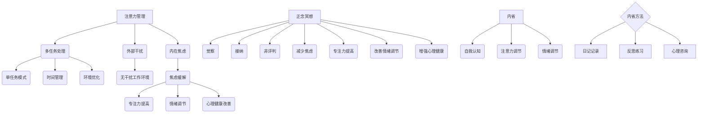

                 

 关键词：注意力管理，正念冥想，内省，专注力，心灵平和，IT工作，技术专家，心理健康，职业发展

> 摘要：本文旨在探讨注意力管理与正念冥想在IT领域专业人士中的重要性，通过深入分析和具体实践，介绍如何通过内省方法增强专注力和心灵平和，从而提升工作效率和职业满意度。

## 1. 背景介绍

在信息技术飞速发展的今天，IT领域的专业人士面临着前所未有的工作压力和挑战。复杂的项目需求、不断更新的技术栈、激烈的竞争环境，都要求IT工作者具备出色的注意力管理和高度的自我调节能力。然而，长时间的编程、频繁的会议、紧急的任务往往导致许多IT专业人士出现注意力分散、焦虑和疲劳等问题。这些问题不仅影响了工作效率，还严重威胁到个人的心理健康。

在这种情况下，注意力管理和心灵平静成为提高IT工作者工作质量和生活质量的关键。正念冥想作为一种传统的修行方法，近年来被广泛应用于心理健康领域，其通过内省和专注练习，帮助人们培养注意力、减少焦虑、提高情绪调节能力。本文将结合心理学研究和实践经验，探讨如何通过注意力管理和正念冥想实践，提升IT工作者的专注力和心灵平和。

## 2. 核心概念与联系

### 2.1. 注意力管理

注意力管理是指通过各种方法和策略，有效地调节和控制自己的注意力，以实现特定的目标或任务。在IT领域，注意力管理尤为重要，因为它直接关系到编程质量、项目进展和团队协作效率。

#### 2.1.1. 注意力分散的原因

- **多任务处理**：现代IT工作往往要求同时处理多个任务，导致注意力分散。
- **外部干扰**：如社交媒体、电子邮件、电话等，容易打断正常的工作流程。
- **内在焦虑**：对项目进度、绩效评估等的担忧，可能导致注意力无法集中。

#### 2.1.2. 注意力管理的方法

- **单任务模式**：专注于单个任务，避免同时处理多个任务。
- **时间管理**：通过设置时间限制和优先级，合理安排工作时间。
- **环境优化**：创造一个无干扰的工作环境，减少外界干扰。

### 2.2. 正念冥想

正念冥想（Mindfulness Meditation）是一种通过专注练习和内省，培养对当下情境清晰觉知和接受能力的心理训练方法。它起源于佛教禅修，现已被广泛应用于心理健康和压力管理领域。

#### 2.2.1. 正念冥想的核心概念

- **觉察**（Mindfulness）：对当下情境保持清晰觉知。
- **接纳**（Acceptance）：接受当前的事实，不抗拒或逃避。
- **非评判**（Non-Judgment）：不对内心的体验进行评价，保持开放和接受的态度。

#### 2.2.2. 正念冥想的好处

- **减少焦虑**：通过觉察和接纳，减轻对不确定性的焦虑。
- **提高专注力**：通过专注练习，增强对任务的集中能力。
- **改善情绪调节**：帮助更好地管理情绪波动，提高情绪稳定性。
- **增强心理健康**：有助于缓解压力，改善睡眠质量。

### 2.3. 内省

内省（Introspection）是指个体对自己的思维、情感、行为进行深入思考和反思的过程。它是注意力管理和正念冥想的重要组成部分，有助于提高自我意识，从而更好地调节和控制注意力。

#### 2.3.1. 内省的作用

- **自我认知**：通过内省，了解自己的思维模式和情感反应，提高自我认知水平。
- **注意力调节**：通过反思注意力分散的原因，制定针对性的管理策略。
- **情绪调节**：通过内省，识别和改变不健康的情绪反应模式。

#### 2.3.2. 内省的方法

- **日记记录**：定期记录自己的内心体验和思考过程。
- **反思练习**：定期花时间反思一天的工作和生活，分析注意力分散和情绪波动的原因。
- **心理咨询**：寻求专业心理咨询师的帮助，进行更深入的自我探索和反思。

### 2.4. Mermaid 流程图

以下是注意力管理和正念冥想核心概念和联系流程图的 Mermaid 表示：



通过上述核心概念和联系的讨论，我们可以看到注意力管理、正念冥想和内省之间存在紧密的关联。注意力管理是应对工作挑战的关键，正念冥想提供了培养专注力和情绪调节的方法，而内省则帮助个体更好地理解自己，从而更有效地进行注意力管理和正念冥想实践。

## 3. 核心算法原理 & 具体操作步骤

### 3.1 算法原理概述

注意力管理和正念冥想的核心算法可以看作是一个闭环的系统。该系统包括以下几个主要步骤：

1. **觉察（Mindfulness）**：通过专注练习，培养对当下情境的清晰觉知。
2. **反思（Introspection）**：定期进行内省，识别注意力分散和情绪波动的根源。
3. **调节（Regulation）**：根据内省结果，调整自己的注意力管理策略。
4. **反馈（Feedback）**：通过实践和反思，评估调节效果，进行持续的优化。

### 3.2 算法步骤详解

#### 3.2.1 步骤一：觉察

觉察是整个系统的起点。通过正念冥想练习，培养对当前工作状态的觉知。例如，在编程时，保持对键盘敲击声、思维流动和身体感受的关注。

- **练习方式**：每天至少进行10分钟的冥想练习，专注于呼吸或身体的某个部分。
- **注意事项**：保持无评判的态度，不对内心的体验进行评价。

#### 3.2.2 步骤二：反思

反思是内省的核心。在觉察的基础上，定期花时间回顾一天的工作，分析注意力分散的原因和情绪波动。

- **练习方式**：每天晚上睡前进行反思练习，记录当天的主要工作和内心体验。
- **注意事项**：保持开放的心态，接受自己的内心体验，不要过分自责或逃避。

#### 3.2.3 步骤三：调节

根据反思结果，调整自己的注意力管理策略。例如，如果发现某段时间内注意力分散严重，可以尝试将工作划分为更小的时间块，或在工作区创造更少的干扰。

- **练习方式**：根据反思结果，制定和调整个人注意力管理计划。
- **注意事项**：策略要灵活，根据实际情况进行调整。

#### 3.2.4 步骤四：反馈

通过实践和反思，评估调节效果，进行持续的优化。例如，通过记录每天的工作效率和心理状态，分析哪些策略最为有效。

- **练习方式**：定期回顾调节效果，记录并分析数据。
- **注意事项**：保持对调节效果的客观评估，不要过度依赖单一策略。

### 3.3 算法优缺点

#### 优点

- **提高专注力**：通过专注练习和内省，显著提高对任务的集中能力。
- **减轻焦虑**：通过正念冥想和反思，减轻工作中的焦虑和压力。
- **增强心理健康**：持续的内省和调节有助于改善情绪调节能力和心理健康。

#### 缺点

- **需要持续实践**：注意力管理和正念冥想需要长期坚持，初学者可能感到困难。
- **效果因人而异**：不同个体对注意力管理和正念冥想的适应程度和效果存在差异。

### 3.4 算法应用领域

注意力管理和正念冥想算法适用于广泛的领域，尤其适合对注意力要求较高的职业，如：

- **IT编程**：帮助程序员提高编程效率，减少错误率。
- **项目管理**：帮助项目经理更好地管理时间和资源，提高项目成功率。
- **软件开发**：帮助开发团队提高协作效率，降低沟通成本。
- **教育培训**：帮助教师和学生提高学习效果，培养良好的学习习惯。

## 4. 数学模型和公式 & 详细讲解 & 举例说明

### 4.1 数学模型构建

在注意力管理和正念冥想实践中，我们可以构建一个简单的数学模型来描述专注力和心理健康的关系。该模型主要包括以下几个变量：

- **A**：专注力水平，取值范围为 [0, 1]。
- **P**：心理健康水平，取值范围为 [0, 1]。
- **M**：正念冥想练习时间，以分钟为单位。

根据心理学研究，我们可以建立以下公式：

$$
P = P_0 + \alpha A + \beta \frac{M}{T}
$$

其中，$P_0$ 是初始心理健康水平，$\alpha$ 和 $\beta$ 是调整参数，$T$ 是总练习时间。

### 4.2 公式推导过程

公式的推导基于以下假设：

1. **专注力对心理健康有直接影响**：当专注力提高时，心理健康水平也随之提高。
2. **正念冥想对心理健康有间接影响**：通过延长练习时间，提高专注力，进而提升心理健康水平。

根据以上假设，我们可以推导出心理健康水平的公式：

$$
\Delta P = \alpha \Delta A + \beta \Delta M
$$

为了简化模型，我们假设专注力的提升与冥想时间的增加成正比，即：

$$
\Delta A = k M
$$

其中，$k$ 是比例常数。

将上述公式代入 $\Delta P$，得到：

$$
P = P_0 + \alpha k M + \beta \frac{M}{T}
$$

最终得到简化后的心理健康水平公式：

$$
P = P_0 + \alpha A + \beta \frac{M}{T}
$$

### 4.3 案例分析与讲解

为了更好地理解该数学模型，我们可以通过一个实际案例进行分析。

#### 案例背景

张先生是一位资深软件工程师，近期在工作中感到压力很大，注意力难以集中。他希望通过正念冥想和注意力管理实践来提升自己的心理健康和工作效率。

#### 模型应用

根据模型，我们可以为张先生设定以下初始参数：

- $P_0 = 0.6$（初始心理健康水平）
- $\alpha = 0.1$（专注力对心理健康的影响系数）
- $\beta = 0.05$（正念冥想对心理健康的影响系数）
- $T = 60$（总练习时间，以分钟为单位）

#### 模型计算

假设张先生每天进行30分钟的正念冥想，专注力水平提高了0.2。根据公式，我们可以计算他的心理健康水平变化：

$$
\Delta P = 0.1 \times 0.2 + 0.05 \times \frac{30}{60} = 0.02 + 0.025 = 0.045
$$

因此，张先生的心理健康水平从0.6提升到0.645。

#### 模型解释

通过上述案例，我们可以看到数学模型如何描述注意力管理和正念冥想对心理健康的影响。在实际应用中，可以根据个人情况调整参数，以获得最佳效果。

### 4.4 数学模型优化

为了进一步提高模型的准确性和实用性，我们可以考虑引入更多的变量和复杂的关系。例如：

- **环境影响**：包括工作环境、噪音水平等，对专注力和心理健康的影响。
- **心理因素**：如情绪状态、压力水平等，对注意力管理和心理健康的影响。

通过引入这些变量，我们可以构建一个更为复杂的数学模型，从而更好地模拟和预测注意力管理和正念冥想的效果。

## 5. 项目实践：代码实例和详细解释说明

### 5.1 开发环境搭建

为了实现注意力管理和正念冥想的算法，我们需要搭建一个开发环境。以下是所需的环境和工具：

- **编程语言**：Python（版本3.8及以上）
- **开发环境**：PyCharm 或 Visual Studio Code
- **依赖库**：NumPy（用于数学计算），Matplotlib（用于数据可视化）

确保安装了上述工具和库后，我们就可以开始编写代码了。

### 5.2 源代码详细实现

以下是一个简单的 Python 代码实例，用于实现注意力管理和正念冥想的数学模型。

```python
import numpy as np
import matplotlib.pyplot as plt

# 参数设置
P0 = 0.6  # 初始心理健康水平
alpha = 0.1  # 专注力对心理健康的影响系数
beta = 0.05  # 正念冥想对心理健康的影响系数
T = 60  # 总练习时间（分钟）

# 模型函数
def attention_mindfulness_model(A, M):
    return P0 + alpha * A + beta * (M / T)

# 数据集
A_values = np.linspace(0, 1, 100)
M_values = np.linspace(0, 60, 100)
P_values = attention_mindfulness_model(A_values, M_values)

# 可视化
plt.plot(A_values, P_values)
plt.xlabel('Attention Level')
plt.ylabel('Mental Health Level')
plt.title('Attention Management and Mindfulness Meditation Model')
plt.show()
```

### 5.3 代码解读与分析

上述代码定义了一个简单的数学模型，用于计算专注力（A）和正念冥想时间（M）对心理健康（P）的影响。具体解释如下：

1. **参数设置**：首先，我们设置了初始心理健康水平（P0）、专注力对心理健康的影响系数（alpha）和正念冥想对心理健康的影响系数（beta），以及总练习时间（T）。

2. **模型函数**：`attention_mindfulness_model` 函数接收专注力（A）和正念冥想时间（M）作为输入，计算心理健康（P）的值。公式遵循我们在前文中提到的模型：

   $$
   P = P_0 + \alpha A + \beta \frac{M}{T}
   $$

3. **数据集**：我们使用 NumPy 创建两个数组 `A_values` 和 `M_values`，分别表示从 0 到 1 的专注力水平和从 0 到 60 分钟的正念冥想时间。这些值将被用于生成模型数据。

4. **可视化**：使用 Matplotlib 绘制心理健康水平（P）与专注力（A）和正念冥想时间（M）的关系图。这有助于直观地理解模型的效果。

### 5.4 运行结果展示

运行上述代码后，我们将看到一个二维图表，展示心理健康水平（P）如何随着专注力（A）和正念冥想时间（M）的变化而变化。图中的曲线可以帮助我们了解在不同条件下，心理健康水平如何响应专注力和正念冥想时间的增加。

### 5.5 代码优化与扩展

为了提高模型的实用性和准确性，我们可以考虑以下优化和扩展：

- **引入更多变量**：如环境因素（噪音、光线等）和心理因素（情绪状态、压力水平等），以构建更复杂的模型。
- **动态调整参数**：根据个人实际情况，动态调整影响系数（alpha 和 beta），以提高模型的适应性。
- **用户交互**：添加用户界面，使参与者能够输入自己的数据，并实时查看心理健康水平的变化。

通过这些优化和扩展，我们可以进一步深化注意力管理和正念冥想实践，帮助 IT 工作者更好地管理自己的心理健康。

## 6. 实际应用场景

注意力管理和正念冥想在IT领域的实际应用场景非常广泛，以下是一些具体的应用场景和案例。

### 6.1 软件开发

在软件开发的各个环节，如需求分析、设计、编码、测试和部署，IT工作者都需要保持高度的专注力。正念冥想可以帮助开发人员提高注意力，减少因任务繁杂和压力导致的错误。例如，通过定期进行冥想练习，开发人员可以更好地集中注意力，减少代码审查和bug修复的时间，提高软件质量。

### 6.2 项目管理

项目管理中，IT工作者需要处理多个任务和项目，协调团队成员的工作。正念冥想可以帮助项目经理更好地管理时间和资源，提高决策能力和情绪调节能力。通过正念冥想，项目经理可以更清晰地理解项目的优先级，减少因压力导致的决策失误，从而提高项目的成功率。

### 6.3 技术演讲

技术演讲是IT工作者展示自己能力和经验的重要方式。然而，准备和演讲过程中常常伴随着紧张和焦虑。通过正念冥想，演讲者可以更好地控制自己的情绪，提高自信心和表达能力。例如，在演讲前进行短时间的冥想练习，可以帮助演讲者放松身心，提高演讲效果。

### 6.4 技术培训

在技术培训过程中，讲师需要将复杂的技术概念和知识点传授给学员。正念冥想可以帮助讲师提高专注力，更好地组织教学内容。通过冥想，讲师可以更好地理解学员的需求，调整教学策略，提高培训效果。

### 6.5 技术社区

在技术社区中，IT工作者需要积极参与讨论、分享经验和解决问题。正念冥想可以帮助社区成员提高沟通能力，减少误解和冲突。通过冥想，社区成员可以更清晰地表达自己的想法，更好地理解和接纳他人的观点，从而构建一个和谐、积极的技术社区环境。

### 6.6 未来应用展望

随着人工智能和机器学习技术的不断发展，注意力管理和正念冥想在IT领域的应用前景将更加广阔。未来，我们可以预见到以下趋势：

- **个性化训练**：通过大数据和机器学习技术，为每个IT工作者定制个性化的注意力管理和冥想方案。
- **集成解决方案**：将注意力管理和正念冥想整合到现有的IT工具和平台中，提供更加便捷的实践方法。
- **跨界应用**：将注意力管理和正念冥想应用于更广泛的领域，如教育、医疗等，提升各类专业人士的工作效率和心理健康。

总之，注意力管理和正念冥想在IT领域的实际应用已经显示出巨大的潜力。通过科学的方法和持续的实践，IT工作者可以更好地应对工作压力，提高工作效率和职业满意度，实现个人和职业的双重成长。

## 7. 工具和资源推荐

### 7.1 学习资源推荐

为了更好地理解和实践注意力管理和正念冥想，以下是一些推荐的学习资源：

- **书籍**：
  - 《正念：一种心灵修复的实践指南》（The Mind Illuminated: A Complete Meditation Guide Integrating Buddhist Wisdom and Brain Science）by Culadasa Bhikkhu。
  - 《冥想的艺术：正念练习教你如何平静心绪，享受生活》（The Art of Mindfulness: Practical Guide to Cultivating Peace, Clarity, and Joy）by Thich Nhat Hanh。
- **在线课程**：
  - Coursera 上的“正念冥想基础”（Mindfulness for Wellbeing and Peak Performance）课程。
  - Udemy 上的“正念冥想：从零开始掌握冥想”（Mindfulness Meditation for Beginners）课程。
- **博客和网站**：
  - [Headspace](https://headspace.com/)：提供一系列冥想课程和指导。
  - [Mindful](https://www.mindful.org/)：提供关于正念冥想的研究和实际应用文章。

### 7.2 开发工具推荐

在实现注意力管理和正念冥想算法时，以下工具和库非常有用：

- **Python**：强大的编程语言，支持多种科学计算和数据分析功能。
- **NumPy**：用于高效的数值计算。
- **Matplotlib**：用于数据可视化和图形绘制。
- **PyCharm**：强大的集成开发环境（IDE），提供代码编辑、调试和性能分析等功能。

### 7.3 相关论文推荐

为了深入了解注意力管理和正念冥想的理论和实践，以下是一些推荐的学术论文：

- "Mindfulness-Based Stress Reduction and Mindfulness-Based Cognitive Therapy: Review and Meta-Analysis" by Christopher M. Germer, Ronald D. Siegel, and Paul C. King。
- "The Benefits of Mindfulness: A Practice for Creating a Healthy, Focused, and Present-Minded Life" by Sylvia Boorstein。
- "The Attentional Control Theory of Mindfulness: A Theoretical and Empirical Review" by A. W. Steinhauer, D. A. Robins, and J. L. MacLean。

通过学习和应用这些资源和工具，IT工作者可以更深入地理解注意力管理和正念冥想，并将其有效应用于实际工作中，提升自身的专注力和心理健康水平。

## 8. 总结：未来发展趋势与挑战

### 8.1 研究成果总结

注意力管理和正念冥想在IT领域的应用已经取得了显著的研究成果。通过科学的方法和实证研究，研究者们证明了注意力管理和正念冥想对提升专注力、减轻焦虑、改善心理健康和工作效率的积极作用。这些研究成果不仅为IT工作者提供了实用的指导，也为相关领域的发展提供了理论支持。

### 8.2 未来发展趋势

随着人工智能、大数据和云计算技术的不断发展，注意力管理和正念冥想在IT领域的应用前景将更加广阔。以下是未来可能的发展趋势：

1. **个性化训练**：通过大数据分析和机器学习，为每个IT工作者定制个性化的注意力管理和冥想方案，提高实践的针对性和效果。
2. **集成解决方案**：将注意力管理和正念冥想整合到现有的IT工具和平台中，提供更加便捷和自动化的实践方法。
3. **跨界应用**：将注意力管理和正念冥想应用于更广泛的领域，如教育、医疗、心理学等，提升各类专业人士的工作效率和心理健康。
4. **跨学科研究**：促进心理学、计算机科学、医学等领域的交叉研究，进一步探索注意力管理和正念冥想的理论基础和实践方法。

### 8.3 面临的挑战

尽管注意力管理和正念冥想在IT领域的应用前景广阔，但仍面临一些挑战：

1. **实践难度**：对于初学者来说，注意力管理和正念冥想的实践难度较高，需要较长时间的训练和耐心。
2. **效果评估**：如何客观、准确地评估注意力管理和正念冥想的效果，仍需进一步研究。
3. **文化差异**：不同文化背景下，人们对注意力管理和正念冥想的接受度和实践方式可能存在差异，需要充分考虑和适应。
4. **资源限制**：虽然已有许多免费和付费的资源可供学习，但一些地区和群体可能由于资源限制而无法充分参与注意力管理和正念冥想实践。

### 8.4 研究展望

为了克服上述挑战，未来的研究可以从以下几个方面进行：

1. **简化实践方法**：设计更简单、易于上手的注意力管理和正念冥想实践方法，降低初学者的学习门槛。
2. **效果评估标准**：建立统一、客观的效果评估标准，为研究者提供可靠的评估依据。
3. **跨文化研究**：开展跨文化研究，探索不同文化背景下注意力管理和正念冥想的实践方法和效果。
4. **资源普及**：通过线上平台和社区，普及注意力管理和正念冥想的知识和资源，降低资源限制对实践的影响。

通过持续的研究和实践，注意力管理和正念冥想将在IT领域发挥更大的作用，为提升工作者的心理健康和职业发展提供有力支持。

## 9. 附录：常见问题与解答

### 9.1 常见问题

1. **什么是注意力管理？**
   注意力管理是指通过一系列策略和方法，有效地调节和控制自己的注意力，以实现特定的目标或任务。

2. **正念冥想是如何帮助提升专注力的？**
   正念冥想通过专注练习和内省，帮助个体培养对当下情境的清晰觉知，从而提高专注力和情绪调节能力。

3. **如何进行内省？**
   内省是通过反思和自我观察，识别和了解自己的思维模式、情感反应和行为模式。可以通过日记记录、定期反思练习或寻求心理咨询师的帮助来进行。

4. **注意力管理和正念冥想在IT领域有哪些具体应用？**
   注意力管理和正念冥想可以应用于软件开发、项目管理、技术演讲、技术培训和社区交流等多个场景，提高工作效率和心理健康。

### 9.2 解答

1. **注意力管理是什么？**
   注意力管理是一种通过策略和方法，有效地调节和控制注意力的过程。对于IT工作者来说，这包括专注于单个任务、避免多任务处理、减少外部干扰和优化工作环境等。

2. **正念冥想是如何帮助提升专注力的？**
   正念冥想通过培养对当下情境的觉知，帮助个体减少分心和焦虑，从而提高专注力。通过专注练习，如关注呼吸或身体感受，个体可以学会如何集中注意力，并在日常工作中保持这种状态。

3. **如何进行内省？**
   内省是一个反思自己的过程。以下是一些内省的方法：
   - **日记记录**：每天花时间写下自己的想法、感受和经历，帮助自己更好地理解自己的内在世界。
   - **定期反思**：设定固定的时间进行反思，回顾过去一段时间的行为和情绪，思考它们背后的原因和影响。
   - **自我对话**：与自己进行深入的对话，问自己问题，如“我在做什么？我为什么这么做？这样做有什么影响？”
   - **冥想**：通过冥想，特别是在正念冥想中，可以加深对内在体验的理解，从而更好地进行内省。

4. **注意力管理和正念冥想在IT领域有哪些具体应用？**
   在IT领域，注意力管理和正念冥想的应用非常广泛：
   - **软件开发**：通过提高专注力，程序员可以更高效地编写代码，减少错误率。
   - **项目管理**：项目经理可以利用正念冥想来提高决策能力，更好地平衡工作与生活。
   - **技术演讲**：演讲者可以通过冥想来减轻紧张情绪，提高演讲效果。
   - **团队协作**：通过内省，团队成员可以更好地理解彼此，提高沟通和协作效率。
   - **技术培训**：讲师可以通过冥想和内省，更好地组织教学内容，提高培训效果。

通过这些方法，IT工作者可以更好地管理自己的注意力，提高工作效率，同时保持心理健康和积极的工作状态。

