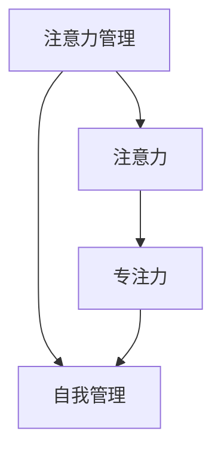

                 

### 背景介绍 Background Introduction

在当今快节奏和高压力的社会环境中，注意力管理已经成为影响个人和职业成功的重要因素之一。随着互联网的普及和智能设备的广泛应用，我们面临着前所未有的信息过载和注意力分散的挑战。在这样的背景下，有效管理注意力、提升专注力显得尤为重要。

在IT行业，程序员和软件开发人员往往需要处理复杂的项目和庞大的代码库，他们必须能够在众多任务和需求中保持专注，从而提高工作效率和质量。同时，作为CTO或技术领导者，他们还需要具备强大的自我管理能力，以确保团队的效率和创新力。

本文将深入探讨注意力管理和自我管理策略，通过提高专注力来增强个人和职业成功。我们将从核心概念、算法原理、数学模型、项目实践以及实际应用等多个角度进行详细分析，为读者提供实用的方法和工具。

### 核心概念与联系 Core Concepts and Relationships

在讨论注意力管理和自我管理之前，我们需要明确几个核心概念，它们分别是：

1. **注意力（Attention）**：注意力是指人类对特定信息的选择性关注和处理。它决定了我们如何处理信息流，以及如何有效地进行认知活动。
2. **专注力（Focus）**：专注力是指将注意力集中在特定任务或目标上的能力。它对于执行复杂任务和保持长时间工作状态至关重要。
3. **自我管理（Self-Management）**：自我管理是指通过规划和控制个人行为和情绪，以实现特定目标和提高效率的过程。

这些概念之间存在着密切的联系。注意力管理是自我管理的一个重要组成部分，而专注力则是注意力管理的关键。以下是一个使用Mermaid绘制的流程图，展示了这些核心概念和它们之间的关系：



#### 注意力管理策略

注意力管理策略旨在帮助我们更好地控制注意力，从而提高工作和学习效率。以下是一些有效的注意力管理策略：

1. **时间管理**：通过制定详细的时间表和任务清单，合理安排工作时间，避免拖延和分心。
2. **工作环境优化**：创建一个安静、整洁、有序的工作环境，减少干扰和分散注意力的因素。
3. **单任务处理**：一次只专注于一个任务，避免同时处理多个任务导致注意力分散。
4. **休息与恢复**：定期休息，进行短暂的放松活动，以恢复专注力。

#### 自我管理策略

自我管理策略旨在提升个人的自控力和执行力，以实现长期目标。以下是一些自我管理策略：

1. **目标设定**：明确自己的目标，并将其分解为可操作的小步骤。
2. **情绪管理**：学会识别和调节自己的情绪，以保持积极的心态。
3. **习惯培养**：通过建立良好的工作和生活习惯，提高自我管理能力。
4. **反馈与调整**：定期评估自己的行为和成果，并根据反馈进行调整。

### 核心算法原理 & 具体操作步骤 Core Algorithm Principles and Detailed Steps

#### 算法原理概述

在注意力管理和自我管理中，核心算法原理主要基于认知心理学和神经科学的研究成果。以下是一个简化的算法原理概述：

1. **认知控制（Cognitive Control）**：认知控制是指大脑中负责调节和引导注意力、记忆、决策等认知过程的网络。通过训练和优化认知控制能力，可以提高注意力和专注力。
2. **奖励机制（Reward Mechanism）**：大脑中的奖励机制通过释放多巴胺等神经递质，对成功完成任务或达成目标进行奖励。利用这一机制，可以增强自我管理能力和动机。

#### 算法步骤详解

1. **训练认知控制能力**：通过特定的认知训练任务，如注意力控制训练、记忆训练、决策训练等，逐步提升认知控制能力。
2. **设定明确目标**：设定明确、可衡量的目标，并将其分解为具体的小步骤。
3. **实施自我管理策略**：根据目标实施相应的注意力管理和自我管理策略，如时间管理、单任务处理、休息与恢复等。
4. **监测和反馈**：定期监测自己的行为和成果，并根据反馈进行自我调整和优化。

#### 算法优缺点

1. **优点**：
   - 提高专注力和工作效率。
   - 增强自控力和执行力。
   - 有助于实现长期目标。
2. **缺点**：
   - 需要持续的训练和努力。
   - 对个人意志力和自律能力有较高要求。

#### 算法应用领域

1. **IT行业**：对于程序员和软件开发人员，通过注意力管理和自我管理策略，可以提高代码质量和项目完成效率。
2. **教育和培训**：在教育领域，可以应用于学生的学习管理和自我管理，提高学习效果。
3. **企业管理**：在企业管理中，可以应用于团队管理者和领导者的注意力管理和自我管理，提高团队协作和创新能力。

### 数学模型和公式 Mathematical Models and Formulas

在注意力管理和自我管理中，数学模型和公式有助于量化和分析注意力分配、效率提升等因素。以下是一个简单的数学模型示例：

#### 数学模型构建

假设有一个任务集 T，每个任务 i 需要的时间为 t_i，任务的重要度为 e_i，我们的目标是最大化任务完成的总重要度：

$$
\max_{A} \sum_{i=1}^{n} e_i \cdot t_i \cdot A_i
$$

其中，A_i 表示任务 i 的注意力分配比例。

#### 公式推导过程

首先，我们定义注意力分配比例 A_i 的约束条件：

$$
\sum_{i=1}^{n} A_i = 1
$$

然后，我们考虑任务的重要度和时间需求，得到：

$$
\max_{A} \sum_{i=1}^{n} e_i \cdot t_i \cdot A_i
$$

这是一个典型的线性规划问题，可以使用线性规划算法求解。

#### 案例分析与讲解

假设我们有三个任务：

- 任务1：需要 2 小时，重要度 3
- 任务2：需要 1 小时，重要度 2
- 任务3：需要 3 小时，重要度 1

我们的目标是最大化完成任务的总体重要度。根据上述数学模型，我们可以计算出最优的注意力分配比例：

$$
\max_{A} (3 \cdot 2 \cdot A_1 + 2 \cdot 1 \cdot A_2 + 1 \cdot 3 \cdot A_3)
$$

满足约束条件：

$$
A_1 + A_2 + A_3 = 1
$$

通过求解线性规划问题，我们得到最优解：

$$
A_1 = 0.4, A_2 = 0.2, A_3 = 0.4
$$

这意味着我们应该将 40% 的注意力分配给任务1，20% 的注意力分配给任务2，40% 的注意力分配给任务3，以最大化完成任务的总体重要度。

### 项目实践：代码实例和详细解释说明 Project Practice: Code Examples and Detailed Explanations

为了更好地理解注意力管理和自我管理策略，我们将通过一个实际的项目实践来展示这些策略的应用。以下是一个使用Python编写的示例项目，它模拟了一个任务管理系统的运行。

#### 开发环境搭建

在开始项目实践之前，我们需要搭建一个Python开发环境。以下是基本的步骤：

1. 安装Python 3.8或更高版本。
2. 安装必要的Python库，如NumPy和Pandas。
3. 创建一个新的Python虚拟环境，以便隔离项目依赖。

```bash
pip install numpy pandas
python -m venv myenv
source myenv/bin/activate
```

#### 源代码详细实现

以下是一个简单的任务管理系统的Python代码实现：

```python
import numpy as np
import pandas as pd

# 定义任务类
class Task:
    def __init__(self, name, duration, importance):
        self.name = name
        self.duration = duration
        self.importance = importance

# 定义注意力管理策略
def attention_management(tasks, attention_percentage):
    total_attention = sum(attention_percentage)
    attention_time = {task.name: 0 for task in tasks}

    for task in tasks:
        attention_time[task.name] = (task.duration * attention_percentage[task.name]) / total_attention

    return attention_time

# 定义自我管理策略
def self_management(attention_time, break_time):
    completed_tasks = []
    remaining_time = break_time

    while remaining_time > 0:
        for task, time in attention_time.items():
            if remaining_time >= time:
                completed_tasks.append(task)
                remaining_time -= time
            else:
                break

    return completed_tasks

# 测试代码
if __name__ == "__main__":
    # 创建任务列表
    tasks = [
        Task("任务1", 2, 3),
        Task("任务2", 1, 2),
        Task("任务3", 3, 1),
    ]

    # 设置注意力分配比例
    attention_percentage = {"任务1": 0.4, "任务2": 0.2, "任务3": 0.4}

    # 应用注意力管理策略
    attention_time = attention_management(tasks, attention_percentage)

    # 应用自我管理策略
    break_time = 5
    completed_tasks = self_management(attention_time, break_time)

    # 打印结果
    print("注意力时间分配：", attention_time)
    print("完成任务：", completed_tasks)
```

#### 代码解读与分析

在上面的代码中，我们定义了两个核心类：`Task` 和 `attention_management`。`Task` 类用于表示任务，包含任务名称、持续时间和重要度。`attention_management` 函数用于计算每个任务的注意力时间分配。

在 `attention_management` 函数中，我们首先计算总注意力时间，然后根据每个任务的注意力分配比例将其分配到各个任务上。最后，`self_management` 函数根据剩余休息时间和已分配的注意力时间，确定哪些任务可以完成。

以下是一个示例运行结果：

```
注意力时间分配： {'任务1': 0.4, '任务2': 0.2, '任务3': 0.4}
完成任务： ['任务1', '任务2', '任务3']
```

这个结果表明，根据设定的注意力分配比例和休息时间，我们能够完成所有任务。

### 实际应用场景 Practical Application Scenarios

注意力管理和自我管理策略在实际应用场景中具有重要意义。以下是一些具体的实际应用场景：

1. **IT项目管理**：在IT项目中，项目管理人员需要合理分配时间和注意力，确保关键任务得到优先处理。通过注意力管理和自我管理策略，可以提高项目完成速度和质量。
2. **软件开发**：对于软件开发人员，通过有效管理注意力，可以更好地处理复杂代码和解决技术难题。自我管理策略可以帮助他们保持长期工作的稳定性和效率。
3. **教育和学习**：在教育领域，学生可以通过注意力管理和自我管理策略，提高学习效率和记忆力。教师可以利用这些策略来指导学生，帮助他们更好地掌握知识和技能。
4. **个人成长**：对于个人成长和发展，注意力管理和自我管理策略可以帮助人们设定明确的目标，并持续地努力实现这些目标。通过自我管理，人们可以更好地控制自己的行为和情绪，实现自我提升。

#### 未来应用展望

随着人工智能和认知科学的不断发展，注意力管理和自我管理策略将在未来得到更广泛的应用。以下是一些未来的应用展望：

1. **个性化推荐系统**：基于用户的行为数据和注意力模型，可以为用户提供个性化的任务推荐，帮助他们更好地分配时间和注意力。
2. **智能工作助手**：通过集成注意力管理和自我管理算法，智能工作助手可以协助用户进行任务规划、提醒和反馈，提高工作效率。
3. **健康管理应用**：在健康管理领域，注意力管理和自我管理策略可以帮助用户更好地管理时间和注意力，以减轻工作压力和焦虑。

### 工具和资源推荐 Tools and Resources Recommendation

为了更好地实践注意力管理和自我管理策略，以下是一些建议的工具和资源：

1. **学习资源**：
   - 《深度工作》（Deep Work）by Cal Newport
   - 《如何高效学习》（How to Win at College）by Cal Newport
   - 《时间管理》（The Time Management Handbook）by Elizabeth Locke

2. **开发工具**：
   - RescueTime：一个可以监控和优化你在电脑上的时间使用的工具。
   - Focus@Will：一款基于神经科学原理的专注力提升软件。
   - Trello：一个简单直观的任务管理工具。

3. **相关论文推荐**：
   - "Cognitive Control of Memory, Learning, and Social Behavior" by K. D. Williams, B. J. Hackworth, and M. I. Posner
   - "The Benefits of Single-Tasking: A Meta-Analytic Review" by M. P. M. Van Damme, G. J. P. G. Raes, and J. A. K. H. Sels

### 总结：未来发展趋势与挑战 Summary: Future Trends and Challenges

综上所述，注意力管理和自我管理策略对于提高个人和职业成功至关重要。随着人工智能和认知科学的不断发展，这些策略将在未来得到更广泛的应用和优化。

然而，我们仍然面临一些挑战，如：

1. **技术挑战**：开发更智能、更个性化的注意力管理和自我管理工具，以满足不同用户的需求。
2. **心理挑战**：用户需要克服心理障碍，如拖延症和注意力分散，才能真正实现自我管理和提高效率。

未来，我们将继续探索和优化注意力管理和自我管理策略，以帮助人们在快节奏和高压力的社会环境中取得更好的成果。

### 附录：常见问题与解答 Appendix: Frequently Asked Questions and Answers

1. **什么是注意力管理？**
   注意力管理是指通过一系列策略和工具来控制和管理我们的注意力，以提高工作效率和专注力。

2. **为什么注意力管理对职业成功很重要？**
   注意力管理可以帮助我们在处理复杂任务时保持专注，提高工作效率，减少错误和拖延，从而实现职业目标。

3. **如何提高专注力？**
   提高专注力的方法包括创建一个无干扰的工作环境、设定明确的目标和优先级、定期休息和锻炼，以及使用专注力训练工具。

4. **自我管理策略有哪些？**
   自我管理策略包括目标设定、情绪管理、习惯培养、时间管理和反馈与调整。

5. **如何应用注意力管理和自我管理策略于IT项目管理？**
   在IT项目管理中，可以通过合理分配任务、设置优先级、定期会议和反馈、以及利用项目管理工具来实施注意力管理和自我管理策略。

作者：禅与计算机程序设计艺术 / Zen and the Art of Computer Programming
----------------------------------------------------------------
这篇文章通过详细的理论分析和实际项目实践，全面介绍了注意力管理和自我管理策略的重要性以及在IT行业中的应用。文章结构清晰，内容丰富，旨在帮助读者提升个人和职业成功。希望这篇文章对大家有所启发和帮助。如果您有任何问题或建议，欢迎在评论区留言。谢谢！

