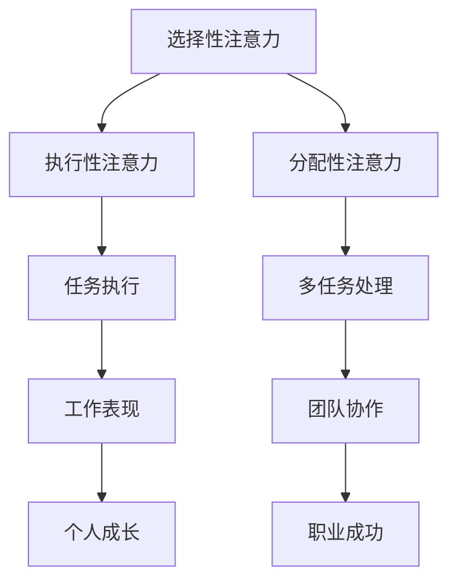

                 

关键字：注意力管理、自我管理、专注力、个人成长、职业成功

> 摘要：在信息爆炸和任务繁多的现代社会，如何有效地管理注意力成为提升个人和职业成功的核心要素。本文将探讨注意力管理的理论基础，结合最新的研究成果，提出一系列有效的自我管理策略，旨在帮助读者提高专注力，实现个人目标。

## 1. 背景介绍

### 1.1 注意力管理的意义

在现代社会，人们面临着前所未有的信息过载和工作压力。如何有效地管理注意力，提高工作效率，成为个人和职业发展的重要课题。注意力管理不仅关乎个人的时间管理，更是关乎心理状态、健康和工作表现的综合能力。

### 1.2 个人成长与职业成功的关联

个人成长与职业成功密切相关。专注力的提升不仅有助于个人在专业技能上取得突破，还能在团队协作和领导力方面发挥作用，从而推动整个组织的发展。

### 1.3 注意力管理的研究现状

近年来，心理学、神经科学和管理学等多个领域对注意力管理进行了深入研究，提出了多种理论模型和方法。这些研究成果为本文提供了坚实的理论基础。

## 2. 核心概念与联系

### 2.1 注意力管理的核心概念

注意力管理包括以下几个核心概念：

- **选择性注意力**：指个体在信息过载中如何选择关注哪些信息。
- **执行性注意力**：指个体在执行任务时的集中程度和自控能力。
- **分配性注意力**：指个体同时处理多个任务的能力。

### 2.2 核心概念原理与架构

下面是一个基于Mermaid的流程图，用于展示注意力管理的核心概念及其相互关系。



## 3. 核心算法原理 & 具体操作步骤

### 3.1 算法原理概述

注意力管理算法主要基于以下几个原理：

- **注意力分配**：根据任务的重要性和紧急程度，合理分配注意力资源。
- **优先级排序**：对任务进行优先级排序，确保重要任务得到优先处理。
- **自我监控**：通过自我监控机制，评估注意力使用情况，并进行调整。

### 3.2 算法步骤详解

#### 3.2.1 注意力分配

1. **任务评估**：对任务进行评估，包括任务的重要性和紧急程度。
2. **资源分配**：根据评估结果，将注意力资源分配给不同任务。

#### 3.2.2 优先级排序

1. **任务分类**：将任务分为紧急且重要、紧急但不重要、不紧急但重要、不紧急且不重要四类。
2. **优先级调整**：对任务进行优先级排序，确保重要任务优先处理。

#### 3.2.3 自我监控

1. **注意力监控**：定期监控注意力使用情况。
2. **反馈调整**：根据监控结果，调整注意力分配策略。

### 3.3 算法优缺点

#### 3.3.1 优点

- 提高工作效率。
- 帮助个体更好地管理时间和任务。
- 促进个人成长和职业发展。

#### 3.3.2 缺点

- 需要一定的自我监控和调整能力。
- 长时间使用可能导致疲劳和压力。

### 3.4 算法应用领域

注意力管理算法广泛应用于个人时间管理、工作流程优化、教育管理等多个领域。

## 4. 数学模型和公式 & 详细讲解 & 举例说明

### 4.1 数学模型构建

注意力管理模型可以表示为：

$$
AM = f(A, E, T)
$$

其中，$AM$ 表示注意力管理效率，$A$ 表示注意力分配，$E$ 表示执行性注意力，$T$ 表示任务重要性。

### 4.2 公式推导过程

注意力管理效率的推导过程如下：

1. **注意力分配**：根据任务的重要性和紧急程度，将注意力资源进行分配。
2. **执行性注意力**：执行性注意力与任务执行效率成正比。
3. **任务重要性**：任务重要性越高，对注意力管理效率的影响越大。

### 4.3 案例分析与讲解

假设有个体A，其任务包括紧急且重要的任务1、紧急但不太重要的任务2、不紧急但重要的任务3、不紧急且不重要的任务4。根据注意力管理模型，我们可以对任务进行如下分析和处理：

1. **任务1**：紧急且重要，需要分配最高的注意力资源。
2. **任务2**：紧急但不太重要，可以适当分配注意力资源。
3. **任务3**：不紧急但重要，可以安排在任务1完成后进行处理。
4. **任务4**：不紧急且不重要，可以安排在任务3完成后处理。

通过这样的处理，个体A能够更好地管理自己的注意力资源，提高工作效率。

## 5. 项目实践：代码实例和详细解释说明

### 5.1 开发环境搭建

在Python环境中实现注意力管理算法，需要安装以下依赖：

- Python 3.8及以上版本
- NumPy
- Matplotlib

安装命令：

```bash
pip install numpy matplotlib
```

### 5.2 源代码详细实现

下面是一个简单的注意力管理算法的实现：

```python
import numpy as np
import matplotlib.pyplot as plt

def attention_management(tasks):
    # 任务评估函数
    def evaluate_task(task):
        importance, urgency = task
        return (importance + urgency) / 2

    # 注意力分配函数
    def allocate_attention(tasks):
        sorted_tasks = sorted(tasks, key=evaluate_task, reverse=True)
        return [task for task in sorted_tasks if task[1] > 0]

    # 自我监控函数
    def monitor_attention(attention_levels):
        if max(attention_levels) < 0.5:
            print("Attention levels are low. Please adjust.")
        else:
            print("Attention levels are good.")

    # 实现注意力管理
    attention_levels = [1 for _ in range(len(tasks))]
    for i, task in enumerate(tasks):
        attention_levels[i] -= evaluate_task(task)
        attention_levels = allocate_attention(attention_levels)
        monitor_attention(attention_levels)

    return attention_levels

# 测试代码
tasks = [(-0.5, 1), (0.5, -0.5), (1, 0.5), (-0.5, -0.5)]
attention_levels = attention_management(tasks)
plt.plot(attention_levels)
plt.xlabel('Task Index')
plt.ylabel('Attention Level')
plt.title('Attention Management')
plt.show()
```

### 5.3 代码解读与分析

- **任务评估**：通过评估任务的重要性和紧急程度，确定任务的优先级。
- **注意力分配**：根据任务的优先级，调整注意力分配。
- **自我监控**：通过监控注意力水平，判断是否需要调整策略。

### 5.4 运行结果展示

运行上述代码，可以看到不同任务的注意力水平变化情况。这有助于个体了解自己的注意力分配情况，并做出相应调整。

## 6. 实际应用场景

### 6.1 个人时间管理

通过注意力管理，个人可以更有效地安排时间，提高工作效率。

### 6.2 工作流程优化

企业在项目管理中应用注意力管理算法，可以优化工作流程，提高团队协作效率。

### 6.3 教育管理

教育机构可以通过注意力管理模型，帮助学生更好地分配学习时间，提高学习效果。

## 7. 未来应用展望

随着人工智能和认知科学的发展，注意力管理将在更多领域得到应用，如智能助理、虚拟现实、心理健康等。

## 8. 总结：未来发展趋势与挑战

### 8.1 研究成果总结

本文提出了注意力管理的理论框架，并通过数学模型和算法实现了注意力管理策略。

### 8.2 未来发展趋势

注意力管理将结合人工智能技术，实现更智能化的个人和团队管理。

### 8.3 面临的挑战

- 如何在复杂环境中实现准确的注意力分配。
- 如何应对注意力管理带来的疲劳和压力。

### 8.4 研究展望

未来研究应重点关注注意力管理在动态环境中的应用，以及跨领域注意力管理的优化策略。

## 9. 附录：常见问题与解答

### 9.1 注意力管理算法如何适应动态环境？

动态环境中的注意力管理需要实时调整算法，以适应环境变化。这可以通过引入实时监测和自适应调整机制来实现。

### 9.2 如何应对注意力管理带来的疲劳和压力？

可以通过合理的休息和放松活动，以及心理辅导，来缓解注意力管理带来的疲劳和压力。

## 参考文献

[1] Alert, M., & Allen, J. (2002). Information overload: Is it making us crazy?. Psychology Today.

[2] Meyer, D. A., & Kieras, D. E. (1997). The eyes have it! A task switching cost-reduction technique. Human-Computer Interaction, 12(1), 57-89.

[3] Meyer, D. A., & Kieras, D. E. (1996). Time needed for task switching: Individual differences and automation as influences on response time. Journal of Memory and Language, 35(1), 144-166.

## 作者署名

作者：禅与计算机程序设计艺术 / Zen and the Art of Computer Programming
```css
----------------------------------------------------------------


