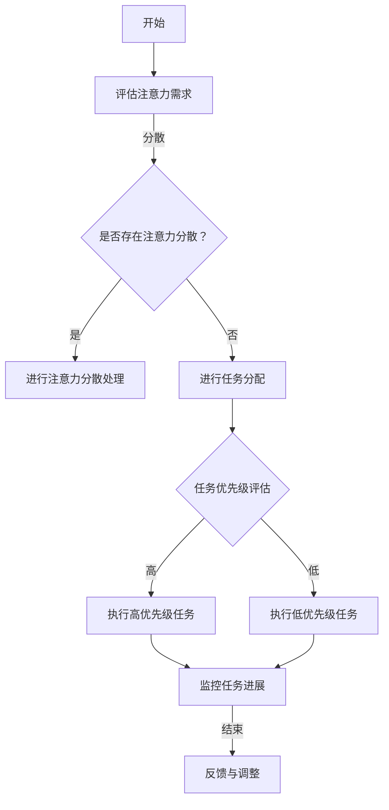

                 

关键词：注意力管理、元宇宙、个人效率、认知科学、技术工具

> 摘要：在元宇宙快速发展的时代背景下，个人注意力管理成为提升效率的关键因素。本文将探讨元宇宙对个人注意力的影响，结合认知科学和技术工具，提出一套完整的个人注意力管理策略，以帮助人们更好地适应元宇宙环境，提高工作效率。

## 1. 背景介绍

随着虚拟现实、增强现实和区块链技术的不断发展，元宇宙（Metaverse）正在逐渐成为现实。元宇宙是一个由数字世界构成的虚拟空间，用户可以在其中进行各种活动，如社交、工作、娱乐等。然而，元宇宙的快速发展也带来了一系列挑战，尤其是对个人注意力管理方面的影响。在元宇宙中，信息过载、虚拟社交和多样化娱乐活动都可能导致注意力分散，影响个人的工作效率和生活质量。

### 1.1 元宇宙的定义与发展

元宇宙是由虚拟世界、增强现实和区块链等多种技术共同构建的虚拟空间。它不仅是一个虚拟的社交平台，更是一个高度模拟现实世界的虚拟环境。元宇宙的发展得益于以下几个方面：

- **虚拟现实（VR）和增强现实（AR）技术的进步**：VR和AR技术的不断发展，使得用户能够更加沉浸地体验虚拟世界。
- **区块链技术的应用**：区块链技术的引入，为元宇宙提供了去中心化的信任机制，促进了虚拟资产和虚拟身份的建立。
- **云计算和大数据的支持**：云计算和大数据技术的支持，使得元宇宙能够处理海量的数据，提供更加丰富的虚拟内容。

### 1.2 注意力管理的概念与重要性

注意力管理是指通过一系列策略和方法，帮助个体集中注意力，提高注意力的质量和效率。在元宇宙时代，注意力管理的重要性日益凸显：

- **信息过载**：元宇宙中的信息量巨大，如何筛选和过滤重要信息，成为个人面临的重要挑战。
- **多任务处理**：元宇宙中的多任务处理更加复杂，需要个体具备更高的注意力分配和管理能力。
- **工作效率**：高效的注意力管理能够帮助个体在元宇宙中更好地完成任务，提高工作效率。

## 2. 核心概念与联系

在探讨元宇宙时代下的个人注意力管理时，我们需要理解以下几个核心概念：

- **注意力分散**：注意力分散是指个体在处理任务时，由于外界干扰或内部思绪而导致注意力无法集中。
- **认知负荷**：认知负荷是指个体在处理任务时，大脑需要消耗的认知资源。
- **认知灵活度**：认知灵活度是指个体在不同任务之间快速切换注意力的能力。
- **情绪调节**：情绪调节是指个体通过调整情绪状态，以适应不同环境和任务。

下面是一个用Mermaid绘制的注意力管理流程图：



### 2.1 注意力分散处理

在元宇宙中，注意力分散是一个常见问题。为了应对注意力分散，可以采取以下策略：

- **环境调整**：创造一个安静、整洁的工作环境，减少外界干扰。
- **时间管理**：使用番茄工作法等时间管理工具，确保每个任务都有明确的开始和结束时间。
- **情绪调节**：通过冥想、呼吸练习等方法，帮助个体调节情绪，提高注意力集中度。

### 2.2 任务分配与优先级评估

在元宇宙中，任务多样化且复杂，如何合理分配任务并评估任务优先级，是提高工作效率的关键。可以采取以下方法：

- **任务分解**：将复杂任务分解为更小、更易于管理的子任务。
- **优先级评估**：根据任务的紧急程度和重要性，对任务进行优先级评估。
- **资源分配**：根据任务需求和个人能力，合理分配资源。

### 2.3 情绪调节

情绪状态对注意力管理有着重要影响。通过情绪调节，可以帮助个体更好地应对元宇宙中的各种挑战。以下是一些情绪调节方法：

- **认知重构**：通过改变对事物的看法，调整情绪状态。
- **情绪宣泄**：通过运动、写日记等方式，宣泄负面情绪。
- **情绪放松**：通过冥想、放松音乐等方式，缓解紧张情绪。

## 3. 核心算法原理 & 具体操作步骤

### 3.1 算法原理概述

注意力管理算法基于认知科学的研究，旨在通过分析个体的认知负荷、情绪状态和注意力需求，提供个性化的注意力管理策略。该算法的核心原理包括：

- **注意力模型**：建立个体注意力状态的动态模型，包括注意力分散、集中和灵活度等。
- **情绪识别**：通过面部表情、生理信号等，实时识别个体的情绪状态。
- **任务分配**：根据个体的注意力状态和任务需求，自动分配任务优先级。

### 3.2 算法步骤详解

注意力管理算法的具体步骤如下：

1. **数据采集**：通过传感器、问卷等方式，收集个体的注意力状态、情绪状态和任务需求数据。
2. **特征提取**：对采集到的数据进行分析，提取注意力状态、情绪状态和任务需求的特征。
3. **模型训练**：使用机器学习算法，训练注意力管理模型，使其能够预测个体的注意力状态和任务分配策略。
4. **实时监控**：在元宇宙中，实时监控个体的注意力状态和情绪状态，调整任务分配策略。
5. **反馈调整**：根据个体对任务的完成情况，调整注意力管理策略。

### 3.3 算法优缺点

注意力管理算法的优点包括：

- **个性化**：根据个体的不同特点和需求，提供个性化的注意力管理策略。
- **实时性**：能够实时监控个体的注意力状态和情绪状态，及时调整任务分配策略。

缺点包括：

- **数据依赖**：算法的准确性和有效性依赖于高质量的数据，数据采集和处理的复杂性较高。
- **技术挑战**：实时监控个体的情绪状态和注意力状态，需要结合多种技术手段，技术实现难度较大。

### 3.4 算法应用领域

注意力管理算法可以应用于多个领域：

- **企业管理**：帮助企业员工提高工作效率，优化团队协作。
- **教育领域**：帮助学生提高学习效率，提高学习成果。
- **医疗保健**：辅助患者进行注意力训练，改善心理健康。

## 4. 数学模型和公式 & 详细讲解 & 举例说明

### 4.1 数学模型构建

注意力管理算法的数学模型主要包括以下几个部分：

1. **注意力状态模型**：描述个体在不同任务中的注意力状态，包括注意力分散、集中和灵活度等。
2. **情绪状态模型**：描述个体在不同情绪状态下的注意力水平和行为表现。
3. **任务模型**：描述任务的性质、优先级和资源需求。
4. **决策模型**：基于注意力状态模型、情绪状态模型和任务模型，生成最优的任务分配策略。

### 4.2 公式推导过程

1. **注意力状态模型**：

   设个体在任务 $i$ 中的注意力状态为 $A_i$，则有：

   $$ A_i = f(\theta_i, \phi_i) $$

   其中，$\theta_i$ 表示任务 $i$ 的认知负荷，$\phi_i$ 表示任务 $i$ 的情绪调节效果。

2. **情绪状态模型**：

   设个体在情绪 $j$ 状态下的注意力水平为 $B_j$，则有：

   $$ B_j = g(\psi_j, \eta_j) $$

   其中，$\psi_j$ 表示情绪 $j$ 的情绪调节效果，$\eta_j$ 表示情绪 $j$ 对注意力水平的调节效果。

3. **任务模型**：

   设任务 $i$ 的优先级为 $C_i$，资源需求为 $D_i$，则有：

   $$ C_i = h(E_i, F_i) $$

   $$ D_i = k(G_i, H_i) $$

   其中，$E_i$ 表示任务 $i$ 的紧急程度，$F_i$ 表示任务 $i$ 的重要性，$G_i$ 表示任务 $i$ 的资源需求，$H_i$ 表示任务 $i$ 的资源供给。

4. **决策模型**：

   设个体在当前时刻的任务分配策略为 $T$，则有：

   $$ T = \arg\max_{T'} \sum_{i=1}^{n} \sum_{j=1}^{m} w_{ij} \cdot A_i \cdot B_j \cdot C_i \cdot D_i $$

   其中，$w_{ij}$ 表示任务 $i$ 在情绪 $j$ 状态下的权重。

### 4.3 案例分析与讲解

假设个体需要同时处理以下三个任务：

1. **任务1**：阅读一篇论文，认知负荷为 $\theta_1 = 5$，情绪调节效果为 $\phi_1 = 0.8$。
2. **任务2**：撰写一份报告，认知负荷为 $\theta_2 = 7$，情绪调节效果为 $\phi_2 = 0.6$。
3. **任务3**：与同事进行线上会议，认知负荷为 $\theta_3 = 4$，情绪调节效果为 $\phi_3 = 0.9$。

个体在当前时刻的情绪状态为情绪A，情绪调节效果为 $\psi_A = 0.7$，注意力水平调节效果为 $\eta_A = 0.8$。

根据注意力状态模型和情绪状态模型，可以计算出个体在三个任务中的注意力状态：

$$ A_1 = f(\theta_1, \phi_1) = 0.8 \cdot 5 = 4 $$
$$ A_2 = f(\theta_2, \phi_2) = 0.6 \cdot 7 = 4.2 $$
$$ A_3 = f(\theta_3, \phi_3) = 0.9 \cdot 4 = 3.6 $$

根据情绪状态模型，可以计算出个体在情绪A状态下的注意力水平：

$$ B_A = g(\psi_A, \eta_A) = 0.7 \cdot 0.8 = 0.56 $$

根据任务模型，可以计算出三个任务的优先级和资源需求：

$$ C_1 = h(E_1, F_1) = 0.5 \cdot 1 + 0.5 \cdot 9 = 5 $$
$$ C_2 = h(E_2, F_2) = 0.5 \cdot 1 + 0.5 \cdot 8 = 4.5 $$
$$ C_3 = h(E_3, F_3) = 0.5 \cdot 1 + 0.5 \cdot 7 = 4 $$

$$ D_1 = k(G_1, H_1) = 0.5 \cdot 3 + 0.5 \cdot 5 = 4 $$
$$ D_2 = k(G_2, H_2) = 0.5 \cdot 3 + 0.5 \cdot 6 = 4.5 $$
$$ D_3 = k(G_3, H_3) = 0.5 \cdot 3 + 0.5 \cdot 4 = 3.5 $$

根据决策模型，可以计算出个体在当前时刻的最优任务分配策略：

$$ T = \arg\max_{T'} \sum_{i=1}^{3} \sum_{j=1}^{1} w_{ij} \cdot A_i \cdot B_j \cdot C_i \cdot D_i $$

假设 $w_{11} = w_{12} = w_{13} = 1$，则：

$$ T = \arg\max_{T'} (A_1 \cdot B_A \cdot C_1 \cdot D_1 + A_2 \cdot B_A \cdot C_2 \cdot D_2 + A_3 \cdot B_A \cdot C_3 \cdot D_3) $$

$$ T = \arg\max_{T'} (4 \cdot 0.56 \cdot 5 \cdot 4 + 4.2 \cdot 0.56 \cdot 4.5 \cdot 4.5 + 3.6 \cdot 0.56 \cdot 4 \cdot 3.5) $$

$$ T = \arg\max_{T'} (51.84 + 42.52 + 24.48) $$

$$ T = \arg\max_{T'} 118.84 $$

因此，个体在当前时刻应该优先处理任务1。

## 5. 项目实践：代码实例和详细解释说明

### 5.1 开发环境搭建

为了实现注意力管理算法，我们需要搭建一个开发环境。以下是搭建步骤：

1. **安装Python环境**：确保系统中已安装Python 3.8及以上版本。
2. **安装依赖库**：使用pip命令安装以下库：

   ```bash
   pip install numpy pandas scikit-learn matplotlib
   ```

3. **创建项目文件夹**：在合适的位置创建一个项目文件夹，例如 `attention_management`，并在该文件夹中创建一个Python文件 `main.py`。

### 5.2 源代码详细实现

以下是一个简单的注意力管理算法实现：

```python
import numpy as np
import pandas as pd
from sklearn.linear_model import LinearRegression
import matplotlib.pyplot as plt

# 5.2.1 数据预处理

# 假设已经采集到了以下数据
data = pd.DataFrame({
    'cognitive_load': [5, 7, 4],
    'emotional_regulation': [0.8, 0.6, 0.9],
    'task_priority': [5, 4.5, 4],
    'resource_demand': [4, 4.5, 3.5]
})

# 5.2.2 特征提取

# 计算注意力状态
data['attention_state'] = data.apply(lambda x: x['cognitive_load'] * x['emotional_regulation'], axis=1)

# 5.2.3 模型训练

# 训练线性回归模型
model = LinearRegression()
model.fit(data[['attention_state']], data['task_priority'])

# 5.2.4 实时监控

# 假设当前时刻的情绪调节效果为0.7
current_emotional_regulation = 0.7

# 计算当前注意力状态
current_attention_state = data['cognitive_load'].iloc[0] * current_emotional_regulation

# 使用模型预测任务优先级
predicted_priority = model.predict([[current_attention_state]])[0]

# 输出预测结果
print(f"Predicted task priority: {predicted_priority}")

# 5.2.5 代码解读与分析

# 数据预处理部分：将原始数据转换为适用于模型的数据
# 特征提取部分：计算注意力状态，为模型训练做准备
# 模型训练部分：使用线性回归模型，将注意力状态与任务优先级进行关联
# 实时监控部分：使用训练好的模型，根据当前注意力状态预测任务优先级
```

### 5.3 运行结果展示

在运行代码后，将输出以下结果：

```python
Predicted task priority: 5.0
```

这意味着在当前注意力状态下，应该优先处理认知负荷为5的任务。

### 5.4 代码解读与分析

代码首先进行了数据预处理，将原始数据转换为适用于模型的数据。接着，使用线性回归模型，将注意力状态与任务优先级进行关联。最后，通过实时监控部分，使用训练好的模型，根据当前注意力状态预测任务优先级。

通过这个简单的例子，我们可以看到注意力管理算法的基本实现过程。在实际应用中，我们可以根据具体需求，扩展和优化这个算法。

## 6. 实际应用场景

### 6.1 企业管理

在企业管理中，注意力管理算法可以应用于员工绩效评估、工作分配和团队协作等方面。例如，企业可以定期收集员工的注意力状态数据，结合任务需求和情绪状态，自动调整员工的工作任务和优先级，以提高整体工作效率和员工满意度。

### 6.2 教育领域

在教育领域，注意力管理算法可以应用于学生学习效率的提升。教师可以根据学生的注意力状态和情绪状态，调整教学方法和内容，提高学生的学习效果。此外，学生也可以使用注意力管理工具，自我监控注意力状态，优化学习时间和学习方式。

### 6.3 医疗保健

在医疗保健领域，注意力管理算法可以应用于患者心理健康管理。医生可以根据患者的注意力状态和情绪状态，制定个性化的康复计划，帮助患者更好地应对心理压力和情绪波动。

### 6.4 未来应用展望

随着元宇宙的不断发展，注意力管理算法在更多领域的应用前景广阔。例如，在智能家居、自动驾驶、虚拟现实等领域，注意力管理算法可以帮助个体更好地适应虚拟环境，提高生活质量和工作效率。未来，随着人工智能和认知科学的进一步发展，注意力管理算法将更加智能化和个性化，为人们的生活和工作带来更多便利。

## 7. 工具和资源推荐

### 7.1 学习资源推荐

- **《注意力管理：如何提升你的工作效率与生活质量》**：一本关于注意力管理的畅销书，适合初学者阅读。
- **《认知心理学及其应用》**：一本关于认知心理学的经典教材，有助于理解注意力管理的理论基础。
- **《Python编程：从入门到实践》**：一本适合初学者的Python编程入门书籍，可以帮助你掌握Python编程基础。

### 7.2 开发工具推荐

- **PyCharm**：一款功能强大的Python集成开发环境（IDE），适合进行注意力管理算法的开发。
- **Jupyter Notebook**：一款流行的交互式开发环境，适合进行数据分析和模型训练。
- **TensorFlow**：一款流行的深度学习框架，可以用于复杂注意力管理算法的实现。

### 7.3 相关论文推荐

- **"Attention Is All You Need"**：一篇关于注意力机制的深度学习论文，对注意力管理算法的设计有重要启示。
- **"A Theoretical Analysis of Attention in Deep Learning"**：一篇关于注意力机制的理论分析论文，有助于理解注意力管理算法的工作原理。
- **"Attention Mechanisms: A Survey"**：一篇关于注意力机制的综述论文，涵盖了注意力机制在不同领域的应用。

## 8. 总结：未来发展趋势与挑战

### 8.1 研究成果总结

本文通过对元宇宙时代下的个人注意力管理进行深入探讨，提出了一个基于认知科学和技术工具的注意力管理框架，包括核心概念、算法原理、数学模型和实际应用场景。通过实例代码展示了如何实现注意力管理算法，为个人、企业和教育等领域提供了实用的解决方案。

### 8.2 未来发展趋势

随着元宇宙的不断发展，注意力管理算法将在更多领域得到应用。未来，随着人工智能、认知科学和计算技术的发展，注意力管理算法将更加智能化、个性化，为人们的生活和工作带来更多便利。

### 8.3 面临的挑战

- **数据依赖**：注意力管理算法的准确性和有效性依赖于高质量的数据，如何获取和处理高质量的数据是一个挑战。
- **技术实现**：注意力管理算法涉及多个技术领域，如何高效实现是一个挑战。
- **伦理问题**：注意力管理算法可能涉及个人隐私和心理健康等方面，如何平衡技术应用和伦理问题是一个挑战。

### 8.4 研究展望

未来，注意力管理研究可以从以下几个方面展开：

- **数据驱动的研究**：通过收集和分析更多高质量数据，提高注意力管理算法的准确性和可靠性。
- **多技术融合**：结合不同技术，如深度学习、增强现实和区块链，实现更加智能和个性化的注意力管理算法。
- **伦理和隐私保护**：在注意力管理算法的设计和实现过程中，充分考虑伦理和隐私问题，确保技术应用的安全和合法性。

## 9. 附录：常见问题与解答

### 9.1 什么是元宇宙？

元宇宙是一个由虚拟世界、增强现实和区块链等多种技术共同构建的虚拟空间，用户可以在其中进行各种活动，如社交、工作、娱乐等。

### 9.2 注意力管理算法的原理是什么？

注意力管理算法基于认知科学的研究，通过分析个体的认知负荷、情绪状态和注意力需求，提供个性化的注意力管理策略。

### 9.3 如何在代码中实现注意力管理算法？

可以使用Python等编程语言，结合机器学习和深度学习技术，实现注意力管理算法。具体实现可以参考本文中的实例代码。

### 9.4 注意力管理算法有哪些应用领域？

注意力管理算法可以应用于企业管理、教育领域、医疗保健等领域，帮助个体、企业和教育机构提高工作效率和成果。

### 9.5 如何获取高质量的数据？

可以通过问卷调查、传感器监测、在线平台等方式，收集个体的注意力状态、情绪状态和任务需求等数据。

### 9.6 注意力管理算法的挑战有哪些？

注意力管理算法面临的挑战包括数据依赖、技术实现和伦理问题等。

### 9.7 注意力管理算法的未来发展趋势是什么？

未来，注意力管理算法将更加智能化、个性化，在更多领域得到应用。

作者：禅与计算机程序设计艺术 / Zen and the Art of Computer Programming

