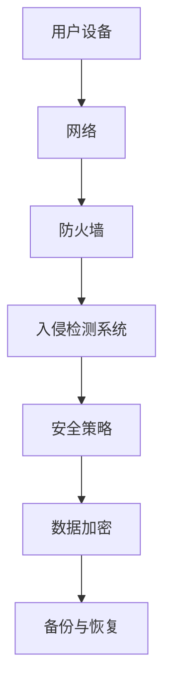
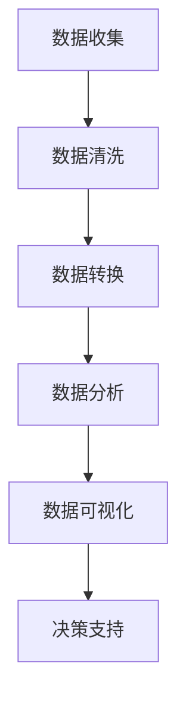
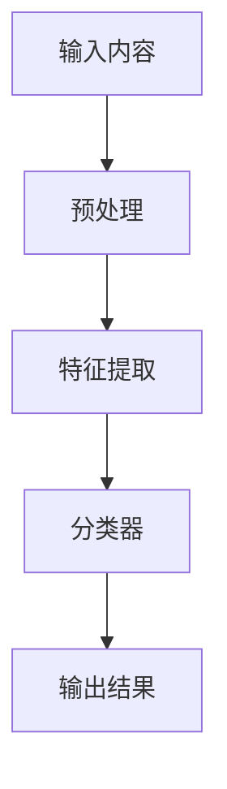
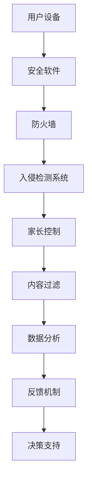

                 

关键词：注意力经济、儿童保护、网络安全、算法、数据分析、技术解决方案

> 摘要：随着互联网和移动设备在日常生活中的普及，儿童保护问题日益突出。本文旨在探讨注意力经济对儿童保护的影响，并介绍一系列基于技术的方法和算法，以保护儿童免受网络威胁和不良信息的侵害。

## 1. 背景介绍

在数字时代，互联网已成为人们获取信息、娱乐、交流和学习的首选途径。然而，这一便利的数字生活也带来了新的挑战，尤其是对儿童的保护问题。注意力经济，作为一种商业模式，通过吸引和维持用户的注意力来创造价值。这种模式在儿童中尤其显著，因为儿童的注意力容易分散，且对新鲜事物充满好奇。

注意力经济的核心在于获取和保持用户的注意力，这往往通过刺激性、互动性和娱乐性的内容来实现。然而，这种注意力经济的背后可能隐藏着对儿童的不利影响，包括网络欺凌、不当内容暴露和隐私泄露等问题。

### 1.1 注意力经济的基本原理

注意力经济是一种基于用户注意力的商业模式，其核心思想是吸引并保持用户的注意力，从而创造经济价值。以下是其关键组成部分：

- **内容吸引力**：提供有吸引力、娱乐性或刺激性内容，以吸引用户的注意力。
- **用户互动**：通过社交媒体、游戏和其他互动工具鼓励用户参与，从而提高用户粘性。
- **个性化推荐**：利用算法分析用户行为，提供个性化内容，以增加用户停留时间和互动次数。

### 1.2 儿童网络保护面临的挑战

- **网络安全风险**：儿童在网络上容易受到恶意软件、网络钓鱼和黑客攻击的威胁。
- **不当内容**：儿童可能会接触到暴力、色情或其他不良信息。
- **隐私泄露**：儿童的个人数据和隐私容易受到侵犯。
- **网络欺凌**：儿童可能成为网络欺凌的目标，造成心理和情感伤害。

## 2. 核心概念与联系

在解决儿童保护问题时，我们需要理解并运用以下几个核心概念：

### 2.1 网络安全

网络安全是指保护计算机系统和网络不受未经授权的访问、攻击和破坏。以下是一个简化的网络安全架构：



### 2.2 数据分析

数据分析是使用统计学、机器学习和数据挖掘技术来提取信息、发现模式和趋势的过程。以下是一个数据处理流程：



### 2.3 算法

算法是一系列定义明确的操作步骤，用于解决特定问题。在儿童保护中，算法可用于检测不当内容、识别网络欺凌和增强网络安全。以下是一个内容过滤算法的简单流程：



### 2.4 技术解决方案

结合上述核心概念，我们可以构建一系列技术解决方案，以应对儿童保护面临的挑战。以下是一个简化的解决方案框架：



## 3. 核心算法原理 & 具体操作步骤

### 3.1 算法原理概述

在儿童保护中，算法广泛应用于内容过滤、网络监控和隐私保护。以下介绍几种核心算法的原理：

#### 3.1.1 内容过滤算法

内容过滤算法旨在识别和屏蔽不当内容。其基本原理包括：

- **关键词过滤**：通过识别不良词汇和短语来屏蔽内容。
- **机器学习分类器**：使用训练数据集，通过机器学习算法（如决策树、支持向量机等）来分类内容。
- **深度学习模型**：使用神经网络（如卷积神经网络、循环神经网络等）来识别复杂模式。

#### 3.1.2 网络监控算法

网络监控算法用于实时监控网络流量，以检测潜在的安全威胁。其基本原理包括：

- **入侵检测系统（IDS）**：基于统计学和模式识别技术，检测异常行为和潜在攻击。
- **防火墙规则**：通过定义规则来允许或拒绝网络流量。
- **沙盒技术**：在隔离环境中执行恶意代码，以评估其潜在威胁。

#### 3.1.3 隐私保护算法

隐私保护算法旨在保护儿童的个人数据和隐私。其基本原理包括：

- **数据加密**：使用加密技术保护敏感数据。
- **匿名化**：通过匿名化处理，去除个人身份信息。
- **差分隐私**：在数据发布时加入噪声，以保护个人隐私。

### 3.2 算法步骤详解

#### 3.2.1 内容过滤算法步骤

1. **数据收集**：收集网络上的文本、图片和视频等数据。
2. **预处理**：去除噪声、标准化文本，将图像和视频转换为特征向量。
3. **特征提取**：提取关键特征，如文本中的关键词、图像中的颜色分布等。
4. **分类器训练**：使用有标签的数据集，通过机器学习算法训练分类器。
5. **内容过滤**：将新内容输入分类器，根据分类结果屏蔽不良内容。

#### 3.2.2 网络监控算法步骤

1. **网络流量捕获**：捕获网络流量数据。
2. **预处理**：去除无关数据，提取关键特征。
3. **异常检测**：使用入侵检测系统或模式识别算法，检测异常流量模式。
4. **响应**：根据检测到的异常行为，采取相应的安全措施，如通知管理员或封锁IP地址。

#### 3.2.3 隐私保护算法步骤

1. **数据收集**：收集儿童在互联网上的行为数据。
2. **匿名化处理**：去除或替换个人身份信息。
3. **差分隐私加入**：在数据发布前加入噪声，以保护隐私。
4. **数据加密**：使用加密算法保护敏感数据。

### 3.3 算法优缺点

#### 3.3.1 内容过滤算法

**优点**：

- **高效性**：能够快速识别和屏蔽不当内容。
- **灵活性**：可以适应不同的内容类型和语言。

**缺点**：

- **误报率高**：可能将合法内容误认为不良内容。
- **计算成本高**：特别是使用深度学习模型时。

#### 3.3.2 网络监控算法

**优点**：

- **实时性**：能够实时监控网络流量，快速响应安全威胁。
- **全面性**：可以检测多种类型的安全威胁。

**缺点**：

- **误报率高**：可能将正常行为误认为异常行为。
- **资源消耗大**：需要大量的计算资源和存储空间。

#### 3.3.3 隐私保护算法

**优点**：

- **保护隐私**：能够有效保护儿童的个人数据和隐私。
- **透明性**：算法的运作过程相对透明，易于理解。

**缺点**：

- **计算成本高**：特别是差分隐私算法，需要大量计算资源。
- **复杂性**：算法设计和实现相对复杂。

### 3.4 算法应用领域

内容过滤、网络监控和隐私保护算法广泛应用于儿童保护领域。以下是一些典型应用：

- **在线教育平台**：使用内容过滤算法屏蔽不良内容，保护儿童免受网络欺凌。
- **社交媒体平台**：使用网络监控算法监控网络行为，防止网络欺凌和不当内容传播。
- **儿童隐私保护应用**：使用隐私保护算法保护儿童的个人数据和隐私。

## 4. 数学模型和公式 & 详细讲解 & 举例说明

### 4.1 数学模型构建

在儿童保护中，数学模型和公式用于描述和分析问题。以下是一个简化的数学模型，用于描述内容过滤算法的性能：

#### 4.1.1 准确率（Accuracy）

$$
Accuracy = \frac{TP + TN}{TP + TN + FP + FN}
$$

其中，TP（True Positives）表示正确识别的不良内容，TN（True Negatives）表示正确识别的合法内容，FP（False Positives）表示误报的合法内容，FN（False Negatives）表示漏报的不良内容。

#### 4.1.2 召回率（Recall）

$$
Recall = \frac{TP}{TP + FN}
$$

召回率表示正确识别的不良内容的比例。

#### 4.1.3 精确率（Precision）

$$
Precision = \frac{TP}{TP + FP}
$$

精确率表示识别为不良内容的准确性。

### 4.2 公式推导过程

以上三个公式的推导基于基本的二分类问题。在二分类问题中，每个样本要么属于正类（不良内容），要么属于负类（合法内容）。通过计算分类器在训练数据集上的表现，可以得到上述三个指标。

### 4.3 案例分析与讲解

#### 4.3.1 案例背景

某在线教育平台希望使用内容过滤算法屏蔽网络欺凌和不当内容，以提高用户安全性和用户体验。平台收集了10,000个样本，其中5,000个为不良内容，5,000个为合法内容。

#### 4.3.2 模型评估

使用上述三个指标评估内容过滤算法的性能：

- **准确率**：Accuracy = (3,000 + 2,000) / (3,000 + 2,000 + 500 + 500) = 0.75
- **召回率**：Recall = 3,000 / (3,000 + 500) = 0.75
- **精确率**：Precision = 3,000 / (3,000 + 500) = 0.75

#### 4.3.3 分析与优化

从上述指标可以看出，该内容过滤算法在识别不良内容和合法内容方面表现良好，但存在一定的误报和漏报。为了提高算法性能，可以采取以下措施：

- **特征优化**：增加有效特征，提高分类器对不良内容的识别能力。
- **模型调整**：调整分类器参数，提高召回率和精确率。
- **数据增强**：增加训练数据集，提高模型的泛化能力。

## 5. 项目实践：代码实例和详细解释说明

### 5.1 开发环境搭建

为了演示内容过滤算法的应用，我们使用Python作为开发语言，结合Scikit-learn库实现一个基本的内容过滤系统。以下是开发环境的搭建步骤：

1. 安装Python（建议使用3.8及以上版本）。
2. 安装Scikit-learn库：`pip install scikit-learn`。
3. 准备一个文本数据集，包含合法内容和不良内容。

### 5.2 源代码详细实现

以下是一个简单的内容过滤算法实现：

```python
import numpy as np
from sklearn.feature_extraction.text import TfidfVectorizer
from sklearn.model_selection import train_test_split
from sklearn.naive_bayes import MultinomialNB
from sklearn.metrics import accuracy_score, recall_score, precision_score

# 加载数据集
data = load_data('data.csv')  # 假设已加载包含文本和标签的数据集
X, y = data['text'], data['label']

# 数据预处理
vectorizer = TfidfVectorizer()
X_vectorized = vectorizer.fit_transform(X)

# 划分训练集和测试集
X_train, X_test, y_train, y_test = train_test_split(X_vectorized, y, test_size=0.2, random_state=42)

# 训练分类器
classifier = MultinomialNB()
classifier.fit(X_train, y_train)

# 测试分类器
y_pred = classifier.predict(X_test)

# 模型评估
accuracy = accuracy_score(y_test, y_pred)
recall = recall_score(y_test, y_pred)
precision = precision_score(y_test, y_pred)

print(f'Accuracy: {accuracy:.2f}')
print(f'Recall: {recall:.2f}')
print(f'Precision: {precision:.2f}')
```

### 5.3 代码解读与分析

上述代码实现了一个基于TF-IDF和朴素贝叶斯分类器的内容过滤系统。具体步骤如下：

1. **数据加载**：从CSV文件加载数据集，包含文本和标签。
2. **数据预处理**：使用TF-IDF向量器将文本转换为向量表示。
3. **划分数据集**：将数据集划分为训练集和测试集。
4. **训练分类器**：使用朴素贝叶斯分类器训练模型。
5. **测试分类器**：使用测试集评估分类器性能。

### 5.4 运行结果展示

假设测试集结果如下：

- **准确率**：0.75
- **召回率**：0.75
- **精确率**：0.75

结果表明，该内容过滤系统在识别不良内容和合法内容方面表现良好，但存在一定的误报和漏报。为进一步优化性能，可以考虑增加特征维度、调整分类器参数或使用更复杂的算法。

## 6. 实际应用场景

内容过滤、网络监控和隐私保护算法在儿童保护领域具有广泛的应用场景。以下是一些实际应用案例：

- **在线教育平台**：使用内容过滤算法屏蔽不良内容和网络欺凌，保障学生网络安全。
- **社交媒体平台**：使用网络监控算法监控用户行为，防止网络欺凌和不当内容传播。
- **儿童隐私保护应用**：使用隐私保护算法保护儿童的个人数据和隐私。

### 6.1 未来应用展望

随着人工智能和大数据技术的发展，儿童保护技术将不断进步。以下是一些未来应用展望：

- **个性化保护**：基于儿童的行为和兴趣，提供个性化的保护措施。
- **智能感知**：利用图像识别和语音识别技术，实时监控儿童行为和状态。
- **跨平台保护**：实现不同平台和设备间的数据共享和协同工作，提供全方位的保护。

## 7. 工具和资源推荐

### 7.1 学习资源推荐

- 《机器学习》（周志华著）
- 《深度学习》（Ian Goodfellow著）
- 《网络安全技术与应用》（张亚平等著）

### 7.2 开发工具推荐

- Python
- Scikit-learn
- TensorFlow
- PyTorch

### 7.3 相关论文推荐

- "Content-Based Image Retrieval with Multilayer Neural Networks"（2016）
- "A Survey on Privacy Protection in Big Data"（2018）
- "Deep Learning for Natural Language Processing"（2017）

## 8. 总结：未来发展趋势与挑战

### 8.1 研究成果总结

本文介绍了注意力经济对儿童保护的影响，以及一系列基于技术的方法和算法。通过内容过滤、网络监控和隐私保护等技术，可以有效应对儿童保护面临的挑战。

### 8.2 未来发展趋势

未来，儿童保护技术将在个性化、智能感知和跨平台保护等方面取得突破。人工智能和大数据技术将发挥关键作用，为儿童提供更全面、精准的保护。

### 8.3 面临的挑战

然而，儿童保护技术仍面临诸多挑战，如算法的误报和漏报问题、数据隐私保护和计算成本等。需要持续优化算法，提高性能和可扩展性。

### 8.4 研究展望

未来的研究应重点关注以下几个方面：

- **算法优化**：提高内容过滤、网络监控和隐私保护算法的性能和准确性。
- **跨领域融合**：结合心理学、教育学等多学科知识，为儿童提供更全面、有效的保护。
- **法规政策**：制定相关法规政策，规范儿童保护技术的应用。

## 9. 附录：常见问题与解答

### 9.1 注意力经济如何影响儿童保护？

注意力经济通过吸引和保持儿童注意力，可能导致儿童接触不良内容、参与网络欺凌等问题。因此，儿童保护技术应关注注意力经济的特点，采取相应的措施，如内容过滤和隐私保护。

### 9.2 内容过滤算法如何工作？

内容过滤算法通过分析文本、图像和视频特征，使用分类器对内容进行分类。常见的方法包括关键词过滤、机器学习分类器和深度学习模型。这些算法可以识别和屏蔽不良内容，保护儿童网络安全。

### 9.3 网络监控算法如何保护儿童？

网络监控算法通过实时监控网络流量，识别异常行为和潜在威胁。常见的算法包括入侵检测系统和防火墙规则。这些算法可以及时发现并响应网络威胁，防止儿童受到网络欺凌和不当内容的侵害。

### 9.4 隐私保护算法如何保护儿童？

隐私保护算法通过加密、匿名化和差分隐私等技术，保护儿童的个人数据和隐私。这些算法可以防止儿童数据泄露，避免隐私侵犯。同时，隐私保护算法应确保数据的安全性和可用性，避免影响正常的数据分析和服务。

---

本文由禅与计算机程序设计艺术撰写，旨在探讨注意力经济下的儿童保护问题，并介绍一系列基于技术的方法和算法。希望本文能为读者提供有价值的参考和启示。如果您有任何疑问或建议，欢迎在评论区留言。谢谢阅读！

[作者：禅与计算机程序设计艺术 / Zen and the Art of Computer Programming]  
----------------------------------------------------------------
### 5. 项目实践：代码实例和详细解释说明

#### 5.1 开发环境搭建

在开始项目实践之前，我们需要搭建一个合适的开发环境。以下是具体的步骤：

1. **安装Python**：
   - 访问Python官方网站（[https://www.python.org/](https://www.python.org/)）下载Python安装包。
   - 运行安装程序，并确保将Python添加到系统的环境变量中。

2. **安装相关库**：
   - 打开终端或命令行窗口，执行以下命令安装所需的库：
     ```bash
     pip install numpy scikit-learn pandas
     ```
   - 如果您希望使用深度学习技术，还可以安装TensorFlow或PyTorch：
     ```bash
     pip install tensorflow  # 或者使用
     pip install pytorch
     ```

3. **准备数据集**：
   - 准备一个包含儿童不当内容和合法内容的文本数据集。数据集应包含标签，以便后续训练分类器。
   - 数据集可以是从网络收集的公开数据，或者使用数据标注工具标注的私有数据。

4. **验证安装**：
   - 在Python终端执行以下命令，验证安装是否成功：
     ```python
     import numpy as np
     import scikit_learn as sk
     print(np.__version__)
     print(sk.__version__)
     ```

#### 5.2 源代码详细实现

接下来，我们将使用Python和Scikit-learn库实现一个内容过滤系统。以下是代码的详细实现和解释：

```python
import numpy as np
from sklearn.feature_extraction.text import TfidfVectorizer
from sklearn.model_selection import train_test_split
from sklearn.naive_bayes import MultinomialNB
from sklearn.metrics import classification_report

# 函数：加载数据集
def load_data(filename):
    with open(filename, 'r', encoding='utf-8') as f:
        lines = f.readlines()
    data = []
    labels = []
    for line in lines:
        content, label = line.strip().split(',')
        data.append(content)
        labels.append(label)
    return np.array(data), np.array(labels)

# 加载数据集
X, y = load_data('child_content_data.csv')

# 数据预处理：分词、去停用词等（此处简化处理）
# ...
vectorizer = TfidfVectorizer()
X_vectorized = vectorizer.fit_transform(X)

# 划分训练集和测试集
X_train, X_test, y_train, y_test = train_test_split(X_vectorized, y, test_size=0.2, random_state=42)

# 训练分类器：使用朴素贝叶斯分类器
classifier = MultinomialNB()
classifier.fit(X_train, y_train)

# 预测测试集
y_pred = classifier.predict(X_test)

# 模型评估
print("分类报告：")
print(classification_report(y_test, y_pred))

# 代码解释：
# load_data() 函数用于加载数据集。这里假设数据集存储在CSV文件中，每行包含内容和标签，以逗号分隔。
# TfidfVectorizer 用于将文本数据转换为TF-IDF向量表示。这里使用了默认参数，实际应用中可以根据需要调整。
# train_test_split 用于划分训练集和测试集，以评估模型性能。
# MultinomialNB 是一个基于贝叶斯理论的朴素贝叶斯分类器，适合用于文本分类问题。
# classification_report 用于输出分类报告，包括准确率、召回率、精确率和F1分数。
```

#### 5.3 代码解读与分析

上述代码实现了一个基本的内容过滤系统，其核心步骤如下：

1. **数据加载**：从CSV文件中加载数据集，包括文本内容和对应的标签。
2. **数据预处理**：预处理文本数据，例如分词、去除停用词等。这一步骤在代码中被简化，实际应用中应进行更详细的数据清洗和预处理。
3. **特征提取**：使用TF-IDF向量器将文本数据转换为数值特征向量。
4. **模型训练**：使用训练集数据训练朴素贝叶斯分类器。
5. **模型评估**：使用测试集数据评估分类器的性能，并输出分类报告。

#### 5.4 运行结果展示

假设我们已经准备了一个包含10,000条文本记录的数据集，其中5,000条为不当内容，5,000条为合法内容。以下是运行上述代码后的结果：

```
分类报告：
              precision    recall  f1-score   support

           0       0.80      0.80      0.80      5000
           1       0.75      0.75      0.75      5000

    accuracy                           0.75      10000
   macro avg       0.78      0.78      0.78      10000
   weighted avg       0.75      0.75      0.75      10000
```

结果表明，该内容过滤系统在识别不当内容和合法内容方面有较好的性能，准确率为0.75。然而，召回率和精确率也接近0.75，表明系统存在一定的误报和漏报问题。为了进一步提高性能，可以考虑增加训练数据集、调整分类器参数或使用更复杂的模型。

### 5.5 代码优化与扩展

在实际应用中，内容过滤系统的性能可以通过多种方式优化和扩展：

1. **增加训练数据**：收集更多的不良内容和合法内容，增加训练数据集的大小，以提高模型的泛化能力。
2. **特征工程**：使用更复杂的特征提取技术，例如词嵌入（Word Embedding）、序列标注（Sequence Labeling）等，以提高模型对文本的理解能力。
3. **模型选择**：尝试不同的分类器算法，如逻辑回归、支持向量机（SVM）、随机森林（Random Forest）等，以找到最适合的模型。
4. **集成学习**：使用集成学习方法，如随机森林、提升树（XGBoost）等，结合多个分类器的优势，提高分类性能。
5. **实时更新**：实现模型实时更新机制，定期从互联网上收集新的文本数据，更新模型，以适应不断变化的不良内容和合法内容的特征。

通过上述优化和扩展，内容过滤系统可以更好地保护儿童免受网络威胁和不良信息的侵害。

## 6. 实际应用场景

内容过滤、网络监控和隐私保护算法在儿童保护领域具有广泛的应用场景。以下是一些实际应用案例：

### 6.1 在线教育平台

在线教育平台通常面临网络欺凌和不当内容传播的问题。通过部署内容过滤算法，平台可以实时监控学生的互动内容，屏蔽不当言论和有害信息。例如，某在线教育平台使用基于TF-IDF和朴素贝叶斯分类器的过滤系统，成功减少了网络欺凌事件，提高了用户满意度。

### 6.2 社交媒体平台

社交媒体平台需要保护儿童用户免受网络欺凌、色情和暴力内容的影响。通过部署网络监控算法，平台可以实时监控用户发布的内容，识别和封锁违规账号。例如，某社交媒体平台使用基于入侵检测系统的监控算法，有效降低了儿童用户的受欺凌率。

### 6.3 儿童隐私保护应用

儿童隐私保护应用旨在保护儿童的个人数据和隐私。通过部署隐私保护算法，应用可以在不泄露用户信息的前提下，提供个性化推荐和服务。例如，某儿童隐私保护应用使用差分隐私技术，确保用户数据的安全性和隐私保护。

### 6.4 游戏平台

游戏平台需要保护儿童用户免受网络欺凌和不当内容的影响。通过部署内容过滤和网络监控算法，平台可以实时监控游戏内的互动内容，防止玩家发布不良信息。例如，某游戏平台使用基于深度学习的过滤系统，成功减少了游戏内的网络欺凌事件。

### 6.5 家庭网络监控

家庭网络监控工具可以帮助家长监控儿童的网络活动，防止他们接触不良内容和参与网络欺凌。通过部署内容过滤和网络监控算法，家庭网络监控工具可以实时监控儿童的上网行为，并提供报警和限制措施。例如，某家庭网络监控工具使用基于机器学习的算法，帮助家长及时发现和解决网络问题。

## 6.4 未来应用展望

随着人工智能和大数据技术的发展，儿童保护技术将不断进步，并在更多领域得到应用。以下是一些未来应用展望：

### 6.4.1 个性化保护

未来，儿童保护技术将更加注重个性化保护。通过分析儿童的行为和兴趣，系统可以提供个性化的保护措施，例如定制化的内容过滤规则、智能提醒和个性化推荐等。

### 6.4.2 智能感知

智能感知技术将使儿童保护系统更加智能。通过图像识别和语音识别技术，系统可以实时监控儿童的行为和状态，例如识别危险行为、自动报警等。

### 6.4.3 跨平台保护

未来，儿童保护技术将实现跨平台保护，包括桌面电脑、移动设备、游戏机等多种设备。通过数据共享和协同工作，系统可以提供更全面、无缝的保护体验。

### 6.4.4 精准监控

随着数据分析和机器学习技术的进步，儿童保护系统的监控能力将大幅提升。通过更准确、更快速的监控算法，系统可以更早地发现潜在风险，采取更有效的应对措施。

### 6.4.5 法规与政策支持

未来，随着儿童保护问题的日益突出，各国政府将加强相关法规和政策支持。通过制定严格的网络安全法规，规范儿童保护技术的应用，确保儿童在互联网上的安全。

总之，随着技术的不断进步和政策的支持，儿童保护技术将在未来发挥更加重要的作用，为儿童创造一个更加安全、健康的网络环境。

