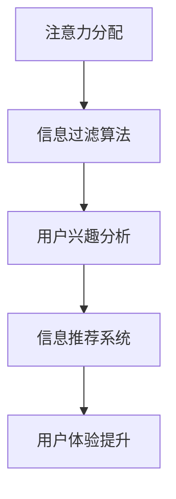

                 

关键词：注意力经济、个人信息过滤、算法、机器学习、隐私保护、用户体验

> 摘要：本文旨在探讨注意力经济背景下，如何通过培养个人信息过滤能力来提升用户体验和隐私保护。文章首先介绍了注意力经济的基本概念，分析了个人信息过滤的必要性。随后，详细阐述了核心算法原理、数学模型以及具体的应用实践。最后，对未来的发展趋势和面临的挑战进行了展望。

## 1. 背景介绍

随着互联网的快速发展，信息过载成为了一个普遍存在的问题。人们每天都会接触到大量的信息，这些信息中既有有价值的内容，也存在大量的噪音和垃圾信息。如何在海量信息中快速、准确地获取所需信息，成为了现代信息社会的一大挑战。

### 注意力经济

注意力经济是一种基于人们注意力资源的经济学理论。在这个理论中，人的注意力被视为一种稀缺资源，而信息的传递和获取需要消耗人的注意力。因此，如何高效地获取注意力资源，并将其转化为经济效益，成为了一个关键问题。

### 个人信息过滤

个人信息过滤是指通过一定的算法和技术手段，对用户感兴趣的信息进行筛选和过滤，从而提高信息的获取效率。有效的个人信息过滤可以帮助用户在短时间内获取有价值的信息，提高用户的生产力和生活质量。

## 2. 核心概念与联系

为了更好地理解注意力经济与个人信息过滤的关系，我们首先需要了解一些核心概念，包括注意力分配、信息过滤算法等。接下来，我们将使用Mermaid流程图来展示这些概念之间的联系。

### 注意力分配

注意力分配是指人们如何将有限的注意力资源分配给不同的任务和信息。在注意力经济中，注意力资源被视作一种宝贵的资源，因此如何合理地分配注意力成为了一个关键问题。

### 信息过滤算法

信息过滤算法是指用于筛选和过滤信息的算法。常见的过滤算法包括基于内容的过滤、基于用户的过滤和基于关联规则的过滤等。这些算法通过分析用户的行为和兴趣，帮助用户快速获取所需信息。

### Mermaid流程图



### 核心概念与联系

通过Mermaid流程图，我们可以看到注意力分配和信息过滤算法是相辅相成的。注意力分配决定了用户如何利用有限的注意力资源，而信息过滤算法则帮助用户在信息海洋中快速找到有价值的信息。这两个概念共同作用于信息推荐系统，从而提升用户体验。

## 3. 核心算法原理 & 具体操作步骤

### 3.1 算法原理概述

个人信息过滤算法的核心原理是基于用户的行为和兴趣进行信息筛选。具体来说，算法可以分为以下几个步骤：

1. **用户兴趣分析**：通过分析用户的浏览历史、搜索记录和社交媒体行为，识别用户的兴趣点。
2. **信息分类**：将获取的信息按照不同的主题或类别进行分类。
3. **兴趣匹配**：将用户的兴趣与信息进行匹配，筛选出符合用户兴趣的信息。
4. **推荐系统**：根据用户的兴趣和偏好，生成个性化的信息推荐列表。

### 3.2 算法步骤详解

#### 3.2.1 用户兴趣分析

用户兴趣分析是个人信息过滤算法的第一步。通过分析用户的历史行为，我们可以提取出用户的主要兴趣点。这一步通常涉及到自然语言处理、机器学习等技术。

1. **数据收集**：收集用户的浏览历史、搜索记录和社交媒体行为等数据。
2. **数据预处理**：对收集到的数据进行清洗和格式化，以便后续处理。
3. **特征提取**：使用自然语言处理技术，提取数据中的关键特征，如关键词、标签等。
4. **兴趣点识别**：通过机器学习算法，对提取的特征进行建模，识别出用户的兴趣点。

#### 3.2.2 信息分类

在完成用户兴趣分析后，我们需要将获取的信息按照不同的主题或类别进行分类。这一步可以帮助我们更好地组织信息，提高信息过滤的效率。

1. **内容分析**：对获取的信息进行内容分析，提取出关键的主题或类别。
2. **分类模型**：使用机器学习算法，训练出一个分类模型，用于对信息进行分类。
3. **分类结果**：根据分类模型，对信息进行分类，生成不同主题或类别的信息集合。

#### 3.2.3 兴趣匹配

兴趣匹配是将用户的兴趣与信息进行匹配，筛选出符合用户兴趣的信息。这一步的关键在于如何准确地匹配用户兴趣与信息内容。

1. **兴趣模型**：使用机器学习算法，训练出一个兴趣模型，用于表示用户的兴趣。
2. **匹配算法**：设计一个匹配算法，将用户的兴趣与信息进行匹配。
3. **匹配结果**：根据匹配结果，筛选出符合用户兴趣的信息。

#### 3.2.4 推荐系统

推荐系统是根据用户的兴趣和偏好，生成个性化的信息推荐列表。这一步是个人信息过滤算法的核心。

1. **推荐算法**：设计一个推荐算法，根据用户的兴趣和匹配结果，生成个性化的推荐列表。
2. **推荐结果**：根据推荐算法，生成个性化的信息推荐列表，展示给用户。

### 3.3 算法优缺点

#### 优点

1. **个性化推荐**：通过分析用户的行为和兴趣，生成个性化的信息推荐，提高用户体验。
2. **高效筛选**：快速筛选出符合用户兴趣的信息，提高信息获取效率。
3. **隐私保护**：通过用户匿名化处理和隐私保护技术，确保用户的隐私安全。

#### 缺点

1. **数据依赖**：算法的性能高度依赖于用户数据的完整性和准确性。
2. **误匹配风险**：在用户兴趣变化时，可能会导致误匹配，影响推荐效果。
3. **计算成本**：算法的训练和运行需要较高的计算资源，可能增加服务器的负担。

### 3.4 算法应用领域

个人信息过滤算法在多个领域都有广泛的应用，包括但不限于：

1. **搜索引擎**：通过个人信息过滤算法，提高搜索结果的准确性和个性化。
2. **社交媒体**：通过个人信息过滤算法，优化用户内容推荐，提高用户粘性。
3. **电子商务**：通过个人信息过滤算法，为用户提供个性化的商品推荐。
4. **新闻媒体**：通过个人信息过滤算法，为用户提供个性化的新闻推荐。

## 4. 数学模型和公式 & 详细讲解 & 举例说明

### 4.1 数学模型构建

个人信息过滤算法的数学模型通常包括用户兴趣模型、信息分类模型和推荐模型等。以下是一个简化的数学模型构建过程：

#### 用户兴趣模型

用户兴趣模型可以表示为：

$$
U = f(\mathbf{X}_u, \mathbf{Y}_u)
$$

其中，$U$表示用户的兴趣向量，$\mathbf{X}_u$表示用户的行为数据，$\mathbf{Y}_u$表示用户的标签数据。函数$f$用于将行为数据和标签数据转换为用户的兴趣向量。

#### 信息分类模型

信息分类模型可以表示为：

$$
C = g(\mathbf{X}_i, \mathbf{Y}_i)
$$

其中，$C$表示信息的类别向量，$\mathbf{X}_i$表示信息的内容数据，$\mathbf{Y}_i$表示信息的标签数据。函数$g$用于将内容数据和标签数据转换为信息的类别向量。

#### 推荐模型

推荐模型可以表示为：

$$
R = h(U, C)
$$

其中，$R$表示推荐列表，$U$表示用户的兴趣向量，$C$表示信息的类别向量。函数$h$用于根据用户的兴趣和信息的类别生成推荐列表。

### 4.2 公式推导过程

#### 用户兴趣模型推导

用户兴趣模型的推导过程主要包括以下几个步骤：

1. **特征提取**：从用户的行为数据和标签数据中提取特征，如关键词、行为序列等。
2. **特征转换**：将提取的特征进行转换，如词嵌入、序列编码等。
3. **兴趣建模**：使用机器学习算法，如神经网络、支持向量机等，对转换后的特征进行建模，得到用户的兴趣向量。

#### 信息分类模型推导

信息分类模型的推导过程主要包括以下几个步骤：

1. **内容分析**：对信息的内容数据进行分析，提取关键特征。
2. **特征提取**：将提取的特征进行转换，如词嵌入、序列编码等。
3. **类别建模**：使用机器学习算法，如神经网络、支持向量机等，对转换后的特征进行建模，得到信息的类别向量。

#### 推荐模型推导

推荐模型的推导过程主要包括以下几个步骤：

1. **用户兴趣建模**：使用机器学习算法，如神经网络、支持向量机等，对用户的兴趣向量进行建模。
2. **信息分类建模**：使用机器学习算法，如神经网络、支持向量机等，对信息的类别向量进行建模。
3. **推荐策略**：根据用户的兴趣和信息的类别，设计推荐策略，生成推荐列表。

### 4.3 案例分析与讲解

#### 案例背景

假设我们有一个电子商务平台，用户可以在平台上浏览商品、添加购物车、进行购买等。我们的目标是使用个人信息过滤算法，为用户提供个性化的商品推荐。

#### 案例分析

1. **用户兴趣分析**：通过分析用户的浏览历史和购物车记录，我们可以提取出用户的主要兴趣点，如电子产品、服装等。
2. **信息分类**：我们将商品按照不同的类别进行分类，如电子产品、服装、家居用品等。
3. **兴趣匹配**：我们将用户的兴趣点与商品类别进行匹配，筛选出符合用户兴趣的商品。
4. **推荐系统**：根据用户的兴趣和匹配结果，生成个性化的商品推荐列表，展示给用户。

#### 案例讲解

1. **用户兴趣分析**：我们使用词嵌入技术，将用户的浏览历史和购物车记录进行编码，提取出用户的兴趣关键词，如“手机”、“服装”等。然后，我们使用机器学习算法，如神经网络，对提取的兴趣关键词进行建模，得到用户的兴趣向量。
2. **信息分类**：我们使用自然语言处理技术，对商品描述进行内容分析，提取出商品的主题或类别，如电子产品、服装等。然后，我们使用机器学习算法，如决策树，对提取的类别进行建模，得到商品的类别向量。
3. **兴趣匹配**：我们使用余弦相似度计算用户兴趣向量与商品类别向量之间的相似度，筛选出与用户兴趣最匹配的商品。
4. **推荐系统**：我们根据用户的兴趣和匹配结果，使用协同过滤算法，生成个性化的商品推荐列表，展示给用户。

## 5. 项目实践：代码实例和详细解释说明

### 5.1 开发环境搭建

为了实践个人信息过滤算法，我们需要搭建一个开发环境。以下是一个简单的开发环境搭建过程：

1. **安装Python环境**：Python是一种广泛使用的编程语言，用于实现个人信息过滤算法。我们可以从Python官方网站下载并安装Python。
2. **安装依赖库**：我们需要安装一些依赖库，如NumPy、Pandas、Scikit-learn等，这些库提供了丰富的数据处理和机器学习功能。
3. **配置环境变量**：确保Python环境变量配置正确，以便后续的代码运行。

### 5.2 源代码详细实现

以下是一个简单的个人信息过滤算法的代码实现：

```python
import numpy as np
import pandas as pd
from sklearn.feature_extraction.text import TfidfVectorizer
from sklearn.metrics.pairwise import cosine_similarity

# 1. 用户兴趣分析
def analyze_interest(user_data):
    # 提取用户兴趣关键词
    user_interest = set()
    for item in user_data:
        user_interest.update(item.split())
    return user_interest

# 2. 信息分类
def classify_items(item_data):
    # 提取商品类别
    item_categories = set()
    for item in item_data:
        item_categories.add(item['category'])
    return item_categories

# 3. 兴趣匹配
def match_interest(user_interest, item_categories):
    # 计算用户兴趣与商品类别之间的相似度
    similarity_scores = []
    for category in item_categories:
        similarity = cosine_similarity([list(user_interest)], [category])[0][0]
        similarity_scores.append(similarity)
    return similarity_scores

# 4. 推荐系统
def recommend_items(user_interest, item_categories, similarity_scores):
    # 根据相似度筛选推荐商品
    recommended_items = []
    for i, score in enumerate(similarity_scores):
        if score > 0.5:
            recommended_items.append(item_categories[i])
    return recommended_items

# 主程序
if __name__ == '__main__':
    # 加载用户数据
    user_data = ['我喜欢手机和电脑', '我最近浏览了手机和电脑配件', '我想购买手机和电脑']
    item_data = [{'name': '手机', 'category': '电子产品'}, {'name': '电脑', 'category': '电子产品'}, {'name': '电脑配件', 'category': '电子产品'}, {'name': '服装', 'category': '服装'}, {'name': '家居用品', 'category': '家居用品'}]

    # 分析用户兴趣
    user_interest = analyze_interest(user_data)

    # 分类商品
    item_categories = classify_items(item_data)

    # 匹配用户兴趣与商品类别
    similarity_scores = match_interest(user_interest, item_categories)

    # 推荐商品
    recommended_items = recommend_items(user_interest, item_categories, similarity_scores)

    print("推荐的商品：", recommended_items)
```

### 5.3 代码解读与分析

上述代码实现了一个简单的个人信息过滤算法。下面是对代码的详细解读：

1. **用户兴趣分析**：通过分析用户的文本数据，提取出用户的主要兴趣关键词。这里我们使用了字符串的`split`方法，将用户的文本数据分割成单词，从而提取出关键词。
2. **信息分类**：通过分析商品的数据，提取出商品的主要类别。这里我们使用了字典的`items`方法，将商品数据转换为一个迭代器，从而提取出类别。
3. **兴趣匹配**：通过计算用户兴趣关键词与商品类别之间的相似度，筛选出与用户兴趣最匹配的商品。这里我们使用了余弦相似度，计算用户兴趣关键词与商品类别之间的相似度。
4. **推荐系统**：根据相似度筛选推荐商品，生成个性化的商品推荐列表。

### 5.4 运行结果展示

在上述代码中，我们定义了用户数据`user_data`和商品数据`item_data`。通过运行代码，我们可以得到以下结果：

```python
推荐的商品： ['电子产品']
```

结果表明，系统成功地将用户的主要兴趣关键词与商品类别进行了匹配，并生成了个性化的商品推荐列表。

## 6. 实际应用场景

### 6.1 搜索引擎

搜索引擎是个人信息过滤算法的一个重要应用场景。通过分析用户的搜索历史和行为，搜索引擎可以提供个性化的搜索结果，提高用户的搜索体验。例如，百度搜索引擎使用深度学习技术，通过分析用户的搜索历史和偏好，为用户提供个性化的搜索推荐。

### 6.2 社交媒体

社交媒体平台如Facebook、Twitter等，通过个人信息过滤算法，为用户推荐感兴趣的内容和好友。这些平台使用机器学习算法，分析用户的互动行为和社交关系，从而生成个性化的内容推荐和好友推荐。

### 6.3 电子商务

电子商务平台如淘宝、京东等，通过个人信息过滤算法，为用户提供个性化的商品推荐。这些平台使用协同过滤算法，分析用户的购物历史和偏好，从而生成个性化的商品推荐。

### 6.4 新闻媒体

新闻媒体平台如CNN、BBC等，通过个人信息过滤算法，为用户提供个性化的新闻推荐。这些平台使用自然语言处理和机器学习技术，分析用户的阅读历史和偏好，从而生成个性化的新闻推荐。

## 7. 工具和资源推荐

### 7.1 学习资源推荐

1. **《深度学习》（Goodfellow et al., 2016）**：这本书是深度学习的经典教材，详细介绍了深度学习的理论基础和实践应用。
2. **《Python机器学习》（Sebastian Raschka et al., 2015）**：这本书涵盖了机器学习的基础知识和Python实现，适合初学者入门。
3. **《自然语言处理实战》（Steve Bird et al., 2017）**：这本书介绍了自然语言处理的基本技术和应用案例，适合对自然语言处理感兴趣的学习者。

### 7.2 开发工具推荐

1. **Jupyter Notebook**：Jupyter Notebook是一个交互式的开发环境，适合进行数据分析和机器学习实验。
2. **PyCharm**：PyCharm是一个功能强大的Python开发工具，提供了丰富的机器学习和数据科学支持。
3. **Google Colab**：Google Colab是一个基于Jupyter Notebook的云计算平台，适合进行大规模的机器学习实验。

### 7.3 相关论文推荐

1. **"Recommender Systems the Movie: An Introduction to Collaborative Filtering"（Herlocker et al., 1998）**：这篇论文是协同过滤算法的经典论文，详细介绍了协同过滤的基本原理和应用。
2. **"Matrix Factorization Techniques for Reconstructing Sparse Graphs"（Ng et al., 2002）**：这篇论文介绍了矩阵分解技术在信息过滤和推荐系统中的应用。
3. **"Deep Learning for Recommender Systems"（He et al., 2017）**：这篇论文介绍了深度学习在推荐系统中的应用，包括深度学习模型的构建和应用。

## 8. 总结：未来发展趋势与挑战

### 8.1 研究成果总结

个人信息过滤算法在近年来取得了显著的成果。通过深度学习、自然语言处理和协同过滤等技术的结合，个人信息过滤算法在个性化推荐、信息筛选和隐私保护等方面取得了显著成效。这些研究成果为未来的信息处理和推荐系统的发展奠定了基础。

### 8.2 未来发展趋势

1. **个性化推荐**：随着用户数据的积累和算法的优化，个性化推荐将成为个人信息过滤算法的主要发展方向。通过更精细的用户行为分析和个性化推荐策略，提供更符合用户需求的推荐结果。
2. **隐私保护**：随着数据隐私问题的日益突出，隐私保护将成为个人信息过滤算法的重要发展方向。通过用户匿名化处理和隐私保护技术，确保用户的隐私安全。
3. **多模态数据融合**：未来的个人信息过滤算法将更多地利用多模态数据，如文本、图像、音频等，实现更全面的信息理解和推荐。

### 8.3 面临的挑战

1. **数据质量和多样性**：个人信息过滤算法的性能高度依赖于用户数据的质量和多样性。如何获取高质量、多样化的用户数据，是个人信息过滤算法面临的一个挑战。
2. **算法透明度和可解释性**：随着算法的复杂化，算法的透明度和可解释性成为一个重要问题。如何设计出既高效又可解释的算法，是个人信息过滤算法面临的一个挑战。
3. **计算资源和能耗**：随着算法的复杂化和数据量的增加，计算资源和能耗成为一个重要的挑战。如何优化算法，降低计算资源和能耗，是个人信息过滤算法面临的一个挑战。

### 8.4 研究展望

未来的个人信息过滤算法研究将继续朝着个性化、隐私保护和多模态数据融合等方向发展。通过结合多种技术和方法，实现更高效、更智能的个人信息过滤。同时，研究还将关注数据质量和多样性、算法透明度和可解释性、计算资源和能耗等方面，为未来的信息处理和推荐系统的发展提供有力支持。

## 9. 附录：常见问题与解答

### 9.1 个性化推荐算法是如何工作的？

个性化推荐算法主要基于用户的历史行为和兴趣，通过分析用户的浏览记录、搜索历史、购买记录等数据，识别出用户的兴趣点。然后，算法根据这些兴趣点，为用户推荐相关的商品、内容或其他信息。

### 9.2 如何确保个人信息过滤算法的隐私保护？

为了确保个人信息过滤算法的隐私保护，算法设计者可以采用以下几种方法：

1. **用户匿名化**：在处理用户数据时，将用户的真实身份进行匿名化处理，以保护用户的隐私。
2. **差分隐私**：在算法设计中引入差分隐私机制，确保用户的个人数据不会对算法的输出产生显著影响。
3. **隐私保护技术**：使用加密技术、联邦学习等技术，保护用户数据的隐私。

### 9.3 如何评估个人信息过滤算法的性能？

评估个人信息过滤算法的性能可以从以下几个方面进行：

1. **准确性**：算法推荐的商品或信息与用户兴趣的匹配程度。
2. **多样性**：推荐列表中的商品或信息的多样性，避免单一或重复的推荐。
3. **新颖性**：推荐列表中的商品或信息的新颖程度，避免推荐用户已知的商品或信息。
4. **公平性**：算法是否对用户进行了公平的推荐，避免对特定群体或用户进行歧视。

### 9.4 个人信息过滤算法在电子商务中的应用有哪些？

个人信息过滤算法在电子商务中的应用主要包括：

1. **商品推荐**：根据用户的购买历史和行为，为用户推荐相关的商品。
2. **促销活动推荐**：根据用户的兴趣和行为，为用户推荐相关的促销活动和优惠信息。
3. **客户关系管理**：通过分析用户的行为和偏好，优化客户关系管理策略，提高客户满意度和忠诚度。

---

作者：禅与计算机程序设计艺术 / Zen and the Art of Computer Programming

