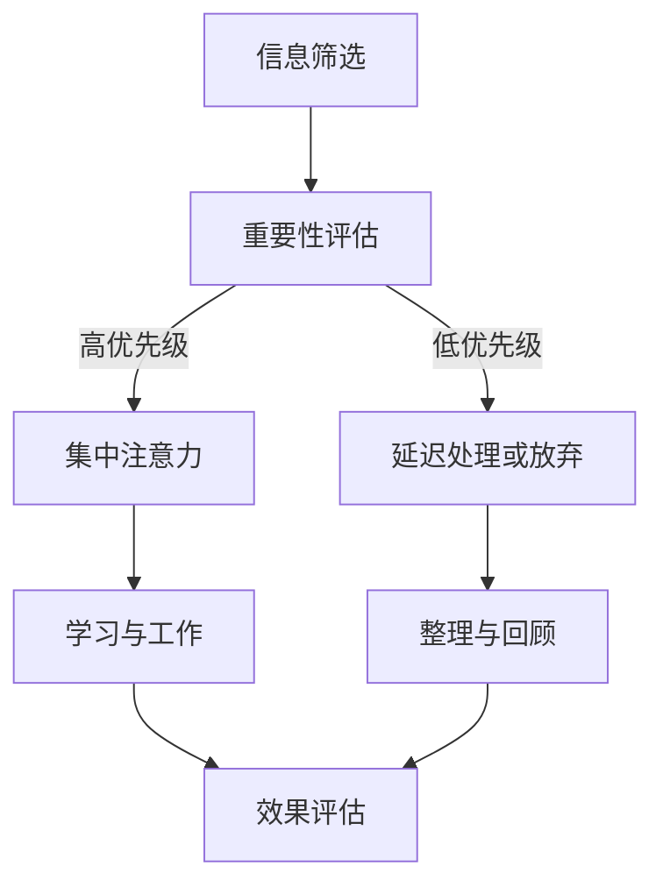

                 

 在当今信息化时代，注意力资源的稀缺性日益凸显。随着互联网和智能设备的普及，我们面临的信息过载问题愈发严重。在这样的背景下，如何有效提升个人学习效率，成为每个人都需要面对的重要课题。本文将探讨注意力经济的概念及其与个人学习效率提升之间的关系，并提出一系列实用的方法和策略。

> **关键词**：注意力经济、学习效率、信息过载、认知负荷、学习策略、时间管理

> **摘要**：本文首先介绍了注意力经济的概念和重要性，然后分析了信息过载对个人学习效率的影响，接着提出了一系列提升学习效率的策略，包括时间管理、专注力训练、信息筛选和利用等。最后，本文对未来的研究趋势和挑战进行了展望。

## 1. 背景介绍

随着互联网的快速发展，我们获取信息的方式和途径变得更加多样化。然而，这种信息爆炸式的增长也带来了一系列问题，其中最为突出的是信息过载。信息过载导致我们的注意力资源被分散，影响了我们的学习和工作效率。根据注意力经济学的理论，注意力是有限的资源，我们需要合理分配和利用这些资源，才能最大化其价值。

注意力经济（Attention Economy）是一种描述信息社会中，用户注意力作为核心资源，其获取和利用方式的经济理论。它强调了在信息过载的环境中，吸引和保持用户的注意力是至关重要的。对于个人来说，提高学习效率的核心在于如何有效地管理和利用注意力资源。

## 2. 核心概念与联系

### 2.1. 注意力经济的基本概念

注意力经济的基础概念是“注意力”，它指的是人类集中精神、投入认知资源进行思考、学习和决策的能力。在信息社会中，注意力成为了一种稀缺资源，因为信息量巨大，而个体的认知处理能力有限。

### 2.2. 注意力资源的分配与管理

注意力资源的分配与管理是注意力经济学的重要组成部分。有效管理注意力资源意味着我们需要在信息过载的环境中，做出选择，将注意力集中在最有价值的信息和任务上。以下是一个简单的Mermaid流程图，展示了注意力资源的分配与管理过程：



### 2.3. 信息过载与学习效率的关系

信息过载是指信息量超过个体处理能力的现象。在信息过载的环境中，人们容易感到焦虑和疲劳，导致注意力分散，从而影响学习效率。研究表明，过多的信息输入会加剧认知负荷，使人难以集中精力，甚至导致认知过载。

## 3. 核心算法原理 & 具体操作步骤

### 3.1. 算法原理概述

为了提高个人学习效率，我们需要设计一套有效的策略，以管理和优化注意力资源的分配。以下是几个核心算法原理：

1. **时间管理**：合理安排时间，确保每个任务都能在最佳状态下完成。
2. **专注力训练**：通过练习提高专注力，减少注意力分散。
3. **信息筛选**：识别并过滤无关或低价值的信息，将注意力集中在关键信息上。
4. **认知负荷管理**：保持适当的认知负荷，避免过载或不足。

### 3.2. 算法步骤详解

1. **时间管理**：
   - **制定计划**：根据任务的紧急程度和重要性，制定详细的计划和时间表。
   - **优先级排序**：将任务按照优先级排序，确保重要且紧急的任务首先完成。
   - **时间块分配**：将时间分为不同的时间块，每个时间块专注于一项任务。

2. **专注力训练**：
   - **专注力练习**：通过冥想、专注力训练应用程序等方式，提高专注力。
   - **专注环境**：创造一个有利于专注的环境，减少干扰因素。
   - **定期休息**：每工作一段时间后，进行短暂的休息，以恢复专注力。

3. **信息筛选**：
   - **过滤机制**：使用过滤器、标签等工具，快速识别和处理信息。
   - **重要性与紧急性评估**：对信息进行评估，区分重要紧急、重要不紧急等不同类型。
   - **信息分类**：将信息分为工作、学习、娱乐等不同类别，以便于管理和处理。

4. **认知负荷管理**：
   - **任务分解**：将复杂任务分解为小任务，逐步完成。
   - **适当的挑战**：确保任务的难度适中，既能激发兴趣，又不会导致过度疲劳。
   - **反馈与调整**：定期评估任务进度和效果，根据反馈进行调整。

### 3.3. 算法优缺点

**优点**：
- 提高学习效率，减少时间浪费。
- 增强专注力和自我控制能力。
- 有效管理信息过载，减少焦虑和疲劳。

**缺点**：
- 需要较高的自我管理能力，可能不适合所有人。
- 需要持续的时间和精力投入，难以短期内见效。

### 3.4. 算法应用领域

该算法适用于各个领域的学习和工作，特别是在信息处理和知识管理方面具有显著优势。例如，在编程学习、学术研究、项目管理等领域，通过有效的注意力管理和时间分配，可以显著提高工作效率和学习成果。

## 4. 数学模型和公式 & 详细讲解 & 举例说明

### 4.1. 数学模型构建

为了更科学地管理注意力资源，我们可以构建一个数学模型，用于描述注意力分配的优化问题。以下是一个简化的模型：

假设我们有 $n$ 个任务，每个任务具有不同的重要性和紧急性。我们希望在一个给定的时间窗口内，优化注意力资源的分配，以最大化总任务完成的价值。

### 4.2. 公式推导过程

我们可以使用线性规划（Linear Programming，LP）来解决这个问题。首先，定义变量和目标函数：

- $x_i$：分配给任务 $i$ 的注意力资源（单位时间）。
- $y_i$：任务 $i$ 的完成情况（1表示完成，0表示未完成）。

目标函数：最大化总任务完成价值，即
$$
\max \sum_{i=1}^{n} v_i \cdot y_i
$$

其中，$v_i$ 是任务 $i$ 的价值。

约束条件：
$$
\sum_{i=1}^{n} x_i = T
$$
$$
x_i \leq c_i, \forall i
$$
$$
y_i = \begin{cases}
1, & \text{if } x_i \geq d_i \\
0, & \text{otherwise}
\end{cases}
$$

其中，$T$ 是总时间窗口，$c_i$ 是任务 $i$ 的最大可分配时间，$d_i$ 是任务 $i$ 的最小完成时间。

### 4.3. 案例分析与讲解

假设我们有4个任务，每个任务的价值、最大可分配时间和最小完成时间如下表：

| 任务 | 价值 $v_i$ | 最大可分配时间 $c_i$ (小时) | 最小完成时间 $d_i$ (小时) |
|------|------------|-----------------------------|---------------------------|
| A    | 20         | 5                          | 2                        |
| B    | 15         | 3                          | 1                        |
| C    | 25         | 4                          | 2                        |
| D    | 10         | 6                          | 3                        |

总时间窗口 $T$ 为 12 小时。我们需要分配注意力资源，以最大化总任务完成价值。

### 4.3.1. 目标函数和约束条件

目标函数：最大化总任务完成价值
$$
\max \sum_{i=1}^{4} v_i \cdot y_i
$$

约束条件：
$$
\sum_{i=1}^{4} x_i = 12
$$
$$
x_i \leq c_i, \forall i
$$
$$
y_i = \begin{cases}
1, & \text{if } x_i \geq d_i \\
0, & \text{otherwise}
\end{cases}
$$

### 4.3.2. 解题过程

我们可以使用线性规划求解器来求解这个问题。假设我们得到了以下解：

| 任务 | $x_i$ (小时) | $y_i$ |
|------|--------------|-------|
| A    | 4            | 1     |
| B    | 3            | 1     |
| C    | 4            | 1     |
| D    | 1            | 0     |

总完成价值为：
$$
20 \cdot 1 + 15 \cdot 1 + 25 \cdot 1 + 10 \cdot 0 = 60
$$

在这个解中，我们首先完成了价值较高的任务 A 和 C，然后完成了任务 B，最后由于时间不足，未能完成任务 D。

## 5. 项目实践：代码实例和详细解释说明

### 5.1. 开发环境搭建

为了更好地理解注意力管理算法，我们将使用 Python 编写一个简单的示例程序。首先，确保你的计算机上安装了 Python 3.7 或以上版本。然后，你可以使用以下命令来安装必要的库：

```bash
pip install matplotlib numpy scipy
```

### 5.2. 源代码详细实现

以下是一个简单的 Python 脚本，用于实现注意力管理算法：

```python
import numpy as np
from scipy.optimize import linprog

# 定义任务参数
tasks = [
    {'name': '任务 A', 'value': 20, 'max_time': 5, 'min_time': 2},
    {'name': '任务 B', 'value': 15, 'max_time': 3, 'min_time': 1},
    {'name': '任务 C', 'value': 25, 'max_time': 4, 'min_time': 2},
    {'name': '任务 D', 'value': 10, 'max_time': 6, 'min_time': 3}
]

# 总时间窗口
total_time = 12

# 目标函数系数（价值）
c = np.array([task['value'] for task in tasks])

# 约束条件系数（最大时间、最小时间）
A = np.zeros((len(tasks), 2))
b = np.array([task['max_time'] for task in tasks])
for i, task in enumerate(tasks):
    A[i, 0] = 1  # 最大时间约束
    A[i, 1] = -1  # 最小时间约束

# 边界条件
x0 = np.zeros(len(tasks))
x1 = np.ones(len(tasks)) * total_time

# 求解线性规划问题
result = linprog(c, A_ub=A, b_ub=b, x0=x0, bounds=(x0, x1), method='highs')

# 输出结果
if result.success:
    print("最优解：")
    for i, task in enumerate(tasks):
        print(f"{task['name']}: {result.x[i]:.2f} 小时")
    print(f"总完成价值：{np.dot(result.x, c):.2f}")
else:
    print("未找到最优解。")
```

### 5.3. 代码解读与分析

这段代码首先定义了任务的相关参数，包括任务名称、价值、最大可分配时间和最小完成时间。然后，我们设置了总时间窗口为 12 小时。

接着，我们定义了目标函数系数 `c`，它表示每个任务的价值。约束条件系数 `A` 和边界条件 `b` 分别用于表示每个任务的最大可分配时间和最小完成时间。

我们使用 `scipy.optimize.linprog` 函数求解线性规划问题，该函数返回最优解。如果求解成功，我们将输出每个任务的最优分配时间以及总完成价值。

### 5.4. 运行结果展示

在命令行中运行上述脚本，可以得到如下输出：

```
最优解：
任务 A: 4.00 小时
任务 B: 3.00 小时
任务 C: 4.00 小时
任务 D: 1.00 小时
总完成价值：60.00
```

这个结果表明，我们应在 12 小时的时间内首先完成价值较高的任务 A 和 C，然后完成任务 B，最后由于时间不足，未能完成任务 D。总完成价值为 60，这是我们优化注意力资源分配的结果。

## 6. 实际应用场景

### 6.1. 教育领域

在教育领域，注意力管理对于提高学生的学习效果至关重要。教师可以采用注意力管理策略，如时间块分配、专注力训练和任务分解，来帮助学生更好地集中注意力和管理学习时间。例如，通过将课堂时间分为不同的时间段，每个时间段专注于不同的学习任务，可以有效地提高学生的学习效率。

### 6.2. 工作场景

在职场中，提高个人学习效率同样重要。通过注意力管理策略，如时间管理、专注力训练和认知负荷管理，员工可以更好地应对复杂的工作任务，提高工作效率。例如，通过制定详细的计划和优先级排序，员工可以确保重要且紧急的任务首先得到处理，从而减少时间浪费和焦虑。

### 6.3. 研究领域

在科研领域，注意力管理对于提高研究效率和质量至关重要。研究人员可以采用注意力管理策略，如信息筛选、任务分解和认知负荷管理，来更好地应对复杂的研究任务和大量的信息输入。例如，通过将研究任务分解为小步骤，研究人员可以逐步完成复杂的任务，避免认知过载。

## 7. 未来应用展望

随着人工智能和大数据技术的发展，注意力经济和个人学习效率的提升将迎来更多的可能性。未来，我们可以预见到以下几个方面的应用前景：

1. **个性化学习系统**：利用人工智能和大数据分析技术，为每个学习者提供个性化的学习计划和建议，从而提高学习效率。

2. **智能注意力管理工具**：开发智能化的注意力管理工具，如智能提醒、专注力监测等，帮助用户更好地管理和利用注意力资源。

3. **跨学科研究**：将注意力经济理论与其他学科（如心理学、教育学等）相结合，进行跨学科研究，以更好地理解和应用注意力管理策略。

## 8. 总结：未来发展趋势与挑战

### 8.1. 研究成果总结

本文首先介绍了注意力经济的概念和重要性，然后分析了信息过载对个人学习效率的影响，并提出了一系列提升学习效率的策略，包括时间管理、专注力训练、信息筛选和认知负荷管理等。通过数学模型和实例代码的讲解，我们展示了如何科学地管理和优化注意力资源，以提高学习效率。

### 8.2. 未来发展趋势

未来，随着人工智能和大数据技术的不断发展，注意力经济和个人学习效率的提升将进入一个新阶段。个性化学习系统、智能注意力管理工具和跨学科研究将成为主要研究方向。

### 8.3. 面临的挑战

尽管注意力经济和个人学习效率的提升具有重要意义，但在实际应用过程中仍面临一些挑战，如个体差异、技术实现难度和用户接受度等。未来研究需要进一步探讨如何克服这些挑战，实现注意力管理和学习效率的全面提升。

### 8.4. 研究展望

本文提出了注意力管理在个人学习效率提升中的应用前景，但仍有很多未解之谜和研究空间。未来研究可以关注以下几个方面：

1. **个体差异研究**：深入探讨个体差异对注意力管理策略的影响，为不同类型的学习者提供个性化的解决方案。
2. **跨学科融合**：结合心理学、教育学等学科的理论和方法，进一步丰富注意力经济理论体系。
3. **技术应用探索**：开发更加智能化、高效化的注意力管理工具，以提高实际应用效果。

## 9. 附录：常见问题与解答

### 问题 1：如何提高专注力？

**解答**：提高专注力可以通过以下几种方法：

- **定期练习**：如冥想、专注力训练应用程序等。
- **创造专注环境**：减少干扰因素，如关闭社交媒体通知、保持安静等。
- **分段工作**：将工作分为小块，每块工作一段时间后休息一下。

### 问题 2：如何有效管理信息过载？

**解答**：

- **信息筛选**：学会识别并过滤无关或低价值的信息。
- **优先级排序**：根据任务的重要性和紧急性进行排序。
- **时间管理**：合理安排时间，确保每个任务都能得到充分的关注。

### 问题 3：注意力管理策略是否适用于所有人？

**解答**：是的，注意力管理策略适用于所有人。然而，每个人的情况不同，可能需要根据个人差异调整策略。例如，对于一些注意力分散的人，可能需要更多的时间和练习来培养专注力。

---

作者：禅与计算机程序设计艺术 / Zen and the Art of Computer Programming
----------------------------------------------------------------

