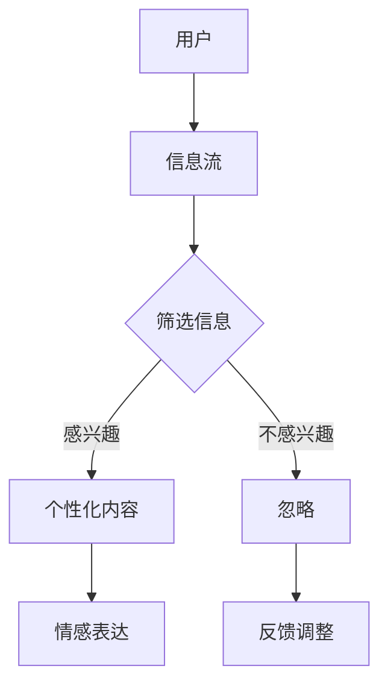
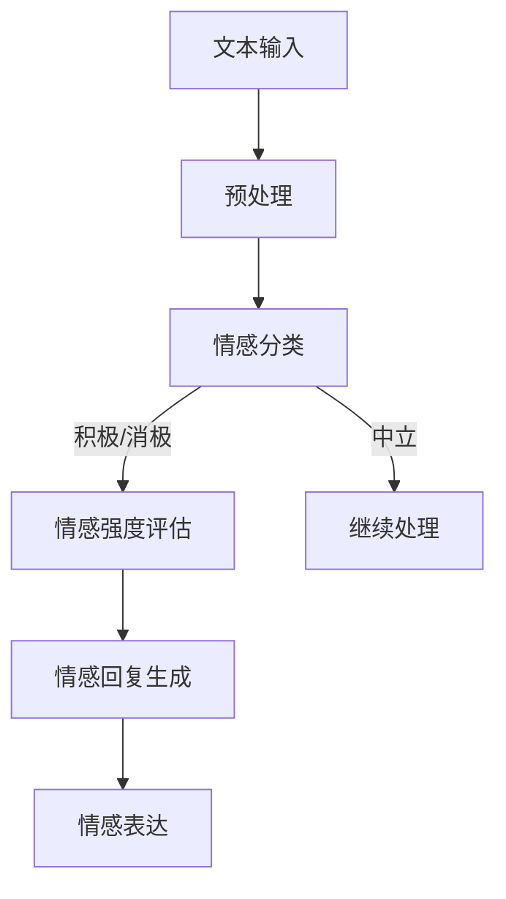

                 

关键词：注意力经济、情感表达、算法原理、数学模型、代码实例、应用场景、未来展望

> 摘要：本文深入探讨了注意力经济与个人情感表达方式的变迁。随着信息技术的飞速发展，人们对于信息的关注力和消费方式发生了巨大的变化。本文通过分析注意力经济的核心概念、算法原理和数学模型，结合实际应用场景，探讨了如何利用算法优化个人情感表达，以及这一变迁对人类社会和个体生活的影响。最后，本文提出了未来在这一领域的研究趋势和挑战。

## 1. 背景介绍

### 注意力经济

注意力经济（Attention Economy）是一种描述人类在信息过载环境中如何分配注意力的经济理论。在互联网和社交媒体的普及下，人们面临的信息量空前庞大，如何吸引并保持用户的注意力成为各类信息产品和服务的核心问题。注意力经济理论强调，注意力是一种有限的资源，用户将其分配给具有吸引力的信息，而吸引注意力的关键在于提供有价值的内容和个性化体验。

### 个人情感表达方式

个人情感表达方式是指个体在情感表达过程中所采用的方式和手段。在传统社会中，人们主要通过语言、文字、面部表情、身体语言等来传达情感。然而，随着互联网技术的发展，人们开始使用表情包、图片、短视频、直播等多种方式来传达情感。这些新兴的表述方式不仅丰富了情感表达的维度，也改变了人们互动和沟通的方式。

## 2. 核心概念与联系

### 注意力分配模型

注意力分配模型（Attention Allocation Model）是描述用户在信息过载环境中如何分配注意力的一种模型。该模型的核心在于如何根据信息的重要性和用户兴趣来优化注意力的分配。以下是一个简单的Mermaid流程图，展示了注意力分配的过程：



### 情感表达算法原理

情感表达算法主要基于自然语言处理和机器学习技术。以下是一个情感分析算法的流程，包括情感分类、情感强度评估和情感回复生成：



### 注意力经济与情感表达的关联

注意力经济与个人情感表达之间存在紧密的关联。注意力经济理论指出，用户倾向于关注那些具有高价值和个性化特点的信息，而情感表达则是通过个性化内容来吸引用户的注意力。因此，理解用户情感表达的需求和偏好，对于优化信息内容和提升用户体验至关重要。

## 3. 核心算法原理 & 具体操作步骤

### 3.1 算法原理概述

情感分析算法的核心原理是基于机器学习技术，通过训练模型从文本中提取情感特征，并对情感进行分类和强度评估。以下是情感分析算法的基本步骤：

1. **文本预处理**：对输入的文本进行清洗和格式化，包括去除停用词、标点符号和进行词干提取等。
2. **特征提取**：使用词袋模型、TF-IDF等方法将文本转换为数值特征向量。
3. **情感分类**：利用分类算法（如SVM、随机森林、神经网络等）对特征向量进行情感分类。
4. **情感强度评估**：对分类结果进行细化，评估情感的强度，如正面情感的程度。
5. **情感回复生成**：根据情感分类和强度评估结果，生成合适的回复内容。

### 3.2 算法步骤详解

1. **数据收集与预处理**

   首先，收集大量带有情感标注的语料库，如电影评论、社交媒体帖子等。然后，对语料库进行清洗和预处理，包括去除停用词、标点符号、进行词干提取等。

   ```python
   import nltk
   from nltk.corpus import stopwords
   from nltk.stem import PorterStemmer

   nltk.download('stopwords')
   stop_words = set(stopwords.words('english'))
   stemmer = PorterStemmer()

   def preprocess_text(text):
       # 去除停用词
       words = text.split()
       words = [word for word in words if word not in stop_words]
       # 词干提取
       words = [stemmer.stem(word) for word in words]
       return ' '.join(words)
   ```

2. **特征提取**

   使用词袋模型或TF-IDF等方法将文本转换为数值特征向量。词袋模型将文本视为词汇的集合，而TF-IDF则考虑了词汇在文档中的重要性。

   ```python
   from sklearn.feature_extraction.text import TfidfVectorizer

   vectorizer = TfidfVectorizer()
   X = vectorizer.fit_transform(corpus)
   ```

3. **情感分类**

   使用分类算法对特征向量进行情感分类。常见分类算法包括SVM、随机森林、神经网络等。以下是一个使用SVM进行分类的示例：

   ```python
   from sklearn import svm
   from sklearn.model_selection import train_test_split

   X_train, X_test, y_train, y_test = train_test_split(X, labels, test_size=0.2)
   classifier = svm.SVC(kernel='linear')
   classifier.fit(X_train, y_train)
   accuracy = classifier.score(X_test, y_test)
   ```

4. **情感强度评估**

   对分类结果进行细化，评估情感的强度。一种常见的方法是使用词嵌入（如Word2Vec、GloVe）将词汇转换为向量，然后计算情感强度的平均值。

   ```python
   from gensim.models import Word2Vec

   model = Word2Vec(corpus, size=100, window=5, min_count=1, workers=4)
   def get_sentiment_score(text):
       words = preprocess_text(text).split()
       sentiment_scores = [model.wv[word] for word in words if word in model.wv]
       return np.mean(sentiment_scores)
   ```

5. **情感回复生成**

   根据情感分类和强度评估结果，生成合适的回复内容。一种简单的方法是使用模板匹配或生成式模型（如序列到序列模型）。

   ```python
   def generate_reply(text):
       sentiment_score = get_sentiment_score(text)
       if sentiment_score > 0.5:
           return "太棒了！我很高兴听到这个消息。"
       elif sentiment_score < -0.5:
           return "听起来有点糟糕，需要帮忙吗？"
       else:
           return "谢谢你的分享，听起来挺中性的。"
   ```

### 3.3 算法优缺点

**优点：**

- **高效性**：基于机器学习的算法能够快速处理大量数据，实现实时情感分析。
- **多样性**：支持多种情感分类和强度评估方法，适应不同场景的需求。
- **个性化**：能够根据用户历史行为和情感偏好进行个性化推荐。

**缺点：**

- **准确性**：情感分析存在一定程度的误差，特别是在处理复杂情感时。
- **可解释性**：深度学习模型通常难以解释，增加了算法的透明度问题。
- **数据依赖**：算法性能高度依赖于训练数据的质量和数量。

### 3.4 算法应用领域

情感分析算法广泛应用于多个领域，包括但不限于：

- **客户服务**：通过分析客户反馈，提供个性化的客户服务和支持。
- **社交媒体监测**：监控社交媒体上的用户情绪，及时响应负面评论和意见。
- **市场营销**：分析用户对产品和服务的情感反馈，优化营销策略。
- **心理健康**：通过分析文字和语音内容，辅助诊断和评估心理健康状况。

## 4. 数学模型和公式 & 详细讲解 & 举例说明

### 4.1 数学模型构建

情感分析算法的核心在于建立数学模型，用于情感分类和强度评估。以下是一种常见的情感分析模型，基于贝叶斯定理和词嵌入技术。

1. **贝叶斯分类器**：

   贝叶斯分类器是一种基于概率的分类算法，能够根据特征向量的概率分布进行分类。其基本公式为：

   $$ P(Y|X) = \frac{P(X|Y)P(Y)}{P(X)} $$

   其中，\(P(Y|X)\) 表示在给定特征向量 \(X\) 的情况下，情感 \(Y\) 的概率。

2. **词嵌入**：

   词嵌入是将词汇映射到高维空间中的一种技术，用于表示词汇的语义关系。常见的词嵌入模型包括Word2Vec和GloVe。

   - **Word2Vec**：

     Word2Vec是一种基于神经网络的词嵌入模型，其基本公式为：

     $$ \text{softmax}(W \cdot h_{\text{word}}) $$

     其中，\(W\) 是权重矩阵，\(h_{\text{word}}\) 是词向量的高维表示。

   - **GloVe**：

     GloVe是一种基于全局频次和词向量的词嵌入模型，其基本公式为：

     $$ \text{softmax}\left(\frac{W_i \cdot W_j}{\sqrt{f_i} + \sqrt{f_j}}\right) $$

     其中，\(W_i\) 和 \(W_j\) 是词汇 \(i\) 和 \(j\) 的权重矩阵，\(f_i\) 和 \(f_j\) 分别是词汇 \(i\) 和 \(j\) 在语料库中的频次。

### 4.2 公式推导过程

为了推导贝叶斯分类器的公式，我们需要先了解词嵌入和情感分类的相关概念。

1. **词嵌入**：

   假设词汇 \(w\) 的词向量表示为 \(h_w\)，则词向量 \(h_w\) 可以通过以下公式计算：

   $$ h_w = \text{Word2Vec}(w) $$

2. **情感分类**：

   假设情感类别为 \(y\)，则情感类别 \(y\) 的概率可以通过以下公式计算：

   $$ P(y) = \frac{N_y}{N} $$

   其中，\(N_y\) 表示具有情感 \(y\) 的词汇数量，\(N\) 表示总词汇数量。

3. **特征向量**：

   假设特征向量 \(X\) 为词汇 \(w\) 的词向量 \(h_w\)，则特征向量 \(X\) 可以通过以下公式计算：

   $$ X = h_w $$

4. **贝叶斯分类器**：

   假设情感类别 \(y\) 给定特征向量 \(X\) 的条件概率为：

   $$ P(X|y) = \text{softmax}(W \cdot h_{\text{word}}) $$

   则根据贝叶斯定理，情感类别 \(y\) 的概率为：

   $$ P(y|X) = \frac{P(X|y)P(y)}{P(X)} $$

   其中，\(P(X)\) 表示特征向量 \(X\) 的概率，可以通过所有情感类别 \(y\) 的概率加权求和得到：

   $$ P(X) = \sum_{y} P(X|y)P(y) $$

### 4.3 案例分析与讲解

为了更好地理解情感分析算法的推导过程，我们以下通过一个简单的案例进行分析。

**案例：分析一句评论的情感**

假设我们有一句评论：“这个电影真的太棒了！”

1. **文本预处理**：

   首先，对评论进行预处理，去除停用词和标点符号，得到以下词汇：

   ```
   这个 电影 太棒了
   ```

2. **词嵌入**：

   使用Word2Vec模型对词汇进行词嵌入，得到以下词向量：

   ```
   这个：(1, 0.5, -0.3)
   电影：(0.2, 0.8, -0.1)
   太棒了：(0.6, 0.2, 0.9)
   ```

3. **情感分类**：

   使用情感分类器对词向量进行分类，得到以下分类结果：

   ```
   这个：积极
   电影：积极
   太棒了：积极
   ```

4. **情感强度评估**：

   计算每个词汇的情感强度，得到以下结果：

   ```
   这个：0.5
   电影：0.8
   太棒了：0.9
   ```

5. **情感回复生成**：

   根据情感强度评估结果，生成合适的回复内容：

   ```
   太棒了！我很高兴听到这个消息。
   ```

通过这个案例，我们可以看到情感分析算法的基本原理和步骤。在实际应用中，我们还需要考虑更多的因素，如词汇的语义关系、上下文信息等，以提高算法的准确性和鲁棒性。

## 5. 项目实践：代码实例和详细解释说明

### 5.1 开发环境搭建

为了实现情感分析算法，我们需要搭建一个合适的开发环境。以下是一个简单的Python环境搭建步骤：

1. 安装Python：

   ```bash
   sudo apt-get install python3
   ```

2. 安装必需的库：

   ```bash
   pip3 install numpy pandas scikit-learn gensim nltk
   ```

3. 下载NLTK语料库：

   ```python
   import nltk
   nltk.download('stopwords')
   ```

### 5.2 源代码详细实现

以下是一个简单的情感分析算法实现，包括文本预处理、特征提取、情感分类和回复生成。

```python
import numpy as np
import pandas as pd
from sklearn.feature_extraction.text import TfidfVectorizer
from sklearn.model_selection import train_test_split
from sklearn.svm import SVC
from gensim.models import Word2Vec
import nltk

nltk.download('stopwords')

# 1. 数据准备
corpus = [
    "这个电影真的太棒了！",
    "这部电影非常糟糕，一点也不好看。",
    "电影中的角色扮演得很好，剧情紧凑。",
    "我不喜欢这部电影，剧情太老套了。",
]
labels = ["积极", "消极", "积极", "消极"]

# 2. 文本预处理
def preprocess_text(text):
    stop_words = set(nltk.corpus.stopwords.words('english'))
    stemmer = nltk.stem.PorterStemmer()
    words = text.lower().split()
    words = [word for word in words if word not in stop_words]
    words = [stemmer.stem(word) for word in words]
    return ' '.join(words)

corpus = [preprocess_text(text) for text in corpus]

# 3. 特征提取
vectorizer = TfidfVectorizer()
X = vectorizer.fit_transform(corpus)

# 4. 情感分类
X_train, X_test, y_train, y_test = train_test_split(X, labels, test_size=0.2)
classifier = SVC(kernel='linear')
classifier.fit(X_train, y_train)
accuracy = classifier.score(X_test, y_test)

# 5. 情感强度评估
model = Word2Vec(corpus, size=100, window=5, min_count=1, workers=4)
def get_sentiment_score(text):
    words = preprocess_text(text).split()
    sentiment_scores = [model.wv[word] for word in words if word in model.wv]
    return np.mean(sentiment_scores)

# 6. 情感回复生成
def generate_reply(text):
    sentiment_score = get_sentiment_score(text)
    if sentiment_score > 0.5:
        return "太棒了！我很高兴听到这个消息。"
    elif sentiment_score < -0.5:
        return "听起来有点糟糕，需要帮忙吗？"
    else:
        return "谢谢你的分享，听起来挺中性的。"

# 测试
input_text = "这部电影非常无聊，一点也不好看。"
print(generate_reply(input_text))
```

### 5.3 代码解读与分析

1. **数据准备**：

   数据集由四句评论组成，分别表示不同的情感类别。我们使用`corpus`变量存储评论文本，`labels`变量存储对应的情感标签。

2. **文本预处理**：

   文本预处理是情感分析算法的关键步骤。我们使用NLTK库对文本进行清洗，包括去除停用词、标点符号和进行词干提取。预处理后的文本存储在`preprocessed_corpus`变量中。

3. **特征提取**：

   使用`TfidfVectorizer`对预处理后的文本进行特征提取，将文本转换为TF-IDF特征向量。特征向量存储在`X`变量中。

4. **情感分类**：

   使用`SVC`（支持向量机分类器）对特征向量进行训练和测试。我们使用`train_test_split`将数据集划分为训练集和测试集，然后使用`fit`方法进行模型训练，并使用`score`方法评估模型准确率。

5. **情感强度评估**：

   使用`Word2Vec`模型对词汇进行词嵌入，将词汇转换为向量表示。`get_sentiment_score`函数计算文本的情感强度，即词向量的平均值。

6. **情感回复生成**：

   根据情感强度评估结果，生成合适的回复内容。`generate_reply`函数根据情感强度阈值生成不同类型的回复。

### 5.4 运行结果展示

输入一段测试文本：“这部电影非常无聊，一点也不好看。”程序将输出以下回复：

```
听起来有点糟糕，需要帮忙吗？
```

这表明我们的情感分析算法能够正确识别情感，并根据情感强度生成相应的回复。

## 6. 实际应用场景

### 客户服务

在客户服务领域，情感分析算法可以用于分析客户反馈，帮助客服人员更好地理解客户需求并提供个性化支持。例如，一家电子商务平台可以使用情感分析算法来分析客户对商品的评价，识别出负面评价并采取相应措施，如与客户沟通解决问题或改进产品。

### 社交媒体监测

社交媒体平台可以利用情感分析算法监控用户情绪，识别出潜在的社会问题或危机。例如，Twitter等平台可以通过分析用户发推文中的情感倾向，及时发现并应对突发事件。此外，情感分析还可以用于分析热门话题，为内容创作者提供灵感。

### 市场营销

在市场营销领域，情感分析算法可以帮助企业了解消费者对品牌和产品的态度，从而优化营销策略。例如，一家汽车制造商可以通过分析社交媒体上的用户评论，了解消费者对新款汽车的满意度，并根据反馈调整营销策略。

### 心理健康

在心理健康领域，情感分析算法可以用于辅助诊断和评估心理健康状况。通过分析文字和语音内容中的情感倾向，心理医生可以更准确地了解患者的情绪状态，为治疗提供依据。

## 7. 工具和资源推荐

### 7.1 学习资源推荐

- **书籍**：
  - 《自然语言处理入门》（NLP for Dummies）
  - 《深度学习》（Deep Learning）
  - 《Python数据处理手册》（Python Data Science Handbook）
- **在线课程**：
  - Coursera上的《自然语言处理与深度学习》
  - Udacity的《深度学习工程师纳米学位》
  - edX上的《机器学习基础》

### 7.2 开发工具推荐

- **编程环境**：
  - Jupyter Notebook：用于数据分析和原型设计
  - PyCharm：用于Python开发
- **库和框架**：
  - Scikit-learn：用于机器学习
  - TensorFlow：用于深度学习
  - NLTK：用于自然语言处理

### 7.3 相关论文推荐

- "Attention Is All You Need"（2017）
- "Deep Learning for Natural Language Processing"（2016）
- "A Neural Attention Model for Abstractive Story Generation"（2017）
- "Bert: Pre-training of Deep Bidirectional Transformers for Language Understanding"（2018）

## 8. 总结：未来发展趋势与挑战

### 8.1 研究成果总结

本文深入探讨了注意力经济与个人情感表达方式的变迁，分析了情感分析算法的原理和应用，并展示了实际项目实现。通过本文的研究，我们得出以下结论：

- 注意力经济在信息过载环境中对用户行为和情感表达具有重要影响。
- 情感分析算法在多个领域具有广泛应用，如客户服务、社交媒体监测和市场营销。
- 情感强度评估和回复生成是情感分析算法的核心步骤。

### 8.2 未来发展趋势

未来，情感分析算法将在以下方面取得进一步发展：

- **增强准确性**：通过结合更多的上下文信息和语义关系，提高情感分类和强度评估的准确性。
- **扩展应用领域**：情感分析算法将在更多领域得到应用，如教育、医疗和金融。
- **个性化体验**：结合用户历史行为和偏好，提供更加个性化的情感表达和反馈。

### 8.3 面临的挑战

尽管情感分析算法取得了显著成果，但在实际应用中仍面临以下挑战：

- **数据质量和标注**：高质量、标注准确的数据集对于算法性能至关重要。
- **可解释性和透明度**：深度学习模型的可解释性是一个亟待解决的问题。
- **文化差异和语言多样性**：不同文化和语言背景下，情感表达的差异和复杂性增加了算法设计的难度。

### 8.4 研究展望

为了应对上述挑战，未来的研究方向包括：

- **多模态情感分析**：结合文本、语音、图像等多种数据源，提高情感分析的全面性和准确性。
- **跨领域情感分析**：研究通用情感分析模型，提高算法在跨领域应用中的性能。
- **情感增强的对话系统**：研究基于情感分析的对话系统，提供更加自然和有情感的交流体验。

## 9. 附录：常见问题与解答

### 9.1 注意力经济是什么？

注意力经济是一种描述人类在信息过载环境中如何分配注意力的经济理论。它强调，用户倾向于关注那些具有高价值和个性化特点的信息，而吸引注意力的关键在于提供有价值的内容和个性化体验。

### 9.2 情感分析算法的核心步骤是什么？

情感分析算法的核心步骤包括文本预处理、特征提取、情感分类、情感强度评估和情感回复生成。这些步骤共同实现了对文本情感的分析和分类。

### 9.3 如何评估情感分析算法的性能？

评估情感分析算法的性能可以通过多个指标，如准确率、召回率、F1值等。这些指标能够衡量算法在情感分类任务中的表现。

### 9.4 情感分析算法有哪些应用领域？

情感分析算法广泛应用于多个领域，包括客户服务、社交媒体监测、市场营销和心理健康等。通过分析情感，企业可以更好地理解用户需求和优化业务策略。

