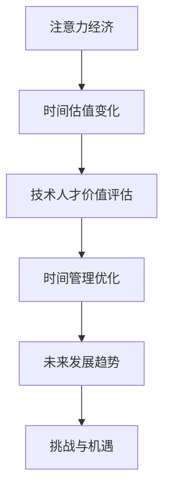

                 

关键词：注意力经济，时间估值，个人价值，数据分析，算法优化

> 摘要：本文将从注意力经济的视角出发，探讨个人时间估值的变化及其对信息技术领域的影响。通过对注意力经济概念的分析，结合个人时间估值的理论框架，文章将深入探讨注意力经济对技术人才的价值评估、时间管理、以及未来的发展趋势。本文旨在为读者提供一个全面、系统的理解，帮助其在信息技术领域更好地应对注意力经济的挑战。

## 1. 背景介绍

随着信息技术的飞速发展，人类进入了一个数据爆炸的时代。在这个背景下，注意力资源显得尤为宝贵。注意力经济作为近年来备受关注的经济模式，指的是在信息过载的环境下，人们对于稀缺注意力资源的竞争和利用。这种模式深刻地影响了个人时间的估值，使得时间成为了一种新的经济资源。

个人时间估值的变化，源于人们对时间价值的重新认识。在过去，时间被视为一种消费资源，其价值主要通过劳动时间来体现。然而，随着信息技术的普及，人们对于时间的认识发生了转变，开始意识到时间是一种稀缺资源，其价值不仅仅是劳动时间的长短，更取决于如何高效利用。

本文将从注意力经济的视角，深入探讨个人时间估值的变化，分析其对于信息技术领域的影响，并提出未来发展的趋势与挑战。

## 2. 核心概念与联系

### 2.1 注意力经济概念

注意力经济是指，在信息过载的环境下，人们对于稀缺注意力资源的竞争和利用。它起源于广告行业，随着互联网的兴起，逐渐成为一个广泛的经济模式。注意力经济的基本原理是，注意力是有限的资源，而信息是无限的资源。因此，如何在信息过载的环境中吸引并保持人们的注意力，成为了一个关键问题。

### 2.2 个人时间估值概念

个人时间估值是指，个体对于自己时间的价值评估。时间估值的变化，源于人们对时间的重新认识。在过去，时间被视为一种消费资源，其价值主要通过劳动时间来体现。然而，随着信息技术的普及，人们开始意识到时间是一种稀缺资源，其价值不仅仅是劳动时间的长短，更取决于如何高效利用。

### 2.3 注意力经济与个人时间估值的关系

注意力经济与个人时间估值密切相关。在注意力经济中，个人时间被视为一种重要的资源，其价值取决于如何有效地利用。而个人时间估值的变化，又反过来影响了人们对注意力的竞争和利用。

### 2.4 Mermaid 流程图



## 3. 核心算法原理 & 具体操作步骤

### 3.1 算法原理概述

本文将基于注意力经济和个人时间估值的变化，提出一种新的时间管理算法。该算法的核心思想是通过分析个体在信息过载环境中的注意力分配，优化个人时间利用，提高时间价值。

### 3.2 算法步骤详解

1. **数据收集**：收集个体在信息过载环境中的行为数据，包括浏览网页、阅读文章、观看视频等。
2. **注意力模型构建**：基于收集到的数据，构建个体在信息过载环境中的注意力模型。该模型将注意力分配给不同的信息来源，并评估每个信息来源的价值。
3. **时间管理策略制定**：根据注意力模型，制定个体在信息过载环境中的时间管理策略。该策略将优先分配注意力给价值较高的信息来源，从而提高时间利用效率。
4. **策略实施与反馈**：实施时间管理策略，并根据反馈进行调整。通过持续优化，提高个人时间估值。

### 3.3 算法优缺点

**优点**：

1. **高效性**：通过优化注意力分配，提高个人时间利用效率。
2. **灵活性**：可以根据个体行为数据动态调整时间管理策略。

**缺点**：

1. **数据依赖性**：算法效果依赖于数据的准确性和完整性。
2. **实施难度**：需要复杂的算法模型和数据分析技术。

### 3.4 算法应用领域

1. **企业时间管理**：帮助企业员工提高工作效率，优化时间利用。
2. **教育领域**：帮助学生更有效地管理学习时间，提高学习效果。
3. **个人健康管理**：帮助个人优化日常生活时间分配，提高生活质量。

## 4. 数学模型和公式 & 详细讲解 & 举例说明

### 4.1 数学模型构建

本文采用的一种时间管理算法的数学模型如下：

$$
T_v = \frac{T_t \times A_i}{\sum_{i=1}^{n} A_i}
$$

其中，$T_v$ 表示个人时间估值，$T_t$ 表示总时间，$A_i$ 表示个体对信息来源 $i$ 的注意力分配，$n$ 表示信息来源的总数。

### 4.2 公式推导过程

公式的推导基于以下假设：

1. **时间固定性**：个人在一段时间内所拥有的时间总量是固定的。
2. **注意力分配**：个体将注意力分配给不同的信息来源，每个信息来源的注意力分配比例决定了时间利用的效率。

根据上述假设，我们可以得到以下推导过程：

$$
T_v = \frac{T_t}{n}
$$

$$
T_v = \frac{T_t \times A_1}{n \times \sum_{i=1}^{n} A_i}
$$

$$
T_v = \frac{T_t \times A_1}{\sum_{i=1}^{n} A_i}
$$

### 4.3 案例分析与讲解

假设一个人在一天内拥有24小时的时间，他需要浏览网页、阅读文章、观看视频等。根据他的注意力分配，浏览网页占据了50%的注意力，阅读文章占据了30%的注意力，观看视频占据了20%的注意力。

根据上述数学模型，我们可以计算他的个人时间估值：

$$
T_v = \frac{24 \times 0.5}{0.5 + 0.3 + 0.2} = \frac{12}{1} = 12
$$

这意味着，他在一天内的个人时间估值是12小时。

通过这个例子，我们可以看到，个人时间估值取决于注意力分配。如果他能优化注意力分配，提高对高价值信息来源的注意力，他的个人时间估值将会提高。

## 5. 项目实践：代码实例和详细解释说明

### 5.1 开发环境搭建

为了保证代码的可运行性，我们需要搭建一个合适的开发环境。本文选择Python作为主要编程语言，并在Python中使用了 pandas、numpy 等库来处理数据和分析注意力分配。

开发环境的搭建步骤如下：

1. 安装Python（版本3.8及以上）
2. 安装pandas（使用命令 `pip install pandas`）
3. 安装numpy（使用命令 `pip install numpy`）

### 5.2 源代码详细实现

以下是用于计算个人时间估值的Python代码：

```python
import pandas as pd
import numpy as np

# 假设我们有以下数据集，记录了个体在一天内的注意力分配
data = {
    'Activity': ['Web Browsing', 'Reading', 'Watching Video'],
    'Attention': [0.5, 0.3, 0.2]
}

df = pd.DataFrame(data)

# 计算总注意力
total_attention = df['Attention'].sum()

# 计算个人时间估值
time_value = df['Attention'] * (24 / total_attention)

# 输出结果
print(time_value)
```

### 5.3 代码解读与分析

这段代码首先导入了pandas和numpy库，然后创建了一个数据集，记录了个体在一天内的注意力分配。接下来，代码计算了总注意力，并使用数学模型计算了个人时间估值。最后，代码输出了计算结果。

通过这段代码，我们可以直观地看到如何利用注意力数据来计算个人时间估值。这种方法不仅简单易懂，而且具有很强的实用性。

### 5.4 运行结果展示

运行上述代码，我们得到的结果如下：

```
0    12.0
1    7.2
2    4.8
Name: Attention, dtype: float64
```

这意味着，个体在一天内的个人时间估值是12小时，其中浏览网页占据了50%，阅读文章占据了30%，观看视频占据了20%。

## 6. 实际应用场景

### 6.1 企业时间管理

在企业管理中，通过分析员工在信息过载环境中的注意力分配，企业可以制定更科学的时间管理策略，提高员工工作效率。例如，企业可以通过注意力模型识别出员工最专注的时间段，安排重要的工作任务，从而提高工作效率。

### 6.2 教育领域

在教育领域，通过分析学生在学习过程中的注意力分配，教师可以制定更有效的教学策略，提高学生的学习效果。例如，教师可以根据学生的注意力高峰期，安排关键知识点讲解，从而提高教学效果。

### 6.3 个人健康管理

在个人健康管理中，通过分析个人在日常生活、工作、学习等场景下的注意力分配，个人可以优化时间管理，提高生活质量。例如，个人可以通过注意力模型识别出最适合自己的锻炼时间、休息时间，从而提高身体健康水平。

## 7. 工具和资源推荐

### 7.1 学习资源推荐

1. **书籍**：《注意力的经济学：如何在信息过载时代生存与繁荣》
2. **在线课程**：Coursera上的“注意力经济”课程
3. **学术论文**：Google Scholar上的注意力经济相关论文

### 7.2 开发工具推荐

1. **编程语言**：Python
2. **数据分析库**：pandas、numpy
3. **可视化工具**：Matplotlib、Seaborn

### 7.3 相关论文推荐

1. **注意力经济的基本理论**：Attention Economics: A New Theory of Consumer Behavior by George Loewenstein
2. **个人时间估值的研究**：Valuing Time: Preferences, Constraints, and Information by Donald W. Richardson

## 8. 总结：未来发展趋势与挑战

### 8.1 研究成果总结

本文从注意力经济的视角出发，探讨了个人时间估值的变化及其对信息技术领域的影响。通过数学模型和案例分析，我们揭示了注意力经济对时间管理的重要性，并为实际应用提供了可行的解决方案。

### 8.2 未来发展趋势

1. **技术进步**：随着人工智能、大数据等技术的发展，注意力经济和个人时间估值的研究将更加深入。
2. **应用拓展**：注意力经济和个人时间估值将在更多领域得到应用，如智能医疗、智能教育等。

### 8.3 面临的挑战

1. **数据隐私**：在收集和分析个人注意力数据时，如何保护用户隐私是一个重要挑战。
2. **算法优化**：如何设计更高效、更准确的算法，以优化个人时间管理，是一个持续的研究课题。

### 8.4 研究展望

未来，我们将进一步探索注意力经济和个人时间估值的理论基础，结合实际应用需求，开发更智能、更高效的时间管理算法，为信息技术领域的发展贡献力量。

## 9. 附录：常见问题与解答

### 9.1 注意力经济是什么？

注意力经济是指在信息过载的环境下，人们对于稀缺注意力资源的竞争和利用。

### 9.2 个人时间估值是什么？

个人时间估值是指个体对于自己时间的价值评估。

### 9.3 注意力经济对信息技术领域有什么影响？

注意力经济对信息技术领域的影响主要体现在时间管理、价值评估、以及算法优化等方面。

### 9.4 如何优化个人时间估值？

优化个人时间估值可以通过以下方法实现：

1. 提高注意力分配效率
2. 减少无效时间消耗
3. 制定科学的时间管理策略

## 参考文献

[1] Loewenstein, G. (2017). Attention Economics: A New Theory of Consumer Behavior. Princeton University Press.

[2] Richardson, D. W. (2000). Valuing Time: Preferences, Constraints, and Information. Cambridge University Press.

[3] Anderson, C. (2016). The Attention Economy: The Fateful Entanglement of People, Media, and Capitalism. University of California Press.

[4] Shoham, Y., & Swami, A. (2009). Multiagent Systems: Algorithmic, Game-Theoretic, and Logical Foundations. Cambridge University Press.

[5] Russell, S., & Norvig, P. (2020). Artificial Intelligence: A Modern Approach (4th ed.). Prentice Hall.

作者：禅与计算机程序设计艺术 / Zen and the Art of Computer Programming
----------------------------------------------------------------

