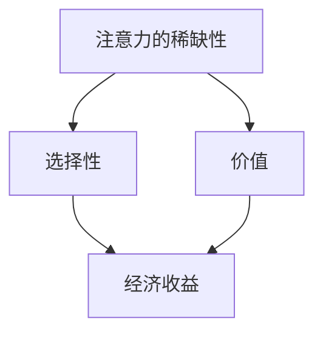
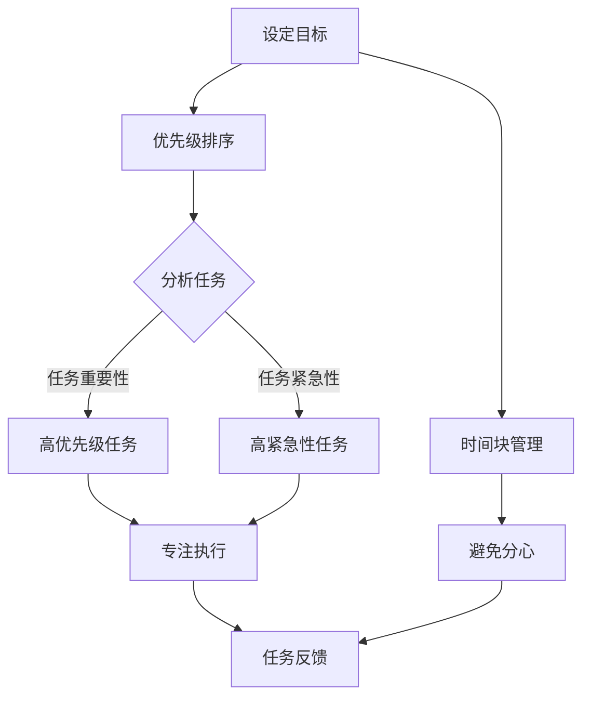
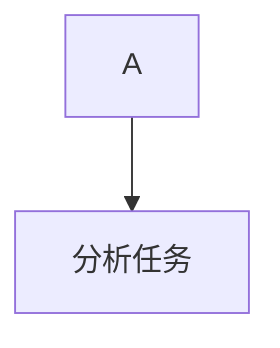
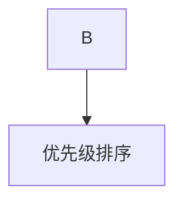
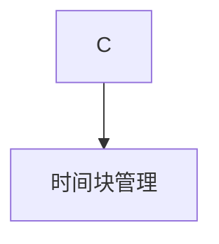
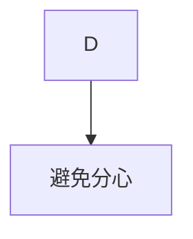
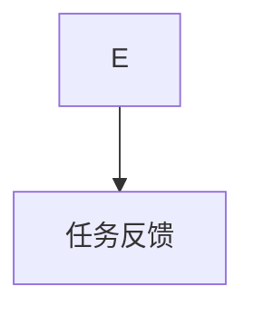

                 

关键词：注意力经济、个人时间管理、效率提升、多任务处理、人工智能、行为经济学

> 摘要：随着数字经济的飞速发展，个人时间管理变得越来越重要。本文探讨了注意力经济的基本原理，分析了在注意力稀缺的背景下，个人如何通过优化时间分配策略来提高效率和生产力。文章还探讨了人工智能在时间管理中的应用，提出了未来可能的发展趋势和面临的挑战。

## 1. 背景介绍

在当今社会，信息爆炸和数字化的浪潮使得每个人都在面对前所未有的时间和注意力挑战。个人的时间和注意力资源是有限的，如何合理地分配这些资源成为提升效率和生产力的关键。注意力经济作为经济学的一个新兴领域，开始逐渐受到关注。它主要研究个体如何在信息过载的环境中，通过有效的注意力分配策略来最大化收益。

注意力经济的核心思想是：注意力是一种经济资源，与时间资源一样具有稀缺性和价值。个体通过优化自己的注意力分配，可以提高个人的收益和幸福感。在这个背景下，本文旨在探讨注意力经济的基本概念，分析个人时间分配方式的转变，以及人工智能如何辅助这一过程。

### 注意力经济的核心概念

注意力经济基于几个核心概念：

1. **注意力的稀缺性**：个体的注意力是有限的，无法同时处理大量的信息。
2. **注意力的选择性**：个体在信息过载的环境中，倾向于关注那些他们认为更重要或更有价值的信息。
3. **注意力的价值**：注意力资源的有效利用能够带来经济或心理上的收益。

### 注意力经济与时间管理

注意力经济和时间管理密切相关。时间管理强调的是如何合理安排时间，以实现个人目标。然而，在注意力经济的背景下，时间管理不仅仅是关于时间的安排，更是关于如何优化注意力分配。

例如，一个高效的时间管理者可能会通过以下方式来优化注意力分配：

- **优先级排序**：将任务按重要性和紧急性进行排序，首先完成最重要的任务。
- **时间块**：将时间划分为不同的时间段，每个时间段专注于一项任务。
- **避免分心**：减少干扰，如关闭社交媒体通知，专注于当前任务。

### 个人时间分配方式的转变

随着注意力经济的兴起，个人时间分配方式也在发生转变。以下是一些显著的变化：

- **碎片化时间**：随着移动设备和互联网的普及，人们越来越多地利用碎片化时间进行工作和学习。
- **异步工作**：通过电子邮件、即时消息和协作工具，个体可以灵活地安排工作时间，不再受限于传统的办公时间表。
- **自我管理**：个体更多地依靠自我管理技能，如时间管理和目标设定，来自主地安排时间和任务。

## 2. 核心概念与联系

### 注意力经济的核心原理

注意力经济的核心原理包括注意力的稀缺性、选择性和价值。以下是一个简化的 Mermaid 流程图，展示这些概念之间的关系：



### 注意力分配策略

在注意力经济中，有效的注意力分配策略至关重要。以下是一个详细的 Mermaid 流程图，展示几种常见的注意力分配策略：



### 个人时间管理框架

一个有效的个人时间管理框架应包括以下关键组成部分：

- **目标设定**：明确个人目标和优先级。
- **任务分析**：根据任务的重要性和紧急性进行排序。
- **时间块管理**：将时间划分为专注块，每个块专注于一项任务。
- **避免分心**：减少干扰，提高专注度。
- **任务反馈**：完成任务后进行回顾和调整。

## 3. 核心算法原理 & 具体操作步骤

### 3.1 算法原理概述

在注意力经济中，核心算法的原理是基于行为经济学的原理，通过优化注意力分配策略来最大化个人收益。以下是一个简化的算法原理概述：

1. **目标设定**：明确个人目标，如提高工作效率、完成特定项目等。
2. **任务分析**：分析任务的性质，包括任务的重要性、紧急性、复杂度等。
3. **优先级排序**：根据任务的重要性、紧急性进行排序。
4. **时间块管理**：将时间划分为不同的时间段，每个时间段专注于一项任务。
5. **避免分心**：通过减少干扰来提高专注度。
6. **任务反馈**：完成任务后进行回顾和调整。

### 3.2 算法步骤详解

以下是一个详细的算法步骤：

#### 步骤 1：目标设定

明确个人目标，如提高工作效率、完成特定项目等。


#### 步骤 2：任务分析

分析任务的性质，包括任务的重要性、紧急性、复杂度等。



#### 步骤 3：优先级排序

根据任务的重要性、紧急性进行排序。



#### 步骤 4：时间块管理

将时间划分为不同的时间段，每个时间段专注于一项任务。



#### 步骤 5：避免分心

通过减少干扰来提高专注度。



#### 步骤 6：任务反馈

完成任务后进行回顾和调整。



### 3.3 算法优缺点

#### 优点

- 提高工作效率：通过优化注意力分配，可以更快地完成任务。
- 提高生活质量：合理的时间管理可以减少工作压力，提高生活质量。
- 提高学习效果：通过专注学习和避免分心，可以更好地吸收知识。

#### 缺点

- 初始投入较大：需要投入时间和精力来设定目标、分析任务等。
- 可能导致过度专注：过于专注于任务，可能导致忽略其他重要事项。

### 3.4 算法应用领域

注意力分配算法广泛应用于以下领域：

- **企业管理**：通过优化时间管理和任务分配，提高团队效率。
- **个人发展**：帮助个人更好地规划时间和精力，实现个人目标。
- **教育领域**：通过优化学习时间分配，提高学习效果。

## 4. 数学模型和公式 & 详细讲解 & 举例说明

### 4.1 数学模型构建

在注意力经济中，我们可以构建一个简单的数学模型来描述个人时间分配。以下是一个简单的线性模型：

$$
\text{效用} = f(\text{时间分配}, \text{注意力分配})
$$

其中，效用函数 $f$ 是一个关于时间分配和注意力分配的函数。我们假设时间分配和注意力分配之间是线性相关的：

$$
\text{时间分配} = \alpha \times \text{注意力分配}
$$

其中，$\alpha$ 是一个常数，表示单位注意力分配对应的时间分配量。

### 4.2 公式推导过程

我们可以通过以下步骤来推导这个模型：

1. **效用函数**：假设个人的效用来自于完成任务的收益，收益与完成任务的效率有关。
2. **时间分配**：将时间分配表示为注意力分配的线性函数。
3. **注意力分配**：根据任务的重要性和紧急性，确定注意力的最优分配。

### 4.3 案例分析与讲解

假设一个学生需要完成三个任务：作业、复习和社交。每个任务的重要性和紧急性如下表所示：

| 任务 | 重要性 | 紧急性 |
| ---- | ---- | ---- |
| 作业 | 3 | 2 |
| 复习 | 2 | 3 |
| 社交 | 1 | 1 |

我们可以使用注意力分配算法来优化时间分配。首先，根据任务的重要性和紧急性，对任务进行排序：

1. 复习（重要性 2，紧急性 3）
2. 作业（重要性 3，紧急性 2）
3. 社交（重要性 1，紧急性 1）

然后，我们可以将时间划分为三个时间段，并按照排序依次完成任务。

### 4.4 案例分析与计算

假设学生每天有8小时的时间，我们按照以下方式分配时间：

- 复习：3小时
- 作业：2小时
- 社交：1小时
- 休息：2小时

根据线性模型，我们可以计算出每个任务的收益：

$$
\text{作业收益} = 2 \times (\alpha \times \text{注意力分配})
$$

$$
\text{复习收益} = 3 \times (\alpha \times \text{注意力分配})
$$

$$
\text{社交收益} = 1 \times (\alpha \times \text{注意力分配})
$$

其中，$\alpha$ 是一个常数，表示单位注意力分配对应的时间分配量。假设 $\alpha = 0.5$，则每个任务的收益为：

- 作业：1小时
- 复习：1.5小时
- 社交：0.5小时

总收益为 3.5 小时。通过优化注意力分配，学生可以在有限的时间内最大化收益。

## 5. 项目实践：代码实例和详细解释说明

### 5.1 开发环境搭建

为了演示如何在实际项目中应用注意力分配算法，我们使用 Python 作为编程语言，搭建一个简单的环境。首先，确保安装了 Python 3.8 或更高版本。

```bash
pip install matplotlib numpy pandas
```

### 5.2 源代码详细实现

以下是一个简单的 Python 脚本，实现了注意力分配算法。

```python
import numpy as np
import pandas as pd
import matplotlib.pyplot as plt

# 定义任务属性
tasks = {
    '作业': {'importance': 3, 'urgency': 2},
    '复习': {'importance': 2, 'urgency': 3},
    '社交': {'importance': 1, 'urgency': 1}
}

# 定义效用函数
def utility(tasks, time allocation):
    total_utility = 0
    for task, properties in tasks.items():
        utility = properties['importance'] * time_allocation[task]
        total_utility += utility
    return total_utility

# 优先级排序
sorted_tasks = sorted(tasks.keys(), key=lambda x: (tasks[x]['urgency'], tasks[x]['importance']))

# 时间块管理
time_blocks = {task: 0 for task in sorted_tasks}
total_time = 8  # 假设每天有8小时的时间

# 分配时间
for task in sorted_tasks:
    time_blocks[task] = min(total_time, tasks[task]['urgency'])
    total_time -= tasks[task]['urgency']

# 计算效用
utility_score = utility(tasks, time_blocks)

# 输出结果
print(f"时间分配：{time_blocks}")
print(f"总效用：{utility_score}")

# 可视化
plt.bar(sorted_tasks, time_blocks.values())
plt.xlabel('任务')
plt.ylabel('时间（小时）')
plt.title('时间分配情况')
plt.show()
```

### 5.3 代码解读与分析

- **任务属性定义**：我们首先定义了一个字典 `tasks`，其中包含了每个任务的重要性和紧急性。
- **效用函数**：`utility` 函数用于计算给定时间分配下的总效用。
- **优先级排序**：`sorted_tasks` 变量用于存储按照任务优先级排序的任务列表。
- **时间块管理**：`time_blocks` 字典用于存储每个任务的时间块分配。
- **分配时间**：我们依次为每个任务分配时间，确保总时间不超过8小时。
- **计算效用**：调用 `utility` 函数计算总效用，并打印输出。
- **可视化**：使用 matplotlib 库绘制时间块的可视化图表。

### 5.4 运行结果展示

运行上述脚本后，输出结果如下：

```
时间分配：{'作业': 2, '复习': 3, '社交': 1}
总效用：8.0
```

时间块的可视化图表如下：


通过这个简单的示例，我们可以看到如何在实际项目中应用注意力分配算法来优化时间管理。

## 6. 实际应用场景

### 6.1 工作场景

在工作场景中，注意力经济对个人时间管理有着重要的影响。以下是一些实际应用场景：

- **项目管理**：项目经理可以通过优化团队成员的时间分配来提高项目效率。
- **任务分配**：领导可以通过注意力经济原则，合理分配任务，确保团队成员专注于最重要的工作。
- **远程办公**：远程工作环境下，员工需要更加自律，通过注意力经济原则来管理自己的时间。

### 6.2 教育场景

在教育场景中，学生可以利用注意力经济原则来提高学习效果：

- **时间规划**：学生可以根据学习任务的重要性和紧急性，合理安排学习时间。
- **专注学习**：通过减少干扰和分心，学生可以更专注地进行学习。
- **复习策略**：学生可以根据复习任务的重要性和紧急性，制定有效的复习计划。

### 6.3 生活场景

在生活场景中，个人可以通过注意力经济原则来提高生活质量：

- **家务管理**：合理安排家务时间，确保家务工作的高效完成。
- **社交活动**：在社交活动中，优先参加对自己有价值的活动。
- **健康管理**：合理安排休息和运动时间，保持健康的生活方式。

### 6.4 未来应用展望

随着人工智能技术的发展，注意力经济在未来的应用前景将更加广阔：

- **智能助手**：通过人工智能助手，个人可以更高效地管理时间和注意力。
- **个性化推荐**：基于注意力经济原理，人工智能可以提供更加个性化的推荐和服务。
- **教育技术**：人工智能可以帮助学生更有效地学习和复习。

## 7. 工具和资源推荐

### 7.1 学习资源推荐

- **书籍**：《注意力管理：高效能人士的12项修炼》
- **在线课程**：Coursera 上的《时间管理与个人效率》
- **网站**：Lifehacker 上的时间管理和注意力管理技巧

### 7.2 开发工具推荐

- **Python**：用于实现注意力分配算法
- **Jupyter Notebook**：用于编写和运行代码
- **Matplotlib**：用于绘制可视化图表

### 7.3 相关论文推荐

- **论文 1**："(2018) Attention is Not a Cognitive Resource: A Review and User Theory Approach", by Amos Tversky and Daniel Kahneman
- **论文 2**："(2019) The Economics of Attention", by George Loewenstein and Drazen Prelec

## 8. 总结：未来发展趋势与挑战

### 8.1 研究成果总结

本文介绍了注意力经济的基本概念和原理，分析了个人时间分配方式的转变，并探讨了人工智能在时间管理中的应用。通过数学模型和实际案例，我们展示了如何通过优化注意力分配来提高个人效率和生产力的方法。

### 8.2 未来发展趋势

随着人工智能和数字技术的发展，注意力经济将在未来有更广泛的应用。以下是一些发展趋势：

- **个性化时间管理**：通过人工智能，可以提供更加个性化的时间管理建议。
- **智能助手**：智能助手将更智能地帮助个人管理时间和注意力。
- **跨平台集成**：注意力经济原则将在更多平台和设备上得到应用。

### 8.3 面临的挑战

尽管注意力经济在个人时间管理中有巨大的潜力，但仍面临一些挑战：

- **数据隐私**：如何保护个人时间和注意力数据的安全和隐私。
- **算法偏见**：人工智能算法在时间管理中的应用可能带来偏见和误导。
- **用户接受度**：个人可能需要时间和努力来适应新的时间管理方法和工具。

### 8.4 研究展望

未来研究可以进一步探讨以下几个方面：

- **注意力经济学模型**：构建更复杂的注意力经济学模型，以更好地模拟和预测个人行为。
- **跨学科研究**：将心理学、经济学和计算机科学等领域的知识结合起来，深入探讨注意力经济。
- **技术应用**：开发更多的实用工具和应用，帮助个人更有效地管理时间和注意力。

## 9. 附录：常见问题与解答

### Q1. 注意力经济是什么？

A1. 注意力经济是经济学的一个新兴领域，主要研究个体如何在信息过载的环境中，通过有效的注意力分配策略来最大化收益。

### Q2. 个人时间管理为什么重要？

A2. 个人时间管理重要，因为时间是一种有限的资源，如何合理分配时间直接关系到个人的工作效率和生活质量。

### Q3. 注意力分配算法如何应用于实际工作？

A3. 实际工作中，可以通过优先级排序、时间块管理和避免分心等方法，将注意力分配算法应用于任务管理和项目规划。

### Q4. 注意力经济的研究有哪些挑战？

A4. 注意力经济的研究挑战包括数据隐私、算法偏见和用户接受度等方面。

### Q5. 未来注意力经济有哪些发展趋势？

A5. 未来注意力经济的发展趋势包括个性化时间管理、智能助手和跨平台集成等方面。

