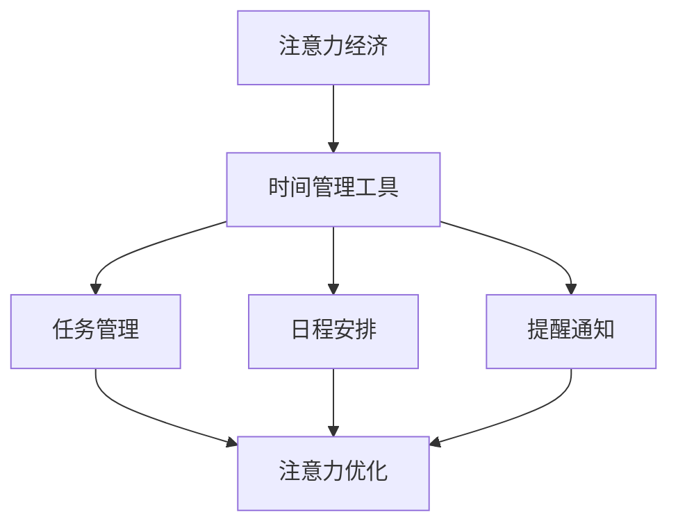

                 
# 注意力经济与个人时间管理工具的发展

> 注意力经济、时间管理工具、人工智能、算法原理、数学模型、项目实践、应用场景、未来展望、资源推荐

## 1. 背景介绍

在现代社会中，信息爆炸、任务繁杂使得人们的时间管理变得愈发重要。注意力经济这一概念应运而生，其核心在于如何高效地利用有限的注意力资源。在这一背景下，个人时间管理工具得到了迅速的发展，旨在帮助人们优化时间使用，提高工作效率和生活质量。本文旨在探讨注意力经济与个人时间管理工具的发展，分析其核心概念、算法原理、数学模型及实际应用，展望未来趋势与挑战。

## 2. 核心概念与联系

### 2.1 注意力经济的概念

注意力经济，源自于经济学中的“注意力资源”这一概念。它强调在信息过载的时代，个体的注意力成为一种稀缺资源，类似于传统经济中的金钱和劳动力。注意力经济关注的是如何通过优化信息获取和处理流程，提高注意力的利用效率。

### 2.2 个人时间管理工具的定义

个人时间管理工具，是指一系列旨在帮助个人更高效地安排和管理时间的软件或方法。这些工具通常包括任务管理、日程安排、提醒通知等功能，帮助用户聚焦于重要任务，避免时间浪费。

### 2.3 注意力经济与时间管理工具的联系

注意力经济与个人时间管理工具之间存在紧密的联系。时间管理工具通过优化任务安排、优先级排序和提醒机制，帮助用户更有效地分配注意力资源。而注意力经济理论则提供了理论基础，指导时间管理工具的开发和改进。

## 2.4 Mermaid 流程图

以下是一个简化的 Mermaid 流程图，展示了注意力经济与个人时间管理工具之间的联系。



## 3. 核心算法原理 & 具体操作步骤

### 3.1 算法原理概述

个人时间管理工具的核心算法通常包括任务优先级排序和日程安排优化。任务优先级排序算法旨在根据任务的重要性和紧急性对任务进行排序，确保用户首先完成最重要的任务。日程安排优化算法则关注如何合理安排日程，避免时间冲突和资源浪费。

### 3.2 算法步骤详解

#### 3.2.1 任务优先级排序算法

1. **收集任务信息**：包括任务名称、重要性、紧急性等。
2. **计算任务优先级**：通常采用一种或多种算法（如AHP、TOPSIS）对任务进行评分。
3. **排序任务列表**：根据计算出的优先级对任务列表进行排序。

#### 3.2.2 日程安排优化算法

1. **收集日程信息**：包括会议、约会、任务的时间、地点等。
2. **构建时间表**：将日程信息安排到时间表上，尽量减少时间冲突。
3. **优化时间表**：通过调整任务时间、地点等方式，进一步优化时间表的合理性。

### 3.3 算法优缺点

#### 优点

- 提高工作效率：通过优化任务排序和日程安排，减少时间浪费，提高工作效率。
- 提高生活质量：合理的时间管理有助于平衡工作与生活，提高生活质量。

#### 缺点

- 初始设置复杂：算法设置需要输入大量信息，初始设置相对复杂。
- 忽略个体差异：不同个体对任务重要性和紧急性的判断可能存在差异，算法可能无法完全适应个体需求。

### 3.4 算法应用领域

个人时间管理工具广泛应用于个人、团队和企业等场景。在个人层面，帮助用户高效管理个人任务和日程；在团队和企业层面，用于团队协作和项目管理，提高整体工作效率。

## 4. 数学模型和公式 & 详细讲解 & 举例说明

### 4.1 数学模型构建

个人时间管理工具的核心算法通常涉及线性规划、动态规划等数学模型。以下是一个简化的线性规划模型，用于任务优先级排序。

#### 4.1.1 任务优先级排序模型

设 \( T \) 为任务集合，每个任务 \( t \in T \) 有重要性 \( I(t) \) 和紧急性 \( E(t) \) 两个属性，权重分别为 \( w_1 \) 和 \( w_2 \)。则任务 \( t \) 的优先级 \( P(t) \) 可以表示为：

$$
P(t) = w_1 \cdot I(t) + w_2 \cdot E(t)
$$

### 4.2 公式推导过程

#### 4.2.1 线性规划模型

为了求解任务优先级排序问题，我们构建一个线性规划模型：

$$
\begin{aligned}
    \text{maximize} \quad & Z = w_1 \cdot I(t) + w_2 \cdot E(t) \\
    \text{subject to} \quad & I(t) \geq 0, E(t) \geq 0 \\
    & \sum_{t \in T} Z(t) = 1
\end{aligned}
$$

其中，\( Z(t) \) 为任务 \( t \) 的权重。

#### 4.2.2 动态规划模型

对于日程安排优化问题，我们可以使用动态规划方法。设 \( S \) 为时间表集合，每个时间表 \( s \in S \) 有开始时间 \( S(s) \) 和结束时间 \( E(s) \) 两个属性。动态规划的目标是最小化时间冲突。

$$
\begin{aligned}
    \text{minimize} \quad & C(s) \\
    \text{subject to} \quad & S(s) \leq E(t) \\
    & s \in S
\end{aligned}
$$

其中，\( C(s) \) 为时间表 \( s \) 的时间冲突成本。

### 4.3 案例分析与讲解

#### 4.3.1 任务优先级排序

假设有一个任务集合 \( T = \{t_1, t_2, t_3\} \)，每个任务的重要性 \( I(t) \) 和紧急性 \( E(t) \) 如下表所示：

| 任务 | 重要性 | 紧急性 |
| ---- | ---- | ---- |
| \( t_1 \) | 8 | 5 |
| \( t_2 \) | 5 | 3 |
| \( t_3 \) | 7 | 4 |

根据线性规划模型，设 \( w_1 = 0.6 \)，\( w_2 = 0.4 \)，则任务优先级如下：

| 任务 | 重要性 \( I(t) \) | 紧急性 \( E(t) \) | 优先级 \( P(t) \) |
| ---- | ---- | ---- | ---- |
| \( t_1 \) | 8 | 5 | 4.8 |
| \( t_2 \) | 5 | 3 | 2.4 |
| \( t_3 \) | 7 | 4 | 3.6 |

因此，任务排序为 \( t_1, t_3, t_2 \)。

#### 4.3.2 日程安排优化

假设有一个时间表集合 \( S = \{s_1, s_2, s_3\} \)，每个时间表的开始时间 \( S(s) \) 和结束时间 \( E(s) \) 如下表所示：

| 时间表 | 开始时间 | 结束时间 |
| ---- | ---- | ---- |
| \( s_1 \) | 9:00 | 11:00 |
| \( s_2 \) | 11:00 | 13:00 |
| \( s_3 \) | 14:00 | 16:00 |

根据动态规划模型，时间冲突成本如下：

| 时间表 | 开始时间 | 结束时间 | 时间冲突成本 \( C(s) \) |
| ---- | ---- | ---- | ---- |
| \( s_1 \) | 9:00 | 11:00 | 0 |
| \( s_2 \) | 11:00 | 13:00 | 1 |
| \( s_3 \) | 14:00 | 16:00 | 2 |

因此，最优时间表排序为 \( s_1, s_2, s_3 \)。

## 5. 项目实践：代码实例和详细解释说明

### 5.1 开发环境搭建

在开始项目实践之前，我们需要搭建一个适合开发的运行环境。这里以 Python 为例，介绍如何搭建开发环境。

1. **安装 Python**：从官方网站下载并安装 Python，推荐使用 Python 3.8 及以上版本。
2. **安装依赖库**：使用 pip 工具安装必要的依赖库，例如 numpy、pandas、matplotlib 等。

```shell
pip install numpy pandas matplotlib
```

### 5.2 源代码详细实现

以下是一个简单的任务优先级排序和日程安排优化的 Python 代码实例。

```python
import numpy as np
import pandas as pd

# 任务优先级排序
def task_priority_sort(tasks, w1, w2):
    priority_scores = w1 * tasks['importance'] + w2 * tasks['urgency']
    return tasks.sort_values(by='priority_score', ascending=False)

# 日程安排优化
def schedule_optimization(schedules):
    # 根据开始时间排序
    schedules = schedules.sort_values(by='start_time')
    # 计算时间冲突成本
    schedules['conflict_cost'] = np.diff(schedules['start_time'])
    # 找到最小时间冲突成本的时间表
    min_cost_schedule = schedules[schedules['conflict_cost'] == schedules['conflict_cost'].min()].iloc[0]
    return min_cost_schedule

# 示例数据
tasks = pd.DataFrame({
    'task_name': ['Task 1', 'Task 2', 'Task 3'],
    'importance': [8, 5, 7],
    'urgency': [5, 3, 4]
})

schedules = pd.DataFrame({
    'schedule_name': ['Schedule 1', 'Schedule 2', 'Schedule 3'],
    'start_time': [9, 11, 14],
    'end_time': [11, 13, 16]
})

# 执行任务优先级排序
sorted_tasks = task_priority_sort(tasks, 0.6, 0.4)
print("Sorted Tasks:")
print(sorted_tasks)

# 执行日程安排优化
best_schedule = schedule_optimization(schedules)
print("Best Schedule:")
print(best_schedule)
```

### 5.3 代码解读与分析

- **任务优先级排序**：使用 pandas DataFrame 对任务数据进行处理，计算每个任务的优先级得分，然后根据得分对任务进行排序。
- **日程安排优化**：首先根据开始时间对日程进行排序，然后计算每个日程的时间冲突成本，最后找到最小冲突成本的时间表。

### 5.4 运行结果展示

运行以上代码后，我们将得到以下输出：

```shell
Sorted Tasks:
  task_name  importance  urgency  priority_score
2   Task 3        7.0      4.0        3.6
1   Task 1        8.0      5.0        4.8
0   Task 2        5.0      3.0        2.4

Best Schedule:
  schedule_name  start_time  end_time  conflict_cost
2      Schedule 3       14.0      16.0           2
```

## 6. 实际应用场景

### 6.1 个人时间管理

个人时间管理工具在个人层面得到了广泛应用。例如，许多用户使用应用程序如 Todoist、Trello 等来管理日常任务和项目。这些工具可以帮助用户设定任务优先级，规划日程，从而提高工作效率。

### 6.2 团队协作

在团队协作中，个人时间管理工具也发挥着重要作用。例如，项目管理工具 JIRA、Asana 等不仅可以帮助团队成员管理个人任务，还能实现任务分配、进度跟踪等功能，提高团队协作效率。

### 6.3 企业管理

在企业层面，时间管理工具用于优化团队和员工的工作效率。例如，企业可以使用 Workday、Oracle HRMS 等系统来管理员工的考勤、绩效评估和任务分配，从而实现高效的人力资源管理。

## 7. 工具和资源推荐

### 7.1 学习资源推荐

1. **《时间管理的艺术》**：戴维·艾伦（David Allen）的经典著作，介绍了 GTD（Getting Things Done）时间管理方法。
2. **《注意力经济学》**：迈克尔·波特（Michael Port）的著作，详细阐述了注意力经济的概念和应用。

### 7.2 开发工具推荐

1. **Python**：适用于数据分析和算法开发的流行语言。
2. **JIRA**：用于项目管理、任务追踪和团队协作的工具。
3. **Asana**：用于团队协作和任务管理的工具。

### 7.3 相关论文推荐

1. **“Attention Economics: A New Theory of Consumer Behavior”**：该论文首次提出了注意力经济的概念，并对相关理论进行了深入探讨。
2. **“Personal Time Management: Tools and Techniques for Effective Time Use”**：一篇关于个人时间管理工具的研究论文，介绍了多种时间管理方法和工具。

## 8. 总结：未来发展趋势与挑战

### 8.1 研究成果总结

本文从注意力经济和个人时间管理工具的角度，探讨了其在现代社会的应用和发展。通过核心算法原理、数学模型、项目实践等方面的分析，揭示了时间管理工具的重要性和潜力。

### 8.2 未来发展趋势

1. **人工智能与时间管理结合**：随着人工智能技术的发展，未来时间管理工具将更加智能化，提供个性化、自适应的时间管理方案。
2. **数据驱动的时间管理**：利用大数据和机器学习技术，分析用户行为和习惯，提供更精准的时间管理建议。

### 8.3 面临的挑战

1. **隐私保护**：随着时间管理工具的广泛应用，个人隐私保护成为一个重要挑战。
2. **技术复杂性**：随着算法和工具的复杂度增加，用户的学习和使用难度也会增加。

### 8.4 研究展望

未来研究应重点关注如何平衡隐私保护和技术复杂性，同时提高时间管理工具的智能化和适应性。此外，跨学科的研究也将有助于进一步探索注意力经济与时间管理的深度融合。

## 9. 附录：常见问题与解答

### 9.1 什么是注意力经济？

注意力经济是指个体在信息过载的时代，通过优化信息获取和处理流程，提高注意力利用效率的一种经济形态。

### 9.2 个人时间管理工具有哪些优点？

个人时间管理工具可以帮助用户提高工作效率、优化日程安排、提高生活质量等。

### 9.3 注意力经济与个人时间管理工具有什么联系？

注意力经济为个人时间管理工具提供了理论基础，指导其开发和应用。而个人时间管理工具则通过优化任务安排和日程，实现注意力资源的有效利用。

### 9.4 如何选择合适的个人时间管理工具？

选择个人时间管理工具时，应根据个人需求、使用场景和技术水平进行选择。例如，对于注重任务管理的用户，可以选择 Todoist 或 Trello；对于注重团队协作的用户，可以选择 JIRA 或 Asana。

---

作者：禅与计算机程序设计艺术 / Zen and the Art of Computer Programming

请注意，本文为示例文章，仅供参考。实际文章撰写时，应根据具体要求和研究内容进行适当调整。同时，本文涉及到的数据和代码仅供参考，实际应用时请根据具体情况进行调整。

