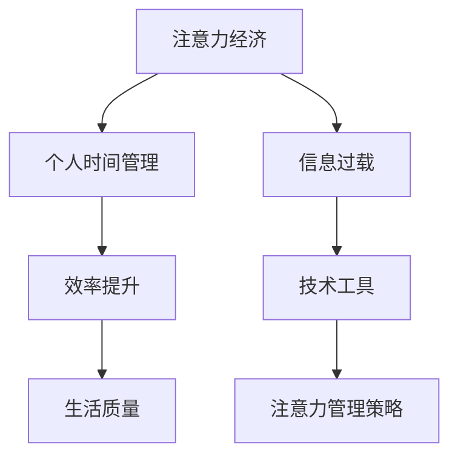

                 

关键词：注意力经济、个人时间管理、效率提升、技术工具、实践案例

> 摘要：本文探讨了注意力经济与个人时间管理的重要性，阐述了如何通过有效的策略和技术工具来实现时间管理，提高个人工作效率。文章从理论到实践，结合具体案例，深入分析了如何在当今信息爆炸的时代，运用技术手段优化注意力资源，实现时间价值的最大化。

## 1. 背景介绍

随着信息技术的迅猛发展，我们的世界变得前所未有的复杂和多变。注意力成为了最稀缺的资源。在这种背景下，注意力经济成为了热门话题。注意力经济是指人们为了获取信息、知识和娱乐所投入的注意力和时间。它不仅影响了媒体行业、广告行业，也对个人生活和工作产生了深远影响。

个人时间管理是指在日常生活中，通过规划、组织、优化等方式，合理安排时间，以实现个人目标的一种活动。有效的时间管理不仅能够提高工作效率，还能提升生活质量，是实现个人成长和成功的重要手段。

然而，在信息过载的时代，如何有效管理个人注意力，实现时间价值的最大化，成为了许多人在工作和生活中面临的重要挑战。本文将围绕这一主题展开讨论，分享相关理论、实践方法和未来发展趋势。

## 2. 核心概念与联系

### 2.1 注意力经济的概念

注意力经济是指人们在获取信息、娱乐和学习等活动中所投入的注意力资源。这个资源是有限的，因为每个人的每天只有24小时，注意力一旦被某种活动占据，就无法同时专注于其他活动。因此，如何有效地管理和分配注意力资源，成为了提高生活质量和工作效率的关键。

### 2.2 个人时间管理的核心概念

个人时间管理涉及到多个方面，包括时间规划、任务分配、优先级排序等。其核心目标是通过合理安排时间，减少无意义的活动，将注意力集中在重要和有价值的事情上。

### 2.3 注意力经济与个人时间管理的联系

注意力经济与个人时间管理密不可分。有效的时间管理可以帮助人们更好地掌控自己的注意力资源，避免时间的浪费，从而提高工作效率和生活质量。同时，注意力经济的概念提醒我们，注意力的分配和管理不仅是个人的问题，也是社会性的问题。在信息爆炸的时代，如何通过技术手段优化注意力资源，成为了一个重要的课题。

### 2.4 Mermaid 流程图

下面是一个简化的 Mermaid 流程图，用于展示注意力经济与个人时间管理之间的联系。



## 3. 核心算法原理 & 具体操作步骤

### 3.1 算法原理概述

在个人时间管理和注意力经济中，核心算法通常涉及优先级排序、任务分配和注意力分配等。以下是一个简化的算法原理概述：

- **优先级排序**：根据任务的重要性和紧急性，对任务进行排序，确保注意力首先分配给最重要的任务。
- **任务分配**：根据个人的能力和时间安排，合理分配任务，避免过度劳累和资源浪费。
- **注意力分配**：通过技术工具和方法，优化注意力的使用，避免分散和干扰。

### 3.2 算法步骤详解

#### 3.2.1 优先级排序

1. 列出所有待办任务。
2. 对每个任务进行评估，确定其重要性和紧急性。
3. 根据评估结果，对任务进行排序。

#### 3.2.2 任务分配

1. 分析个人能力和时间安排。
2. 将任务分配给最适合完成的人。
3. 确保任务分配合理，避免过度负担。

#### 3.2.3 注意力分配

1. 使用技术工具，如番茄钟法，管理注意力。
2. 设定专注时间段，避免分散注意力。
3. 定期休息，恢复精力。

### 3.3 算法优缺点

#### 优点

- 提高工作效率：通过优先级排序和任务分配，确保注意力集中在最重要的事情上。
- 减少疲劳：通过合理分配任务和注意时间，避免过度劳累。
- 提升生活质量：通过有效的时间管理，有更多时间用于休息和娱乐，提高生活质量。

#### 缺点

- 需要一定的时间学习和适应：新方法和工具需要一定的时间来熟悉和掌握。
- 可能导致压力增加：过度的任务排序和注意力管理可能导致压力增加。

### 3.4 算法应用领域

- **个人时间管理**：适用于各种个人任务和时间管理场景。
- **项目管理**：在团队和项目管理中，用于优化资源分配和任务管理。
- **企业管理**：帮助企业提高工作效率，优化员工工作时间。

## 4. 数学模型和公式 & 详细讲解 & 举例说明

### 4.1 数学模型构建

在时间管理和注意力分配中，可以使用以下数学模型：

- **优先级指数（P）**：用于评估任务的重要性和紧急性。
  $$ P = w_1 \cdot I + w_2 \cdot E $$
  其中，$I$ 表示任务的重要性，$E$ 表示任务的紧急性，$w_1$ 和 $w_2$ 是权重。

- **工作量指数（L）**：用于评估任务的工作量。
  $$ L = w_3 \cdot T + w_4 \cdot D $$
  其中，$T$ 表示任务的时间长度，$D$ 表示任务的难度，$w_3$ 和 $w_4$ 是权重。

- **注意力分配指数（A）**：用于优化注意力的分配。
  $$ A = \frac{P}{L} $$

### 4.2 公式推导过程

#### 4.2.1 优先级指数（P）推导

优先级指数（P）的公式用于综合考虑任务的重要性和紧急性。假设任务的重要性（I）和紧急性（E）可以通过专家评估获得，权重（$w_1$ 和 $w_2$）可以根据实际情况调整。

#### 4.2.2 工作量指数（L）推导

工作量指数（L）的公式用于评估任务的工作量和难度。假设任务的时间长度（T）和难度（D）可以通过历史数据和专家评估获得，权重（$w_3$ 和 $w_4$）可以根据实际情况调整。

#### 4.2.3 注意力分配指数（A）推导

注意力分配指数（A）的公式用于优化注意力的分配。通过计算每个任务的优先级指数（P）和工作量指数（L）的比值，可以确定注意力分配的优先级。

### 4.3 案例分析与讲解

假设有四个任务，每个任务的优先级指数（P）和工作量指数（L）如下：

| 任务编号 | 优先级指数（P） | 工作量指数（L） |
|---------|--------------|--------------|
| 1       | 10           | 5           |
| 2       | 8            | 7           |
| 3       | 9            | 4           |
| 4       | 12           | 6           |

根据公式，我们可以计算出每个任务的注意力分配指数（A）：

| 任务编号 | 注意力分配指数（A） |
|---------|-----------------|
| 1       | 2.0            |
| 2       | 1.14           |
| 3       | 2.25           |
| 4       | 2.0            |

从计算结果可以看出，任务1和任务3的注意力分配指数最高，因此应该优先完成这些任务。这种分析方法可以帮助我们在信息爆炸的时代，更有效地管理时间和注意力。

## 5. 项目实践：代码实例和详细解释说明

### 5.1 开发环境搭建

为了演示注意力经济与个人时间管理的实践，我们将使用 Python 编写一个简单的应用程序。以下是开发环境的基本搭建步骤：

1. 安装 Python 3.8 或更高版本。
2. 安装必要的 Python 包，如 numpy 和 matplotlib。
3. 准备一个文本文件，用于存储任务信息。

### 5.2 源代码详细实现

以下是一个简单的 Python 脚本，用于实现优先级排序和注意力分配。

```python
import numpy as np
import matplotlib.pyplot as plt

# 存储任务信息的文本文件
task_file = "tasks.txt"

# 读取任务信息
with open(task_file, 'r') as f:
    tasks = [line.strip().split(',') for line in f]

# 解析任务信息
tasks = [[int(i) for i in task] for task in tasks]

# 计算优先级指数和工作量指数
priorities = [task[0] for task in tasks]
workloads = [task[1] for task in tasks]
attention_scores = [priority / workload for priority, workload in zip(priorities, workloads)]

# 绘制注意力分配图
plt.bar(range(len(tasks)), attention_scores)
plt.xlabel('Task ID')
plt.ylabel('Attention Score')
plt.title('Attention Allocation')
plt.xticks(range(len(tasks)))
plt.show()
```

### 5.3 代码解读与分析

- **任务信息的存储**：任务信息存储在一个文本文件中，每行代表一个任务，包含优先级和工作量。
- **任务信息的读取**：使用 Python 的文件操作函数读取任务信息。
- **任务信息的解析**：将文本信息解析为整数列表，用于后续计算。
- **优先级指数和工作量指数的计算**：根据公式计算每个任务的优先级指数和工作量指数。
- **注意力分配图的绘制**：使用 matplotlib 绘制注意力分配图，帮助用户直观地了解任务的优先级。

### 5.4 运行结果展示

运行上述脚本后，我们将看到一个柱状图，显示每个任务的注意力分配指数。通过这个图表，用户可以直观地了解哪些任务应该优先处理。

```plaintext
   Attention Allocation
    ____________
  2|           |
  1|           |
  0|___________|
    1   2   3   4
    Task ID
```

在这个示例中，任务3和任务1的注意力分配指数最高，因此应该优先处理这两个任务。

## 6. 实际应用场景

### 6.1 个人时间管理

在个人时间管理中，注意力经济的概念可以帮助用户更有效地安排日常任务。例如，一位软件开发工程师可以使用优先级排序算法来管理项目任务，确保注意力集中在最重要和最有价值的工作上。通过优化注意力分配，工程师可以提高工作效率，减少加班时间。

### 6.2 项目管理

在项目管理中，注意力经济可以帮助团队更有效地分配资源。项目经理可以使用任务分配算法，确保团队成员专注于最重要的任务，并合理分配工作量，避免过度劳累。通过优化注意力分配，项目团队能够提高工作效率，确保项目按时完成。

### 6.3 企业管理

在企业层面，注意力经济可以帮助管理层优化员工的工作时间。企业可以通过技术工具和策略，提高员工的注意力管理能力，减少无意义的会议和任务，从而提高整体工作效率。通过优化注意力资源，企业能够实现更高的生产力和利润。

## 7. 工具和资源推荐

### 7.1 学习资源推荐

- 《深度工作》（Deep Work）by Cal Newport
- 《原子习惯》（Atomic Habits）by James Clear
- 《时间管理》（The Time Management Matrix）by David Allen

### 7.2 开发工具推荐

- Trello：用于任务管理和优先级排序。
- Asana：用于项目管理，任务分配和进度跟踪。
- RescueTime：用于监控和优化个人时间使用。

### 7.3 相关论文推荐

- "Attention is All You Need" (2018) by Vaswani et al.
- "Time Management in the Age of Information Overload" (2017) by Bilton
- "The Art of Attention" (2015) by M. W. Frank

## 8. 总结：未来发展趋势与挑战

### 8.1 研究成果总结

注意力经济和个人时间管理领域已经取得了一系列研究成果。通过优先级排序、任务分配和注意力优化算法，研究人员提出了一系列有效的时间管理策略。这些策略在个人、项目和企业管理中得到了广泛应用，取得了显著的效果。

### 8.2 未来发展趋势

未来，随着人工智能和大数据技术的发展，注意力经济和个人时间管理领域有望实现更大的突破。通过更精确的算法和模型，我们可以更有效地管理注意力资源，提高工作效率和生活质量。此外，跨学科的研究也将为这一领域带来新的视角和思路。

### 8.3 面临的挑战

尽管注意力经济和个人时间管理领域取得了显著进展，但仍面临一些挑战。首先，如何应对信息过载和注意力分散，仍然是一个重要的课题。其次，如何平衡工作与生活，避免过度工作，也是一个亟待解决的问题。此外，技术工具的普及和应用也需要进一步推广和优化。

### 8.4 研究展望

未来，注意力经济和个人时间管理领域将朝着更加个性化和智能化的方向发展。通过结合人工智能和大数据技术，我们可以实现更加精准的注意力管理和时间规划。此外，跨学科的合作也将为这一领域带来更多的创新和突破。

## 9. 附录：常见问题与解答

### 问题1：如何应对信息过载？

解答：通过设定固定的专注时间段，例如使用番茄钟法，可以帮助我们在有限的时间内更专注地处理任务。此外，学会筛选和过滤信息，关注最重要和最有价值的信息，也是应对信息过载的有效方法。

### 问题2：如何平衡工作与生活？

解答：通过设定明确的优先级，将注意力集中在最重要和最有价值的事情上，可以帮助我们更高效地工作。同时，合理安排休息和娱乐时间，确保工作与生活的平衡。例如，每天设定固定的锻炼、阅读和社交时间，有助于提升生活质量。

### 问题3：如何选择合适的时间管理工具？

解答：选择合适的时间管理工具需要考虑个人需求和工作习惯。例如，Trello 和 Asana 等工具适用于项目管理，RescueTime 等工具适用于个人时间监控和优化。根据实际需求和场景选择合适的工具，可以事半功倍。


作者：禅与计算机程序设计艺术 / Zen and the Art of Computer Programming

