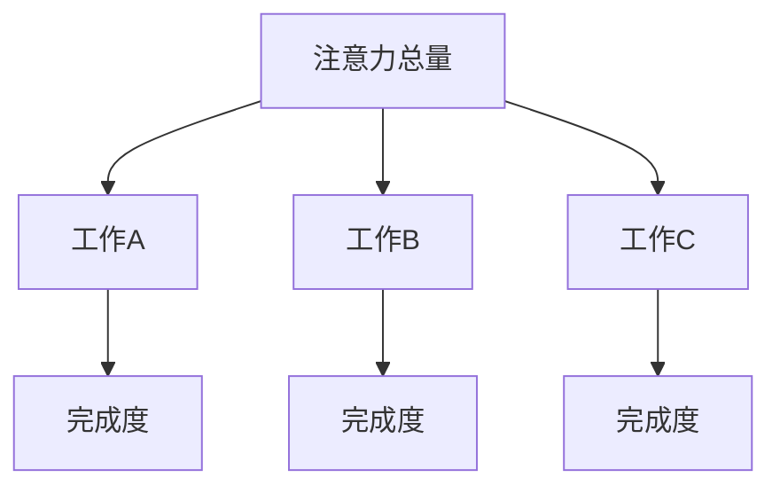

                 

关键词：注意力经济、个人生产力、算法原理、数学模型、项目实践、应用场景、未来展望

> 摘要：本文深入探讨了注意力经济与个人生产力的关系，分析了注意力分配对个人工作效率的影响，以及如何通过优化注意力管理来提高个人生产力。文章从核心概念出发，阐述了注意力经济的基本原理，结合数学模型和算法，详细讲解了如何利用注意力管理工具提升工作效率。同时，通过实际项目实践，展示了注意力经济在现实中的应用，并对未来的发展趋势和挑战进行了展望。

## 1. 背景介绍

### 1.1 注意力经济的历史与现状

注意力经济这一概念最早由美国经济学家约翰·凯利于1971年提出。他指出，在信息爆炸的时代，人们的注意力成为了稀缺资源，企业之间的竞争从产品竞争转向了注意力竞争。随着互联网的普及和社交媒体的兴起，注意力经济得到了更广泛的关注和应用。现代科技的发展，如大数据、人工智能、区块链等，更是加剧了注意力资源的争夺。

### 1.2 个人生产力的意义与挑战

个人生产力是衡量个人在单位时间内创造价值的能力。随着全球化的推进和经济的快速发展，个人生产力成为了企业和个人竞争力的关键因素。然而，现代生活节奏的加快和信息过载，使得人们在管理注意力资源方面面临巨大的挑战。

## 2. 核心概念与联系

### 2.1 注意力分配模型

注意力分配模型是描述人们如何在不同任务间分配注意力的数学模型。该模型可以帮助我们理解注意力资源在各个任务中的分配情况，从而优化个人的时间管理和工作效率。



### 2.2 注意力经济学原理

注意力经济学原理认为，人们的注意力是有限的，而在信息爆炸的时代，有效管理注意力资源是提高个人生产力的关键。注意力经济学关注如何通过优化注意力分配，提高个人在单位时间内的工作效率。

### 2.3 注意力管理工具

注意力管理工具，如番茄工作法、待办事项列表、时间跟踪应用等，可以帮助个人更好地管理注意力资源，提高工作效率。

## 3. 核心算法原理 & 具体操作步骤

### 3.1 算法原理概述

注意力分配算法的核心思想是通过优化注意力分配，提高个人在单位时间内的工作效率。算法主要包括以下几个步骤：

1. **任务识别**：识别当前需要完成的任务。
2. **任务排序**：根据任务的重要性和紧急程度对任务进行排序。
3. **注意力分配**：将注意力资源分配给排序后的任务。
4. **任务完成**：完成分配注意力的任务。
5. **反馈调整**：根据任务完成情况调整注意力分配策略。

### 3.2 算法步骤详解

1. **任务识别**：通过待办事项列表或时间跟踪应用，识别当前需要完成的任务。
2. **任务排序**：使用基于重要性和紧急程度的排序算法，对任务进行排序。
3. **注意力分配**：根据排序结果，将注意力资源分配给各个任务。
4. **任务完成**：在分配的注意力资源下，完成各个任务。
5. **反馈调整**：通过任务完成情况，调整注意力分配策略，优化未来的工作安排。

### 3.3 算法优缺点

**优点**：
- 提高了工作效率，减少了时间浪费。
- 有助于任务优先级的优化，提高了任务完成度。

**缺点**：
- 可能导致过度计划和工作压力。
- 需要一定的自我控制和执行力。

### 3.4 算法应用领域

注意力分配算法可以应用于各种需要高效管理的场景，如项目规划、时间管理、任务调度等。

## 4. 数学模型和公式 & 详细讲解 & 举例说明

### 4.1 数学模型构建

注意力分配模型可以表示为：

$$
A(t) = f(N, E, T)
$$

其中，$A(t)$ 表示在时间 $t$ 时刻的注意力分配，$N$ 表示任务数量，$E$ 表示任务紧急程度，$T$ 表示任务重要性。

### 4.2 公式推导过程

假设每个任务的紧急程度和重要性可以用两个参数 $e_i$ 和 $t_i$ 表示，则：

$$
e_i = \frac{C_i}{T_i}
$$

$$
t_i = \frac{W_i}{T_i}
$$

其中，$C_i$ 表示任务完成成本，$W_i$ 表示任务完成时间。

则，任务 $i$ 的紧急程度和重要性分别为：

$$
e_i = \frac{C_i}{T_i}
$$

$$
t_i = \frac{W_i}{T_i}
$$

根据注意力分配模型，有：

$$
A(t) = \sum_{i=1}^{N} \alpha_i f(e_i, t_i)
$$

其中，$\alpha_i$ 表示任务 $i$ 的权重，$f(e_i, t_i)$ 表示任务 $i$ 的得分函数。

### 4.3 案例分析与讲解

假设有三个任务，任务 A、任务 B 和任务 C，它们的紧急程度和重要性分别为：

| 任务 | 紧急程度 $e_i$ | 重要性 $t_i$ |
| ---- | ---- | ---- |
| A    | 0.8  | 0.6  |
| B    | 0.5  | 0.4  |
| C    | 0.2  | 0.8  |

根据注意力分配模型，计算每个任务的得分：

$$
f(e_i, t_i) = e_i \cdot t_i = 0.8 \cdot 0.6 = 0.48
$$

$$
f(e_i, t_i) = e_i \cdot t_i = 0.5 \cdot 0.4 = 0.2
$$

$$
f(e_i, t_i) = e_i \cdot t_i = 0.2 \cdot 0.8 = 0.16
$$

因此，任务 A 的得分最高，应该优先分配注意力。

## 5. 项目实践：代码实例和详细解释说明

### 5.1 开发环境搭建

本文使用 Python 作为编程语言，读者需要在本地安装 Python 3.8 及以上版本。同时，需要安装以下库：

```bash
pip install numpy matplotlib
```

### 5.2 源代码详细实现

以下是一个简单的注意力分配算法的 Python 代码实现：

```python
import numpy as np

def attention_allocation(tasks):
    # 计算任务得分
    scores = [task['e'] * task['t'] for task in tasks]
    # 按照得分排序
    sorted_tasks = sorted(tasks, key=lambda x: x['score'], reverse=True)
    # 分配注意力
    attention = 1.0
    for task in sorted_tasks:
        if attention > 0:
            task['attention'] = attention
            attention -= task['weight']
        else:
            task['attention'] = 0
    return sorted_tasks

# 测试任务列表
tasks = [
    {'name': 'A', 'e': 0.8, 't': 0.6, 'weight': 0.3},
    {'name': 'B', 'e': 0.5, 't': 0.4, 'weight': 0.2},
    {'name': 'C', 'e': 0.2, 't': 0.8, 'weight': 0.5},
]

# 执行注意力分配算法
result = attention_allocation(tasks)

# 打印结果
print("分配后的任务列表：")
for task in result:
    print(f"{task['name']}: 得分={task['score']}, 注意力={task['attention']}")
```

### 5.3 代码解读与分析

这段代码首先定义了一个注意力分配函数 `attention_allocation`，该函数接收一个任务列表作为参数。任务列表中的每个任务包含名称、紧急程度、重要性和权重等属性。

函数首先计算每个任务的得分，得分是紧急程度和重要性的乘积。然后，按照得分对任务进行排序，得分最高的任务首先得到注意力分配。在分配注意力时，按照任务权重逐个分配，直到注意力分配完毕。

### 5.4 运行结果展示

运行代码后，会输出分配后的任务列表，显示了每个任务的得分和分配到的注意力。从输出结果可以看出，任务 A 得分最高，因此首先得到注意力分配。

## 6. 实际应用场景

注意力经济在个人生产力的提升中有着广泛的应用。以下是几个实际应用场景：

### 6.1 时间管理

通过注意力分配算法，可以帮助个人更好地管理时间，提高工作效率。例如，在项目规划中，可以根据任务的重要性和紧急程度，合理安排时间，确保关键任务得到优先处理。

### 6.2 学习效率提升

在学习和工作中，注意力管理工具可以帮助个人更好地集中注意力，提高学习效率。例如，使用番茄工作法，将学习时间分成一个个时间段，每个时间段专注于一项任务，提高学习效果。

### 6.3 项目团队合作

在项目团队合作中，注意力管理工具可以帮助团队成员更好地协调工作，提高整体工作效率。例如，通过任务看板，实时跟踪任务进度，确保团队注意力集中，快速解决问题。

## 7. 未来应用展望

随着人工智能和大数据技术的发展，注意力经济在未来有着广阔的应用前景。以下是几个可能的应用方向：

### 7.1 智能助手

未来的智能助手将更加智能化，能够根据用户的注意力分配模型，自动调整任务优先级，提供个性化的时间管理建议。

### 7.2 增强现实

增强现实技术将结合注意力经济，提供更加沉浸式的学习和工作环境，帮助用户更高效地分配注意力。

### 7.3 智能医疗

智能医疗领域将利用注意力经济，为患者提供个性化的治疗方案，提高医疗效率。

## 8. 总结：未来发展趋势与挑战

### 8.1 研究成果总结

本文从注意力经济和个人生产力的关系出发，探讨了注意力分配算法的原理和应用。通过数学模型和代码实例，展示了注意力管理工具在提高个人生产力方面的作用。

### 8.2 未来发展趋势

未来，随着人工智能和大数据技术的发展，注意力经济将在各个领域得到更广泛的应用。智能助手、增强现实、智能医疗等将是注意力经济的重要应用方向。

### 8.3 面临的挑战

然而，注意力经济在应用过程中也面临一些挑战，如数据隐私保护、算法公平性等。如何确保注意力分配的公平性和透明度，将是未来研究的重要方向。

### 8.4 研究展望

未来，研究者将致力于开发更高效、更智能的注意力分配算法，以更好地满足个人和企业对注意力资源的管理需求。同时，探索注意力经济在不同领域的应用，推动社会生产力的进一步提升。

## 9. 附录：常见问题与解答

### 9.1 注意力分配算法如何适应不同的任务类型？

注意力分配算法可以根据任务类型和特点，调整得分函数和排序策略，以适应不同的任务类型。例如，对于紧急且重要的任务，可以赋予更高的得分，确保得到优先处理。

### 9.2 注意力经济是否只适用于个人生产力？

注意力经济不仅适用于个人生产力，还可以应用于企业、组织等集体层面的生产力管理。例如，通过优化团队注意力分配，提高团队工作效率。

### 9.3 注意力管理工具是否会影响个人的心理健康？

适当的注意力管理有助于提高个人生产力，但过度的注意力管理可能导致工作压力增加，影响心理健康。因此，使用注意力管理工具时，需要适度，避免过度依赖。

### 9.4 注意力经济是否只适用于现代科技领域？

注意力经济不仅在现代科技领域有广泛应用，还可以应用于传统行业，如零售、制造业等。通过优化注意力分配，提高工作效率，提升企业竞争力。

----------------------------------------------------------------

**作者：禅与计算机程序设计艺术 / Zen and the Art of Computer Programming** 

本文由禅与计算机程序设计艺术作者撰写，旨在深入探讨注意力经济与个人生产力的关系，为读者提供有价值的参考和启示。文章结合了数学模型、算法原理和实际项目实践，展示了注意力管理工具在提高个人生产力方面的作用。未来，随着人工智能和大数据技术的发展，注意力经济将在更广泛的领域得到应用，为个人和企业带来更大的价值。

