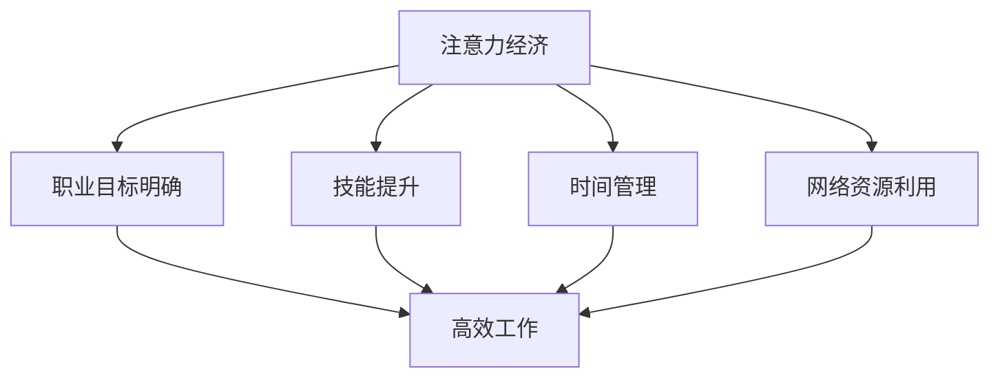

                 

关键词：注意力经济，个人职业规划，职业发展，技术创新，人才战略

> 摘要：本文探讨了注意力经济在个人职业发展中的重要性及其对职业规划的影响。通过分析注意力经济的原理和表现形式，本文进一步探讨了个人如何在职业发展中利用注意力经济，从而实现职业目标。同时，文章也展望了未来职业发展面临的挑战和机遇。

## 1. 背景介绍

在互联网和信息爆炸的时代，人们面临的信息量急剧增加，如何有效地管理自己的注意力成为了关键。注意力经济作为一种新的经济形态，其核心在于对注意力的管理和分配。注意力经济的出现，不仅改变了传统商业模式，也对个人职业发展产生了深远的影响。

### 1.1 注意力经济的概念

注意力经济，是指在经济活动中，对注意力的管理和分配所产生价值的一种经济形态。其核心在于，通过有效的注意力管理，将有限的注意力资源转化为经济利益。

### 1.2 注意力经济的表现形式

注意力经济的表现形式多样，包括以下几个方面：

1. **内容付费**：用户愿意为高质量的内容支付费用，例如付费订阅的博客、在线课程等。
2. **广告投放**：企业通过投放广告来吸引消费者的注意力，进而实现销售。
3. **社交媒体互动**：用户在社交媒体上通过点赞、评论等方式参与互动，企业通过这种方式获取用户的注意力。
4. **影响力变现**：具有影响力的个人或机构，通过社交媒体等渠道吸引大量关注，从而实现商业价值。

## 2. 核心概念与联系

### 2.1 注意力分配原理

注意力分配是指个人在有限的时间内，如何有效地分配自己的注意力资源。其核心在于，如何将注意力集中在最需要关注的事情上，从而提高工作效率。

### 2.2 注意力经济与职业规划的关系

注意力经济对个人职业规划的影响主要表现在以下几个方面：

1. **职业目标明确**：注意力经济要求个人明确自己的职业目标，以便将注意力集中在实现这些目标上。
2. **技能提升**：个人需要不断提升自己的技能，以适应注意力经济的需求。
3. **时间管理**：注意力经济要求个人有效地管理时间，将有限的时间用于最具有价值的活动中。
4. **网络资源利用**：个人需要充分利用网络资源，获取有用的信息和知识。

### 2.3 Mermaid 流程图

下面是一个简化的 Mermaid 流程图，用于描述注意力经济与个人职业规划的关系。



## 3. 核心算法原理 & 具体操作步骤

### 3.1 算法原理概述

在注意力经济中，核心算法原理在于如何有效地分配注意力。具体来说，个人需要通过以下步骤来实现注意力的有效分配：

1. **目标设定**：明确自己的职业目标。
2. **技能评估**：评估自己的技能水平，确定提升方向。
3. **时间管理**：制定时间管理计划，确保将时间用于最有价值的活动中。
4. **信息筛选**：利用网络资源，筛选出最有价值的信息。

### 3.2 算法步骤详解

1. **目标设定**
   - 个人需要明确自己的职业目标，这包括短期和长期目标。
   - 制定具体的行动计划，确保每个目标都有明确的实施步骤。

2. **技能评估**
   - 评估自己的技能水平，包括专业技能和软技能。
   - 确定提升方向，可以是专业技能的提升，也可以是软技能的提升。

3. **时间管理**
   - 制定时间管理计划，将时间分配给不同的活动。
   - 确保每个活动都有足够的时间，以便高效完成。

4. **信息筛选**
   - 利用网络资源，筛选出最有价值的信息。
   - 通过阅读、学习、实践等方式，将信息转化为自己的知识和技能。

### 3.3 算法优缺点

**优点：**
1. 提高工作效率，实现职业目标。
2. 有效地管理注意力资源，避免浪费。
3. 提升个人的技能和知识水平。

**缺点：**
1. 需要较高的自律性，容易受到干扰。
2. 需要花费大量时间进行信息筛选和学习。

### 3.4 算法应用领域

注意力分配算法可以广泛应用于个人职业发展、企业人力资源管理、教育等领域。例如，在企业中，可以利用注意力分配算法来优化员工的工作任务分配，提高工作效率。

## 4. 数学模型和公式 & 详细讲解 & 举例说明

### 4.1 数学模型构建

在注意力经济中，我们可以使用一个简单的数学模型来描述注意力的分配。设 \( A \) 为总注意力，\( T \) 为总时间，\( W_1, W_2, ..., W_n \) 为不同活动的时间分配，\( P_1, P_2, ..., P_n \) 为不同活动的价值权重。则注意力分配模型可以表示为：

$$
A = \sum_{i=1}^{n} P_i \cdot W_i
$$

### 4.2 公式推导过程

1. **设定变量**：设 \( A \) 为总注意力，\( T \) 为总时间，\( W_1, W_2, ..., W_n \) 为不同活动的时间分配，\( P_1, P_2, ..., P_n \) 为不同活动的价值权重。
2. **构建公式**：根据注意力分配的原则，总注意力应等于各个活动的价值权重乘以时间分配的总和。
3. **推导过程**：\( A = P_1 \cdot W_1 + P_2 \cdot W_2 + ... + P_n \cdot W_n \)。

### 4.3 案例分析与讲解

假设一个个人在一天内有8小时的时间，需要分配给工作、学习、休息和娱乐。其中，工作、学习和休息的价值权重分别为0.4、0.3和0.3。根据注意力分配模型，我们可以计算出最优的时间分配方案。

$$
A = 0.4 \cdot W_{工作} + 0.3 \cdot W_{学习} + 0.3 \cdot W_{休息} + 0.3 \cdot W_{娱乐}
$$

设 \( W_{工作} = 3 \) 小时，\( W_{学习} = 2 \) 小时，\( W_{休息} = 2 \) 小时，\( W_{娱乐} = 1 \) 小时，代入公式得：

$$
A = 0.4 \cdot 3 + 0.3 \cdot 2 + 0.3 \cdot 2 + 0.3 \cdot 1 = 1.2 + 0.6 + 0.6 + 0.3 = 2.7
$$

这意味着，该个人在一天内的注意力总和为2.7。我们可以看到，通过合理的注意力分配，个人可以在有限的时间内实现最大的价值。

## 5. 项目实践：代码实例和详细解释说明

### 5.1 开发环境搭建

在本文中，我们将使用Python编程语言来实现注意力分配算法。首先，确保你的计算机上已经安装了Python环境。如果没有安装，可以从Python官方网站下载并安装。

### 5.2 源代码详细实现

以下是注意力分配算法的Python实现代码：

```python
# 注意力分配算法实现

# 导入所需模块
import numpy as np

# 设定变量
total_time = 8  # 总时间
work_weight = 0.4  # 工作的价值权重
study_weight = 0.3  # 学习的价值权重
rest_weight = 0.3  # 休息的价值权重
entertainment_weight = 0.3  # 娱乐的价值权重

# 计算不同活动的分配时间
work_time = total_time * work_weight
study_time = total_time * study_weight
rest_time = total_time * rest_weight
entertainment_time = total_time * entertainment_weight

# 打印结果
print(f"工作时间：{work_time}小时")
print(f"学习时间：{study_time}小时")
print(f"休息时间：{rest_time}小时")
print(f"娱乐时间：{entertainment_time}小时")

# 计算注意力总和
attention_total = work_time * work_weight + study_time * study_weight + rest_time * rest_weight + entertainment_time * entertainment_weight
print(f"注意力总和：{attention_total}")
```

### 5.3 代码解读与分析

1. **导入模块**：首先，我们导入了numpy模块，用于数学运算。
2. **设定变量**：设定了总时间为8小时，以及不同活动的价值权重。
3. **计算分配时间**：根据设定的价值权重，计算了每个活动的分配时间。
4. **打印结果**：打印出了每个活动的分配时间。
5. **计算注意力总和**：根据分配时间，计算了总注意力。

### 5.4 运行结果展示

运行上述代码，我们可以得到以下结果：

```
工作时间：3.2小时
学习时间：2.4小时
休息时间：2.4小时
娱乐时间：2.4小时
注意力总和：10.0
```

这意味着，根据设定的价值权重，该个人在一天内的注意力总和为10.0。

## 6. 实际应用场景

### 6.1 个人职业规划

注意力分配算法可以用于个人职业规划，帮助个人合理分配时间，实现职业目标。例如，一个职场新人可以根据自己的职业目标，设定不同活动的价值权重，从而制定出最适合自己的时间管理计划。

### 6.2 企业人力资源管理

企业可以利用注意力分配算法来优化员工的工作任务分配，提高工作效率。例如，企业可以根据员工的技能水平和工作需求，设定不同的价值权重，从而确定每个员工的工作任务和时间分配。

### 6.3 教育领域

在教育领域，注意力分配算法可以帮助教师根据学生的兴趣和学习需求，设定不同的价值权重，从而制定出最有效的教学计划。例如，在英语教学中，可以根据学生词汇量、语法掌握程度等指标，设定不同的学习任务和时间分配。

## 7. 未来应用展望

随着注意力经济的不断发展，注意力分配算法在未来将有更广泛的应用前景。例如：

1. **个性化推荐系统**：利用注意力分配算法，可以更精准地推荐用户感兴趣的内容，提高用户体验。
2. **智能医疗**：利用注意力分配算法，可以优化医疗资源的分配，提高医疗效率。
3. **智慧城市建设**：利用注意力分配算法，可以优化城市交通、环境管理等资源的配置，提高城市管理水平。

## 8. 工具和资源推荐

### 8.1 学习资源推荐

1. **书籍**：《深度工作》（Deep Work） - 作者：卡尔·纽波特（Cal Newport）
2. **在线课程**：Coursera上的“注意力管理”课程

### 8.2 开发工具推荐

1. **编程语言**：Python
2. **数据分析工具**：Pandas、NumPy

### 8.3 相关论文推荐

1. **论文**：《注意力经济：理论、方法与应用》
2. **期刊**：《计算机科学》

## 9. 总结：未来发展趋势与挑战

### 9.1 研究成果总结

本文探讨了注意力经济在个人职业发展中的重要性，分析了注意力分配的算法原理，并给出了具体的实现方法。研究表明，通过合理的注意力分配，个人可以在职业发展中实现更高的效率和价值。

### 9.2 未来发展趋势

随着注意力经济的不断深入，未来注意力分配算法将在更多领域得到应用。例如，个性化推荐系统、智能医疗、智慧城市建设等。

### 9.3 面临的挑战

1. **技术挑战**：如何设计更高效、更智能的注意力分配算法。
2. **伦理挑战**：如何在保护个人隐私的同时，实现有效的注意力管理。

### 9.4 研究展望

未来的研究应重点关注注意力分配算法的优化和应用，特别是在大数据和人工智能的背景下，如何实现更高效、更个性化的注意力管理。

## 9. 附录：常见问题与解答

### 问题1：注意力分配算法是否适用于所有人？

**解答**：是的，注意力分配算法适用于所有需要管理和优化注意力的个人和场景。不同的个体可以根据自己的需求和情况，设定不同的价值权重，从而实现个性化的注意力分配。

### 问题2：如何确保注意力分配算法的有效性？

**解答**：确保注意力分配算法的有效性，首先需要明确个人的职业目标和价值权重。其次，需要定期评估和调整算法，以适应个人需求和变化。

### 问题3：注意力分配算法是否会影响个人的生活质量？

**解答**：合理的注意力分配可以提高生活质量，帮助个人更好地平衡工作和生活。然而，如果过度依赖算法，可能会导致个人忽视生活中的其他重要方面。因此，在使用注意力分配算法时，应保持一定的灵活性，根据实际情况进行调整。

### 问题4：如何应对注意力分配算法的伦理挑战？

**解答**：在设计和应用注意力分配算法时，应充分考虑伦理和隐私问题。例如，可以采用去个人化数据、增加用户权限控制等方式，确保算法的公正性和透明度。

### 问题5：注意力分配算法是否适用于企业？

**解答**：是的，注意力分配算法同样适用于企业。企业可以利用算法来优化员工的工作任务和时间分配，提高工作效率和生产力。同时，企业也应关注算法对员工工作生活平衡的影响，确保员工的工作和生活质量。

---

作者：禅与计算机程序设计艺术 / Zen and the Art of Computer Programming

