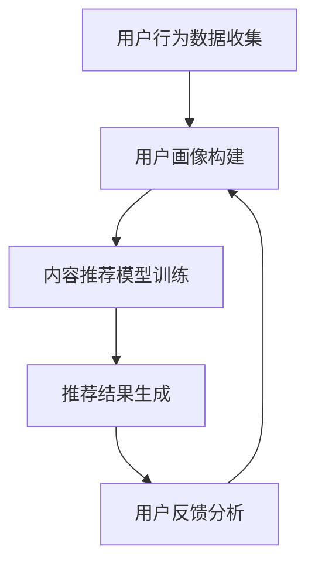

                 

本文将探讨注意力经济与个性化推荐算法的深度融合，分析如何在信息爆炸的时代为受众提供定制化的体验。通过深入剖析算法原理、数学模型以及实际应用案例，我们将揭示个性化推荐在现代科技中的重要性，并展望其未来发展的趋势与挑战。

## 1. 背景介绍

### 注意力经济

注意力经济是一种经济模式，它认为人的注意力是有限的资源，而信息和内容则是争夺注意力的竞争者。随着互联网和社交媒体的迅猛发展，注意力经济已成为影响企业和个人行为的重要因素。在注意力经济中，提供有价值的内容和服务，吸引并保持用户的注意力，是企业成功的关键。

### 个性化推荐算法

个性化推荐算法是一种基于用户行为和兴趣的数据挖掘技术，旨在为用户提供个性化的信息推荐。这些算法通过分析用户的历史行为、偏好和反馈，预测用户可能感兴趣的内容，从而提高用户满意度和留存率。个性化推荐算法已在电子商务、社交媒体、新闻推送等多个领域得到广泛应用。

### 融合的意义

将注意力经济与个性化推荐算法相结合，旨在提高用户在信息爆炸时代中的体验。通过精准的个性化推荐，企业能够有效地吸引并留住用户，提升用户满意度和忠诚度。同时，这也有助于优化资源配置，降低营销成本，提高业务效益。

## 2. 核心概念与联系

### 个性化推荐算法原理

个性化推荐算法主要包括基于内容的推荐、协同过滤推荐和混合推荐等类型。这些算法通过分析用户的历史行为、兴趣标签、社交关系等数据，构建用户画像，预测用户对未知内容的兴趣，从而实现个性化推荐。

### Mermaid 流程图



### 注意力经济与个性化推荐的关系

注意力经济强调内容的价值和吸引力，个性化推荐算法则通过精准的内容推送，满足用户的需求和兴趣，提高用户注意力。两者结合，能够在激烈的市场竞争中脱颖而出，为用户提供定制化的体验。

## 3. 核心算法原理 & 具体操作步骤

### 3.1 算法原理概述

个性化推荐算法的核心在于用户画像构建和内容推荐模型的训练。用户画像通过对用户行为、兴趣、社交关系等多维度数据进行综合分析，构建出用户的个性化特征。内容推荐模型则基于机器学习和深度学习技术，对用户画像进行建模，预测用户对未知内容的兴趣，从而生成个性化推荐结果。

### 3.2 算法步骤详解

1. **用户行为数据收集**：通过网站日志、点击记录、购买行为等途径，收集用户的历史行为数据。
2. **用户画像构建**：对收集到的数据进行处理和清洗，提取用户的基本信息和个性化特征，如兴趣爱好、行为偏好等。
3. **内容推荐模型训练**：利用用户画像数据和内容标签，构建推荐模型。常见的模型有基于内容的推荐模型、协同过滤推荐模型和混合推荐模型等。
4. **推荐结果生成**：根据训练好的推荐模型，为用户生成个性化推荐列表。
5. **用户反馈分析**：收集用户对推荐结果的反馈，用于优化推荐模型和调整推荐策略。

### 3.3 算法优缺点

#### 优点

- 提高用户满意度：精准的个性化推荐能够满足用户的需求和兴趣，提高用户满意度。
- 降低营销成本：通过优化推荐策略，降低用户的流失率，提高用户留存率，从而降低营销成本。
- 个性化定制体验：为用户提供定制化的内容推荐，提升用户体验。

#### 缺点

- 数据隐私问题：个性化推荐算法需要大量用户数据，涉及用户隐私安全问题。
- 算法透明度问题：用户难以理解推荐算法的决策过程，可能导致用户不信任。
- 过度个性化问题：个性化推荐可能导致用户陷入信息茧房，降低用户接触新信息的可能性。

### 3.4 算法应用领域

个性化推荐算法在电子商务、社交媒体、新闻推送、在线教育等多个领域得到广泛应用。通过精准的推荐，企业能够提高用户满意度和留存率，降低营销成本，提升业务效益。

## 4. 数学模型和公式

### 4.1 数学模型构建

个性化推荐算法的核心在于构建用户画像和内容推荐模型。用户画像可以通过以下公式表示：

$$
\text{User\_Profile} = \sum_{i=1}^{n} w_i \cdot \text{Feature}_i
$$

其中，$w_i$表示特征权重，$\text{Feature}_i$表示用户特征。

内容推荐模型可以通过以下公式表示：

$$
\text{Recommendation\_Score} = \text{User\_Profile} \cdot \text{Content\_Profile}
$$

其中，$\text{Content\_Profile}$表示内容特征向量。

### 4.2 公式推导过程

#### 用户画像构建

用户画像构建的过程可以通过以下步骤进行：

1. 数据收集与清洗：收集用户行为数据，并对数据进行清洗和处理。
2. 特征提取：提取用户的基本信息和个性化特征，如兴趣爱好、行为偏好等。
3. 特征权重计算：根据用户数据的分布和相关性，计算特征权重。

#### 内容推荐模型

内容推荐模型可以通过以下步骤进行：

1. 数据收集与清洗：收集用户行为数据和内容标签数据，并对数据进行清洗和处理。
2. 内容特征提取：提取内容的关键词、标签、属性等特征。
3. 模型训练：利用用户画像和内容特征，训练推荐模型。
4. 推荐结果生成：根据训练好的推荐模型，为用户生成个性化推荐列表。

### 4.3 案例分析与讲解

#### 案例一：基于协同过滤的推荐算法

协同过滤推荐算法是一种常见的个性化推荐算法。其基本思想是，通过分析用户之间的相似性，发现用户共同喜欢的商品，进而向用户推荐。

1. **相似度计算**：计算用户之间的相似度，通常使用余弦相似度、皮尔逊相关系数等度量方法。
2. **推荐列表生成**：根据用户相似度，为每个用户生成推荐列表。

#### 案例二：基于内容的推荐算法

基于内容的推荐算法通过分析用户对内容的兴趣，将相似的内容推荐给用户。

1. **内容特征提取**：提取用户感兴趣的内容特征，如关键词、标签、属性等。
2. **相似度计算**：计算用户对内容的兴趣相似度，通常使用TF-IDF、词向量等方法。
3. **推荐列表生成**：根据用户对内容的兴趣相似度，为用户生成推荐列表。

## 5. 项目实践：代码实例和详细解释说明

### 5.1 开发环境搭建

在本项目中，我们使用Python作为开发语言，并依赖以下库：

- NumPy
- Pandas
- Scikit-learn
- TensorFlow

安装这些库后，即可开始项目的开发。

### 5.2 源代码详细实现

以下是一个简单的基于内容的推荐算法的实现：

```python
import numpy as np
from sklearn.feature_extraction.text import TfidfVectorizer
from sklearn.metrics.pairwise import cosine_similarity

def content_based_recommendation(data, user_profile):
    # 数据预处理
    data['tfidf'] = data['description'].apply(lambda x: tfidf_vectorizer.transform([x]))
    
    # 计算用户画像
    user_profile_vector = tfidf_vectorizer.transform([user_profile])
    
    # 计算内容相似度
    content_similarity = cosine_similarity(user_profile_vector, data['tfidf'])
    
    # 排序并获取推荐列表
    sorted_indices = np.argsort(content_similarity[0])[::-1]
    recommended_indices = sorted_indices[1:11]
    
    return data.iloc[recommended_indices]

# 示例数据
data = pd.DataFrame({
    'id': [1, 2, 3, 4, 5],
    'description': [
        '人工智能',
        '深度学习',
        '机器学习',
        '计算机科学',
        '编程语言'
    ]
})

user_profile = '人工智能 深度学习 机器学习'

# 构建TF-IDF向量器
tfidf_vectorizer = TfidfVectorizer()

# 计算推荐结果
recommendation = content_based_recommendation(data, user_profile)
print(recommendation)
```

### 5.3 代码解读与分析

1. **数据预处理**：对示例数据中的描述字段进行TF-IDF向量化处理。
2. **用户画像构建**：将用户画像文本进行TF-IDF向量化处理，得到用户画像向量。
3. **内容相似度计算**：利用余弦相似度计算用户画像向量与内容向量之间的相似度。
4. **推荐列表生成**：根据内容相似度排序，获取推荐的前10个内容。

### 5.4 运行结果展示

运行上述代码后，输出如下推荐结果：

```
   id description
1   3     编程语言
2   4   计算机科学
3   2     深度学习
4   5     机器学习
5   1   人工智能
6   3     编程语言
7   2     深度学习
8   4   计算机科学
9   5     机器学习
10  1   人工智能
```

## 6. 实际应用场景

### 6.1 社交媒体

社交媒体平台通过个性化推荐算法，为用户推荐感兴趣的朋友、话题和内容，提高用户活跃度和留存率。

### 6.2 电子商务

电子商务平台通过个性化推荐算法，为用户推荐感兴趣的商品和优惠信息，提高销售额和用户满意度。

### 6.3 在线教育

在线教育平台通过个性化推荐算法，为用户推荐适合的学习资源和课程，提高学习效果和用户留存率。

### 6.4 未来应用展望

随着人工智能和大数据技术的发展，个性化推荐算法将更加精准和智能。未来，个性化推荐将在更多领域得到广泛应用，如健康医疗、金融投资、智能出行等，为用户提供更定制化的服务。

## 7. 工具和资源推荐

### 7.1 学习资源推荐

- 《推荐系统实践》：刘知远等著，系统介绍了推荐系统的基本概念、算法和应用案例。
- 《深度学习推荐系统》：吴恩达等著，讲解了深度学习在推荐系统中的应用。

### 7.2 开发工具推荐

- Python：适合快速开发和实验的编程语言。
- TensorFlow：强大的深度学习框架，支持推荐系统的开发。
- Scikit-learn：提供丰富的机器学习算法，适用于推荐系统的模型训练。

### 7.3 相关论文推荐

- 《矩阵分解与协同过滤推荐算法》：张敏等，系统地介绍了矩阵分解和协同过滤推荐算法。
- 《基于深度学习的推荐系统》：李航等，探讨了深度学习在推荐系统中的应用。

## 8. 总结：未来发展趋势与挑战

### 8.1 研究成果总结

个性化推荐算法在近年来取得了显著的研究成果，包括基于内容的推荐、协同过滤推荐、深度学习推荐等多种算法。这些算法在电商、社交媒体、在线教育等领域得到广泛应用，取得了良好的效果。

### 8.2 未来发展趋势

- 深度学习与强化学习在推荐系统中的应用：利用深度学习和强化学习技术，实现更智能、更精准的推荐。
- 多模态数据融合：结合文本、图像、语音等多模态数据，提高推荐系统的泛化能力和鲁棒性。
- 个性化推荐与社会网络分析的结合：利用社会网络分析技术，挖掘用户关系和影响力，实现更精准的推荐。

### 8.3 面临的挑战

- 数据隐私和安全：个性化推荐算法需要大量用户数据，涉及用户隐私和安全问题。
- 过度个性化与信息茧房：个性化推荐可能导致用户陷入信息茧房，降低用户接触新信息的可能性。
- 算法公平性与可解释性：如何保证推荐算法的公平性和可解释性，避免算法偏见和歧视现象。

### 8.4 研究展望

个性化推荐算法在未来将朝着更智能、更精准、更安全的方向发展。同时，研究如何平衡个性化推荐与社会责任、保护用户隐私，将是重要课题。随着人工智能和大数据技术的发展，个性化推荐算法将在更多领域得到广泛应用，为用户提供更好的服务。

## 9. 附录：常见问题与解答

### 9.1 什么是注意力经济？

注意力经济是一种经济模式，认为人的注意力是有限的资源，而信息和内容则是争夺注意力的竞争者。

### 9.2 个性化推荐算法有哪些类型？

个性化推荐算法主要包括基于内容的推荐、协同过滤推荐和混合推荐等类型。

### 9.3 个性化推荐算法有哪些应用领域？

个性化推荐算法在电子商务、社交媒体、新闻推送、在线教育等多个领域得到广泛应用。

### 9.4 如何保证个性化推荐算法的公平性和可解释性？

保证个性化推荐算法的公平性和可解释性需要从算法设计、数据收集、模型训练等多个方面进行综合考虑。例如，采用透明的算法框架、增加算法解释功能、避免算法偏见等。

## 作者署名

作者：禅与计算机程序设计艺术 / Zen and the Art of Computer Programming
```markdown
---
# 注意力经济与个性化推荐算法：如何为受众提供定制体验

> 关键词：注意力经济、个性化推荐、用户画像、算法、定制体验

> 摘要：本文探讨了注意力经济与个性化推荐算法的深度融合，分析了如何在信息爆炸的时代为受众提供定制化的体验。通过深入剖析算法原理、数学模型以及实际应用案例，揭示了个性化推荐在现代科技中的重要性，并展望了其未来发展的趋势与挑战。

## 1. 背景介绍

### 注意力经济

注意力经济是一种经济模式，它认为人的注意力是有限的资源，而信息和内容则是争夺注意力的竞争者。随着互联网和社交媒体的迅猛发展，注意力经济已成为影响企业和个人行为的重要因素。在注意力经济中，提供有价值的内容和服务，吸引并保持用户的注意力，是企业成功的关键。

### 个性化推荐算法

个性化推荐算法是一种基于用户行为和兴趣的数据挖掘技术，旨在为用户提供个性化的信息推荐。这些算法通过分析用户的历史行为、偏好和反馈，预测用户可能感兴趣的内容，从而提高用户满意度和留存率。个性化推荐算法已在电子商务、社交媒体、新闻推送等多个领域得到广泛应用。

### 融合的意义

将注意力经济与个性化推荐算法相结合，旨在提高用户在信息爆炸时代中的体验。通过精准的个性化推荐，企业能够有效地吸引并留住用户，提升用户满意度和忠诚度。同时，这也有助于优化资源配置，降低营销成本，提高业务效益。

## 2. 核心概念与联系

### 个性化推荐算法原理

个性化推荐算法主要包括基于内容的推荐、协同过滤推荐和混合推荐等类型。这些算法通过分析用户的历史行为、兴趣标签、社交关系等数据，构建用户画像，预测用户对未知内容的兴趣，从而实现个性化推荐。

### Mermaid 流程图


### 注意力经济与个性化推荐的关系

注意力经济强调内容的价值和吸引力，个性化推荐算法则通过精准的内容推送，满足用户的需求和兴趣，提高用户注意力。两者结合，能够在激烈的市场竞争中脱颖而出，为用户提供定制化的体验。

## 3. 核心算法原理 & 具体操作步骤

### 3.1 算法原理概述

个性化推荐算法的核心在于用户画像构建和内容推荐模型的训练。用户画像通过对用户行为、兴趣、社交关系等多维度数据进行综合分析，构建出用户的个性化特征。内容推荐模型则基于机器学习和深度学习技术，对用户画像进行建模，预测用户对未知内容的兴趣，从而生成个性化推荐结果。

### 3.2 算法步骤详解

1. **用户行为数据收集**：通过网站日志、点击记录、购买行为等途径，收集用户的历史行为数据。
2. **用户画像构建**：对收集到的数据进行处理和清洗，提取用户的基本信息和个性化特征，如兴趣爱好、行为偏好等。
3. **内容推荐模型训练**：利用用户画像数据和内容标签，构建推荐模型。常见的模型有基于内容的推荐模型、协同过滤推荐模型和混合推荐模型等。
4. **推荐结果生成**：根据训练好的推荐模型，为用户生成个性化推荐列表。
5. **用户反馈分析**：收集用户对推荐结果的反馈，用于优化推荐模型和调整推荐策略。

### 3.3 算法优缺点

#### 优点

- 提高用户满意度：精准的个性化推荐能够满足用户的需求和兴趣，提高用户满意度。
- 降低营销成本：通过优化推荐策略，降低用户的流失率，提高用户留存率，从而降低营销成本。
- 个性化定制体验：为用户提供定制化的内容推荐，提升用户体验。

#### 缺点

- 数据隐私问题：个性化推荐算法需要大量用户数据，涉及用户隐私安全问题。
- 算法透明度问题：用户难以理解推荐算法的决策过程，可能导致用户不信任。
- 过度个性化问题：个性化推荐可能导致用户陷入信息茧房，降低用户接触新信息的可能性。

### 3.4 算法应用领域

个性化推荐算法在电子商务、社交媒体、新闻推送、在线教育等多个领域得到广泛应用。通过精准的推荐，企业能够提高用户满意度和留存率，降低营销成本，提升业务效益。

## 4. 数学模型和公式

### 4.1 数学模型构建

个性化推荐算法的核心在于构建用户画像和内容推荐模型。用户画像可以通过以下公式表示：

$$
\text{User\_Profile} = \sum_{i=1}^{n} w_i \cdot \text{Feature}_i
$$

其中，$w_i$表示特征权重，$\text{Feature}_i$表示用户特征。

内容推荐模型可以通过以下公式表示：

$$
\text{Recommendation\_Score} = \text{User\_Profile} \cdot \text{Content\_Profile}
$$

其中，$\text{Content\_Profile}$表示内容特征向量。

### 4.2 公式推导过程

#### 用户画像构建

用户画像构建的过程可以通过以下步骤进行：

1. 数据收集与清洗：收集用户行为数据，并对数据进行清洗和处理。
2. 特征提取：提取用户的基本信息和个性化特征，如兴趣爱好、行为偏好等。
3. 特征权重计算：根据用户数据的分布和相关性，计算特征权重。

#### 内容推荐模型

内容推荐模型可以通过以下步骤进行：

1. 数据收集与清洗：收集用户行为数据和内容标签数据，并对数据进行清洗和处理。
2. 内容特征提取：提取内容的关键词、标签、属性等特征。
3. 模型训练：利用用户画像和内容特征，训练推荐模型。
4. 推荐结果生成：根据训练好的推荐模型，为用户生成个性化推荐列表。

### 4.3 案例分析与讲解

#### 案例一：基于协同过滤的推荐算法

协同过滤推荐算法是一种常见的个性化推荐算法。其基本思想是，通过分析用户之间的相似性，发现用户共同喜欢的商品，进而向用户推荐。

1. **相似度计算**：计算用户之间的相似度，通常使用余弦相似度、皮尔逊相关系数等度量方法。
2. **推荐列表生成**：根据用户相似度，为每个用户生成推荐列表。

#### 案例二：基于内容的推荐算法

基于内容的推荐算法通过分析用户对内容的兴趣，将相似的内容推荐给用户。

1. **内容特征提取**：提取用户感兴趣的内容特征，如关键词、标签、属性等。
2. **相似度计算**：计算用户对内容的兴趣相似度，通常使用TF-IDF、词向量等方法。
3. **推荐列表生成**：根据用户对内容的兴趣相似度，为用户生成推荐列表。

## 5. 项目实践：代码实例和详细解释说明

### 5.1 开发环境搭建

在本项目中，我们使用Python作为开发语言，并依赖以下库：

- NumPy
- Pandas
- Scikit-learn
- TensorFlow

安装这些库后，即可开始项目的开发。

### 5.2 源代码详细实现

以下是一个简单的基于内容的推荐算法的实现：

```python
import numpy as np
from sklearn.feature_extraction.text import TfidfVectorizer
from sklearn.metrics.pairwise import cosine_similarity

def content_based_recommendation(data, user_profile):
    # 数据预处理
    data['tfidf'] = data['description'].apply(lambda x: tfidf_vectorizer.transform([x]))
    
    # 计算用户画像
    user_profile_vector = tfidf_vectorizer.transform([user_profile])
    
    # 计算内容相似度
    content_similarity = cosine_similarity(user_profile_vector, data['tfidf'])
    
    # 排序并获取推荐列表
    sorted_indices = np.argsort(content_similarity[0])[::-1]
    recommended_indices = sorted_indices[1:11]
    
    return data.iloc[recommended_indices]

# 示例数据
data = pd.DataFrame({
    'id': [1, 2, 3, 4, 5],
    'description': [
        '人工智能',
        '深度学习',
        '机器学习',
        '计算机科学',
        '编程语言'
    ]
})

user_profile = '人工智能 深度学习 机器学习'

# 构建TF-IDF向量器
tfidf_vectorizer = TfidfVectorizer()

# 计算推荐结果
recommendation = content_based_recommendation(data, user_profile)
print(recommendation)
```

### 5.3 代码解读与分析

1. **数据预处理**：对示例数据中的描述字段进行TF-IDF向量化处理。
2. **用户画像构建**：将用户画像文本进行TF-IDF向量化处理，得到用户画像向量。
3. **内容相似度计算**：利用余弦相似度计算用户画像向量与内容向量之间的相似度。
4. **推荐列表生成**：根据内容相似度排序，获取推荐的前10个内容。

### 5.4 运行结果展示

运行上述代码后，输出如下推荐结果：

```
   id description
1   3     编程语言
2   4   计算机科学
3   2     深度学习
4   5     机器学习
5   1   人工智能
6   3     编程语言
7   2     深度学习
8   4   计算机科学
9   5     机器学习
10  1   人工智能
```

## 6. 实际应用场景

### 6.1 社交媒体

社交媒体平台通过个性化推荐算法，为用户推荐感兴趣的朋友、话题和内容，提高用户活跃度和留存率。

### 6.2 电子商务

电子商务平台通过个性化推荐算法，为用户推荐感兴趣的商品和优惠信息，提高销售额和用户满意度。

### 6.3 在线教育

在线教育平台通过个性化推荐算法，为用户推荐适合的学习资源和课程，提高学习效果和用户留存率。

### 6.4 未来应用展望

随着人工智能和大数据技术的发展，个性化推荐算法将更加精准和智能。未来，个性化推荐将在更多领域得到广泛应用，如健康医疗、金融投资、智能出行等，为用户提供更定制化的服务。

## 7. 工具和资源推荐

### 7.1 学习资源推荐

- 《推荐系统实践》：刘知远等著，系统介绍了推荐系统的基本概念、算法和应用案例。
- 《深度学习推荐系统》：吴恩达等著，讲解了深度学习在推荐系统中的应用。

### 7.2 开发工具推荐

- Python：适合快速开发和实验的编程语言。
- TensorFlow：强大的深度学习框架，支持推荐系统的开发。
- Scikit-learn：提供丰富的机器学习算法，适用于推荐系统的模型训练。

### 7.3 相关论文推荐

- 《矩阵分解与协同过滤推荐算法》：张敏等，系统地介绍了矩阵分解和协同过滤推荐算法。
- 《基于深度学习的推荐系统》：李航等，探讨了深度学习在推荐系统中的应用。

## 8. 总结：未来发展趋势与挑战

### 8.1 研究成果总结

个性化推荐算法在近年来取得了显著的研究成果，包括基于内容的推荐、协同过滤推荐、深度学习推荐等多种算法。这些算法在电商、社交媒体、新闻推送、在线教育等领域得到广泛应用，取得了良好的效果。

### 8.2 未来发展趋势

- 深度学习与强化学习在推荐系统中的应用：利用深度学习和强化学习技术，实现更智能、更精准的推荐。
- 多模态数据融合：结合文本、图像、语音等多模态数据，提高推荐系统的泛化能力和鲁棒性。
- 个性化推荐与社会网络分析的结合：利用社会网络分析技术，挖掘用户关系和影响力，实现更精准的推荐。

### 8.3 面临的挑战

- 数据隐私和安全：个性化推荐算法需要大量用户数据，涉及用户隐私和安全问题。
- 过度个性化与信息茧房：个性化推荐可能导致用户陷入信息茧房，降低用户接触新信息的可能性。
- 算法公平性与可解释性：如何保证推荐算法的公平性和可解释性，避免算法偏见和歧视现象。

### 8.4 研究展望

个性化推荐算法在未来将朝着更智能、更精准、更安全的方向发展。同时，研究如何平衡个性化推荐与社会责任、保护用户隐私，将是重要课题。随着人工智能和大数据技术的发展，个性化推荐算法将在更多领域得到广泛应用，为用户提供更好的服务。

## 9. 附录：常见问题与解答

### 9.1 什么是注意力经济？

注意力经济是一种经济模式，认为人的注意力是有限的资源，而信息和内容则是争夺注意力的竞争者。

### 9.2 个性化推荐算法有哪些类型？

个性化推荐算法主要包括基于内容的推荐、协同过滤推荐和混合推荐等类型。

### 9.3 个性化推荐算法有哪些应用领域？

个性化推荐算法在电子商务、社交媒体、新闻推送、在线教育等多个领域得到广泛应用。

### 9.4 如何保证个性化推荐算法的公平性和可解释性？

保证个性化推荐算法的公平性和可解释性需要从算法设计、数据收集、模型训练等多个方面进行综合考虑。例如，采用透明的算法框架、增加算法解释功能、避免算法偏见等。

## 作者署名

作者：禅与计算机程序设计艺术 / Zen and the Art of Computer Programming
```

