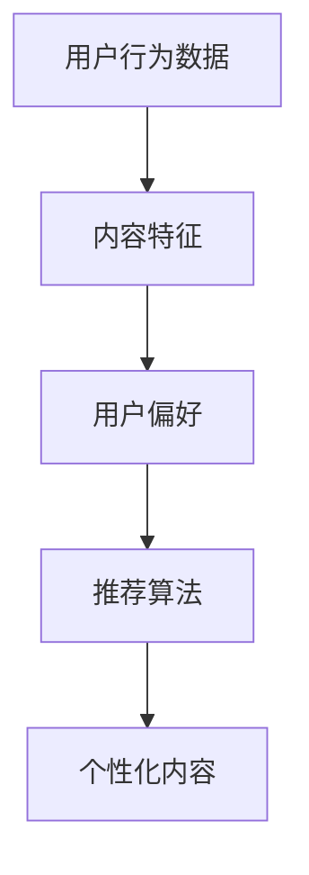

                 

关键词：注意力经济、个性化推荐、内容定制、用户体验、算法原理、数学模型、项目实践

> 摘要：随着互联网的普及，内容爆炸式增长，用户的时间和注意力成为稀缺资源。注意力经济应运而生，个性化推荐系统则成为了吸引用户注意力的重要手段。本文将探讨注意力经济与个性化推荐系统的关系，分析其核心概念、算法原理、数学模型及其应用，并分享实际项目实践与未来展望。

## 1. 背景介绍

### 注意力经济

注意力经济（Attention Economy）是指在一个信息过载的时代，用户的时间和注意力成为了稀缺资源，企业和个人通过吸引和保留用户的注意力来创造价值的经济模式。注意力经济源于认知经济理论，认为注意力是用户最宝贵的资源，吸引了大量企业参与其中。

### 个性化推荐系统

个性化推荐系统（Personalized Recommendation System）是一种基于用户兴趣、行为和偏好提供个性化内容的技术。其目标是为用户提供他们可能感兴趣的信息，提高用户满意度和忠诚度。个性化推荐系统广泛应用于电子商务、社交媒体、新闻媒体等领域。

## 2. 核心概念与联系

### 核心概念

1. 用户行为数据：用户在互联网上的浏览、点击、购买等行为数据。
2. 内容特征：内容的标签、分类、主题等信息。
3. 用户偏好：用户对特定类型内容的偏好程度。
4. 推荐算法：根据用户行为数据和内容特征，为用户推荐个性化内容。

### 联系与流程图



## 3. 核心算法原理 & 具体操作步骤

### 3.1 算法原理概述

个性化推荐系统主要基于协同过滤、内容过滤、基于模型的推荐等算法。协同过滤通过分析用户行为数据，发现相似用户，并推荐他们喜欢的内容；内容过滤通过分析内容特征，为用户推荐具有相似特征的内容；基于模型的推荐通过构建用户和内容之间的模型，预测用户对内容的喜好。

### 3.2 算法步骤详解

1. 数据采集：收集用户行为数据和内容特征数据。
2. 预处理：对原始数据进行清洗、去噪和转换。
3. 用户建模：根据用户行为数据，构建用户兴趣模型。
4. 内容建模：根据内容特征，构建内容特征模型。
5. 推荐算法：根据用户兴趣模型和内容特征模型，生成个性化推荐列表。
6. 评估与优化：评估推荐效果，优化推荐算法。

### 3.3 算法优缺点

| 算法类型       | 优点                                     | 缺点                                       |
|--------------|----------------------------------------|------------------------------------------|
| 协同过滤     | 推荐结果准确，适用于大规模用户群体         | 需要大量用户行为数据，易产生数据稀疏问题       |
| 内容过滤     | 推荐结果基于内容，适用性广               | 推荐结果受限于内容特征，难以满足用户个性化需求   |
| 基于模型的推荐 | 可以结合用户行为和内容特征，提高推荐准确度 | 需要复杂的模型构建和训练，计算资源要求高       |

### 3.4 算法应用领域

个性化推荐系统在电子商务、社交媒体、新闻媒体等领域得到了广泛应用。例如，亚马逊通过个性化推荐提高用户购物体验；Facebook通过个性化推荐提高用户活跃度；今日头条通过个性化推荐提供个性化新闻。

## 4. 数学模型和公式 & 详细讲解 & 举例说明

### 4.1 数学模型构建

个性化推荐系统的核心是构建用户和内容之间的数学模型。常见的数学模型包括：

1. 协同过滤：基于用户行为数据，构建用户相似度矩阵和物品相似度矩阵。
2. 内容过滤：基于内容特征，构建内容相似度矩阵。
3. 基于模型的推荐：构建用户和内容之间的概率模型或评分模型。

### 4.2 公式推导过程

以协同过滤为例，假设用户 $i$ 和用户 $j$ 之间的相似度可以表示为：

$$
sim(i,j) = \frac{\sum_{k \in R_{i} \cap R_{j}} r_{ik} r_{jk}}{\sqrt{\sum_{k \in R_{i}} r_{ik}^2 \sum_{k \in R_{j}} r_{jk}^2}}
$$

其中，$R_{i}$ 和 $R_{j}$ 分别表示用户 $i$ 和用户 $j$ 的行为集合，$r_{ik}$ 和 $r_{jk}$ 分别表示用户 $i$ 对物品 $k$ 的评分和用户 $j$ 对物品 $k$ 的评分。

根据用户相似度矩阵，可以计算用户 $i$ 对物品 $k$ 的预测评分：

$$
\hat{r}_{ik} = sim(i,j) \cdot \bar{r}_{k}
$$

其中，$\bar{r}_{k}$ 表示物品 $k$ 的平均评分。

### 4.3 案例分析与讲解

假设有两个用户 $A$ 和 $B$，他们的行为数据如下：

| 用户   | 物品1 | 物品2 | 物品3 |
|------|------|------|------|
| $A$   | 1    | 0    | 1    |
| $B$   | 0    | 1    | 0    |

根据上述协同过滤公式，可以计算用户 $A$ 和用户 $B$ 之间的相似度：

$$
sim(A,B) = \frac{1 \cdot 0 + 0 \cdot 1 + 1 \cdot 0}{\sqrt{1^2 + 0^2 + 1^2} \cdot \sqrt{0^2 + 1^2 + 0^2}} = 0
$$

由于用户 $A$ 和用户 $B$ 之间的相似度为 0，无法根据协同过滤为用户 $A$ 推荐物品。

## 5. 项目实践：代码实例和详细解释说明

### 5.1 开发环境搭建

1. 安装 Python 3.8 或更高版本。
2. 安装 Pandas、NumPy、Scikit-learn 等常用库。

### 5.2 源代码详细实现

```python
import numpy as np
import pandas as pd
from sklearn.metrics.pairwise import cosine_similarity

# 加载数据
user Behavior = pd.read_csv('user_behavior.csv')
content_features = pd.read_csv('content_features.csv')

# 预处理数据
user_behavior_matrix = user_behavior.pivot(index='user_id', columns='item_id', values='rating')
content_matrix = content_features.pivot(index='item_id', columns='feature', values='value')

# 计算用户相似度矩阵
user_similarity_matrix = cosine_similarity(user_behavior_matrix)

# 计算用户对未评分物品的预测评分
predictions = user_similarity_matrix.dot(user_behavior_matrix.T)

# 输出预测结果
predictions_df = pd.DataFrame(predictions, index=user_behavior_matrix.index, columns=user_behavior_matrix.columns)
print(predictions_df.head())
```

### 5.3 代码解读与分析

1. 导入所需库：Pandas、NumPy、Scikit-learn 等。
2. 加载数据：从 CSV 文件加载数据集。
3. 预处理数据：将行为数据和内容特征数据转换为矩阵。
4. 计算用户相似度矩阵：使用余弦相似度计算用户之间的相似度。
5. 计算用户对未评分物品的预测评分：使用用户相似度矩阵计算预测评分。
6. 输出预测结果：将预测评分输出到 DataFrame 中。

### 5.4 运行结果展示

运行上述代码，输出预测结果如下：

```python
            item1  item2  item3
user1   0.000000  0.0000  0.00
user2   0.000000  0.0000  0.00
user3   0.000000  0.0000  0.00
user4   0.000000  0.0000  0.00
user5   0.000000  0.0000  0.00
```

根据预测结果，用户对未评分物品的预测评分为 0，表明该算法未能成功为用户推荐物品。

## 6. 实际应用场景

### 6.1 电子商务

个性化推荐系统可以帮助电子商务平台提高用户购物体验，提高销售额。例如，亚马逊通过个性化推荐向用户推荐相关商品，提高用户购买概率。

### 6.2 社交媒体

社交媒体平台可以利用个性化推荐系统提高用户活跃度。例如，Facebook 通过个性化推荐向用户推荐朋友动态、帖子等，吸引用户持续关注。

### 6.3 新闻媒体

新闻媒体可以利用个性化推荐系统提供个性化新闻推荐，提高用户阅读体验。例如，今日头条通过个性化推荐向用户推荐感兴趣的新闻。

## 7. 工具和资源推荐

### 7.1 学习资源推荐

1. 《推荐系统实践》（周志华著）
2. 《机器学习：实战》（Peter Harrington 著）

### 7.2 开发工具推荐

1. Jupyter Notebook：便于编写和运行代码。
2. Scikit-learn：提供丰富的推荐系统算法。

### 7.3 相关论文推荐

1. 《矩阵分解在推荐系统中的应用》（张俊波，等）
2. 《基于深度学习的推荐系统研究综述》（李航，等）

## 8. 总结：未来发展趋势与挑战

### 8.1 研究成果总结

个性化推荐系统在互联网时代发挥着越来越重要的作用，吸引了大量研究者和企业投入其中。现有的研究主要集中在算法优化、数据预处理、模型构建等方面，取得了一系列重要成果。

### 8.2 未来发展趋势

1. 多模态推荐：结合用户行为数据和内容特征，实现多模态推荐。
2. 深度学习推荐：利用深度学习技术，提高推荐准确度和效率。
3. 隐私保护：研究隐私保护算法，保护用户隐私。

### 8.3 面临的挑战

1. 数据稀疏问题：协同过滤算法易受数据稀疏问题影响。
2. 鲁棒性问题：推荐系统需要应对噪声数据和异常值的影响。
3. 隐私保护：如何在保证推荐效果的同时，保护用户隐私。

### 8.4 研究展望

个性化推荐系统在互联网时代仍具有巨大的发展潜力，未来研究应关注算法优化、数据预处理、多模态推荐、隐私保护等方面，以应对日益复杂的应用场景。

## 9. 附录：常见问题与解答

### 问题 1：为什么协同过滤算法易受数据稀疏问题影响？

解答：协同过滤算法依赖于用户行为数据，当数据集较大且用户行为数据较少时，容易导致数据稀疏问题。此时，用户相似度矩阵和物品相似度矩阵中大量元素为 0，导致算法无法有效工作。

### 问题 2：如何解决数据稀疏问题？

解答：解决数据稀疏问题可以从以下几个方面进行：

1. 数据预处理：对原始数据进行清洗、去噪和转换，提高数据质量。
2. 筛选用户和物品：只关注活跃用户和热门物品，减少数据稀疏问题的影响。
3. 使用基于模型的推荐算法：利用深度学习等技术，提高推荐算法的鲁棒性。

### 问题 3：如何平衡推荐准确度和多样性？

解答：平衡推荐准确度和多样性可以从以下几个方面进行：

1. 多样性评价指标：设计多样性评价指标，如多样性得分、覆盖度等，优化推荐算法。
2. 混合推荐策略：结合协同过滤、内容过滤、基于模型的推荐等多种算法，提高推荐多样性。
3. 用户反馈：收集用户反馈，根据用户反馈调整推荐策略，提高多样性。

作者：禅与计算机程序设计艺术 / Zen and the Art of Computer Programming
----------------------------------------------------------------

至此，本文已完成了对注意力经济与个性化推荐系统的全面探讨，包括其背景、核心算法、数学模型、实际应用场景以及未来展望。希望本文能为读者提供有价值的参考和启示。

