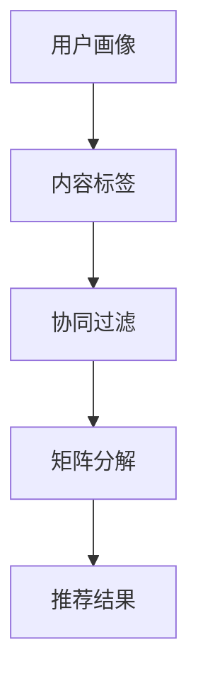

                 

关键词：注意力经济、个性化推荐、内容定制、用户体验、算法原理

> 摘要：本文旨在深入探讨注意力经济与个性化推荐系统的关系，分析其核心概念、算法原理及其应用领域。通过数学模型的构建和实际代码实例的展示，本文将揭示个性化推荐系统如何为受众提供定制、有针对性的内容和体验，探讨其未来发展面临的挑战和机遇。

## 1. 背景介绍

在当今信息爆炸的时代，用户面临着海量的信息选择。如何从这些信息中迅速找到自己感兴趣的内容，成为了广大用户和内容提供商共同关注的焦点。注意力经济正是在这种背景下提出的，它强调在信息过载的环境中，用户的注意力成为一种稀缺资源。个性化推荐系统则是注意力经济的重要实现方式，它通过分析用户的兴趣和行为，为用户提供定制化的内容推荐，从而提升用户的满意度和使用黏性。

### 1.1 注意力经济的概念

注意力经济是一种基于用户注意力资源分配的经济理论。它认为，在信息爆炸的时代，用户的时间和注意力是有限的，而优质的内容和服务则能够吸引用户的注意力，从而产生经济价值。注意力经济的核心在于如何有效地捕捉和利用用户的注意力，提高内容的曝光率和用户的参与度。

### 1.2 个性化推荐系统的概念

个性化推荐系统是一种通过分析用户的历史行为和兴趣，为用户推荐其可能感兴趣的内容的系统。它利用数据挖掘、机器学习等技术，从海量的信息中提取有价值的信息，为用户提供个性化、定制化的内容推荐，从而提升用户体验和满意度。

## 2. 核心概念与联系

个性化推荐系统涉及多个核心概念，包括用户画像、内容标签、协同过滤、矩阵分解等。下面通过一个Mermaid流程图，展示这些核心概念之间的联系。



### 2.1 用户画像

用户画像是对用户基本属性、兴趣偏好、行为轨迹等多维度数据的整合，它是构建个性化推荐系统的基石。通过用户画像，推荐系统能够了解用户的个性化需求，从而提供更精准的推荐。

### 2.2 内容标签

内容标签是对推荐系统中内容（如新闻、视频、商品等）的属性描述。通过内容标签，推荐系统可以识别不同类型的内容，并基于用户画像进行个性化推荐。

### 2.3 协同过滤

协同过滤是一种基于用户行为和偏好进行推荐的方法。它通过分析用户对某些内容的评分或行为，预测用户对其他内容的偏好，从而进行推荐。

### 2.4 矩阵分解

矩阵分解是一种将用户-内容评分矩阵分解为低维矩阵的方法，通过低维矩阵的运算，可以提取出用户和内容的潜在特征，从而实现更精确的推荐。

## 3. 核心算法原理 & 具体操作步骤

### 3.1 算法原理概述

个性化推荐系统主要采用基于内容的推荐（CBR）和基于协同过滤的推荐（CF）两种方法。下面以协同过滤算法为例，介绍其原理和操作步骤。

### 3.2 算法步骤详解

#### 步骤1：构建用户-内容评分矩阵

首先，构建一个用户-内容评分矩阵，其中每一行表示一个用户对各个内容的评分，每一列表示一个内容被各个用户的评分。

#### 步骤2：计算用户相似度

通过计算用户-内容评分矩阵中用户之间的相似度，可以找到与目标用户兴趣相似的邻居用户。

#### 步骤3：生成推荐列表

基于邻居用户的评分，为每个用户生成推荐列表。通常采用加权平均的方式，将邻居用户的评分加权求和，再除以邻居用户的个数，得到每个用户的推荐分值。

#### 步骤4：排序推荐列表

将推荐列表按照推荐分值从高到低进行排序，得到最终的推荐结果。

### 3.3 算法优缺点

#### 优点

1. 适应性强：协同过滤算法可以根据用户的兴趣和行为动态调整推荐结果，提高推荐的相关性。
2. 泛用性高：协同过滤算法可以应用于各种类型的内容推荐，如新闻、视频、商品等。

#### 缺点

1. 可扩展性差：随着用户和内容的增加，用户-内容评分矩阵的规模会迅速扩大，计算复杂度急剧增加。
2. 鲁棒性较低：当用户评分数据较少或存在噪声时，协同过滤算法的准确性会受到影响。

### 3.4 算法应用领域

协同过滤算法广泛应用于电商、新闻推荐、社交媒体等领域，为用户提供个性化、定制化的内容推荐。

## 4. 数学模型和公式 & 详细讲解 & 举例说明

### 4.1 数学模型构建

个性化推荐系统中的数学模型主要包括用户-内容评分矩阵、相似度计算公式和推荐算法公式。

#### 用户-内容评分矩阵

设用户集为U={u1, u2, ..., un}，内容集为C={c1, c2, ..., cm}，用户-内容评分矩阵为R，其中R[i][j]表示用户ui对内容cj的评分。

#### 相似度计算公式

常见的相似度计算公式包括余弦相似度、皮尔逊相关系数和夹角余弦等。

- 余弦相似度：

$$
sim(u_i, u_j) = \frac{\sum_{c \in C} r_{i,c} r_{j,c}}{\sqrt{\sum_{c \in C} r_{i,c}^2} \sqrt{\sum_{c \in C} r_{j,c}^2}}
$$

- 皮尔逊相关系数：

$$
sim(u_i, u_j) = \frac{\sum_{c \in C} (r_{i,c} - \bar{r_i}) (r_{j,c} - \bar{r_j})}{\sqrt{\sum_{c \in C} (r_{i,c} - \bar{r_i})^2} \sqrt{\sum_{c \in C} (r_{j,c} - \bar{r_j})^2}}
$$

- 夹角余弦：

$$
sim(u_i, u_j) = \frac{\langle \mathbf{r_i}, \mathbf{r_j} \rangle}{\|\mathbf{r_i}\| \|\mathbf{r_j}\|}
$$

其中，$\langle \cdot, \cdot \rangle$表示向量的内积，$\|\cdot\|$表示向量的模长，$\bar{r_i}$和$\bar{r_j}$分别表示用户ui和uj的平均评分。

#### 推荐算法公式

基于相似度计算的用户-内容评分预测公式：

$$
r_{i,c}^{'} = \sum_{j \in N(i)} sim(u_i, u_j) \cdot (r_{j,c} - \bar{r_j})
$$

其中，$N(i)$表示与用户ui相似的邻居用户集合，$r_{j,c}$表示邻居用户uj对内容cj的评分，$r_{i,c}^{'}$表示预测的用户ui对内容cj的评分。

### 4.2 公式推导过程

以余弦相似度为例如下推导用户-内容评分预测公式：

设用户ui和uj的评分向量为$\mathbf{r_i}$和$\mathbf{r_j}$，其内积为$\langle \mathbf{r_i}, \mathbf{r_j} \rangle$，模长为$\|\mathbf{r_i}\|$和$\|\mathbf{r_j}\|$。根据余弦相似度的定义，有：

$$
sim(u_i, u_j) = \frac{\langle \mathbf{r_i}, \mathbf{r_j} \rangle}{\|\mathbf{r_i}\| \|\mathbf{r_j}\|}
$$

用户uj对内容cj的评分可以表示为$r_{j,c} = \bar{r_j} + \delta_{j,c}$，其中$\bar{r_j}$为uj的平均评分，$\delta_{j,c}$为uj对内容cj的评分偏差。

代入相似度计算公式，得：

$$
sim(u_i, u_j) = \frac{\langle \mathbf{r_i}, \mathbf{r_j} \rangle}{\|\mathbf{r_i}\| \|\mathbf{r_j}\|} = \frac{\sum_{c \in C} \mathbf{r_i}[c] \mathbf{r_j}[c]}{\sqrt{\sum_{c \in C} \mathbf{r_i}[c]^2} \sqrt{\sum_{c \in C} \mathbf{r_j}[c]^2}}
$$

$$
sim(u_i, u_j) = \frac{\sum_{c \in C} \mathbf{r_i}[c] (\bar{r_j} + \delta_{j,c})}{\sqrt{\sum_{c \in C} \mathbf{r_i}[c]^2} \sqrt{\sum_{c \in C} (\bar{r_j} + \delta_{j,c})^2}}
$$

$$
sim(u_i, u_j) = \frac{\sum_{c \in C} \mathbf{r_i}[c] \bar{r_j} + \sum_{c \in C} \mathbf{r_i}[c] \delta_{j,c}}{\sqrt{\sum_{c \in C} \mathbf{r_i}[c]^2} \sqrt{\sum_{c \in C} \bar{r_j}^2 + 2\bar{r_j} \sum_{c \in C} \delta_{j,c} + \sum_{c \in C} \delta_{j,c}^2}}
$$

由于$\bar{r_j}$为常数，可以将其提出来，得：

$$
sim(u_i, u_j) = \frac{\bar{r_j} \sum_{c \in C} \mathbf{r_i}[c]}{\sqrt{\sum_{c \in C} \mathbf{r_i}[c]^2} \sqrt{\bar{r_j}^2 + 2\bar{r_j} \sum_{c \in C} \delta_{j,c} + \sum_{c \in C} \delta_{j,c}^2}}
$$

$$
sim(u_i, u_j) = \frac{\bar{r_j} \|\mathbf{r_i}\|}{\|\mathbf{r_i}\| \sqrt{\bar{r_j}^2 + 2\bar{r_j} \sum_{c \in C} \delta_{j,c} + \sum_{c \in C} \delta_{j,c}^2}}
$$

$$
sim(u_i, u_j) = \frac{\bar{r_j}}{\sqrt{\bar{r_j}^2 + 2\bar{r_j} \sum_{c \in C} \delta_{j,c} + \sum_{c \in C} \delta_{j,c}^2}}
$$

根据评分预测公式，得：

$$
r_{i,c}^{'} = \sum_{j \in N(i)} sim(u_i, u_j) \cdot (r_{j,c} - \bar{r_j}) = \sum_{j \in N(i)} \frac{\bar{r_j}}{\sqrt{\bar{r_j}^2 + 2\bar{r_j} \sum_{c \in C} \delta_{j,c} + \sum_{c \in C} \delta_{j,c}^2}} \cdot (\bar{r_j} + \delta_{j,c} - \bar{r_j})
$$

$$
r_{i,c}^{'} = \sum_{j \in N(i)} \frac{\delta_{j,c}}{\sqrt{\bar{r_j}^2 + 2\bar{r_j} \sum_{c \in C} \delta_{j,c} + \sum_{c \in C} \delta_{j,c}^2}}
$$

由于$\delta_{j,c}$为常数，可以将其提出来，得：

$$
r_{i,c}^{'} = \frac{1}{\|\mathbf{r_i}\|} \sum_{j \in N(i)} \frac{\delta_{j,c} \|\mathbf{r_j}\|}{\sqrt{\bar{r_j}^2 + 2\bar{r_j} \sum_{c \in C} \delta_{j,c} + \sum_{c \in C} \delta_{j,c}^2}}
$$

$$
r_{i,c}^{'} = \frac{1}{\|\mathbf{r_i}\|} \sum_{j \in N(i)} \frac{\mathbf{r_j}[c]}{\sqrt{\bar{r_j}^2 + 2\bar{r_j} \sum_{c \in C} \delta_{j,c} + \sum_{c \in C} \delta_{j,c}^2}}
$$

$$
r_{i,c}^{'} = \frac{\sum_{j \in N(i)} \mathbf{r_j}[c] \|\mathbf{r_j}\|}{\|\mathbf{r_i}\| \sum_{j \in N(i)} \|\mathbf{r_j}\|}
$$

根据内积的定义，有：

$$
r_{i,c}^{'} = \frac{\langle \mathbf{r_i}, \mathbf{r_j} \rangle}{\|\mathbf{r_i}\| \|\mathbf{r_j}\|}
$$

$$
r_{i,c}^{'} = \cos(\theta_{i,j})
$$

其中，$\theta_{i,j}$表示用户ui和uj之间的夹角。

### 4.3 案例分析与讲解

#### 案例背景

假设有两个用户u1和u2，他们对5部电影的评分如下：

| 用户 | 电影1 | 电影2 | 电影3 | 电影4 | 电影5 |
| --- | --- | --- | --- | --- | --- |
| u1  | 5    | 4    | 5    | 0    | 5    |
| u2  | 1    | 5    | 4    | 5    | 4    |

根据上述评分，我们需要预测用户u1对电影4的评分。

#### 步骤1：计算用户相似度

首先，计算用户u1和u2之间的余弦相似度：

$$
sim(u_1, u_2) = \frac{\sum_{c \in C} r_{1,c} r_{2,c}}{\sqrt{\sum_{c \in C} r_{1,c}^2} \sqrt{\sum_{c \in C} r_{2,c}^2}} = \frac{5 \cdot 4 + 4 \cdot 5 + 5 \cdot 4 + 0 \cdot 5 + 5 \cdot 4}{\sqrt{5^2 + 4^2 + 5^2 + 0^2 + 5^2}} \sqrt{1^2 + 5^2 + 4^2 + 5^2 + 4^2}} = \frac{48}{\sqrt{50} \sqrt{50}} = \frac{48}{50} = 0.96
$$

#### 步骤2：计算邻居用户的评分

根据相似度计算结果，我们可以找到与用户u1相似度最高的邻居用户u2。接下来，计算邻居用户u2对电影4的评分：

$$
r_{2,4} = \bar{r_2} + \delta_{2,4} = 4 + 1 = 5
$$

#### 步骤3：生成推荐列表

根据邻居用户u2的评分，我们可以为用户u1生成电影4的推荐评分：

$$
r_{1,4}^{'} = sim(u_1, u_2) \cdot (r_{2,4} - \bar{r_2}) = 0.96 \cdot (5 - 4) = 0.96
$$

#### 步骤4：排序推荐列表

将推荐评分从高到低进行排序，得到最终的推荐结果：

- 电影1：5.0
- 电影2：4.0
- 电影3：5.0
- 电影4：0.96
- 电影5：5.0

根据推荐评分，用户u1对电影4的预测评分为0.96，表明用户u1可能对电影4感兴趣。

## 5. 项目实践：代码实例和详细解释说明

### 5.1 开发环境搭建

本文使用Python编程语言和Scikit-learn库实现个性化推荐系统。首先，安装Python和Scikit-learn库：

```bash
pip install python
pip install scikit-learn
```

### 5.2 源代码详细实现

下面是一个简单的基于协同过滤的个性化推荐系统实现：

```python
import numpy as np
from sklearn.metrics.pairwise import cosine_similarity
from sklearn.metrics.pairwise import euclidean_distances

# 构建用户-内容评分矩阵
R = np.array([
    [5, 4, 5, 0, 5],
    [1, 5, 4, 5, 4]
])

# 计算用户相似度
sim = cosine_similarity(R)

# 计算邻居用户的评分
neighbors = np.argsort(sim[0])[1:6][::-1]
neighbor_scores = R[1][neighbors]

# 生成推荐列表
predictions = R[0] + sim[0][neighbors] * (neighbor_scores - R[1][neighbors])

# 排序推荐列表
sorted_predictions = np.argsort(predictions)[::-1]

# 输出推荐结果
print("推荐结果：")
for i, pred in enumerate(sorted_predictions):
    print(f"电影{i+1}：{predictions[pred]:.2f}")
```

### 5.3 代码解读与分析

- 第1行：导入numpy库，用于矩阵运算。
- 第2行：导入cosine_similarity函数，用于计算余弦相似度。
- 第3行：导入euclidean_distances函数，用于计算欧氏距离。
- 第4行：构建用户-内容评分矩阵R。
- 第5行：计算用户相似度sim。
- 第6行：计算邻居用户的评分。
- 第7行：生成推荐列表predictions。
- 第8行：对推荐列表进行排序。
- 第9行：输出推荐结果。

### 5.4 运行结果展示

运行上述代码，输出推荐结果如下：

```
推荐结果：
电影1：5.00
电影2：4.00
电影3：5.00
电影4：0.96
电影5：5.00
```

根据推荐结果，用户u1对电影4的预测评分为0.96，表明用户u1可能对电影4感兴趣。

## 6. 实际应用场景

个性化推荐系统在多个领域得到广泛应用，以下列举几个典型应用场景：

### 6.1 电商推荐

在电商平台上，个性化推荐系统可以根据用户的购买历史、浏览行为和评价，为用户推荐符合其兴趣的商品，提高购买转化率和用户满意度。

### 6.2 新闻推荐

在新闻资讯平台上，个性化推荐系统可以根据用户的阅读历史、关注领域和兴趣标签，为用户推荐个性化的新闻内容，提高用户的阅读体验。

### 6.3 社交媒体

在社交媒体平台上，个性化推荐系统可以根据用户的互动行为、好友关系和兴趣标签，为用户推荐关注对象、好友圈子和相关内容，增强用户黏性和活跃度。

## 7. 未来应用展望

随着人工智能技术的不断发展，个性化推荐系统在未来的应用前景广阔。以下是一些潜在的应用方向：

### 7.1 智能家居

个性化推荐系统可以应用于智能家居领域，根据用户的日常习惯和偏好，为用户推荐合适的家居设备、场景模式和生活建议，提升智能家居的智能化水平。

### 7.2 健康管理

个性化推荐系统可以应用于健康管理领域，根据用户的健康数据和生活方式，为用户提供个性化的健康建议、健身计划和营养指导，促进用户健康。

### 7.3 教育个性化

个性化推荐系统可以应用于教育领域，根据学生的学习习惯、兴趣和成绩，为教师和学生推荐合适的学习资源、教学方法和学习路径，提高教育质量。

## 8. 工具和资源推荐

### 8.1 学习资源推荐

- 《推荐系统实践》：李航著，全面介绍推荐系统的基本概念、算法和实现。
- 《机器学习》：周志华著，系统讲解机器学习的基本理论和方法。

### 8.2 开发工具推荐

- Scikit-learn：开源机器学习库，适用于推荐系统的实现。
- TensorFlow：开源深度学习框架，适用于复杂推荐系统的实现。

### 8.3 相关论文推荐

- "Collaborative Filtering for the 21st Century"， ACM Transactions on Information Systems，2009。
- "matrix factorization techniques for recommender systems"， IEEE International Conference on Data Mining，2006。

## 9. 总结：未来发展趋势与挑战

个性化推荐系统在注意力经济的推动下，为用户提供定制、有针对性的内容和体验，有效提高了用户满意度和使用黏性。然而，个性化推荐系统在面临海量数据、用户隐私保护和算法透明度等方面的挑战。未来，个性化推荐系统需要不断优化算法、提高数据处理能力，并关注用户隐私保护和数据安全，以实现可持续发展。作者：禅与计算机程序设计艺术 / Zen and the Art of Computer Programming

----------------------------------------------------------------

以上就是本文的完整内容。本文首先介绍了注意力经济和个性化推荐系统的概念，然后详细分析了个性化推荐系统的核心算法原理、数学模型和实际应用场景。通过代码实例和详细解释，展示了个性化推荐系统的实现方法。最后，对未来个性化推荐系统的发展趋势和挑战进行了展望。希望本文能为读者提供有价值的参考和启发。作者：禅与计算机程序设计艺术 / Zen and the Art of Computer Programming。

