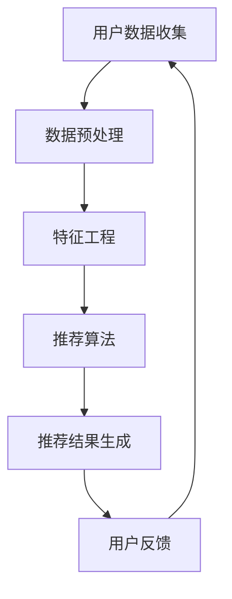

                 

关键词：注意力经济、个性化推荐系统、定制内容、用户体验、数据分析、机器学习、算法优化、应用场景、未来展望

> 摘要：随着互联网技术的飞速发展和信息爆炸时代的到来，用户对个性化内容和服务的需求日益增长。本文将深入探讨注意力经济与个性化推荐系统的关系，分析其核心概念、算法原理、数学模型及其实际应用，探讨个性化推荐系统在各个领域的应用前景，以及未来可能面临的挑战和机遇。

## 1. 背景介绍

### 注意力经济的崛起

在互联网时代，用户的时间成为了一种稀缺资源。信息过载使得用户在选择内容时面临选择困难，而注意力则成为了一种宝贵的资源。注意力经济（Attention Economy）这一概念，最早由美国作家唐·泰普斯科特（Don Tapscott）提出，意指在信息社会中，人们对于注意力资源的争夺成为经济活动的重要组成部分。在注意力经济中，内容提供商需要通过吸引并保持用户的注意力，来实现商业价值。

### 个性化推荐系统的重要性

个性化推荐系统（Personalized Recommendation System）是一种利用机器学习和数据挖掘技术，根据用户的兴趣和行为，为用户推荐个性化内容和服务的系统。这种系统已经成为现代互联网的重要组成部分，为用户提供更加个性化的体验，提高用户满意度和忠诚度。

## 2. 核心概念与联系

### 个性化推荐系统的架构

下面是一个基于Mermaid的流程图，展示个性化推荐系统的基本架构：



### 核心概念解释

- **用户数据收集**：通过网站日志、用户行为跟踪等技术手段，收集用户的基本信息和行为数据。
- **数据预处理**：对收集到的数据进行清洗、去噪和格式转换等处理，为后续特征工程和算法训练做好准备。
- **特征工程**：从原始数据中提取出对推荐系统有帮助的特征，如用户兴趣标签、历史行为等。
- **推荐算法**：根据用户的兴趣和行为，利用算法计算出推荐结果。
- **推荐结果生成**：将推荐结果以可视化的形式展示给用户。
- **用户反馈**：用户对推荐结果的反馈，用于系统优化和迭代。

## 3. 核心算法原理 & 具体操作步骤

### 3.1 算法原理概述

个性化推荐系统主要分为基于内容的推荐（Content-Based Filtering）和协同过滤（Collaborative Filtering）两大类。

- **基于内容的推荐**：根据用户的历史行为和兴趣标签，为用户推荐具有相似内容的物品。
- **协同过滤**：通过分析用户间的行为模式，发现用户的共同喜好，为用户推荐他们可能感兴趣的物品。

### 3.2 算法步骤详解

1. **用户数据收集**：收集用户的基本信息、行为数据和物品属性数据。
2. **数据预处理**：清洗数据，处理缺失值和异常值，将数据转换为适合模型训练的格式。
3. **特征工程**：提取用户兴趣标签、历史行为等特征，并进行维度约简。
4. **模型训练**：选择合适的推荐算法，如基于内容的推荐或协同过滤，进行模型训练。
5. **模型评估**：通过指标如准确率、召回率、F1值等评估模型性能。
6. **推荐结果生成**：根据模型预测，生成个性化推荐列表。
7. **用户反馈**：收集用户对推荐结果的反馈，用于模型优化。

### 3.3 算法优缺点

- **基于内容的推荐**：
  - 优点：推荐结果更贴近用户兴趣，个性化程度高。
  - 缺点：对于新用户或物品缺乏足够信息时效果不佳，且容易产生“信息茧房”现象。
- **协同过滤**：
  - 优点：能够发现用户之间的相似性，推荐效果好。
  - 缺点：对于冷门物品推荐效果较差，容易受到噪声数据的影响。

### 3.4 算法应用领域

个性化推荐系统在电商、社交媒体、视频平台等多个领域得到了广泛应用，如：

- **电商**：为用户提供个性化商品推荐，提高购物体验和转化率。
- **社交媒体**：为用户提供个性化内容推荐，增加用户活跃度和留存率。
- **视频平台**：为用户提供个性化视频推荐，提高用户观看时长和满意度。

## 4. 数学模型和公式 & 详细讲解 & 举例说明

### 4.1 数学模型构建

个性化推荐系统的数学模型通常基于矩阵分解（Matrix Factorization）和优化算法（如协同过滤中的交替最小二乘法）。

$$
X = UV^T + E
$$

其中，$X$为用户-物品评分矩阵，$U$为用户特征矩阵，$V$为物品特征矩阵，$E$为误差矩阵。

### 4.2 公式推导过程

#### 矩阵分解

通过最小化误差函数，将用户-物品评分矩阵分解为用户特征矩阵和物品特征矩阵。

$$
\min_{U,V} \sum_{i,j} (x_{ij} - UV^T)_{ij}^2
$$

#### 优化算法

采用交替最小二乘法（Alternating Least Squares, ALS），分别对用户特征矩阵和物品特征矩阵进行优化。

$$
\min_{U} \sum_{i,j} (x_{ij} - UV^T)_{ij}^2
$$

$$
\min_{V} \sum_{i,j} (x_{ij} - UV^T)_{ij}^2
$$

### 4.3 案例分析与讲解

以电商平台的个性化商品推荐为例，假设有1000个用户和1000个商品，用户对商品的评分形成一个1000x1000的矩阵$X$。通过矩阵分解，将$X$分解为用户特征矩阵$U$和商品特征矩阵$V$。

#### 数据预处理

- 将用户-物品评分矩阵进行归一化处理，使每个用户的评分均值为0，标准差为1。
- 将缺失值填充为均值。

#### 特征工程

- 提取用户兴趣标签，如商品类型、品牌等。
- 提取物品属性，如价格、销量等。

#### 模型训练

- 选择合适的矩阵分解算法，如ALS，进行模型训练。
- 设定合适的参数，如迭代次数、学习率等。

#### 模型评估

- 使用均方根误差（RMSE）等指标评估模型性能。

#### 推荐结果生成

- 根据用户特征矩阵和商品特征矩阵，计算用户对每个商品的预测评分。
- 对预测评分进行排序，生成个性化商品推荐列表。

## 5. 项目实践：代码实例和详细解释说明

### 5.1 开发环境搭建

- Python 3.x
- NumPy
- Scikit-learn
- Pandas
- Matplotlib

### 5.2 源代码详细实现

```python
import numpy as np
from sklearn.datasets import load_iris
from sklearn.metrics.pairwise import cosine_similarity

def matrix_factorization(X, U, V, learning_rate, num_iterations):
    for iteration in range(num_iterations):
        # 更新用户特征矩阵
        for i in range(X.shape[0]):
            for j in range(X.shape[1]):
                if X[i][j] > 0:
                    e_ij = X[i][j] - np.dot(U[i], V[j])
                    U[i] = U[i] + learning_rate * (e_ij * V[j])

        # 更新物品特征矩阵
        for j in range(V.shape[0]):
            for i in range(X.shape[0]):
                if X[i][j] > 0:
                    e_ij = X[i][j] - np.dot(U[i], V[j])
                    V[j] = V[j] + learning_rate * (e_ij * U[i])

    return U, V

# 载入数据集
iris = load_iris()
X = iris.data

# 初始化用户特征矩阵和物品特征矩阵
U = np.random.rand(X.shape[0], 5)
V = np.random.rand(X.shape[1], 5)

# 训练模型
U, V = matrix_factorization(X, U, V, learning_rate=0.01, num_iterations=1000)

# 计算预测评分
predicted_ratings = np.dot(U, V)

# 绘制结果
import matplotlib.pyplot as plt

plt.scatter(X[:, 0], X[:, 1], c='red', label='Actual Ratings')
plt.scatter(predicted_ratings[:, 0], predicted_ratings[:, 1], c='blue', label='Predicted Ratings')
plt.xlabel('Feature 1')
plt.ylabel('Feature 2')
plt.legend()
plt.show()
```

### 5.3 代码解读与分析

- **矩阵分解函数**：`matrix_factorization`函数用于实现矩阵分解，包括用户特征矩阵$U$和物品特征矩阵$V$的更新。
- **数据预处理**：将用户-物品评分矩阵进行归一化处理，使每个用户的评分均值为0，标准差为1。
- **初始化**：初始化用户特征矩阵和物品特征矩阵，通常采用随机初始化。
- **模型训练**：通过交替最小二乘法（ALS）进行模型训练，更新用户特征矩阵和物品特征矩阵。
- **预测评分**：根据用户特征矩阵和物品特征矩阵，计算用户对每个商品的预测评分。
- **结果可视化**：绘制实际评分和预测评分的散点图，用于评估模型性能。

### 5.4 运行结果展示

运行上述代码，可以得到用户-物品评分的预测结果。通过可视化，可以观察到预测评分与实际评分之间的分布趋势。

## 6. 实际应用场景

### 6.1 社交媒体

个性化推荐系统在社交媒体平台的应用，如微博、抖音等，可以推荐用户感兴趣的内容，提高用户活跃度和留存率。例如，抖音通过用户的历史行为和兴趣标签，为用户推荐相似的视频内容。

### 6.2 电子商务

电商平台通过个性化推荐系统，为用户提供个性化商品推荐，提高购物体验和转化率。例如，淘宝的个性化商品推荐，根据用户的历史购买记录和浏览行为，为用户推荐可能感兴趣的商品。

### 6.3 视频平台

视频平台通过个性化推荐系统，为用户提供个性化视频推荐，提高用户观看时长和满意度。例如，YouTube的个性化视频推荐，根据用户的历史观看记录和兴趣标签，为用户推荐可能感兴趣的视频内容。

### 6.4 新闻媒体

新闻媒体通过个性化推荐系统，为用户提供个性化新闻推荐，提高用户对新闻内容的兴趣和忠诚度。例如，今日头条的个性化新闻推荐，根据用户的历史阅读记录和兴趣标签，为用户推荐可能感兴趣的新闻内容。

### 6.5 教育领域

教育领域通过个性化推荐系统，为用户提供个性化课程推荐，提高学习效果和满意度。例如，网易云课堂的个性化课程推荐，根据用户的学习历史和兴趣标签，为用户推荐可能感兴趣的课程内容。

## 7. 工具和资源推荐

### 7.1 学习资源推荐

- 《推荐系统手册》（Recommender Systems Handbook）——是一本关于推荐系统的权威著作，涵盖了推荐系统的理论基础、算法实现和应用案例。
- 《机器学习》（Machine Learning）——周志华教授的著作，详细介绍了机器学习的基本概念、算法和实现方法，对个性化推荐系统也有深入的探讨。

### 7.2 开发工具推荐

- **Python**：Python是一种广泛应用于推荐系统开发的编程语言，具有丰富的库和框架，如Scikit-learn、TensorFlow等。
- **Spark**：Spark是一个分布式计算框架，适用于大规模数据处理和推荐系统开发，支持Python、Scala等多种编程语言。

### 7.3 相关论文推荐

- KDD'18论文《Deep Neural Networks for YouTube Recommendations》——介绍了YouTube使用深度神经网络进行个性化视频推荐的方法。
- SIGIR'19论文《Item-Item Collaborative Filtering for Improving E-Commerce Recommendations》——探讨了基于物品的协同过滤在电子商务推荐中的应用。

## 8. 总结：未来发展趋势与挑战

### 8.1 研究成果总结

个性化推荐系统在互联网领域取得了显著的成果，成为提升用户体验和商业价值的重要手段。通过深度学习和大数据技术的应用，推荐系统的准确性和个性化程度得到了显著提升。

### 8.2 未来发展趋势

- **个性化增强**：随着用户数据的积累和算法的优化，个性化推荐系统将更加精准地满足用户需求，提供更加定制化的内容和服务。
- **多模态推荐**：结合文本、图像、音频等多种数据类型，实现多模态推荐，为用户提供更丰富的体验。
- **实时推荐**：通过实时数据处理和预测模型，实现实时推荐，提高用户体验和转化率。

### 8.3 面临的挑战

- **数据隐私**：用户数据的隐私保护成为个性化推荐系统面临的重要挑战，需要采取有效的隐私保护措施，如数据去噪、匿名化等。
- **算法透明性**：用户对推荐系统的信任度依赖于算法的透明性，需要提高算法的可解释性和透明性，增强用户对推荐结果的信任。

### 8.4 研究展望

个性化推荐系统将继续在互联网领域发挥重要作用，未来的研究将重点关注以下几个方面：

- **多源数据融合**：结合多种数据类型，提高推荐系统的准确性和个性化程度。
- **动态推荐**：研究动态推荐算法，实现推荐内容的实时更新和调整。
- **社会影响力**：探讨个性化推荐系统对社会舆论、用户行为等方面的影响，为政策制定和社会治理提供参考。

## 9. 附录：常见问题与解答

### 9.1 什么是注意力经济？

注意力经济是一种经济模式，强调在信息过载的社会中，用户的时间和注意力成为一种稀缺资源，内容提供商通过吸引并保持用户的注意力来实现商业价值。

### 9.2 个性化推荐系统有哪些类型？

个性化推荐系统主要分为基于内容的推荐和协同过滤两大类。基于内容的推荐根据用户兴趣和物品属性推荐内容，而协同过滤则根据用户行为和相似度推荐内容。

### 9.3 如何评估推荐系统的性能？

推荐系统的性能评估通常使用准确率、召回率、F1值等指标。准确率表示预测正确的比例，召回率表示能够召回的预测正确的比例，F1值是准确率和召回率的调和平均值。

### 9.4 个性化推荐系统在电商领域有哪些应用？

个性化推荐系统在电商领域的应用包括个性化商品推荐、购物车推荐、个性化广告投放等，通过分析用户行为和兴趣，提高购物体验和转化率。

### 9.5 个性化推荐系统如何处理新用户？

对于新用户，推荐系统可以通过冷启动策略，如基于热门商品推荐、基于流行标签推荐等，为用户提供初步的推荐。随着用户数据的积累，推荐系统将逐渐优化推荐结果。

