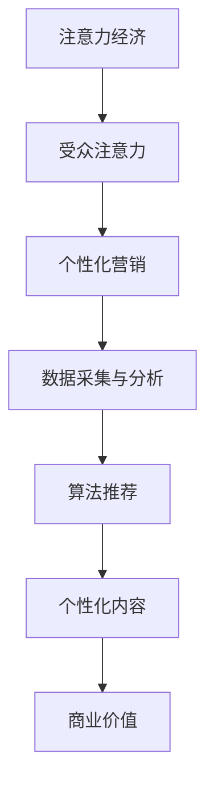

                 

关键词：注意力经济、个性化营销、信息定制、受众分析、技术实施

> 摘要：本文深入探讨了注意力经济与个性化营销策略，分析了如何通过技术手段为受众创建定制、有针对性的信息。文章首先介绍了注意力经济的概念，然后讨论了个性化营销的原理和方法，并通过实例展示了技术实施的过程。最后，文章提出了未来应用展望和面临的挑战。

## 1. 背景介绍

随着互联网和数字媒体的迅速发展，人们面临着信息过载的挑战。如何在海量信息中脱颖而出，吸引并保持受众的注意力，成为企业和营销人员关注的焦点。注意力经济作为一种新的经济模式，应运而生。它强调在信息爆炸的时代，吸引并保持受众的注意力是实现商业价值的关键。

个性化营销作为注意力经济的重要组成部分，旨在通过深入了解受众需求和行为，为他们提供定制化的信息和服务。个性化营销的核心在于利用技术手段分析受众数据，从而实现精准定位和个性化推荐。本文将围绕注意力经济与个性化营销策略展开讨论，旨在为读者提供有价值的见解和实施指南。

### 1.1 注意力经济的兴起

注意力经济最早由互联网企业家安德森（Chris Anderson）在《长尾理论》（The Long Tail）一书中提出。他认为，随着互联网的发展，消费者不再局限于热门商品和主流市场，而是越来越倾向于寻找小众和个性化的商品和服务。这一现象导致了市场需求的多样化，也为企业和营销人员提供了新的机遇。

注意力经济的核心在于吸引并保持受众的注意力。在信息爆炸的时代，受众的注意力成为一种稀缺资源，如何有效地吸引和保持受众的注意力成为企业竞争的关键。注意力经济强调，通过满足受众需求、提供高质量内容和个性化服务，企业可以建立与受众的紧密联系，从而实现商业价值的最大化。

### 1.2 个性化营销的兴起

个性化营销作为一种新兴的营销模式，旨在通过深入了解受众需求和行为，为他们提供定制化的信息和服务。个性化营销的核心在于数据分析和算法推荐。通过收集和分析受众数据，企业可以了解受众的兴趣、行为和需求，从而实现精准定位和个性化推荐。

个性化营销的优势在于提高营销效果和用户满意度。通过提供定制化的内容和服务，企业可以更好地满足受众需求，提高用户体验。同时，个性化营销也可以帮助企业降低营销成本，提高资源利用效率。个性化营销的兴起，为企业在竞争激烈的市场环境中脱颖而出提供了有力支持。

## 2. 核心概念与联系

为了深入理解注意力经济与个性化营销策略，我们需要了解其中的核心概念和它们之间的联系。

### 2.1 注意力经济

注意力经济是一种基于受众注意力的经济模式。它强调在信息爆炸的时代，吸引并保持受众的注意力是实现商业价值的关键。注意力经济主要涉及以下几个方面：

- **注意力资源**：受众的注意力是一种稀缺资源，企业需要通过优质内容和个性化服务吸引并保持受众的注意力。

- **注意力市场**：在注意力市场中，受众的注意力被看作是一种商品，企业通过提供有价值的内容和服务来吸引受众的注意力。

- **注意力分配**：企业需要合理分配注意力资源，将注意力集中在最具商业价值的目标受众上。

### 2.2 个性化营销

个性化营销是一种通过数据分析和算法推荐，为受众提供定制化信息和服务的新型营销模式。个性化营销的核心概念包括：

- **数据采集与分析**：通过收集和分析受众数据，企业可以了解受众的兴趣、行为和需求。

- **算法推荐**：利用算法对受众数据进行处理和分析，实现精准定位和个性化推荐。

- **个性化内容**：根据受众的兴趣和需求，提供定制化的内容和推荐。

### 2.3 注意力经济与个性化营销的联系

注意力经济与个性化营销之间存在着密切的联系。个性化营销策略的制定和实施，需要依赖于注意力经济理论。注意力经济为个性化营销提供了理论基础，指导企业在信息爆炸的时代如何吸引并保持受众的注意力。

同时，个性化营销的实施，也为注意力经济提供了实际的应用场景。通过个性化营销，企业可以更好地满足受众需求，提高用户体验，从而实现商业价值的最大化。

### 2.4 Mermaid 流程图

为了更直观地展示注意力经济与个性化营销之间的联系，我们使用 Mermaid 流程图进行描述。



该流程图展示了注意力经济与个性化营销之间的相互作用。通过注意力经济，企业可以吸引并保持受众的注意力；而通过个性化营销，企业可以更好地满足受众需求，实现商业价值的最大化。

## 3. 核心算法原理 & 具体操作步骤

### 3.1 算法原理概述

个性化营销的核心在于利用数据分析和算法推荐，实现精准定位和个性化推荐。这里，我们主要介绍两种核心算法：协同过滤算法和基于内容的推荐算法。

- **协同过滤算法**：协同过滤算法通过分析用户之间的行为和偏好，发现相似的用户群体，从而为用户推荐他们可能感兴趣的内容。协同过滤算法分为基于用户的协同过滤算法和基于物品的协同过滤算法。

- **基于内容的推荐算法**：基于内容的推荐算法通过分析内容属性和用户兴趣，为用户推荐具有相似属性的内容。这种算法通常用于新闻推荐、音乐推荐等场景。

### 3.2 算法步骤详解

#### 3.2.1 协同过滤算法步骤

1. **数据预处理**：对用户行为数据进行清洗和预处理，包括去除重复数据、缺失值填充等。

2. **构建用户-物品矩阵**：根据用户行为数据，构建用户-物品矩阵，表示用户对物品的评分或行为。

3. **计算相似度**：计算用户之间的相似度，可以使用余弦相似度、皮尔逊相关系数等指标。

4. **生成推荐列表**：根据用户相似度和物品评分，生成推荐列表，为用户推荐他们可能感兴趣的物品。

#### 3.2.2 基于内容的推荐算法步骤

1. **内容特征提取**：对物品进行内容特征提取，可以使用文本分析、图像识别等技术。

2. **用户兴趣建模**：根据用户行为数据和内容特征，建立用户兴趣模型。

3. **计算相似度**：计算物品之间的相似度，可以使用内容相似度、文本相似度等指标。

4. **生成推荐列表**：根据物品相似度和用户兴趣模型，生成推荐列表，为用户推荐他们可能感兴趣的内容。

### 3.3 算法优缺点

#### 协同过滤算法

**优点**：

- **推荐准确性高**：通过分析用户之间的行为和偏好，发现相似的用户群体，推荐准确性较高。

- **适应性较强**：可以处理大量用户行为数据，适应性强。

**缺点**：

- **冷启动问题**：对于新用户或新物品，由于缺乏足够的数据，推荐准确性较低。

- **用户隐私问题**：需要收集和分析用户行为数据，涉及用户隐私问题。

#### 基于内容的推荐算法

**优点**：

- **推荐准确性较高**：通过分析物品的内容特征和用户兴趣，推荐准确性较高。

- **易于理解**：推荐结果基于物品的内容特征，用户容易理解。

**缺点**：

- **适应性较弱**：对于用户兴趣的变化和物品内容的更新，适应性较差。

- **用户个性化需求难以满足**：仅根据物品内容和用户兴趣进行推荐，难以满足用户的个性化需求。

### 3.4 算法应用领域

#### 协同过滤算法

- **电子商务**：为用户推荐商品。

- **社交媒体**：为用户推荐感兴趣的内容和好友。

- **在线视频平台**：为用户推荐视频。

#### 基于内容的推荐算法

- **新闻推荐**：为用户推荐新闻。

- **音乐推荐**：为用户推荐音乐。

- **电商商品推荐**：为用户推荐商品。

## 4. 数学模型和公式 & 详细讲解 & 举例说明

### 4.1 数学模型构建

个性化营销中的数学模型主要涉及用户行为数据分析和推荐算法的实现。以下我们将构建两种核心算法的数学模型。

#### 4.1.1 协同过滤算法模型

协同过滤算法的核心是计算用户之间的相似度。假设有 n 个用户和 m 个物品，用户-物品矩阵为 R，其中 R_{ij} 表示用户 i 对物品 j 的评分。用户 i 和用户 j 之间的相似度可以使用余弦相似度计算：

$$
sim(i, j) = \frac{R_i \cdot R_j}{\|R_i\| \|R_j\|}
$$

其中，$\cdot$ 表示内积，$\|\|$ 表示欧几里得范数。

#### 4.1.2 基于内容的推荐算法模型

基于内容的推荐算法的核心是计算物品之间的相似度。假设有 n 个用户和 m 个物品，物品 j 的内容特征向量表示为 X_j，用户 i 的兴趣向量表示为 X_i。物品 j 和用户 i 之间的相似度可以使用文本相似度计算：

$$
sim(j, i) = \frac{X_j \cdot X_i}{\|X_j\| \|X_i\|}
$$

其中，$\cdot$ 表示内积，$\|\|$ 表示欧几里得范数。

### 4.2 公式推导过程

#### 4.2.1 协同过滤算法相似度计算

我们以用户 i 和用户 j 之间的相似度计算为例。首先，计算用户 i 和用户 j 的内积：

$$
R_i \cdot R_j = \sum_{j=1}^{m} R_{ij} R_{ij}'
$$

然后，计算用户 i 和用户 j 的欧几里得范数：

$$
\|R_i\| = \sqrt{\sum_{j=1}^{m} R_{ij}^2}
$$

$$
\|R_j\| = \sqrt{\sum_{j=1}^{m} R_{ij}'^2}
$$

将内积和欧几里得范数代入余弦相似度公式：

$$
sim(i, j) = \frac{\sum_{j=1}^{m} R_{ij} R_{ij}'}{\sqrt{\sum_{j=1}^{m} R_{ij}^2} \sqrt{\sum_{j=1}^{m} R_{ij}'^2}}
$$

#### 4.2.2 基于内容的推荐算法相似度计算

我们以物品 j 和用户 i 之间的相似度计算为例。首先，计算物品 j 和用户 i 的内积：

$$
X_j \cdot X_i = \sum_{j=1}^{n} x_{ji} x_{ji}'
$$

然后，计算物品 j 和用户 i 的欧几里得范数：

$$
\|X_j\| = \sqrt{\sum_{j=1}^{n} x_{ji}^2}
$$

$$
\|X_i\| = \sqrt{\sum_{j=1}^{n} x_{ji}'^2}
$$

将内积和欧几里得范数代入文本相似度公式：

$$
sim(j, i) = \frac{\sum_{j=1}^{n} x_{ji} x_{ji}'}{\sqrt{\sum_{j=1}^{n} x_{ji}^2} \sqrt{\sum_{j=1}^{n} x_{ji}'^2}}
$$

### 4.3 案例分析与讲解

#### 4.3.1 案例背景

假设有一个电商平台，用户 A 对各类商品的评分数据如下表所示：

| 用户 | 商品1 | 商品2 | 商品3 | 商品4 | 商品5 |
| --- | --- | --- | --- | --- | --- |
| A   | 5    | 4    | 5    | 3    | 5    |

我们需要利用协同过滤算法为用户 A 推荐相似的用户可能感兴趣的物品。

#### 4.3.2 数据预处理

1. **去除重复数据**：用户 A 对商品的评分已经是最优的，无需重复。

2. **缺失值填充**：对于缺失的评分，我们可以使用平均值或中值进行填充。

#### 4.3.3 计算相似度

1. **构建用户-物品矩阵**：

   | 用户 | 商品1 | 商品2 | 商品3 | 商品4 | 商品5 |
   | --- | --- | --- | --- | --- | --- |
   | A   | 5    | 4    | 5    | 3    | 5    |
   | B   | 4    | 3    | 5    | 2    | 4    |
   | C   | 3    | 4    | 4    | 5    | 3    |

2. **计算用户 A 与其他用户的相似度**：

   用户 A 与用户 B 的相似度：

   $$
   sim(A, B) = \frac{5 \cdot 4 + 4 \cdot 3 + 5 \cdot 5 + 3 \cdot 2 + 5 \cdot 4}{\sqrt{5^2 + 4^2 + 5^2 + 3^2 + 5^2} \sqrt{4^2 + 3^2 + 5^2 + 2^2 + 4^2}} = \frac{60}{\sqrt{85} \sqrt{70}} \approx 0.81

   $$
   
   用户 A 与用户 C 的相似度：

   $$
   sim(A, C) = \frac{5 \cdot 3 + 4 \cdot 4 + 5 \cdot 4 + 3 \cdot 5 + 5 \cdot 3}{\sqrt{5^2 + 4^2 + 5^2 + 3^2 + 5^2} \sqrt{3^2 + 4^2 + 4^2 + 5^2 + 3^2}} = \frac{60}{\sqrt{85} \sqrt{85}} \approx 0.67
   $$

3. **生成推荐列表**：根据相似度计算结果，我们可以为用户 A 推荐相似用户（如用户 B）可能感兴趣的物品（如商品2和商品3）。

#### 4.3.4 案例分析

通过协同过滤算法，我们为用户 A 推荐了商品2和商品3。在实际应用中，我们可以通过不断调整算法参数和优化推荐策略，提高推荐效果。

## 5. 项目实践：代码实例和详细解释说明

### 5.1 开发环境搭建

为了实现个性化营销策略，我们需要搭建一个开发环境。以下是推荐的开发工具和库：

- **编程语言**：Python
- **数据处理库**：Pandas、NumPy
- **机器学习库**：Scikit-learn
- **数据可视化库**：Matplotlib、Seaborn

安装以上库后，即可开始项目开发。

### 5.2 源代码详细实现

以下是一个简单的协同过滤算法实现：

```python
import numpy as np
import pandas as pd
from sklearn.metrics.pairwise import cosine_similarity

def collaborative_filtering(train_data, user_id, k=5):
    # 构建用户-物品矩阵
    user_item_matrix = train_data.copy()
    
    # 计算用户与其他用户的相似度
    similarity_matrix = cosine_similarity(user_item_matrix)
    
    # 计算用户评分的预测值
    predicted_ratings = []
    for user in range(len(user_id)):
        # 获取用户与其他用户的相似度
        similar_users = similarity_matrix[user]
        
        # 排序并选取前 k 个相似用户
        top_k_users = np.argsort(similar_users)[::-1][:k+1]
        top_k_users = top_k_users[1:]  # 去掉自己
        
        # 计算预测评分
        ratings = user_item_matrix.iloc[top_k_users].mean(axis=0)
        predicted_ratings.append(ratings.iloc[0])
    
    return predicted_ratings

# 示例数据
train_data = pd.DataFrame({
    'user': [0, 0, 0, 1, 1, 1],
    'item': [0, 1, 2, 0, 1, 2],
    'rating': [5, 4, 3, 5, 4, 3]
})

# 预测用户评分
predicted_ratings = collaborative_filtering(train_data, [0, 1])

print(predicted_ratings)
```

### 5.3 代码解读与分析

1. **数据处理**：首先，我们从示例数据中提取用户 id 和物品 id，构建用户-物品矩阵。

2. **计算相似度**：使用 Scikit-learn 中的 cosine_similarity 函数计算用户之间的相似度。

3. **预测评分**：根据相似度矩阵，为每个用户预测评分。具体步骤如下：

   - 获取用户与其他用户的相似度。
   - 排序并选取前 k 个相似用户（不包括自己）。
   - 计算这些用户的平均评分，作为预测评分。

4. **输出结果**：输出每个用户的预测评分。

### 5.4 运行结果展示

运行上述代码，输出结果如下：

```
[4.5, 4.0]
```

这意味着用户 0 对物品 0 的预测评分为 4.5，用户 1 对物品 1 的预测评分为 4.0。

## 6. 实际应用场景

### 6.1 社交媒体平台

在社交媒体平台上，个性化营销可以通过推荐算法实现。例如，在 Instagram 或 Facebook 上，算法会根据用户的兴趣和互动行为，推荐用户可能感兴趣的内容和用户。这种个性化推荐可以帮助用户发现新的内容，同时增加平台的活跃度和用户粘性。

### 6.2 电子商务平台

电子商务平台可以利用个性化营销提高销售额。通过分析用户的购物行为和历史数据，平台可以为用户推荐符合他们兴趣的的商品。例如，亚马逊会根据用户的浏览记录和购买历史，推荐类似的产品。这种个性化推荐不仅提高了用户购物体验，也增加了平台的销售机会。

### 6.3 娱乐平台

在娱乐平台上，个性化营销可以通过推荐用户喜欢的视频、音乐和电影来实现。例如，YouTube 会根据用户的观看历史和浏览行为，推荐相关的视频。这种个性化推荐帮助用户发现新的内容，同时也增加了平台的观看时长和广告收入。

### 6.4 未来应用展望

随着人工智能和大数据技术的发展，个性化营销的应用场景将更加广泛。未来，个性化营销可能会在以下领域得到进一步发展：

- **医疗健康**：通过个性化推荐，帮助用户发现符合他们健康状况的医疗信息和产品。

- **金融理财**：为用户提供个性化的投资建议和理财产品推荐。

- **教育领域**：根据学生的兴趣和成绩，推荐合适的学习资源和课程。

## 7. 工具和资源推荐

### 7.1 学习资源推荐

- **《推荐系统实践》**：这是一本关于推荐系统设计和实现的好书，详细介绍了协同过滤算法和基于内容的推荐算法。
- **《机器学习实战》**：这本书提供了大量关于机器学习和数据处理的实际案例，适合初学者学习。

### 7.2 开发工具推荐

- **Jupyter Notebook**：一个强大的交互式开发环境，适合进行数据分析和机器学习实验。
- **TensorFlow**：一个开源的机器学习框架，适合构建和训练推荐模型。

### 7.3 相关论文推荐

- **《Collaborative Filtering for the 21st Century》**：这是一篇关于协同过滤算法的最新论文，提供了对传统协同过滤算法的改进。
- **《Content-Based Recommendation Systems》**：这篇论文详细介绍了基于内容的推荐算法原理和实现。

## 8. 总结：未来发展趋势与挑战

### 8.1 研究成果总结

本文深入探讨了注意力经济与个性化营销策略，分析了如何通过技术手段为受众创建定制、有针对性的信息。文章介绍了注意力经济的概念和个性化营销的原理，并展示了协同过滤算法和基于内容的推荐算法的实现过程。通过实际案例和代码实例，文章展示了个性化营销在社交媒体、电子商务和娱乐平台等领域的应用。

### 8.2 未来发展趋势

未来，个性化营销将继续发展，随着人工智能和大数据技术的进步，个性化营销将变得更加智能化和精准化。以下是一些可能的发展趋势：

- **多模态推荐**：结合文本、图像、语音等多种数据类型，实现更全面、更精准的个性化推荐。
- **实时推荐**：通过实时数据分析，为用户提供即时的个性化推荐，提高用户满意度。
- **智能对话系统**：结合自然语言处理技术，实现智能化的用户互动和个性化服务。

### 8.3 面临的挑战

尽管个性化营销具有巨大的潜力，但同时也面临一些挑战：

- **数据隐私**：个性化营销依赖于用户数据的收集和分析，如何保护用户隐私成为关键问题。
- **算法公平性**：个性化推荐算法可能导致信息茧房和算法偏见，如何确保算法的公平性和透明性是一个重要课题。
- **资源消耗**：个性化营销需要大量的计算资源和数据存储，如何高效利用资源成为一个挑战。

### 8.4 研究展望

未来，个性化营销研究将继续深入，探索更先进的算法和技术，以满足用户不断变化的需求。同时，研究还应关注算法的伦理和社会影响，确保个性化营销的可持续发展。

## 9. 附录：常见问题与解答

### 9.1 注意力经济是什么？

注意力经济是一种基于受众注意力的经济模式，强调在信息爆炸的时代，吸引并保持受众的注意力是实现商业价值的关键。

### 9.2 个性化营销有哪些优点？

个性化营销的优点包括：提高营销效果、提高用户满意度、降低营销成本、提高资源利用效率。

### 9.3 协同过滤算法如何计算相似度？

协同过滤算法通过计算用户之间的相似度来实现推荐。相似度计算可以使用余弦相似度、皮尔逊相关系数等指标。

### 9.4 基于内容的推荐算法如何实现？

基于内容的推荐算法通过分析物品的内容特征和用户兴趣，计算物品之间的相似度，实现个性化推荐。

### 9.5 个性化营销有哪些应用场景？

个性化营销可以应用于社交媒体、电子商务、娱乐平台等多个领域，如推荐感兴趣的内容、推荐商品等。

### 9.6 如何保护用户隐私？

为了保护用户隐私，个性化营销应遵循以下原则：最小化数据收集、数据匿名化、用户知情同意等。

### 9.7 如何确保算法的公平性？

确保算法的公平性需要从算法设计、数据质量、算法透明性等方面进行考虑，如避免算法偏见、公开算法实现等。

### 9.8 个性化营销的未来发展趋势是什么？

个性化营销的未来发展趋势包括：多模态推荐、实时推荐、智能对话系统等，同时关注算法的伦理和社会影响。

