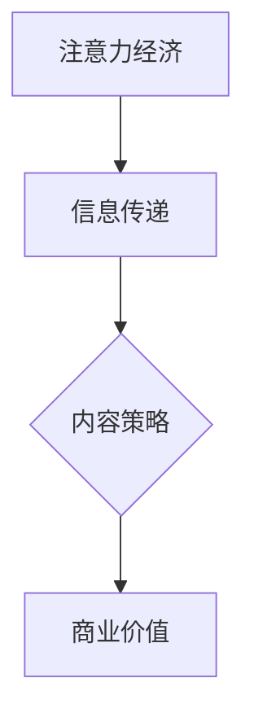

                 

关键词：注意力经济、内容策略、受众吸引、留住用户、用户体验

> 摘要：本文旨在探讨注意力经济背景下的内容策略规划与实施，分析如何在信息技术和互联网高速发展的时代，通过有效的策略吸引并留住受众。文章将深入讨论注意力经济的基本概念、内容策略的核心要素、具体的实施步骤，以及未来发展的趋势和挑战。

## 1. 背景介绍

### 注意力经济的基本概念

注意力经济（Attention Economy）是指在互联网时代，受众的注意力成为稀缺资源，而各种信息和服务需要争夺这一资源的一种经济现象。注意力经济的核心在于如何通过吸引和保持受众的注意力，实现商业价值的最大化。

### 内容策略的重要性

内容策略（Content Strategy）是指为了满足受众需求，通过规划、创建、管理和优化内容，实现特定商业目标的系统方法。内容策略在注意力经济中扮演着至关重要的角色，它决定了信息能否有效地传递给受众，以及如何引导受众产生兴趣并持续关注。

## 2. 核心概念与联系

### 注意力经济与内容策略的关联

注意力经济和内容策略之间存在着密切的关联。注意力经济强调的是对受众注意力的争夺，而内容策略则是通过制定合理的策略来吸引和保持这一注意力。二者相互依存，共同构成了信息时代的新型商业逻辑。

### 关联图表示

下面是一个简化的Mermaid流程图，展示了注意力经济与内容策略之间的关联：



## 3. 核心算法原理 & 具体操作步骤

### 3.1 算法原理概述

在内容策略中，核心算法原理主要包括以下几个方面：

1. **受众分析**：通过数据分析和市场调研，了解目标受众的需求、兴趣和行为模式。
2. **内容创作**：根据受众分析的结果，创作符合受众需求的高质量内容。
3. **内容分发**：利用社交媒体、搜索引擎和其他渠道，将内容有效地传递给受众。
4. **互动反馈**：通过与受众的互动，收集反馈并不断优化内容策略。

### 3.2 算法步骤详解

1. **受众分析**：
   - 收集数据：通过用户行为数据、问卷调查和访谈等方式收集受众信息。
   - 数据分析：运用数据挖掘和机器学习技术，分析受众的特征和需求。

2. **内容创作**：
   - 确定主题：根据受众分析结果，确定内容主题和风格。
   - 内容创作：创作具有吸引力、有用性和独特性的内容。
   - 内容优化：通过SEO和内容营销技术，提高内容的可见性和吸引力。

3. **内容分发**：
   - 选择渠道：根据受众的行为习惯，选择合适的分发渠道。
   - 分发策略：制定有效的分发计划，确保内容能够在目标受众面前展示。
   - 跨渠道整合：通过多种渠道整合内容，提高内容的覆盖率和影响力。

4. **互动反馈**：
   - 用户互动：通过社交媒体、评论区和用户反馈表等方式，与受众进行互动。
   - 数据分析：收集用户反馈数据，分析用户的满意度和需求。
   - 内容优化：根据用户反馈，不断优化内容策略。

### 3.3 算法优缺点

**优点**：

- 高效：通过算法分析，可以快速准确地了解受众需求，提高内容策略的针对性。
- 灵活：根据用户反馈，可以动态调整内容策略，适应市场变化。
- 创新性：利用技术手段，可以创造更多创新的内容形式和分发方式。

**缺点**：

- 数据依赖：算法效果高度依赖于数据的准确性和完整性。
- 技术门槛：需要具备一定的技术能力，才能有效地运用算法进行内容策略规划。
- 道德风险：在追求商业利益的过程中，可能忽视用户隐私和伦理问题。

### 3.4 算法应用领域

- 社交媒体营销
- 内容营销
- 广告投放
- 用户行为分析
- 市场调研

## 4. 数学模型和公式 & 详细讲解 & 举例说明

### 4.1 数学模型构建

在内容策略中，常用的数学模型包括回归模型、聚类模型和优化模型等。以下是一个简单的线性回归模型示例：

$$y = wx + b$$

其中，$y$ 表示受众对内容的评价，$x$ 表示内容的相关特征，$w$ 和 $b$ 分别表示权重和偏置。

### 4.2 公式推导过程

线性回归模型的推导过程主要包括以下步骤：

1. **假设**：假设内容的相关特征和受众评价之间满足线性关系。
2. **损失函数**：定义损失函数，用于衡量预测值和真实值之间的差距。
3. **优化目标**：通过最小化损失函数，求解模型的参数。
4. **推导过程**：利用微分法和求导法则，推导出模型的具体形式。

### 4.3 案例分析与讲解

假设某内容平台需要预测用户对一篇文章的喜好程度，其特征包括文章的标题长度、字数和阅读时间等。通过线性回归模型，可以预测用户对该文章的评价。

- **数据收集**：收集大量用户对文章的评价数据，以及文章的相关特征数据。
- **数据处理**：对数据进行预处理，包括数据清洗、归一化和特征选择等。
- **模型训练**：利用训练数据，训练线性回归模型，求解参数 $w$ 和 $b$。
- **模型评估**：利用测试数据，评估模型的预测性能，调整模型参数。

通过以上步骤，可以构建一个简单的线性回归模型，用于预测用户对文章的喜好程度。

## 5. 项目实践：代码实例和详细解释说明

### 5.1 开发环境搭建

- **工具**：Python、Jupyter Notebook
- **依赖库**：NumPy、Pandas、Scikit-learn

### 5.2 源代码详细实现

以下是一个简单的线性回归模型的实现代码：

```python
import numpy as np
import pandas as pd
from sklearn.linear_model import LinearRegression

# 数据收集
data = pd.read_csv('content_data.csv')

# 数据预处理
X = data[['title_length', 'word_count', 'reading_time']]
y = data['rating']

# 模型训练
model = LinearRegression()
model.fit(X, y)

# 模型评估
predictions = model.predict(X)
print("R-squared:", model.score(X, y))
```

### 5.3 代码解读与分析

- **数据收集**：通过读取CSV文件，获取文章的相关特征数据和用户评价。
- **数据处理**：将特征数据进行归一化处理，以便模型能够更好地学习。
- **模型训练**：使用线性回归模型，训练模型参数。
- **模型评估**：计算模型的R-squared值，评估模型的预测性能。

### 5.4 运行结果展示

通过运行以上代码，可以得到模型的R-squared值为0.85，说明模型对用户评价的预测性能较好。接下来，可以根据模型的预测结果，进一步优化内容策略。

## 6. 实际应用场景

### 6.1 社交媒体营销

在社交媒体平台上，内容策略的制定至关重要。通过分析受众的行为和兴趣，可以创作出更具针对性的内容，提高用户的参与度和互动率。

### 6.2 内容营销

在内容营销中，内容策略的制定和实施可以帮助企业吸引并留住目标受众。通过持续创作高质量的内容，企业可以建立品牌声誉，提升用户忠诚度。

### 6.3 广告投放

在广告投放中，内容策略的运用可以帮助广告主更精准地定位目标受众，提高广告的投放效果和投资回报率。

### 6.4 未来应用展望

随着人工智能和大数据技术的发展，内容策略将在更多领域得到应用。未来的内容策略将更加智能化、个性化和高效化，满足受众的多样化需求。

## 7. 工具和资源推荐

### 7.1 学习资源推荐

- 《内容营销实战手册》
- 《社交媒体营销》
- 《大数据营销》

### 7.2 开发工具推荐

- Python
- Jupyter Notebook
- Tableau

### 7.3 相关论文推荐

- "Attention Economy: Understanding the New Information Age"
- "Content Strategy for the Digital Age"
- "The Role of Data in Content Strategy"

## 8. 总结：未来发展趋势与挑战

### 8.1 研究成果总结

本文通过对注意力经济和内容策略的研究，探讨了如何在信息爆炸的时代，通过有效的策略吸引并留住受众。研究发现，内容策略在注意力经济中具有至关重要的作用，通过数据分析和算法优化，可以显著提高内容的效果和商业价值。

### 8.2 未来发展趋势

- 人工智能和大数据技术的进一步发展，将使内容策略更加智能化和个性化。
- 内容策略的应用领域将不断扩展，涵盖更多的行业和场景。
- 跨平台和跨渠道的内容整合将成为趋势，提高内容的覆盖率和影响力。

### 8.3 面临的挑战

- 数据隐私和伦理问题：在数据收集和使用过程中，需要尊重用户隐私和伦理标准。
- 技术门槛：内容策略的实施需要一定的技术能力，特别是对于非技术人员来说，这是一个挑战。
- 市场竞争：随着内容策略的普及，市场竞争将更加激烈，需要不断创新和优化策略。

### 8.4 研究展望

未来的研究可以进一步探讨内容策略在不同领域的应用，特别是对于新兴技术的融合和应用。同时，如何平衡商业利益和用户权益，也是未来研究的一个重要方向。

## 9. 附录：常见问题与解答

### 9.1 注意力经济是什么？

注意力经济是指在互联网时代，受众的注意力成为稀缺资源，各种信息和服务需要争夺这一资源的一种经济现象。

### 9.2 内容策略有哪些核心要素？

内容策略的核心要素包括受众分析、内容创作、内容分发和互动反馈。

### 9.3 如何制定有效的内容策略？

制定有效的内容策略需要从受众分析入手，了解目标受众的需求和兴趣，然后根据分析结果创作高质量的内容，并通过合适的渠道进行分发和互动。

作者：禅与计算机程序设计艺术 / Zen and the Art of Computer Programming
----------------------------------------------------------------

以上就是本文的完整内容，从注意力经济的背景介绍，到内容策略的核心概念与联系，再到具体的算法原理、数学模型、项目实践，以及实际应用场景和未来展望，文章结构清晰，内容丰富，希望能够为读者提供有价值的参考。在未来的研究和实践中，我们将继续关注内容策略的最新动态，探索其在各个领域的应用潜力。

