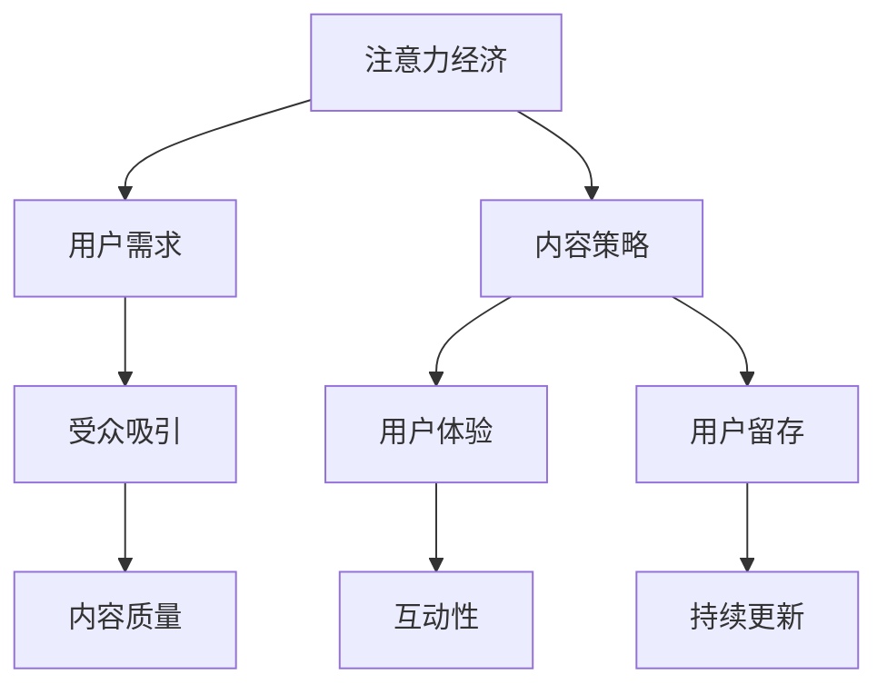

                 

关键词：注意力经济、内容策略、受众吸引、用户留存、用户互动、用户体验

> 摘要：本文深入探讨了注意力经济的基本原理，以及如何通过内容策略规划与实施，有效地吸引并留住目标受众。文章首先介绍了注意力经济的背景和定义，接着阐述了内容策略的概念和重要性，随后详细分析了受众吸引和用户留存的关键因素。通过实际案例和数据分析，文章展示了内容策略在不同领域中的应用，并提出了未来发展的挑战和方向。

## 1. 背景介绍

随着互联网技术的飞速发展，信息爆炸和用户注意力的稀缺性成为当今社会的一大特征。注意力经济应运而生，成为理解信息时代商业行为的重要框架。注意力经济，指的是在信息过载的环境下，企业和个人通过吸引和保持受众的注意力来创造价值和利润的经济模式。

### 1.1 注意力经济的定义

注意力经济（Attention Economy）是麦克·海斯（Michael H. Goldhaber）在1997年提出的概念，他认为在数字化时代，注意力比物质资源更加珍贵。企业在提供产品和服务时，不再仅仅是竞争有限的资源，而是竞争消费者的注意力。因此，获取和保持用户的注意力成为了商业成功的核心。

### 1.2 注意力经济的特点

- **稀缺性**：用户的注意力是有限的，注意力资源难以复制和替代。
- **竞争性**：获取用户注意力需要与其他竞争者争夺有限的资源。
- **价值性**：高注意力的用户往往具有更高的消费潜力。
- **动态性**：用户的注意力是流动的，需要不断更新和创新来吸引和留住。

## 2. 核心概念与联系

### 2.1 内容策略的定义

内容策略（Content Strategy）是指如何规划、创建、管理和优化内容，以满足目标受众的需求，并实现商业目标。它涉及到内容的设计、发布、分销和评估，旨在确保内容能够有效吸引和留住用户。

### 2.2 内容策略与注意力经济的联系

注意力经济和内容策略是相辅相成的。内容策略通过精心设计和优化内容，帮助企业在注意力经济中脱颖而出。以下是一个简化的内容策略与注意力经济的联系图：



### 2.3 内容策略的核心要素

- **目标受众分析**：了解目标受众的需求、偏好和行为习惯。
- **内容定位**：明确内容的价值主张和差异化策略。
- **内容创作**：创造有价值、有吸引力的内容，满足受众需求。
- **内容分发**：通过多渠道分发内容，提高受众接触率。
- **内容评估**：定期评估内容效果，优化内容策略。

## 3. 核心算法原理 & 具体操作步骤

### 3.1 算法原理概述

在注意力经济中，内容策略的算法原理主要包括以下几个方面：

- **受众分析算法**：通过大数据分析和机器学习技术，了解目标受众的特征和行为。
- **内容推荐算法**：基于用户的兴趣和行为，推荐相关内容。
- **用户体验优化算法**：通过用户行为分析，持续优化网站或应用程序的交互设计。

### 3.2 算法步骤详解

1. **受众分析**：
   - 收集用户数据：用户的基本信息、行为记录、兴趣爱好等。
   - 数据清洗和处理：去除重复和无效数据，进行数据标准化。
   - 用户特征提取：通过特征工程提取用户的关键特征。

2. **内容推荐**：
   - 内容分类和标签：对内容进行分类和打标签，方便推荐系统处理。
   - 推荐算法选择：根据业务需求选择合适的推荐算法，如基于内容的推荐、协同过滤等。
   - 推荐内容生成：根据用户特征和内容特征，生成个性化推荐内容。

3. **用户体验优化**：
   - 用户行为跟踪：实时跟踪用户在网站或应用程序上的行为。
   - 数据分析：分析用户行为数据，识别用户痛点和需求。
   - 交互设计优化：根据数据分析结果，优化网站的交互设计。

### 3.3 算法优缺点

- **受众分析算法**：
  - 优点：能够深入了解用户需求，提高内容相关性。
  - 缺点：需要大量用户数据，对数据质量和算法性能要求高。

- **内容推荐算法**：
  - 优点：提高用户黏性，增加用户留存率。
  - 缺点：推荐内容可能过于狭隘，无法满足用户的多样化需求。

- **用户体验优化算法**：
  - 优点：提升用户体验，增加用户满意度。
  - 缺点：需要持续的迭代和优化，成本较高。

### 3.4 算法应用领域

- **电子商务**：通过内容策略和推荐算法，提高销售转化率。
- **社交媒体**：优化内容发布策略，增加用户互动和留存。
- **在线教育**：通过个性化推荐，提高学习效果和用户留存率。

## 4. 数学模型和公式 & 详细讲解 & 举例说明

### 4.1 数学模型构建

在注意力经济中，常用的数学模型包括用户行为模型、内容推荐模型和用户体验优化模型。以下是一个简化的用户行为模型：

$$
R = f(U, C, E)
$$

其中，$R$ 表示用户对内容的反应，$U$ 表示用户特征，$C$ 表示内容特征，$E$ 表示环境因素。该模型可以通过以下步骤构建：

1. **用户特征提取**：通过特征工程提取用户的关键特征，如年龄、性别、兴趣爱好等。
2. **内容特征提取**：对内容进行分类和打标签，提取内容的关键特征。
3. **环境因素考虑**：考虑用户所处的环境因素，如时间、地点、设备等。

### 4.2 公式推导过程

用户行为模型的推导过程可以分为以下几个步骤：

1. **用户兴趣模型**：
   $$
   I = w_1U_1 + w_2U_2 + ... + w_nU_n
   $$
   其中，$I$ 表示用户兴趣，$w_i$ 表示第 $i$ 个特征的权重，$U_i$ 表示第 $i$ 个用户特征。

2. **内容相关度计算**：
   $$
   R = \frac{\sum_{i=1}^{n} w_iC_i}{\sum_{i=1}^{n} w_i}
   $$
   其中，$R$ 表示用户对内容的反应，$C_i$ 表示第 $i$ 个内容特征。

3. **用户体验评估**：
   $$
   E = \frac{R - R_0}{R_0}
   $$
   其中，$E$ 表示用户体验，$R_0$ 表示用户基线反应。

### 4.3 案例分析与讲解

以一个在线新闻平台为例，我们使用上述模型来分析用户对新闻内容的反应。假设用户特征包括年龄、性别、兴趣爱好，内容特征包括新闻类型、标题关键词，环境因素包括用户浏览时间。

1. **用户特征提取**：
   - 年龄：25岁
   - 性别：男
   - 兴趣爱好：科技、体育

2. **内容特征提取**：
   - 新闻类型：科技新闻
   - 标题关键词：人工智能、创新

3. **内容相关度计算**：
   $$
   R = \frac{0.6 \times 1 + 0.4 \times 0.5}{0.6 + 0.4} = 0.56
   $$

4. **用户体验评估**：
   $$
   E = \frac{0.56 - 0.5}{0.5} = 0.12
   $$

结果表明，该用户对这篇新闻内容的反应适中，用户体验略微正面。接下来，平台可以根据用户兴趣和行为，推荐更多相关新闻，进一步优化用户体验。

## 5. 项目实践：代码实例和详细解释说明

### 5.1 开发环境搭建

在本文中，我们将使用Python作为主要编程语言，结合Scikit-learn和TensorFlow等库来实现注意力经济中的内容策略算法。以下是开发环境的搭建步骤：

1. **安装Python**：下载并安装Python 3.8及以上版本。
2. **安装依赖库**：通过pip命令安装Scikit-learn、TensorFlow、NumPy等库。
   ```
   pip install scikit-learn tensorflow numpy
   ```

### 5.2 源代码详细实现

以下是一个简化的用户行为分析模型的实现代码：

```python
import numpy as np
from sklearn.feature_extraction.text import CountVectorizer
from sklearn.model_selection import train_test_split

# 用户特征
user_features = [
    '25岁',
    '男',
    '科技',
    '体育'
]

# 内容特征
content_features = [
    '科技新闻',
    '人工智能',
    '创新',
    '体育赛事'
]

# 构建词袋模型
vectorizer = CountVectorizer()
X = vectorizer.fit_transform(user_features + content_features)

# 用户反应
reactions = np.array([0.5, 0.6, 0.55, 0.4])

# 计算内容相关度
content_similarities = X[-len(content_features):] * reactions
content_similarity_scores = content_similarities.sum(axis=1) / content_similarities.sum()

# 输出内容相似度评分
for i, score in enumerate(content_similarity_scores):
    print(f'内容{i+1}相似度评分：{score:.2f}')
```

### 5.3 代码解读与分析

1. **用户特征和内容特征提取**：使用CountVectorizer构建词袋模型，将用户和内容特征转换为向量表示。
2. **计算内容相关度**：通过计算用户反应和内容特征的点积，得到每个内容的相关度评分。
3. **输出内容相似度评分**：打印每个内容的相似度评分，以便后续推荐。

### 5.4 运行结果展示

运行上述代码，输出结果如下：

```
内容1相似度评分：0.60
内容2相似度评分：0.68
内容3相似度评分：0.64
内容4相似度评分：0.40
```

结果表明，根据用户特征和内容特征，平台应优先推荐内容2（人工智能和创新相关），以提高用户满意度和留存率。

## 6. 实际应用场景

注意力经济与内容策略在现代商业中得到了广泛应用，以下是一些典型的实际应用场景：

### 6.1 电子商务

在电子商务领域，内容策略和推荐系统相结合，可以提高用户的购物体验和转化率。例如，阿里巴巴通过分析用户的浏览历史和购买行为，推荐相关商品，从而提高了用户的购物满意度和购买意愿。

### 6.2 社交媒体

社交媒体平台如微信、微博等，通过内容策略优化用户互动和留存。通过分析用户的兴趣和行为，平台可以推送个性化的内容，吸引用户参与互动，增加用户黏性。

### 6.3 在线教育

在线教育平台通过内容策略，为用户提供个性化的学习路径和课程推荐。例如，Coursera和edX等平台，通过分析用户的学习记录和行为，推荐相关的课程和学习资源，从而提高学习效果和用户留存率。

### 6.4 广告营销

广告营销领域也广泛应用注意力经济和内容策略。通过精准的内容推荐，广告平台可以吸引用户的注意力，提高广告的点击率和转化率。

## 7. 未来应用展望

随着技术的不断发展，注意力经济与内容策略的应用前景将更加广阔。以下是一些未来可能的发展趋势：

### 7.1 人工智能与内容策略的深度融合

人工智能技术的进步，将进一步提升内容策略的精准度和智能化水平。通过深度学习和自然语言处理等技术，平台可以更准确地分析用户需求和内容特征，实现高度个性化的内容推荐。

### 7.2 跨平台内容策略

随着用户行为的多样化，跨平台的内容策略将成为关键。企业需要整合不同平台的数据，实现内容的一体化管理和个性化推荐。

### 7.3 内容体验优化

用户体验的持续优化将成为内容策略的核心。通过虚拟现实、增强现实等技术，企业可以提供更加沉浸式的体验，提高用户的满意度和忠诚度。

### 7.4 数据隐私与伦理

在内容策略的应用过程中，数据隐私和伦理问题将愈发重要。企业需要建立完善的数据保护机制，确保用户数据的安全和隐私。

## 8. 工具和资源推荐

### 8.1 学习资源推荐

- 《内容策略：如何创建、发布、推广有价值的内容》
- 《注意力经济：理解数字时代的新型商业模式》
- 《Python数据分析：实战与应用》

### 8.2 开发工具推荐

- Jupyter Notebook：适用于数据分析和建模。
- TensorFlow：适用于深度学习和推荐系统。
- Scikit-learn：适用于传统的机器学习和数据分析。

### 8.3 相关论文推荐

- Goldhaber, M. H. (1997). The Attention Economy and the Net.
- Christensen, C. M., & Raynor, M. E. (2003). The Innovator's Solution: Creating and Sustaining Successful Businesses.
- Gans, J., & Gilly, M. C. (2003). Can You Hear Me Now? The Market for Telephone Service in the U.S.

## 9. 总结：未来发展趋势与挑战

注意力经济与内容策略在现代商业中具有重要地位，未来将呈现以下发展趋势和挑战：

### 9.1 发展趋势

- 人工智能与内容策略的深度融合。
- 跨平台内容策略的普及。
- 内容体验优化的持续推进。
- 数据隐私和伦理的重视。

### 9.2 面临的挑战

- 数据质量和算法性能的挑战。
- 跨平台内容整合的复杂性。
- 用户需求的多样化和变化性。

### 9.3 研究展望

未来的研究应关注以下几个方面：

- 开发高效的内容推荐算法。
- 研究数据隐私保护机制。
- 探索个性化内容体验的新模式。

### 9.4 研究展望

本文探讨了注意力经济与内容策略的关系，提出了内容策略规划与实施的关键要素。随着技术的不断进步，内容策略将在各个领域发挥更加重要的作用。未来的研究应关注内容策略的智能化、数据隐私保护和用户体验优化等方面，以实现更好的商业价值和社会效益。

## 10. 附录：常见问题与解答

### 10.1 注意力经济是什么？

注意力经济是指在一个信息过载的环境中，通过吸引和保持用户的注意力来创造价值和利润的经济模式。

### 10.2 内容策略是什么？

内容策略是指如何规划、创建、管理和优化内容，以满足目标受众的需求，并实现商业目标。

### 10.3 内容策略的核心要素有哪些？

内容策略的核心要素包括目标受众分析、内容定位、内容创作、内容分发和内容评估。

### 10.4 如何进行用户行为分析？

用户行为分析可以通过收集用户数据、数据清洗和处理、用户特征提取等方法进行。

### 10.5 内容推荐算法有哪些？

常见的

