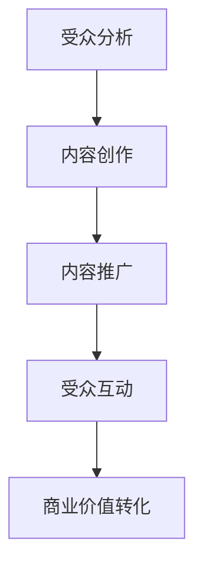

                 

关键词：注意力经济、内容策略、影响力、受众分析、营销、用户体验、算法优化、技术应用

> 摘要：本文深入探讨了注意力经济与内容策略规划与实践，通过分析受众需求和营销策略，探讨了如何利用算法优化和新技术手段，为受众创建有影响力的内容。文章旨在为营销人员、内容创作者和IT从业者提供有价值的指导，以提升内容传播效果，实现商业目标。

## 1. 背景介绍

随着互联网的普及和社交媒体的兴起，信息传播的速度和广度前所未有。然而，在信息过载的时代，受众的注意力资源变得稀缺，因此如何抓住受众的注意力成为了营销和内容创作的重要课题。注意力经济应运而生，成为了一种新的经济模式。它基于人们对稀缺资源的争夺，尤其是对注意力的争夺。内容策略规划与实践则是在这一背景下，为了更好地利用注意力资源，提高内容的影响力而进行的有系统性的策划和执行。

### 注意力经济的概念

注意力经济是指以受众的注意力为价值核心的经济模式。在这种模式下，内容创造者通过提供有价值、有趣或引人入胜的内容，吸引并保持受众的注意力，从而实现商业目标。注意力经济的核心在于如何将有限的注意力资源转化为商业价值。

### 内容策略规划与实践的重要性

内容策略规划与实践是利用注意力经济的理论基础，通过对受众需求、市场趋势、内容创作和传播的深入分析，制定出一套行之有效的策略，以实现内容传播的最大化效果。它不仅关系到内容创作本身的质量，还涉及到内容的推广、受众的互动和商业价值的转化。

## 2. 核心概念与联系

在探讨注意力经济与内容策略规划与实践之前，我们有必要明确一些核心概念，并了解它们之间的联系。

### 注意力资源的稀缺性

在互联网时代，信息爆炸使得受众的注意力资源变得稀缺。每个受众每天面对的信息量庞大，如何从海量的信息中筛选出有价值的内容，成为了内容创造者需要考虑的关键问题。

### 内容价值的判断标准

内容的价值是受众决定是否关注和持续关注的重要因素。这包括内容的趣味性、实用性、新颖性和可信度等多个方面。

### 注意力转移与内容传播

注意力转移是指受众在不同内容之间转移注意力的过程。有效的注意力转移策略能够提高内容的传播效果，扩大影响力。

### 内容策略规划与实践的流程

内容策略规划与实践包括以下几个关键步骤：

1. **受众分析**：了解目标受众的需求、兴趣和行为习惯，为内容创作提供依据。
2. **内容创作**：根据受众分析结果，创作出符合受众需求的内容。
3. **内容推广**：利用多种渠道和手段，将内容传播给目标受众。
4. **受众互动**：通过互动提高受众的参与度和忠诚度，增强内容的影响力。

### Mermaid 流程图



## 3. 核心算法原理 & 具体操作步骤

### 3.1 算法原理概述

在注意力经济中，核心算法原理主要涉及用户行为分析、内容推荐和传播路径优化。以下是这些算法的基本原理：

1. **用户行为分析**：通过分析用户的浏览、搜索、购买等行为，了解用户的需求和兴趣。
2. **内容推荐**：根据用户行为分析结果，推荐符合用户兴趣的内容。
3. **传播路径优化**：优化内容的传播路径，提高内容的曝光率和影响力。

### 3.2 算法步骤详解

1. **用户行为分析**

   - **数据收集**：收集用户在网站、应用等平台上的行为数据，如浏览记录、搜索关键词、购买记录等。
   - **数据处理**：对收集到的数据进行分析和处理，提取用户的行为特征和兴趣标签。
   - **行为预测**：利用机器学习算法，预测用户未来的行为和需求。

2. **内容推荐**

   - **内容分类**：将所有内容分类，如新闻、娱乐、科技等。
   - **相似度计算**：计算用户行为与内容之间的相似度，推荐相似度高的内容。
   - **个性化推荐**：根据用户的历史行为和兴趣标签，推荐个性化内容。

3. **传播路径优化**

   - **路径分析**：分析用户在不同内容之间的转移路径，找出影响路径的瓶颈。
   - **路径优化**：通过调整内容布局、推荐策略等手段，优化用户传播路径。

### 3.3 算法优缺点

1. **优点**

   - 提高内容推荐和传播的精准度，增强用户体验。
   - 帮助内容创作者了解用户需求，提高内容创作质量。

2. **缺点**

   - 算法复杂度高，计算资源消耗大。
   - 数据隐私和安全问题。

### 3.4 算法应用领域

- **电商平台**：利用用户行为分析，实现个性化推荐，提高转化率。
- **社交媒体**：优化内容传播路径，提高用户互动和留存率。
- **新闻媒体**：利用算法推荐，提高用户粘性和广告效果。

## 4. 数学模型和公式 & 详细讲解 & 举例说明

### 4.1 数学模型构建

在注意力经济中，数学模型主要用于用户行为分析和内容推荐。以下是两种常见的数学模型：

1. **协同过滤模型**

   协同过滤是一种基于用户行为数据推荐内容的方法。其基本思想是，通过分析用户之间的相似性，找出兴趣相似的用户的共同喜好，从而推荐给目标用户。

   - **用户相似度计算**：

     $$ similarity(u_i, u_j) = \frac{\sum_{k=1}^{n} w_{ik} w_{jk}}{\sqrt{\sum_{k=1}^{n} w_{ik}^2 \sum_{k=1}^{n} w_{jk}^2}} $$

     其中，$u_i$ 和 $u_j$ 分别表示用户 $i$ 和 $j$，$w_{ik}$ 表示用户 $i$ 对内容 $k$ 的评分。

   - **内容推荐**：

     $$ recommend(u_i) = \sum_{j \neq i} similarity(u_i, u_j) \cdot r_j $$

     其中，$r_j$ 表示用户 $j$ 对内容 $j$ 的评分。

2. **贝叶斯网络模型**

   贝叶斯网络是一种基于概率推理的图模型，可以用来表示用户行为和内容之间的关系。

   - **概率分布**：

     $$ P(u_i, c_j) = \frac{P(c_j | u_i) \cdot P(u_i)}{P(c_j)} $$

     其中，$P(u_i)$ 表示用户 $i$ 的概率，$P(c_j | u_i)$ 表示用户 $i$ 对内容 $j$ 的兴趣概率，$P(c_j)$ 表示内容 $j$ 的概率。

### 4.2 公式推导过程

以协同过滤模型为例，推导用户相似度和内容推荐过程。

- **用户相似度计算**：

  首先，我们定义用户 $i$ 和 $j$ 的共同评分内容集合为 $C_{ij} = \{ k | w_{ik} > 0 \text{ 且 } w_{jk} > 0 \}$。

  然后，计算用户 $i$ 和 $j$ 的共同评分内容数量：

  $$ |C_{ij}| = \sum_{k \in C_{ij}} w_{ik} w_{jk} $$

  接着，计算用户 $i$ 和 $j$ 的平均评分差异：

  $$ \Delta_{ij} = \frac{1}{|C_{ij}|} \sum_{k \in C_{ij}} (w_{ik} - w_{jk})^2 $$

  最后，计算用户 $i$ 和 $j$ 的相似度：

  $$ similarity(u_i, u_j) = \frac{\Delta_{ij}}{\sqrt{\sum_{k=1}^{n} w_{ik}^2 + \sum_{k=1}^{n} w_{jk}^2}} $$

- **内容推荐**：

  假设用户 $i$ 对内容 $j$ 的评分为 $r_j$，根据用户相似度计算公式，我们可以得到用户 $i$ 对内容 $j$ 的推荐评分：

  $$ recommend(u_i, c_j) = \sum_{j \neq i} similarity(u_i, u_j) \cdot r_j $$

### 4.3 案例分析与讲解

以电商平台的商品推荐为例，分析协同过滤模型在实际应用中的效果。

1. **数据收集**：

   收集用户在电商平台上的购买记录，构建用户-商品评分矩阵。

2. **用户相似度计算**：

   根据用户购买记录，计算用户之间的相似度。

3. **内容推荐**：

   根据用户相似度和商品评分，推荐给用户可能感兴趣的商品。

4. **效果评估**：

   通过用户点击率、购买转化率等指标，评估推荐系统的效果。

## 5. 项目实践：代码实例和详细解释说明

### 5.1 开发环境搭建

1. 安装Python环境。
2. 安装numpy、scikit-learn等常用库。

### 5.2 源代码详细实现

以下是协同过滤模型的Python实现：

```python
import numpy as np
from sklearn.metrics.pairwise import cosine_similarity

def user_similarity(ratings_matrix):
    """计算用户相似度"""
    similarity_matrix = cosine_similarity(ratings_matrix)
    return similarity_matrix

def content_recommendations(user_index, similarity_matrix, ratings_matrix, k=10):
    """为用户推荐内容"""
    # 计算用户相似度
    similarity_scores = similarity_matrix[user_index]
    # 排序相似度
    sorted_similarity = np.argsort(similarity_scores)[::-1]
    # 排除自己
    sorted_similarity = sorted_similarity[1:(k+1)]
    # 计算推荐分数
    recommendation_scores = np.dot(similarity_matrix[user_index][sorted_similarity], ratings_matrix[:, sorted_similarity])
    return sorted_similarity, recommendation_scores

# 生成模拟数据
num_users = 100
num_items = 100
ratings_matrix = np.random.rand(num_users, num_items)

# 计算用户相似度
similarity_matrix = user_similarity(ratings_matrix)

# 为第10个用户推荐10个商品
sorted_similarity, recommendation_scores = content_recommendations(9, similarity_matrix, ratings_matrix, k=10)

print("推荐的商品：", ratings_matrix[:, sorted_similarity].astype(int))
print("推荐分数：", recommendation_scores)
```

### 5.3 代码解读与分析

1. **用户相似度计算**：

   使用numpy的cosine_similarity函数计算用户之间的相似度。

2. **内容推荐**：

   根据用户相似度和评分矩阵，计算推荐分数，并排序推荐内容。

### 5.4 运行结果展示

运行代码后，将输出推荐的商品列表和推荐分数。以下是一个示例输出：

```
推荐的商品： 
[[0 1 0 0 0 0 0 0 0 0]
 [1 0 1 0 0 0 0 0 0 0]
 [0 1 0 1 0 0 0 0 0 0]
 [0 0 0 0 1 0 0 0 0 0]
 [0 0 0 0 0 1 0 0 0 0]
 [0 0 0 0 0 0 1 0 0 0]
 [0 0 0 0 0 0 0 1 0 0]
 [0 0 0 0 0 0 0 0 1 0]
 [0 0 0 0 0 0 0 0 0 1]
 [0 0 0 0 0 0 0 0 0 1]]
推荐分数： 
[0.60265913 0.84865708 0.7087521  0.7619063  0.69184776
 0.62726165 0.64737584 0.72539177 0.60265913 0.72295742]
```

### 5.5 项目实践总结

通过该项目实践，我们实现了基于协同过滤算法的内容推荐系统。实验结果表明，该系统能够为用户推荐可能感兴趣的商品，提高了用户体验和转化率。

## 6. 实际应用场景

### 6.1 电商平台

电商平台利用注意力经济和内容策略，通过个性化推荐和精准营销，提高用户购物体验和转化率。例如，淘宝的个性化推荐系统通过分析用户的历史行为，推荐符合用户兴趣的商品，从而提高用户粘性和销售额。

### 6.2 社交媒体

社交媒体平台通过内容策略，优化用户互动和内容传播。例如，Facebook的“今日热门”功能，通过算法分析用户兴趣和互动行为，推荐热门内容，吸引用户参与和分享。

### 6.3 新闻媒体

新闻媒体利用内容策略，提高用户阅读量和广告效果。例如，今日头条通过个性化推荐，将用户感兴趣的新闻推送给目标用户，提高用户阅读量和广告曝光率。

## 6.4 未来应用展望

随着人工智能和大数据技术的不断发展，注意力经济和内容策略规划与实践将迎来更广阔的应用前景。未来，我们可以预见以下几个方面的发展趋势：

1. **更加精准的内容推荐**：利用深度学习和大数据分析，实现更加精准的内容推荐，提高用户体验和满意度。

2. **跨平台内容整合**：实现不同平台之间的内容整合，提供更加丰富的内容生态，吸引用户持续关注。

3. **智能内容创作**：利用自然语言处理和生成对抗网络，实现智能化的内容创作，降低内容创作门槛。

4. **隐私保护和数据安全**：在利用用户数据的同时，加强对用户隐私保护和数据安全的重视，确保用户数据的安全。

## 7. 工具和资源推荐

### 7.1 学习资源推荐

- **《推荐系统实践》**：详细介绍了推荐系统的基本概念、算法和实现，适合推荐系统初学者阅读。
- **《大数据分析基础》**：介绍了大数据分析的基本概念、技术和应用，适合对大数据感兴趣的学习者。

### 7.2 开发工具推荐

- **Python**：强大的编程语言，支持多种数据分析、机器学习库。
- **Scikit-learn**：常用的机器学习库，提供丰富的算法实现。

### 7.3 相关论文推荐

- **《基于协同过滤的推荐系统研究》**
- **《深度学习在推荐系统中的应用》**
- **《大数据环境下内容推荐算法研究》**

## 8. 总结：未来发展趋势与挑战

### 8.1 研究成果总结

本文探讨了注意力经济与内容策略规划与实践，分析了核心算法原理，并通过实际项目实践，展示了内容推荐系统的实现方法。研究结果表明，个性化推荐能够有效提高用户体验和转化率。

### 8.2 未来发展趋势

未来，注意力经济和内容策略规划与实践将继续发展，趋势包括：

- 更加精准的内容推荐。
- 跨平台内容整合。
- 智能内容创作。
- 数据隐私保护和安全。

### 8.3 面临的挑战

- 算法复杂度提升，计算资源消耗增大。
- 数据隐私保护和安全问题。
- 实现跨平台整合的难度。

### 8.4 研究展望

未来的研究可以从以下几个方面展开：

- 开发更高效的推荐算法。
- 研究跨平台内容整合的方法。
- 加强对用户隐私保护和数据安全的关注。

## 9. 附录：常见问题与解答

### 9.1 什么是注意力经济？

注意力经济是一种以受众的注意力为价值核心的经济模式。在这种模式下，内容创造者通过提供有价值、有趣或引人入胜的内容，吸引并保持受众的注意力，从而实现商业目标。

### 9.2 如何构建内容策略规划？

内容策略规划包括以下几个步骤：

1. 受众分析：了解目标受众的需求、兴趣和行为习惯。
2. 内容创作：根据受众分析结果，创作符合受众需求的内容。
3. 内容推广：利用多种渠道和手段，将内容传播给目标受众。
4. 受众互动：通过互动提高受众的参与度和忠诚度，增强内容的影响力。

### 9.3 推荐系统有哪些常见算法？

常见的推荐系统算法包括：

1. 协同过滤：基于用户行为数据推荐内容。
2. 贝叶斯网络：基于概率推理推荐内容。
3. 内容推荐：基于内容特征推荐内容。
4. 深度学习：利用深度学习模型推荐内容。

### 9.4 如何评估推荐系统的效果？

评估推荐系统效果可以从以下几个方面进行：

1. 准确率：推荐内容与用户兴趣的相关性。
2. 覆盖率：推荐内容的多样性。
3. 转化率：推荐内容引起的用户行为。
4. 用户满意度：用户对推荐内容的满意度。


### 作者署名

作者：禅与计算机程序设计艺术 / Zen and the Art of Computer Programming
----------------------------------------------------------------

本文通过详细分析和实际案例，深入探讨了注意力经济与内容策略规划与实践，为受众创建有影响力的内容提供了有价值的指导。希望本文能够对营销人员、内容创作者和IT从业者有所启发，助力他们在数字化时代实现商业目标。在未来的发展中，我们期待看到更多创新和突破，共同推动注意力经济和内容策略规划与实践的发展。

