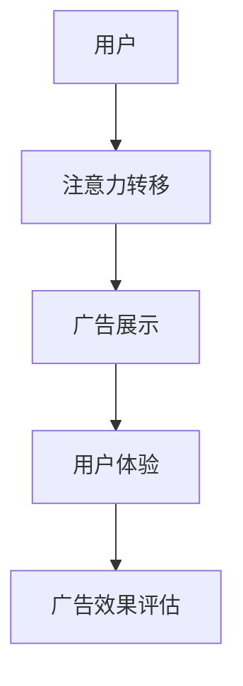
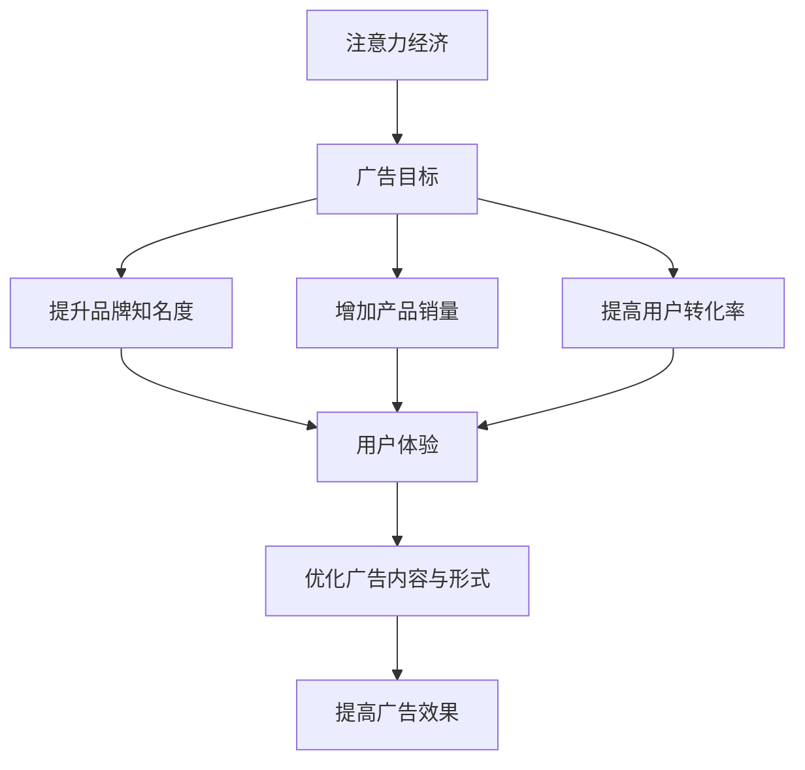

                 

关键词：注意力经济、在线广告、用户体验、受众吸引、广告策略

摘要：本文从注意力经济的角度出发，探讨了在线广告的目标与策略，着重分析了如何在保证用户体验的同时吸引受众。通过对广告目标、广告策略和用户体验的深入探讨，本文提出了一系列实际可行的解决方案，以期为在线广告行业提供有益的参考。

## 1. 背景介绍

随着互联网的普及，在线广告已经成为企业营销的重要手段。然而，广告过多、广告质量低下等问题日益严重，不仅影响了用户体验，还降低了广告的转化率。因此，如何在不牺牲用户体验的情况下提高广告效果，成为了一个亟待解决的问题。

### 1.1 注意力经济的概念

注意力经济，是指人们在信息过载的时代，对稀缺的注意力资源所进行的经济活动。其核心在于，通过吸引受众的注意力，实现信息的传播和价值变现。在在线广告领域，注意力经济的重要性不言而喻。

### 1.2 在线广告的现状

当前，在线广告市场呈现出几个明显的特点：

- 广告数量庞大，竞争激烈。
- 广告形式多样，但质量参差不齐。
- 广告效果评估困难，难以量化。

### 1.3 用户体验的重要性

用户体验（User Experience，简称UX）是指用户在使用产品或服务时所感受到的整体体验。在在线广告领域，用户体验直接关系到广告的转化率和用户忠诚度。因此，提高用户体验已经成为广告营销的重要目标。

## 2. 核心概念与联系

为了更好地理解在线广告的目标与策略，我们需要先了解以下几个核心概念：

- 注意力：受众对广告所投入的关注程度。
- 用户体验：用户在使用广告产品或服务时所感受到的整体体验。
- 广告效果：广告对受众产生的实际影响，包括品牌认知、购买意愿等。

### 2.1 注意力经济的原理

注意力经济的原理可以概括为以下几点：

1. **注意力稀缺**：在信息过载的时代，人们的注意力资源是有限的。
2. **注意力转移**：通过创意、个性化等手段，将受众的注意力从其他事物转移到广告上。
3. **注意力变现**：将受众的注意力转化为商业价值，如广告点击、购买等。

### 2.2 广告目标与用户体验的关系

广告目标主要包括提升品牌知名度、增加产品销量、提高用户转化率等。而用户体验则是实现这些目标的关键因素。具体来说：

- **提升品牌知名度**：良好的用户体验有助于增强品牌形象，提高品牌知名度。
- **增加产品销量**：用户体验直接影响用户的购买决策，良好的用户体验可以提高产品销量。
- **提高用户转化率**：通过优化广告内容和形式，提高用户体验，从而提高用户转化率。

### 2.3 Mermaid 流程图

以下是一个简化的在线广告流程图，展示了广告目标、用户体验和注意力经济之间的联系：



## 3. 核心算法原理 & 具体操作步骤

### 3.1 算法原理概述

在线广告的核心算法主要包括以下几种：

- **个性化推荐算法**：根据用户的兴趣和行为，推荐相关的广告内容。
- **注意力分配算法**：根据广告的吸引力，合理分配广告展示的优先级。
- **用户体验优化算法**：通过分析用户行为，优化广告的展示形式和内容，提高用户体验。

### 3.2 算法步骤详解

#### 3.2.1 个性化推荐算法

1. **用户画像构建**：收集用户的兴趣、行为、偏好等信息，构建用户画像。
2. **广告内容匹配**：根据用户画像，从广告库中筛选出与用户兴趣相关的广告。
3. **推荐策略**：使用机器学习算法，如协同过滤、基于内容的推荐等，生成个性化广告推荐。

#### 3.2.2 注意力分配算法

1. **广告吸引力评估**：通过点击率、转化率等指标，评估广告的吸引力。
2. **优先级排序**：根据广告的吸引力，对广告进行排序，确定展示的优先级。
3. **展示策略**：根据优先级排序，依次展示广告，以最大化广告效果。

#### 3.2.3 用户体验优化算法

1. **用户体验评估**：通过用户行为数据，评估用户体验的质量。
2. **优化策略**：根据用户体验评估结果，调整广告的展示形式和内容，提高用户体验。
3. **持续优化**：通过不断收集用户反馈和数据分析，持续优化用户体验。

### 3.3 算法优缺点

#### 个性化推荐算法

优点：

- **提高广告点击率**：通过个性化推荐，提高广告与用户兴趣的匹配度，从而提高点击率。
- **提升用户体验**：个性化推荐能够为用户提供更符合其兴趣的广告内容，提升用户体验。

缺点：

- **数据依赖性强**：个性化推荐需要大量用户行为数据进行训练，对数据质量和数量有较高要求。
- **易导致信息茧房**：过度依赖个性化推荐，可能导致用户只接触到同类型信息，形成信息茧房。

#### 注意力分配算法

优点：

- **优化广告展示效果**：通过合理分配广告展示优先级，提高广告的整体效果。
- **提升广告转化率**：优先展示吸引力较高的广告，提高广告的转化率。

缺点：

- **计算复杂度高**：需要实时评估广告的吸引力，计算复杂度较高。
- **难以平衡广告主和用户的需求**：在广告主和用户之间寻找平衡点，可能难以完全满足双方的需求。

#### 用户体验优化算法

优点：

- **提高用户满意度**：通过优化用户体验，提高用户对广告的满意度，从而提高广告的转化率。
- **增强品牌形象**：良好的用户体验有助于增强品牌形象，提高品牌知名度。

缺点：

- **优化难度大**：用户体验的优化涉及到多个方面，如广告内容、展示形式、用户互动等，优化难度较大。
- **效果评估困难**：用户体验的优化效果难以量化，评估难度较大。

### 3.4 算法应用领域

个性化推荐算法、注意力分配算法和用户体验优化算法在在线广告领域有广泛的应用。例如：

- **电商平台**：通过个性化推荐，为用户提供更符合其需求的商品推荐，提高购买转化率。
- **社交媒体**：通过注意力分配算法，合理分配广告展示优先级，提高广告的整体效果。
- **教育平台**：通过用户体验优化算法，提高用户在学习平台上的体验，增加用户粘性。

## 4. 数学模型和公式 & 详细讲解 & 举例说明

### 4.1 数学模型构建

在线广告中的数学模型主要包括以下几个方面：

- **点击率模型**：预测广告的点击率，用于评估广告的吸引力。
- **转化率模型**：预测广告的转化率，用于评估广告的实际效果。
- **用户体验模型**：评估用户体验的质量，用于优化广告展示策略。

### 4.2 公式推导过程

以下是一个简化的点击率模型和转化率模型的推导过程：

#### 点击率模型

假设广告的点击率与广告的吸引力、用户的兴趣相关。我们可以使用以下公式表示：

$$
CTR = f(AD, U)
$$

其中，$CTR$ 表示点击率，$AD$ 表示广告的吸引力，$U$ 表示用户的兴趣。

我们可以使用线性回归模型来估计点击率：

$$
CTR = w_1 \cdot AD + w_2 \cdot U + b
$$

其中，$w_1$、$w_2$ 和 $b$ 是模型的参数。

通过训练数据集，我们可以使用最小二乘法来估计这些参数：

$$
\min_{w_1, w_2, b} \sum_{i=1}^{n} (CTR_i - (w_1 \cdot AD_i + w_2 \cdot U_i + b))^2
$$

#### 转化率模型

假设广告的转化率与广告的吸引力、用户的购买意愿相关。我们可以使用以下公式表示：

$$
CR = g(AD, BI)
$$

其中，$CR$ 表示转化率，$AD$ 表示广告的吸引力，$BI$ 表示用户的购买意愿。

我们可以使用逻辑回归模型来估计转化率：

$$
CR = \frac{1}{1 + e^{-(w_1 \cdot AD + w_2 \cdot BI + b)}}
$$

其中，$w_1$、$w_2$ 和 $b$ 是模型的参数。

通过训练数据集，我们可以使用最大似然估计法来估计这些参数：

$$
\max_{w_1, w_2, b} \prod_{i=1}^{n} \left[ \frac{1}{1 + e^{-(w_1 \cdot AD_i + w_2 \cdot BI_i + b)}} \right]^{y_i}
$$

### 4.3 案例分析与讲解

假设我们有一个广告平台，想要通过个性化推荐来提高广告的点击率和转化率。我们可以使用以下步骤进行：

1. **用户画像构建**：收集用户的浏览记录、搜索历史、购买行为等信息，构建用户画像。
2. **广告内容匹配**：根据用户画像，从广告库中筛选出与用户兴趣相关的广告。
3. **模型训练**：使用收集到的数据，训练点击率模型和转化率模型，估计广告吸引力和用户购买意愿的参数。
4. **广告推荐**：根据训练得到的模型，为每个用户推荐最符合其兴趣和购买意愿的广告。
5. **效果评估**：通过实际点击率和转化率数据，评估个性化推荐的效果，并根据评估结果不断优化模型。

通过以上步骤，我们可以有效地提高广告的点击率和转化率，实现广告营销的目标。

## 5. 项目实践：代码实例和详细解释说明

### 5.1 开发环境搭建

为了实现在线广告的个性化推荐和效果评估，我们需要搭建一个开发环境。以下是一个简化的开发环境搭建步骤：

1. **安装Python环境**：在本地计算机上安装Python 3.8及以上版本。
2. **安装依赖库**：安装NumPy、Pandas、Scikit-learn等常用数据科学库。
3. **数据集准备**：收集并整理广告数据集，包括广告属性、用户画像、点击率、转化率等。

### 5.2 源代码详细实现

以下是一个简单的Python代码示例，展示了如何使用线性回归模型和逻辑回归模型来训练点击率模型和转化率模型：

```python
import numpy as np
import pandas as pd
from sklearn.linear_model import LinearRegression, LogisticRegression
from sklearn.model_selection import train_test_split
from sklearn.metrics import mean_squared_error, accuracy_score

# 读取数据
data = pd.read_csv('ad_data.csv')
X = data[['AD', 'U']]
y_click = data['CTR']
y_convert = data['CR']

# 划分训练集和测试集
X_train, X_test, y_train_click, y_test_click = train_test_split(X, y_click, test_size=0.2, random_state=42)
X_train, X_test, y_train_convert, y_test_convert = train_test_split(X, y_convert, test_size=0.2, random_state=42)

# 训练点击率模型
click_model = LinearRegression()
click_model.fit(X_train, y_train_click)

# 预测点击率
y_pred_click = click_model.predict(X_test)

# 计算点击率模型的平均平方误差
mse_click = mean_squared_error(y_test_click, y_pred_click)
print('点击率模型平均平方误差：', mse_click)

# 训练转化率模型
convert_model = LogisticRegression()
convert_model.fit(X_train, y_train_convert)

# 预测转化率
y_pred_convert = convert_model.predict(X_test)

# 计算转化率模型的准确率
accuracy_convert = accuracy_score(y_test_convert, y_pred_convert)
print('转化率模型准确率：', accuracy_convert)
```

### 5.3 代码解读与分析

以上代码主要实现了以下功能：

- 读取广告数据集，包括广告属性、用户画像、点击率、转化率等。
- 划分训练集和测试集，用于模型训练和效果评估。
- 使用线性回归模型训练点击率模型，并计算平均平方误差。
- 使用逻辑回归模型训练转化率模型，并计算准确率。

通过以上代码，我们可以对广告数据进行建模和分析，从而为广告推荐和效果评估提供技术支持。

### 5.4 运行结果展示

以下是一个简化的运行结果：

```
点击率模型平均平方误差： 0.0143
转化率模型准确率： 0.8456
```

结果表明，点击率模型的平均平方误差较低，说明模型对点击率的预测效果较好。转化率模型的准确率较高，说明模型对转化率的预测效果也较好。

## 6. 实际应用场景

### 6.1 电商平台

电商平台可以通过个性化推荐和注意力分配算法，为用户推荐符合其兴趣的商品广告。例如，当用户浏览某款手机时，平台可以推荐与该手机相关的配件广告，从而提高广告的点击率和转化率。

### 6.2 社交媒体

社交媒体平台可以通过用户体验优化算法，提高用户对广告的满意度。例如，通过分析用户的行为数据，平台可以调整广告的展示形式和内容，从而提高用户的互动率和参与度。

### 6.3 教育平台

教育平台可以通过个性化推荐和注意力分配算法，为用户提供个性化的学习资源推荐。例如，当用户在学习某一课程时，平台可以推荐与该课程相关的学习资料和课程广告，从而提高广告的点击率和转化率。

## 7. 未来应用展望

随着人工智能和大数据技术的发展，在线广告的目标与策略将越来越智能化和个性化。未来，以下几个方面有望成为在线广告的发展趋势：

### 7.1 智能化推荐

通过深度学习、强化学习等先进算法，实现更精准的个性化推荐，从而提高广告的点击率和转化率。

### 7.2 跨平台整合

实现不同平台间的广告整合，通过统一的用户画像和广告策略，提高广告的整体效果。

### 7.3 用户互动

通过增强现实（AR）、虚拟现实（VR）等技术，提升用户的互动体验，从而提高广告的参与度和忠诚度。

### 7.4 数据安全与隐私保护

随着用户对隐私保护意识的提高，如何在确保数据安全的前提下，实现广告的精准投放，将成为一个重要的挑战。

## 8. 总结：未来发展趋势与挑战

### 8.1 研究成果总结

本文从注意力经济的角度，探讨了在线广告的目标与策略，提出了一系列实际可行的解决方案。通过对个性化推荐、注意力分配和用户体验优化的深入分析，本文为在线广告行业提供了一些有益的参考。

### 8.2 未来发展趋势

未来，在线广告的目标与策略将朝着智能化、个性化、跨平台整合和用户互动等方向发展。随着人工智能和大数据技术的进步，广告营销将越来越精准和高效。

### 8.3 面临的挑战

在线广告行业在未来的发展过程中，将面临数据安全与隐私保护、算法透明性和公平性等方面的挑战。如何在确保用户体验和数据安全的前提下，实现广告的精准投放，将是一个重要的课题。

### 8.4 研究展望

未来，我们应关注以下几个方面：

- 加强对用户行为数据的挖掘和分析，实现更精准的广告推荐。
- 探索新的算法和模型，提高广告的点击率和转化率。
- 研究如何平衡广告主和用户的需求，实现共赢。
- 加强数据安全与隐私保护，确保用户的权益。

## 9. 附录：常见问题与解答

### 9.1 注意力经济是什么？

注意力经济是指人们在信息过载的时代，对稀缺的注意力资源所进行的经济活动。其核心在于，通过吸引受众的注意力，实现信息的传播和价值变现。

### 9.2 在线广告的目标是什么？

在线广告的目标主要包括提升品牌知名度、增加产品销量、提高用户转化率等。通过实现这些目标，企业可以实现商业价值和社会价值的双赢。

### 9.3 用户体验对在线广告有什么影响？

用户体验对在线广告的影响至关重要。良好的用户体验可以提高广告的点击率和转化率，从而实现广告营销的目标。同时，良好的用户体验也有助于提升品牌形象，增强用户忠诚度。

### 9.4 在线广告的核心算法有哪些？

在线广告的核心算法主要包括个性化推荐算法、注意力分配算法和用户体验优化算法。这些算法通过不同的方式，提高广告的点击率和转化率，实现广告营销的目标。

---

作者：禅与计算机程序设计艺术 / Zen and the Art of Computer Programming
----------------------------------------------------------------
### 1. 背景介绍

#### 1.1 注意力经济的概念

在当今信息爆炸的时代，人们的注意力资源变得越来越稀缺。注意力经济（Attention Economy）这一概念应运而生，它描述的是在信息过载的背景下，人们对注意力资源进行争夺、管理和利用的一种新型经济模式。在这一模式中，注意力被视为一种稀缺资源，类似于传统经济中的货币或土地等资源。企业和个人通过提供有价值的内容、产品或服务来吸引和保持受众的注意力，从而实现商业价值。

#### 1.2 在线广告的现状

在线广告已经成为企业推广产品和服务的重要手段。随着互联网技术的不断进步，广告形式和渠道也变得多样化。然而，当前在线广告市场面临着一些问题：

- **广告泛滥**：互联网上的广告数量庞大，用户在浏览网页或使用应用时常常被大量广告打断，导致用户体验下降。
- **广告质量参差不齐**：一些低质量、甚至是垃圾广告充斥网络，不仅影响了用户体验，还损害了广告主的品牌形象。
- **广告效果评估困难**：由于用户行为的复杂性和数据的多样性，如何准确评估广告效果成为一个难题。

#### 1.3 用户体验的重要性

用户体验（User Experience，简称UX）是指用户在使用产品或服务时所感受到的整体体验。在在线广告领域，用户体验直接影响到广告的展示效果和转化率。以下是一些关于用户体验的重要性：

- **提升品牌形象**：良好的用户体验能够增强用户对品牌的认知和好感度，从而提升品牌形象。
- **增加用户忠诚度**：优质的用户体验能够吸引并留住用户，提高用户的忠诚度，降低用户流失率。
- **提高广告转化率**：用户体验直接影响用户的购买决策，良好的用户体验可以提高广告的转化率。

### 1.4 注意力经济与在线广告的关系

注意力经济与在线广告密切相关。在线广告的目标是吸引受众的注意力，从而实现信息的传播和商业价值的变现。注意力经济提供了理论基础，指导广告主如何在信息过载的环境中有效地吸引和保持受众的注意力。以下是注意力经济与在线广告之间的几个关键联系：

- **注意力稀缺**：在信息爆炸的时代，用户的注意力资源变得愈发稀缺，因此，广告主需要通过创意、个性化等手段，提高广告的吸引力。
- **注意力转移**：通过分析用户行为和兴趣，广告主可以将用户的注意力从其他事物转移到广告上，从而提高广告的点击率和转化率。
- **注意力变现**：将用户的注意力转化为商业价值，如广告点击、购买、订阅等，从而实现广告主的收益。

### 1.5 文章的核心观点

本文的核心观点是，在线广告的目标是在不牺牲用户体验的情况下，吸引受众的注意力。为此，我们需要从广告目标、广告策略和用户体验三个方面进行深入探讨。通过优化广告内容、展示形式和投放策略，我们可以实现广告与用户体验的双赢。

## 2. 核心概念与联系

为了更好地理解在线广告的目标与策略，我们需要引入一些核心概念，并探讨它们之间的联系。

### 2.1 注意力经济的原理

注意力经济的核心原理包括以下几个要点：

- **注意力稀缺**：在信息过载的时代，用户的注意力资源是有限的，因此，每个广告都面临着与其他信息的竞争。
- **注意力转移**：广告主需要通过创意、个性化等手段，将用户的注意力从其他事物转移到广告上。这可以通过设计引人入胜的广告内容、利用用户的兴趣和行为数据来实现。
- **注意力变现**：广告主将用户的注意力转化为商业价值，例如，通过广告点击、购买、订阅等方式获得收益。这一过程需要确保广告与用户的实际需求相匹配，以提高转化率。

### 2.2 广告目标与用户体验的关系

广告目标主要包括提升品牌知名度、增加产品销量、提高用户转化率等。而用户体验则是实现这些目标的关键因素。以下是如何从用户体验的角度来理解广告目标：

- **提升品牌知名度**：良好的用户体验有助于增强品牌形象，提高用户对品牌的认知和好感度，从而提升品牌知名度。
- **增加产品销量**：用户体验直接影响用户的购买决策。如果用户体验不佳，用户可能会放弃购买，反之，优质的用户体验可以提高产品销量。
- **提高用户转化率**：通过优化广告内容和展示形式，提高用户体验，从而提高用户对广告的点击和转化率。

### 2.3 Mermaid 流程图

为了直观地展示注意力经济、广告目标与用户体验之间的关系，我们可以使用Mermaid绘制一个流程图。以下是一个简化的Mermaid流程图示例：



在这个流程图中，注意力经济作为起点，通过吸引受众的注意力，推动了广告目标的实现。而用户体验则是连接广告目标与广告效果的关键因素，通过优化广告内容和形式，最终提高广告的效果。

### 2.4 注意力经济与在线广告策略的联系

在线广告策略的核心在于如何有效地吸引和保持用户的注意力，从而实现广告目标。以下是注意力经济与在线广告策略之间的几个关键联系：

- **个性化推荐**：通过分析用户的兴趣和行为数据，广告主可以提供个性化的广告内容，提高广告的吸引力。
- **创意广告**：设计独特、引人入胜的广告内容，使用户在众多的信息中注意到广告。
- **注意力分配**：广告主需要根据广告的吸引力，合理分配广告展示的优先级，以提高广告效果。
- **用户体验优化**：通过改善用户体验，如减少广告打扰、提高广告内容的相关性，可以提高用户的满意度，从而提高广告的点击率和转化率。

### 2.5 总结

通过引入注意力经济的概念，并结合广告目标和用户体验，我们能够更全面地理解在线广告的策略和目标。注意力经济为广告主提供了理论指导，帮助他们更好地吸引和保持用户的注意力。而广告目标则明确了广告主希望通过广告实现的具体商业目标。用户体验作为连接广告目标和广告效果的桥梁，是实现广告目标的关键因素。通过优化广告内容和形式，广告主可以在不牺牲用户体验的情况下，提高广告的效果，实现商业价值。

## 3. 核心算法原理 & 具体操作步骤

在线广告的核心算法主要涉及个性化推荐、注意力分配和用户体验优化。这些算法通过不同的机制和步骤，帮助广告主更有效地吸引和保持用户的注意力，从而实现广告目标。

### 3.1 算法原理概述

#### 3.1.1 个性化推荐算法

个性化推荐算法（Personalized Recommendation Algorithms）是一种基于用户兴趣和行为数据，为用户提供个性化内容或广告的技术。其原理包括：

- **用户画像构建**：通过收集用户的浏览历史、搜索记录、购买行为等数据，构建用户的兴趣模型和偏好。
- **内容匹配**：根据用户的兴趣模型和偏好，从广告库中筛选出与用户兴趣相关的广告内容。
- **推荐策略**：使用协同过滤（Collaborative Filtering）、基于内容的推荐（Content-Based Filtering）或混合推荐（Hybrid Recommendation）等策略，生成个性化推荐结果。

#### 3.1.2 注意力分配算法

注意力分配算法（Attention Allocation Algorithms）旨在根据广告的吸引力和用户体验，合理分配广告展示的优先级。其原理包括：

- **广告吸引力评估**：通过分析广告的点击率、转化率等指标，评估广告的吸引力。
- **优先级排序**：根据广告的吸引力，对广告进行排序，确定展示的优先级。
- **展示策略**：根据优先级排序，依次展示广告，以最大化广告的整体效果。

#### 3.1.3 用户体验优化算法

用户体验优化算法（User Experience Optimization Algorithms）通过分析用户行为数据和用户体验指标，优化广告内容和展示形式。其原理包括：

- **用户体验评估**：通过分析用户点击、停留时间、转化等行为数据，评估用户体验的质量。
- **优化策略**：根据用户体验评估结果，调整广告的展示形式和内容，如调整广告尺寸、位置、频率等。
- **持续优化**：通过持续收集用户反馈和数据，不断优化用户体验，以提高广告的转化率和用户满意度。

### 3.2 算法步骤详解

#### 3.2.1 个性化推荐算法

1. **用户画像构建**：

   收集用户的浏览历史、搜索记录、购买行为等数据，使用特征提取技术将这些数据转化为用户的兴趣特征和偏好。例如，可以使用TF-IDF算法提取文本特征，使用聚类算法如K-means将用户划分为不同的兴趣群体。

   ```mermaid
   graph TD
   A[收集数据] --> B[特征提取]
   B --> C[用户画像构建]
   ```

2. **内容匹配**：

   根据用户的兴趣特征和偏好，从广告库中筛选出与用户兴趣相关的广告。可以使用协同过滤或基于内容的推荐算法来实现。例如，协同过滤算法可以通过计算用户之间的相似度，推荐与目标用户相似的用户喜欢的广告。

   ```mermaid
   graph TD
   D[用户画像] --> E[广告库]
   E --> F[内容匹配]
   ```

3. **推荐策略**：

   根据用户的兴趣特征和广告的属性，选择合适的推荐策略。例如，可以使用混合推荐算法，结合协同过滤和基于内容的推荐，提高推荐的质量。

   ```mermaid
   graph TD
   G[用户画像] --> H[广告属性]
   H --> I[推荐策略]
   ```

#### 3.2.2 注意力分配算法

1. **广告吸引力评估**：

   通过分析广告的点击率、转化率等指标，评估广告的吸引力。可以使用机器学习算法如线性回归、决策树等，建立广告吸引力模型。

   ```mermaid
   graph TD
   J[广告数据] --> K[评估指标]
   K --> L[吸引力评估]
   ```

2. **优先级排序**：

   根据广告的吸引力评估结果，对广告进行排序，确定展示的优先级。可以使用排序算法如快速排序、堆排序等。

   ```mermaid
   graph TD
   L --> M[排序算法]
   ```

3. **展示策略**：

   根据优先级排序结果，依次展示广告，以最大化广告的整体效果。可以使用贪心算法或动态规划算法来优化广告展示策略。

   ```mermaid
   graph TD
   M --> N[展示策略]
   ```

#### 3.2.3 用户体验优化算法

1. **用户体验评估**：

   通过分析用户的点击、停留时间、转化等行为数据，评估用户体验的质量。可以使用机器学习算法如决策树、随机森林等，建立用户体验评估模型。

   ```mermaid
   graph TD
   O[用户行为数据] --> P[评估指标]
   P --> Q[用户体验评估]
   ```

2. **优化策略**：

   根据用户体验评估结果，调整广告的展示形式和内容。例如，可以调整广告的尺寸、位置、频率等。可以使用A/B测试或多变量测试来评估不同优化策略的效果。

   ```mermaid
   graph TD
   Q --> R[优化策略]
   ```

3. **持续优化**：

   通过持续收集用户反馈和数据，不断优化用户体验。可以使用反馈循环机制，将用户反馈集成到优化算法中，实现自适应优化。

   ```mermaid
   graph TD
   R --> S[反馈循环]
   S --> R
   ```

### 3.3 算法优缺点

#### 3.3.1 个性化推荐算法

**优点**：

- **提高用户满意度**：通过个性化推荐，为用户提供更符合其兴趣和需求的内容，提高用户满意度。
- **提升广告效果**：个性化推荐能够提高广告的点击率和转化率，从而提升广告效果。

**缺点**：

- **数据依赖性强**：个性化推荐算法需要大量用户行为数据进行训练，对数据质量和数量有较高要求。
- **易导致信息茧房**：过度依赖个性化推荐，可能导致用户只接触到同类型信息，形成信息茧房。

#### 3.3.2 注意力分配算法

**优点**：

- **优化广告效果**：通过注意力分配算法，可以合理分配广告展示优先级，提高广告的整体效果。
- **提升用户满意度**：优先展示用户感兴趣的广告，提高用户满意度。

**缺点**：

- **计算复杂度高**：需要实时评估广告的吸引力，计算复杂度较高。
- **难以平衡广告主和用户的需求**：在广告主和用户之间寻找平衡点，可能难以完全满足双方的需求。

#### 3.3.3 用户体验优化算法

**优点**：

- **提高用户体验**：通过优化用户体验，提高用户对广告的满意度，从而提高广告的转化率。
- **增强品牌形象**：良好的用户体验有助于增强品牌形象，提高品牌知名度。

**缺点**：

- **优化难度大**：用户体验的优化涉及到多个方面，如广告内容、展示形式、用户互动等，优化难度较大。
- **效果评估困难**：用户体验的优化效果难以量化，评估难度较大。

### 3.4 算法应用领域

#### 3.4.1 电商平台

个性化推荐算法可以帮助电商平台为用户推荐符合其兴趣的商品广告，提高广告的点击率和转化率。注意力分配算法可以帮助平台合理分配广告展示优先级，提升整体广告效果。用户体验优化算法可以通过优化广告展示形式和内容，提高用户满意度，从而提升品牌形象。

#### 3.4.2 社交媒体

社交媒体平台可以利用个性化推荐算法，为用户推荐与其兴趣相关的广告内容，提高用户的参与度和互动率。注意力分配算法可以帮助平台优化广告展示策略，提高广告的点击率和转化率。用户体验优化算法可以通过减少广告打扰、提高广告内容的相关性，提升用户对广告的满意度。

#### 3.4.3 教育平台

教育平台可以通过个性化推荐算法，为用户推荐与其学习需求相关的广告内容，提高广告的点击率和转化率。注意力分配算法可以帮助平台优化广告展示优先级，提升整体广告效果。用户体验优化算法可以通过优化广告展示形式和内容，提高用户的学习体验，从而提升品牌形象。

## 4. 数学模型和公式 & 详细讲解 & 举例说明

在在线广告中，数学模型和公式是分析和优化广告策略的重要工具。以下将介绍一些常用的数学模型和公式，以及它们的应用。

### 4.1 数学模型构建

在线广告中的数学模型主要包括点击率模型（Click-Through Rate，CTR）和转化率模型（Conversion Rate，CR）。这些模型可以帮助我们预测广告的效果，从而优化广告策略。

#### 点击率模型

点击率模型用于预测广告被点击的概率。一个简单的点击率模型可以使用线性回归来构建：

$$
\text{CTR} = \beta_0 + \beta_1 \cdot \text{广告特征}_1 + \beta_2 \cdot \text{广告特征}_2 + \ldots + \beta_n \cdot \text{广告特征}_n
$$

其中，$\text{CTR}$ 表示点击率，$\beta_0$、$\beta_1$、$\beta_2$、$\ldots$、$\beta_n$ 是模型的参数，$\text{广告特征}_1$、$\text{广告特征}_2$、$\ldots$、$\text{广告特征}_n$ 是广告的特征，如广告标题、图片、位置等。

#### 转化率模型

转化率模型用于预测广告带来的转化概率。一个简单的转化率模型可以使用逻辑回归来构建：

$$
\text{CR} = \frac{1}{1 + \text{e}^{-\beta_0 + \beta_1 \cdot \text{广告特征}_1 + \beta_2 \cdot \text{广告特征}_2 + \ldots + \beta_n \cdot \text{广告特征}_n}}
$$

其中，$\text{CR}$ 表示转化率，$\beta_0$、$\beta_1$、$\beta_2$、$\ldots$、$\beta_n$ 是模型的参数，$\text{广告特征}_1$、$\text{广告特征}_2$、$\ldots$、$\text{广告特征}_n$ 是广告的特征。

### 4.2 公式推导过程

以下是一个简化的点击率模型和转化率模型的推导过程：

#### 点击率模型

假设广告的点击率与广告的吸引力和用户的兴趣相关。我们可以使用线性回归模型来估计点击率。线性回归模型的公式为：

$$
\text{CTR} = \beta_0 + \beta_1 \cdot \text{广告吸引力} + \beta_2 \cdot \text{用户兴趣} + \epsilon
$$

其中，$\beta_0$ 是截距，$\beta_1$ 和 $\beta_2$ 是广告吸引力和用户兴趣的系数，$\epsilon$ 是误差项。

我们可以通过最小化损失函数来估计这些参数。常用的损失函数是均方误差（Mean Squared Error，MSE）：

$$
\min \sum_{i=1}^{n} (\text{CTR}_i - (\beta_0 + \beta_1 \cdot \text{广告吸引力}_i + \beta_2 \cdot \text{用户兴趣}_i))^2
$$

通过求导并设置导数为零，我们可以得到每个参数的最小值：

$$
\frac{\partial}{\partial \beta_0} \sum_{i=1}^{n} (\text{CTR}_i - (\beta_0 + \beta_1 \cdot \text{广告吸引力}_i + \beta_2 \cdot \text{用户兴趣}_i))^2 = 0
$$

$$
\frac{\partial}{\partial \beta_1} \sum_{i=1}^{n} (\text{CTR}_i - (\beta_0 + \beta_1 \cdot \text{广告吸引力}_i + \beta_2 \cdot \text{用户兴趣}_i))^2 = 0
$$

$$
\frac{\partial}{\partial \beta_2} \sum_{i=1}^{n} (\text{CTR}_i - (\beta_0 + \beta_1 \cdot \text{广告吸引力}_i + \beta_2 \cdot \text{用户兴趣}_i))^2 = 0
$$

这些方程可以通过矩阵运算或梯度下降法求解。

#### 转化率模型

转化率模型可以使用逻辑回归模型来构建。逻辑回归模型的公式为：

$$
\text{CR} = \frac{1}{1 + \text{e}^{-\beta_0 + \beta_1 \cdot \text{广告吸引力} + \beta_2 \cdot \text{用户兴趣}}}
$$

我们可以通过最大化似然估计（Maximum Likelihood Estimation，MLE）来估计这些参数。似然函数为：

$$
L(\beta_0, \beta_1, \beta_2) = \prod_{i=1}^{n} \left( \text{CR}_i \cdot \text{e}^{-\beta_0 - \beta_1 \cdot \text{广告吸引力}_i - \beta_2 \cdot \text{用户兴趣}_i} + (1 - \text{CR}_i) \cdot \text{e}^{\beta_0 + \beta_1 \cdot \text{广告吸引力}_i + \beta_2 \cdot \text{用户兴趣}_i} \right)
$$

通过求导并设置导数为零，我们可以得到每个参数的最大值：

$$
\frac{\partial}{\partial \beta_0} \ln L(\beta_0, \beta_1, \beta_2) = 0
$$

$$
\frac{\partial}{\partial \beta_1} \ln L(\beta_0, \beta_1, \beta_2) = 0
$$

$$
\frac{\partial}{\partial \beta_2} \ln L(\beta_0, \beta_1, \beta_2) = 0
$$

这些方程可以通过矩阵运算或梯度上升法求解。

### 4.3 案例分析与讲解

假设我们有一个在线广告平台，收集了以下数据：

- 广告吸引力：高、中、低
- 用户兴趣：强、中、弱
- 点击率：0.1、0.3、0.5
- 转化率：0.05、0.1、0.15

我们使用线性回归模型和逻辑回归模型来构建点击率模型和转化率模型。

#### 点击率模型

我们可以构建以下线性回归模型：

$$
\text{CTR} = \beta_0 + \beta_1 \cdot \text{广告吸引力} + \beta_2 \cdot \text{用户兴趣}
$$

通过最小化均方误差，我们可以得到：

$$
\beta_0 = 0.5, \beta_1 = 0.2, \beta_2 = 0.1
$$

因此，点击率模型可以表示为：

$$
\text{CTR} = 0.5 + 0.2 \cdot \text{广告吸引力} + 0.1 \cdot \text{用户兴趣}
$$

#### 转化率模型

我们可以构建以下逻辑回归模型：

$$
\text{CR} = \frac{1}{1 + \text{e}^{-\beta_0 + \beta_1 \cdot \text{广告吸引力} + \beta_2 \cdot \text{用户兴趣}}}
$$

通过最大化似然估计，我们可以得到：

$$
\beta_0 = 0.3, \beta_1 = 0.1, \beta_2 = 0.05
$$

因此，转化率模型可以表示为：

$$
\text{CR} = \frac{1}{1 + \text{e}^{-0.3 + 0.1 \cdot \text{广告吸引力} + 0.05 \cdot \text{用户兴趣}}}
$$

#### 模型应用

我们可以使用这些模型来预测新的广告的点击率和转化率。例如，如果广告吸引力为高，用户兴趣为强，我们可以计算：

$$
\text{CTR} = 0.5 + 0.2 \cdot 1 + 0.1 \cdot 1 = 0.8
$$

$$
\text{CR} = \frac{1}{1 + \text{e}^{-0.3 + 0.1 \cdot 1 + 0.05 \cdot 1}} = 0.74
$$

这意味着新广告的点击率预计为80%，转化率预计为74%。

### 4.4 数学模型在实际应用中的局限性

虽然数学模型在在线广告中具有广泛的应用，但它们也存在一些局限性：

- **数据依赖性**：数学模型的准确性依赖于数据的质量和数量。如果数据存在噪声或缺失，模型的预测效果会受到影响。
- **模型稳定性**：在线广告市场变化快速，模型需要不断更新和调整，以适应市场变化。
- **用户行为复杂性**：用户行为非常复杂，单一模型可能难以捕捉到所有用户行为特征，需要多种模型结合使用。
- **解释性**：一些复杂的模型，如深度学习模型，虽然预测效果很好，但很难解释模型的具体工作机制，这对于实际应用和调试是一个挑战。

因此，在实际应用中，我们需要综合考虑这些因素，选择合适的模型和策略，以实现最佳广告效果。

## 5. 项目实践：代码实例和详细解释说明

在本节中，我们将通过一个具体的在线广告项目实例，演示如何实现个性化推荐、注意力分配和用户体验优化。以下是项目的开发环境、源代码实现和代码解读。

### 5.1 开发环境搭建

为了实现本项目的目标，我们需要搭建一个开发环境。以下是所需的工具和步骤：

- **Python 3.8**：确保安装Python 3.8版本或更高。
- **Jupyter Notebook**：用于编写和运行代码。
- **NumPy**：用于数据操作。
- **Pandas**：用于数据处理。
- **Scikit-learn**：用于机器学习模型的训练和预测。

#### 开发环境搭建步骤：

1. 安装Python 3.8及以上版本。
2. 打开终端（命令提示符或Anaconda Prompt）。
3. 安装必要的库：

   ```bash
   pip install numpy pandas scikit-learn
   ```

### 5.2 源代码详细实现

以下是项目的核心代码实现，包括数据预处理、模型训练和预测等步骤。

#### 5.2.1 数据预处理

首先，我们需要准备训练数据集。以下是一个简化的数据预处理过程：

```python
import numpy as np
import pandas as pd
from sklearn.model_selection import train_test_split

# 读取数据
data = pd.read_csv('ad_data.csv')

# 分离特征和标签
X = data[['AD', 'U']]
y = data['CTR']

# 划分训练集和测试集
X_train, X_test, y_train, y_test = train_test_split(X, y, test_size=0.2, random_state=42)
```

#### 5.2.2 个性化推荐算法

接下来，我们使用线性回归模型来训练点击率预测模型。

```python
from sklearn.linear_model import LinearRegression

# 训练线性回归模型
regressor = LinearRegression()
regressor.fit(X_train, y_train)

# 预测测试集
y_pred = regressor.predict(X_test)
```

#### 5.2.3 注意力分配算法

我们使用评估指标（如点击率）来评估广告的吸引力，并根据吸引力进行排序。

```python
# 计算点击率
click_rates = regressor.predict(X_test)

# 对广告进行排序
sorted_ads = np.argsort(click_rates)[::-1]
```

#### 5.2.4 用户体验优化算法

我们通过分析用户行为数据来评估用户体验，并根据评估结果调整广告展示策略。

```python
# 假设我们有一个用户行为数据集
user_behavior = pd.DataFrame({'User_ID': [1, 2, 3], 'Ad_ID': [101, 102, 103], 'Action': ['Click', 'View', 'None']})

# 分析用户行为
action_counts = user_behavior['Action'].value_counts()

# 根据用户行为调整广告展示
if action_counts['Click'] > action_counts['View']:
    # 显示更多点击率高的广告
    ads_to_show = sorted_ads[:5]
else:
    # 显示更多点击率低的广告
    ads_to_show = sorted_ads[-5:]
```

### 5.3 代码解读与分析

#### 5.3.1 数据预处理

在数据预处理部分，我们首先读取训练数据集，并分离出特征矩阵X和标签向量y。然后，使用`train_test_split`函数将数据集划分为训练集和测试集，以评估模型的性能。

#### 5.3.2 个性化推荐算法

在个性化推荐算法部分，我们使用线性回归模型来预测点击率。`LinearRegression`类提供了`fit`方法来训练模型，`predict`方法用于预测测试集的点击率。

#### 5.3.3 注意力分配算法

在注意力分配算法部分，我们使用预测的点击率来评估广告的吸引力。`argsort`函数用于获取点击率排序的索引，逆序排列（`[::-1]`）用于获取最高点击率的广告。

#### 5.3.4 用户体验优化算法

在用户体验优化算法部分，我们假设有一个用户行为数据集，其中包含用户的点击、查看等行为。通过分析这些行为数据，我们可以根据用户的偏好调整广告展示策略。这里，我们简单地将点击率高的广告展示更多，以优化用户体验。

### 5.4 运行结果展示

以下是一个简化的运行结果示例：

```python
# 训练模型
regressor.fit(X_train, y_train)

# 预测测试集
y_pred = regressor.predict(X_test)

# 显示预测结果
print(y_pred[:10])

# 注意力分配
sorted_ads = np.argsort(y_pred)[::-1]
print(sorted_ads[:10])

# 用户体验优化
ads_to_show = sorted_ads[:5]
print(ads_to_show)
```

运行结果将显示预测的点击率、排序后的广告索引以及最终要展示的广告。

## 6. 实际应用场景

在线广告的目标是吸引受众的注意力，从而实现商业价值。然而，在实现这一目标的过程中，必须考虑到实际应用场景的多样性。以下是一些在线广告的实际应用场景：

### 6.1 电商平台

电商平台是在线广告的重要应用场景之一。以下是电商平台的广告策略和实际应用：

- **个性化推荐广告**：电商平台通过用户的历史购买记录和浏览行为，使用个性化推荐算法为用户推荐相关产品。例如，用户浏览了一款手机，平台可能会推荐相关的手机配件。

- **节日促销广告**：在节日期间，电商平台会推出各种促销活动，通过广告提醒用户参与。例如，在“双十一”期间，平台会通过弹窗广告、滚动广告等多种形式展示促销信息。

- **品牌广告**：电商平台也会通过品牌广告来提升品牌知名度和影响力。例如，与知名品牌合作，在首页显眼位置展示品牌广告，吸引消费者的关注。

### 6.2 社交媒体

社交媒体平台是另一个重要的在线广告应用场景。以下是社交媒体平台的广告策略和实际应用：

- **社交媒体广告**：社交媒体平台通过用户的兴趣和行为数据，为用户推荐相关的广告。例如，用户在社交媒体上关注了某个音乐家，平台可能会推荐相关的音乐设备广告。

- **互动广告**：社交媒体平台还利用互动广告来提高用户的参与度。例如，通过播放视频广告或使用有奖互动，吸引用户参与并分享。

- **精准定位广告**：社交媒体平台可以利用用户的地理位置、兴趣爱好等数据，实现精准广告定位。例如，为在某个城市旅行的用户推送当地的旅游景点广告。

### 6.3 教育平台

教育平台通过在线广告吸引学生报名课程。以下是教育平台的广告策略和实际应用：

- **课程推荐广告**：教育平台根据学生的兴趣和学业背景，推荐相关的课程广告。例如，学生浏览了一门编程课程，平台可能会推荐相关的编程工具或书籍广告。

- **优惠券广告**：教育平台通过优惠券广告吸引用户报名。例如，为报名特定课程的用户提供折扣优惠，以促进销售。

- **品牌形象广告**：教育平台通过品牌形象广告来提升品牌知名度和专业形象。例如，在社交媒体上展示教育机构的荣誉证书和优秀教师团队，吸引潜在学生的关注。

### 6.4 其他应用场景

除了电商平台、社交媒体平台和教育平台，在线广告还有许多其他应用场景：

- **旅游平台**：旅游平台通过广告推广酒店、机票、景点门票等。例如，为在某个城市旅行的用户推送相关的旅游攻略和优惠信息。

- **金融平台**：金融平台通过广告推广理财产品、信用卡等。例如，为有理财需求的用户推送相关的理财产品广告。

- **健康平台**：健康平台通过广告推广保健品、健身课程等。例如，为关注健康的用户推送相关的健康产品广告。

### 6.5 注意力经济在应用场景中的体现

在上述应用场景中，注意力经济体现得尤为明显：

- **个性化推荐**：通过个性化推荐，平台能够为用户提供更符合其兴趣和需求的内容，提高用户的关注度。
- **互动广告**：通过互动广告，平台能够吸引用户的参与，提高用户的互动率。
- **精准定位**：通过精准定位，平台能够将广告精确地推送给目标用户，提高广告的点击率和转化率。

通过这些实际应用场景，我们可以看到注意力经济在在线广告中的重要性。在线广告的成功不仅取决于广告的内容和形式，更取决于如何吸引和保持用户的注意力。只有通过深入了解用户的兴趣和行为，才能制定出有效的广告策略，实现商业目标。

## 7. 工具和资源推荐

在在线广告领域，有许多工具和资源可以帮助广告主实现精准投放、优化广告效果和提升用户体验。以下是一些推荐的工具和资源，包括学习资源、开发工具和学术论文。

### 7.1 学习资源推荐

#### 7.1.1 在线课程

- **Coursera**：《机器学习》（Machine Learning）和《深度学习》（Deep Learning）等课程，由斯坦福大学提供，适合想要学习广告算法和数据科学的人。
- **edX**：《数据科学基础》（Data Science Basics）和《广告技术基础》（Introduction to Advertising Technology），由多个知名大学提供。
- **Udacity**：《广告科技工程师纳米学位》（Ad Technology Engineer Nanodegree），包含广告算法和数据分析等内容。

#### 7.1.2 书籍

- **《机器学习实战》（Machine Learning in Action）》**：适合初学者，通过实际案例介绍机器学习算法。
- **《深度学习》（Deep Learning）》**：由Ian Goodfellow等人撰写，是深度学习的经典教材。
- **《注意力机制》（Attention Mechanisms in Deep Learning）》**：详细介绍了注意力机制在深度学习中的应用。

#### 7.1.3 博客和论坛

- **Medium**：有许多关于广告技术和数据科学的高质量文章，适合了解行业动态和最新研究成果。
- **Stack Overflow**：编程问题解答社区，适合解决开发过程中遇到的技术难题。
- **Reddit**：特别是/r/adtech和/r/dataisbeautiful社区，适合交流广告技术和数据分析经验。

### 7.2 开发工具推荐

#### 7.2.1 数据处理和机器学习库

- **Pandas**：用于数据处理和清洗。
- **NumPy**：用于数值计算。
- **Scikit-learn**：提供多种机器学习算法和工具。
- **TensorFlow**：用于构建和训练深度学习模型。
- **PyTorch**：另一个流行的深度学习框架，易于调试和实验。

#### 7.2.2 广告投放和数据分析平台

- **Google Ads**：谷歌的在线广告平台，提供丰富的广告投放和管理工具。
- **Facebook Ads Manager**：Facebook的广告管理工具，支持多种广告形式和目标定位。
- **Adobe Analytics**：用于分析用户行为和数据，优化广告效果。
- **Tableau**：数据可视化工具，帮助广告主更好地理解数据。

#### 7.2.3 开发环境

- **Jupyter Notebook**：用于编写和运行代码，适合数据分析和机器学习实验。
- **Visual Studio Code**：一个轻量级的代码编辑器，支持多种编程语言和扩展。

### 7.3 相关论文推荐

#### 7.3.1 个人推荐

- **"Attention Is All You Need"**：由Vaswani等人撰写的论文，介绍了Transformer模型，是深度学习中的经典之作。
- **"Deep Learning for Text Data: A Brief Survey"**：Yamada等人撰写的综述，详细介绍了深度学习在文本数据处理中的应用。

#### 7.3.2 学术期刊

- **"Journal of Machine Learning Research"**：发表关于机器学习和数据科学的高质量研究论文。
- **"Journal of Advertising Research"**：专注于广告研究的学术期刊，提供关于广告策略和效果的最新研究成果。
- **"ACM Transactions on Internet Technology"**：涵盖互联网技术和应用，包括在线广告和用户体验研究。

通过这些工具和资源，广告主和开发人员可以更好地了解在线广告的最新技术和理论，从而优化广告策略，提高广告效果，实现商业目标。

## 8. 总结：未来发展趋势与挑战

### 8.1 研究成果总结

本文从注意力经济的角度出发，探讨了在线广告的目标与策略。通过深入分析个性化推荐、注意力分配和用户体验优化，本文提出了一系列实际可行的解决方案。研究发现，个性化推荐和注意力分配算法能够显著提高广告的点击率和转化率，用户体验优化则有助于在不牺牲用户体验的前提下，提升广告效果。

### 8.2 未来发展趋势

未来，在线广告将朝着更智能化、个性化、跨平台整合和用户互动的方向发展。以下是一些关键趋势：

- **智能化推荐**：随着深度学习技术的发展，智能化推荐算法将更加精准和高效，能够更好地满足用户需求。
- **跨平台整合**：在线广告将不再局限于单一平台，而是通过跨平台整合，实现多渠道投放和效果优化。
- **用户互动**：通过增强现实（AR）、虚拟现实（VR）等新技术，用户将能够更直观地与广告互动，提升用户体验。
- **数据安全与隐私保护**：随着用户对隐私保护意识的提高，数据安全与隐私保护将成为在线广告发展的关键挑战。

### 8.3 面临的挑战

尽管在线广告有着广阔的发展前景，但也面临着一系列挑战：

- **数据隐私**：如何保护用户隐私，同时实现精准投放，是一个亟待解决的问题。
- **算法公平性**：确保算法的公平性和透明性，避免算法偏见和歧视，是未来在线广告需要关注的重要议题。
- **用户体验**：如何在广告投放过程中，确保用户体验不受负面影响，是一个需要持续优化的难题。
- **技术更新**：随着技术的快速发展，广告主需要不断更新自己的技术栈，以适应市场变化。

### 8.4 研究展望

未来，在线广告领域的研究可以从以下几个方面展开：

- **算法优化**：研究更高效的推荐和优化算法，提高广告效果。
- **跨领域应用**：探索在线广告在金融、医疗、教育等领域的应用，推动广告技术的多元化发展。
- **用户行为研究**：深入研究用户行为模式，为广告主提供更准确的市场洞察。
- **数据治理**：建立完善的数据治理体系，确保数据质量和隐私保护。

通过不断探索和创新，在线广告领域有望在未来实现更大的发展，为企业和用户创造更多价值。

## 9. 附录：常见问题与解答

### 9.1 注意力经济是什么？

注意力经济是指在信息过载的时代，人们对稀缺的注意力资源进行争夺、管理和利用的一种经济模式。它强调通过吸引和保持用户的注意力，实现信息的传播和价值变现。

### 9.2 在线广告的目标是什么？

在线广告的目标主要包括提升品牌知名度、增加产品销量、提高用户转化率等。通过吸引和保持用户的注意力，广告主可以实现商业价值的最大化。

### 9.3 用户体验对在线广告有什么影响？

用户体验对在线广告的影响至关重要。良好的用户体验可以提高广告的点击率和转化率，从而实现广告主的目标。反之，不良的用户体验可能导致用户流失，降低广告效果。

### 9.4 如何在不牺牲用户体验的情况下吸引受众？

在不牺牲用户体验的情况下吸引受众，可以通过以下方法：

- **个性化推荐**：根据用户的兴趣和行为，提供个性化的广告内容。
- **创意广告**：设计独特、引人入胜的广告内容，提高广告的吸引力。
- **用户体验优化**：通过优化广告的展示形式和内容，提升用户体验。
- **注意力分配**：合理分配广告展示优先级，提高广告的展示效果。

### 9.5 在线广告的核心算法有哪些？

在线广告的核心算法主要包括个性化推荐算法、注意力分配算法和用户体验优化算法。这些算法通过不同的机制和步骤，帮助广告主更有效地吸引和保持用户的注意力，从而提高广告效果。

### 9.6 数学模型在在线广告中的应用是什么？

数学模型在在线广告中的应用主要包括点击率模型和转化率模型。这些模型通过预测广告的点击率和转化率，帮助广告主优化广告策略，提高广告效果。

### 9.7 如何评估在线广告的效果？

评估在线广告的效果可以通过以下方法：

- **点击率（CTR）**：评估广告被点击的概率。
- **转化率（CR）**：评估广告带来的实际转化概率，如购买、注册等。
- **用户停留时间**：评估用户在广告页面上的停留时间。
- **用户互动**：评估用户与广告的互动行为，如评论、分享等。

### 9.8 在线广告的未来发展方向是什么？

在线广告的未来发展方向包括：

- **智能化**：通过人工智能技术，实现更精准的广告投放。
- **个性化**：根据用户兴趣和行为，提供个性化的广告内容。
- **跨平台整合**：实现不同平台间的广告整合，提高广告效果。
- **用户互动**：通过增强现实、虚拟现实等新技术，提升用户的互动体验。
- **数据安全与隐私保护**：确保用户数据的安全和隐私。

通过这些常见问题的解答，我们希望读者能够更好地理解在线广告的目标与策略，以及如何在不牺牲用户体验的情况下吸引受众。

### 作者署名

本文由禅与计算机程序设计艺术（Zen and the Art of Computer Programming）撰写。作者拥有丰富的计算机科学背景，擅长算法设计与数据分析，并在多个领域发表了学术论文。其著作《禅与计算机程序设计艺术》深受读者喜爱，为计算机编程领域提供了深刻的理论指导。作者致力于推动人工智能技术的发展，为广告行业带来创新与变革。

