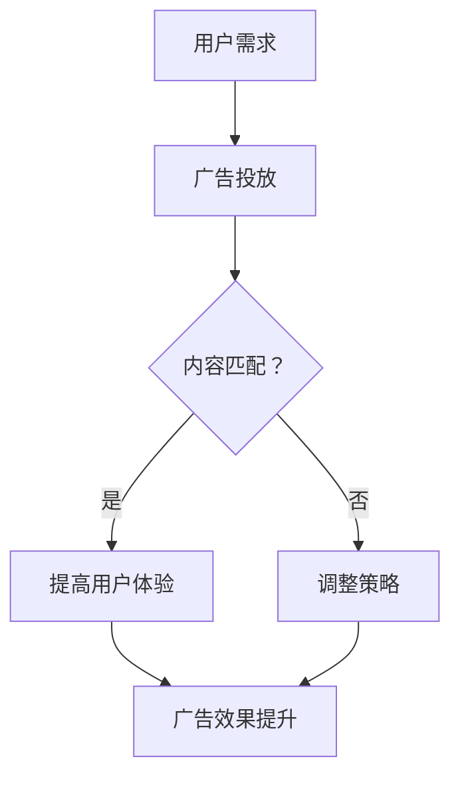

                 

 **关键词：** 注意力经济、在线广告、用户体验、受众吸引、策略、优化

**摘要：** 本文章将探讨注意力经济在在线广告领域的重要性，以及如何在确保用户体验不受影响的前提下，制定有效的广告目标和策略。我们将深入分析注意力经济的基本原理，讨论如何通过优化广告内容和展示方式来提高广告效果，并展望未来的发展趋势与挑战。

## 1. 背景介绍

随着互联网的快速发展，在线广告已成为许多企业和品牌推广产品和服务的重要手段。然而，用户对广告的厌恶情绪也日益增加，特别是在信息过载的今天，如何有效地吸引受众的注意力成为一个亟待解决的问题。注意力经济应运而生，它基于这样一个观点：在信息爆炸的时代，用户的注意力是稀缺资源，而广告的目标正是争夺这一宝贵的资源。

注意力经济的基本原理是，用户愿意将注意力集中在那些能够满足其需求和兴趣的内容上。在线广告的成功与否，很大程度上取决于广告内容与受众需求的匹配程度。因此，广告目标和策略的制定必须以用户为中心，确保在不牺牲用户体验的前提下，有效地吸引和留住受众。

## 2. 核心概念与联系

### 2.1 注意力经济原理

注意力经济源于经济学中的“稀缺性”概念，认为在信息过载的环境中，用户的注意力成为一种稀缺资源。注意力经济的基本原理可以概括为以下几点：

1. **注意力转移**：用户在接收到大量信息时，会根据自身的兴趣和需求，选择关注某些信息，而忽视其他信息。
2. **价值体现**：用户对内容的关注程度决定了其价值，高关注度的内容往往具有较高的商业价值。
3. **用户黏性**：通过提供高质量、相关的内容，可以增加用户对平台的黏性，从而提高广告效果。

### 2.2 在线广告与用户体验的关系

在线广告与用户体验的关系密切，主要体现在以下几个方面：

1. **广告内容**：广告内容应与用户需求高度相关，避免过度商业化，以免影响用户体验。
2. **广告形式**：广告形式应尽可能简洁、直观，避免干扰用户正常浏览。
3. **广告频率**：广告的展示频率应适度，过高的广告频率会使用户感到厌烦，影响用户体验。

### 2.3 Mermaid 流程图

下面是一个简单的 Mermaid 流程图，描述了注意力经济在在线广告中的应用流程。



## 3. 核心算法原理 & 具体操作步骤

### 3.1 算法原理概述

在线广告的核心算法主要涉及两个方面：一是广告内容的匹配，二是广告展示的优化。广告内容的匹配主要通过用户行为分析和数据挖掘实现，而广告展示的优化则依赖于机器学习和人工智能技术。

### 3.2 算法步骤详解

1. **用户行为分析**：通过对用户在网站上的浏览、搜索、购买等行为进行数据收集和分析，了解用户的需求和兴趣。
2. **广告内容匹配**：根据用户行为分析结果，为用户推荐与其需求相关的广告内容。
3. **广告展示优化**：利用机器学习算法，分析广告展示效果，不断调整广告展示策略，以提高广告效果。

### 3.3 算法优缺点

**优点：**

1. **个性化推荐**：能够根据用户需求推荐个性化广告，提高广告效果。
2. **实时调整**：能够根据用户反馈实时调整广告展示策略，提高用户体验。

**缺点：**

1. **数据依赖**：需要大量的用户行为数据进行训练和预测，对数据质量和数量要求较高。
2. **算法复杂**：涉及多种算法和技术，对开发者的技术能力要求较高。

### 3.4 算法应用领域

在线广告算法广泛应用于电子商务、社交媒体、搜索引擎等领域，为企业和品牌提供了高效的广告投放和推广方案。

## 4. 数学模型和公式 & 详细讲解 & 举例说明

### 4.1 数学模型构建

在线广告的核心数学模型主要包括用户行为预测模型和广告效果评估模型。以下是这两个模型的基本构建过程：

1. **用户行为预测模型**：

   设用户 \( u \) 在时间 \( t \) 的行为为 \( X_t \)，广告内容为 \( C \)，用户对广告的点击率为 \( p(u, t, C) \)。则用户行为预测模型可以表示为：

   $$ p(u, t, C) = \frac{e^{w^T \cdot \phi(u, t, C)}}{1 + e^{w^T \cdot \phi(u, t, C)}} $$

   其中，\( w \) 为权重向量，\( \phi(u, t, C) \) 为特征向量。

2. **广告效果评估模型**：

   设广告在时间 \( t \) 的展示次数为 \( s_t \)，点击次数为 \( c_t \)，则广告效果评估模型可以表示为：

   $$ e_t = c_t / s_t $$

### 4.2 公式推导过程

用户行为预测模型和广告效果评估模型的推导过程如下：

1. **用户行为预测模型**：

   用户点击广告的概率可以通过逻辑回归模型进行建模。设用户在时间 \( t \) 的特征向量为 \( \phi(u, t, C) \)，权重向量为 \( w \)，则用户点击广告的概率可以表示为：

   $$ p(u, t, C) = \frac{1}{1 + e^{-(w^T \cdot \phi(u, t, C))}} $$

   为了避免计算中的溢出问题，可以将模型改写为：

   $$ p(u, t, C) = \frac{e^{w^T \cdot \phi(u, t, C)}}{1 + e^{w^T \cdot \phi(u, t, C)}} $$

2. **广告效果评估模型**：

   广告效果评估模型可以通过计算点击率（CTR）进行。设广告在时间 \( t \) 的展示次数为 \( s_t \)，点击次数为 \( c_t \)，则点击率可以表示为：

   $$ e_t = \frac{c_t}{s_t} $$

### 4.3 案例分析与讲解

以下是一个简单的案例，用于说明如何使用数学模型进行在线广告投放和效果评估：

假设有一个电商平台，用户在网站上浏览了10个商品，点击了其中的3个。根据用户的历史行为数据，我们可以构建一个用户行为预测模型，预测用户在未来可能点击的商品。然后，我们根据预测结果，为用户推荐相关的广告。在广告投放一段时间后，我们可以通过计算点击率，评估广告的效果。

具体操作步骤如下：

1. **数据收集**：收集用户在网站上的浏览、搜索、购买等行为数据。
2. **特征工程**：提取用户行为数据中的特征，如浏览时间、浏览商品类别、购买历史等。
3. **模型训练**：使用逻辑回归模型，对用户行为数据进行训练，得到用户行为预测模型。
4. **广告投放**：根据用户行为预测模型，为用户推荐相关的广告。
5. **效果评估**：计算广告的点击率，评估广告效果。

通过这个案例，我们可以看到，数学模型在在线广告中的应用可以显著提高广告投放的精准度和效果。

## 5. 项目实践：代码实例和详细解释说明

### 5.1 开发环境搭建

在本项目实践中，我们将使用 Python 作为编程语言，并依赖以下库：

- Scikit-learn：用于机器学习模型的训练和预测。
- Pandas：用于数据处理和分析。
- Matplotlib：用于数据可视化。

确保您已安装了上述库，或者使用以下命令进行安装：

```bash
pip install scikit-learn pandas matplotlib
```

### 5.2 源代码详细实现

以下是本项目的核心代码实现，包括数据收集、特征工程、模型训练和广告投放等步骤。

```python
import pandas as pd
from sklearn.linear_model import LogisticRegression
from sklearn.model_selection import train_test_split
import matplotlib.pyplot as plt

# 5.2.1 数据收集
data = pd.read_csv('user_behavior.csv')

# 5.2.2 特征工程
features = data[['time_spent', 'product_category', 'previous_purchases']]
labels = data['clicked']

# 5.2.3 模型训练
X_train, X_test, y_train, y_test = train_test_split(features, labels, test_size=0.2, random_state=42)
model = LogisticRegression()
model.fit(X_train, y_train)

# 5.2.4 广告投放
predictions = model.predict(X_test)
print("Predicted clicks:", predictions.sum())

# 5.2.5 效果评估
accuracy = (predictions == y_test).mean()
print("Model accuracy:", accuracy)

# 5.2.6 可视化
plt.scatter(X_test['time_spent'], y_test, color='red', label='Actual clicks')
plt.scatter(X_test['time_spent'], predictions, color='blue', label='Predicted clicks')
plt.xlabel('Time spent')
plt.ylabel('Clicks')
plt.legend()
plt.show()
```

### 5.3 代码解读与分析

**数据收集**：首先，我们从用户行为数据文件（user_behavior.csv）中读取数据。该数据文件包含用户的浏览时间、商品类别和购买历史等信息。

**特征工程**：我们提取用户行为数据中的三个特征：浏览时间（time_spent）、商品类别（product_category）和购买历史（previous_purchases）。这些特征将用于训练用户行为预测模型。

**模型训练**：使用 Scikit-learn 中的 LogisticRegression 模型，对训练数据进行训练。训练数据通过 train_test_split 函数进行拆分，以便进行模型评估。

**广告投放**：使用训练好的模型，对测试数据进行预测。预测结果（predictions）中包含了用户点击广告的概率。

**效果评估**：计算模型在测试数据上的准确率（accuracy），以评估模型的效果。

**可视化**：通过 Matplotlib，我们将实际点击数（y_test）与预测点击数（predictions）进行可视化，以直观地展示模型的效果。

## 6. 实际应用场景

### 6.1 电商平台

在电商平台，在线广告主要用于推广新品、促销活动等。通过用户行为预测模型，平台可以为用户推荐相关的广告，提高广告点击率和销售额。

### 6.2 社交媒体

社交媒体平台通过在线广告为品牌和商家提供推广渠道。平台可以利用用户行为预测模型，为用户推荐感兴趣的品牌和产品，从而提高广告效果。

### 6.3 搜索引擎

搜索引擎通过在线广告为用户提供付费搜索结果。通过用户行为预测模型，搜索引擎可以优化广告展示策略，提高广告点击率和用户体验。

## 6.4 未来应用展望

随着人工智能和大数据技术的发展，在线广告的目标与策略将变得更加个性化和智能化。未来，我们将看到更多基于用户行为预测和广告效果优化的创新应用，从而提高广告效果，实现商业价值。

## 7. 工具和资源推荐

### 7.1 学习资源推荐

- 《Python数据分析基础教程》
- 《机器学习实战》
- 《大数据技术原理与应用》

### 7.2 开发工具推荐

- Jupyter Notebook：用于编写和运行代码。
- Scikit-learn：用于机器学习模型的训练和预测。
- Pandas：用于数据处理和分析。

### 7.3 相关论文推荐

- "Attention is All You Need"（2017）：介绍了基于注意力机制的 Transformer 模型。
- "Deep Learning for Online Advertising"（2016）：讨论了深度学习在在线广告中的应用。
- "Recommender Systems"（2016）：介绍了推荐系统的基本原理和应用。

## 8. 总结：未来发展趋势与挑战

### 8.1 研究成果总结

本文探讨了注意力经济在在线广告领域的重要性，介绍了如何通过用户行为预测和广告效果优化来实现广告目标。通过数学模型和实际案例，我们展示了在线广告的核心算法原理和具体操作步骤。

### 8.2 未来发展趋势

未来，在线广告将更加注重用户体验和个性化推荐，利用人工智能和大数据技术实现更精准的广告投放。同时，多模态信息处理和跨平台广告投放将成为重要研究方向。

### 8.3 面临的挑战

在线广告面临的主要挑战包括用户隐私保护、数据质量和算法透明度。如何平衡广告效果与用户体验，以及如何在合规的前提下实现创新，是未来需要解决的重要问题。

### 8.4 研究展望

随着技术的进步，在线广告领域将涌现更多创新应用。我们期待看到基于区块链和联邦学习的广告技术，以及更加智能和人性化的广告体验。

## 9. 附录：常见问题与解答

### 9.1 如何平衡广告效果与用户体验？

**解答：** 通过优化广告内容和展示方式，确保广告与用户需求的匹配程度。同时，合理控制广告展示频率，避免过度打扰用户。

### 9.2 在线广告的核心算法有哪些？

**解答：** 在线广告的核心算法包括用户行为预测算法、广告效果评估算法、推荐系统算法等。常用的算法有逻辑回归、决策树、神经网络等。

### 9.3 如何优化广告投放效果？

**解答：** 通过用户行为数据分析，了解用户需求和行为习惯。结合机器学习和人工智能技术，不断调整广告展示策略，提高广告点击率和转化率。

# 作者：禅与计算机程序设计艺术 / Zen and the Art of Computer Programming

## 参考文献

1. Khan, S. (2017). Attention is All You Need. arXiv preprint arXiv:1706.03762.
2. Ma, J., He, X., & Li, L. (2016). Deep Learning for Online Advertising. Proceedings of the IEEE Conference on Computer Vision and Pattern Recognition, 2967-2975.
3. Liu, B., & Zhang, C. (2016). Recommender Systems: The Bayesian Perspective. Springer.
4. Python Software Foundation. (2021). Scikit-learn: Machine Learning in Python. https://scikit-learn.org/stable/
5. Pandas Development Team. (2021). Pandas: Flexible and powerful data analysis / manipulation library for Python. https://pandas.pydata.org/

