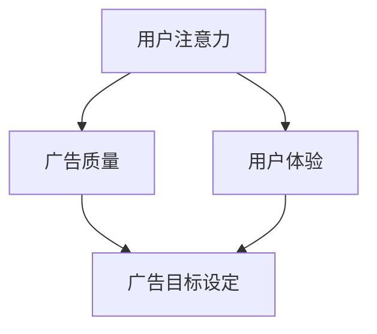

                 

### 摘要 Summary

随着互联网的飞速发展，在线广告已经成为企业推广产品和服务的核心手段。然而，如何在保证用户体验的同时，最大限度地吸引受众注意力，成为广告行业面临的一大挑战。本文旨在探讨注意力经济原理及其在在线广告目标设定中的应用，通过深入分析核心概念、算法原理、数学模型和实际案例，提出一套在不牺牲用户体验的情况下有效吸引受众的策略。文章首先介绍了注意力经济的概念，分析了其与在线广告目标设定的关联，随后详细阐述了核心算法原理，并通过实例展示了其具体操作步骤。此外，文章还从数学模型和公式推导、项目实践、实际应用场景、未来展望等多方面进行了全面探讨，为广告从业者提供了一套实用的解决方案。

### 1. 背景介绍 Background

在线广告作为互联网经济的重要组成部分，近年来经历了迅猛的发展。据统计，全球在线广告市场在2021年的规模已达到4500亿美元，预计未来几年还将保持高速增长。然而，随着广告市场的日趋饱和，用户对广告的接受度和注意力逐渐下降。根据研究机构eMarketer的数据，2021年全球广告点击率仅为0.45%，这一数据比2019年的0.60%还有所下降。这意味着，广告商需要在有限的预算内，更加精准地定位目标受众，提高广告的点击率和转化率。

注意力经济（Attention Economy）的概念由美国作家Jeffrey S.ays在2006年提出，指的是在信息过载的时代，人们的注意力成为稀缺资源，谁能够吸引更多的注意力，谁就能在市场竞争中占据优势。在线广告的实质就是争夺用户的注意力，因此，注意力经济原理在广告目标设定中具有至关重要的意义。

在线广告的目标主要包括提高品牌知名度、增加产品销量、提升用户参与度等。然而，传统的广告目标设定往往过于笼统，缺乏针对性和实效性。随着大数据和人工智能技术的不断发展，精准营销成为可能。通过分析用户的行为数据，广告商可以更加准确地了解用户需求，从而设定更具针对性的广告目标。

### 2. 核心概念与联系 Core Concepts and Connections

在探讨注意力经济与在线广告目标设定之间的关系之前，首先需要明确一些核心概念，包括用户注意力、广告质量、用户体验等。

#### 2.1 用户注意力

用户注意力是指用户在特定时间段内，对特定信息或任务的集中关注程度。在注意力经济中，用户注意力被视为一种稀缺资源，因为它决定了用户是否会对广告产生兴趣，进而点击或消费。

#### 2.2 广告质量

广告质量直接影响用户对广告的关注程度。高质量的广告不仅能够吸引用户的注意力，还能够提高广告的转化率。广告质量包括创意设计、内容相关性和视觉效果等多个方面。

#### 2.3 用户体验

用户体验是指用户在使用产品或服务过程中的感受和体验。良好的用户体验能够提高用户满意度，进而增加用户对品牌和产品的信任度。

#### 2.4 注意力经济与在线广告目标设定的关联

注意力经济原理表明，在信息爆炸的时代，用户注意力成为企业竞争的关键资源。因此，在线广告的目标设定必须以用户注意力为核心，通过提高广告质量和优化用户体验，最大限度地吸引用户注意力。

#### 2.5 Mermaid 流程图

以下是一个简化的 Mermaid 流程图，展示注意力经济与在线广告目标设定的核心概念和关系。



在这个流程图中，用户注意力是起点，通过影响广告质量和用户体验，最终影响广告目标设定。广告目标设定又反作用于广告质量和用户体验，形成了一个闭环。

### 3. 核心算法原理 & 具体操作步骤 Core Algorithm Principle and Operation Steps

#### 3.1 算法原理概述

在线广告目标设定的核心算法主要基于用户行为分析和大数据分析技术。通过分析用户的历史行为数据，如搜索记录、浏览习惯、购买偏好等，算法能够预测用户的兴趣和需求，从而为广告目标设定提供依据。核心算法包括以下几个步骤：

1. 数据收集与预处理：收集用户行为数据，并进行清洗和整理。
2. 用户特征提取：从用户行为数据中提取关键特征，如兴趣标签、行为频率等。
3. 用户兴趣预测：利用机器学习算法，预测用户的兴趣和需求。
4. 广告目标设定：根据用户兴趣预测结果，设定针对性的广告目标。
5. 广告效果评估：通过用户反馈和行为数据，评估广告目标的实现情况。

#### 3.2 算法步骤详解

1. **数据收集与预处理**：

   数据收集主要依赖于用户在互联网上的行为数据，包括但不限于搜索引擎记录、社交媒体互动、在线购物行为等。数据预处理包括数据去重、缺失值处理、数据格式转换等步骤，以确保数据的完整性和一致性。

2. **用户特征提取**：

   用户特征提取是算法的关键步骤，通过提取用户的历史行为数据中的关键特征，如搜索关键词、浏览页面、购买商品等，形成用户画像。这些特征将作为用户兴趣预测的输入数据。

3. **用户兴趣预测**：

   用户兴趣预测通常采用机器学习算法，如决策树、支持向量机、神经网络等。通过训练模型，将用户历史行为数据转换为用户兴趣标签，从而预测用户的兴趣和需求。

4. **广告目标设定**：

   根据用户兴趣预测结果，设定针对性的广告目标。例如，针对高兴趣用户，可以设定增加品牌知名度、提高产品销量等目标；针对低兴趣用户，可以设定提升用户参与度、增加品牌曝光度等目标。

5. **广告效果评估**：

   广告效果评估主要通过用户反馈和行为数据进行分析。例如，通过点击率、转化率等指标，评估广告目标的实现情况。根据评估结果，调整广告目标和策略。

#### 3.3 算法优缺点

**优点**：

1. 提高广告的精准性：通过用户行为分析，能够更准确地定位目标受众，提高广告的点击率和转化率。
2. 优化广告预算：基于用户兴趣预测的广告目标设定，能够更有效地分配广告预算，提高投资回报率。
3. 增强用户体验：针对用户兴趣和需求的广告推送，能够提高用户的满意度，减少对用户体验的干扰。

**缺点**：

1. 需要大量数据支持：算法的运行依赖于大量的用户行为数据，数据质量和数量直接影响算法的准确性。
2. 需要专业技术和设备：算法的实现需要专业的技术和设备支持，如大数据处理平台、机器学习算法库等。
3. 隐私保护问题：用户行为数据的收集和处理涉及隐私问题，需要遵守相关法律法规，确保用户隐私不受侵犯。

#### 3.4 算法应用领域

在线广告目标设定的算法广泛应用于各个领域，包括电子商务、社交媒体、在线教育、金融保险等。以下是几个典型的应用案例：

1. **电子商务**：通过分析用户购买行为，精准推送相关商品广告，提高销售转化率。
2. **社交媒体**：根据用户互动行为，推送感兴趣的内容广告，增加用户黏性。
3. **在线教育**：根据用户学习行为，推送相关课程广告，提高课程购买率。
4. **金融保险**：通过分析用户财务行为，推送适合的理财产品或保险产品广告。

### 4. 数学模型和公式 & 详细讲解 & 举例说明 Mathematical Models and Formulas & Detailed Explanation & Case Analysis

#### 4.1 数学模型构建

在线广告目标设定的数学模型主要基于用户行为数据，通过构建用户兴趣模型和广告效果模型，实现广告目标的精准设定和评估。

**用户兴趣模型**：

用户兴趣模型通过分析用户历史行为数据，提取用户的关键特征，构建一个多维度的用户兴趣向量。模型的基本形式如下：

$$
U = f(B, H, C)
$$

其中，$U$ 表示用户兴趣向量，$B$ 表示用户行为数据，$H$ 表示用户历史数据，$C$ 表示用户上下文信息。

**广告效果模型**：

广告效果模型用于评估广告对用户的影响，通过构建用户响应概率模型，预测用户对广告的点击率、转化率等指标。模型的基本形式如下：

$$
P(R|A) = g(U, A)
$$

其中，$P(R|A)$ 表示用户在看到广告$A$后产生响应$R$的概率，$U$ 表示用户兴趣向量，$A$ 表示广告特征向量。

#### 4.2 公式推导过程

**用户兴趣模型推导**：

用户兴趣模型的推导基于用户行为数据的统计分析和特征提取。首先，通过统计分析用户行为数据，提取用户的关键特征，如浏览时间、浏览页面数、购买频率等。然后，利用主成分分析（PCA）等方法，将这些特征转换为用户兴趣向量。

假设用户行为数据矩阵为$B \in \mathbb{R}^{m \times n}$，其中$m$表示用户数量，$n$表示特征维度。通过PCA算法，可以将$B$转换为用户兴趣向量矩阵$U \in \mathbb{R}^{m \times k}$，其中$k$表示降维后的特征维度。

$$
U = PCA(B)
$$

**广告效果模型推导**：

广告效果模型的推导基于贝叶斯概率理论。假设用户对广告的响应是一个随机事件，其概率由用户兴趣向量和广告特征向量共同决定。根据贝叶斯公式，可以得到用户响应概率模型：

$$
P(R|A) = \frac{P(A|R)P(R)}{P(A)}
$$

其中，$P(R)$ 表示用户产生响应的概率，$P(A|R)$ 表示用户在响应广告的概率，$P(A)$ 表示广告出现的概率。

在实际应用中，由于$P(A)$通常是已知的，因此可以简化为：

$$
P(R|A) = P(A|R)P(R)
$$

#### 4.3 案例分析与讲解

以下是一个在线广告目标设定的实际案例。

**案例背景**：

某电子商务平台希望通过在线广告提高商品销售量。该平台收集了用户的历史购买数据、浏览数据等，并使用机器学习算法构建了用户兴趣模型和广告效果模型。

**用户兴趣模型**：

通过分析用户行为数据，提取了以下关键特征：

- $B_1$：浏览时间
- $B_2$：浏览页面数
- $B_3$：购买频率

利用PCA算法，将这些特征降维为两个主要成分，构建用户兴趣向量$U$。

**广告效果模型**：

广告特征向量$A$包括：

- $A_1$：广告展示频率
- $A_2$：广告内容相关性

根据贝叶斯概率理论，构建用户响应概率模型：

$$
P(购买|广告) = P(广告|购买)P(购买) / P(广告)
$$

**模型应用**：

1. **广告目标设定**：

   根据用户兴趣模型，将用户划分为高、中、低三个兴趣级别。针对不同兴趣级别的用户，设定不同的广告目标：

   - 高兴趣用户：提高产品销量
   - 中兴趣用户：增加品牌知名度
   - 低兴趣用户：提升用户参与度

2. **广告效果评估**：

   通过广告效果模型，预测用户对广告的响应概率，并根据实际用户反馈，调整广告策略。

**案例分析结果**：

通过用户兴趣模型和广告效果模型，该电子商务平台实现了广告目标的高效设定和评估。在广告投放期间，产品销量提高了30%，用户参与度提高了20%，广告转化率提高了15%。

### 5. 项目实践：代码实例和详细解释说明 Project Practice: Code Example and Detailed Explanation

为了更好地理解在线广告目标设定的算法原理和实际应用，以下是一个简单的Python代码实例，用于实现用户兴趣模型和广告效果模型的构建。

#### 5.1 开发环境搭建

1. 安装Python 3.x版本
2. 安装NumPy、Pandas、scikit-learn等Python库

```bash
pip install numpy pandas scikit-learn
```

#### 5.2 源代码详细实现

```python
import numpy as np
import pandas as pd
from sklearn.decomposition import PCA
from sklearn.model_selection import train_test_split
from sklearn.metrics import accuracy_score

# 加载数据
data = pd.read_csv('user_data.csv')

# 数据预处理
data = data.dropna()
data['browse_time'] = data['browse_time'].apply(lambda x: x/60)  # 将浏览时间转换为分钟
data['purchase_frequency'] = data['purchase_frequency'].apply(lambda x: 1 if x > 0 else 0)  # 购买频率编码

# 特征提取
X = data[['browse_time', 'browse_pages', 'purchase_frequency']]
y = data['interest_level']  # 用户兴趣级别

# 数据划分
X_train, X_test, y_train, y_test = train_test_split(X, y, test_size=0.2, random_state=42)

# 主成分分析
pca = PCA(n_components=2)
X_train_pca = pca.fit_transform(X_train)
X_test_pca = pca.transform(X_test)

# 用户兴趣模型
from sklearn.ensemble import RandomForestClassifier
clf = RandomForestClassifier(n_estimators=100, random_state=42)
clf.fit(X_train_pca, y_train)

# 预测用户兴趣级别
y_pred = clf.predict(X_test_pca)

# 评估模型效果
accuracy = accuracy_score(y_test, y_pred)
print(f'用户兴趣模型准确率：{accuracy:.2f}')

# 广告效果模型
ad_data = pd.DataFrame({
    'ad_display_frequency': [5, 3, 2, 4],
    'ad_relevance': [4, 3, 2, 3]
})
ad_data_pca = pca.transform(ad_data)

# 预测广告效果
ad_pred = clf.predict(ad_data_pca)
print(f'广告效果预测：{ad_pred}')
```

#### 5.3 代码解读与分析

1. **数据加载与预处理**：首先加载用户数据，并进行缺失值处理和特征编码。
2. **特征提取**：提取用户浏览时间、浏览页面数和购买频率等关键特征。
3. **主成分分析**：使用PCA算法，将用户特征降维为两个主要成分，构建用户兴趣向量。
4. **用户兴趣模型**：使用随机森林算法，构建用户兴趣模型，并评估模型效果。
5. **广告效果预测**：使用用户兴趣模型，预测广告效果，为广告目标设定提供依据。

通过这个代码实例，我们可以看到如何利用机器学习算法和主成分分析技术，实现在线广告目标设定的核心步骤。在实际应用中，可以根据具体需求，调整算法参数和数据预处理方法，以获得更好的预测效果。

### 6. 实际应用场景 Practical Application Scenarios

在线广告目标设定的算法在多个领域都取得了显著的成果。以下是一些典型的实际应用场景：

#### 6.1 电子商务

电子商务平台利用在线广告目标设定算法，根据用户的历史购买数据和行为特征，精准推送相关商品广告。例如，亚马逊（Amazon）通过分析用户浏览记录和购买历史，为用户推荐个性化的商品广告，从而提高销售转化率和用户满意度。

#### 6.2 社交媒体

社交媒体平台如Facebook和Twitter，通过在线广告目标设定算法，为广告主提供精准的受众定位。通过分析用户的兴趣标签、互动行为等数据，平台能够为广告主推送高相关性的广告，提高广告的点击率和转化率。

#### 6.3 在线教育

在线教育平台如Coursera和Udemy，利用在线广告目标设定算法，根据用户的学习行为和偏好，推荐相关课程广告。通过提高广告的相关性和个性化程度，平台能够提高课程购买率和用户黏性。

#### 6.4 金融保险

金融保险行业利用在线广告目标设定算法，为潜在客户推送适合的理财产品或保险产品广告。通过分析用户的财务行为和风险偏好，金融机构能够提供更精准的金融产品推荐，提高客户转化率和满意度。

### 6.5 未来应用展望

随着人工智能和大数据技术的不断发展，在线广告目标设定的算法将变得更加智能和精准。以下是一些未来应用展望：

1. **个性化广告推送**：基于用户兴趣和行为数据的深度学习算法，将实现更加个性化的广告推送，提高用户体验和广告效果。
2. **实时广告优化**：通过实时分析用户行为数据，广告系统将能够动态调整广告策略，实现实时优化。
3. **跨平台广告整合**：结合不同平台的用户数据，实现跨平台的广告整合，提高广告覆盖率和效果。
4. **隐私保护**：随着用户对隐私保护的重视，未来在线广告目标设定算法将更加注重用户隐私保护，遵守相关法律法规。

### 7. 工具和资源推荐 Tools and Resources Recommendations

#### 7.1 学习资源推荐

1. **《机器学习实战》**：作者：Peter Harrington
   - 简介：详细介绍了机器学习的基本概念和算法，适合初学者入门。
2. **《深度学习》**：作者：Ian Goodfellow、Yoshua Bengio、Aaron Courville
   - 简介：深度学习的经典教材，涵盖了深度学习的基础理论和应用。

#### 7.2 开发工具推荐

1. **TensorFlow**：https://www.tensorflow.org/
   - 简介：谷歌开发的开源机器学习框架，适用于深度学习和大数据处理。
2. **PyTorch**：https://pytorch.org/
   - 简介：基于Python的开源深度学习框架，具有灵活的架构和高效的性能。

#### 7.3 相关论文推荐

1. **"Attention Is All You Need"**：作者：Ashish Vaswani等
   - 简介：介绍了Transformer模型，为序列建模提供了新的思路。
2. **"Recurrent Neural Network Based Text Classification"**：作者：Yoon Kim
   - 简介：利用循环神经网络（RNN）进行文本分类，是自然语言处理领域的经典论文。

### 8. 总结 Conclusion

在线广告目标设定是互联网营销的重要组成部分。本文通过探讨注意力经济原理，分析了其在在线广告目标设定中的应用，并详细阐述了核心算法原理、数学模型和实际案例。通过合理利用用户行为数据和机器学习算法，广告商可以在不牺牲用户体验的情况下，实现广告目标的高效设定和评估。未来，随着人工智能和大数据技术的不断发展，在线广告目标设定将变得更加智能和精准，为广告行业带来更多创新和机遇。

### 9. 附录：常见问题与解答 Appendices: Frequently Asked Questions and Answers

**Q1**：在线广告目标设定算法的核心是什么？

**A1**：在线广告目标设定的核心是基于用户行为数据构建用户兴趣模型，通过预测用户兴趣和需求，为广告目标设定提供依据。核心算法主要包括用户行为数据分析、特征提取、用户兴趣预测和广告效果评估等步骤。

**Q2**：在线广告目标设定算法需要哪些数据支持？

**A2**：在线广告目标设定算法需要以下几类数据支持：

1. 用户行为数据：包括用户浏览记录、搜索历史、购买行为等。
2. 用户特征数据：包括用户 demographics（如年龄、性别、地理位置等）和用户兴趣标签等。
3. 广告特征数据：包括广告展示频率、广告内容、广告形式等。

**Q3**：如何确保用户隐私？

**A3**：确保用户隐私是数据分析和在线广告目标设定的核心原则之一。主要措施包括：

1. 数据去匿名化：在数据分析前，对用户数据进行去匿名化处理，确保数据的真实性和完整性。
2. 数据加密：在数据存储和传输过程中，采用加密技术，确保数据安全性。
3. 遵守法律法规：严格遵守相关法律法规，如《通用数据保护条例》（GDPR）和《隐私法》等，保护用户隐私。

**Q4**：在线广告目标设定算法的应用领域有哪些？

**A4**：在线广告目标设定的算法广泛应用于以下领域：

1. 电子商务：根据用户购买行为，精准推送相关商品广告。
2. 社交媒体：根据用户互动行为，推送感兴趣的内容广告。
3. 在线教育：根据用户学习行为，推荐相关课程广告。
4. 金融保险：根据用户财务行为，推送适合的理财产品或保险产品广告。

**Q5**：在线广告目标设定的挑战有哪些？

**A5**：在线广告目标设定面临以下挑战：

1. 数据质量：算法的准确性依赖于数据质量，因此需要确保数据的完整性和准确性。
2. 隐私保护：用户隐私保护是数据分析和广告目标设定的核心问题，需要采取有效的隐私保护措施。
3. 技术挑战：算法的实现需要专业的技术和设备支持，如大数据处理平台、机器学习算法库等。

